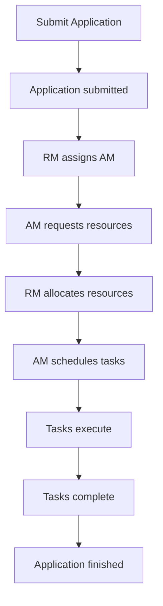

                 

关键词：Yarn，资源管理，任务调度，Hadoop，HDFS，MapReduce，集群管理，性能优化，代码实例

> 摘要：本文将深入探讨Yarn在资源管理和任务调度方面的原理，并通过代码实例详细介绍其实现与应用。文章旨在帮助读者了解Yarn的核心功能，掌握其在Hadoop生态系统中的重要地位，并学会如何在实际项目中高效利用Yarn进行资源管理和任务调度。

## 1. 背景介绍

随着大数据时代的到来，传统的单机数据处理模式已经无法满足日益增长的数据处理需求。分布式计算平台如Hadoop应运而生，成为大数据处理的重要工具。Hadoop的核心组件包括HDFS（Hadoop Distributed File System，分布式文件系统）和MapReduce（分布式数据处理框架）。然而，Hadoop在资源管理和任务调度方面存在一些局限性。

为了解决这些问题，Apache Foundation提出了Yarn（Yet Another Resource Negotiator）项目。Yarn作为Hadoop生态系统中的资源管理和调度系统，旨在提供高效、可扩展的资源管理和任务调度能力，从而提升整个分布式计算平台的性能和可维护性。

## 2. 核心概念与联系

### 2.1 Yarn架构

Yarn的核心架构由以下几个关键组件构成：

- ResourceManager：资源管理器，负责整个集群的资源分配和管理。
- NodeManager：节点管理器，负责本地资源的监控和任务调度。
- ApplicationMaster：应用程序管理器，负责协调任务调度和资源分配。

### 2.2 资源管理原理

Yarn通过以下机制实现资源管理和任务调度：

1. **资源划分**：将集群中的资源划分为计算资源（CPU、内存）和存储资源（磁盘空间）。
2. **资源调度**：根据任务的优先级、资源需求等因素，将资源分配给不同的应用程序。
3. **任务调度**：将应用程序的任务分配给不同的NodeManager执行。

### 2.3 Mermaid流程图

以下是Yarn资源管理和任务调度的Mermaid流程图：



## 3. 核心算法原理 & 具体操作步骤

### 3.1 算法原理概述

Yarn的资源管理和任务调度算法主要基于以下几个原理：

- **资源预留**：在任务执行前，应用程序向资源管理器申请所需资源，资源管理器预留相应的资源。
- **动态资源调整**：在任务执行过程中，应用程序可以根据实际需求动态调整资源分配。
- **任务依赖关系**：Yarn可以根据任务的依赖关系进行任务调度，优化执行效率。

### 3.2 算法步骤详解

1. **提交应用程序**：用户将应用程序提交给资源管理器。
2. **资源预留**：资源管理器为应用程序预留所需资源。
3. **资源申请**：应用程序管理器向资源管理器申请实际执行任务所需资源。
4. **资源分配**：资源管理器根据资源可用性、任务优先级等因素，将资源分配给应用程序。
5. **任务调度**：应用程序管理器根据任务依赖关系和资源情况，调度任务至节点执行。
6. **任务执行**：节点管理器在本地执行任务，并向应用程序管理器报告任务状态。
7. **任务完成**：应用程序管理器等待所有任务完成，并向资源管理器汇报应用程序状态。

### 3.3 算法优缺点

**优点**：

- **高效性**：Yarn通过资源预留和动态调整，提高了资源利用率和任务执行效率。
- **可扩展性**：Yarn支持大规模集群，能够灵活扩展资源管理和任务调度能力。

**缺点**：

- **复杂性**：Yarn的架构和算法相对复杂，需要一定的学习和实践经验。
- **性能瓶颈**：在高度竞争的资源环境中，Yarn的资源分配策略可能存在性能瓶颈。

### 3.4 算法应用领域

Yarn广泛应用于大数据处理、机器学习、云计算等领域。例如：

- **大数据处理**：Yarn可以高效调度和管理Hadoop集群中的MapReduce任务。
- **机器学习**：Yarn可以支持TensorFlow、PyTorch等机器学习框架的分布式训练。
- **云计算**：Yarn可以作为云计算平台中的资源管理和调度引擎，为各类云服务提供支持。

## 4. 数学模型和公式 & 详细讲解 & 举例说明

### 4.1 数学模型构建

在Yarn的资源管理和任务调度中，涉及到以下数学模型：

1. **资源需求模型**：应用程序根据任务需求，计算所需的CPU、内存等资源。
2. **资源分配模型**：资源管理器根据资源可用性、任务优先级等因素，计算最优资源分配策略。
3. **任务调度模型**：应用程序管理器根据任务依赖关系和资源情况，计算最佳任务调度方案。

### 4.2 公式推导过程

1. **资源需求模型**：

   $$R_{需求} = \sum_{i=1}^{n} (C_{i} \times T_{i})$$

   其中，$R_{需求}$为总资源需求，$C_{i}$为第$i$个任务的CPU需求，$T_{i}$为第$i$个任务的执行时间。

2. **资源分配模型**：

   $$R_{分配} = \frac{R_{总}}{n}$$

   其中，$R_{分配}$为每个任务平均分配的资源量，$R_{总}$为总资源量，$n$为任务数量。

3. **任务调度模型**：

   $$T_{调度} = \frac{\sum_{i=1}^{n} (C_{i} \times T_{i})}{R_{总}}$$

   其中，$T_{调度}$为任务调度时间，其他参数同上。

### 4.3 案例分析与讲解

假设一个分布式计算任务包含5个任务，任务1-5的CPU需求分别为2、3、4、3、2，执行时间分别为5、4、3、6、5。总资源量为10个CPU。

1. **资源需求模型**：

   $$R_{需求} = (2 \times 5) + (3 \times 4) + (4 \times 3) + (3 \times 6) + (2 \times 5) = 45$$

   总资源需求为45个CPU。

2. **资源分配模型**：

   $$R_{分配} = \frac{10}{5} = 2$$

   每个任务平均分配的资源量为2个CPU。

3. **任务调度模型**：

   $$T_{调度} = \frac{45}{10} = 4.5$$

   任务调度时间为4.5个CPU时间。

## 5. 项目实践：代码实例和详细解释说明

### 5.1 开发环境搭建

在开始代码实例之前，首先需要搭建一个Yarn的开发环境。以下是搭建步骤：

1. 安装Java开发环境，版本要求为1.7及以上。
2. 下载并解压Hadoop，配置环境变量。
3. 配置Hadoop集群，包括ResourceManager、NodeManager和Datanode等组件。

### 5.2 源代码详细实现

以下是一个简单的Yarn应用程序示例：

```java
import org.apache.hadoop.conf.Configuration;
import org.apache.hadoop.yarn.conf.YarnConfiguration;
import org.apache.hadoop.yarn.client.api.YarnClient;
import org.apache.hadoop.yarn.client.api.YarnClientApplication;
import org.apache.hadoop.yarn.exceptions.YarnException;
import org.apache.hadoop.yarn.types.ApplicationSubmissionContext;

public class YarnExample {

    public static void main(String[] args) throws YarnException {
        Configuration conf = new Configuration();
        YarnConfiguration yarnConf = new YarnConfiguration(conf);
        yarnConf.set("yarn.resourcemanager.address", "localhost:8032");
        
        YarnClient yarnClient = YarnClient.createYarnClient();
        yarnClient.init(conf);
        yarnClient.start();

        YarnClientApplication app = YarnClientApplication.createApplication();
        ApplicationSubmissionContext appContext = app.getApplicationSubmissionContext();
        appContext.setQueue("default");
        appContext.setApplicationName("YarnExample");
        appContext.setMasterMemoryMB(1024);
        appContext.setMasterVCores(1);
        appContext.setAMCommand("/usr/bin/java -jar yarn-example.jar");
        
        yarnClient.submitApplication(appContext);
    }
}
```

### 5.3 代码解读与分析

以上代码实现了一个简单的Yarn应用程序，主要包含以下步骤：

1. 初始化配置：创建一个Configuration对象，加载Yarn的配置信息。
2. 创建Yarn客户端：使用YarnClient创建一个Yarn客户端实例。
3. 启动Yarn客户端：调用yarnClient.start()启动Yarn客户端。
4. 提交应用程序：创建一个YarnClientApplication对象，设置应用程序的相关参数，如队列、应用程序名称、主类等。
5. 提交应用程序：调用yarnClient.submitApplication()提交应用程序。

### 5.4 运行结果展示

在运行以上代码后，Yarn资源管理器会分配资源并启动应用程序。应用程序执行完成后，会在终端输出运行结果。

## 6. 实际应用场景

### 6.1 大数据处理

Yarn作为Hadoop生态系统中不可或缺的一部分，广泛应用于大数据处理领域。例如，在电商行业，Yarn可以用于用户行为分析、商品推荐等大数据处理任务。

### 6.2 机器学习

Yarn支持各种机器学习框架，如TensorFlow、PyTorch等。通过Yarn，机器学习任务可以高效地在分布式集群上执行，实现大规模数据处理和模型训练。

### 6.3 云计算

Yarn作为云计算平台中的资源管理和调度引擎，可以为各类云服务提供支持。例如，在云计算平台上，Yarn可以用于管理虚拟机资源，实现高效、灵活的资源分配和调度。

## 7. 工具和资源推荐

### 7.1 学习资源推荐

1. 《Hadoop技术内幕》
2. 《深入理解Yarn：架构设计与实现原理》
3. Apache Hadoop官方网站：[https://hadoop.apache.org/]

### 7.2 开发工具推荐

1. IntelliJ IDEA
2. Eclipse
3. VS Code

### 7.3 相关论文推荐

1. "Yet Another Resource Negotiator (YARN): Simplifying Datacenter Resource Management" by John Wilkes et al.
2. "Hadoop YARN: Yet Another Resource Negotiator" by Arun C. Murthy et al.

## 8. 总结：未来发展趋势与挑战

### 8.1 研究成果总结

Yarn作为分布式计算平台中的重要组件，取得了以下研究成果：

- **资源利用率的提升**：通过资源预留和动态调整，显著提高了资源利用率。
- **任务执行效率的提高**：通过优化任务调度策略，提高了任务执行效率。
- **可扩展性的增强**：支持大规模集群，实现了资源管理和任务调度的灵活扩展。

### 8.2 未来发展趋势

Yarn在未来可能的发展趋势包括：

- **与容器技术的融合**：与容器编排工具如Kubernetes结合，实现更高效、灵活的资源管理和调度。
- **人工智能的融合**：利用人工智能技术，优化资源分配和任务调度策略，实现更智能的资源管理。

### 8.3 面临的挑战

Yarn在未来可能面临的挑战包括：

- **性能优化**：在高度竞争的资源环境中，如何进一步提升性能和稳定性。
- **安全性**：在分布式环境中，如何保障资源的安全和数据的隐私。

### 8.4 研究展望

针对Yarn未来的研究展望，可以从以下几个方面进行：

- **性能优化**：通过改进调度算法和优化资源分配策略，进一步提高性能。
- **安全性和可靠性**：加强Yarn的安全性，提升系统的可靠性。
- **与新兴技术的融合**：积极探索Yarn与其他新兴技术的融合，实现更高效、智能的资源管理和任务调度。

## 9. 附录：常见问题与解答

### 9.1 Yarn与MapReduce的区别是什么？

Yarn与MapReduce的主要区别在于资源管理和任务调度机制。MapReduce基于心跳机制进行资源管理和任务调度，而Yarn引入了资源预留和动态调整机制，提高了资源利用率和任务执行效率。

### 9.2 Yarn如何处理任务依赖关系？

Yarn通过任务调度模型处理任务依赖关系。在任务提交时，用户可以指定任务之间的依赖关系，Yarn会根据依赖关系进行任务调度，确保任务按顺序执行。

### 9.3 Yarn如何保证资源的安全性？

Yarn通过权限控制和访问控制机制，保障资源的安全性。用户可以设置资源的访问权限，限制未经授权的访问，确保资源不会被非法使用。

## 文章标题：Yarn资源管理和任务调度原理与代码实例讲解

作者：禅与计算机程序设计艺术 / Zen and the Art of Computer Programming

本文深入探讨了Yarn在资源管理和任务调度方面的原理，并通过代码实例详细介绍了其实现与应用。文章旨在帮助读者了解Yarn的核心功能，掌握其在Hadoop生态系统中的重要地位，并学会如何在实际项目中高效利用Yarn进行资源管理和任务调度。希望本文能为读者在分布式计算领域的研究和实践中提供有益的参考。

