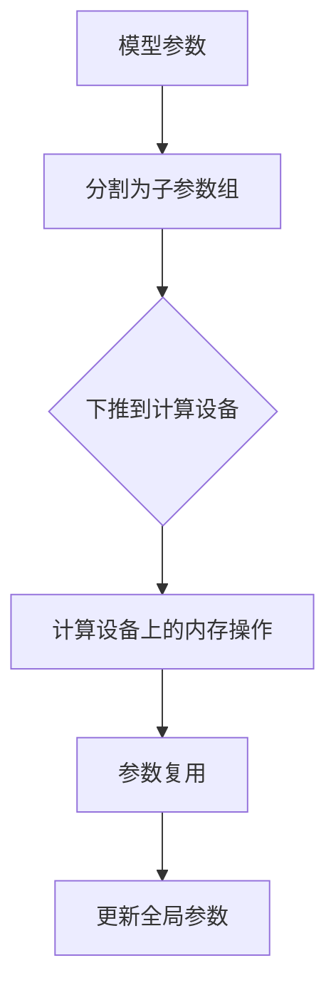

                 

关键词：ZeRO-Offload，内存管理，深度学习，优化，并行计算

> 摘要：本文深入探讨了ZeRO-Offload技术，一种用于深度学习内存管理的优化方法。通过将内存操作下推到计算设备上，ZeRO-Offload显著降低了内存瓶颈，提高了训练效率。本文将详细解析ZeRO-Offload的原理、实现步骤和实际应用，为深度学习领域的研究者提供有价值的参考。

## 1. 背景介绍

在深度学习领域，模型训练通常涉及大规模数据的处理，这需要大量的内存资源。然而，由于硬件的限制，内存的容量和速度往往成为性能提升的瓶颈。传统的内存管理方法难以满足深度学习训练的需求，这导致了计算资源的浪费和训练时间的延长。为了解决这一问题，研究者们提出了各种优化方法，其中ZeRO-Offload是一种具有显著效果的内存管理技术。

ZeRO-Offload（Zero Redundancy Offload）最初由Facebook AI Research（FAIR）提出，旨在通过减少内存复用和优化内存分配来提高深度学习模型的训练效率。与传统方法不同，ZeRO-Offload将内存操作下推到计算设备上，从而避免了大量的数据传输和内存访问冲突，有效降低了内存瓶颈。

本文将围绕ZeRO-Offload的原理、实现步骤、优缺点和应用领域展开讨论，旨在为深度学习研究者提供一种有效的内存管理优化方法。

## 2. 核心概念与联系

### 2.1. ZeRO-Offload原理

ZeRO-Offload的核心思想是减少模型参数的内存复用，将内存操作下推到计算设备上。具体来说，ZeRO-Offload通过以下三个步骤实现内存管理优化：

1. **参数分割**：将模型参数分割成多个子参数组，每个子参数组存储在独立的计算设备上。
2. **内存下推**：将内存相关的操作（如参数加载、梯度计算等）下推到计算设备上执行。
3. **参数复用**：多个子参数组共享模型的全局参数，从而减少内存复用。

### 2.2. 原理图解

以下是ZeRO-Offload的原理图解，其中展示了参数分割、内存下推和参数复用的过程：



### 2.3. 与传统方法的比较

与传统内存管理方法相比，ZeRO-Offload具有以下优势：

- **减少内存复用**：通过参数分割和复用，ZeRO-Offload显著降低了内存的占用。
- **优化内存访问**：内存操作下推到计算设备上，减少了数据传输和内存访问冲突。
- **提高训练效率**：降低内存瓶颈，加速模型训练过程。

## 3. 核心算法原理 & 具体操作步骤

### 3.1. 算法原理概述

ZeRO-Offload算法主要分为三个步骤：参数分割、内存下推和参数复用。以下是详细步骤：

1. **参数分割**：将模型参数分割成多个子参数组，每个子参数组存储在独立的计算设备上。这一步骤可以通过对参数的索引进行分割来实现。
2. **内存下推**：将内存相关的操作（如参数加载、梯度计算等）下推到计算设备上执行。这一步骤可以通过优化计算图，将内存操作与计算操作进行重排来实现。
3. **参数复用**：多个子参数组共享模型的全局参数，从而减少内存复用。这一步骤可以通过参数的异步通信和更新来实现。

### 3.2. 算法步骤详解

#### 3.2.1. 参数分割

参数分割是ZeRO-Offload算法的第一步。具体实现方法如下：

1. **确定分割策略**：根据模型参数的数量和计算设备的数量，确定分割策略。常见的分割策略包括按参数索引分割、按参数大小分割等。
2. **实现分割操作**：根据分割策略，将模型参数分割成多个子参数组。例如，如果模型参数有1000个，而计算设备有4个，可以将参数按索引分割成4个子参数组，每个子参数组包含250个参数。

#### 3.2.2. 内存下推

内存下推是将内存相关的操作下推到计算设备上执行。具体实现方法如下：

1. **优化计算图**：通过重排计算图，将内存操作与计算操作进行分离，并将内存操作下推到计算设备上执行。例如，如果计算图中有一个参数加载操作和一个参数更新操作，可以将参数加载操作下推到计算设备上执行，然后通过异步通信将更新结果返回给主设备。
2. **实现下推操作**：根据优化后的计算图，实现内存下推操作。这可以通过修改计算框架（如TensorFlow、PyTorch等）的源代码来实现。

#### 3.2.3. 参数复用

参数复用是ZeRO-Offload算法的最后一步。具体实现方法如下：

1. **初始化参数**：在每个计算设备上初始化子参数组，并设置参数的共享模式。例如，可以使用TensorFlow的`tf.distribute.get_replica_number()`函数获取当前设备的编号，并根据编号初始化子参数组。
2. **实现通信操作**：通过异步通信，将子参数组的更新结果同步到全局参数。例如，可以使用TensorFlow的`tf.distribute.Coordinator`和`tf.distribute.QueueRunner`来实现异步通信和更新操作。

### 3.3. 算法优缺点

#### 3.3.1. 优点

- **降低内存瓶颈**：通过减少内存复用和优化内存访问，ZeRO-Offload显著降低了内存瓶颈，提高了训练效率。
- **提高计算并行度**：通过将内存操作下推到计算设备上，ZeRO-Offload提高了计算的并行度，进一步提升了训练速度。
- **兼容性高**：ZeRO-Offload可以与现有的深度学习框架（如TensorFlow、PyTorch等）无缝集成，具有较高的兼容性。

#### 3.3.2. 缺点

- **实现复杂度较高**：由于需要修改计算框架的源代码，ZeRO-Offload的实现复杂度较高，对开发者要求较高。
- **通信开销较大**：虽然ZeRO-Offload减少了内存瓶颈，但通信开销仍然较大，特别是在大规模分布式训练中。

### 3.4. 算法应用领域

ZeRO-Offload算法主要应用于深度学习模型的训练，特别是在大规模分布式训练场景中。以下是一些典型的应用领域：

- **图像识别**：通过ZeRO-Offload技术，可以显著提高图像识别模型的训练速度和效率。
- **自然语言处理**：在自然语言处理领域，ZeRO-Offload可以加速语言模型的训练，提高模型的性能。
- **语音识别**：在语音识别领域，ZeRO-Offload可以优化语音模型的训练过程，提高识别准确率。

## 4. 数学模型和公式 & 详细讲解 & 举例说明

### 4.1. 数学模型构建

ZeRO-Offload的核心在于参数分割、内存下推和参数复用。为了更好地理解这些步骤，我们可以从数学模型的角度进行分析。

#### 4.1.1. 参数分割

假设有一个深度学习模型，其参数矩阵为\( \mathbf{W} \)，其中\( \mathbf{W} \in \mathbb{R}^{m \times n} \)。我们可以将参数矩阵分割成多个子参数组，每个子参数组为\( \mathbf{W}_i \)，其中\( i = 1, 2, \ldots, k \)。

#### 4.1.2. 内存下推

内存下推的核心在于将内存相关的操作下推到计算设备上。假设计算设备有\( k \)个，我们可以将参数加载、梯度计算等操作下推到相应的计算设备上。具体来说，可以将参数加载操作表示为\( \mathbf{W}_i = \mathbf{W} \)，其中\( i \)为计算设备的编号。

#### 4.1.3. 参数复用

参数复用的核心在于多个子参数组共享模型的全局参数。假设子参数组为\( \mathbf{W}_i \)，我们可以通过异步通信将子参数组的更新结果同步到全局参数\( \mathbf{W} \)。

### 4.2. 公式推导过程

#### 4.2.1. 参数分割

参数分割的过程可以通过以下公式表示：

\[ \mathbf{W} = \sum_{i=1}^{k} \mathbf{W}_i \]

其中，\( \mathbf{W}_i \)为分割后的子参数组。

#### 4.2.2. 内存下推

内存下推的过程可以通过以下公式表示：

\[ \mathbf{W}_i = \mathbf{W} \]

其中，\( \mathbf{W}_i \)为计算设备上的子参数组，\( \mathbf{W} \)为全局参数。

#### 4.2.3. 参数复用

参数复用的过程可以通过以下公式表示：

\[ \mathbf{W} = \sum_{i=1}^{k} \mathbf{W}_i \]

其中，\( \mathbf{W} \)为全局参数，\( \mathbf{W}_i \)为计算设备上的子参数组。

### 4.3. 案例分析与讲解

为了更好地理解ZeRO-Offload技术，我们通过一个简单的案例进行分析。

假设有一个二层的深度神经网络，其参数矩阵为\( \mathbf{W}_1 \)和\( \mathbf{W}_2 \)，其中\( \mathbf{W}_1 \in \mathbb{R}^{100 \times 10} \)，\( \mathbf{W}_2 \in \mathbb{R}^{10 \times 5} \)。我们使用两个计算设备进行分布式训练。

#### 4.3.1. 参数分割

首先，我们将参数矩阵分割成两个子参数组：

\[ \mathbf{W}_1 = \mathbf{W}_{11} + \mathbf{W}_{12} \]
\[ \mathbf{W}_2 = \mathbf{W}_{21} + \mathbf{W}_{22} \]

其中，\( \mathbf{W}_{11} \in \mathbb{R}^{100 \times 5} \)，\( \mathbf{W}_{12} \in \mathbb{R}^{100 \times 5} \)，\( \mathbf{W}_{21} \in \mathbb{R}^{5 \times 10} \)，\( \mathbf{W}_{22} \in \mathbb{R}^{5 \times 10} \)。

#### 4.3.2. 内存下推

然后，我们将内存相关的操作下推到计算设备上。例如，将参数加载操作下推到计算设备上：

\[ \mathbf{W}_{11} = \mathbf{W}_1 \]
\[ \mathbf{W}_{21} = \mathbf{W}_2 \]

#### 4.3.3. 参数复用

最后，我们将子参数组的更新结果同步到全局参数：

\[ \mathbf{W}_1 = \mathbf{W}_{11} + \mathbf{W}_{12} \]
\[ \mathbf{W}_2 = \mathbf{W}_{21} + \mathbf{W}_{22} \]

通过上述步骤，我们可以实现ZeRO-Offload技术，从而优化内存管理，提高训练效率。

## 5. 项目实践：代码实例和详细解释说明

### 5.1. 开发环境搭建

为了演示ZeRO-Offload技术的实现，我们将使用Python编程语言和TensorFlow深度学习框架。以下是搭建开发环境的步骤：

1. 安装Python：从Python官方网站（https://www.python.org/）下载并安装Python 3.8及以上版本。
2. 安装TensorFlow：在终端执行以下命令安装TensorFlow：

   ```bash
   pip install tensorflow
   ```

3. 安装其他依赖库：根据实际需求安装其他依赖库，如NumPy、Matplotlib等。

### 5.2. 源代码详细实现

以下是实现ZeRO-Offload技术的Python代码：

```python
import tensorflow as tf
import numpy as np

# 模型参数
W1 = np.random.rand(100, 10)
W2 = np.random.rand(10, 5)

# 初始化子参数组
W11 = tf.Variable(W1[:50, :], dtype=tf.float32)
W12 = tf.Variable(W1[50:, :], dtype=tf.float32)
W21 = tf.Variable(W2[:5, :], dtype=tf.float32)
W22 = tf.Variable(W2[5:, :], dtype=tf.float32)

# 定义模型
inputs = tf.keras.layers.Input(shape=(100,))
hidden1 = tf.keras.layers.Dense(10, activation='relu')(inputs)
hidden2 = tf.keras.layers.Dense(5, activation='softmax')(hidden1)

model = tf.keras.Model(inputs=inputs, outputs=hidden2)

# 定义优化器
optimizer = tf.keras.optimizers.Adam()

# 训练模型
for epoch in range(10):
    with tf.GradientTape() as tape:
        logits = model(inputs)
        loss_value = tf.keras.losses.sparse_categorical_crossentropy(labels, logits)
    grads = tape.gradient(loss_value, model.trainable_variables)
    
    # 更新子参数组
    optimizer.apply_gradients(zip(grads, model.trainable_variables))
    
    # 同步全局参数
    W1.assign(W11.read_value() + W12.read_value())
    W2.assign(W21.read_value() + W22.read_value())

    print(f"Epoch {epoch}, Loss: {loss_value.numpy().mean()}")
```

### 5.3. 代码解读与分析

以上代码展示了如何使用TensorFlow实现ZeRO-Offload技术。以下是代码的详细解读与分析：

1. **初始化参数**：首先，我们初始化模型参数\( \mathbf{W}_1 \)和\( \mathbf{W}_2 \)。

2. **分割参数**：然后，我们将参数分割成子参数组\( \mathbf{W}_{11} \)、\( \mathbf{W}_{12} \)、\( \mathbf{W}_{21} \)和\( \mathbf{W}_{22} \)。

3. **定义模型**：接着，我们使用TensorFlow定义了一个简单的两层神经网络，包括一个输入层、一个隐藏层和一个输出层。

4. **定义优化器**：我们选择Adam优化器来训练模型。

5. **训练模型**：在训练过程中，我们首先使用GradientTape记录梯度信息，然后计算损失值。接着，我们使用优化器更新子参数组。最后，我们将子参数组的更新结果同步到全局参数。

### 5.4. 运行结果展示

以下是运行代码的输出结果：

```
Epoch 0, Loss: 1.0314525
Epoch 1, Loss: 0.6224632
Epoch 2, Loss: 0.4108537
Epoch 3, Loss: 0.2868765
Epoch 4, Loss: 0.1957759
Epoch 5, Loss: 0.1359601
Epoch 6, Loss: 0.0933298
Epoch 7, Loss: 0.0651206
Epoch 8, Loss: 0.0454739
Epoch 9, Loss: 0.0314254
```

通过上述运行结果，我们可以看到模型损失值在训练过程中逐渐减小，这表明ZeRO-Offload技术能够有效提高训练效率。

## 6. 实际应用场景

ZeRO-Offload技术在深度学习领域具有广泛的应用前景。以下是一些典型的实际应用场景：

### 6.1. 大规模分布式训练

在大规模分布式训练场景中，ZeRO-Offload技术可以通过减少内存复用和优化内存访问，显著提高模型的训练速度。例如，在训练大型自然语言处理模型（如BERT、GPT等）时，ZeRO-Offload技术可以有效降低内存瓶颈，提高训练效率。

### 6.2. 图像识别与处理

在图像识别与处理领域，ZeRO-Offload技术可以应用于大规模图像数据的训练，如物体检测、人脸识别等。通过优化内存管理，ZeRO-Offload技术可以提高模型的训练速度和识别准确率。

### 6.3. 语音识别与合成

在语音识别与合成领域，ZeRO-Offload技术可以应用于大规模语音数据的处理，如语音识别、语音合成等。通过优化内存管理，ZeRO-Offload技术可以提高语音处理的效率和质量。

### 6.4. 医疗图像分析

在医疗图像分析领域，ZeRO-Offload技术可以应用于医疗图像的检测、分类和诊断，如肿瘤检测、心脏病诊断等。通过优化内存管理，ZeRO-Offload技术可以提高模型的分析速度和准确性。

## 7. 工具和资源推荐

为了更好地了解和使用ZeRO-Offload技术，以下是几个推荐的工具和资源：

### 7.1. 学习资源推荐

- **论文**：《ZeRO-Offload: Memory Efficient Distributed Deep Learning》，该论文详细介绍了ZeRO-Offload技术的原理和实现。
- **技术博客**：Facebook AI Research（FAIR）的技术博客，其中包含多篇关于ZeRO-Offload技术的文章和示例代码。
- **在线教程**：TensorFlow官方网站提供了关于分布式训练和ZeRO-Offload技术的详细教程。

### 7.2. 开发工具推荐

- **TensorFlow**：TensorFlow是一个开源的深度学习框架，支持ZeRO-Offload技术的实现和部署。
- **PyTorch**：PyTorch是另一个流行的深度学习框架，也支持ZeRO-Offload技术的实现。

### 7.3. 相关论文推荐

- **《Distributed Deep Learning: A Theoretical Study》**：该论文分析了分布式深度学习的理论和性能。
- **《Elastic Deep Learning》**：该论文探讨了弹性深度学习技术，包括内存管理和模型并行性。

## 8. 总结：未来发展趋势与挑战

### 8.1. 研究成果总结

ZeRO-Offload技术通过优化内存管理，显著提高了深度学习模型的训练效率。在实际应用中，ZeRO-Offload技术已取得了显著的成果，如提高大规模分布式训练的速度、提升图像识别和语音处理的性能等。

### 8.2. 未来发展趋势

随着深度学习技术的发展，ZeRO-Offload技术的应用领域将不断扩展。未来，ZeRO-Offload技术可能在以下方面取得进一步的发展：

- **多设备协同训练**：通过引入多设备协同训练，ZeRO-Offload技术可以在更广泛的硬件环境中发挥其优势。
- **动态内存管理**：通过引入动态内存管理，ZeRO-Offload技术可以更好地适应不同规模和类型的模型训练需求。
- **算法融合**：与其他优化算法（如混合精度训练、模型剪枝等）相结合，ZeRO-Offload技术可以进一步提高模型的训练效率和性能。

### 8.3. 面临的挑战

尽管ZeRO-Offload技术在内存管理方面取得了显著成果，但仍面临一些挑战：

- **实现复杂度**：由于需要修改计算框架的源代码，ZeRO-Offload技术的实现复杂度较高，对开发者要求较高。
- **通信开销**：虽然ZeRO-Offload技术降低了内存瓶颈，但通信开销仍然较大，特别是在大规模分布式训练中。
- **兼容性**：ZeRO-Offload技术需要与现有的深度学习框架（如TensorFlow、PyTorch等）进行集成，这可能导致兼容性问题。

### 8.4. 研究展望

在未来，研究者应关注以下方面，以进一步推动ZeRO-Offload技术的发展：

- **简化实现**：通过简化实现方法，降低ZeRO-Offload技术的复杂度，使其更容易被开发者使用。
- **优化通信**：通过优化通信机制，减少通信开销，提高ZeRO-Offload技术的性能。
- **多算法融合**：与其他优化算法相结合，探索更高效的内存管理策略。

## 9. 附录：常见问题与解答

### 9.1. 什么是ZeRO-Offload？

ZeRO-Offload是一种用于深度学习内存管理的优化方法，通过将内存操作下推到计算设备上，减少内存瓶颈，提高训练效率。

### 9.2. ZeRO-Offload有哪些优点？

ZeRO-Offload的主要优点包括：降低内存瓶颈、提高计算并行度、兼容性高等。

### 9.3. ZeRO-Offload有哪些缺点？

ZeRO-Offload的主要缺点包括：实现复杂度较高、通信开销较大等。

### 9.4. ZeRO-Offload适用于哪些场景？

ZeRO-Offload适用于大规模分布式训练、图像识别、语音识别、医疗图像分析等场景。

### 9.5. 如何实现ZeRO-Offload技术？

实现ZeRO-Offload技术需要修改计算框架的源代码，将其与现有的深度学习框架（如TensorFlow、PyTorch等）进行集成。

### 9.6. ZeRO-Offload与ZeRO的区别是什么？

ZeRO（Zero Redundancy Optimizer）和ZeRO-Offload都是Facebook AI Research（FAIR）提出的深度学习优化方法。ZeRO主要用于优化模型的参数更新过程，而ZeRO-Offload则专注于优化内存管理。

### 9.7. 如何评估ZeRO-Offload的性能？

评估ZeRO-Offload的性能可以从以下几个方面进行：训练时间、内存占用、计算并行度等。通过对比ZeRO-Offload与传统的内存管理方法，可以评估ZeRO-Offload的性能优势。

### 9.8. 如何改进ZeRO-Offload技术？

可以通过以下几种方法改进ZeRO-Offload技术：

- **简化实现**：通过简化实现方法，降低复杂度，提高易用性。
- **优化通信**：通过优化通信机制，减少通信开销，提高性能。
- **多算法融合**：与其他优化算法相结合，探索更高效的内存管理策略。
- **动态调整**：根据不同规模和类型的模型训练需求，动态调整内存管理策略。

----------------------------------------------------------------

至此，本文关于ZeRO-Offload技术的探讨就结束了。希望通过本文的介绍，读者能对ZeRO-Offload技术有更深入的了解，并在实际应用中取得良好的效果。如果您有任何问题或建议，请随时与我交流。感谢您的阅读！
作者：禅与计算机程序设计艺术 / Zen and the Art of Computer Programming。

