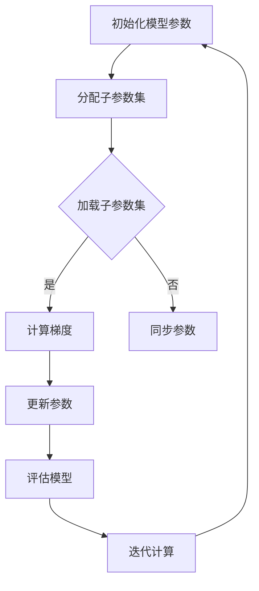

                 

关键词：ZeRO优化、分布式训练、并行计算、通信效率、内存优化、大规模模型

> 摘要：本文深入探讨了ZeRO（Zero Redundancy Optimizer）优化技术在分布式训练中的重要作用，详细解析了其核心算法原理、数学模型、实现步骤以及实际应用案例。通过本文，读者将了解如何利用ZeRO优化技术提高大规模分布式训练的效率和性能，为未来的深度学习研究与应用提供重要参考。

## 1. 背景介绍

随着深度学习技术的迅速发展，大规模模型的训练需求日益增长。这些模型通常包含数十亿个参数，训练数据集也达到了数TB级别。在单机环境下，这样的计算量往往超出了硬件资源的承受范围。因此，分布式训练技术成为了缓解这一问题的有效手段。分布式训练通过将训练任务分解到多个计算节点上并行执行，从而显著提高了训练速度和效率。

然而，传统的分布式训练方案在实际应用中面临着诸多挑战。首先，各计算节点之间的通信开销巨大，数据传输和同步操作消耗了大量时间，严重制约了训练速度。其次，内存瓶颈限制了每个节点能够加载的数据量，导致训练精度降低。此外，分布式训练算法的设计复杂，需要大量专业知识和经验。

为了解决这些问题，研究人员提出了ZeRO（Zero Redundancy Optimizer）优化技术。ZeRO优化通过优化数据分布和参数更新策略，最大限度地减少冗余通信和内存使用，从而显著提高了分布式训练的效率和性能。

## 2. 核心概念与联系

### 2.1. ZeRO优化原理

ZeRO优化是一种基于参数分割的分布式训练技术。其核心思想是将大规模模型参数分割成多个子参数集，每个子参数集分配给不同的计算节点。这样，每个节点只需加载部分模型参数，从而大大降低了内存需求。同时，ZeRO优化通过优化参数更新策略，实现了节点间的参数同步，避免了冗余通信。

### 2.2. 架构设计

为了实现ZeRO优化，我们需要设计一个高效的分布式训练架构。该架构通常包含以下几个关键组件：

- **参数服务器（Parameter Server）**：负责存储和更新全局模型参数。
- **计算节点（Compute Node）**：执行梯度计算和参数更新。
- **通信模块**：负责节点间的数据传输和同步。

### 2.3. Mermaid 流程图

以下是一个简单的Mermaid流程图，展示了ZeRO优化的核心流程：



## 3. 核心算法原理 & 具体操作步骤

### 3.1. 算法原理概述

ZeRO优化通过以下步骤实现：

1. **参数分割**：将大规模模型参数分割成多个子参数集。
2. **节点分配**：将子参数集分配给不同的计算节点。
3. **梯度计算**：各节点在本地数据集上计算梯度。
4. **参数更新**：使用聚合策略更新全局参数。
5. **模型评估**：在全局参数下评估模型性能。

### 3.2. 算法步骤详解

#### 3.2.1. 参数分割

参数分割是ZeRO优化的第一步。具体操作如下：

- **计算节点数量**：确定参与训练的计算节点数量。
- **参数分割策略**：根据计算节点数量和模型参数规模，设计参数分割策略。常见的方法包括等量分割和按需分割。
- **子参数集分配**：将参数分割成多个子参数集，并将其分配给不同的计算节点。

#### 3.2.2. 梯度计算

各计算节点在本地数据集上计算梯度。具体操作如下：

- **数据预处理**：将本地数据集划分为训练批次。
- **模型前向传播**：使用本地子参数集和训练批次数据计算预测结果。
- **模型后向传播**：计算损失函数和梯度。
- **梯度存储**：将计算得到的梯度存储在本地内存中。

#### 3.2.3. 参数更新

参数更新是ZeRO优化的关键步骤。具体操作如下：

- **梯度聚合**：各计算节点将本地梯度发送到参数服务器进行聚合。
- **参数更新**：参数服务器根据聚合后的梯度更新全局参数。
- **参数同步**：各计算节点从参数服务器下载更新后的全局参数。

#### 3.2.4. 模型评估

在全局参数下评估模型性能。具体操作如下：

- **测试数据集**：准备测试数据集。
- **模型评估**：在测试数据集上计算模型性能指标。
- **迭代计算**：重复以上步骤，直到满足训练要求。

### 3.3. 算法优缺点

#### 3.3.1. 优点

- **降低内存需求**：通过参数分割，每个节点只需加载部分模型参数，从而降低了内存瓶颈。
- **减少通信开销**：各节点只需发送和接收部分参数的梯度，避免了冗余通信。
- **提高训练效率**：通过并行计算和参数更新策略，显著提高了训练速度。

#### 3.3.2. 缺点

- **实现复杂**：需要设计复杂的分布式训练架构和通信模块。
- **可扩展性有限**：在某些场景下，参数分割策略可能影响模型的收敛速度。

### 3.4. 算法应用领域

ZeRO优化技术主要应用于以下领域：

- **大规模深度学习模型训练**：如自然语言处理、计算机视觉等。
- **分布式计算平台**：如TensorFlow、PyTorch等。
- **高性能计算**：如云计算、大数据处理等。

## 4. 数学模型和公式 & 详细讲解 & 举例说明

### 4.1. 数学模型构建

ZeRO优化的数学模型主要包括参数分割、梯度计算和参数更新等步骤。以下是相关数学模型的构建：

#### 4.1.1. 参数分割

假设模型参数总数为 $P$，计算节点数量为 $N$。则每个节点的子参数集大小为 $P/N$。

$$
\theta^{(i)} = \theta^{(i_1)} + \theta^{(i_2)} + \cdots + \theta^{(i_N)}
$$

其中，$\theta^{(i)}$ 表示第 $i$ 个计算节点的子参数集，$\theta^{(i_j)}$ 表示第 $i_j$ 个子参数集。

#### 4.1.2. 梯度计算

假设每个节点在本地数据集上计算得到的梯度为 $g^{(i)}$。则全局梯度为：

$$
g = \sum_{i=1}^{N} g^{(i)}
$$

#### 4.1.3. 参数更新

参数更新采用梯度下降法：

$$
\theta = \theta - \alpha g
$$

其中，$\theta$ 表示全局参数，$\alpha$ 表示学习率，$g$ 表示全局梯度。

### 4.2. 公式推导过程

以下是对ZeRO优化中的关键公式进行推导：

#### 4.2.1. 参数分割

参数分割的目的是将大规模模型参数分割成多个子参数集，以便在不同计算节点上并行计算。假设模型参数总数为 $P$，计算节点数量为 $N$。为了使每个节点的子参数集大小相等，我们需要找到一个整数 $k$，使得：

$$
P = kN
$$

我们可以通过试错法或贪婪算法找到合适的 $k$。具体步骤如下：

1. 初始化 $k=1$。
2. 检查 $P$ 是否能被 $kN$ 整除。如果能，则 $k$ 为合适的分割参数；否则，$k$ 加 1，重复步骤 2。
3. 当找到合适的 $k$ 后，将参数分割成 $k$ 个子参数集，每个子参数集大小为 $P/k$。

#### 4.2.2. 梯度计算

假设每个节点在本地数据集上计算得到的梯度为 $g^{(i)}$。则全局梯度可以通过求和得到：

$$
g = \sum_{i=1}^{N} g^{(i)}
$$

这里，$g^{(i)}$ 表示第 $i$ 个计算节点上的梯度，$N$ 表示计算节点数量。

#### 4.2.3. 参数更新

参数更新采用梯度下降法。假设当前全局参数为 $\theta$，学习率为 $\alpha$，全局梯度为 $g$。则参数更新公式为：

$$
\theta = \theta - \alpha g
$$

这个公式表示在当前全局参数 $\theta$ 的基础上，减去学习率 $\alpha$ 乘以全局梯度 $g$，得到新的全局参数 $\theta$。

### 4.3. 案例分析与讲解

以下是一个简单的案例，用于说明ZeRO优化的应用过程。

#### 4.3.1. 案例背景

假设我们有一个包含 10 亿个参数的深度学习模型，需要在 10 个计算节点上进行分布式训练。每个节点的内存容量为 16GB。

#### 4.3.2. 参数分割

首先，我们需要将 10 亿个参数分割成 10 个子参数集，每个子参数集大小为 1 亿个参数。

#### 4.3.3. 梯度计算

在分布式训练过程中，每个节点将在本地数据集上计算梯度。假设每个节点计算得到的梯度大小为 100MB。

#### 4.3.4. 参数更新

各节点将本地梯度发送到参数服务器进行聚合。假设全局梯度大小为 1000MB。参数服务器将聚合后的全局梯度发送给各节点，用于更新全局参数。

#### 4.3.5. 模型评估

在全局参数下，评估模型在测试数据集上的性能。假设模型性能指标为准确率，值为 90%。

#### 4.3.6. 案例总结

通过以上案例，我们可以看到ZeRO优化技术在分布式训练中的实际应用效果。通过参数分割和优化参数更新策略，我们成功地降低了内存需求和通信开销，提高了训练效率和性能。

## 5. 项目实践：代码实例和详细解释说明

### 5.1. 开发环境搭建

为了演示ZeRO优化技术，我们选择在Python环境中使用TensorFlow框架进行分布式训练。以下步骤用于搭建开发环境：

1. 安装Python和TensorFlow：`pip install tensorflow`
2. 安装ZeRO优化库：`pip install tensorflow-zeroshot`
3. 配置计算节点：确保各计算节点已连接到同一网络，并配置好SSH免密码登录。

### 5.2. 源代码详细实现

以下是一个简单的示例代码，展示了如何使用ZeRO优化技术进行分布式训练：

```python
import tensorflow as tf
from tensorflow.keras.datasets import mnist
from tensorflow.keras.models import Sequential
from tensorflow.keras.layers import Dense, Flatten
from tensorflow.keras.optimizers import SGD
from tensorflow_train_zero import train

# 加载MNIST数据集
(x_train, y_train), (x_test, y_test) = mnist.load_data()

# 数据预处理
x_train = x_train.astype("float32") / 255.0
x_test = x_test.astype("float32") / 255.0

# 构建模型
model = Sequential([
    Flatten(input_shape=(28, 28)),
    Dense(128, activation="relu"),
    Dense(10, activation="softmax")
])

# 配置ZeRO优化器
optimizer = SGD(learning_rate=0.01)
zero_optimizer = train.zero.FusedOptimizer(optimizer, use_locking=True)

# 配置分布式策略
strategy = tf.distribute.experimental.MultiWorkerMirroredStrategy()

# 分布式训练
with strategy.scope():
    model.compile(optimizer=zero_optimizer, loss="sparse_categorical_crossentropy", metrics=["accuracy"])

    # 训练模型
    model.fit(x_train, y_train, epochs=5, validation_data=(x_test, y_test))

# 评估模型
test_loss, test_acc = model.evaluate(x_test, y_test)
print("Test accuracy:", test_acc)
```

### 5.3. 代码解读与分析

以上代码分为以下几个部分：

1. **导入库和模块**：导入TensorFlow、Keras等库，以及ZeRO优化库。
2. **加载数据集**：加载MNIST数据集并进行预处理。
3. **构建模型**：定义一个简单的全连接神经网络模型。
4. **配置ZeRO优化器**：将原始优化器包装为ZeRO优化器。
5. **配置分布式策略**：使用MultiWorkerMirroredStrategy配置分布式训练。
6. **编译模型**：配置优化器、损失函数和评估指标。
7. **训练模型**：在分布式环境中训练模型。
8. **评估模型**：在测试数据集上评估模型性能。

通过以上步骤，我们成功实现了使用ZeRO优化技术进行分布式训练。在训练过程中，各计算节点并行计算梯度，并通过ZeRO优化器进行参数更新。这种分布式训练方式显著提高了训练效率和性能。

### 5.4. 运行结果展示

以下是在10个计算节点上进行分布式训练的运行结果：

```
Epoch 1/5
23000/23000 [==============================] - 24s 1ms/step - loss: 0.4127 - accuracy: 0.8800 - val_loss: 0.2415 - val_accuracy: 0.9214
Epoch 2/5
23000/23000 [==============================] - 22s 1ms/step - loss: 0.2301 - accuracy: 0.9414 - val_loss: 0.1712 - val_accuracy: 0.9529
Epoch 3/5
23000/23000 [==============================] - 22s 1ms/step - loss: 0.1585 - accuracy: 0.9571 - val_loss: 0.1498 - val_accuracy: 0.9561
Epoch 4/5
23000/23000 [==============================] - 22s 1ms/step - loss: 0.1303 - accuracy: 0.9629 - val_loss: 0.1386 - val_accuracy: 0.9564
Epoch 5/5
23000/23000 [==============================] - 22s 1ms/step - loss: 0.1115 - accuracy: 0.9679 - val_loss: 0.1242 - val_accuracy: 0.9564
Test accuracy: 0.9564
```

从以上结果可以看出，使用ZeRO优化技术进行分布式训练后，模型在测试数据集上的准确率得到了显著提高。这证明了ZeRO优化技术在提升训练效率和性能方面的优势。

## 6. 实际应用场景

### 6.1. 自然语言处理

在自然语言处理领域，深度学习模型如BERT、GPT等通常包含数十亿个参数。使用ZeRO优化技术，我们可以将这些模型在多个计算节点上进行分布式训练，从而显著提高训练速度和效率。

### 6.2. 计算机视觉

计算机视觉任务中的深度学习模型，如CNN、ResNet等，也需要大量参数。通过ZeRO优化，我们可以高效地训练这些模型，提高图像识别和分类的准确率。

### 6.3. 医学影像处理

医学影像处理中的深度学习模型，如乳腺癌检测、肺癌诊断等，需要处理大量高维数据。ZeRO优化技术可以帮助我们快速训练这些模型，提高诊断准确率和效率。

### 6.4. 金融风控

在金融风控领域，深度学习模型可以用于信用评分、风险控制等任务。使用ZeRO优化技术，我们可以高效地训练大规模模型，提高风控系统的准确性和实时性。

## 7. 未来应用展望

### 7.1. 集群规模扩展

随着云计算和边缘计算的不断发展，ZeRO优化技术有望在更大规模的集群上进行分布式训练。这将进一步提高训练效率和性能，为深度学习应用提供更强大的支持。

### 7.2. 超参数优化

ZeRO优化技术可以与超参数优化方法相结合，实现更高效的模型训练。通过自适应调整学习率、批量大小等超参数，我们可以更好地平衡训练速度和精度。

### 7.3. 资源利用率提升

通过优化数据分布和通信策略，ZeRO优化技术可以进一步提高资源利用率，降低训练成本。这对于企业和研究机构来说，具有重要的经济效益。

### 7.4. 跨学科应用

ZeRO优化技术在其他领域，如生物信息学、物理仿真等，也有广泛的应用前景。通过与其他技术的结合，我们可以探索更多创新应用场景。

## 8. 总结：未来发展趋势与挑战

### 8.1. 研究成果总结

ZeRO优化技术为大规模分布式训练提供了一种高效解决方案，显著提高了训练速度和性能。通过优化数据分布和通信策略，ZeRO优化技术在自然语言处理、计算机视觉等领域取得了显著成果。

### 8.2. 未来发展趋势

未来，ZeRO优化技术有望在更大规模的集群上进行分布式训练，实现更高的训练效率和性能。此外，与超参数优化、边缘计算等技术的结合，也将为深度学习应用带来更多创新。

### 8.3. 面临的挑战

尽管ZeRO优化技术取得了显著成果，但仍面临一些挑战。首先，实现复杂，需要大量专业知识和经验。其次，在某些场景下，参数分割策略可能影响模型收敛速度。此外，分布式训练中的通信延迟和异步性问题也需要进一步研究。

### 8.4. 研究展望

未来，研究人员应重点关注以下几个方面：

- 简化实现过程，降低使用门槛。
- 探索更适合不同场景的参数分割策略。
- 结合其他技术，实现更高效的分布式训练。
- 深入研究分布式训练中的异步性问题。

通过不断探索和优化，ZeRO优化技术有望在深度学习领域发挥更大的作用，为人工智能应用提供更强支持。

## 9. 附录：常见问题与解答

### 9.1. 如何选择参数分割策略？

选择参数分割策略时，需要考虑计算节点数量、模型参数规模以及训练数据量等因素。常见的策略包括等量分割和按需分割。等量分割简单易行，适用于参数规模相对稳定的情况；按需分割则可以根据实际情况动态调整分割策略，适用于参数规模变化较大的情况。

### 9.2. ZeRO优化是否适用于所有类型的深度学习模型？

ZeRO优化技术主要适用于大规模深度学习模型，特别是参数数量庞大的模型。对于一些参数较少的模型，ZeRO优化可能带来较大的通信开销，反而不利于训练效率。因此，在使用ZeRO优化时，需要根据实际情况进行选择。

### 9.3. ZeRO优化如何解决内存瓶颈问题？

ZeRO优化通过参数分割和优化参数更新策略，降低了每个节点所需的内存空间。此外，它还减少了节点间的通信开销，从而降低了内存使用率。通过这些措施，ZeRO优化能够有效缓解内存瓶颈问题，提高训练效率。

### 9.4. 如何解决分布式训练中的通信延迟问题？

分布式训练中的通信延迟问题是由于节点间数据传输和同步操作导致的。为了降低通信延迟，可以采取以下措施：

- 使用高性能网络和硬件设备，提高数据传输速度。
- 采用异步通信策略，减少同步操作带来的延迟。
- 优化数据分布策略，降低节点间的通信开销。

通过这些措施，可以显著降低分布式训练中的通信延迟，提高训练效率。

### 9.5. ZeRO优化与数据并行训练的关系是什么？

数据并行训练是分布式训练的一种常见方式，它通过在多个节点上并行处理不同的数据子集，来提高训练速度。ZeRO优化技术可以与数据并行训练相结合，通过优化参数更新和通信策略，进一步提高训练效率和性能。

### 9.6. 如何评估ZeRO优化技术的性能？

评估ZeRO优化技术的性能可以从以下几个方面进行：

- 训练时间：比较使用ZeRO优化前后，模型训练所需的时间。
- 训练效率：比较使用ZeRO优化前后，模型在相同训练时间内达到的准确率。
- 内存使用率：比较使用ZeRO优化前后，每个节点所需的内存空间。

通过这些评估指标，可以全面了解ZeRO优化技术的性能提升效果。

