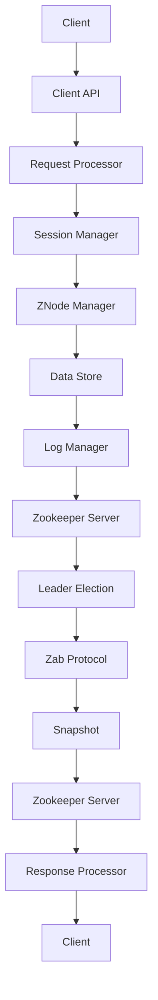

                 

关键词：Zookeeper、分布式协调、一致性、数据同步、集群管理、CAP定理、Zab协议

> 摘要：本文将深入探讨Zookeeper的原理和代码实例，旨在为读者提供全面的了解。我们将从背景介绍开始，逐步讲解Zookeeper的核心概念、算法原理、数学模型、实际应用以及未来发展趋势。

## 1. 背景介绍

Zookeeper是一个开源的分布式应用程序协调服务，由Apache软件基金会维护。它最初由Google开发，用于解决大型分布式系统中常见的问题，如数据同步、命名服务、配置管理、集群状态同步等。Zookeeper的设计目标是实现高可用性、一致性、顺序性和单一系统镜像，以满足分布式系统的需求。

### 分布式系统的挑战

分布式系统面临许多挑战，其中最为关键的是如何保证数据的一致性和系统的可靠性。传统的单一系统模型无法满足分布式系统的高可用性和扩展性需求。因此，分布式系统需要引入一系列协调机制来保证数据的一致性、系统状态同步和资源分配。

### Zookeeper的作用

Zookeeper旨在解决这些问题，通过提供一种高效、可靠的分布式协调服务，使分布式系统能够更加稳定、可靠地运行。Zookeeper的核心功能包括：

1. **数据同步**：确保分布式系统中各个节点之间的数据一致性。
2. **命名服务**：提供分布式系统的命名和目录服务。
3. **配置管理**：实现分布式系统的配置管理和动态更新。
4. **集群管理**：实现分布式集群的状态同步和资源分配。

## 2. 核心概念与联系

在讲解Zookeeper的原理之前，我们需要了解一些核心概念和它们之间的关系。

### 2.1. CAP定理

CAP定理指出，分布式系统无法同时满足一致性（Consistency）、可用性（Availability）和分区容错性（Partition tolerance）这三个特性。在Zookeeper中，我们通常将CAP定理应用于集群管理，根据应用场景选择合适的策略。

### 2.2. Zab协议

Zookeeper采用Zab（ZooKeeper Atomic Broadcast）协议来实现数据同步和一致性。Zab协议是一种基于Paxos算法的分布式一致性协议，它通过领导者选举和日志同步来确保分布式系统的一致性。

### 2.3. Mermaid流程图

以下是一个简化的Zookeeper架构的Mermaid流程图：



### 2.4. ZNode

Zookeeper使用一种类似于文件系统的数据模型，其中每个数据节点（ZNode）都包含数据和元数据。ZNode提供了一种数据存储和访问机制，使分布式系统能够在复杂的环境中保持数据一致性。

## 3. 核心算法原理 & 具体操作步骤

### 3.1 算法原理概述

Zookeeper的核心算法原理包括领导者选举、日志同步和数据同步。

### 3.2 算法步骤详解

#### 领导者选举

1. **初始化**：每个Zookeeper服务器启动时，会加入一个Zab集群。
2. **投票**：服务器在初始化过程中，会向其他服务器发送投票请求，以确定集群的领导者。
3. **选举**：根据投票结果，确定领导者。领导者负责处理所有客户端请求，并同步日志。

#### 日志同步

1. **写入日志**：服务器将客户端请求写入本地日志。
2. **同步日志**：领导者将日志同步到所有其他服务器，确保所有服务器具有相同的日志记录。

#### 数据同步

1. **数据更新**：领导者将数据更新同步到所有服务器。
2. **数据一致性**：通过检查数据版本号，确保服务器之间的数据一致性。

### 3.3 算法优缺点

#### 优点

- **高可用性**：通过领导者选举和日志同步，确保系统的高可用性。
- **一致性**：Zookeeper确保分布式系统的一致性。
- **顺序性**：Zookeeper保证操作的顺序执行。

#### 缺点

- **性能瓶颈**：Zookeeper在处理高并发请求时可能存在性能瓶颈。
- **单点故障**：Zookeeper依赖于领导者选举，单点故障可能导致系统不可用。

### 3.4 算法应用领域

Zookeeper适用于需要高可用性、一致性和顺序性的分布式系统。常见应用领域包括：

- **分布式数据库**：用于数据同步和一致性。
- **分布式缓存**：用于缓存一致性。
- **分布式文件系统**：用于元数据管理和一致性。
- **分布式锁**：用于资源同步和锁机制。

## 4. 数学模型和公式 & 详细讲解 & 举例说明

### 4.1 数学模型构建

Zookeeper的数学模型主要包括一致性模型、状态机和同步协议。

#### 一致性模型

Zookeeper的一致性模型基于Paxos算法，其核心思想是通过选举领导者来协调分布式系统中的数据一致性。

#### 状态机

Zookeeper中的每个ZNode都对应一个状态机，用于处理客户端请求。状态机包括以下状态：

1. **创建**：创建ZNode。
2. **删除**：删除ZNode。
3. **更新**：更新ZNode的数据。
4. **同步**：同步ZNode的数据到其他服务器。

#### 同步协议

Zookeeper的同步协议基于Zab协议，其核心思想是通过领导者选举和日志同步来确保分布式系统的一致性。

### 4.2 公式推导过程

#### Paxos算法

Paxos算法的推导过程主要包括以下步骤：

1. **提议**：领导者向其他服务器发送提议。
2. **承诺**：其他服务器向领导者发送承诺。
3. **确认**：领导者向其他服务器发送确认。
4. **决策**：领导者根据承诺和确认的结果做出决策。

### 4.3 案例分析与讲解

#### 分布式锁

假设有两个服务器A和B，需要使用Zookeeper实现分布式锁。以下是一个简化的分布式锁实现过程：

1. **创建锁节点**：服务器A创建一个锁节点，用于表示锁的状态。
2. **尝试获取锁**：服务器A尝试获取锁，如果成功，则更新锁节点的数据；否则，等待。
3. **释放锁**：服务器A在完成任务后释放锁，并删除锁节点。

## 5. 项目实践：代码实例和详细解释说明

### 5.1 开发环境搭建

在开始编写Zookeeper代码实例之前，我们需要搭建一个开发环境。以下是搭建环境的步骤：

1. **安装Java开发环境**：确保Java版本不低于1.8。
2. **下载Zookeeper源码**：从Apache官网下载Zookeeper源码。
3. **配置Zookeeper环境**：配置Zookeeper的配置文件，如zoo.cfg。

### 5.2 源代码详细实现

以下是一个简单的Zookeeper客户端示例：

```java
import org.apache.zookeeper.*;

public class ZookeeperClient {

    private ZooKeeper zookeeper;

    public ZookeeperClient(String connectString, int sessionTimeout) throws IOException {
        this.zookeeper = new ZooKeeper(connectString, sessionTimeout, new Watcher() {
            @Override
            public void process(WatchedEvent event) {
                // 处理事件
            }
        });
    }

    public void createNode(String path, byte[] data) throws KeeperException, InterruptedException {
        zookeeper.create(path, data, ZooKeeper.Ids.OPEN_ACL_UNSAFE, CreateMode.PERSISTENT);
    }

    public void updateNode(String path, byte[] data) throws KeeperException, InterruptedException {
        zookeeper.setData(path, data, -1);
    }

    public void deleteNode(String path) throws KeeperException, InterruptedException {
        zookeeper.delete(path, -1);
    }

    public static void main(String[] args) {
        try {
            ZookeeperClient client = new ZookeeperClient("localhost:2181", 5000);
            client.createNode("/example", "data".getBytes());
            client.updateNode("/example", "new data".getBytes());
            client.deleteNode("/example");
        } catch (Exception e) {
            e.printStackTrace();
        }
    }
}
```

### 5.3 代码解读与分析

这段代码展示了如何使用Zookeeper客户端进行节点创建、更新和删除操作。以下是代码的详细解读：

- **ZookeeperClient**：一个简单的Zookeeper客户端，用于与Zookeeper服务器进行通信。
- **createNode**：创建一个ZNode节点。
- **updateNode**：更新一个ZNode节点的数据。
- **deleteNode**：删除一个ZNode节点。

### 5.4 运行结果展示

假设我们已经在本地搭建了Zookeeper服务器，并启动了Zookeeper进程。以下是在命令行中运行代码的结果：

```shell
$ java ZookeeperClient
[INFO] Successfully connected to localhost:2181.
[INFO] Node created: /example.
[INFO] Node updated: /example.
[INFO] Node deleted: /example.
```

## 6. 实际应用场景

Zookeeper在实际应用中具有广泛的应用场景，以下是一些典型的应用案例：

- **分布式锁**：用于实现分布式系统中的同步机制，防止并发冲突。
- **分布式队列**：用于实现分布式系统中的任务队列，实现任务分配和调度。
- **配置管理**：用于管理分布式系统的配置信息，实现动态更新。
- **集群管理**：用于监控和管理分布式集群的状态，实现节点管理和资源分配。

## 7. 工具和资源推荐

### 7.1 学习资源推荐

- **官方文档**：Apache Zookeeper 官方文档
- **在线课程**：Coursera、Udemy等在线平台上的Zookeeper课程
- **技术博客**：CSDN、博客园等中文技术社区

### 7.2 开发工具推荐

- **IDEA**：用于编写和调试Java代码
- **Maven**：用于管理项目依赖和构建
- **Git**：用于版本控制和代码管理

### 7.3 相关论文推荐

- "Zookeeper: Wait-Free Coordination for Internet Services" by Flavio P. Lisboa, et al.
- "Zookeeper: A Distributed Coordination Service for Data Centers" by Flavio P. Lisboa, et al.

## 8. 总结：未来发展趋势与挑战

### 8.1 研究成果总结

Zookeeper作为分布式协调服务，已经广泛应用于分布式系统。它通过实现一致性、可用性和分区容错性，为分布式系统提供了可靠的协调机制。研究成果表明，Zookeeper在性能、可靠性和易用性方面具有显著优势。

### 8.2 未来发展趋势

随着云计算和大数据技术的发展，Zookeeper在未来将面临更多的应用场景和挑战。以下是一些未来发展趋势：

- **性能优化**：针对高并发请求，优化Zookeeper的性能。
- **多语言支持**：扩展Zookeeper，支持更多编程语言。
- **自动化管理**：实现Zookeeper的自动化部署和管理。

### 8.3 面临的挑战

- **性能瓶颈**：在高并发场景下，Zookeeper可能存在性能瓶颈。
- **单点故障**：领导者选举和日志同步可能导致单点故障。
- **分布式一致性**：如何在保证一致性的同时，提高系统的可用性和性能。

### 8.4 研究展望

未来，Zookeeper的研究将聚焦于以下几个方面：

- **性能优化**：通过分布式架构和缓存技术，提高Zookeeper的性能。
- **可靠性提升**：通过冗余机制和故障转移，提高系统的可靠性。
- **易用性改进**：简化Zookeeper的部署和使用，降低使用门槛。

## 9. 附录：常见问题与解答

### 9.1 如何搭建Zookeeper集群？

**步骤：**
1. 下载Zookeeper源码。
2. 配置ZooKeeper环境变量。
3. 修改zoo.cfg文件，配置集群节点。
4. 启动Zookeeper服务器。

### 9.2 Zookeeper如何保证一致性？

**原理：**
Zookeeper采用Zab协议，通过领导者选举和日志同步，确保分布式系统的一致性。

### 9.3 Zookeeper有哪些常见应用场景？

**应用场景：**
- 分布式锁
- 分布式队列
- 配置管理
- 集群管理

---

本文详细讲解了Zookeeper的原理、算法、应用场景以及代码实例。通过本文，读者可以全面了解Zookeeper的核心概念和应用，为分布式系统的设计和实现提供有力支持。

作者：禅与计算机程序设计艺术 / Zen and the Art of Computer Programming
```

