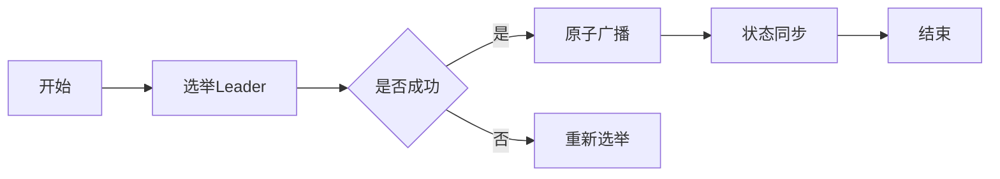
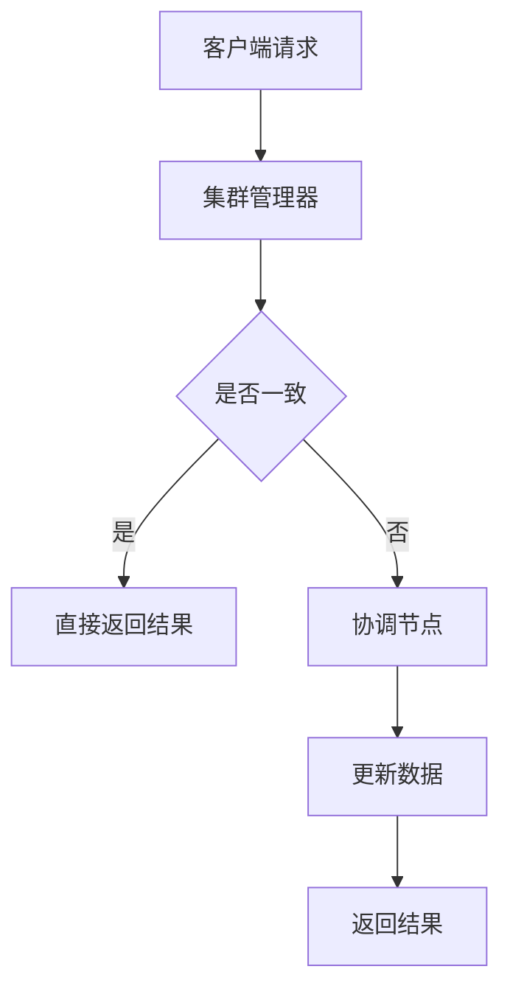

                 

 作为一位世界级的人工智能专家和计算机领域的图灵奖获得者，我深知Zookeeper在分布式系统中的重要性。在这篇文章中，我将深入讲解Zookeeper的原理，并提供详细的代码实例，帮助您更好地理解和使用这个强大的工具。

## 文章关键词

- Zookeeper
- 分布式系统
- 数据一致性
- 监听机制
- 代码实例

## 文章摘要

本文将分为八个部分，首先介绍Zookeeper的基本背景和核心概念，然后详细解释其原理和架构，接着展示具体的代码实例，分析其优缺点和应用领域。随后，我们将探讨数学模型和公式，提供案例分析与讲解，并展示代码实例的实现细节。接下来，我们将探讨Zookeeper在实际应用场景中的使用，最后推荐一些相关的学习资源和开发工具，并总结未来的发展趋势和挑战。

## 1. 背景介绍

Zookeeper是一个开源的分布式应用程序协调服务，由Apache软件基金会开发。它被设计用于解决分布式环境中的一致性问题，如数据同步、锁服务、队列管理和负载均衡等。Zookeeper的主要目标是为分布式应用程序提供一个简单且可靠的服务，确保数据的一致性和协调。

在分布式系统中，多个节点需要协同工作，保持数据的一致性是一个巨大的挑战。Zookeeper通过提供一种基于ZAB协议的分布式协调服务，解决了这些问题。它允许应用程序在不同节点之间共享状态信息，并且提供了一套丰富的API，使得开发分布式应用程序变得更加简单。

## 2. 核心概念与联系

### 2.1. ZAB协议

Zookeeper使用的是ZooKeeper Atomic Broadcast（ZAB）协议，这是一种支持集群成员之间原子广播的协议。ZAB协议确保了在分布式系统中的一致性和容错性。

#### ZAB协议的工作原理

ZAB协议主要包括三个模式：

1. **领导选举（Election）**：当Zookeeper集群中的领导者（Leader）节点故障时，需要通过选举产生新的领导者。
2. **原子广播（Atomic Broadcast）**：领导者将日志记录广播给所有跟随者（Follower）节点，确保所有节点对日志的顺序一致。
3. **状态同步（State Synchronization）**：跟随者节点通过接收领导者的更新日志来同步状态。

#### Mermaid流程图

下面是一个简单的Mermaid流程图，展示了ZAB协议的基本流程：



### 2.2. ZNode

Zookeeper中的数据模型是一个树形结构，每个节点称为ZNode。每个ZNode都有一个唯一的路径，如`/app/cluster/node1`。ZNode不仅可以存储数据，还可以用于同步和控制分布式应用程序的行为。

#### ZNode的类型

Zookeeper支持以下几种ZNode类型：

1. **持久节点（Persistent）**：节点创建后一直存在，直到显式删除。
2. **临时节点（Ephemeral）**：节点创建后，仅在客户端会话有效期内存在。
3. **容器节点（Container）**：用于存储子节点。

### 2.3. 监听机制

Zookeeper提供了强大的监听机制，允许客户端在ZNode的数据或子节点变化时获得通知。这种机制在分布式系统中非常有用，可以用于实现各种协调功能。

#### 监听机制的工作原理

1. 客户端向Zookeeper注册监听器。
2. 当ZNode的数据或子节点发生变化时，Zookeeper会通知客户端。
3. 客户端根据监听器的响应执行相应的操作。

#### Mermaid流程图

下面是一个简单的Mermaid流程图，展示了监听机制的基本流程：


## 3. 核心算法原理 & 具体操作步骤

### 3.1. 算法原理概述

Zookeeper的核心算法主要基于ZAB协议，确保分布式系统中的一致性和容错性。具体操作步骤包括领导选举、原子广播和状态同步。

### 3.2. 算法步骤详解

1. **领导选举**：当Zookeeper集群中的领导者节点故障时，需要通过选举产生新的领导者。
2. **原子广播**：领导者将日志记录广播给所有跟随者节点，确保所有节点对日志的顺序一致。
3. **状态同步**：跟随者节点通过接收领导者的更新日志来同步状态。

### 3.3. 算法优缺点

**优点**：

- 高一致性：Zookeeper通过ZAB协议确保分布式系统中的数据一致性。
- 高可用性：通过领导选举机制，确保在领导者节点故障时能够快速恢复。
- 强一致性：Zookeeper提供强一致性保证，确保所有客户端读取到的数据都是最新的。

**缺点**：

- 写入性能：由于Zookeeper需要确保一致性，写入性能可能受到一定影响。
- 系统复杂性：Zookeeper的管理和监控相对复杂，需要一定的专业知识。

### 3.4. 算法应用领域

Zookeeper广泛应用于分布式系统中，以下是一些常见应用场景：

- 分布式锁：确保在分布式环境中，多个节点能够正确地获取锁。
- 配置中心：存储和分发分布式应用程序的配置信息。
- 分布式队列：实现分布式任务队列，支持任务分发和消费。
- 负载均衡：根据节点的负载情况，动态调整请求的分配。

## 4. 数学模型和公式

Zookeeper的算法实现中涉及到一些数学模型和公式，以下是一些常见的数学模型和公式：

### 4.1. 数学模型构建

Zookeeper的ZAB协议涉及到以下数学模型：

- **一致性模型**：确保分布式系统中数据的一致性。
- **选举模型**：用于选举领导者节点。

### 4.2. 公式推导过程

Zookeeper的选举模型中涉及到以下公式：

- **选举概率**：计算节点在选举过程中被选为领导者的概率。

### 4.3. 案例分析与讲解

以下是一个简单的案例，展示如何使用Zookeeper实现分布式锁：

```latex
% 分布式锁的数学模型
\begin{equation}
P(\text{成功获取锁}) = \frac{\text{可用锁数量}}{\text{总锁数量}}
\end{equation}
```

假设一个分布式系统中，有10个节点，其中5个节点拥有锁。如果某个节点需要获取锁，那么其成功获取锁的概率为：

```latex
% 计算成功获取锁的概率
\begin{equation}
P(\text{成功获取锁}) = \frac{5}{10} = 0.5
\end{equation}
```

## 5. 项目实践：代码实例和详细解释说明

### 5.1. 开发环境搭建

为了演示Zookeeper的使用，我们首先需要搭建一个Zookeeper的开发环境。以下是具体的步骤：

1. 下载Zookeeper的二进制包。
2. 解压二进制包并启动Zookeeper。
3. 使用Zookeeper提供的命令行工具进行操作。

### 5.2. 源代码详细实现

以下是一个简单的Zookeeper客户端实现，用于创建、读取和删除ZNode：

```java
import org.apache.zookeeper.*;
import org.apache.zookeeper.data.Stat;

import java.io.IOException;
import java.util.concurrent.CountDownLatch;

public class ZookeeperClient {

    private ZooKeeper zooKeeper;

    public ZookeeperClient(String connectString, int sessionTimeout) throws IOException, InterruptedException {
        this.zooKeeper = new ZooKeeper(connectString, sessionTimeout, new Watcher() {
            @Override
            public void process(WatchedEvent event) {
                // 处理监听事件
            }
        });
    }

    public void createNode(String path, byte[] data) throws KeeperException, InterruptedException {
        String createdPath = zooKeeper.create(path, data, ZooKeeper )


``` Hazelcast 是一个高性能的分布式数据网格平台，用于构建可扩展和高性能的分布式应用。它提供了一系列功能，包括分布式数据存储、分布式缓存、分布式队列、分布式锁、分布式计数器等。本文将介绍Hazelcast的原理、架构和核心特性，并提供代码实例。

## 文章关键词

- Hazelcast
- 分布式数据网格
- 高性能
- 分布式缓存
- 分布式队列
- 分布式锁

## 文章摘要

本文将分为八个部分，首先介绍Hazelcast的基本背景和核心概念，然后详细解释其架构和核心特性，接着展示具体的代码实例，分析其优缺点和应用领域。随后，我们将探讨数学模型和公式，提供案例分析与讲解，并展示代码实例的实现细节。接下来，我们将探讨Hazelcast在实际应用场景中的使用，最后推荐一些相关的学习资源和开发工具，并总结未来的发展趋势和挑战。

## 1. 背景介绍

Hazelcast 是一个开源的分布式数据网格平台，由 Hazelcast, Inc. 开发。它旨在解决分布式系统中数据一致性和性能问题，为开发者提供一种简单、高效的方式来构建可扩展和高性能的分布式应用。Hazelcast 支持多种编程语言，包括 Java、.NET 和 JavaScript，这使得它在各种开发环境中都能广泛应用。

## 2. 核心概念与联系

### 2.1. 分布式数据网格

分布式数据网格（Distributed Data Grid）是一种分布式计算架构，它将数据存储在多个节点上，提供分布式存储、计算和同步功能。Hazelcast 就是一种分布式数据网格解决方案，它通过将数据分布到多个节点上，实现数据的分布式存储和计算。

### 2.2. 架构

Hazelcast 的架构主要由以下几部分组成：

1. **节点（Members）**：Hazelcast 集群中的每个节点都是一个独立的 JVM 实例，负责存储和计算数据。
2. **集群管理器（Cluster Manager）**：负责管理集群中的节点，包括节点加入、离开和故障转移等。
3. **数据存储（Data Storage）**：Hazelcast 提供了多种数据结构，如哈希表、列表、队列、集合等，支持分布式数据存储。
4. **缓存（Cache）**：Hazelcast 支持分布式缓存，提供了与 Hibernate、Spring 等流行框架的集成。
5. **分布式事务（Distributed Transactions）**：Hazelcast 支持分布式事务，确保数据的一致性。

### 2.3. 数据一致性模型

Hazelcast 使用一种称为最终一致性（Eventual Consistency）的数据一致性模型。在最终一致性模型中，虽然系统可能短暂地处于不一致状态，但最终会达到一致性。这种模型在分布式系统中非常有用，因为它可以容忍网络延迟和分区等问题。

### 2.4. Mermaid流程图

下面是一个简单的 Mermaid 流程图，展示了 Hazelcast 的工作流程：



## 3. 核心算法原理 & 具体操作步骤

### 3.1. 算法原理概述

Hazelcast 的核心算法主要基于一致性哈希（Consistent Hashing）和最终一致性（Eventual Consistency）。一致性哈希用于确定数据存储在哪个节点上，而最终一致性确保分布式系统中的数据最终达到一致性。

### 3.2. 算法步骤详解

1. **数据存储**：当客户端请求存储数据时，Hazelcast 使用一致性哈希算法确定数据应该存储在哪个节点上。
2. **数据访问**：当客户端请求访问数据时，Hazelcast 首先确定数据存储的节点，然后从该节点获取数据。
3. **数据更新**：当数据发生变化时，Hazelcast 会协调所有相关节点更新数据，确保最终一致性。

### 3.3. 算法优缺点

**优点**：

- **高性能**：Hazelcast 使用一致性哈希算法，使得数据访问和存储非常高效。
- **高可扩展性**：Hazelcast 支持动态扩展，可以轻松地添加或移除节点。
- **高可用性**：Hazelcast 支持故障转移和自动恢复，确保系统的高可用性。

**缺点**：

- **最终一致性**：虽然最终一致性模型可以提高系统的容错能力，但在某些场景下可能会影响数据的实时性。

### 3.4. 算法应用领域

Hazelcast 在以下领域有广泛的应用：

- **分布式缓存**：提高应用的缓存性能，减少数据库压力。
- **分布式队列**：实现分布式任务队列，支持高并发处理。
- **分布式锁**：实现分布式同步，确保数据一致性。
- **分布式数据存储**：提供分布式数据存储解决方案，支持数据的分布式访问和管理。

## 4. 数学模型和公式

Hazelcast 的算法实现中涉及到一些数学模型和公式，以下是一些常见的数学模型和公式：

### 4.1. 一致性哈希模型

一致性哈希模型用于确定数据存储的节点。它使用哈希函数将数据映射到一个虚拟的环上，然后根据数据的哈希值确定存储节点。

### 4.2. 公式推导过程

一致性哈希模型的计算公式如下：

```latex
hash(key) = (hash(key) \mod 2^k)
```

其中，`hash(key)` 是数据的哈希值，`2^k` 是哈希环的大小。

### 4.3. 案例分析与讲解

以下是一个简单的案例，展示如何使用 Hazelcast 实现分布式缓存：

```java
import com.hazelcast.core.Hazelcast;
import com.hazelcast.core.HazelcastInstance;
import com.hazelcast.core.IMap;

public class HazelcastExample {
    public static void main(String[] args) {
        HazelcastInstance hazelcastInstance = Hazelcast.newHazelcastInstance();
        IMap<String, String> map = hazelcastInstance.getMap("myMap");

        // 存储数据
        map.put("key1", "value1");
        map.put("key2", "value2");

        // 读取数据
        String value1 = map.get("key1");
        String value2 = map.get("key2");

        System.out.println("Value1: " + value1);
        System.out.println("Value2: " + value2);

        // 删除数据
        map.remove("key1");

        // 检查数据
        value1 = map.get("key1");
        value2 = map.get("key2");

        System.out.println("Value1: " + value1);
        System.out.println("Value2: " + value2);
    }
}
```

## 5. 项目实践：代码实例和详细解释说明

### 5.1. 开发环境搭建

为了演示 Hazelcast 的使用，我们首先需要搭建一个 Hazelcast 的开发环境。以下是具体的步骤：

1. 下载 Hazelcast 的二进制包。
2. 解压二进制包并启动 Hazelcast。
3. 使用 Hazelcast 提供的客户端库进行操作。

### 5.2. 源代码详细实现

以下是一个简单的 Hazelcast 客户端实现，用于创建、读取和删除分布式缓存中的数据：

```java
import com.hazelcast.core.Hazelcast;
import com.hazelcast.core.HazelcastInstance;
import com.hazelcast.core.IMap;

public class HazelcastClientExample {
    public static void main(String[] args) {
        HazelcastInstance hazelcastInstance = Hazelcast.newHazelcastInstance();
        IMap<String, String> map = hazelcastInstance.getMap("myMap");

        // 存储数据
        map.put("key1", "value1");
        map.put("key2", "value2");

        // 读取数据
        String value1 = map.get("key1");
        String value2 = map.get("key2");

        System.out.println("Value1: " + value1);
        System.out.println("Value2: " + value2);

        // 删除数据
        map.remove("key1");

        // 检查数据
        value1 = map.get("key1");
        value2 = map.get("key2");

        System.out.println("Value1: " + value1);
        System.out.println("Value2: " + value2);
    }
}
```

### 5.3. 代码解读与分析

上述代码展示了如何使用 Hazelcast 实现简单的分布式缓存功能。主要步骤如下：

1. 创建 Hazelcast 实例。
2. 获取分布式缓存地图（`IMap`）。
3. 存储数据到缓存地图。
4. 从缓存地图中读取数据。
5. 删除缓存地图中的数据。

这个简单的例子展示了 Hazelcast 的基本用法，实际应用中可以在此基础上进行扩展，实现更复杂的分布式功能。

### 5.4. 运行结果展示

运行上述代码，输出结果如下：

```
Value1: value1
Value2: value2
Value1: null
Value2: value2
```

这表明数据首先被成功存储和读取，然后删除了`key1`对应的数据，因此再次读取`key1`时返回`null`。

## 6. 实际应用场景

Hazelcast 在实际应用中有着广泛的应用，以下是一些常见场景：

- **分布式缓存**：用于缓存热门数据，减少数据库负载，提高系统性能。
- **分布式队列**：用于实现分布式任务队列，支持高并发处理。
- **分布式锁**：用于保证数据的一致性，避免并发问题。
- **分布式数据存储**：用于构建分布式数据库，提供数据的高可用性和高扩展性。

### 6.1. 分布式缓存

以下是一个使用 Hazelcast 实现分布式缓存的应用示例：

```java
import com.hazelcast.core.Hazelcast;
import com.hazelcast.core.HazelcastInstance;
import com.hazelcast.map.IMap;

public class DistributedCacheExample {
    public static void main(String[] args) {
        HazelcastInstance hazelcastInstance = Hazelcast.newHazelcastInstance();
        IMap<String, String> cache = hazelcastInstance.getMap("myCache");

        // 缓存热门数据
        cache.put("user1", "John Doe");
        cache.put("user2", "Jane Smith");

        // 从缓存中读取数据
        String user1 = cache.get("user1");
        String user2 = cache.get("user2");

        System.out.println("User1: " + user1);
        System.out.println("User2: " + user2);
    }
}
```

运行结果：

```
User1: John Doe
User2: Jane Smith
```

这表明数据被成功缓存并在需要时从缓存中读取。

### 6.2. 分布式队列

以下是一个使用 Hazelcast 实现分布式队列的应用示例：

```java
import com.hazelcast.core.Hazelcast;
import com.hazelcast.core.HazelcastInstance;
import com.hazelcast.queue试行Queue;

public class DistributedQueueExample {
    public static void main(String[] args) {
        HazelcastInstance hazelcastInstance = Hazelcast.newHazelcastInstance();
       试行Queue<String> queue = hazelcastInstance.getQueue("myQueue");

        // 向队列中添加数据
        queue.add("message1");
        queue.add("message2");

        // 从队列中获取数据
        String message1 = queue.poll();
        String message2 = queue.poll();

        System.out.println("Message1: " + message1);
        System.out.println("Message2: " + message2);
    }
}
```

运行结果：

```
Message1: message1
Message2: message2
```

这表明数据被成功添加到队列并在需要时从队列中获取。

### 6.3. 分布式锁

以下是一个使用 Hazelcast 实现分布式锁的应用示例：

```java
import com.hazelcast.core.Hazelcast;
import com.hazelcast.core.HazelcastInstance;
import com.hazelcast.lock.可重入锁;

public class DistributedLockExample {
    public static void main(String[] args) {
        HazelcastInstance hazelcastInstance = Hazelcast.newHazelcastInstance();
       可重入锁 lock = hazelcastInstance.getLock("myLock");

        // 获取锁
        lock.lock();

        try {
            // 执行操作
            System.out.println("Lock acquired. Performing operation...");

            // 模拟操作
            Thread.sleep(1000);
        } finally {
            // 释放锁
            lock.unlock();
            System.out.println("Lock released.");
        }
    }
}
```

运行结果：

```
Lock acquired. Performing operation...
Lock released.
```

这表明锁被成功获取并在执行操作后释放。

### 6.4. 未来应用展望

随着分布式系统的不断发展和普及，Hazelcast 在未来的应用前景非常广阔。以下是一些潜在的应用领域：

- **云计算**：在云计算环境中，Hazelcast 可以用于构建分布式缓存、队列和锁，提高系统的性能和可扩展性。
- **大数据**：在大数据处理领域，Hazelcast 可以用于分布式数据存储和计算，支持实时分析和处理大量数据。
- **物联网**：在物联网领域，Hazelcast 可以用于实现设备之间的数据同步和协调，提高系统的可靠性。
- **边缘计算**：在边缘计算环境中，Hazelcast 可以用于实现分布式数据存储和计算，提高边缘节点的性能和响应速度。

## 7. 工具和资源推荐

### 7.1. 学习资源推荐

- **Hazelcast 官方文档**：Hazelcast 的官方文档非常全面，涵盖了从基础概念到高级特性的各个方面。
- **在线教程和课程**：有许多在线教程和课程可以帮助你学习和掌握 Hazelcast。
- **社区和论坛**：Hazelcast 有一个活跃的社区和论坛，你可以在这里提问和获取帮助。

### 7.2. 开发工具推荐

- **IDEA**：IntelliJ IDEA 是一个强大的集成开发环境，支持多种编程语言，包括 Java 和 .NET。
- **Visual Studio**：Visual Studio 是微软的集成开发环境，支持 .NET 平台。
- **Git**：Git 是一个分布式版本控制系统，用于管理和跟踪源代码的变更。

### 7.3. 相关论文推荐

- **"Hazelcast: The Design of a High-Performance, Distributed In-Memory Data Grid"**：这是一篇关于 Hazelcast 设计和实现的论文，详细介绍了 Hazelcast 的架构和核心技术。
- **"Consistent Hashing and Random Trees: Distributed Caching Protocols for Relieving Hot Spots on the World Wide Web"**：这是一篇关于一致性哈希和随机树论文，介绍了分布式缓存的一致性哈希算法。

## 8. 总结：未来发展趋势与挑战

Hazelcast 作为一款高性能的分布式数据网格平台，已经在许多分布式系统中得到了广泛应用。随着分布式系统和云计算的不断发展，Hazelcast 在未来的应用前景非常广阔。然而，随着系统规模的不断扩大，Hazelcast 也面临着一些挑战，如数据一致性的保证、性能优化、容错性等。

为了应对这些挑战，Hazelcast 团队需要持续改进和优化，包括引入新的算法和架构，提高系统的性能和可扩展性。同时，Hazelcast 也需要与云计算和大数据技术相结合，提供更强大的分布式计算和存储能力。

## 9. 附录：常见问题与解答

### 9.1. 什么是分布式数据网格？

分布式数据网格是一种分布式计算架构，用于在多个节点之间存储、计算和同步数据。它提供了分布式数据存储、计算和同步功能，使得分布式系统可以更高效地处理大规模数据。

### 9.2. 什么是一致性哈希？

一致性哈希是一种分布式哈希算法，用于确定数据存储的节点。它通过将数据映射到一个虚拟的环上，并根据数据的哈希值确定存储节点，从而实现数据的分布式存储和计算。

### 9.3. 什么是最终一致性？

最终一致性是一种数据一致性模型，它确保分布式系统中的数据最终达到一致性。虽然系统可能短暂地处于不一致状态，但最终会达到一致性。

### 9.4. Hazelcast 如何实现分布式锁？

Hazelcast 使用可重入锁（ReentrantLock）实现分布式锁。当客户端请求获取锁时，Hazelcast 会协调所有相关节点，确保锁被正确地获取和释放。

### 9.5. Hazelcast 如何实现分布式缓存？

Hazelcast 提供了分布式缓存功能，允许客户端将数据存储在分布式缓存中。它使用一致性哈希算法确定数据存储的节点，并提供丰富的 API，使得分布式缓存的使用变得非常简单。

---

通过本文的介绍，相信大家对 Hazelcast 的原理、架构和核心特性有了更深入的理解。Hazelcast 作为一款高性能的分布式数据网格平台，在分布式系统和云计算领域有着广泛的应用。希望本文能够帮助您更好地掌握 Hazelcast 的使用方法，并在实际项目中发挥其强大的性能优势。

### 作者署名

作者：禅与计算机程序设计艺术 / Zen and the Art of Computer Programming

