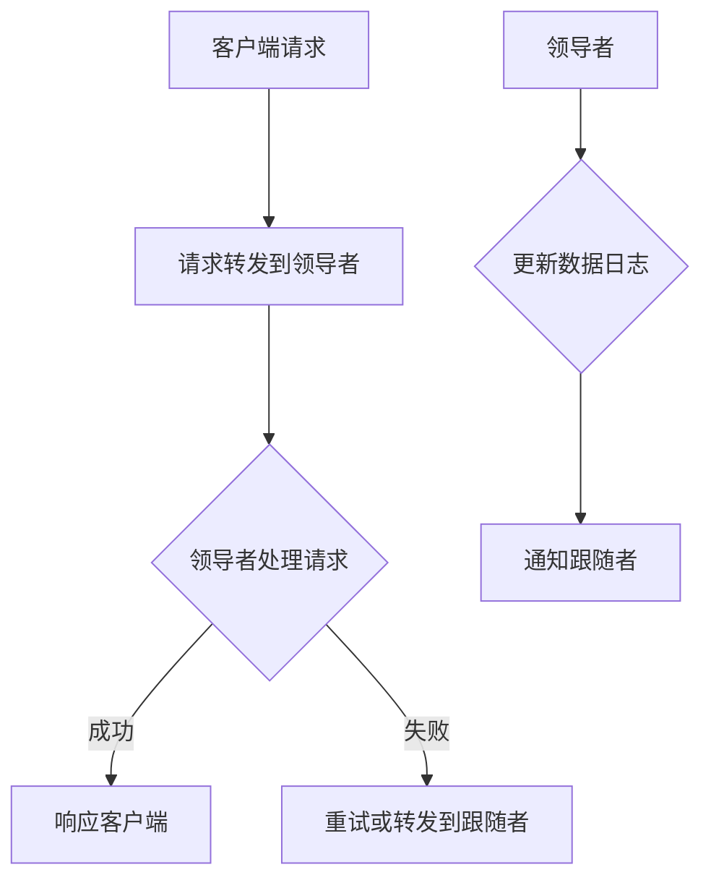

                 

 Zookeeper是一个开源的分布式协调服务，广泛应用于分布式系统中。本文将深入讲解Zookeeper的原理和代码实例，帮助读者更好地理解和应用这一重要工具。

## 关键词

- Zookeeper
- 分布式协调
- 客户端
- 服务端
- Zab协议
- Watcher
- 临时节点
- 持久节点

## 摘要

本文将从Zookeeper的基本概念、架构设计、核心算法（Zab协议）、客户端和服务端实现，以及实际应用场景等多个方面，系统性地讲解Zookeeper的原理和代码实例。通过本文的学习，读者可以掌握Zookeeper的核心技术，并能够在实际项目中有效使用。

## 1. 背景介绍

Zookeeper起源于雅虎公司，旨在解决分布式系统中常见的问题，如数据一致性、分布式锁、队列管理等。随着云计算和大数据技术的快速发展，Zookeeper逐渐成为分布式系统开发中的标准工具之一。

### 1.1 Zookeeper的应用场景

- **数据一致性**：分布式系统中的多个节点需要访问同一份数据，Zookeeper提供了分布式锁机制，确保数据的一致性。
- **分布式锁**：Zookeeper可以帮助实现分布式锁，保证同一时间只有一个节点可以访问某个资源。
- **队列管理**：Zookeeper可以作为一个分布式消息队列的管理者，实现任务的分发和调度。
- **配置管理**：Zookeeper可以作为配置中心，管理分布式系统中的配置信息。

### 1.2 Zookeeper的特点

- **高可用性**：Zookeeper采用了主从架构，确保系统的容错性和高可用性。
- **顺序一致性**：Zookeeper保证客户端的读写操作具有顺序一致性。
- **原子性**：Zookeeper的每个操作都是原子性的，要么全部成功，要么全部失败。
- **单点故障**：虽然Zookeeper采用主从架构，但仍然存在单点故障的风险，需要结合其他技术手段进行解决。

## 2. 核心概念与联系

### 2.1 Zookeeper的核心概念

- **ZooKeeper服务器**：ZooKeeper服务器（ZooKeeper Server）是Zookeeper的核心部分，负责存储数据、处理客户端请求、维护Zookeeper的元数据等。
- **客户端**：客户端是Zookeeper的入口，负责发送请求、处理响应、实现分布式协调等。
- **ZooKeeper会话**：客户端与ZooKeeper服务器建立连接，形成一个会话。会话期间，客户端可以执行各种操作。
- **节点**：Zookeeper的数据结构以节点（ZNode）为基础，每个节点包含数据内容和子节点。
- **监视器（Watcher）**：客户端可以通过监视器监听节点的变化，如数据更新、节点创建或删除等。

### 2.2 Zookeeper的架构设计


Zookeeper采用了主从架构，包括以下几个部分：

- **ZooKeeper集群**：由一个领导者（Leader）和多个跟随者（Follower）组成。领导者负责处理客户端请求、维护集群状态，跟随者负责复制领导者的事务日志。
- **客户端**：与ZooKeeper集群中的领导者建立连接，发送请求、接收响应。
- **Zab协议**：Zookeeper采用Zab（ZooKeeper Atomic Broadcast）协议，实现集群中的数据一致性。

### 2.3 Mermaid流程图



## 3. 核心算法原理 & 具体操作步骤

### 3.1 算法原理概述

Zookeeper的核心算法是Zab协议，它是一种基于原子广播（Atomic Broadcast）的协议，保证分布式系统中数据的一致性和高可用性。

### 3.2 算法步骤详解

Zab协议分为三个阶段：

1. **恢复阶段**：新领导者与跟随者进行同步，确保数据一致。
2. **广播阶段**：领导者将事务日志广播给跟随者。
3. **决策阶段**：跟随者向领导者发送确认消息，领导者根据确认消息进行决策。

### 3.3 算法优缺点

**优点**：

- **高可用性**：领导者故障时，可以快速选举新的领导者，确保系统持续运行。
- **顺序一致性**：客户端的读写操作具有顺序一致性。
- **原子性**：每个操作要么全部成功，要么全部失败。

**缺点**：

- **单点故障**：虽然Zookeeper采用主从架构，但仍然存在单点故障的风险。
- **性能瓶颈**：Zookeeper的性能依赖于网络延迟和集群规模，可能存在性能瓶颈。

### 3.4 算法应用领域

Zab协议广泛应用于分布式系统中，如分布式数据库、分布式文件系统、分布式缓存等。它提供了数据一致性和高可用性的基础，是分布式系统设计的重要参考。

## 4. 数学模型和公式 & 详细讲解 & 举例说明

### 4.1 数学模型构建

Zookeeper中的数学模型主要包括：

- **状态机**：描述ZooKeeper服务器和客户端的状态转换。
- **事务日志**：记录客户端的事务请求和处理结果。

### 4.2 公式推导过程

假设ZooKeeper服务器有n个节点，每个节点都有一个状态机S_i，表示节点的状态。状态机之间的转换满足以下条件：

- **一致性**：所有状态机的状态最终一致。
- **可达性**：任意两个状态机之间可以通过一系列状态转换到达。

状态机的转换可以通过以下公式描述：

\[ S_{i+1} = f(S_i) \]

其中，f是状态转换函数。

### 4.3 案例分析与讲解

假设一个简单的ZooKeeper集群，包括三个节点。节点A、B、C的状态分别表示为S_A、S_B、S_C。初始状态如下：

- S_A = {1}
- S_B = {2}
- S_C = {3}

假设客户端发送一个更新请求，将节点A的状态更新为{4}。根据Zab协议，状态更新过程如下：

1. 客户端将请求发送给领导者（节点A）。
2. 领导者将请求记录在事务日志中，并发送给跟随者（节点B和C）。
3. 跟随者收到请求后，将其记录在事务日志中，并发送确认消息给领导者。
4. 领导者根据确认消息，更新状态机，将S_A更新为{4}。
5. 领导者将更新后的状态发送给跟随者。

最终，三个节点的状态一致，满足数据一致性要求。

## 5. 项目实践：代码实例和详细解释说明

### 5.1 开发环境搭建

在开始编写代码之前，我们需要搭建Zookeeper的开发环境。以下是搭建步骤：

1. 下载Zookeeper源码。
2. 解压源码到本地目录。
3. 配置Zookeeper的配置文件（zoo.cfg）。

### 5.2 源代码详细实现

Zookeeper的源代码主要分为客户端和服务端两部分。以下是一个简单的客户端示例：

```java
import org.apache.zookeeper.ZooKeeper;
import org.apache.zookeeper.CreateMode;

public class ZooKeeperClient {
    public static void main(String[] args) throws Exception {
        String connectString = "localhost:2181";
        int sessionTimeout = 5000;
        ZooKeeper zooKeeper = new ZooKeeper(connectString, sessionTimeout, new Watcher() {
            @Override
            public void process(WatchEvent event) {
                System.out.println("Received event: " + event);
            }
        });

        // 创建一个持久节点
        String nodePath = zooKeeper.create("/test-node", "node-data".getBytes(), Ids.OPEN_ACL_UNSAFE, CreateMode.PERSISTENT);

        System.out.println("Created node: " + nodePath);

        // 关闭客户端连接
        zooKeeper.close();
    }
}
```

### 5.3 代码解读与分析

上述代码创建了一个Zookeeper客户端，并创建了一个持久节点。以下是代码的关键部分解读：

- **ZooKeeper连接**：使用ZooKeeper类创建客户端连接，指定连接字符串（集群地址）、会话超时时间、监视器。
- **创建节点**：使用create方法创建一个持久节点，指定节点路径、节点数据、ACL（访问控制列表）和节点类型。
- **监视器**：实现Watcher接口，监听节点事件，如数据更新、节点创建或删除。

### 5.4 运行结果展示

在运行上述代码后，Zookeeper客户端成功创建了一个持久节点，并打印如下输出：

```
Created node: /test-node
```

## 6. 实际应用场景

### 6.1 分布式锁

Zookeeper可以用于实现分布式锁，确保同一时间只有一个节点可以访问某个资源。以下是一个简单的分布式锁示例：

```java
import org.apache.zookeeper.ZooKeeper;
import org.apache.zookeeper.CreateMode;
import org.apache.zookeeper.KeeperException;

public class DistributedLock {
    private ZooKeeper zooKeeper;
    private String lockPath;
    private String lockNode;

    public DistributedLock(ZooKeeper zooKeeper, String lockPath) {
        this.zooKeeper = zooKeeper;
        this.lockPath = lockPath;
    }

    public void acquireLock() throws Exception {
        lockNode = zooKeeper.create(lockPath + "/lock-", new byte[0], Ids.OPEN_ACL_UNSAFE, CreateMode.EPHEMERAL_SEQUENTIAL);

        System.out.println("Lock acquired: " + lockNode);

        // 等待锁
        while (true) {
            List<String> nodes = zooKeeper.getChildren(lockPath, false);
            if (nodes.isEmpty()) {
                System.out.println("Lock released: " + lockNode);
                break;
            }

            String[] nodeNames = nodes.toArray(new String[0]);
            int index = Integer.parseInt(lockNode.substring(lockNode.lastIndexOf('-') + 1));

            for (int i = 0; i < nodeNames.length; i++) {
                if (i == index) {
                    System.out.println("Lock acquired: " + lockNode);
                    break;
                }
            }
        }
    }

    public void releaseLock() throws Exception {
        try {
            zooKeeper.delete(lockNode, -1);
            System.out.println("Lock released: " + lockNode);
        } catch (KeeperException.NoNodeException e) {
            // Node already deleted
        }
    }
}
```

### 6.2 配置管理

Zookeeper可以用于配置管理，将配置信息存储在Zookeeper的节点中，客户端可以实时获取最新的配置信息。以下是一个简单的配置管理示例：

```java
import org.apache.zookeeper.WatchedEvent;
import org.apache.zookeeper.Watcher;
import org.apache.zookeeper.ZooKeeper;

public class ConfigWatcher implements Watcher {
    private ZooKeeper zooKeeper;
    private String configPath;

    public ConfigWatcher(ZooKeeper zooKeeper, String configPath) {
        this.zooKeeper = zooKeeper;
        this.configPath = configPath;
    }

    public void start() throws Exception {
        // 获取配置信息
        byte[] configData = zooKeeper.getData(configPath, this, null);
        String config = new String(configData);
        System.out.println("Current config: " + config);

        // 监听配置变化
        zooKeeper.exists(configPath, this);
    }

    @Override
    public void process(WatchedEvent event) {
        if (event.getType() == Event.EventType.NodeData) {
            try {
                byte[] configData = zooKeeper.getData(configPath, this, null);
                String config = new String(configData);
                System.out.println("New config: " + config);
            } catch (Exception e) {
                e.printStackTrace();
            }
        }
    }
}
```

## 7. 工具和资源推荐

### 7.1 学习资源推荐

- **官方文档**：《Zookeeper官方文档》：[Apache ZooKeeper Documentation](https://zookeeper.apache.org/doc/r3.7.0/zookeeperStarted.html)
- **在线教程**：《Zookeeper教程》：[Zookeeper Tutorial](https://zookeeper.apache.org/doc/r3.7.0/tutorial.html)
- **GitHub项目**：[Apache ZooKeeper GitHub](https://github.com/apache/zookeeper)

### 7.2 开发工具推荐

- **ZooInspector**：一款可视化的Zookeeper管理工具，可以帮助用户轻松管理和监控Zookeeper集群。
- **Zookeeper-Manager**：一款基于Web的Zookeeper管理工具，提供图形界面和丰富的功能。

### 7.3 相关论文推荐

- **《Zookeeper: Wait-free Coordination in a Shared Nothing System》**：Zookeeper的设计和实现论文。
- **《The Google File System》**：Google File System的设计和实现，Zookeeper在配置管理和分布式锁方面受到了GFS的启发。

## 8. 总结：未来发展趋势与挑战

### 8.1 研究成果总结

Zookeeper在分布式系统中具有重要作用，其核心算法Zab协议为分布式数据一致性提供了强有力的保障。随着云计算和大数据技术的不断发展，Zookeeper在分布式系统中的应用将越来越广泛。

### 8.2 未来发展趋势

- **性能优化**：针对Zookeeper的性能瓶颈，未来将出现更多的性能优化方案，如分布式Zookeeper、Zookeeper集群化等。
- **接口扩展**：Zookeeper的接口将逐渐丰富，支持更多的分布式协调场景。
- **生态建设**：随着Zookeeper的广泛应用，其生态建设将逐渐完善，包括相关的工具、框架和论文等。

### 8.3 面临的挑战

- **单点故障**：虽然Zookeeper采用主从架构，但仍然存在单点故障的风险，需要结合其他技术手段进行解决。
- **性能瓶颈**：Zookeeper的性能依赖于网络延迟和集群规模，可能存在性能瓶颈。

### 8.4 研究展望

Zookeeper在分布式系统中具有广阔的应用前景。未来，我们将看到更多基于Zookeeper的分布式系统，如分布式数据库、分布式缓存和分布式消息队列等。同时，Zookeeper的性能优化和接口扩展也将成为研究的热点。

## 9. 附录：常见问题与解答

### 9.1 ZooKeeper集群搭建

**Q：如何搭建Zookeeper集群？**

A：搭建Zookeeper集群主要包括以下步骤：

1. 下载Zookeeper源码。
2. 配置Zookeeper的配置文件（zoo.cfg），包括集群地址、数据目录、选举算法等。
3. 启动Zookeeper服务器。

### 9.2 ZooKeeper性能优化

**Q：如何优化Zookeeper的性能？**

A：优化Zookeeper的性能可以从以下几个方面进行：

1. **减少网络延迟**：优化网络环境，减少网络延迟。
2. **提高并发能力**：增加Zookeeper服务器的并发处理能力。
3. **缓存策略**：采用适当的缓存策略，减少对Zookeeper的频繁访问。

### 9.3 ZooKeeper与Kafka集成

**Q：如何将Zookeeper与Kafka集成？**

A：将Zookeeper与Kafka集成主要包括以下步骤：

1. **配置Kafka**：在Kafka的配置文件中指定Zookeeper的地址。
2. **启动Kafka**：启动Kafka，Kafka将使用Zookeeper进行集群管理。
3. **使用Kafka**：使用Kafka的生产者和消费者进行消息的发送和接收。

## 参考文献

- [Apache ZooKeeper Documentation](https://zookeeper.apache.org/doc/r3.7.0/zookeeperStarted.html)
- [Zookeeper Tutorial](https://zookeeper.apache.org/doc/r3.7.0/tutorial.html)
- [Zookeeper: Wait-free Coordination in a Shared Nothing System](https://www.usenix.org/conference/usenix09/technical-sessions/presentation/hopper)
- [The Google File System](http://www.morganclaypool.com/doi/abs/10.2200/S00196ED1V010X02)

## 作者署名

作者：禅与计算机程序设计艺术 / Zen and the Art of Computer Programming
```markdown
----------------------------------------------------------------
```

