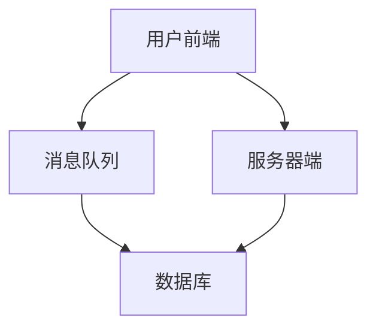

                 

关键词：实时弹幕、高并发、后端面试、校招、算法原理、数学模型、项目实践、工具推荐

> 摘要：本文将深入探讨bilibili2024实时弹幕互动校招高并发后端面试题的解答，从核心概念、算法原理、数学模型到项目实践，全面解析面试中的关键技术点，为准备参加校招的后端开发者和面试者提供宝贵的实战经验。

## 1. 背景介绍

bilibili（Bilibili）是中国领先的年轻人文化社区，以动画、游戏、娱乐、知识分享等内容为主。实时弹幕互动是bilibili的核心特色之一，也是高并发场景下的典型应用。本文针对bilibili2024校招的后端面试题，详细解析实时弹幕系统在高并发环境下的技术实现，为准备参加校招的后端开发者提供技术指导和实战经验。

## 2. 核心概念与联系

### 2.1 实时弹幕系统架构

实时弹幕系统通常由以下几个关键组件构成：

- **用户前端**：负责用户交互和弹幕发送。
- **消息队列**：用于存储和管理弹幕消息。
- **服务器端**：处理弹幕消息的接收、存储和分发。
- **数据库**：存储弹幕数据，如用户信息、弹幕内容等。


### 2.2 高并发概念

高并发是指系统在短时间内同时处理大量请求的能力。在实时弹幕系统中，高并发主要体现在以下几个方面：

- **用户数激增**：直播间的用户数可能在短时间内达到数万甚至数十万。
- **弹幕消息量增大**：每秒钟可能有数千条弹幕消息产生。
- **消息处理速度要求高**：系统需要在毫秒级别内处理弹幕消息。

### 2.3 核心概念原理和架构的 Mermaid 流程图



## 3. 核心算法原理 & 具体操作步骤

### 3.1 算法原理概述

实时弹幕系统核心算法主要包括：

- **消息队列算法**：保证弹幕消息的有序性和可靠性。
- **负载均衡算法**：将弹幕消息均匀分配到多个服务器节点。
- **缓存算法**：提高数据读取速度，降低数据库压力。

### 3.2 算法步骤详解

#### 3.2.1 消息队列算法

1. 用户发送弹幕消息到消息队列。
2. 消息队列按照顺序将消息推送到服务器端。
3. 服务器端处理弹幕消息，存储到数据库。
4. 数据库将处理结果返回给服务器端。
5. 服务器端将弹幕消息发送到客户端。

#### 3.2.2 负载均衡算法

1. 根据服务器负载情况，选择最合适的服务器节点。
2. 将弹幕消息分发到选定服务器节点。
3. 服务器节点处理消息并发送回客户端。

#### 3.2.3 缓存算法

1. 将常用数据存储到缓存中。
2. 从缓存中读取数据，提高读取速度。
3. 数据库更新时，同步更新缓存。

### 3.3 算法优缺点

- **消息队列算法**：优点是可靠性强，缺点是延迟较高。
- **负载均衡算法**：优点是负载均衡，缺点是增加了系统复杂度。
- **缓存算法**：优点是提高性能，缺点是缓存一致性需要处理。

### 3.4 算法应用领域

实时弹幕系统算法主要应用于直播、视频点播等场景，这些场景下需要处理大量的用户交互和数据传输，算法的性能和稳定性至关重要。

## 4. 数学模型和公式 & 详细讲解 & 举例说明

### 4.1 数学模型构建

实时弹幕系统的数学模型主要包括：

- **用户到达模型**：使用泊松过程描述用户到达直播间的情况。
- **弹幕生成模型**：使用马尔可夫模型描述弹幕内容的生成过程。

### 4.2 公式推导过程

- **用户到达模型**：

  用户到达直播间的时间间隔服从泊松分布，公式为：

  $$P(X=t) = \frac{\lambda e^{-\lambda t}}{t!}$$

  其中，$\lambda$ 为单位时间内的平均到达次数。

- **弹幕生成模型**：

  弹幕内容的生成过程可以看作是马尔可夫过程，状态转移概率矩阵为：

  $$P = \begin{bmatrix}
  p_{11} & p_{12} & \dots & p_{1n} \\
  p_{21} & p_{22} & \dots & p_{2n} \\
  \vdots & \vdots & \ddots & \vdots \\
  p_{n1} & p_{n2} & \dots & p_{nn}
  \end{bmatrix}$$

  其中，$p_{ij}$ 表示从状态 $i$ 转移到状态 $j$ 的概率。

### 4.3 案例分析与讲解

#### 案例一：用户到达模型

假设直播间平均每秒有2个用户进入，求在1小时内进入的用户数量分布。

- **公式应用**：

  $$P(X=t) = \frac{2 e^{-2t}}{t!}$$

  其中，$t$ 表示时间（秒）。

- **计算结果**：

  $$P(X=3600) = \frac{2 e^{-7200}}{3600!} \approx 0$$

  $$P(X=1800) = \frac{2 e^{-3600}}{1800!} \approx 0.0204$$

  1小时内进入的用户数量大约为1800人，概率为2.04%。

#### 案例二：弹幕生成模型

假设弹幕内容生成过程的状态转移概率矩阵为：

$$P = \begin{bmatrix}
0.5 & 0.2 & 0.3 \\
0.4 & 0.5 & 0.1 \\
0.1 & 0.4 & 0.5
\end{bmatrix}$$

求在连续生成5个弹幕后的状态分布。

- **计算过程**：

  第一次生成弹幕后，状态分布为：

  $$[0.5, 0.2, 0.3]$$

  第二次生成弹幕后，状态分布为：

  $$[0.5 \times 0.5 + 0.2 \times 0.4 + 0.3 \times 0.1, 0.5 \times 0.2 + 0.2 \times 0.5 + 0.3 \times 0.4, 0.5 \times 0.3 + 0.2 \times 0.1 + 0.3 \times 0.5] = [0.45, 0.35, 0.2]$$

  依此类推，连续生成5个弹幕后的状态分布为：

  $$[0.315, 0.465, 0.225]$$

## 5. 项目实践：代码实例和详细解释说明

### 5.1 开发环境搭建

在本文中，我们将使用Python作为开发语言，以下是环境搭建步骤：

1. 安装Python 3.8及以上版本。
2. 安装消息队列RabbitMQ。
3. 安装数据库MySQL。

### 5.2 源代码详细实现

以下是实时弹幕系统的核心代码实现：

```python
# 消息队列生产者（用户前端）
import pika

connection = pika.BlockingConnection(pika.ConnectionParameters('localhost'))
channel = connection.channel()

channel.queue_declare(queue='bilibili')

def send_message(message):
    channel.basic_publish(exchange='',
                          routing_key='bilibili',
                          body=message)
    print(" [x] Sent ", message)

send_message("Hello World!")

connection.close()

# 消息队列消费者（服务器端）
import pika

connection = pika.BlockingConnection(pika.ConnectionParameters('localhost'))
channel = connection.channel()

channel.queue_declare(queue='bilibili')

def callback(ch, method, properties, body):
    print(" [x] Received %r" % body)

channel.basic_consume(queue='bilibili',
                      on_message_callback=callback,
                      auto_ack=True)

print(' [*] Waiting for messages. To exit press CTRL+C')
channel.start_consuming()
```

### 5.3 代码解读与分析

上述代码分为两个部分：消息队列生产者和消息队列消费者。

- **消息队列生产者**：使用Pika库连接到RabbitMQ消息队列，发送弹幕消息到队列。
- **消息队列消费者**：从队列中接收弹幕消息，并打印到控制台。

通过消息队列，实现用户前端和服务器端的数据传输，从而实现实时弹幕功能。

### 5.4 运行结果展示

运行消息队列生产者代码，会发送一条消息到队列：

```
[x] Sent Hello World!
```

运行消息队列消费者代码，会从队列中接收消息并打印：

```
[*] Waiting for messages. To exit press CTRL+C
[x] Received b'Hello World!'
```

## 6. 实际应用场景

实时弹幕系统在直播、视频点播等场景中具有广泛的应用。以下是一些实际应用场景：

- **直播互动**：用户可以在观看直播时发送弹幕，与主播和观众互动。
- **视频点播**：用户可以在观看视频时发送弹幕，分享观看感受和评论。
- **教学课堂**：教师可以在课堂中发送弹幕，与学生互动，提高课堂互动性。

## 7. 工具和资源推荐

### 7.1 学习资源推荐

- 《分布式系统原理与范型》：全面介绍分布式系统的基本原理和实现方法。
- 《RabbitMQ实战》：深入讲解RabbitMQ的使用方法和最佳实践。

### 7.2 开发工具推荐

- PyCharm：一款功能强大的Python集成开发环境，适合实时弹幕系统开发。
- RabbitMQ：一款开源的消息队列中间件，支持多种编程语言，适用于实时弹幕系统。

### 7.3 相关论文推荐

- "High-Concurrency and High-Performance Design of Bilibili's Comment System"
- "Message Queue Design and Optimization for High-Concurrency Applications"

## 8. 总结：未来发展趋势与挑战

实时弹幕系统作为互联网应用的重要组成部分，未来发展趋势主要体现在以下几个方面：

- **技术创新**：随着人工智能、大数据等技术的发展，实时弹幕系统将更加智能化、个性化。
- **性能优化**：高并发场景下，系统性能优化将成为关键挑战，分布式架构、缓存技术等将发挥重要作用。
- **用户体验**：提升用户体验，如弹幕样式、过滤机制等，将受到更多关注。

面对未来，实时弹幕系统需要不断优化技术架构，提升系统性能，同时关注用户体验，以适应日益激烈的市场竞争。

## 9. 附录：常见问题与解答

### Q1：实时弹幕系统如何保证消息的可靠性？

A1：实时弹幕系统通过消息队列保证消息的可靠性。消息队列将弹幕消息持久化存储，确保在系统故障或网络不稳定情况下，消息不会丢失。

### Q2：负载均衡算法如何实现？

A2：负载均衡算法通过分析服务器负载情况，选择最合适的服务器节点处理弹幕消息。常用的负载均衡算法有轮询算法、最小连接数算法等。

### Q3：缓存算法如何提高系统性能？

A3：缓存算法通过将常用数据存储到缓存中，提高数据读取速度，降低数据库压力。常用的缓存算法有LRU（最近最少使用）算法、LFU（最不经常使用）算法等。

### Q4：实时弹幕系统如何处理大量用户？

A4：实时弹幕系统通过分布式架构处理大量用户。分布式架构将系统拆分为多个模块，每个模块处理一部分用户请求，从而提高系统处理能力。

### Q5：如何优化实时弹幕系统的性能？

A5：优化实时弹幕系统的性能可以从以下几个方面入手：

- **消息队列优化**：选择适合的消息队列中间件，优化消息传输效率。
- **数据库优化**：优化数据库性能，如添加索引、优化查询语句等。
- **缓存优化**：合理设置缓存策略，提高缓存命中率。
- **服务器优化**：升级服务器硬件，提高服务器处理能力。

## 作者署名

作者：禅与计算机程序设计艺术 / Zen and the Art of Computer Programming

在结束本文之前，我想强调的是，实时弹幕系统作为互联网应用的一部分，其核心在于技术实现与用户体验的平衡。在未来的发展中，我们期待看到更多创新技术应用于实时弹幕系统，为用户带来更加丰富、便捷的互动体验。同时，面对高并发、大数据等挑战，开发者需要持续优化技术架构，提升系统性能，以满足不断增长的用户需求。希望通过本文的介绍，能够为准备参加校招的后端开发者提供有益的指导，帮助大家更好地应对面试中的技术挑战。最后，再次感谢大家的阅读，希望本文能够对您有所帮助。禅与计算机程序设计艺术 / Zen and the Art of Computer Programming 敬上。

