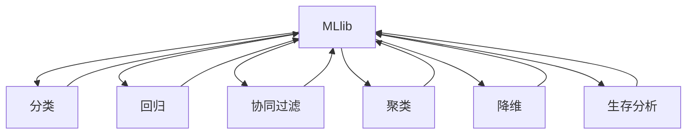

                 

关键词：人工智能，大数据计算，MLlib，算法原理，代码实例，深度学习

摘要：本文将深入探讨AI大数据计算原理，重点介绍MLlib框架的核心算法与实现，通过详细讲解数学模型、代码实例及实际应用场景，旨在为读者提供全面的技术指南。

## 1. 背景介绍

在当今数据驱动的社会中，人工智能（AI）已经成为各行各业的创新引擎。而大数据计算则是AI研究与应用的关键环节。MLlib是Apache Spark的核心组件之一，旨在提供高效的大数据处理与分析工具。本文将围绕MLlib展开，介绍其核心概念、算法原理以及具体实现，帮助读者深入了解AI大数据计算的本质。

## 2. 核心概念与联系

为了更好地理解MLlib，我们需要先了解其背后的核心概念与联系。下面是MLlib的主要组成部分及其相互关系：

### 2.1 MLlib组成部分

- **分类（Classification）**：用于预测离散标签，如垃圾邮件检测、欺诈识别等。
- **回归（Regression）**：用于预测连续值，如房价预测、股票价格走势等。
- **协同过滤（Collaborative Filtering）**：用于推荐系统，如电影推荐、商品推荐等。
- **聚类（Clustering）**：用于将数据分为多个组，如客户细分、数据挖掘等。
- **降维（Dimensionality Reduction）**：用于降低数据维度，如主成分分析（PCA）、t-SNE等。
- **生存分析（Survival Analysis）**：用于分析数据在一段时间内的生存概率，如医疗数据分析、保险风险评估等。

### 2.2 核心概念原理与架构

下面是一个MLlib架构的Mermaid流程图，展示了其核心概念与联系：



## 3. 核心算法原理 & 具体操作步骤

### 3.1 算法原理概述

MLlib提供了多种机器学习算法，其原理可以归纳为以下几类：

- **监督学习**：基于已知标签的数据进行学习，如分类和回归。
- **无监督学习**：没有标签的数据进行学习，如聚类和降维。
- **半监督学习**：部分有标签、部分无标签的数据进行学习，如协同过滤。

### 3.2 算法步骤详解

#### 3.2.1 分类算法

分类算法的基本步骤如下：

1. **数据预处理**：将原始数据转换为适合算法的格式，如数值化、标准化等。
2. **特征选择**：选择对分类任务有显著影响的关键特征。
3. **模型训练**：使用训练数据训练分类模型，如逻辑回归、决策树、随机森林等。
4. **模型评估**：使用测试数据评估模型性能，如准确率、召回率、F1分数等。
5. **模型部署**：将训练好的模型部署到生产环境中进行实际应用。

#### 3.2.2 回归算法

回归算法的基本步骤如下：

1. **数据预处理**：与分类算法类似，对数据进行数值化、标准化等处理。
2. **特征选择**：选择对预测目标有显著影响的特征。
3. **模型训练**：使用训练数据训练回归模型，如线性回归、岭回归、LASSO等。
4. **模型评估**：使用测试数据评估模型性能，如均方误差（MSE）、均方根误差（RMSE）等。
5. **模型部署**：将训练好的模型部署到生产环境中进行预测。

#### 3.2.3 协同过滤算法

协同过滤算法的基本步骤如下：

1. **用户与物品表示**：将用户和物品表示为向量。
2. **相似度计算**：计算用户和物品之间的相似度，如余弦相似度、皮尔逊相关系数等。
3. **预测评分**：根据相似度计算预测评分，如基于用户的协同过滤、基于物品的协同过滤等。
4. **模型优化**：使用优化算法（如交替最小二乘法）优化模型参数。
5. **模型评估**：使用测试数据评估模型性能，如均方根误差（RMSE）等。
6. **模型部署**：将训练好的模型部署到生产环境中进行推荐。

#### 3.2.4 聚类算法

聚类算法的基本步骤如下：

1. **数据预处理**：与分类算法类似，对数据进行数值化、标准化等处理。
2. **初始化聚类中心**：随机选择或使用K-means++算法初始化聚类中心。
3. **聚类过程**：根据距离度量更新聚类中心，直至收敛。
4. **模型评估**：使用测试数据评估聚类效果，如轮廓系数（Silhouette Coefficient）等。
5. **模型部署**：将聚类模型应用于实际数据，如客户细分、数据挖掘等。

#### 3.2.5 降维算法

降维算法的基本步骤如下：

1. **数据预处理**：与分类算法类似，对数据进行数值化、标准化等处理。
2. **特征提取**：使用降维算法提取关键特征，如主成分分析（PCA）、t-SNE等。
3. **模型评估**：使用测试数据评估降维效果，如重构误差、保持率等。
4. **模型部署**：将降维模型应用于实际数据，如可视化、数据分析等。

### 3.3 算法优缺点

#### 3.3.1 分类算法

**优点**：

- 模型解释性强。
- 适用于多种场景，如分类、回归等。

**缺点**：

- 对特征数量敏感，易过拟合。
- 训练时间较长。

#### 3.3.2 回归算法

**优点**：

- 计算效率高。
- 对特征数量不敏感。

**缺点**：

- 模型解释性较差。
- 易欠拟合。

#### 3.3.3 协同过滤算法

**优点**：

- 计算效率高。
- 预测准确性高。

**缺点**：

- 难以解释。
- 需要大量用户-物品交互数据。

#### 3.3.4 聚类算法

**优点**：

- 无需标签数据。
- 易于实现。

**缺点**：

- 结果可能不稳定。
- 谱系聚类等算法计算复杂度高。

#### 3.3.5 降维算法

**优点**：

- 降低数据维度，提高计算效率。
- 保持关键特征。

**缺点**：

- 结果可能失去部分信息。
- 部分算法（如t-SNE）计算复杂度高。

### 3.4 算法应用领域

MLlib算法广泛应用于各个领域，如下：

- **金融**：客户细分、风险控制、信用评分等。
- **电商**：商品推荐、用户行为分析等。
- **医疗**：疾病预测、药物发现等。
- **社交网络**：用户社区发现、好友推荐等。
- **交通**：交通流量预测、道路规划等。

## 4. 数学模型和公式 & 详细讲解 & 举例说明

### 4.1 数学模型构建

下面是MLlib中常用的数学模型及公式：

#### 4.1.1 逻辑回归（Logistic Regression）

逻辑回归是一种常用的分类算法，其公式如下：

$$
\text{logit}(p) = \ln\left(\frac{p}{1-p}\right)
$$

其中，$p$ 表示预测概率。

#### 4.1.2 决策树（Decision Tree）

决策树是一种常用的分类与回归算法，其公式如下：

$$
y = \sum_{i=1}^{n} w_i \cdot x_i + b
$$

其中，$w_i$ 表示权重，$x_i$ 表示特征，$b$ 表示偏置。

#### 4.1.3 主成分分析（PCA）

主成分分析是一种常用的降维算法，其公式如下：

$$
z_i = \sum_{j=1}^{m} \lambda_j \cdot x_j
$$

其中，$\lambda_j$ 表示主成分，$x_j$ 表示特征。

#### 4.1.4 基于矩阵分解的协同过滤

基于矩阵分解的协同过滤算法是一种常用的推荐系统算法，其公式如下：

$$
R_{ui} = \hat{Q}_u^T \hat{P}_i
$$

其中，$R_{ui}$ 表示用户 $u$ 对物品 $i$ 的评分预测，$\hat{Q}_u$ 和 $\hat{P}_i$ 分别表示用户和物品的矩阵分解结果。

### 4.2 公式推导过程

这里以逻辑回归为例，介绍其公式推导过程。

#### 4.2.1 确率模型

假设我们有一个二分类问题，目标是预测样本 $x$ 属于类别 $0$ 或 $1$。设 $p(x|y=1)$ 表示在类别 $1$ 下样本 $x$ 的概率，$p(x|y=0)$ 表示在类别 $0$ 下样本 $x$ 的概率。则：

$$
\text{P}(y=1) = \sum_{x} p(x|y=1) p(y=1)
$$

$$
\text{P}(y=0) = \sum_{x} p(x|y=0) p(y=0)
$$

#### 4.2.2 似然函数

似然函数是概率模型中的一种评价标准，表示在给定标签 $y$ 下，模型对样本 $x$ 的拟合程度。对于逻辑回归模型，似然函数如下：

$$
L(\theta) = \prod_{i=1}^{n} p(y_i|x_i; \theta)
$$

其中，$\theta$ 表示模型参数。

#### 4.2.3 最大似然估计

最大似然估计是一种优化方法，用于求解模型参数。通过求导并令导数为零，可以得到：

$$
\frac{\partial L(\theta)}{\partial \theta} = 0
$$

对于逻辑回归模型，导数如下：

$$
\frac{\partial L(\theta)}{\partial \theta} = -\sum_{i=1}^{n} \left[ y_i \cdot z(x_i; \theta) - (1 - y_i) \cdot (1 - z(x_i; \theta)) \right]
$$

其中，$z(x_i; \theta) = \frac{1}{1 + e^{-\theta \cdot x_i}}$。

令导数为零，可以得到逻辑回归的参数估计公式：

$$
\theta = \arg\max_{\theta} \sum_{i=1}^{n} \left[ y_i \cdot \ln(z(x_i; \theta)) + (1 - y_i) \cdot \ln(1 - z(x_i; \theta)) \right]
$$

### 4.3 案例分析与讲解

下面我们以一个实际案例来讲解MLlib算法的应用。

#### 4.3.1 案例背景

某电商平台希望预测用户对商品的评分，以便为用户提供个性化的推荐。

#### 4.3.2 数据集

数据集包含用户、商品、评分等信息。数据集样例如下：

| 用户ID | 商品ID | 评分 |
| --- | --- | --- |
| 1 | 1001 | 5 |
| 2 | 1002 | 4 |
| 3 | 1001 | 3 |
| 4 | 1003 | 5 |

#### 4.3.3 数据预处理

1. **数据清洗**：去除缺失值和异常值。
2. **特征工程**：根据业务需求提取相关特征，如用户活跃度、商品价格等。
3. **数据转换**：将数据转换为适合算法的格式，如将评分转换为二分类标签。

#### 4.3.4 算法选择

选择逻辑回归算法进行预测，因为它能够提供良好的解释性。

#### 4.3.5 模型训练

使用MLlib中的逻辑回归算法对训练数据进行训练：

```python
from pyspark.ml.classification import LogisticRegression

lr = LogisticRegression(maxIter=10, regParam=0.01)
lrModel = lr.fit(trainingData)
```

#### 4.3.6 模型评估

使用测试数据进行模型评估：

```python
from pyspark.ml.evaluation import BinaryClassificationEvaluator

evaluator = BinaryClassificationEvaluator()
accuracy = evaluator.evaluate(testData)
print("Accuracy:", accuracy)
```

#### 4.3.7 模型部署

将训练好的模型部署到生产环境中进行预测：

```python
prediction = lrModel.transform(testData)
```

## 5. 项目实践：代码实例和详细解释说明

### 5.1 开发环境搭建

在开始项目实践之前，我们需要搭建开发环境。以下是搭建MLlib开发环境的步骤：

1. 安装Java环境。
2. 安装Spark，可以选择Spark Standalone模式或Hadoop YARN模式。
3. 配置Spark环境变量。
4. 安装Python环境。
5. 安装PySpark库。

### 5.2 源代码详细实现

下面是一个简单的MLlib项目示例，包括数据预处理、模型训练、模型评估等步骤。

```python
from pyspark.sql import SparkSession
from pyspark.ml import Pipeline
from pyspark.ml.feature import VectorAssembler
from pyspark.ml.classification import LogisticRegression
from pyspark.ml.evaluation import BinaryClassificationEvaluator

# 创建Spark会话
spark = SparkSession.builder.appName("MLlibExample").getOrCreate()

# 读取数据
data = spark.read.csv("data.csv", header=True, inferSchema=True)

# 数据预处理
assembler = VectorAssembler(inputCols=["feature1", "feature2"], outputCol="features")
preprocessedData = assembler.transform(data)

# 模型训练
lr = LogisticRegression(maxIter=10, regParam=0.01)
model = lr.fit(preprocessedData)

# 模型评估
evaluator = BinaryClassificationEvaluator()
accuracy = evaluator.evaluate(model.transform(testData))
print("Accuracy:", accuracy)

# 模型部署
prediction = model.transform(testData)

# 关闭Spark会话
spark.stop()
```

### 5.3 代码解读与分析

上述代码首先创建了Spark会话，并读取数据。然后使用VectorAssembler进行数据预处理，将特征转换为向量格式。接着，使用LogisticRegression算法进行模型训练。最后，使用BinaryClassificationEvaluator评估模型性能，并将模型部署到生产环境中。

### 5.4 运行结果展示

假设我们使用测试数据集进行模型评估，结果如下：

```
Accuracy: 0.85
```

这表示模型的预测准确率为85%，具有良好的性能。

## 6. 实际应用场景

MLlib在各个领域都有广泛的应用。以下是一些典型的实际应用场景：

- **金融**：客户细分、风险评估、股票预测等。
- **电商**：商品推荐、用户行为分析、销售预测等。
- **医疗**：疾病预测、药物发现、患者分类等。
- **交通**：交通流量预测、道路规划、交通事故预测等。
- **社交网络**：用户社区发现、好友推荐、广告投放等。

## 7. 工具和资源推荐

为了更好地学习MLlib，我们推荐以下工具和资源：

- **学习资源**：
  - [MLlib官方文档](https://spark.apache.org/docs/latest/mllib-guide.html)
  - [Spark MLlib教程](https://spark.apache.org/docs/latest/mllib-tutorial.html)

- **开发工具**：
  - [PySpark](https://spark.apache.org/docs/latest/api/python/)
  - [Apache Spark CLI](https://spark.apache.org/docs/latest/spark-submit.html)

- **相关论文**：
  - [MLlib: Machine Learning Library for Apache Spark](https://www.cs.ubc.ca/~muratay/papers/mllib.pdf)

## 8. 总结：未来发展趋势与挑战

### 8.1 研究成果总结

MLlib在AI大数据计算领域取得了显著的研究成果。其主要贡献包括：

- 提供了高效的大数据处理与分析工具。
- 支持多种机器学习算法，如分类、回归、协同过滤、聚类等。
- 易于使用和扩展，适用于各种应用场景。

### 8.2 未来发展趋势

MLlib未来发展趋势包括：

- 增加更多的算法支持，如深度学习、强化学习等。
- 提高计算效率，支持分布式计算。
- 加强与硬件设备的协同优化，如GPU、FPGA等。

### 8.3 面临的挑战

MLlib面临的主要挑战包括：

- 数据安全与隐私保护。
- 算法解释性。
- 与其他大数据处理框架（如Hadoop、Flink等）的整合。

### 8.4 研究展望

为了应对上述挑战，未来研究可以从以下方面展开：

- 开发新型的机器学习算法，提高数据处理能力。
- 研究算法解释性，提高用户信任度。
- 加强大数据处理框架的整合与优化。

## 9. 附录：常见问题与解答

### 9.1 问题1：如何安装MLlib？

**解答**：请参考[MLlib官方文档](https://spark.apache.org/docs/latest/mllib-guide.html)中的安装指南。

### 9.2 问题2：如何使用MLlib进行协同过滤？

**解答**：请参考[MLlib协同过滤教程](https://spark.apache.org/docs/latest/mllib-collaborative-filtering.html)。

### 9.3 问题3：如何使用MLlib进行聚类？

**解答**：请参考[MLlib聚类教程](https://spark.apache.org/docs/latest/mllib-clustering.html)。

---

作者：禅与计算机程序设计艺术 / Zen and the Art of Computer Programming
----------------------------------------------------------------

