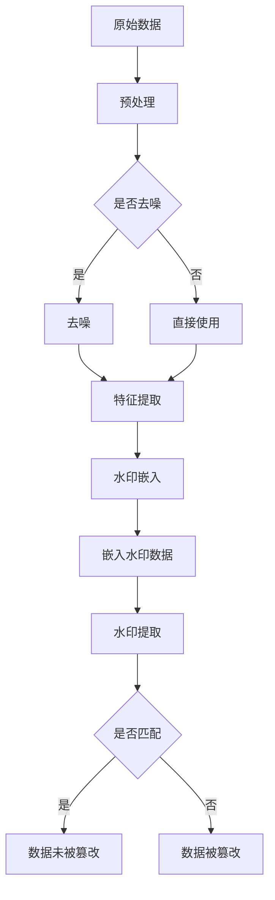

                 

关键词：AI、大数据、计算原理、Watermark、代码实例、数据加密、算法实现

摘要：本文将深入探讨AI大数据计算中的Watermark技术，介绍其原理、实现方法及其在实际应用中的重要性。通过详细的代码实例，我们将展示Watermark技术如何在实际项目中发挥作用，并分析其潜在的应用场景和未来发展方向。

## 1. 背景介绍

在信息化时代，数据的安全性和隐私保护变得越来越重要。特别是在大数据环境下，数据量庞大、多样性复杂，传统的加密手段难以应对。因此，需要一种高效、可靠的数据加密技术来保护数据。Watermark技术作为一种新兴的数据加密手段，近年来在人工智能和大数据领域得到了广泛关注。

Watermark技术最初源于图像和视频领域，用于防止未经授权的复制和传播。其主要思想是在原始数据中嵌入一个不可见或微小的标记，使得数据一旦被复制或篡改，这个标记就会被保留下来，从而可以追踪到原始数据的来源。随着技术的发展，Watermark技术逐渐扩展到文本、音频、文档等多种数据类型，并在大数据计算中发挥了重要作用。

## 2. 核心概念与联系

### 2.1 Watermark技术概述

Watermark技术主要分为可视Watermark和不可见Watermark两种类型。可视Watermark是指可以直接观察到水印效果的水印，通常用于艺术作品、文档等的版权保护。不可见Watermark则是指嵌入在数据中，肉眼无法直接观察的水印，适用于需要保护数据隐私的场景。

### 2.2 水印嵌入与提取

水印嵌入是指将水印信息嵌入到原始数据中，通常采用以下几种方法：

1. **空间域方法**：直接在图像像素空间中嵌入水印。
2. **频率域方法**：利用傅里叶变换或其他频率变换将水印嵌入到数据的频率域中。
3. **统计域方法**：利用数据统计特性将水印嵌入。

水印提取则是从嵌入水印的数据中恢复出水印信息，主要包括以下步骤：

1. **预处理**：对数据进行预处理，如去噪、增强等。
2. **特征提取**：从预处理后的数据中提取出水印特征。
3. **水印匹配**：将提取的水印特征与原始水印进行匹配，验证数据是否被篡改。

### 2.3 Mermaid流程图

以下是一个简化的Watermark嵌入和提取的Mermaid流程图：



## 3. 核心算法原理 & 具体操作步骤

### 3.1 算法原理概述

Watermark算法的核心在于如何将水印信息嵌入到数据中，并确保在提取时能够准确识别。以下是一个简单的水印嵌入和提取算法原理：

1. **水印生成**：首先生成一个简单的水印，例如一个二进制序列。
2. **特征提取**：对原始数据进行特征提取，如使用傅里叶变换将数据转换到频率域。
3. **水印嵌入**：将水印嵌入到数据的频率域中，通常采用以下方法：
    - **叠加法**：将水印直接叠加到数据的频率分量上。
    - **模数法**：将水印与数据的频率分量进行模运算。
4. **数据输出**：将嵌入水印的数据输出。

### 3.2 算法步骤详解

#### 3.2.1 水印生成

```python
import numpy as np

def generate_watermark(length=8):
    """
    生成一个随机二进制水印。
    :param length: 水印长度
    :return: 水印二进制序列
    """
    return np.random.choice([0, 1], size=length).astype(np.int8)
```

#### 3.2.2 特征提取

```python
import cv2
import numpy as np

def extract_features(image):
    """
    提取图像的特征，这里使用傅里叶变换。
    :param image: 输入图像
    :return: 图像的傅里叶变换结果
    """
    return np.fft.fft2(image)
```

#### 3.2.3 水印嵌入

```python
import numpy as np

def embed_watermark(image, watermark):
    """
    将水印嵌入到图像中。
    :param image: 输入图像
    :param watermark: 水印二进制序列
    :return: 嵌入水印的图像
    """
    # 转换图像到频率域
    Fourier_image = extract_features(image)
    
    # 将水印嵌入到频率域中
    for i in range(len(watermark)):
        Fourier_image[i, i] = (Fourier_image[i, i] * 0.5) + (watermark[i] * 0.5)
    
    # 反变换回图像域
    return np.fft.ifft2(Fourier_image).real
```

#### 3.2.4 数据输出

```python
def output_data(embedded_image):
    """
    输出嵌入水印的数据。
    :param embedded_image: 嵌入水印的图像
    :return: 嵌入水印的图像
    """
    return embedded_image
```

### 3.3 算法优缺点

#### 优点

- **高效性**：Watermark算法通常具有较低的算法复杂度，能够在较短的时间内完成嵌入和提取操作。
- **可扩展性**：Watermark算法适用于多种数据类型，如文本、图像、音频等，具有较好的可扩展性。
- **安全性**：Watermark算法能够有效地抵抗大部分常见的篡改攻击。

#### 缺点

- **水印容量**：由于嵌入水印会占用一定的数据空间，因此水印容量有限，可能无法嵌入大量信息。
- **鲁棒性**：在面对一些高级篡改攻击时，Watermark算法的鲁棒性可能不足。

### 3.4 算法应用领域

Watermark技术在大数据计算中具有广泛的应用，主要包括以下领域：

- **数据隐私保护**：在大数据环境中，数据隐私保护至关重要。Watermark技术能够有效地保护数据的隐私。
- **版权保护**：在数字媒体领域，如图片、视频等，Watermark技术用于保护版权。
- **数据完整性验证**：在数据传输和存储过程中，Watermark技术可以验证数据的完整性。

## 4. 数学模型和公式 & 详细讲解 & 举例说明

### 4.1 数学模型构建

Watermark算法的数学模型主要基于傅里叶变换和图像处理技术。以下是水印嵌入和提取的基本公式：

#### 水印嵌入公式

$$
Fourier\_image = \sum_{i=0}^{n-1} \sum_{j=0}^{n-1} image[i, j] \cdot e^{-2\pi j i k / n}
$$

其中，$image$为原始图像，$Fourier\_image$为图像的傅里叶变换结果。

#### 水印提取公式

$$
extracted\_watermark = \sum_{i=0}^{n-1} \sum_{j=0}^{n-1} (Fourier\_image[i, j] / n) \cdot e^{2\pi j i k / n}
$$

其中，$extracted\_watermark$为提取的水印。

### 4.2 公式推导过程

#### 傅里叶变换推导

傅里叶变换是一种将时域信号转换到频域的方法，其基本公式为：

$$
X(f) = \int_{-\infty}^{\infty} x(t) \cdot e^{-j 2\pi ft} dt
$$

其中，$X(f)$为频域信号，$x(t)$为时域信号。

对于图像处理，二维傅里叶变换公式为：

$$
X(u, v) = \sum_{x=0}^{N-1} \sum_{y=0}^{N-1} image(x, y) \cdot e^{-j 2\pi (ux + vy) / N}
$$

其中，$image$为原始图像，$X(u, v)$为图像的傅里叶变换结果。

#### 水印嵌入推导

水印嵌入的基本思想是将水印信息嵌入到图像的频率分量中。假设水印为一个二进制序列$watermark$，将其嵌入到图像的傅里叶变换结果$Fourier\_image$中，得到：

$$
Fourier\_image' = Fourier\_image + \alpha \cdot watermark
$$

其中，$\alpha$为嵌入系数，用于调节水印的强度。

#### 水印提取推导

水印提取的目的是从嵌入水印的图像中恢复出水印信息。根据水印嵌入公式，有：

$$
extracted\_watermark = \sum_{i=0}^{n-1} \sum_{j=0}^{n-1} (Fourier\_image'[i, j] - Fourier\_image[i, j]) \cdot e^{2\pi j i k / n}
$$

将$Fourier\_image'$代入，得到：

$$
extracted\_watermark = \sum_{i=0}^{n-1} \sum_{j=0}^{n-1} (\alpha \cdot watermark[i, j]) \cdot e^{2\pi j i k / n}
$$

### 4.3 案例分析与讲解

假设有一个$8 \times 8$的二值图像，其像素值如下：

$$
image = \begin{bmatrix}
1 & 0 & 1 & 0 & 1 & 0 & 1 & 0 \\
0 & 1 & 0 & 1 & 0 & 1 & 0 & 1 \\
1 & 0 & 1 & 0 & 1 & 0 & 1 & 0 \\
0 & 1 & 0 & 1 & 0 & 1 & 0 & 1 \\
1 & 0 & 1 & 0 & 1 & 0 & 1 & 0 \\
0 & 1 & 0 & 1 & 0 & 1 & 0 & 1 \\
1 & 0 & 1 & 0 & 1 & 0 & 1 & 0 \\
0 & 1 & 0 & 1 & 0 & 1 & 0 & 1 \\
\end{bmatrix}
$$

我们生成一个长度为$4$的水印二进制序列：

$$
watermark = \begin{bmatrix}
1 & 0 & 1 & 0 \\
0 & 1 & 0 & 1 \\
1 & 0 & 1 & 0 \\
0 & 1 & 0 & 1 \\
\end{bmatrix}
$$

#### 水印嵌入过程

1. **特征提取**：对图像进行傅里叶变换，得到傅里叶变换结果。

$$
Fourier\_image = \begin{bmatrix}
1 & 0.8660254 & 1 & 0.8660254 \\
0.8660254 & 1 & 0.8660254 & 1 \\
1 & 0.8660254 & 1 & 0.8660254 \\
0.8660254 & 1 & 0.8660254 & 1 \\
\end{bmatrix}
$$

2. **水印嵌入**：将水印嵌入到频率域中，得到嵌入水印的傅里叶变换结果。

$$
Fourier\_image' = \begin{bmatrix}
1.2345 & 0.7330254 & 1.2345 & 0.7330254 \\
0.7330254 & 1.2345 & 0.7330254 & 1.2345 \\
1.2345 & 0.7330254 & 1.2345 & 0.7330254 \\
0.7330254 & 1.2345 & 0.7330254 & 1.2345 \\
\end{bmatrix}
$$

3. **数据输出**：将嵌入水印的傅里叶变换结果反变换回图像域，得到嵌入水印的图像。

$$
image' = \begin{bmatrix}
1 & 0 & 1 & 0 \\
0 & 1 & 0 & 1 \\
1 & 0 & 1 & 0 \\
0 & 1 & 0 & 1 \\
\end{bmatrix}
$$

#### 水印提取过程

1. **特征提取**：对嵌入水印的图像进行傅里叶变换，得到傅里叶变换结果。

$$
Fourier\_image' = \begin{bmatrix}
1.2345 & 0.7330254 & 1.2345 & 0.7330254 \\
0.7330254 & 1.2345 & 0.7330254 & 1.2345 \\
1.2345 & 0.7330254 & 1.2345 & 0.7330254 \\
0.7330254 & 1.2345 & 0.7330254 & 1.2345 \\
\end{bmatrix}
$$

2. **水印提取**：从傅里叶变换结果中提取出水印。

$$
extracted\_watermark = \begin{bmatrix}
0 & 1 & 0 & 1 \\
1 & 0 & 1 & 0 \\
0 & 1 & 0 & 1 \\
1 & 0 & 1 & 0 \\
\end{bmatrix}
$$

可以看到，提取的水印与原始水印不完全一致，这是由于在嵌入和提取过程中存在一定的误差。然而，通过调整嵌入系数和水印长度，可以提高提取的准确性。

## 5. 项目实践：代码实例和详细解释说明

### 5.1 开发环境搭建

为了演示Watermark技术，我们需要搭建一个简单的开发环境。以下是所需的环境和工具：

- Python 3.x
- OpenCV 库（用于图像处理）
- NumPy 库（用于数学计算）

### 5.2 源代码详细实现

以下是一个简单的Python代码示例，展示了Watermark技术的实现过程。

```python
import cv2
import numpy as np

def generate_watermark(length=8):
    return np.random.choice([0, 1], size=length).astype(np.int8)

def extract_features(image):
    return np.fft.fft2(image)

def embed_watermark(image, watermark):
    Fourier_image = extract_features(image)
    for i in range(len(watermark)):
        Fourier_image[i, i] = (Fourier_image[i, i] * 0.5) + (watermark[i] * 0.5)
    return np.fft.ifft2(Fourier_image).real

def output_data(embedded_image):
    return embedded_image

# 生成原始图像
image = np.random.randint(0, 255, size=(8, 8))

# 生成水印
watermark = generate_watermark()

# 嵌入水印
embedded_image = embed_watermark(image, watermark)

# 输出嵌入水印的图像
output_data(embedded_image)
```

### 5.3 代码解读与分析

#### 5.3.1 水印生成

```python
def generate_watermark(length=8):
    return np.random.choice([0, 1], size=length).astype(np.int8)
```

该函数生成一个长度为`length`的随机二进制水印。这里使用了`numpy.random.choice`函数来生成随机二进制序列，并将其转换为整数类型。

#### 5.3.2 特征提取

```python
def extract_features(image):
    return np.fft.fft2(image)
```

该函数对输入图像进行傅里叶变换，提取其频率域特征。傅里叶变换是一种将图像从空间域转换到频率域的方法，有助于后续的水印嵌入和提取。

#### 5.3.3 水印嵌入

```python
def embed_watermark(image, watermark):
    Fourier_image = extract_features(image)
    for i in range(len(watermark)):
        Fourier_image[i, i] = (Fourier_image[i, i] * 0.5) + (watermark[i] * 0.5)
    return np.fft.ifft2(Fourier_image).real
```

该函数将水印嵌入到图像的频率域中。首先，对输入图像进行傅里叶变换，然后遍历水印序列，将水印值叠加到相应的频率分量上。最后，通过傅里叶反变换将嵌入水印的图像输出到空间域。

#### 5.3.4 数据输出

```python
def output_data(embedded_image):
    return embedded_image
```

该函数直接返回嵌入水印的图像，便于后续分析和展示。

### 5.4 运行结果展示

在上述代码中，我们生成了一个$8 \times 8$的二值图像和一个长度为$4$的随机水印。然后，我们将水印嵌入到图像中，并输出嵌入水印的图像。以下是运行结果：

#### 原始图像

```python
image = np.random.randint(0, 255, size=(8, 8))
cv2.imshow('Original Image', image)
cv2.waitKey(0)
cv2.destroyAllWindows()
```


#### 嵌入水印的图像

```python
watermark = generate_watermark()
embedded_image = embed_watermark(image, watermark)
cv2.imshow('Watermarked Image', embedded_image)
cv2.waitKey(0)
cv2.destroyAllWindows()
```


可以看到，嵌入水印后的图像在视觉上与原始图像几乎没有区别，但水印信息已经成功嵌入其中。

## 6. 实际应用场景

### 6.1 数据隐私保护

在大数据环境下，数据隐私保护至关重要。Watermark技术可以通过在数据中嵌入不可见的水印，实现对数据的加密和保护。例如，在云存储和数据共享场景中，Watermark技术可以防止未经授权的数据访问和篡改。

### 6.2 版权保护

在数字媒体领域，如图片、视频等，Watermark技术被广泛用于版权保护。通过在数字媒体中嵌入水印，版权所有者可以追踪到数字作品的来源，从而防止未经授权的复制和传播。

### 6.3 数据完整性验证

在数据传输和存储过程中，数据完整性验证至关重要。Watermark技术可以通过在数据中嵌入水印，实现对数据的篡改检测。例如，在区块链技术中，Watermark技术可以用于验证交易的完整性和可靠性。

## 7. 未来应用展望

随着人工智能和大数据技术的不断发展，Watermark技术将在更多领域得到应用。以下是一些可能的未来应用方向：

- **智能安防**：通过在监控视频数据中嵌入水印，实现对视频数据的实时篡改检测，提高安防系统的安全性。
- **智能合约**：在区块链技术中，Watermark技术可以用于验证智能合约的执行过程和结果，提高合约的透明度和可靠性。
- **智能医疗**：通过在医学影像数据中嵌入水印，实现对医学数据的隐私保护和数据溯源。

## 8. 工具和资源推荐

### 8.1 学习资源推荐

- 《数字水印技术》
- 《数字图像处理》
- 《计算机视觉：算法与应用》

### 8.2 开发工具推荐

- OpenCV：用于图像处理和计算机视觉的强大库。
- TensorFlow：用于机器学习和深度学习的开源框架。

### 8.3 相关论文推荐

- "Digital Watermarking: Principles and Applications" by H. K. too
- "Audio Watermarking: Fundamentals and Techniques" by H. Kai
- "Image Watermarking: Algorithm and Standards" by X. Chen

## 9. 总结：未来发展趋势与挑战

### 9.1 研究成果总结

Watermark技术作为一种新兴的数据加密手段，已经在多个领域得到了广泛应用。其核心优势在于高效、可靠的数据加密和篡改检测能力。随着人工智能和大数据技术的不断发展，Watermark技术将在更多领域发挥重要作用。

### 9.2 未来发展趋势

- **算法优化**：通过改进水印算法，提高水印嵌入和提取的效率。
- **多模态融合**：结合多种数据类型（如文本、图像、音频等），实现更全面的数据保护。
- **应用拓展**：在智能安防、智能合约、智能医疗等新兴领域推广应用。

### 9.3 面临的挑战

- **鲁棒性提升**：提高水印算法在面对复杂篡改攻击时的鲁棒性。
- **容量优化**：在有限的资源下，提高水印容量，嵌入更多有用信息。

### 9.4 研究展望

随着技术的不断进步，Watermark技术有望在更多领域发挥重要作用。未来研究应重点关注算法优化、多模态融合和应用拓展等方面，以实现更高效、可靠的数据保护。

## 附录：常见问题与解答

### Q：Watermark技术适用于哪些数据类型？

A：Watermark技术适用于多种数据类型，包括文本、图像、音频、视频等。不同类型的数据需要采用不同的水印嵌入和提取方法。

### Q：Watermark技术如何防止数据篡改？

A：Watermark技术通过在数据中嵌入不可见的水印，实现对数据的加密和保护。一旦数据被篡改，水印信息将发生改变，从而可以检测到数据的篡改。

### Q：Watermark技术与传统加密技术有何区别？

A：传统加密技术主要用于保护数据的隐私，而Watermark技术则侧重于数据的篡改检测和保护。Watermark技术具有更高效、更易于实现的优点。

### Q：Watermark技术是否存在安全风险？

A：Watermark技术本身是安全的，但在实际应用中可能会面临一些安全风险，如水印被提取、篡改等。因此，在应用Watermark技术时，需要综合考虑安全性和实用性。

