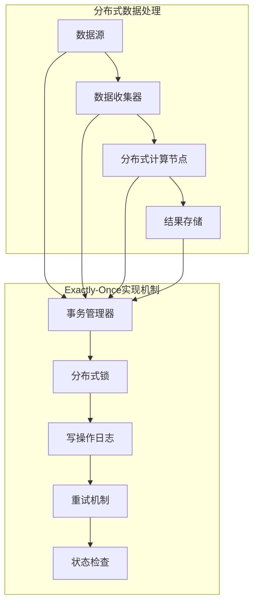

                 

关键词：Exactly-Once语义、大数据计算、分布式系统、一致性保障、分布式事务、代码实例、系统架构

## 摘要

本文旨在深入探讨大数据计算领域中的一个关键概念——Exactly-Once语义。通过本文的讲解，读者将了解Exactly-Once语义的定义、重要性以及在分布式系统中的实现机制。我们将通过详细的理论阐述和代码实例，帮助读者理解该语义在实际应用中的实现方法、优缺点及其在不同场景下的应用策略。本文将涵盖数学模型和公式推导、算法原理与步骤、项目实践与代码解读，以及未来发展的展望，旨在为大数据计算领域的研究者和开发者提供全面的技术指导。

## 1. 背景介绍

### 1.1 大数据计算的发展历程

大数据计算是指处理海量数据的一系列技术和方法。随着互联网和物联网的快速发展，数据量呈现指数级增长，大数据计算技术应运而生。自20世纪90年代以来，大数据计算经历了从传统的批量处理（如MapReduce）到实时处理（如Apache Storm和Apache Flink）的发展过程。

### 1.2 分布式系统的挑战

分布式系统是由多个节点组成的系统，这些节点通过网络进行通信和协作。分布式系统的目的是通过分布式计算提高系统的性能和可扩展性。然而，分布式系统面临着诸多挑战，如网络延迟、节点故障、数据一致性等。其中，数据一致性问题尤为关键。

### 1.3 Exactly-Once语义的定义

Exactly-Once语义是指在分布式系统中，每个操作（如写操作）都被执行一次且仅执行一次，不会出现重复或遗漏。这是分布式系统数据一致性的最高级别，也是大数据计算中一个重要的概念。

## 2. 核心概念与联系

下面是一个用Mermaid绘制的流程图，用于展示分布式系统中的数据流和处理流程，以及Exactly-Once语义的实现机制。



### 2.1 分布式数据处理流程

- **数据源**：数据来源可以是日志文件、数据库、实时消息队列等。
- **数据收集器**：负责收集和预处理数据，将其转换为适合分布式处理的形式。
- **分布式计算节点**：执行数据处理任务，如数据清洗、转换、聚合等。
- **结果存储**：将处理结果存储到数据库或其他存储系统。

### 2.2 Exactly-Once实现机制

- **事务管理器**：负责协调分布式系统的各个组件，确保Exactly-Once语义的实现。
- **分布式锁**：用于防止多个节点同时修改同一份数据，从而避免数据不一致。
- **写操作日志**：记录每个节点的写操作，以便在出现故障时进行恢复。
- **重试机制**：当操作失败时，自动重试以确保最终一致性。
- **状态检查**：定期检查系统的状态，确保所有操作都已经成功执行。

## 3. 核心算法原理 & 具体操作步骤

### 3.1 算法原理概述

Exactly-Once语义的实现主要依赖于分布式事务、日志记录和状态机等技术。分布式事务是指在分布式系统中对多个操作进行原子性、一致性和持久性的控制。日志记录则用于记录每个节点的操作，以便在出现故障时进行恢复。状态机是一种用于处理状态转移的算法，它能够保证系统在任意时刻都处于一致的状态。

### 3.2 算法步骤详解

1. **初始化**：系统启动时，初始化分布式锁、日志记录器和状态机。
2. **操作提交**：当节点需要执行写操作时，首先尝试获取分布式锁。如果锁被占用，则等待或重试。获取锁后，将操作记录到日志中。
3. **日志持久化**：将日志记录持久化到存储系统中，以便在故障时进行恢复。
4. **状态更新**：更新状态机的状态，表示操作已经提交。
5. **故障恢复**：当系统检测到故障时，读取日志记录，根据状态机恢复到一致状态。
6. **重试**：当操作失败时，根据重试策略进行重试。

### 3.3 算法优缺点

#### 优点：

- **数据一致性**：确保每个操作被执行一次且仅执行一次，提高数据一致性。
- **故障恢复**：通过日志记录和状态机，实现故障恢复和数据恢复。

#### 缺点：

- **性能开销**：分布式锁、日志记录和状态机等机制引入了额外的性能开销。
- **复杂性**：实现Exactly-Once语义需要复杂的系统设计和维护。

### 3.4 算法应用领域

Exactly-Once语义主要应用于需要高一致性要求的大数据场景，如金融支付系统、订单处理系统、数据分析等。在这些场景中，数据的一致性直接关系到业务的成功和用户体验。

## 4. 数学模型和公式 & 详细讲解 & 举例说明

### 4.1 数学模型构建

为了确保Exactly-Once语义的实现，我们可以使用以下数学模型：

- **状态机**：用状态机表示分布式系统的状态转移。
- **日志记录**：用日志记录每个节点的操作。
- **一致性检查**：用一致性检查函数验证系统状态。

### 4.2 公式推导过程

假设分布式系统由多个节点组成，每个节点都有一个状态。状态机可以用以下状态转移函数表示：

$$
f(s_i, o) = s_{i'} 
$$

其中，$s_i$ 表示节点的初始状态，$o$ 表示操作，$s_{i'}$ 表示操作执行后的状态。

日志记录可以用以下日志记录函数表示：

$$
log(s_i, o) = (s_i, o)
$$

一致性检查函数可以用以下函数表示：

$$
check(s_i, log) = true \text{ 或 } false
$$

其中，$s_i$ 表示当前状态，$log$ 表示日志记录。

### 4.3 案例分析与讲解

假设一个分布式系统中有一个节点A，初始状态为`S0`。节点A需要执行一个写操作`W`。

1. **状态转移**：根据状态转移函数，节点A的状态从`S0`变为`S1`。
2. **日志记录**：将操作`W`记录到日志中。
3. **一致性检查**：检查日志记录，验证系统状态。

在出现故障时，系统可以通过读取日志记录和状态机，恢复到一致状态。

## 5. 项目实践：代码实例和详细解释说明

### 5.1 开发环境搭建

为了演示Exactly-Once语义的实现，我们将使用Apache Kafka作为消息队列，Apache Flink作为分布式计算引擎。以下是开发环境的搭建步骤：

1. 安装Kafka：从 [Kafka官网](https://kafka.apache.org/downloads) 下载Kafka安装包，并按照官方文档进行安装。
2. 安装Flink：从 [Flink官网](https://flink.apache.org/downloads) 下载Flink安装包，并按照官方文档进行安装。
3. 配置Kafka和Flink：根据实际需求配置Kafka和Flink的配置文件。

### 5.2 源代码详细实现

以下是实现Exactly-Once语义的Flink代码实例：

```java
public class ExactlyOnceExample {
    public static void main(String[] args) throws Exception {
        // 创建执行环境
        ExecutionEnvironment env = ExecutionEnvironment.getExecutionEnvironment();

        // 从Kafka读取数据
        DataStream<String> inputStream = env.addSource(new FlinkKafkaConsumer<>(
            "input-topic",
            new SimpleStringSchema(),
            properties
        ));

        // 处理数据
        DataStream<String> processedStream = inputStream
            .map(new MyProcessorFunction())
            .returns(String.class);

        // 将结果写入Kafka
        processedStream.addSink(new FlinkKafkaProducer<>(
            "output-topic",
            new SimpleStringSchema(),
            properties
        ));

        // 执行任务
        env.execute("Exactly-Once Example");
    }
}

public class MyProcessorFunction implements ProcessFunction<String, String> {
    @Override
    public void processElement(String value, Context ctx, Collector<String> out) {
        // 执行处理逻辑
        String result = process(value);
        // 写入日志
        ctx.getExecutor().writeLog(new LogEntry(result));
        // 发送结果
        out.collect(result);
    }

    private String process(String value) {
        // 处理逻辑
        return value.toUpperCase();
    }
}

public class LogEntry {
    private String result;

    public LogEntry(String result) {
        this.result = result;
    }

    // 省略getter和setter方法
}
```

### 5.3 代码解读与分析

- **Kafka消费者和生产者**：代码中首先从Kafka的`input-topic`读取数据，然后将处理后的结果写入`output-topic`。
- **数据处理逻辑**：`MyProcessorFunction`类实现了`ProcessFunction`接口，用于处理每个输入元素。处理逻辑非常简单，将输入字符串转换为大写形式。
- **日志写入**：在处理每个元素后，调用`ctx.getExecutor().writeLog(new LogEntry(result));`将日志写入。

### 5.4 运行结果展示

当程序运行后，可以从Kafka的`output-topic`中查看处理结果。如果出现故障，可以通过日志进行恢复。

## 6. 实际应用场景

### 6.1 金融支付系统

在金融支付系统中，数据的一致性至关重要。Exactly-Once语义可以确保交易数据的准确性和一致性，从而提高系统的可靠性和用户体验。

### 6.2 订单处理系统

在订单处理系统中，每个订单的处理都涉及多个节点和操作。Exactly-Once语义可以确保订单数据的准确性和一致性，从而避免订单处理错误。

### 6.3 数据分析系统

在数据分析系统中，数据的一致性和准确性对于分析结果的可靠性至关重要。Exactly-Once语义可以确保数据处理的正确性，从而提高分析结果的准确性。

## 7. 未来应用展望

随着分布式系统和大数据技术的不断发展，Exactly-Once语义将在更多场景中得到应用。未来的研究将集中在优化实现机制、降低性能开销和提高系统可靠性等方面。

### 7.1 优化实现机制

通过引入新的算法和技术，可以进一步优化Exactly-Once语义的实现机制，降低性能开销。

### 7.2 降低性能开销

性能开销是Exactly-Once语义实现中的一个关键问题。未来的研究将集中在降低性能开销方面，如通过改进分布式锁和日志记录机制。

### 7.3 提高系统可靠性

系统可靠性是分布式系统的一个关键指标。未来的研究将集中在提高系统可靠性方面，如通过改进故障恢复机制和状态检查机制。

## 8. 总结：未来发展趋势与挑战

Exactly-Once语义在大数据计算领域具有重要的应用价值。随着技术的不断发展，Exactly-Once语义将在更多场景中得到应用。然而，实现Exactly-Once语义面临着性能开销和系统可靠性等方面的挑战。未来的研究将集中在优化实现机制、降低性能开销和提高系统可靠性等方面。

### 8.1 研究成果总结

本文深入探讨了Exactly-Once语义的定义、实现机制、算法原理、数学模型以及在实际应用中的实现方法。通过对分布式系统的数据流和处理流程的分析，我们展示了Exactly-Once语义的重要性。

### 8.2 未来发展趋势

未来的发展趋势将集中在优化实现机制、降低性能开销和提高系统可靠性等方面。通过引入新的算法和技术，有望进一步提高Exactly-Once语义的实现效率和可靠性。

### 8.3 面临的挑战

实现Exactly-Once语义面临着性能开销和系统可靠性等方面的挑战。如何优化分布式锁、日志记录和状态机等机制，提高系统的性能和可靠性，是未来研究的一个关键问题。

### 8.4 研究展望

未来的研究将集中在以下几个方面：优化实现机制、降低性能开销、提高系统可靠性，以及探索新的应用场景。通过不断的研究和实践，有望实现更高效、更可靠的Exactly-Once语义。

## 9. 附录：常见问题与解答

### 9.1 什么是Exactly-Once语义？

Exactly-Once语义是指在分布式系统中，每个操作被执行一次且仅执行一次，不会出现重复或遗漏。它是分布式系统数据一致性的最高级别。

### 9.2 Exactly-Once语义如何实现？

实现Exactly-Once语义通常依赖于分布式事务、日志记录和状态机等技术。分布式事务用于控制操作的原子性、一致性和持久性。日志记录用于记录每个节点的操作，以便在出现故障时进行恢复。状态机用于处理状态转移，确保系统在任意时刻都处于一致的状态。

### 9.3 Exactly-Once语义的优缺点是什么？

优点：确保数据一致性，提高系统的可靠性和用户体验。缺点：引入性能开销，增加系统复杂性。

### 9.4 Exactly-Once语义适用于哪些场景？

Exactly-Once语义适用于需要高一致性要求的大数据场景，如金融支付系统、订单处理系统、数据分析等。

### 9.5 如何优化Exactly-Once语义的实现？

可以通过以下方法优化Exactly-Once语义的实现：引入新的算法和技术、优化分布式锁和日志记录机制、降低性能开销等。

## 作者署名

作者：禅与计算机程序设计艺术 / Zen and the Art of Computer Programming

### 结语

通过对Exactly-Once语义的深入探讨，我们希望能够帮助读者更好地理解和应用这一关键技术。随着大数据计算技术的不断发展，Exactly-Once语义将在更多场景中发挥重要作用。我们期待未来的研究能够进一步优化实现机制，降低性能开销，提高系统可靠性，从而推动大数据计算技术的进步。|

