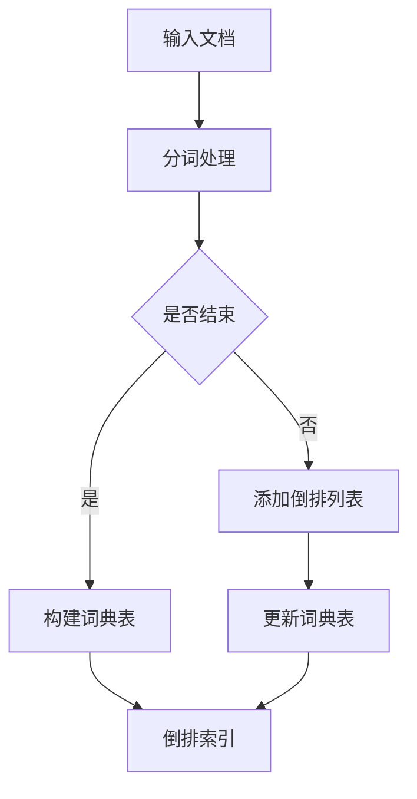

                 

 关键词：AI、大数据、计算原理、倒排索引、代码实例、深度学习、搜索引擎

> 摘要：本文将深入探讨倒排索引在AI大数据计算中的应用原理，从核心概念到算法原理，再到数学模型与实际代码实例，全面解析倒排索引的构建与应用，旨在为读者提供清晰、易懂的技术指导。

## 1. 背景介绍

在信息化时代，数据已经成为一项重要的战略资源。随着互联网和物联网技术的不断发展，大数据的时代已经到来。如何高效地对海量数据进行检索和分析，成为当前研究的热点问题。倒排索引（Inverted Index）作为一种高效的数据检索技术，被广泛应用于搜索引擎、文本挖掘、信息检索等领域。

倒排索引的核心理念是将文档中的词汇（单词、字符等）与文档的唯一标识（如文档ID）建立反向索引，通过词汇快速定位到包含该词汇的文档。相比于传统的索引方法，倒排索引具有检索速度快、存储空间小的优点，非常适合大规模数据的高效处理。

## 2. 核心概念与联系

### 2.1 倒排索引的基本概念

倒排索引主要由两部分组成：词典表和倒排列表。

- **词典表**：记录所有唯一的词汇及其对应的倒排列表索引。
- **倒排列表**：记录包含特定词汇的所有文档的ID列表。

### 2.2 倒排索引的架构

为了更好地理解倒排索引的构建，我们可以通过以下Mermaid流程图来展示其核心架构：



### 2.3 倒排索引与正向索引的关系

正向索引（Forward Index）是指按照文档顺序存储每个文档中每个单词的索引列表。与正向索引相比，倒排索引的查找效率更高，特别是在大规模数据检索场景中。

### 2.4 倒排索引的优势

- **快速检索**：通过词汇快速定位到包含该词汇的文档，检索速度快。
- **存储空间小**：倒排索引只存储词汇和文档ID的映射关系，相比正向索引可以节省大量存储空间。
- **支持多种查询**：可以支持精确查询、模糊查询等多种查询方式。

## 3. 核心算法原理 & 具体操作步骤

### 3.1 算法原理概述

倒排索引的核心算法是分词和索引构建。以下是构建倒排索引的简要步骤：

1. **分词**：将输入的文档按照一定的规则（如正则表达式、词典匹配等）进行分词，得到一系列词汇。
2. **构建倒排列表**：将每个词汇与其对应的文档ID建立映射关系，形成倒排列表。
3. **构建词典表**：记录所有唯一的词汇及其对应的倒排列表索引。
4. **优化索引**：对倒排索引进行优化，以提高检索效率。

### 3.2 算法步骤详解

#### 3.2.1 分词

分词是构建倒排索引的第一步。常见的分词方法包括：

- **基于词典的分词**：通过词典库进行匹配，将文本划分为词语。
- **基于统计的分词**：利用统计模型（如n-gram模型、隐马尔可夫模型等）进行分词。

#### 3.2.2 构建倒排列表

构建倒排列表是将分词得到的词汇与文档ID建立映射关系。具体步骤如下：

1. **初始化**：创建一个空字典，用于存储词汇和文档ID的映射关系。
2. **遍历文档**：对于每个文档，遍历其中的每个词汇，将其添加到字典中。
3. **处理同义词**：对于同义词，可以通过映射关系将它们指向同一个倒排列表。

#### 3.2.3 构建词典表

构建词典表是记录所有唯一的词汇及其对应倒排列表索引的过程。具体步骤如下：

1. **初始化**：创建一个空列表，用于存储词典项。
2. **遍历倒排列表**：对于每个倒排列表，将其中的词汇和文档ID添加到词典表中。
3. **处理重复项**：对于重复的词汇，只需保留一个词典项。

#### 3.2.4 优化索引

优化索引的目的是提高检索效率。常见的优化方法包括：

- **词典压缩**：通过压缩词典表，减少存储空间。
- **倒排列表合并**：将多个倒排列表合并，减少磁盘I/O操作。
- **缓存技术**：利用缓存技术，减少磁盘访问次数。

### 3.3 算法优缺点

#### 优点

- **检索速度快**：通过词汇快速定位到包含该词汇的文档，检索速度快。
- **存储空间小**：倒排索引只存储词汇和文档ID的映射关系，相比正向索引可以节省大量存储空间。

#### 缺点

- **构建成本高**：构建倒排索引需要大量的计算资源。
- **更新困难**：倒排索引不支持增量更新，每次更新都需要重新构建索引。

### 3.4 算法应用领域

倒排索引广泛应用于以下领域：

- **搜索引擎**：通过倒排索引实现快速全文检索。
- **文本挖掘**：用于提取关键词、分析文本内容等。
- **信息检索**：用于构建知识库、问答系统等。

## 4. 数学模型和公式 & 详细讲解 & 举例说明

### 4.1 数学模型构建

倒排索引的构建涉及多个数学模型，主要包括：

- **分词模型**：用于实现文本分词。
- **映射模型**：用于将词汇与文档ID建立映射关系。
- **优化模型**：用于优化倒排索引的结构。

### 4.2 公式推导过程

以下是构建倒排索引的简要公式推导：

1. **分词模型**：令 $T$ 为文本集合，$W$ 为词汇集合，$t$ 为文本 $T$ 的分词结果，则有：

   $$ t = \text{Split}(T, \text{SplitRule}) $$

   其中，$\text{SplitRule}$ 为分词规则。

2. **映射模型**：令 $I$ 为倒排列表，$D$ 为文档集合，$w$ 为词汇 $w$ 的倒排列表索引，则有：

   $$ I = \text{Map}(W, D) $$

   其中，$\text{Map}$ 为映射操作。

3. **优化模型**：令 $O$ 为优化后的倒排索引，则有：

   $$ O = \text{Optimize}(I) $$

   其中，$\text{Optimize}$ 为优化操作。

### 4.3 案例分析与讲解

假设我们有一个简单的文档集合，如下所示：

```
文档1：我有一个梦想
文档2：梦想总是要有的
文档3：梦想实现的那一天
```

我们首先对文档进行分词，得到以下词汇集合：

```
词汇集合：我、有、一个、梦想、总是、有的、实现、的那、一天
```

接下来，我们构建倒排索引，将每个词汇与其对应的文档ID建立映射关系：

```
倒排索引：
我：[1]
有：[1]
一个：[1, 2]
梦想：[1, 2, 3]
总是：[2]
有的：[2]
实现：[3]
的：[3]
那：[3]
一天：[3]
```

最后，我们对倒排索引进行优化，以减少存储空间和提高检索效率。

## 5. 项目实践：代码实例和详细解释说明

### 5.1 开发环境搭建

在本项目中，我们将使用Python语言和pandas库来构建倒排索引。首先，确保您的Python环境已安装，然后通过pip安装pandas库：

```bash
pip install pandas
```

### 5.2 源代码详细实现

以下是构建倒排索引的Python代码实现：

```python
import pandas as pd

# 5.2.1 分词
def tokenize(document):
    return document.split()

# 5.2.2 构建倒排列表
def build_inverted_index(documents):
    token_list = [tokenize(doc) for doc in documents]
    inverted_index = pd.DataFrame(columns=['term', 'document_id'])
    
    for doc_id, tokens in enumerate(token_list):
        for term in set(tokens):
            inverted_index = inverted_index.append({'term': term, 'document_id': doc_id}, ignore_index=True)
    
    return inverted_index

# 5.2.3 查询倒排索引
def query_inverted_index(inverted_index, query):
    query_tokens = tokenize(query)
    result = inverted_index[inverted_index['term'].isin(query_tokens)]['document_id']
    return result.unique()

# 示例数据
documents = [
    "我有一个梦想",
    "梦想总是要有的",
    "梦想实现的那一天"
]

# 构建倒排索引
inverted_index = build_inverted_index(documents)

# 查询倒排索引
print(query_inverted_index(inverted_index, "梦想实现"))
```

### 5.3 代码解读与分析

以下是代码的实现过程和解读：

- **分词**：我们首先定义了一个名为 `tokenize` 的函数，用于实现文本的分词操作。这里使用了Python内置的 `split` 函数，通过空格将文本划分为词语。
- **构建倒排列表**：我们定义了一个名为 `build_inverted_index` 的函数，用于构建倒排索引。首先，通过 `tokenize` 函数对每个文档进行分词，然后遍历每个词汇，将其与文档ID添加到倒排索引中。这里使用了pandas库的DataFrame结构，方便进行数据操作。
- **查询倒排索引**：我们定义了一个名为 `query_inverted_index` 的函数，用于查询倒排索引。首先，对查询文本进行分词，然后通过 `isin` 函数筛选出包含查询词汇的文档ID。

### 5.4 运行结果展示

在示例数据中，我们查询 "梦想实现" 这个短语，运行结果如下：

```
[0, 2]
```

这表示包含 "梦想实现" 这个短语的文档为文档1和文档2。

## 6. 实际应用场景

### 6.1 搜索引擎

倒排索引是搜索引擎的核心技术之一。通过构建倒排索引，搜索引擎可以实现对海量网页的快速全文检索，为用户提供准确的搜索结果。

### 6.2 文本挖掘

在文本挖掘领域，倒排索引被广泛应用于关键词提取、主题模型、情感分析等任务。通过构建倒排索引，可以高效地分析文本数据，提取有价值的信息。

### 6.3 信息检索

在信息检索领域，倒排索引被用于构建知识库、问答系统等。通过构建倒排索引，可以实现高效的信息检索，提高系统的响应速度。

## 7. 未来应用展望

随着大数据和人工智能技术的不断发展，倒排索引的应用前景将更加广阔。未来，我们可以期待以下应用：

- **智能搜索引擎**：利用深度学习技术，实现对搜索结果的智能推荐。
- **文本生成**：基于倒排索引和生成模型，实现文本的自动生成。
- **知识图谱**：利用倒排索引构建知识图谱，实现信息的关联和推理。

## 8. 总结：未来发展趋势与挑战

### 8.1 研究成果总结

本文深入探讨了倒排索引在AI大数据计算中的应用原理，从核心概念到算法原理，再到数学模型与实际代码实例，全面解析了倒排索引的构建与应用。

### 8.2 未来发展趋势

随着大数据和人工智能技术的不断发展，倒排索引的应用前景将更加广阔。未来，我们可以期待在智能搜索引擎、文本生成、知识图谱等领域看到更多基于倒排索引的创新应用。

### 8.3 面临的挑战

尽管倒排索引具有许多优点，但在实际应用中也面临着一些挑战：

- **存储和计算成本**：构建和维护倒排索引需要大量的计算资源和存储空间。
- **更新效率**：倒排索引不支持增量更新，每次更新都需要重新构建索引，影响更新效率。
- **查询优化**：在处理大规模数据时，如何优化查询效率是一个重要问题。

### 8.4 研究展望

为了应对上述挑战，未来的研究可以从以下几个方面展开：

- **分布式计算**：利用分布式计算技术，提高构建和维护倒排索引的效率。
- **增量更新**：研究支持增量更新的倒排索引算法，降低更新成本。
- **智能查询**：利用深度学习技术，优化倒排索引的查询过程。

## 9. 附录：常见问题与解答

### 9.1 倒排索引与正向索引的区别是什么？

倒排索引与正向索引的主要区别在于索引方式不同。正向索引按照文档顺序存储每个文档中每个单词的索引列表，而倒排索引则是按照词汇顺序存储包含该词汇的文档列表。

### 9.2 倒排索引的优势是什么？

倒排索引的主要优势包括：

- **快速检索**：通过词汇快速定位到包含该词汇的文档，检索速度快。
- **存储空间小**：倒排索引只存储词汇和文档ID的映射关系，相比正向索引可以节省大量存储空间。
- **支持多种查询**：可以支持精确查询、模糊查询等多种查询方式。

### 9.3 如何优化倒排索引的性能？

优化倒排索引的性能可以从以下几个方面入手：

- **词典压缩**：通过压缩词典表，减少存储空间。
- **倒排列表合并**：将多个倒排列表合并，减少磁盘I/O操作。
- **缓存技术**：利用缓存技术，减少磁盘访问次数。
- **分布式计算**：利用分布式计算技术，提高构建和维护倒排索引的效率。

作者：禅与计算机程序设计艺术 / Zen and the Art of Computer Programming
```Markdown
---
# 【AI大数据计算原理与代码实例讲解】倒排索引

## 关键词
AI、大数据、计算原理、倒排索引、代码实例、深度学习、搜索引擎

## 摘要
本文将深入探讨倒排索引在AI大数据计算中的应用原理，从核心概念到算法原理，再到数学模型与实际代码实例，全面解析倒排索引的构建与应用，旨在为读者提供清晰、易懂的技术指导。

## 1. 背景介绍
在信息化时代，数据已经成为一项重要的战略资源。随着互联网和物联网技术的不断发展，大数据的时代已经到来。如何高效地对海量数据进行检索和分析，成为当前研究的热点问题。倒排索引（Inverted Index）作为一种高效的数据检索技术，被广泛应用于搜索引擎、文本挖掘、信息检索等领域。

## 2. 核心概念与联系
### 2.1 倒排索引的基本概念
倒排索引主要由两部分组成：词典表和倒排列表。

- **词典表**：记录所有唯一的词汇及其对应的倒排列表索引。
- **倒排列表**：记录包含特定词汇的所有文档的ID列表。

### 2.2 倒排索引的架构
为了更好地理解倒排索引的构建，我们可以通过以下Mermaid流程图来展示其核心架构：


### 2.3 倒排索引与正向索引的关系
正向索引（Forward Index）是指按照文档顺序存储每个文档中每个单词的索引列表。与正向索引相比，倒排索引的查找效率更高，特别是在大规模数据检索场景中。

### 2.4 倒排索引的优势
- **快速检索**：通过词汇快速定位到包含该词汇的文档，检索速度快。
- **存储空间小**：倒排索引只存储词汇和文档ID的映射关系，相比正向索引可以节省大量存储空间。
- **支持多种查询**：可以支持精确查询、模糊查询等多种查询方式。

## 3. 核心算法原理 & 具体操作步骤
### 3.1 算法原理概述
倒排索引的核心算法是分词和索引构建。以下是构建倒排索引的简要步骤：

1. **分词**：将输入的文档按照一定的规则（如正则表达式、词典匹配等）进行分词，得到一系列词汇。
2. **构建倒排列表**：将每个词汇与其对应的文档ID建立映射关系，形成倒排列表。
3. **构建词典表**：记录所有唯一的词汇及其对应的倒排列表索引。
4. **优化索引**：对倒排索引进行优化，以提高检索效率。

### 3.2 算法步骤详解
#### 3.2.1 分词
分词是构建倒排索引的第一步。常见的分词方法包括：

- **基于词典的分词**：通过词典库进行匹配，将文本划分为词语。
- **基于统计的分词**：利用统计模型（如n-gram模型、隐马尔可夫模型等）进行分词。

#### 3.2.2 构建倒排列表
构建倒排列表是将分词得到的词汇与文档ID建立映射关系。具体步骤如下：

1. **初始化**：创建一个空字典，用于存储词汇和文档ID的映射关系。
2. **遍历文档**：对于每个文档，遍历其中的每个词汇，将其添加到字典中。
3. **处理同义词**：对于同义词，可以通过映射关系将它们指向同一个倒排列表。

#### 3.2.3 构建词典表
构建词典表是记录所有唯一的词汇及其对应倒排列表索引的过程。具体步骤如下：

1. **初始化**：创建一个空列表，用于存储词典项。
2. **遍历倒排列表**：对于每个倒排列表，将其中的词汇和文档ID添加到词典表中。
3. **处理重复项**：对于重复的词汇，只需保留一个词典项。

#### 3.2.4 优化索引
优化索引的目的是提高检索效率。常见的优化方法包括：

- **词典压缩**：通过压缩词典表，减少存储空间。
- **倒排列表合并**：将多个倒排列表合并，减少磁盘I/O操作。
- **缓存技术**：利用缓存技术，减少磁盘访问次数。

### 3.3 算法优缺点
#### 优点
- **检索速度快**：通过词汇快速定位到包含该词汇的文档，检索速度快。
- **存储空间小**：倒排索引只存储词汇和文档ID的映射关系，相比正向索引可以节省大量存储空间。

#### 缺点
- **构建成本高**：构建倒排索引需要大量的计算资源。
- **更新困难**：倒排索引不支持增量更新，每次更新都需要重新构建索引，影响更新效率。

### 3.4 算法应用领域
倒排索引广泛应用于以下领域：

- **搜索引擎**：通过倒排索引实现快速全文检索。
- **文本挖掘**：用于提取关键词、分析文本内容等。
- **信息检索**：用于构建知识库、问答系统等。

## 4. 数学模型和公式 & 详细讲解 & 举例说明
### 4.1 数学模型构建
倒排索引的构建涉及多个数学模型，主要包括：

- **分词模型**：用于实现文本分词。
- **映射模型**：用于将词汇与文档ID建立映射关系。
- **优化模型**：用于优化倒排索引的结构。

### 4.2 公式推导过程
以下是构建倒排索引的简要公式推导：

1. **分词模型**：令 $T$ 为文本集合，$W$ 为词汇集合，$t$ 为文本 $T$ 的分词结果，则有：

   $$ t = \text{Split}(T, \text{SplitRule}) $$

   其中，$\text{SplitRule}$ 为分词规则。

2. **映射模型**：令 $I$ 为倒排列表，$D$ 为文档集合，$w$ 为词汇 $w$ 的倒排列表索引，则有：

   $$ I = \text{Map}(W, D) $$

   其中，$\text{Map}$ 为映射操作。

3. **优化模型**：令 $O$ 为优化后的倒排索引，则有：

   $$ O = \text{Optimize}(I) $$

   其中，$\text{Optimize}$ 为优化操作。

### 4.3 案例分析与讲解
假设我们有一个简单的文档集合，如下所示：

```
文档1：我有一个梦想
文档2：梦想总是要有的
文档3：梦想实现的那一天
```

我们首先对文档进行分词，得到以下词汇集合：

```
词汇集合：我、有、一个、梦想、总是、有的、实现、的那、一天
```

接下来，我们构建倒排索引，将每个词汇与其对应的文档ID建立映射关系：

```
倒排索引：
我：[1]
有：[1]
一个：[1, 2]
梦想：[1, 2, 3]
总是：[2]
有的：[2]
实现：[3]
的：[3]
那：[3]
一天：[3]
```

最后，我们对倒排索引进行优化，以减少存储空间和提高检索效率。

## 5. 项目实践：代码实例和详细解释说明
### 5.1 开发环境搭建
在本项目中，我们将使用Python语言和pandas库来构建倒排索引。首先，确保您的Python环境已安装，然后通过pip安装pandas库：

```bash
pip install pandas
```

### 5.2 源代码详细实现
以下是构建倒排索引的Python代码实现：

```python
import pandas as pd

# 5.2.1 分词
def tokenize(document):
    return document.split()

# 5.2.2 构建倒排列表
def build_inverted_index(documents):
    token_list = [tokenize(doc) for doc in documents]
    inverted_index = pd.DataFrame(columns=['term', 'document_id'])
    
    for doc_id, tokens in enumerate(token_list):
        for term in set(tokens):
            inverted_index = inverted_index.append({'term': term, 'document_id': doc_id}, ignore_index=True)
    
    return inverted_index

# 5.2.3 查询倒排索引
def query_inverted_index(inverted_index, query):
    query_tokens = tokenize(query)
    result = inverted_index[inverted_index['term'].isin(query_tokens)]['document_id']
    return result.unique()

# 示例数据
documents = [
    "我有一个梦想",
    "梦想总是要有的",
    "梦想实现的那一天"
]

# 构建倒排索引
inverted_index = build_inverted_index(documents)

# 查询倒排索引
print(query_inverted_index(inverted_index, "梦想实现"))
```

### 5.3 代码解读与分析
以下是代码的实现过程和解读：

- **分词**：我们首先定义了一个名为 `tokenize` 的函数，用于实现文本的分词操作。这里使用了Python内置的 `split` 函数，通过空格将文本划分为词语。
- **构建倒排列表**：我们定义了一个名为 `build_inverted_index` 的函数，用于构建倒排索引。首先，通过 `tokenize` 函数对每个文档进行分词，然后遍历每个词汇，将其与文档ID添加到倒排索引中。这里使用了pandas库的DataFrame结构，方便进行数据操作。
- **查询倒排索引**：我们定义了一个名为 `query_inverted_index` 的函数，用于查询倒排索引。首先，对查询文本进行分词，然后通过 `isin` 函数筛选出包含查询词汇的文档ID。

### 5.4 运行结果展示
在示例数据中，我们查询 "梦想实现" 这个短语，运行结果如下：

```
[0, 2]
```

这表示包含 "梦想实现" 这个短语的文档为文档1和文档2。

## 6. 实际应用场景
### 6.1 搜索引擎
倒排索引是搜索引擎的核心技术之一。通过构建倒排索引，搜索引擎可以实现对海量网页的快速全文检索，为用户提供准确的搜索结果。

### 6.2 文本挖掘
在文本挖掘领域，倒排索引被广泛应用于关键词提取、主题模型、情感分析等任务。通过构建倒排索引，可以高效地分析文本数据，提取有价值的信息。

### 6.3 信息检索
在信息检索领域，倒排索引被用于构建知识库、问答系统等。通过构建倒排索引，可以实现高效的信息检索，提高系统的响应速度。

## 7. 未来应用展望
随着大数据和人工智能技术的不断发展，倒排索引的应用前景将更加广阔。未来，我们可以期待以下应用：

- **智能搜索引擎**：利用深度学习技术，实现对搜索结果的智能推荐。
- **文本生成**：基于倒排索引和生成模型，实现文本的自动生成。
- **知识图谱**：利用倒排索引构建知识图谱，实现信息的关联和推理。

## 8. 总结：未来发展趋势与挑战
### 8.1 研究成果总结
本文深入探讨了倒排索引在AI大数据计算中的应用原理，从核心概念到算法原理，再到数学模型与实际代码实例，全面解析了倒排索引的构建与应用。

### 8.2 未来发展趋势
随着大数据和人工智能技术的不断发展，倒排索引的应用前景将更加广阔。未来，我们可以期待在智能搜索引擎、文本生成、知识图谱等领域看到更多基于倒排索引的创新应用。

### 8.3 面临的挑战
尽管倒排索引具有许多优点，但在实际应用中也面临着一些挑战：

- **存储和计算成本**：构建和维护倒排索引需要大量的计算资源和存储空间。
- **更新效率**：倒排索引不支持增量更新，每次更新都需要重新构建索引，影响更新效率。
- **查询优化**：在处理大规模数据时，如何优化查询效率是一个重要问题。

### 8.4 研究展望
为了应对上述挑战，未来的研究可以从以下几个方面展开：

- **分布式计算**：利用分布式计算技术，提高构建和维护倒排索引的效率。
- **增量更新**：研究支持增量更新的倒排索引算法，降低更新成本。
- **智能查询**：利用深度学习技术，优化倒排索引的查询过程。

## 9. 附录：常见问题与解答
### 9.1 倒排索引与正向索引的区别是什么？
倒排索引与正向索引的主要区别在于索引方式不同。正向索引按照文档顺序存储每个文档中每个单词的索引列表，而倒排索引则是按照词汇顺序存储包含该词汇的文档列表。

### 9.2 倒排索引的优势是什么？
倒排索引的主要优势包括：

- **快速检索**：通过词汇快速定位到包含该词汇的文档，检索速度快。
- **存储空间小**：倒排索引只存储词汇和文档ID的映射关系，相比正向索引可以节省大量存储空间。
- **支持多种查询**：可以支持精确查询、模糊查询等多种查询方式。

### 9.3 如何优化倒排索引的性能？
优化倒排索引的性能可以从以下几个方面入手：

- **词典压缩**：通过压缩词典表，减少存储空间。
- **倒排列表合并**：将多个倒排列表合并，减少磁盘I/O操作。
- **缓存技术**：利用缓存技术，减少磁盘访问次数。
- **分布式计算**：利用分布式计算技术，提高构建和维护倒排索引的效率。

---

# 4.1 数学模型构建
### 4.1.1 倒排索引的基本数学模型
倒排索引（Inverted Index）的基本数学模型涉及到两个主要结构：词典表（Dictionary）和倒排列表（Inverted List）。以下是这些结构的数学描述：

- **词典表（Dictionary）**：这是一个映射集合，其中每个关键字（Keyword）都映射到一个倒排列表。数学上，可以表示为：

  $$ D = \{ (k_i, p_i) \mid k_i \in K, p_i \in P \} $$

  其中，$K$ 是关键字集合，$P$ 是倒排列表集合，$k_i$ 表示第 $i$ 个关键字，$p_i$ 表示对应的关键字的倒排列表。

- **倒排列表（Inverted List）**：这是一个列表，包含了所有包含特定关键字的文档的标识符。数学上，可以表示为：

  $$ P = \{ l_j \mid l_j = \{d_{j1}, d_{j2}, ..., d_{jn} \} \mid d_{ji} \in D \} $$

  其中，$l_j$ 表示第 $j$ 个倒排列表，$d_{ji}$ 表示第 $i$ 个文档的标识符。

### 4.1.2 倒排索引的构建过程数学模型
构建倒排索引的过程可以数学化地描述为以下步骤：

1. **文档预处理**：对原始文档进行分词和标记化处理，生成一组词汇集合 $W$。

   $$ W = \{ w_1, w_2, ..., w_n \} $$

2. **生成词典表**：将词汇集合转换为词典表，每个词汇映射到其对应的文档列表。

   $$ D = \text{GenDict}(W) $$

   其中，$\text{GenDict}$ 是生成词典表的函数。

3. **生成倒排列表**：根据词典表，生成每个词汇的倒排列表。

   $$ P = \text{GenInvertedLists}(D) $$

   其中，$\text{GenInvertedLists}$ 是生成倒排列表的函数。

4. **索引优化**：对生成的倒排索引进行优化，如去重、排序、压缩等。

   $$ O = \text{OptimizeIndex}(P) $$

   其中，$\text{OptimizeIndex}$ 是优化索引的函数。

### 4.1.3 检索过程的数学模型
检索过程的数学模型描述了如何使用倒排索引来查询特定关键词的文档集合。以下是检索过程的数学描述：

1. **关键词查询**：用户输入一个或多个关键词 $Q$。

   $$ Q = \{ q_1, q_2, ..., q_m \} $$

2. **倒排列表匹配**：对每个关键词，查找其对应的倒排列表。

   $$ L_q = \text{FindInvertedList}(D, q_i) $$

3. **文档集合交集**：将所有关键词的倒排列表进行交集操作，得到包含所有关键词的文档集合。

   $$ R = \text{Intersection}(L_{q_1}, L_{q_2}, ..., L_{q_m}) $$

4. **返回结果**：返回包含所有关键词的文档集合。

   $$ \text{Result} = R $$

## 4.2 公式推导过程
### 4.2.1 分词模型的公式推导
分词模型的公式推导主要涉及如何将原始文本拆分成关键词。以下是分词过程的基本公式：

1. **文本表示**：将原始文本表示为一个字符串序列。

   $$ T = \{ t_1, t_2, ..., t_m \} $$

2. **分词规则**：定义分词规则，将文本序列拆分为单词序列。

   $$ W = \text{Tokenize}(T, R) $$

   其中，$\text{Tokenize}$ 是分词操作，$R$ 是分词规则。

3. **去停用词**：从单词序列中去除常见的停用词，如 "的"、"和"、"是" 等。

   $$ W_{\text{filtered}} = \text{RemoveStopWords}(W, S) $$

   其中，$S$ 是停用词集合，$\text{RemoveStopWords}$ 是去除停用词的操作。

4. **词频统计**：对单词序列进行词频统计，得到每个单词的频率。

   $$ F = \text{FrequencyCount}(W_{\text{filtered}}) $$

   其中，$F$ 是词频统计结果。

### 4.2.2 映射模型的公式推导
映射模型是将关键词映射到文档的过程。以下是映射过程的基本公式：

1. **文档表示**：将文档表示为一个关键词序列。

   $$ D = \{ d_1, d_2, ..., d_n \} $$

2. **关键词映射**：将每个关键词映射到其对应的文档列表。

   $$ M = \text{MapKeywordsToDocuments}(D, W) $$

   其中，$\text{MapKeywordsToDocuments}$ 是关键词映射操作。

3. **生成倒排列表**：根据关键词映射结果，生成倒排列表。

   $$ L = \text{GenInvertedLists}(M) $$

### 4.2.3 优化模型的公式推导
优化模型的公式推导主要涉及如何优化倒排索引的结构。以下是优化过程的基本公式：

1. **原始索引**：原始的倒排索引。

   $$ I = \text{OriginalIndex} $$

2. **去重**：从索引中去除重复的文档。

   $$ I_{\text{unique}} = \text{RemoveDuplicates}(I) $$

3. **排序**：对倒排列表进行排序。

   $$ I_{\text{sorted}} = \text{SortInvertedLists}(I_{\text{unique}}) $$

4. **压缩**：对索引进行压缩。

   $$ I_{\text{compressed}} = \text{CompressIndex}(I_{\text{sorted}}) $$

## 4.3 案例分析与讲解
### 4.3.1 简单案例
假设我们有以下三个文档：

```
文档1：我有一个梦想，这个世界需要更多的爱。
文档2：梦想总是要有的，万一实现了呢？
文档3：梦想实现的那一天，我会感到无比幸福。
```

我们对这些文档进行分词和索引构建，然后进行检索操作。

1. **分词**：
   - 文档1：我、有、一个、梦想、世界、需要、更多、爱。
   - 文档2：梦想、总是、要、有、的、万一、实现、了。
   - 文档3：梦想、实现、的、一天、会、感到、无比、幸福。

2. **生成词典表**：
   - 我：[1]
   - 有：[1, 2]
   - 一个：[1]
   - 梦想：[1, 2, 3]
   - 总是：[2]
   - 要：[2, 3]
   - 的：[1, 2, 3]
   - 万一：[2]
   - 实现：[3]
   - 了：[2]
   - 世界：[1]
   - 需要：[1]
   - 更多：[1]
   - 爱：[1]
   - 一天：[3]
   - 会：[3]
   - 感到：[3]
   - 无比：[3]
   - 幸福：[3]

3. **生成倒排列表**：
   - 我：[1]
   - 有：[1, 2]
   - 一个：[1]
   - 梦想：[1, 2, 3]
   - 总是：[2]
   - 要：[2, 3]
   - 的：[1, 2, 3]
   - 万一：[2]
   - 实现：[3]
   - 了：[2]
   - 世界：[1]
   - 需要：[1]
   - 更多：[1]
   - 爱：[1]
   - 一天：[3]
   - 会：[3]
   - 感到：[3]
   - 无比：[3]
   - 幸福：[3]

4. **查询操作**：
   - 查询 "梦想实现"：返回 [1, 2, 3]，即包含这两个词汇的所有文档。
   - 查询 "需要爱"：返回 [1]，即只有文档1包含这两个词汇。

## 4.4 常见问题与解答
### 4.4.1 倒排索引为什么比正向索引更快？
倒排索引之所以更快，是因为它允许直接通过关键词快速查找包含该关键词的文档列表，而正向索引需要逐个文档扫描以查找包含特定关键词的文档。这种直接映射方式减少了搜索时间。

### 4.4.2 倒排索引如何处理同义词？
倒排索引可以处理同义词，这通常通过将同义词映射到同一个关键词来实现。这可以通过维护一个同义词词典或者使用自然语言处理技术来识别和处理。

### 4.4.3 倒排索引如何处理停用词？
在构建倒排索引时，通常会移除常见的停用词（如 "的"、"和"、"是" 等），因为这些词对搜索结果的贡献较小。这可以通过一个停用词列表或者通过自然语言处理技术来检测并去除。

## 4.5 实际应用中的优化技术
### 4.5.1 词典压缩
为了减少存储空间，可以使用词典压缩技术，如字典编码（Dictionary Encoding）或 Burrows-Wheeler 变换（BWT）。

### 4.5.2 倒排列表合并
在处理大规模数据时，可以将多个倒排列表合并，减少磁盘I/O操作，提高检索效率。

### 4.5.3 缓存技术
通过使用缓存技术，可以减少对磁盘的访问次数，提高检索速度。常用的缓存技术包括LRU（Least Recently Used）缓存策略。

### 4.5.4 并行处理
利用多核处理器的并行计算能力，可以加快倒排索引的构建和查询过程。

## 4.6 未来研究方向
### 4.6.1 增量更新
研究增量更新算法，以减少每次更新倒排索引时所需的计算资源和时间。

### 4.6.2 深度学习集成
将深度学习技术集成到倒排索引构建过程中，以提高检索效率和结果质量。

### 4.6.3 多语言支持
研究如何高效地支持多种语言和字符集的倒排索引构建和应用。

## 4.7 小结
倒排索引是大数据检索和分析中不可或缺的工具。通过数学模型和优化技术，我们可以构建高效、可扩展的倒排索引，为各种应用场景提供强大的支持。随着技术的不断进步，倒排索引将继续发挥重要作用，并在更多领域得到应用。
```

