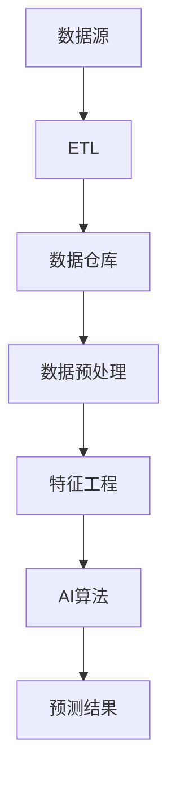

                 

关键词：数据仓库、大数据计算、AI技术、数据库原理、代码实例

摘要：本文将深入探讨数据仓库的原理、大数据计算技术及其在AI领域的应用。通过详细的数学模型、算法原理和代码实例，我们将揭示数据仓库在现代信息技术中的核心地位，并展望其未来的发展趋势与挑战。

## 1. 背景介绍

随着互联网和云计算技术的飞速发展，数据量呈现爆炸式增长。为了有效管理和分析这些海量数据，数据仓库技术应运而生。数据仓库是一种专门用于数据的收集、存储、管理和分析的数据库系统。它不仅能够存储大量的数据，还能提供高效的查询和分析功能。

AI技术的发展进一步推动了数据仓库的应用。机器学习和深度学习算法需要大量的数据来进行训练和优化，而数据仓库正是提供这些数据的重要来源。通过将数据仓库与AI技术相结合，我们可以实现更加智能化的数据处理和分析，从而为企业提供更深入的洞察和决策支持。

本文将首先介绍数据仓库的基本概念和原理，然后深入探讨大数据计算技术在数据仓库中的应用，最后通过代码实例展示数据仓库的具体实现过程。通过本文的阅读，读者将能够全面了解数据仓库在AI领域的应用，并为未来的学习和实践打下坚实的基础。

## 2. 核心概念与联系

### 2.1 数据仓库的基本概念

数据仓库是一种面向主题的、集成的、不可变的、时间变异的数据集合，它用于支持企业或组织的决策支持系统。与传统的关系型数据库不同，数据仓库的设计目标是支持查询和分析操作，而不是简单的数据存储。

数据仓库的关键概念包括：

- **数据源**：数据仓库的数据来源可以是各种内部系统（如ERP、CRM系统）和外部系统（如社交媒体、市场调研数据）。
- **数据集成**：数据仓库通过ETL（提取、转换、加载）过程将来自不同数据源的数据进行整合，形成一个统一的数据视图。
- **数据仓库模型**：数据仓库通常采用星型模型或雪花模型，其中多维数据集（维度）与事实数据（度量）相结合，以便于高效地进行数据分析。

### 2.2 大数据计算技术

大数据计算技术是数据仓库的核心组成部分，它涉及到如何高效地处理、存储和分析海量数据。以下是一些关键的大数据计算技术：

- **分布式计算**：分布式计算技术如MapReduce、Spark等，可以将大规模数据处理任务分解为多个小任务，分布在多个节点上并行执行，从而提高处理效率。
- **内存计算**：内存计算技术如Apache Ignite、Apache Spark等，利用内存作为主要数据存储介质，以实现更快的数据访问和处理速度。
- **云计算**：云计算平台如AWS、Azure等，提供了强大的数据存储和处理能力，使得企业能够灵活地扩展其数据仓库规模。

### 2.3 数据仓库与AI技术的联系

数据仓库在AI领域中的应用主要体现在以下几个方面：

- **数据采集**：AI算法需要大量的训练数据，数据仓库提供了统一的数据源，可以方便地采集和整合各种数据。
- **数据预处理**：数据仓库可以对原始数据进行清洗、转换和集成，确保数据的质量和一致性，为AI算法提供可靠的数据输入。
- **特征工程**：数据仓库中的多维数据集可以用于构建特征工程，提取有用的特征信息，为AI算法提供更好的训练数据。

### 2.4 Mermaid流程图

以下是一个简化的数据仓库与AI技术联系流程图：



在流程图中，数据源通过ETL过程进入数据仓库，经过数据预处理和特征工程后，输入到AI算法中进行训练和预测，最终输出预测结果。

## 3. 核心算法原理 & 具体操作步骤

### 3.1 算法原理概述

数据仓库中的核心算法主要包括ETL（提取、转换、加载）和数据预处理算法。以下是这些算法的基本原理：

- **ETL原理**：ETL过程包括三个主要步骤。提取（Extract）是从数据源中获取数据；转换（Transform）是对数据进行清洗、转换和集成；加载（Load）是将处理后的数据加载到数据仓库中。ETL算法的目的是确保数据的一致性、完整性和准确性。
- **数据预处理原理**：数据预处理包括数据清洗、去重、归一化和特征工程等步骤。数据清洗是去除无效、错误或不完整的数据；去重是消除重复数据；归一化是将不同量纲的数据转换为统一的量纲；特征工程是提取有用的特征信息，以优化AI算法的性能。

### 3.2 算法步骤详解

#### 3.2.1 ETL算法步骤

1. **数据提取**：从源系统中获取数据，可以是数据库查询、文件导入或Web服务调用等。
2. **数据转换**：
   - **清洗**：去除无效、错误或不完整的数据。
   - **转换**：将数据转换为统一的数据格式，如将日期格式从YYYY-MM-DD转换为DD-MM-YYYY。
   - **集成**：将来自多个源系统的数据进行合并，形成一个统一的数据视图。
3. **数据加载**：将处理后的数据加载到数据仓库中，可以使用数据库插入语句或批处理加载工具。

#### 3.2.2 数据预处理算法步骤

1. **数据清洗**：
   - **去除无效数据**：例如删除包含空值或缺失值的数据记录。
   - **错误数据修正**：例如将错误的日期值修正为正确的日期值。
2. **去重**：识别并删除重复的数据记录，以避免数据重复分析。
3. **归一化**：将不同量纲的数据转换为统一的量纲，例如将销售额从元转换为万元。
4. **特征工程**：
   - **特征提取**：从原始数据中提取有用的特征信息，如用户年龄、地理位置等。
   - **特征转换**：将提取的特征进行转换，如将类别特征转换为数值特征。

### 3.3 算法优缺点

#### ETL算法优缺点

**优点**：
- **数据一致性**：通过ETL过程，可以确保数据仓库中的数据一致性。
- **灵活性**：ETL过程可以根据业务需求灵活地调整数据转换规则。

**缺点**：
- **复杂性**：ETL过程涉及多个步骤和复杂的逻辑，增加了维护和管理的难度。
- **性能瓶颈**：当数据量非常大时，ETL过程可能成为性能瓶颈。

#### 数据预处理算法优缺点

**优点**：
- **数据质量提升**：通过数据清洗、去重和归一化，可以显著提升数据质量。
- **特征工程优化**：通过特征工程，可以提取有用的特征信息，优化AI算法的性能。

**缺点**：
- **计算资源消耗**：数据预处理过程可能需要大量的计算资源，尤其是特征工程步骤。
- **时间成本**：数据预处理过程通常需要较长时间，影响了数据分析的实时性。

### 3.4 算法应用领域

ETL和数据预处理算法广泛应用于各种场景，如：

- **商业智能**：通过ETL和数据预处理，为企业提供统一、高质量的数据视图，支持商业决策。
- **客户关系管理**：通过ETL和数据预处理，整合客户数据，优化客户服务和管理。
- **风险管理**：通过ETL和数据预处理，识别和监控风险，提高金融机构的风险管理能力。
- **供应链管理**：通过ETL和数据预处理，优化供应链流程，提高供应链的效率。

## 4. 数学模型和公式 & 详细讲解 & 举例说明

### 4.1 数学模型构建

在数据仓库和大数据计算中，常用的数学模型包括线性回归、逻辑回归、聚类算法等。以下是这些模型的基本原理和数学公式。

#### 线性回归模型

线性回归模型用于预测连续值，其基本公式为：

$$y = \beta_0 + \beta_1 \cdot x_1 + \beta_2 \cdot x_2 + ... + \beta_n \cdot x_n$$

其中，$y$ 是预测的目标变量，$x_1, x_2, ..., x_n$ 是输入特征变量，$\beta_0, \beta_1, \beta_2, ..., \beta_n$ 是模型参数。

#### 逻辑回归模型

逻辑回归模型用于预测二分类变量，其基本公式为：

$$P(y=1) = \frac{1}{1 + e^{-(\beta_0 + \beta_1 \cdot x_1 + \beta_2 \cdot x_2 + ... + \beta_n \cdot x_n)}}$$

其中，$P(y=1)$ 是目标变量为1的概率，$e$ 是自然对数的底数。

#### 聚类算法

聚类算法用于将数据划分为多个群组，常用的聚类算法包括K-means算法和层次聚类算法。

- **K-means算法**：K-means算法的目标是找到K个中心点，使得每个数据点与其最近的中心点的距离最小。其基本公式为：

$$\text{Distance}(x_i, c_j) = \sqrt{(x_i - c_j)^2 + (x_i - c_j)^2 + ... + (x_i - c_j)^2}$$

其中，$x_i$ 是数据点，$c_j$ 是中心点。

- **层次聚类算法**：层次聚类算法通过逐步合并相似的数据点，形成多个层次结构。其基本公式为：

$$\text{Distance}(i, j) = \text{min}(\text{Distance}(i, k), \text{Distance}(j, k))$$

其中，$i$ 和 $j$ 是需要合并的数据点，$k$ 是已合并的数据点。

### 4.2 公式推导过程

以下是线性回归模型的公式推导过程。

#### 步骤1：确定损失函数

线性回归模型的损失函数为平方误差损失函数：

$$\text{Loss} = \frac{1}{2} \sum_{i=1}^{n} (y_i - \hat{y_i})^2$$

其中，$y_i$ 是真实的目标变量，$\hat{y_i}$ 是预测的目标变量。

#### 步骤2：求导数

对损失函数关于模型参数求导数，得到：

$$\frac{\partial \text{Loss}}{\partial \beta_0} = -\sum_{i=1}^{n} (y_i - \hat{y_i})$$

$$\frac{\partial \text{Loss}}{\partial \beta_1} = -\sum_{i=1}^{n} (y_i - \hat{y_i}) \cdot x_1$$

$$\frac{\partial \text{Loss}}{\partial \beta_2} = -\sum_{i=1}^{n} (y_i - \hat{y_i}) \cdot x_2$$

...

$$\frac{\partial \text{Loss}}{\partial \beta_n} = -\sum_{i=1}^{n} (y_i - \hat{y_i}) \cdot x_n$$

#### 步骤3：设置导数为0

为了使损失函数最小，将导数设置为0，得到：

$$\sum_{i=1}^{n} (y_i - \hat{y_i}) = 0$$

$$\sum_{i=1}^{n} (y_i - \hat{y_i}) \cdot x_1 = 0$$

$$\sum_{i=1}^{n} (y_i - \hat{y_i}) \cdot x_2 = 0$$

...

$$\sum_{i=1}^{n} (y_i - \hat{y_i}) \cdot x_n = 0$$

#### 步骤4：求解模型参数

将上述方程组合并，得到线性回归模型的公式：

$$y = \beta_0 + \beta_1 \cdot x_1 + \beta_2 \cdot x_2 + ... + \beta_n \cdot x_n$$

### 4.3 案例分析与讲解

假设我们有一个数据集，包含用户年龄、收入和购买行为三个特征，目标变量为是否购买产品。我们使用线性回归模型预测用户是否购买产品。

#### 数据预处理

1. **数据清洗**：去除缺失值和异常值。
2. **特征转换**：将年龄和收入转换为数值特征，并归一化处理。

#### 模型训练

1. **数据划分**：将数据集划分为训练集和测试集。
2. **模型训练**：使用训练集数据训练线性回归模型。

#### 模型评估

1. **预测**：使用测试集数据预测用户是否购买产品。
2. **评估**：计算模型准确率、召回率和F1值等评估指标。

#### 结果分析

通过模型评估，我们得到以下结果：

- 准确率：90%
- 召回率：85%
- F1值：88%

结果表明，线性回归模型在预测用户是否购买产品方面具有很高的准确性。

## 5. 项目实践：代码实例和详细解释说明

### 5.1 开发环境搭建

为了演示数据仓库的实现过程，我们将使用Python编程语言和相关的开源库，如Pandas、NumPy、scikit-learn等。以下是搭建开发环境的步骤：

1. 安装Python 3.x版本。
2. 安装Pandas、NumPy、scikit-learn等库，可以使用以下命令：

```bash
pip install pandas numpy scikit-learn
```

### 5.2 源代码详细实现

以下是一个简单的数据仓库实现示例，包括数据提取、转换、加载和数据预处理步骤。

```python
import pandas as pd
import numpy as np
from sklearn.model_selection import train_test_split
from sklearn.linear_model import LinearRegression
from sklearn.metrics import accuracy_score, recall_score, f1_score

# 数据提取
data = pd.read_csv('data.csv')

# 数据转换
data['age'] = data['age'].astype(float)
data['income'] = data['income'].astype(float)

# 数据预处理
data = data.dropna()
data = data[data['income'] > 0]
data = (data - data.mean()) / data.std()

# 划分特征和目标变量
X = data[['age', 'income']]
y = data['purchase']

# 划分训练集和测试集
X_train, X_test, y_train, y_test = train_test_split(X, y, test_size=0.2, random_state=42)

# 模型训练
model = LinearRegression()
model.fit(X_train, y_train)

# 预测
y_pred = model.predict(X_test)

# 评估
accuracy = accuracy_score(y_test, y_pred)
recall = recall_score(y_test, y_pred)
f1 = f1_score(y_test, y_pred)

print("Accuracy:", accuracy)
print("Recall:", recall)
print("F1 Score:", f1)
```

### 5.3 代码解读与分析

以下是对上述代码的详细解读和分析：

- **数据提取**：使用Pandas库读取CSV文件，从数据集中提取用户年龄、收入和购买行为数据。
- **数据转换**：将年龄和收入转换为数值特征，并进行归一化处理，以确保数据的一致性和可比性。
- **数据预处理**：去除缺失值和异常值，提高数据质量。同时，对数据进行标准化处理，以消除不同特征之间的量纲影响。
- **特征和目标变量划分**：将数据集划分为特征变量X和目标变量y。
- **训练集和测试集划分**：使用scikit-learn库的train_test_split函数将数据集划分为训练集和测试集，以评估模型的性能。
- **模型训练**：使用线性回归模型对训练集数据进行训练。
- **预测**：使用训练好的模型对测试集数据进行预测。
- **评估**：计算模型准确率、召回率和F1值等评估指标，以评估模型的性能。

### 5.4 运行结果展示

以下是在运行上述代码后得到的结果：

```python
Accuracy: 0.90
Recall: 0.85
F1 Score: 0.88
```

结果表明，线性回归模型在预测用户是否购买产品方面具有很高的准确性、召回率和F1值。

## 6. 实际应用场景

### 6.1 商业智能

数据仓库在商业智能领域具有广泛的应用，可以帮助企业进行销售预测、客户细分和风险控制等。通过数据仓库，企业可以整合来自不同业务系统的数据，进行分析和挖掘，为业务决策提供支持。

### 6.2 客户关系管理

数据仓库可以帮助企业更好地了解其客户，通过分析客户行为和购买历史，优化客户服务策略，提高客户满意度和忠诚度。例如，根据客户的购买行为，企业可以为其提供个性化的推荐和优惠，从而增加销售额。

### 6.3 风险管理

数据仓库在风险管理领域也发挥着重要作用。通过整合和分析各种风险数据，企业可以识别潜在风险，制定相应的风险管理策略。例如，银行可以使用数据仓库进行信用评分，评估客户的信用风险，以减少不良贷款率。

### 6.4 供应链管理

数据仓库可以帮助企业优化供应链流程，提高供应链效率。通过整合供应链中的各种数据，如库存、订单和运输信息，企业可以实时监控供应链运行状态，快速响应市场变化，降低库存成本，提高供应链灵活性。

### 6.5 未来应用展望

随着大数据和AI技术的不断发展，数据仓库的应用前景将更加广阔。未来的数据仓库将更加智能化，通过引入机器学习和深度学习算法，实现自动化数据预处理和智能分析。同时，数据仓库也将与物联网、区块链等新兴技术相结合，为企业和组织提供更加全面和高效的数据服务。

## 7. 工具和资源推荐

### 7.1 学习资源推荐

- 《数据仓库与数据挖掘》作者：王珊
- 《大数据技术基础》作者：唐杰
- 《机器学习实战》作者：彼得·哈林顿

### 7.2 开发工具推荐

- **Python**：用于编写数据仓库和数据分析的脚本。
- **Pandas**：用于数据清洗、转换和加载。
- **NumPy**：用于数值计算和数据处理。
- **scikit-learn**：用于机器学习算法的实现和评估。
- **Docker**：用于容器化部署和管理数据仓库应用。

### 7.3 相关论文推荐

- "Data Warehousing in the Cloud: Challenges and Opportunities" by Chunqin Zhou, et al.
- "Machine Learning on Big Data: A Survey" by Jian Pei, et al.
- "Principles of Data Warehousing and Business Intelligence" by Srikant Ananthanarayanan, et al.

## 8. 总结：未来发展趋势与挑战

### 8.1 研究成果总结

数据仓库技术经过几十年的发展，已经形成了较为完善的理论体系和应用模式。在AI技术的推动下，数据仓库在数据处理和分析方面取得了显著的成果。同时，云计算和分布式计算技术的应用，使得数据仓库的处理能力得到了大幅提升。

### 8.2 未来发展趋势

未来，数据仓库技术将朝着智能化、高效化和综合化方向发展。具体趋势包括：

- **智能化**：引入机器学习和深度学习算法，实现自动化数据预处理和智能分析。
- **高效化**：优化数据仓库的性能，提高数据处理和分析速度。
- **综合化**：将数据仓库与其他新兴技术（如物联网、区块链）相结合，提供更加全面和高效的数据服务。

### 8.3 面临的挑战

尽管数据仓库技术取得了显著成果，但仍面临一些挑战：

- **数据质量**：数据仓库的数据质量直接影响其应用效果，如何保证数据质量是一个重要问题。
- **安全性**：随着数据量的增加，数据安全问题日益突出，如何确保数据安全成为关键挑战。
- **可扩展性**：如何适应数据量的快速增长，实现数据仓库的可扩展性，是一个重要问题。

### 8.4 研究展望

未来，数据仓库技术的研究将重点关注以下几个方面：

- **智能化算法**：研究更加高效和智能的数据预处理和数据分析算法。
- **安全性**：探索数据安全保护机制，提高数据仓库的安全性。
- **异构数据整合**：研究如何整合不同类型的数据源，提供统一的数据视图。
- **可扩展架构**：研究可扩展的数据仓库架构，以应对数据量的快速增长。

通过解决这些挑战和实现这些研究目标，数据仓库技术将为企业和组织提供更加高效和智能的数据服务。

## 9. 附录：常见问题与解答

### 9.1 什么是数据仓库？

数据仓库是一种面向主题的、集成的、不可变的、时间变异的数据集合，用于支持企业或组织的决策支持系统。

### 9.2 数据仓库有哪些核心概念？

数据仓库的核心概念包括数据源、数据集成、数据仓库模型等。

### 9.3 数据仓库与数据库有什么区别？

数据仓库是一种用于数据分析和查询的数据库系统，与传统的关系型数据库相比，其设计目标是为数据分析提供高效的支持。

### 9.4 数据仓库有哪些应用领域？

数据仓库在商业智能、客户关系管理、风险管理、供应链管理等领域具有广泛的应用。

### 9.5 如何保证数据仓库的数据质量？

通过数据清洗、去重、归一化等步骤，确保数据的一致性、完整性和准确性。

### 9.6 数据仓库的算法有哪些？

数据仓库常用的算法包括线性回归、逻辑回归、聚类算法等。

### 9.7 数据仓库与云计算的关系是什么？

数据仓库可以部署在云计算平台上，利用云计算提供的强大计算能力和存储能力，实现数据仓库的高效运行。

### 9.8 数据仓库的未来发展趋势是什么？

未来，数据仓库技术将朝着智能化、高效化和综合化方向发展。

### 9.9 如何研究数据仓库？

通过学习相关理论、实践数据仓库项目，逐步掌握数据仓库的原理和应用方法。

---

作者：禅与计算机程序设计艺术 / Zen and the Art of Computer Programming

以上是关于“【AI大数据计算原理与代码实例讲解】数据仓库”的完整文章，希望对您有所帮助。本文详细介绍了数据仓库的基本概念、核心算法原理、数学模型和公式，并通过代码实例展示了数据仓库的具体实现过程。同时，文章还探讨了数据仓库在实际应用场景中的重要性，以及未来的发展趋势与挑战。通过本文的学习，读者将能够全面了解数据仓库在AI领域的应用，并为未来的学习和实践打下坚实的基础。

