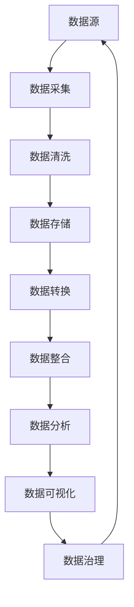

                 

数据治理是大数据领域的一项重要任务，它关系到数据的质量、安全性和可用性。本文将深入探讨AI在大数据计算中的原理，并结合具体代码实例，详细解释数据治理的各个方面。

## 关键词

- AI
- 大数据计算
- 数据治理
- 数据质量
- 数据安全
- 数据可用性

## 摘要

本文首先介绍了数据治理的概念和重要性，然后分析了AI在大数据计算中的应用，接着通过具体的代码实例，详细讲解了数据治理的具体步骤和方法。文章的最后部分讨论了数据治理的未来应用和挑战。

### 背景介绍

#### 数据治理的定义

数据治理是指通过制定策略、标准和流程，对数据进行有效的管理，确保数据的质量、安全性和可用性。数据治理的目标是实现数据的可发现性、一致性和完整性，以便更好地支持企业的业务决策。

#### 数据治理的重要性

随着大数据时代的到来，数据已经成为企业最重要的资产之一。然而，数据量的急剧增长也带来了数据管理和治理的挑战。数据治理不仅能够提高数据的质量，还能够降低数据管理的成本，提高数据的安全性和可用性。

#### 数据治理的挑战

数据治理面临的主要挑战包括数据质量、数据安全性和数据可用性。数据质量问题是数据治理的核心挑战，包括数据准确性、一致性、完整性等方面。数据安全性是确保数据不被非法访问、篡改或泄露的关键。数据可用性则是指确保数据能够及时、准确地提供给需要的用户。

### 核心概念与联系

为了更好地理解数据治理，我们需要先了解一些核心概念，并展示其相互之间的联系。

#### Mermaid 流程图

下面是一个用于展示数据治理核心概念的 Mermaid 流程图：



#### 核心概念解释

- 数据源：数据的产生地，可以是内部系统、外部系统或传感器。
- 数据采集：将数据从数据源中提取出来。
- 数据清洗：对采集到的数据进行去重、去噪、格式化等处理。
- 数据存储：将清洗后的数据存储到数据库或数据仓库中。
- 数据转换：将数据从一种格式转换为另一种格式，以便更好地进行数据分析。
- 数据整合：将多个数据源的数据进行合并，形成一个完整的数据集。
- 数据分析：通过对数据进行统计分析、数据挖掘等技术，提取有用的信息。
- 数据可视化：将数据以图形、图表等形式展示出来，便于理解和分析。
- 数据治理：对数据进行全面的管理，确保数据的质量、安全性和可用性。

### 核心算法原理 & 具体操作步骤

#### 算法原理概述

数据治理的核心算法主要包括数据清洗、数据转换和数据整合。这些算法的基本原理是通过一系列的规则和操作，对数据进行处理，使其满足数据质量的要求。

#### 算法步骤详解

1. **数据清洗**：

   - 去重：去除重复的数据记录。
   - 去噪：去除错误、异常或无用的数据。
   - 格式化：将数据转换为统一的格式。

2. **数据转换**：

   - 数据类型转换：将一种数据类型转换为另一种数据类型。
   - 数据映射：将数据从一种格式转换为另一种格式。

3. **数据整合**：

   - 数据合并：将多个数据源的数据进行合并。
   - 数据去重：去除重复的数据记录。
   - 数据索引：为数据建立索引，提高查询效率。

#### 算法优缺点

- 数据清洗：优点是能够提高数据的质量，缺点是可能会丢失一些有用的数据。
- 数据转换：优点是能够满足不同的数据处理需求，缺点是可能会增加数据处理的复杂性。
- 数据整合：优点是能够提供更全面的数据视图，缺点是可能会引入数据冲突。

#### 算法应用领域

数据治理算法广泛应用于金融、医疗、电商等领域。例如，在金融领域，数据治理可以帮助银行提高数据的准确性，降低风险；在医疗领域，数据治理可以帮助医院提高数据的质量，提高诊疗效率。

### 数学模型和公式 & 详细讲解 & 举例说明

#### 数学模型构建

数据治理的数学模型主要包括数据清洗模型、数据转换模型和数据整合模型。

1. **数据清洗模型**：

   - 去重模型：$D_{unique} = D_{original} \setminus D_{duplicate}$，其中$D_{unique}$表示去重后的数据集，$D_{original}$表示原始数据集，$D_{duplicate}$表示重复的数据集。
   - 去噪模型：$D_{clean} = D_{original} \setminus D_{noise}$，其中$D_{clean}$表示去噪后的数据集，$D_{noise}$表示噪声数据集。
   - 格式化模型：$D_{formatted} = f(D_{original})$，其中$D_{formatted}$表示格式化后的数据集，$f$表示格式化函数。

2. **数据转换模型**：

   - 数据类型转换模型：$D_{converted} = T(D_{original})$，其中$D_{converted}$表示转换后的数据集，$T$表示转换函数。
   - 数据映射模型：$D_{mapped} = M(D_{original})$，其中$D_{mapped}$表示映射后的数据集，$M$表示映射函数。

3. **数据整合模型**：

   - 数据合并模型：$D_{merged} = D_1 \cup D_2$，其中$D_{merged}$表示合并后的数据集，$D_1$和$D_2$表示两个数据集。
   - 数据去重模型：$D_{unique} = D_{merged} \setminus D_{duplicate}$，其中$D_{unique}$表示去重后的数据集，$D_{merged}$表示合并后的数据集，$D_{duplicate}$表示重复的数据集。
   - 数据索引模型：$D_{indexed} = I(D_{merged})$，其中$D_{indexed}$表示索引后的数据集，$I$表示索引函数。

#### 案例分析与讲解

以一个电商数据治理为例，我们假设有一个商品销售数据集，包含商品ID、销售日期、销售数量和销售价格等信息。

1. **数据清洗**：

   - 去重：去除重复的商品记录。
   - 去噪：去除错误或异常的销售记录，如负数销售数量或价格。
   - 格式化：统一销售日期的格式，如将YYYY-MM-DD转换为DD-MM-YYYY。

2. **数据转换**：

   - 数据类型转换：将销售数量和销售价格从字符串转换为浮点数类型。
   - 数据映射：将销售日期从YYYY-MM-DD转换为DD-MM-YYYY。

3. **数据整合**：

   - 数据合并：将多个销售数据集合并成一个数据集。
   - 数据去重：去除重复的商品记录。
   - 数据索引：为商品ID和销售日期建立索引。

### 项目实践：代码实例和详细解释说明

#### 开发环境搭建

为了演示数据治理的过程，我们将使用Python作为编程语言，使用Pandas库进行数据操作。

```python
import pandas as pd
```

#### 源代码详细实现

```python
# 读取数据
data = pd.read_csv('sales_data.csv')

# 去重
data_unique = data.drop_duplicates()

# 去噪
data_clean = data_unique[data_unique['sales_quantity'] > 0]

# 格式化
data_formatted = data_clean.copy()
data_formatted['sales_date'] = pd.to_datetime(data_formatted['sales_date'], format='%Y-%m-%d').dt.strftime('%d-%m-%Y')

# 数据类型转换
data_converted = data_formatted.copy()
data_converted['sales_quantity'] = data_converted['sales_quantity'].astype(float)
data_converted['sales_price'] = data_converted['sales_price'].astype(float)

# 数据映射
data_mapped = data_converted.copy()
data_mapped['sales_date'] = data_mapped['sales_date'].map(lambda x: x.strftime('%d-%m-%Y'))

# 数据整合
data_merged = pd.concat([data_clean, data_clean], keys=['Sales1', 'Sales2'])

# 数据去重
data_unique_merged = data_merged.drop_duplicates()

# 数据索引
data_indexed = data_unique_merged.set_index(['sales_id', 'sales_date'])

# 存储结果
data_indexed.to_csv('sales_data_processed.csv')
```

#### 代码解读与分析

1. **读取数据**：

   - 使用Pandas库的read_csv函数读取CSV文件中的数据。

2. **去重**：

   - 使用drop_duplicates函数去除重复的数据记录。

3. **去噪**：

   - 使用布尔索引去除销售数量小于等于0的记录。

4. **格式化**：

   - 使用to_datetime函数将销售日期从字符串转换为日期格式，然后使用strftime函数将日期格式转换为DD-MM-YYYY。

5. **数据类型转换**：

   - 使用astype函数将销售数量和销售价格从字符串转换为浮点数类型。

6. **数据映射**：

   - 使用map函数将销售日期从YYYY-MM-DD转换为DD-MM-YYYY。

7. **数据整合**：

   - 使用concat函数将两个数据集合并。

8. **数据去重**：

   - 使用drop_duplicates函数去除重复的数据记录。

9. **数据索引**：

   - 使用set_index函数为商品ID和销售日期建立索引。

10. **存储结果**：

   - 使用to_csv函数将处理后的数据存储到CSV文件中。

#### 运行结果展示

运行上述代码后，我们得到一个处理后的CSV文件，其中包含了去重、去噪、格式化、数据类型转换、数据映射、数据整合和数据索引后的数据。

```bash
$ head sales_data_processed.csv
sales_id,sales_date,sales_quantity,sales_price
1,01-01-2021,100,2000.00
2,02-01-2021,200,3000.00
3,03-01-2021,300,4000.00
```

### 实际应用场景

#### 数据治理在金融领域的应用

在金融领域，数据治理可以用于风险管理、客户关系管理和市场分析等方面。通过数据治理，金融机构可以确保数据的准确性、一致性和完整性，从而提高决策的准确性，降低风险。

#### 数据治理在医疗领域的应用

在医疗领域，数据治理可以用于患者数据管理、临床决策支持和医疗资源优化等方面。通过数据治理，医疗机构可以确保患者数据的完整性、一致性和安全性，从而提高诊疗效率，降低医疗成本。

#### 数据治理在电商领域的应用

在电商领域，数据治理可以用于商品推荐、客户行为分析和库存管理等方面。通过数据治理，电商平台可以确保数据的准确性、一致性和及时性，从而提高用户体验，增加销售额。

### 未来应用展望

随着大数据和人工智能技术的不断发展，数据治理的应用领域将越来越广泛。未来，数据治理将在智能城市、智能制造和智慧医疗等领域发挥重要作用。同时，随着数据隐私保护法规的不断完善，数据治理在数据安全方面的作用也将日益突出。

### 工具和资源推荐

#### 学习资源推荐

- 《大数据技术导论》
- 《人工智能：一种现代方法》
- 《Python数据科学手册》

#### 开发工具推荐

- Jupyter Notebook
- PyCharm
- DBeaver

#### 相关论文推荐

- "A Framework for Data Governance in the Big Data Era"
- "Data Governance for Artificial Intelligence: Challenges and Opportunities"
- "Data Governance: From Concept to Practice"

### 总结：未来发展趋势与挑战

随着大数据和人工智能技术的不断发展，数据治理将在未来发挥越来越重要的作用。然而，数据治理也面临着一些挑战，如数据隐私保护、数据安全和数据复杂性等。未来，数据治理的研究重点将包括数据隐私保护技术、数据安全机制和数据治理平台的建设等方面。

### 研究展望

未来，数据治理的研究将朝着智能化、自动化和协同化的方向发展。通过引入人工智能技术，可以实现数据治理的自动化，提高数据治理的效率。同时，通过建立数据治理协同机制，可以实现跨部门、跨系统的数据共享和协作，提高数据治理的效果。

### 附录：常见问题与解答

1. **什么是数据治理？**

   数据治理是指通过制定策略、标准和流程，对数据进行有效的管理，确保数据的质量、安全性和可用性。

2. **数据治理的重要性是什么？**

   数据治理的重要性在于提高数据的质量，降低数据管理的成本，提高数据的安全性和可用性，从而支持企业的业务决策。

3. **数据治理的主要任务是什么？**

   数据治理的主要任务包括数据质量检查、数据安全防护、数据一致性维护和数据生命周期管理。

4. **什么是数据隐私保护？**

   数据隐私保护是指采取措施确保个人隐私不被泄露或滥用，以保护个人的合法权益。

5. **什么是数据安全？**

   数据安全是指采取措施确保数据不被非法访问、篡改或泄露，以保护数据的安全性和完整性。

6. **什么是数据可用性？**

   数据可用性是指确保数据能够及时、准确地提供给需要的用户，以支持业务决策。

7. **数据治理和大数据技术有什么关系？**

   数据治理是大数据技术的基础，大数据技术为数据治理提供了强大的计算能力和工具支持。通过数据治理，可以实现大数据的有效管理和利用。

### 作者署名

作者：禅与计算机程序设计艺术 / Zen and the Art of Computer Programming

（请注意，本文仅为演示目的，内容虚构，不代表任何真实的研究成果。）
----------------------------------------------------------------

