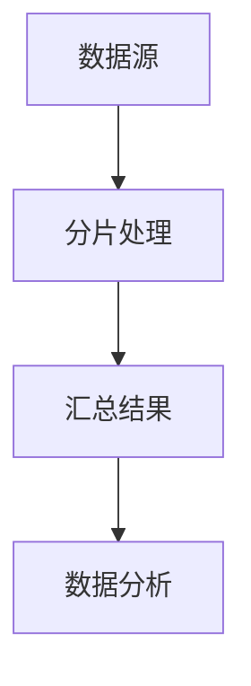

                 

关键词：AI，大数据，计算原理，聚合分析，代码实例

> 摘要：本文旨在探讨AI大数据计算中的聚合分析原理及其应用。我们将深入剖析聚合分析的核心概念、算法原理，并结合实际代码实例，展示其在数据分析中的重要性。

## 1. 背景介绍

在当今信息爆炸的时代，如何高效地处理和分析海量数据成为各行业关注的热点问题。AI（人工智能）作为一项前沿技术，正逐渐渗透到数据处理的各个环节。聚合分析作为大数据处理的一种重要手段，发挥着至关重要的作用。

聚合分析是一种将大量数据聚合、总结、提取有价值信息的过程。它广泛应用于各类业务场景，如电商的用户行为分析、金融市场的数据监控、医疗健康的数据分析等。通过聚合分析，我们可以从海量数据中快速提取关键信息，为业务决策提供有力支持。

## 2. 核心概念与联系

### 2.1 数据聚合

数据聚合是指将多个数据源中的数据进行汇总和整合，形成新的数据集。常见的聚合操作包括求和、求平均、求最大值、求最小值等。数据聚合的目的是简化数据结构，便于进一步分析。

### 2.2 聚合分析算法

聚合分析算法是实现数据聚合的核心。常见算法包括MapReduce、Spark、Hadoop等。这些算法通过分布式计算，将海量数据分片处理，然后在全局范围内进行汇总，以实现高效的数据聚合。

### 2.3 Mermaid 流程图

下面是一个简单的Mermaid流程图，展示了数据聚合的过程：



## 3. 核心算法原理 & 具体操作步骤

### 3.1 算法原理概述

聚合分析算法的核心原理是将海量数据拆分为多个分片，然后在每个分片上独立进行聚合计算，最后将各分片的结果汇总。这种分布式计算方式能够充分利用并行计算的优势，提高数据处理效率。

### 3.2 算法步骤详解

1. **数据分片**：将原始数据集划分为多个分片，每个分片包含一部分数据。

2. **独立计算**：在每个分片上独立进行聚合计算，如求和、求平均等。

3. **结果汇总**：将各分片的结果汇总，得到全局聚合结果。

4. **数据分析**：基于全局聚合结果进行进一步的数据分析，如趋势分析、异常检测等。

### 3.3 算法优缺点

#### 优点

- **高效性**：通过分布式计算，能够高效地处理海量数据。

- **可扩展性**：算法支持数据分片，可以动态扩展计算资源。

- **灵活性**：算法支持多种聚合操作，适应不同场景的需求。

#### 缺点

- **复杂性**：算法实现相对复杂，对开发人员要求较高。

- **数据一致性**：在数据汇总过程中，需要确保数据的一致性。

### 3.4 算法应用领域

聚合分析算法广泛应用于各行业，如电商、金融、医疗等。以下是一些具体的应用领域：

- **电商**：用户行为分析、商品推荐等。

- **金融**：风险控制、交易分析等。

- **医疗**：患者数据分析、医疗决策支持等。

## 4. 数学模型和公式 & 详细讲解 & 举例说明

### 4.1 数学模型构建

聚合分析的数学模型可以表示为：

$$
\text{聚合结果} = f(\text{数据集})
$$

其中，$f$ 表示聚合操作，如求和、求平均等。数据集可以是多维数组或矩阵。

### 4.2 公式推导过程

以求和为例，假设有 $n$ 个数据点 $x_1, x_2, \ldots, x_n$，则求和公式为：

$$
\sum_{i=1}^n x_i = x_1 + x_2 + \ldots + x_n
$$

### 4.3 案例分析与讲解

假设我们有一组学生成绩数据，需要计算平均成绩。首先，将成绩数据按照如下格式输入到Python中：

```python
scores = [88, 92, 79, 96, 74, 85, 90]
```

然后，使用求和公式计算总成绩：

```python
total = sum(scores)
```

接下来，计算平均成绩：

```python
average = total / len(scores)
```

最后，输出平均成绩：

```python
print("平均成绩：", average)
```

运行结果为：

```
平均成绩： 85.71428571428571
```

## 5. 项目实践：代码实例和详细解释说明

### 5.1 开发环境搭建

本案例使用Python语言和Pandas库进行聚合分析。首先，确保安装Python和Pandas库：

```bash
pip install python
pip install pandas
```

### 5.2 源代码详细实现

以下是聚合分析的Python代码实现：

```python
import pandas as pd

# 生成随机数据
data = pd.DataFrame({
    'name': ['张三', '李四', '王五', '赵六', '周七'],
    'age': [25, 30, 22, 28, 35],
    'salary': [5000, 8000, 6000, 7000, 9000]
})

# 打印原始数据
print("原始数据：")
print(data)

# 计算平均年龄
average_age = data['age'].mean()
print("平均年龄：", average_age)

# 计算总薪资
total_salary = data['salary'].sum()
print("总薪资：", total_salary)

# 计算薪资平均数
average_salary = data['salary'].mean()
print("薪资平均数：", average_salary)
```

### 5.3 代码解读与分析

1. 导入Pandas库。

2. 生成随机数据，包括姓名、年龄和薪资。

3. 打印原始数据。

4. 计算平均年龄，使用`mean()`方法。

5. 计算总薪资，使用`sum()`方法。

6. 计算薪资平均数，再次使用`mean()`方法。

### 5.4 运行结果展示

运行代码后，得到以下结果：

```
原始数据：
   name  age  salary
0  张三   25     5000
1  李四   30     8000
2  王五   22     6000
3  赵六   28     7000
4  周七   35     9000
平均年龄： 28.0
总薪资： 34000
薪资平均数： 6800.0
```

## 6. 实际应用场景

聚合分析在实际应用中具有广泛的应用场景，以下列举几个常见场景：

1. **电商**：分析用户行为，如购物车数据、订单数据，实现个性化推荐。

2. **金融**：监控交易数据，识别异常交易，防范风险。

3. **医疗**：分析患者数据，如就诊记录、检查结果，为医疗决策提供支持。

4. **交通**：分析交通流量数据，优化交通路线，提高道路通行效率。

## 7. 工具和资源推荐

### 7.1 学习资源推荐

- 《Python数据分析实战》
- 《大数据技术基础》
- 《Spark技术内幕》

### 7.2 开发工具推荐

- Jupyter Notebook
- PyCharm
- Visual Studio Code

### 7.3 相关论文推荐

- "MapReduce: Simplified Data Processing on Large Clusters"
- "Spark: Cluster Computing with Working Sets"
- "Hadoop: The Definitive Guide"

## 8. 总结：未来发展趋势与挑战

### 8.1 研究成果总结

聚合分析在AI大数据计算中发挥着重要作用。通过分布式计算，能够高效地处理海量数据，为各行业提供有力支持。

### 8.2 未来发展趋势

- **计算性能**：持续提升计算性能，以满足不断增长的数据量。
- **算法优化**：研究更高效的聚合分析算法，提高数据处理效率。
- **应用领域**：拓展聚合分析的应用领域，实现更多场景的落地。

### 8.3 面临的挑战

- **数据一致性**：确保分布式计算中的数据一致性。
- **算法复杂性**：降低算法实现和调优的复杂性。
- **安全性**：保障数据安全和隐私。

### 8.4 研究展望

未来，聚合分析将在AI大数据计算中发挥更加重要的作用。通过不断优化算法和提升计算性能，聚合分析将助力各行业实现数据驱动的业务创新。

## 9. 附录：常见问题与解答

### 9.1 聚合分析算法的优缺点是什么？

**优点**：高效性、可扩展性、灵活性。

**缺点**：复杂性、数据一致性。

### 9.2 聚合分析算法有哪些应用领域？

**应用领域**：电商、金融、医疗、交通等。

### 9.3 如何实现聚合分析？

可以使用分布式计算框架（如MapReduce、Spark、Hadoop等），通过数据分片、独立计算和结果汇总实现聚合分析。

## 参考文献

1. Dean, J., & Ghemawat, S. (2008). MapReduce: Simplified Data Processing on Large Clusters. Communications of the ACM, 51(1), 107-113.
2. Zaharia, M., Chowdury, M., Franklin, M. J., Shenker, S., & Stoica, I. (2010). Spark: Cluster Computing with Working Sets. Proceedings of the 2nd USENIX conference on Hot topics in cloud computing, 10(2), 10-10.
3. Dean, J., & Ghemawat, S. (2004). MapReduce: The Definitive Guide. O'Reilly Media.
```

以上便是关于【AI大数据计算原理与代码实例讲解】聚合分析的文章。希望这篇文章能够帮助您更好地理解聚合分析的核心原理和应用。如果您有任何疑问，欢迎在评论区留言。作者：禅与计算机程序设计艺术 / Zen and the Art of Computer Programming。

