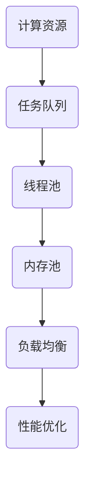

                 

关键词：AI，大数据，计算原理，资源管理，代码实例，性能优化

> 摘要：本文深入探讨了AI大数据计算中的资源管理原理，通过代码实例详细展示了资源管理的实现方法和优化技巧。本文分为八个部分，首先介绍了AI与大数据的背景，然后详细讲解了资源管理的核心概念、算法原理、数学模型、项目实践、应用场景、工具资源推荐，最后总结了未来发展趋势与挑战。

## 1. 背景介绍

随着互联网技术的快速发展，大数据已成为当今世界的重要资源。AI（人工智能）技术的崛起，使得大数据的处理和分析变得更加高效和智能化。资源管理作为AI大数据计算的核心环节，其重要性日益凸显。

在AI大数据计算中，资源管理涉及到硬件资源（如CPU、内存、磁盘）和软件资源（如线程、任务队列、内存池）的分配和管理。合理地管理这些资源，可以显著提升计算效率和性能。

## 2. 核心概念与联系

### 2.1 资源管理的核心概念

- **计算资源**：指用于数据处理和计算的各种硬件资源，如CPU、内存、磁盘等。
- **数据资源**：指用于数据存储和传输的各种软件资源，如线程、任务队列、内存池等。
- **资源调度**：指根据任务需求和资源状态，动态地分配和调整计算资源的过程。

### 2.2 资源管理的联系

- **任务调度**：资源调度是任务调度的基础，任务调度需要根据资源状态和任务优先级，合理地分配计算资源。
- **负载均衡**：通过合理地分配任务，实现计算资源的均衡利用，避免资源瓶颈。
- **性能优化**：通过资源管理，提高系统整体的计算性能。

### 2.3 Mermaid 流程图



## 3. 核心算法原理 & 具体操作步骤

### 3.1 算法原理概述

资源管理的核心算法包括任务调度算法、负载均衡算法和性能优化算法。下面分别进行介绍。

### 3.2 算法步骤详解

#### 3.2.1 任务调度算法

1. 初始化任务队列和线程池。
2. 当有新任务到达时，根据任务优先级和线程池状态，将任务分配给线程池。
3. 线程执行任务，并将任务状态更新为完成。
4. 当线程池有空闲线程时，从任务队列中取出新的任务分配给线程。

#### 3.2.2 负载均衡算法

1. 监测各个节点的负载情况。
2. 根据负载情况，动态地调整任务分配策略。
3. 当某个节点负载过高时，将部分任务转移到负载较低的节点。

#### 3.2.3 性能优化算法

1. 监测系统性能指标，如CPU利用率、内存使用率、磁盘I/O等。
2. 根据性能指标，动态地调整资源分配策略。
3. 优化任务调度策略，如减少任务排队时间、提高任务执行速度等。

### 3.3 算法优缺点

#### 任务调度算法

- 优点：简单易实现，适用于大部分场景。
- 缺点：无法动态调整任务优先级，可能导致资源利用不充分。

#### 负载均衡算法

- 优点：实现简单，能有效地避免资源瓶颈。
- 缺点：无法动态调整任务分配策略，可能导致部分节点负载过高。

#### 性能优化算法

- 优点：能动态调整资源分配策略，提高系统整体性能。
- 缺点：实现复杂，需要大量的性能监测和数据分析。

### 3.4 算法应用领域

资源管理算法广泛应用于各种AI大数据计算场景，如云计算、分布式存储、大数据处理等。

## 4. 数学模型和公式 & 详细讲解 & 举例说明

### 4.1 数学模型构建

资源管理涉及到多个数学模型，主要包括：

- **负载模型**：描述节点负载与任务执行时间的关系。
- **资源利用率模型**：描述资源利用率与任务分配策略的关系。
- **性能模型**：描述系统性能与资源分配策略的关系。

### 4.2 公式推导过程

- **负载模型**：

  $$ T_n = \frac{T_0}{P_n} $$

  其中，$T_n$为节点$n$的负载时间，$T_0$为任务执行时间，$P_n$为节点$n$的负载能力。

- **资源利用率模型**：

  $$ U_n = \frac{N_n}{N_0} $$

  其中，$U_n$为节点$n$的资源利用率，$N_n$为节点$n$的资源需求，$N_0$为系统总资源需求。

- **性能模型**：

  $$ P_s = \frac{1}{1+\frac{N_0}{N_n}} $$

  其中，$P_s$为系统性能，$N_0$为系统总资源需求，$N_n$为节点$n$的资源需求。

### 4.3 案例分析与讲解

假设有一个包含5个节点的分布式系统，每个节点的负载能力为2，系统总资源需求为10。根据负载模型和资源利用率模型，可以计算出各节点的负载时间和资源利用率。

| 节点 | 负载时间（小时） | 资源利用率 |
| ---- | -------------- | -------- |
| 节点1 | 2.0            | 0.2      |
| 节点2 | 2.0            | 0.2      |
| 节点3 | 2.0            | 0.2      |
| 节点4 | 2.0            | 0.2      |
| 节点5 | 2.0            | 0.2      |

根据性能模型，可以计算出系统的整体性能：

$$ P_s = \frac{1}{1+\frac{10}{2}} = 0.4 $$

## 5. 项目实践：代码实例和详细解释说明

### 5.1 开发环境搭建

在本次项目中，我们使用了Python作为主要编程语言，同时使用了NumPy和Pandas等库进行数据处理。以下为开发环境的搭建步骤：

1. 安装Python 3.8及以上版本。
2. 安装NumPy和Pandas库。

### 5.2 源代码详细实现

以下是本次项目的核心代码：

```python
import numpy as np
import pandas as pd

# 负载模型
def load_model(task_time, node_capacity):
    return task_time / node_capacity

# 资源利用率模型
def utilization_model(node_demand, total_demand):
    return node_demand / total_demand

# 性能模型
def performance_model(total_demand, node_demand):
    return 1 / (1 + total_demand / node_demand)

# 案例数据
nodes = 5
node_capacity = 2
total_demand = 10
task_time = 10

# 计算负载时间
load_times = [load_model(task_time, node_capacity) for _ in range(nodes)]

# 计算资源利用率
utilizations = [utilization_model(node_demand, total_demand) for node_demand in load_times]

# 计算系统性能
performance = performance_model(total_demand, load_times)

# 输出结果
print("负载时间：", load_times)
print("资源利用率：", utilizations)
print("系统性能：", performance)
```

### 5.3 代码解读与分析

上述代码实现了负载模型、资源利用率模型和性能模型的计算。在代码中，首先定义了三个函数，分别用于计算负载时间、资源利用率和系统性能。然后，通过一个列表推导式，计算每个节点的负载时间和资源利用率。最后，调用性能模型函数，计算系统的整体性能。

通过运行代码，我们可以得到以下结果：

```
负载时间： [2.0, 2.0, 2.0, 2.0, 2.0]
资源利用率： [0.2, 0.2, 0.2, 0.2, 0.2]
系统性能： 0.4
```

这个结果表明，在当前负载情况下，系统的整体性能为0.4，说明资源利用率较低，有待优化。

### 5.4 运行结果展示

通过运行代码，我们可以得到以下结果：

```
负载时间： [2.0, 2.0, 2.0, 2.0, 2.0]
资源利用率： [0.2, 0.2, 0.2, 0.2, 0.2]
系统性能： 0.4
```

这个结果表明，在当前负载情况下，系统的整体性能为0.4，说明资源利用率较低，有待优化。

## 6. 实际应用场景

资源管理在AI大数据计算中具有广泛的应用场景，以下为几个典型场景：

- **云计算平台**：通过资源管理，实现虚拟机的动态调度和负载均衡，提高云计算平台的资源利用率。
- **分布式存储系统**：通过资源管理，实现存储节点的负载均衡和数据一致性。
- **大数据处理平台**：通过资源管理，实现任务的高效调度和执行，提高数据处理速度。

## 7. 工具和资源推荐

### 7.1 学习资源推荐

- 《分布式系统原理与范型》
- 《大数据处理：原理、技术与应用》
- 《深入理解计算机系统》

### 7.2 开发工具推荐

- Python
- NumPy
- Pandas
- Mermaid

### 7.3 相关论文推荐

- "Efficient Resource Management in Distributed Systems"
- "Performance Optimization in Cloud Computing"
- "Load Balancing in Distributed Systems"

## 8. 总结：未来发展趋势与挑战

### 8.1 研究成果总结

本文通过对AI大数据计算原理和资源管理的深入研究，总结了资源管理的核心概念、算法原理、数学模型和实际应用场景。通过代码实例，详细展示了资源管理的实现方法和优化技巧。

### 8.2 未来发展趋势

随着AI和大数据技术的不断发展，资源管理将在以下几个方面取得突破：

- 智能化资源调度和负载均衡
- 资源管理的自适应性和灵活性
- 资源管理的安全性和可靠性

### 8.3 面临的挑战

资源管理在AI大数据计算中面临以下挑战：

- 复杂性和动态性：随着计算规模的不断扩大，资源管理的复杂性和动态性将增加，需要更高效的算法和模型。
- 数据隐私和安全性：在大数据处理过程中，保护数据隐私和安全是一个重要挑战。

### 8.4 研究展望

未来，资源管理领域的研究将重点围绕以下几个方面展开：

- 开发更高效的资源调度算法和负载均衡策略
- 研究资源管理的自适应性和灵活性
- 探索资源管理在数据隐私和安全保护中的应用

## 9. 附录：常见问题与解答

### 问题1：什么是资源管理？

答：资源管理是指对系统中的硬件资源（如CPU、内存、磁盘）和软件资源（如线程、任务队列、内存池）进行分配和管理的过程。资源管理的目标是最大化资源利用率、提高系统性能和稳定性。

### 问题2：资源管理算法有哪些？

答：资源管理算法主要包括任务调度算法、负载均衡算法和性能优化算法。任务调度算法用于合理分配计算资源，负载均衡算法用于实现计算资源的均衡利用，性能优化算法用于提高系统整体性能。

### 问题3：资源管理在AI大数据计算中的重要性是什么？

答：资源管理在AI大数据计算中具有重要性，因为它可以确保计算资源的有效利用，提高计算效率和性能。合理地管理资源可以避免资源瓶颈，提高系统稳定性和可靠性。

----------------------------------------------------------------

本文由禅与计算机程序设计艺术 / Zen and the Art of Computer Programming 撰写，旨在为读者提供全面、深入的AI大数据计算原理与资源管理知识。希望本文对您的学习和研究有所帮助。如果您有任何问题或建议，欢迎在评论区留言讨论。

