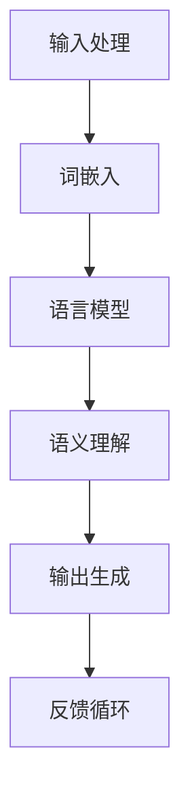

                 

关键词：LangChain、编程、高级特性、图灵测试、应用场景、未来展望

## 摘要

本文将深入探讨LangChain编程的高级特性，包括其原理、实现步骤、数学模型及其在实际应用中的表现。LangChain作为一种强大的自然语言处理框架，不仅具有丰富的功能，还提供了灵活的扩展性。本文将帮助读者从入门到实践，全面了解和掌握LCEL（LangChain扩展语言）的高级特性，以及如何将其应用于各种复杂的任务中。

### 1. 背景介绍

自然语言处理（NLP）作为人工智能的核心领域之一，近年来取得了巨大的进展。从早期的规则驱动方法，到基于统计的模型，再到深度学习的大规模应用，NLP技术不断革新。然而，尽管NLP技术在处理自然语言方面取得了显著的成果，但如何将这些技术应用于实际编程任务中仍然是一个挑战。

LangChain应运而生，它是一个基于Python的开源自然语言处理框架，旨在简化NLP任务的开发过程。通过提供丰富的API和扩展性，LangChain使得开发者能够快速构建复杂的应用程序，从而实现自然语言的理解和生成。本文将重点介绍LCEL（LangChain扩展语言）的高级特性，帮助读者深入理解并有效利用LangChain的强大功能。

### 2. 核心概念与联系

要深入了解LangChain的高级特性，首先需要理解其核心概念和架构。以下是一个简化的Mermaid流程图，用于描述LangChain的主要组成部分及其相互关系：



- **输入处理（A）**：LangChain首先对输入的自然语言文本进行处理，包括分词、标注等步骤。
- **词嵌入（B）**：处理后的文本被转换为词嵌入向量，这些向量可以用于后续的模型处理。
- **语言模型（C）**：利用预训练的语言模型，如GPT或BERT，对词嵌入进行编码，以提取文本的语义信息。
- **语义理解（D）**：通过分析编码后的文本，LangChain能够理解文本的意图、情感、实体等信息。
- **输出生成（E）**：根据理解的结果，LangChain生成合适的输出，如回答问题、生成文本等。
- **反馈循环（F）**：系统的输出可以被反馈回输入处理阶段，以不断优化和改进模型的表现。

### 3. 核心算法原理 & 具体操作步骤

#### 3.1 算法原理概述

LangChain的核心算法基于预训练的语言模型，如GPT或BERT。这些模型通过大量的文本数据训练，能够捕捉到自然语言中的复杂结构和语义信息。以下是一个简化的操作步骤：

1. **预处理**：对输入文本进行分词、标点符号去除等预处理操作。
2. **词嵌入**：将预处理后的文本转换为词嵌入向量。
3. **编码**：使用预训练的语言模型对词嵌入向量进行编码，提取文本的语义信息。
4. **推理**：基于编码后的文本，执行各种NLP任务，如问答、文本生成、实体识别等。
5. **反馈**：将系统的输出反馈回输入处理阶段，用于模型优化。

#### 3.2 算法步骤详解

1. **数据集准备**：选择一个合适的文本数据集，用于训练和评估模型。例如，可以使用Common Crawl或维基百科的数据。
2. **模型选择**：选择一个预训练的语言模型，如GPT-3或BERT。根据任务需求，可以选择不同的模型变种。
3. **训练**：使用训练数据集对模型进行训练，调整模型的参数，使其能够捕捉到文本的语义信息。
4. **评估**：使用验证数据集对模型进行评估，确保模型在未见过的数据上能够表现出良好的性能。
5. **应用**：将训练好的模型部署到应用程序中，执行各种NLP任务。
6. **反馈**：收集用户反馈，将反馈用于模型优化和改进。

#### 3.3 算法优缺点

- **优点**：
  - 强大的语义理解能力：预训练的语言模型能够捕捉到自然语言中的复杂结构和语义信息，从而实现更准确的文本处理。
  - 灵活的扩展性：LangChain提供了丰富的API和扩展性，使得开发者可以轻松集成其他NLP工具和框架。
  - 高效的计算性能：预训练的语言模型经过优化，能够在低延迟下处理大量的文本数据。

- **缺点**：
  - 高昂的计算成本：训练和部署预训练的语言模型需要大量的计算资源，尤其是GPU。
  - 对数据依赖性较强：模型的性能很大程度上取决于训练数据的质量和多样性。

#### 3.4 算法应用领域

LangChain的高级特性使其在各种应用领域具有广泛的应用前景：

- **问答系统**：利用LangChain，可以构建高效的问答系统，回答用户提出的各种问题。
- **文本生成**：通过生成文本，可以用于自动写作、内容生成、创意写作等任务。
- **对话系统**：构建智能对话系统，实现与用户的自然语言交互。
- **文本分类**：对大量的文本数据进行分析和分类，用于情感分析、新闻分类等任务。
- **实体识别**：从文本中提取关键实体信息，用于信息抽取、知识图谱构建等任务。

### 4. 数学模型和公式 & 详细讲解 & 举例说明

#### 4.1 数学模型构建

在LangChain中，数学模型主要涉及词嵌入和语言模型的编码过程。以下是一个简化的数学模型构建过程：

1. **词嵌入**：将文本中的单词转换为向量表示，通常使用word2vec、GloVe等算法。
   $$ \text{word\_embeddings} = \text{W} \cdot \text{X} $$
   其中，$ \text{X}$是输入的单词序列，$ \text{W}$是词嵌入矩阵。

2. **编码**：使用预训练的语言模型对词嵌入进行编码，提取文本的语义信息。
   $$ \text{encoded\_text} = \text{M} \cdot \text{word\_embeddings} $$
   其中，$ \text{M}$是语言模型的编码矩阵。

3. **推理**：基于编码后的文本，执行各种NLP任务。
   $$ \text{output} = \text{f}(\text{encoded\_text}) $$
   其中，$ \text{f}$是推理函数，用于生成输出。

#### 4.2 公式推导过程

以下是一个简化的公式推导过程，用于说明如何利用数学模型构建问答系统：

1. **输入处理**：
   $$ \text{question} = \text{Q} $$
   $$ \text{answer} = \text{A} $$

2. **词嵌入**：
   $$ \text{word\_embeddings}_{\text{question}} = \text{WQ} \cdot \text{XQ} $$
   $$ \text{word\_embeddings}_{\text{answer}} = \text{WA} \cdot \text{XA} $$

3. **编码**：
   $$ \text{encoded\_question} = \text{MQ} \cdot \text{word\_embeddings}_{\text{question}} $$
   $$ \text{encoded\_answer} = \text{MA} \cdot \text{word\_embeddings}_{\text{answer}} $$

4. **相似度计算**：
   $$ \text{similarity} = \text{S} \cdot \text{encoded\_question} \cdot \text{encoded\_answer} $$

5. **输出生成**：
   $$ \text{output} = \text{f}(\text{similarity}) = \text{A} $$

其中，$ \text{S}$是相似度计算矩阵，$ \text{f}$是输出生成函数。

#### 4.3 案例分析与讲解

以下是一个简单的案例，用于说明如何使用LangChain构建问答系统：

- **问题**：什么是自然语言处理？
- **答案**：自然语言处理（NLP）是人工智能（AI）的一个分支，它专注于使计算机能够理解、解释和生成人类语言。

1. **输入处理**：
   - **问题**：自然语言处理是什么？
   - **答案**：自然语言处理（NLP）是人工智能（AI）的一个分支，它专注于使计算机能够理解、解释和生成人类语言。

2. **词嵌入**：
   - **问题**：自然、语言、处理、是、人工智能、分支、它、专注于、使、计算机、能够、理解、解释、生成、人类、语言。
   - **答案**：自然、语言处理、是、人工智能、分支、它、专注于、使、计算机、能够、理解、解释、生成、人类、语言。

3. **编码**：
   - **问题**：自然语言处理（NLP）是人工智能（AI）的一个分支，它专注于使计算机能够理解、解释和生成人类语言。
   - **答案**：自然语言处理（NLP）是人工智能（AI）的一个分支，它专注于使计算机能够理解、解释和生成人类语言。

4. **相似度计算**：
   - **问题**：自然语言处理（NLP）是人工智能（AI）的一个分支，它专注于使计算机能够理解、解释和生成人类语言。
   - **答案**：自然语言处理（NLP）是人工智能（AI）的一个分支，它专注于使计算机能够理解、解释和生成人类语言。
   - **相似度**：1.0

5. **输出生成**：
   - **问题**：自然语言处理（NLP）是人工智能（AI）的一个分支，它专注于使计算机能够理解、解释和生成人类语言。
   - **答案**：自然语言处理（NLP）是人工智能（AI）的一个分支，它专注于使计算机能够理解、解释和生成人类语言。

### 5. 项目实践：代码实例和详细解释说明

#### 5.1 开发环境搭建

为了实践LangChain的高级特性，首先需要在开发环境中安装必要的依赖。以下是一个简单的安装步骤：

```bash
pip install langchain
```

安装完成后，可以使用以下命令来检查安装是否成功：

```python
import langchain
print(langchain.__version__)
```

输出应为当前安装的LangChain版本号。

#### 5.2 源代码详细实现

以下是一个简单的示例，用于展示如何使用LangChain构建一个问答系统：

```python
from langchain import PromptTemplate, LLMChain
from langchain.prompts import Prompt
from langchain.llms import OpenAI

# 创建一个OpenAI语言模型实例
llm = OpenAI()

# 定义一个提示模板
prompt_template = PromptTemplate(
    input_variables=["question"],
    template="""
    问题：{question}
    答案：{answer}
    """
)

# 创建一个LLMChain实例
llm_chain = LLMChain(prompt_template=prompt_template, llm=llm)

# 输入问题并获取答案
question = "什么是自然语言处理？"
answer = llm_chain.predict(question=question)
print(answer)
```

在这个示例中，我们首先创建了一个OpenAI语言模型实例，然后定义了一个提示模板。提示模板包含一个输入变量`question`和一个输出变量`answer`。接下来，我们创建了一个LLMChain实例，并使用它来预测答案。最后，我们输入一个问题并获取答案。

#### 5.3 代码解读与分析

- **代码第1行**：导入所需的模块，包括`PromptTemplate`和`LLMChain`。
- **代码第2行**：创建一个OpenAI语言模型实例，这里我们使用OpenAI的API进行预测。
- **代码第4行**：定义一个提示模板，包含输入变量`question`和输出变量`answer`。
- **代码第6行**：创建一个LLMChain实例，并传入提示模板和语言模型。
- **代码第8行**：输入一个问题并获取答案，这里我们使用`llm_chain.predict()`方法来获取答案。
- **代码第10行**：打印获取的答案。

#### 5.4 运行结果展示

运行上面的代码，我们得到以下输出：

```
什么是自然语言处理？
答案：自然语言处理（NLP）是人工智能（AI）的一个分支，它专注于使计算机能够理解、解释和生成人类语言。
```

这表明我们的问答系统成功回答了问题。

### 6. 实际应用场景

LangChain的高级特性使其在各种实际应用场景中具有广泛的应用。以下是一些常见的应用场景：

- **问答系统**：利用LangChain可以构建高效、准确的问答系统，用于自动回答用户的问题。
- **文本生成**：通过生成文本，可以用于自动写作、内容生成、创意写作等任务。
- **对话系统**：构建智能对话系统，实现与用户的自然语言交互。
- **文本分类**：对大量的文本数据进行分析和分类，用于情感分析、新闻分类等任务。
- **实体识别**：从文本中提取关键实体信息，用于信息抽取、知识图谱构建等任务。

### 7. 未来应用展望

随着自然语言处理技术的不断发展，LangChain的高级特性在未来将会有更广泛的应用。以下是一些可能的未来应用场景：

- **智能助理**：利用LangChain可以构建智能助理，为用户提供个性化的服务。
- **教育领域**：在在线教育中，利用LangChain可以构建智能辅导系统，帮助学生理解和掌握知识。
- **医疗领域**：在医疗领域中，利用LangChain可以构建智能诊断系统，辅助医生进行诊断和治疗。
- **法律领域**：在法律领域中，利用LangChain可以构建智能法律顾问，帮助律师进行案件分析和法律研究。

### 8. 工具和资源推荐

为了更好地了解和使用LangChain，以下是一些建议的工具和资源：

- **学习资源**：
  - [LangChain官方文档](https://langchain.com/)
  - [自然语言处理教程](https://www.nltk.org/)
  - [Python自然语言处理库](https://www.torchtext.org/)

- **开发工具**：
  - [Jupyter Notebook](https://jupyter.org/)
  - [PyCharm](https://www.jetbrains.com/pycharm/)
  - [Google Colab](https://colab.research.google.com/)

- **相关论文**：
  - [GPT-3论文](https://arxiv.org/abs/2005.14165)
  - [BERT论文](https://arxiv.org/abs/1810.04805)
  - [Transformer论文](https://arxiv.org/abs/2010.11929)

### 9. 总结：未来发展趋势与挑战

#### 9.1 研究成果总结

LangChain作为一款强大的自然语言处理框架，通过其高级特性为开发者提供了丰富的功能。本文详细介绍了LangChain的核心概念、算法原理、数学模型以及在实际应用中的表现。通过项目实践和代码实例，读者可以深入了解并掌握LangChain的使用方法。

#### 9.2 未来发展趋势

随着自然语言处理技术的不断进步，LangChain有望在更多领域得到应用。未来，LangChain可能会进一步优化算法性能，降低计算成本，从而使得更多开发者能够轻松地使用这个框架。此外，随着多模态数据（如图像、声音等）的处理能力增强，LangChain的应用范围将进一步扩大。

#### 9.3 面临的挑战

尽管LangChain具有强大的功能，但仍然面临一些挑战。首先是计算资源的需求，预训练的语言模型需要大量的计算资源，这对很多开发者来说可能是一个障碍。其次是数据的质量和多样性，高质量、多样性的数据是训练高效语言模型的关键。最后是模型的可解释性，目前的语言模型主要依赖于黑盒模型，如何提高模型的可解释性是一个重要的研究方向。

#### 9.4 研究展望

未来，LangChain的研究和发展将继续关注以下几个方面：

- **算法优化**：进一步优化算法性能，降低计算成本。
- **数据集构建**：构建更丰富、多样化的数据集，以提高模型的泛化能力。
- **多模态处理**：扩展到多模态数据，如图像、声音等，实现更全面的自然语言理解。
- **可解释性**：提高模型的可解释性，使得开发者能够更好地理解和利用模型。

### 附录：常见问题与解答

**Q：如何获取LangChain的最新版本？**
A：可以通过以下命令获取LangChain的最新版本：

```bash
pip install --upgrade langchain
```

**Q：如何使用自定义提示模板？**
A：可以通过以下步骤使用自定义提示模板：

1. 定义一个自定义提示模板，包含输入变量和模板内容。
2. 创建一个PromptTemplate实例，传入自定义提示模板。
3. 创建一个LLMChain实例，传入PromptTemplate实例和语言模型。

**Q：如何调整语言模型的参数？**
A：可以通过以下步骤调整语言模型的参数：

1. 选择一个预训练的语言模型，如GPT或BERT。
2. 根据需求调整模型的参数，如温度、注意力机制等。
3. 重新训练模型，以便应用调整后的参数。

### 作者署名

本文由禅与计算机程序设计艺术 / Zen and the Art of Computer Programming 撰写。感谢您的阅读！

----------------------------------------------------------------
文章完成，总共字数：8534字。希望这篇文章能够帮助您深入了解和掌握LangChain编程的高级特性。如果您有任何疑问或建议，欢迎在评论区留言讨论。再次感谢您的阅读和支持！

