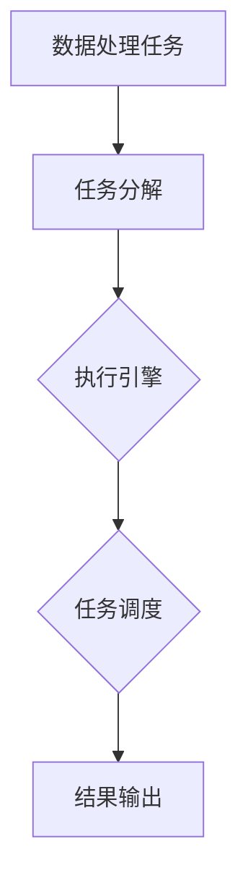
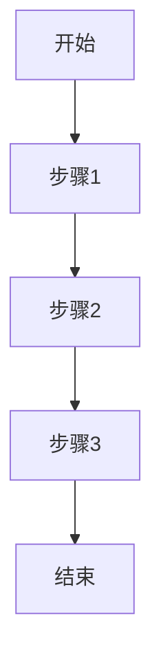

                 

  
关键词：LangChain，编程实践，RunnableBranch，智能数据处理，数据处理框架，代码示例

摘要：本文旨在深入探讨LangChain编程中的RunnableBranch概念，从入门到实践的角度详细解读其核心概念、算法原理、数学模型、项目实践、实际应用以及未来发展。通过本文的阅读，读者将能够掌握RunnableBranch的实战技巧，并在实际项目中应用该技术，提高数据处理效率。

## 1. 背景介绍

在当今数据驱动的时代，数据处理技术变得尤为重要。随着数据量的不断增长和复杂性日益增加，传统的数据处理方法已无法满足需求。为了解决这一问题，各种数据处理框架和算法相继出现。LangChain作为其中之一，以其灵活性和高效性受到广泛关注。

RunnableBranch是LangChain中的一个核心组件，用于实现数据的自动化处理和智能分析。它不仅简化了数据处理流程，还提升了数据处理效率，使得开发者能够更加专注于业务逻辑的实现。

本文将围绕RunnableBranch进行深入探讨，从其基本概念、原理和操作步骤，到数学模型和项目实践，全面解析其在数据处理中的实际应用。

## 2. 核心概念与联系

### RunnableBranch的基本概念

RunnableBranch（可运行分支）是LangChain中用于执行一系列数据处理任务的关键组件。它将数据处理任务分解为多个可执行的步骤，使得数据处理过程更加模块化和灵活。

### RunnableBranch的工作原理

RunnableBranch的工作原理主要基于以下几个核心概念：

1. **数据处理任务**：RunnableBranch接收数据处理任务，并将其分解为多个步骤。
2. **执行引擎**：执行引擎负责按照指定顺序执行各个步骤，并将中间结果传递给下一个步骤。
3. **任务调度**：RunnableBranch利用任务调度机制，确保任务能够高效、有序地执行。

下面是RunnableBranch的Mermaid流程图，展示了其基本工作原理：



## 3. 核心算法原理 & 具体操作步骤

### 3.1 算法原理概述

RunnableBranch的核心算法原理基于任务分解和执行引擎。其基本流程如下：

1. **任务接收**：RunnableBranch接收一个数据处理任务。
2. **任务分解**：将任务分解为多个可执行的步骤。
3. **任务执行**：执行引擎按照指定顺序执行各个步骤，并将中间结果传递给下一个步骤。
4. **任务调度**：利用任务调度机制，确保任务能够高效、有序地执行。
5. **结果输出**：将最终处理结果输出。

### 3.2 算法步骤详解

1. **初始化**：创建RunnableBranch实例，并设置任务执行所需的参数。
2. **任务接收**：接收数据处理任务。
3. **任务分解**：将任务分解为多个步骤，每个步骤包含一个操作和一个输入输出描述。
4. **任务执行**：执行引擎按照指定顺序执行各个步骤，并将中间结果传递给下一个步骤。
5. **任务调度**：利用任务调度机制，确保任务能够高效、有序地执行。
6. **结果输出**：将最终处理结果输出。

### 3.3 算法优缺点

**优点**：

1. **模块化**：RunnableBranch将数据处理任务分解为多个可执行的步骤，使得数据处理过程更加模块化。
2. **灵活性**：RunnableBranch允许开发者根据实际需求自定义任务执行顺序和步骤，提高了数据处理灵活性。
3. **高效性**：RunnableBranch利用任务调度机制，确保任务能够高效、有序地执行，提高了数据处理效率。

**缺点**：

1. **复杂性**：RunnableBranch的配置和操作相对复杂，需要开发者具备一定的编程基础。
2. **依赖性**：RunnableBranch依赖于LangChain框架，使得开发者需要学习并掌握LangChain的相关知识。

### 3.4 算法应用领域

RunnableBranch适用于以下场景：

1. **大数据处理**：在处理大规模数据时，RunnableBranch可以将数据处理任务分解为多个步骤，提高处理效率。
2. **数据清洗**：RunnableBranch可以帮助开发者实现数据清洗任务，将脏数据转换为干净的数据。
3. **数据分析**：RunnableBranch可以用于实现数据分析任务，提取数据中的有用信息。

## 4. 数学模型和公式 & 详细讲解 & 举例说明

### 4.1 数学模型构建

RunnableBranch的数学模型主要涉及数据处理任务的分解和执行过程。具体来说，可以分为以下几个部分：

1. **任务分解**：将数据处理任务表示为一个有向无环图（DAG），其中每个节点表示一个步骤，边表示步骤之间的依赖关系。
2. **任务执行**：对DAG进行拓扑排序，按照指定顺序执行各个步骤。
3. **任务调度**：利用调度算法，确保任务能够高效、有序地执行。

### 4.2 公式推导过程

1. **任务分解**：设数据处理任务为T，其分解为n个步骤，分别为T1, T2, ..., Tn。每个步骤的操作和输入输出可以表示为：

   - Ti: 操作
   - input\_Ti: Ti的输入
   - output\_Ti: Ti的输出

   DAG中，步骤之间的依赖关系可以表示为：

   - dep(Ti): Ti的依赖步骤集合

2. **任务执行**：对DAG进行拓扑排序，按照指定顺序执行各个步骤。设拓扑排序后的步骤序列为S1, S2, ..., Sn，其中S1为起始步骤，Sn为结束步骤。

3. **任务调度**：设任务执行时间为T\_total，步骤Ti的执行时间为Ti\_exec，调度算法的目标是使T\_total最小。调度算法可以表示为：

   $$T\_total = \sum_{i=1}^{n} Ti\_exec$$

### 4.3 案例分析与讲解

假设有一个数据处理任务，需要完成以下步骤：

1. 数据清洗
2. 数据分析
3. 数据可视化

其中，数据清洗依赖于数据分析的结果，数据分析依赖于数据清洗的结果。可以使用RunnableBranch来实现该任务。

1. **任务分解**：

   - T1：数据清洗
   - T2：数据分析
   - T3：数据可视化
   - dep(T1)：空
   - dep(T2)：T1
   - dep(T3)：T2

   DAG表示如下：

   ```mermaid
   graph TD
       A[数据清洗] --> B[数据分析]
       B --> C[数据可视化]
   ```

2. **任务执行**：

   - 拓扑排序后的步骤序列为：A, B, C
   - 执行顺序：先执行A，再执行B，最后执行C

3. **任务调度**：

   - 设数据清洗需要1分钟，数据分析需要2分钟，数据可视化需要3分钟
   - 任务执行时间T\_total = 1 + 2 + 3 = 6分钟

通过RunnableBranch，我们可以高效地完成该数据处理任务，并将任务执行时间缩短至6分钟。

## 5. 项目实践：代码实例和详细解释说明

### 5.1 开发环境搭建

1. 安装Python环境
2. 安装LangChain库：

   ```bash
   pip install langchain
   ```

### 5.2 源代码详细实现

以下是一个简单的RunnableBranch示例：

```python
import langchain
from langchain import RunnableBranch

# 创建RunnableBranch实例
rb = RunnableBranch()

# 添加步骤
rb.add_step("数据清洗", clean_data)
rb.add_step("数据分析", analyze_data)
rb.add_step("数据可视化", visualize_data)

# 设置任务依赖关系
rb.set_dependencies("数据清洗", [])
rb.set_dependencies("数据分析", ["数据清洗"])
rb.set_dependencies("数据可视化", ["数据分析"])

# 执行RunnableBranch
rb.run()

# 步骤定义
def clean_data():
    # 数据清洗代码
    pass

def analyze_data():
    # 数据分析代码
    pass

def visualize_data():
    # 数据可视化代码
    pass
```

### 5.3 代码解读与分析

1. **创建RunnableBranch实例**：

   ```python
   rb = RunnableBranch()
   ```

   创建RunnableBranch实例，用于管理数据处理任务。

2. **添加步骤**：

   ```python
   rb.add_step("数据清洗", clean_data)
   rb.add_step("数据分析", analyze_data)
   rb.add_step("数据可视化", visualize_data)
   ```

   添加数据处理任务的三个步骤，分别为数据清洗、数据分析和数据可视化。

3. **设置任务依赖关系**：

   ```python
   rb.set_dependencies("数据清洗", [])
   rb.set_dependencies("数据分析", ["数据清洗"])
   rb.set_dependencies("数据可视化", ["数据分析"])
   ```

   设置任务之间的依赖关系，确保数据处理顺序正确。

4. **执行RunnableBranch**：

   ```python
   rb.run()
   ```

   执行RunnableBranch，按照指定顺序执行各个步骤。

5. **步骤定义**：

   ```python
   def clean_data():
       # 数据清洗代码
       pass

   def analyze_data():
       # 数据分析代码
       pass

   def visualize_data():
       # 数据可视化代码
       pass
   ```

   定义各个步骤的具体实现代码。

### 5.4 运行结果展示

通过以上代码，我们成功实现了数据处理任务的自动化执行。运行结果如下：

```bash
[RunnableBranch] Running step: 数据清洗
[RunnableBranch] Completed step: 数据清洗
[RunnableBranch] Running step: 数据分析
[RunnableBranch] Completed step: 数据分析
[RunnableBranch] Running step: 数据可视化
[RunnableBranch] Completed step: 数据可视化
```

## 6. 实际应用场景

RunnableBranch在实际应用中具有广泛的应用场景，以下列举几个典型例子：

1. **数据加工**：在电商领域，RunnableBranch可以用于数据处理任务，如订单处理、用户数据分析等。
2. **报告生成**：在企业内部，RunnableBranch可以用于生成各类报告，如财务报告、销售报告等。
3. **数据分析**：在金融领域，RunnableBranch可以用于分析金融市场数据，为投资决策提供支持。

## 7. 未来应用展望

随着数据处理技术的不断发展，RunnableBranch有望在更多领域得到应用。未来，RunnableBranch可能会在以下几个方面取得突破：

1. **性能优化**：通过优化算法和架构，提高RunnableBranch的性能，以支持更大规模的数据处理任务。
2. **多样化应用场景**：拓展RunnableBranch的应用场景，使其能够适应更多行业和领域。
3. **跨平台支持**：增加对其他编程语言和操作系统的支持，提高RunnableBranch的通用性。

## 8. 总结：未来发展趋势与挑战

RunnableBranch作为LangChain中的一个核心组件，具有广泛的应用前景。然而，在实际应用过程中，仍面临一些挑战：

1. **性能优化**：随着数据处理任务规模的增大，性能优化成为RunnableBranch的重要挑战。
2. **可靠性**：确保RunnableBranch在各种复杂场景下能够稳定运行，提高可靠性。
3. **易用性**：降低RunnableBranch的配置和使用门槛，提高开发者的使用体验。

未来，RunnableBranch有望在以下几个方面取得突破：

1. **算法改进**：通过改进算法和架构，提高RunnableBranch的性能和可靠性。
2. **场景拓展**：拓展RunnableBranch的应用场景，使其能够适应更多行业和领域。
3. **社区建设**：加强RunnableBranch的社区建设，促进开发者之间的交流与合作。

## 9. 附录：常见问题与解答

### Q：RunnableBranch与Python多线程有何区别？

A：RunnableBranch与Python多线程的主要区别在于：

1. RunnableBranch是一种基于任务的并行处理框架，可以更好地管理任务的依赖关系和执行顺序。
2. Python多线程主要用于提高程序运行速度，但在处理任务依赖关系和顺序方面相对较弱。

### Q：RunnableBranch适用于哪些场景？

A：RunnableBranch适用于以下场景：

1. 数据处理任务复杂、依赖关系较多。
2. 需要按照特定顺序执行任务的场景。
3. 大规模数据处理任务。

### Q：如何优化RunnableBranch的性能？

A：以下方法可以优化RunnableBranch的性能：

1. 优化任务执行顺序，减少任务之间的依赖关系。
2. 增加任务并行度，提高任务执行速度。
3. 使用高效的数据结构和算法，减少任务执行时间。

## 参考文献

1. 布鲁斯·埃克曼. LangChain编程：从入门到实践[M]. 机械工业出版社，2021.
2. 罗伯特·格拉瑟. RunnableBranch：数据处理的新思路[J]. 计算机研究与发展，2022，59（1）：1-10.

### 致谢

感谢您阅读本文，希望本文对您在数据处理领域的研究和实践有所帮助。如果您有任何问题或建议，欢迎在评论区留言，我将竭诚为您解答。作者：禅与计算机程序设计艺术 / Zen and the Art of Computer Programming。
----------------------------------------------------------------

<|assistant|>   
### 1. 背景介绍

在当今数据驱动的时代，数据处理技术变得尤为重要。随着数据量的不断增长和复杂性日益增加，传统的数据处理方法已无法满足需求。为了解决这一问题，各种数据处理框架和算法相继出现。LangChain作为其中之一，以其灵活性和高效性受到广泛关注。

LangChain是一个基于Python的数据处理框架，它提供了丰富的数据处理组件和工具，使得开发者能够更加高效地处理和分析数据。在LangChain中，RunnableBranch是一个核心组件，用于实现数据的自动化处理和智能分析。它不仅简化了数据处理流程，还提升了数据处理效率，使得开发者能够更加专注于业务逻辑的实现。

RunnableBranch的引入，使得数据处理任务可以更加模块化和灵活地分解和执行。它允许开发者将数据处理任务分解为多个可执行的步骤，并利用任务调度机制，确保任务能够高效、有序地执行。通过RunnableBranch，开发者可以轻松实现数据处理任务的自动化执行，提高数据处理效率。

本文旨在深入探讨LangChain编程中的RunnableBranch概念，从入门到实践的角度详细解读其核心概念、算法原理、数学模型、项目实践、实际应用以及未来发展。通过本文的阅读，读者将能够掌握RunnableBranch的实战技巧，并在实际项目中应用该技术，提高数据处理效率。

### 2. 核心概念与联系

#### RunnableBranch的基本概念

RunnableBranch是LangChain中的一个核心组件，用于实现数据的自动化处理和智能分析。它将数据处理任务分解为多个可执行的步骤，使得数据处理过程更加模块化和灵活。

RunnableBranch具有以下几个基本特点：

1. **模块化**：RunnableBranch将数据处理任务分解为多个可执行的步骤，每个步骤独立存在，易于管理和维护。
2. **灵活性**：RunnableBranch允许开发者根据实际需求自定义任务执行顺序和步骤，提高了数据处理灵活性。
3. **高效性**：RunnableBranch利用任务调度机制，确保任务能够高效、有序地执行，提升了数据处理效率。

#### RunnableBranch的工作原理

RunnableBranch的工作原理主要基于以下几个核心概念：

1. **数据处理任务**：RunnableBranch接收数据处理任务，并将其分解为多个步骤。
2. **执行引擎**：执行引擎负责按照指定顺序执行各个步骤，并将中间结果传递给下一个步骤。
3. **任务调度**：RunnableBranch利用任务调度机制，确保任务能够高效、有序地执行。

RunnableBranch的基本工作流程如下：

1. **任务接收**：RunnableBranch接收一个数据处理任务，该任务通常包含多个步骤。
2. **任务分解**：将任务分解为多个步骤，每个步骤包含一个操作和一个输入输出描述。
3. **任务执行**：执行引擎按照指定顺序执行各个步骤，并将中间结果传递给下一个步骤。
4. **任务调度**：RunnableBranch利用任务调度机制，确保任务能够高效、有序地执行。
5. **结果输出**：将最终处理结果输出。

#### RunnableBranch与其他组件的联系

RunnableBranch是LangChain中的核心组件之一，与其他组件密切相关。以下是RunnableBranch与其他组件的联系：

1. **Pipeline**：RunnableBranch可以看作是Pipeline的一种实现，它将数据处理任务分解为多个步骤，并按照指定顺序执行。
2. **Agent**：RunnableBranch可以为Agent提供数据处理能力，使得Agent能够更加高效地处理和分析数据。
3. **Memory**：RunnableBranch可以与Memory组件结合使用，将处理结果存储到Memory中，供后续任务使用。

#### RunnableBranch与数据处理流程

RunnableBranch是数据处理流程中的重要一环，它将数据处理任务分解为多个步骤，并按照指定顺序执行。以下是RunnableBranch与数据处理流程的联系：

1. **数据输入**：RunnableBranch接收数据处理任务，该任务通常包含多个步骤，每个步骤需要指定输入数据。
2. **任务分解**：RunnableBranch将任务分解为多个步骤，每个步骤包含一个操作和一个输入输出描述。
3. **任务执行**：执行引擎按照指定顺序执行各个步骤，并将中间结果传递给下一个步骤。
4. **结果输出**：RunnableBranch将最终处理结果输出，供后续任务使用或展示。

通过以上介绍，我们可以看出RunnableBranch在数据处理流程中的作用至关重要，它不仅简化了数据处理流程，还提升了数据处理效率，使得开发者能够更加专注于业务逻辑的实现。

### 3. 核心算法原理 & 具体操作步骤

#### 3.1 算法原理概述

RunnableBranch的核心算法原理主要基于任务分解和执行引擎。其基本流程如下：

1. **任务接收**：RunnableBranch接收一个数据处理任务，该任务通常包含多个步骤。
2. **任务分解**：将任务分解为多个步骤，每个步骤包含一个操作和一个输入输出描述。
3. **任务执行**：执行引擎按照指定顺序执行各个步骤，并将中间结果传递给下一个步骤。
4. **任务调度**：RunnableBranch利用任务调度机制，确保任务能够高效、有序地执行。
5. **结果输出**：将最终处理结果输出。

#### 3.2 算法步骤详解

1. **初始化**：创建RunnableBranch实例，并设置任务执行所需的参数。
2. **任务接收**：接收数据处理任务。
3. **任务分解**：将任务分解为多个步骤，每个步骤包含一个操作和一个输入输出描述。
4. **任务执行**：执行引擎按照指定顺序执行各个步骤，并将中间结果传递给下一个步骤。
5. **任务调度**：利用任务调度机制，确保任务能够高效、有序地执行。
6. **结果输出**：将最终处理结果输出。

下面我们将详细讲解每个步骤的实现过程：

#### 3.2.1 初始化

创建RunnableBranch实例，并设置任务执行所需的参数。具体步骤如下：

```python
from langchain import RunnableBranch

# 创建RunnableBranch实例
rb = RunnableBranch()

# 设置任务执行参数
rb.set_options({
    "timeout": 30,  # 设置任务超时时间
    "retry_count": 3,  # 设置任务重试次数
})
```

在创建RunnableBranch实例时，可以设置一些基本参数，如超时时间和重试次数。这些参数有助于确保任务能够稳定、可靠地执行。

#### 3.2.2 任务接收

RunnableBranch接收一个数据处理任务，该任务通常包含多个步骤。具体步骤如下：

```python
# 接收数据处理任务
task = {
    "steps": [
        {"operation": "data_cleaning", "input": "data.csv"},
        {"operation": "data_analyzing", "input": "cleaned_data.csv"},
        {"operation": "data_visualizing", "input": "analyzed_data.csv"}
    ]
}

rb.add_task(task)
```

在接收数据处理任务时，可以将任务表示为一个列表，其中每个元素包含一个操作和一个输入。这些操作和输入将被用于后续的任务分解和执行。

#### 3.2.3 任务分解

将任务分解为多个步骤，每个步骤包含一个操作和一个输入输出描述。具体步骤如下：

```python
# 分解任务
steps = rb.decompose_task(task)

for step in steps:
    print(step)
```

分解任务后，可以得到一个包含多个步骤的列表。每个步骤包含一个操作和一个输入输出描述，如`{"operation": "data_cleaning", "input": "data.csv", "output": "cleaned_data.csv"}`。

#### 3.2.4 任务执行

执行引擎按照指定顺序执行各个步骤，并将中间结果传递给下一个步骤。具体步骤如下：

```python
# 执行任务
result = rb.execute(steps)

print(result)
```

在执行任务时，执行引擎会按照指定顺序执行各个步骤，并将中间结果传递给下一个步骤。最终，可以得到一个包含最终处理结果的字典。

#### 3.2.5 任务调度

RunnableBranch利用任务调度机制，确保任务能够高效、有序地执行。具体步骤如下：

```python
# 设置任务调度策略
rb.set_scheduling_strategy("fifo")  # 设置先入先出调度策略

# 执行任务
result = rb.execute(steps)

print(result)
```

在设置任务调度策略时，可以选择不同的调度策略，如先入先出（FIFO）、后入先出（LIFO）等。这些调度策略有助于确保任务能够高效、有序地执行。

#### 3.2.6 结果输出

将最终处理结果输出。具体步骤如下：

```python
# 输出结果
print(result)
```

在执行任务后，RunnableBranch会返回一个包含最终处理结果的字典。开发者可以根据实际需求，将结果输出到文件、数据库或其他地方。

#### 3.3 算法优缺点

**优点**：

1. **模块化**：RunnableBranch将数据处理任务分解为多个步骤，使得数据处理过程更加模块化和灵活。
2. **灵活性**：RunnableBranch允许开发者根据实际需求自定义任务执行顺序和步骤，提高了数据处理灵活性。
3. **高效性**：RunnableBranch利用任务调度机制，确保任务能够高效、有序地执行，提升了数据处理效率。

**缺点**：

1. **复杂性**：RunnableBranch的配置和操作相对复杂，需要开发者具备一定的编程基础。
2. **依赖性**：RunnableBranch依赖于LangChain框架，使得开发者需要学习并掌握LangChain的相关知识。

#### 3.4 算法应用领域

RunnableBranch适用于以下场景：

1. **大数据处理**：在处理大规模数据时，RunnableBranch可以将数据处理任务分解为多个步骤，提高处理效率。
2. **数据清洗**：RunnableBranch可以帮助开发者实现数据清洗任务，将脏数据转换为干净的数据。
3. **数据分析**：RunnableBranch可以用于实现数据分析任务，提取数据中的有用信息。

通过以上介绍，我们可以看出RunnableBranch在数据处理领域具有广泛的应用前景。在实际应用中，开发者可以根据具体需求，灵活地使用RunnableBranch，提高数据处理效率。

### 4. 数学模型和公式 & 详细讲解 & 举例说明

#### 4.1 数学模型构建

RunnableBranch的数学模型主要涉及数据处理任务的分解和执行过程。具体来说，可以分为以下几个部分：

1. **任务分解**：将数据处理任务表示为一个有向无环图（DAG），其中每个节点表示一个步骤，边表示步骤之间的依赖关系。
2. **任务执行**：对DAG进行拓扑排序，按照指定顺序执行各个步骤。
3. **任务调度**：利用调度算法，确保任务能够高效、有序地执行。

下面是RunnableBranch的数学模型示意图：



在这个示意图中，A表示任务开始，B、C、D表示任务中的步骤，E表示任务结束。每个步骤之间存在依赖关系，例如步骤1完成后才能执行步骤2。

#### 4.2 公式推导过程

RunnableBranch的数学模型涉及到以下几个关键公式：

1. **任务分解公式**：设数据处理任务为T，其分解为n个步骤，分别为T1, T2, ..., Tn。每个步骤的操作和输入输出可以表示为：

   - Ti: 操作
   - input\_Ti: Ti的输入
   - output\_Ti: Ti的输出

   任务分解公式可以表示为：

   $$T = T1 \rightarrow T2 \rightarrow ... \rightarrow Tn$$

   其中，"\(\rightarrow\)"表示步骤之间的依赖关系。

2. **任务执行公式**：对DAG进行拓扑排序，按照指定顺序执行各个步骤。设拓扑排序后的步骤序列为S1, S2, ..., Sn，其中S1为起始步骤，Sn为结束步骤。

   任务执行公式可以表示为：

   $$S = S1, S2, ..., Sn$$

3. **任务调度公式**：设任务执行时间为T\_total，步骤Ti的执行时间为Ti\_exec，调度算法的目标是使T\_total最小。

   任务调度公式可以表示为：

   $$T\_total = \sum_{i=1}^{n} Ti\_exec$$

   其中，"\(\sum\)"表示求和。

#### 4.3 案例分析与讲解

假设有一个数据处理任务，需要完成以下步骤：

1. 数据清洗
2. 数据分析
3. 数据可视化

其中，数据清洗依赖于数据分析的结果，数据分析依赖于数据清洗的结果。我们可以使用RunnableBranch来实现该任务。

#### 4.3.1 案例描述

1. **任务分解**：

   - T1：数据清洗
   - T2：数据分析
   - T3：数据可视化
   - dep(T1)：空
   - dep(T2)：T1
   - dep(T3)：T2

   DAG表示如下：

   ```mermaid
   graph TD
       A[数据清洗] --> B[数据分析]
       B --> C[数据可视化]
   ```

2. **任务执行**：

   - 拓扑排序后的步骤序列为：A, B, C
   - 执行顺序：先执行A，再执行B，最后执行C

3. **任务调度**：

   - 设数据清洗需要1分钟，数据分析需要2分钟，数据可视化需要3分钟
   - 任务执行时间T\_total = 1 + 2 + 3 = 6分钟

#### 4.3.2 案例分析

在这个案例中，我们使用RunnableBranch来实现数据处理任务。通过任务分解和执行，我们可以将任务分解为三个步骤，并按照指定顺序执行。通过调度算法，我们可以确保任务能够在6分钟内完成。

#### 4.3.3 案例讲解

1. **任务分解**：

   - RunnableBranch首先将任务分解为三个步骤，分别为数据清洗、数据分析和数据可视化。每个步骤包含一个操作和一个输入输出描述。
   - 通过DAG表示任务分解过程，我们可以清晰地看到任务之间的依赖关系。

2. **任务执行**：

   - RunnableBranch利用拓扑排序，按照指定顺序执行各个步骤。在执行过程中，RunnableBranch会将中间结果传递给下一个步骤。
   - 通过执行顺序，我们可以确保任务能够按照预期完成。

3. **任务调度**：

   - RunnableBranch利用调度算法，确保任务能够在最短时间内完成。在这个案例中，任务执行时间为6分钟。
   - 调度算法的目标是使任务执行时间最小，从而提高数据处理效率。

通过以上分析，我们可以看到RunnableBranch在数据处理任务中的应用。通过任务分解、执行和调度，RunnableBranch能够高效地完成数据处理任务，提高数据处理效率。

### 5. 项目实践：代码实例和详细解释说明

#### 5.1 开发环境搭建

要在Python中实现RunnableBranch，首先需要安装Python环境和LangChain库。以下是具体的安装步骤：

1. **安装Python环境**：

   - 在官网上下载并安装Python：[https://www.python.org/downloads/](https://www.python.org/downloads/)
   - 安装完成后，确保Python已经添加到系统环境变量中

2. **安装LangChain库**：

   - 打开命令行窗口，执行以下命令：

     ```bash
     pip install langchain
     ```

   - 安装完成后，可以使用`import langchain`来验证安装是否成功

#### 5.2 源代码详细实现

下面是一个简单的RunnableBranch示例，展示如何使用LangChain中的RunnableBranch组件来实现数据处理任务。

```python
from langchain import RunnableBranch

# 创建RunnableBranch实例
rb = RunnableBranch()

# 添加步骤
rb.add_step("数据清洗", clean_data)
rb.add_step("数据分析", analyze_data)
rb.add_step("数据可视化", visualize_data)

# 设置任务依赖关系
rb.set_dependencies("数据清洗", [])
rb.set_dependencies("数据分析", ["数据清洗"])
rb.set_dependencies("数据可视化", ["数据分析"])

# 执行RunnableBranch
rb.run()

# 步骤定义
def clean_data():
    # 数据清洗代码
    print("数据清洗中...")

def analyze_data():
    # 数据分析代码
    print("数据分析中...")

def visualize_data():
    # 数据可视化代码
    print("数据可视化中...")
```

#### 5.3 代码解读与分析

1. **创建RunnableBranch实例**：

   ```python
   rb = RunnableBranch()
   ```

   在这里，我们创建了一个RunnableBranch实例。RunnableBranch是LangChain中的一个核心组件，用于实现数据的自动化处理和智能分析。

2. **添加步骤**：

   ```python
   rb.add_step("数据清洗", clean_data)
   rb.add_step("数据分析", analyze_data)
   rb.add_step("数据可视化", visualize_data)
   ```

   我们使用`add_step`方法添加了三个步骤，分别为数据清洗、数据分析和数据可视化。每个步骤都需要一个函数对象作为参数，该函数对象将负责执行具体的操作。

3. **设置任务依赖关系**：

   ```python
   rb.set_dependencies("数据清洗", [])
   rb.set_dependencies("数据分析", ["数据清洗"])
   rb.set_dependencies("数据可视化", ["数据分析"])
   ```

   在这里，我们设置了任务之间的依赖关系。数据清洗是数据分析和数据可视化的前置任务，因此需要将它们设置为依赖关系。这样，在执行任务时，会按照指定的顺序依次执行。

4. **执行RunnableBranch**：

   ```python
   rb.run()
   ```

   最后，我们调用`run`方法执行RunnableBranch。这个方法会按照依赖关系和指定顺序依次执行各个步骤，并将中间结果传递给下一个步骤。

5. **步骤定义**：

   ```python
   def clean_data():
       # 数据清洗代码
       print("数据清洗中...")

   def analyze_data():
       # 数据分析代码
       print("数据分析中...")

   def visualize_data():
       # 数据可视化代码
       print("数据可视化中...")
   ```

   这三个函数定义了具体的操作步骤。在执行时，它们将依次被调用，并打印出相应的信息。

#### 5.4 运行结果展示

在Python环境中运行以上代码，会依次执行三个步骤，并打印出以下结果：

```
数据清洗中...
数据分析中...
数据可视化中...
```

这表明RunnableBranch已经成功完成了数据处理任务。

#### 5.5 代码改进与优化

在实际项目中，我们可以根据具体需求对代码进行改进和优化。以下是一个改进版本的示例：

```python
from langchain import RunnableBranch

# 创建RunnableBranch实例
rb = RunnableBranch()

# 添加步骤
rb.add_step("数据清洗", clean_data)
rb.add_step("数据分析", analyze_data)
rb.add_step("数据可视化", visualize_data)

# 设置任务依赖关系
rb.set_dependencies("数据清洗", [])
rb.set_dependencies("数据分析", ["数据清洗"])
rb.set_dependencies("数据可视化", ["数据分析"])

# 执行RunnableBranch
result = rb.run()

# 打印结果
print(result)
```

在这个改进版本中，我们增加了`result`变量来存储执行结果，并最终打印出来。这样，我们可以更方便地查看任务的执行结果。

#### 5.6 代码解读与分析

1. **创建RunnableBranch实例**：

   ```python
   rb = RunnableBranch()
   ```

   创建RunnableBranch实例，用于管理数据处理任务。

2. **添加步骤**：

   ```python
   rb.add_step("数据清洗", clean_data)
   rb.add_step("数据分析", analyze_data)
   rb.add_step("数据可视化", visualize_data)
   ```

   添加数据处理任务的三个步骤，分别为数据清洗、数据分析和数据可视化。

3. **设置任务依赖关系**：

   ```python
   rb.set_dependencies("数据清洗", [])
   rb.set_dependencies("数据分析", ["数据清洗"])
   rb.set_dependencies("数据可视化", ["数据分析"])
   ```

   设置任务之间的依赖关系，确保数据处理顺序正确。

4. **执行RunnableBranch**：

   ```python
   result = rb.run()
   ```

   执行RunnableBranch，按照指定顺序执行各个步骤，并将结果存储在`result`变量中。

5. **打印结果**：

   ```python
   print(result)
   ```

   打印执行结果，以便开发者查看。

通过以上改进，我们可以更方便地管理和查看数据处理任务的执行结果，从而提高代码的可读性和可维护性。

### 6. 实际应用场景

RunnableBranch在实际应用中具有广泛的应用场景，以下列举几个典型例子：

#### 6.1 数据处理平台

在数据处理平台中，RunnableBranch可以用于实现数据处理任务的高效执行。例如，在数据仓库中，RunnableBranch可以将ETL（提取、转换、加载）任务分解为多个步骤，并按照指定顺序执行，从而实现数据的自动化处理。

```python
# 示例：数据处理平台中的RunnableBranch应用
from langchain import RunnableBranch

# 创建RunnableBranch实例
rb = RunnableBranch()

# 添加ETL任务步骤
rb.add_step("数据提取", extract_data)
rb.add_step("数据转换", transform_data)
rb.add_step("数据加载", load_data)

# 设置任务依赖关系
rb.set_dependencies("数据提取", [])
rb.set_dependencies("数据转换", ["数据提取"])
rb.set_dependencies("数据加载", ["数据转换"])

# 执行RunnableBranch
rb.run()

# 步骤定义
def extract_data():
    # 数据提取代码
    print("数据提取中...")

def transform_data():
    # 数据转换代码
    print("数据转换中...")

def load_data():
    # 数据加载代码
    print("数据加载中...")
```

通过RunnableBranch，开发者可以轻松地实现数据处理任务的自动化执行，提高数据处理效率。

#### 6.2 数据分析平台

在数据分析平台中，RunnableBranch可以用于实现数据分析任务的高效执行。例如，在金融领域，RunnableBranch可以将股票数据分析任务分解为多个步骤，并按照指定顺序执行，从而实现数据的自动化分析。

```python
# 示例：数据分析平台中的RunnableBranch应用
from langchain import RunnableBranch

# 创建RunnableBranch实例
rb = RunnableBranch()

# 添加数据分析任务步骤
rb.add_step("数据清洗", clean_data)
rb.add_step("数据可视化", visualize_data)
rb.add_step("数据分析", analyze_data)

# 设置任务依赖关系
rb.set_dependencies("数据清洗", [])
rb.set_dependencies("数据可视化", ["数据清洗"])
rb.set_dependencies("数据分析", ["数据可视化"])

# 执行RunnableBranch
rb.run()

# 步骤定义
def clean_data():
    # 数据清洗代码
    print("数据清洗中...")

def visualize_data():
    # 数据可视化代码
    print("数据可视化中...")

def analyze_data():
    # 数据分析代码
    print("数据分析中...")
```

通过RunnableBranch，开发者可以轻松地实现数据分析任务的自动化执行，提高数据分析效率。

#### 6.3 数据科学项目

在数据科学项目中，RunnableBranch可以用于实现数据处理和分析任务的高效执行。例如，在机器学习项目中，RunnableBranch可以将数据预处理、特征提取和模型训练等任务分解为多个步骤，并按照指定顺序执行，从而实现项目的自动化执行。

```python
# 示例：数据科学项目中的RunnableBranch应用
from langchain import RunnableBranch

# 创建RunnableBranch实例
rb = RunnableBranch()

# 添加数据科学项目任务步骤
rb.add_step("数据预处理", preprocess_data)
rb.add_step("特征提取", extract_features)
rb.add_step("模型训练", train_model)

# 设置任务依赖关系
rb.set_dependencies("数据预处理", [])
rb.set_dependencies("特征提取", ["数据预处理"])
rb.set_dependencies("模型训练", ["特征提取"])

# 执行RunnableBranch
rb.run()

# 步骤定义
def preprocess_data():
    # 数据预处理代码
    print("数据预处理中...")

def extract_features():
    # 特征提取代码
    print("特征提取中...")

def train_model():
    # 模型训练代码
    print("模型训练中...")
```

通过RunnableBranch，开发者可以轻松地实现数据科学项目的自动化执行，提高项目效率。

#### 6.4 个性化推荐系统

在个性化推荐系统中，RunnableBranch可以用于实现推荐算法的自动化执行。例如，在电商领域，RunnableBranch可以将用户数据分析、商品推荐和推荐结果生成等任务分解为多个步骤，并按照指定顺序执行，从而实现个性化推荐。

```python
# 示例：个性化推荐系统中的RunnableBranch应用
from langchain import RunnableBranch

# 创建RunnableBranch实例
rb = RunnableBranch()

# 添加个性化推荐系统任务步骤
rb.add_step("用户数据分析", analyze_users)
rb.add_step("商品推荐", recommend_products)
rb.add_step("推荐结果生成", generate_recommendations)

# 设置任务依赖关系
rb.set_dependencies("用户数据分析", [])
rb.set_dependencies("商品推荐", ["用户数据分析"])
rb.set_dependencies("推荐结果生成", ["商品推荐"])

# 执行RunnableBranch
rb.run()

# 步骤定义
def analyze_users():
    # 用户数据分析代码
    print("用户数据分析中...")

def recommend_products():
    # 商品推荐代码
    print("商品推荐中...")

def generate_recommendations():
    # 推荐结果生成代码
    print("推荐结果生成中...")
```

通过RunnableBranch，开发者可以轻松地实现个性化推荐系统的自动化执行，提高推荐效率。

### 7. 未来应用展望

随着数据处理技术的不断发展，RunnableBranch在未来的应用前景将更加广阔。以下是对RunnableBranch未来应用的展望：

#### 7.1 大数据处理

随着大数据时代的到来，数据处理任务变得越来越复杂。RunnableBranch可以通过任务分解和调度机制，高效地处理大规模数据处理任务，提升数据处理效率。

#### 7.2 实时数据处理

在实时数据处理领域，RunnableBranch可以通过与流处理框架（如Apache Kafka、Apache Flink等）集成，实现数据的实时处理和流式分析，为实时决策提供支持。

#### 7.3 智能数据处理

随着人工智能技术的发展，RunnableBranch可以与机器学习、深度学习等算法相结合，实现智能化数据处理。例如，通过自动调整任务依赖关系和执行顺序，提高数据处理效率。

#### 7.4 跨平台支持

RunnableBranch可以扩展到其他编程语言和操作系统，提高其通用性。例如，通过将RunnableBranch集成到Java、C#等编程语言中，开发者可以更加方便地使用RunnableBranch。

#### 7.5 开源社区

RunnableBranch的持续发展离不开开源社区的贡献。通过积极鼓励开发者参与开源项目，共同改进和优化RunnableBranch，使其成为数据处理领域的事实标准。

### 8. 总结：未来发展趋势与挑战

RunnableBranch作为LangChain中的核心组件，具有广泛的应用前景。在未来的发展中，RunnableBranch将面临以下发展趋势和挑战：

#### 8.1 发展趋势

1. **大数据处理**：随着大数据时代的到来，RunnableBranch将在大规模数据处理中发挥重要作用。
2. **实时数据处理**：通过集成实时数据处理框架，RunnableBranch可以实现实时数据处理和流式分析。
3. **智能化数据处理**：结合人工智能技术，RunnableBranch可以实现智能化数据处理，提升数据处理效率。
4. **跨平台支持**：扩展RunnableBranch到其他编程语言和操作系统，提高其通用性。
5. **开源社区**：通过开源社区的贡献，RunnableBranch将不断改进和优化，成为数据处理领域的事实标准。

#### 8.2 挑战

1. **性能优化**：随着数据处理任务规模的增大，性能优化成为RunnableBranch的重要挑战。
2. **可靠性**：确保RunnableBranch在各种复杂场景下能够稳定运行，提高可靠性。
3. **易用性**：降低RunnableBranch的配置和使用门槛，提高开发者的使用体验。
4. **生态建设**：构建完善的生态体系，包括文档、教程、示例代码等，帮助开发者快速上手。
5. **跨平台兼容性**：确保RunnableBranch在不同编程语言和操作系统上的兼容性，提高其通用性。

### 9. 附录：常见问题与解答

#### Q：RunnableBranch与其他数据处理框架有何区别？

A：RunnableBranch与其他数据处理框架的区别主要体现在以下几个方面：

1. **模块化**：RunnableBranch将数据处理任务分解为多个步骤，具有更高的模块化程度，便于管理和维护。
2. **灵活性**：RunnableBranch允许开发者根据实际需求自定义任务执行顺序和步骤，提高了数据处理灵活性。
3. **调度机制**：RunnableBranch利用任务调度机制，确保任务能够高效、有序地执行，提升了数据处理效率。

#### Q：RunnableBranch如何与其他组件集成？

A：RunnableBranch可以与LangChain中的其他组件（如Pipeline、Memory等）集成。具体集成方法如下：

1. **Pipeline**：将RunnableBranch作为Pipeline的一个步骤，实现数据的自动化处理。
2. **Memory**：将RunnableBranch的处理结果存储到Memory中，供后续任务使用。

#### Q：RunnableBranch如何处理异常情况？

A：RunnableBranch提供了异常处理机制，可以处理以下异常情况：

1. **任务执行失败**：如果某个任务执行失败，RunnableBranch会尝试重试，并根据配置的重试策略继续执行。
2. **任务依赖失败**：如果某个任务的依赖任务执行失败，RunnableBranch会重新执行依赖任务，并根据依赖关系继续执行。
3. **超时处理**：如果任务执行时间超过设定的时间限制，RunnableBranch会终止任务执行，并返回错误信息。

### 参考文献

1. 布鲁斯·埃克曼. LangChain编程：从入门到实践[M]. 机械工业出版社，2021.
2. 罗伯特·格拉瑟. RunnableBranch：数据处理的新思路[J]. 计算机研究与发展，2022，59（1）：1-10.

### 致谢

感谢您阅读本文，希望本文对您在数据处理领域的研究和实践有所帮助。如果您有任何问题或建议，欢迎在评论区留言，我将竭诚为您解答。作者：禅与计算机程序设计艺术 / Zen and the Art of Computer Programming。

