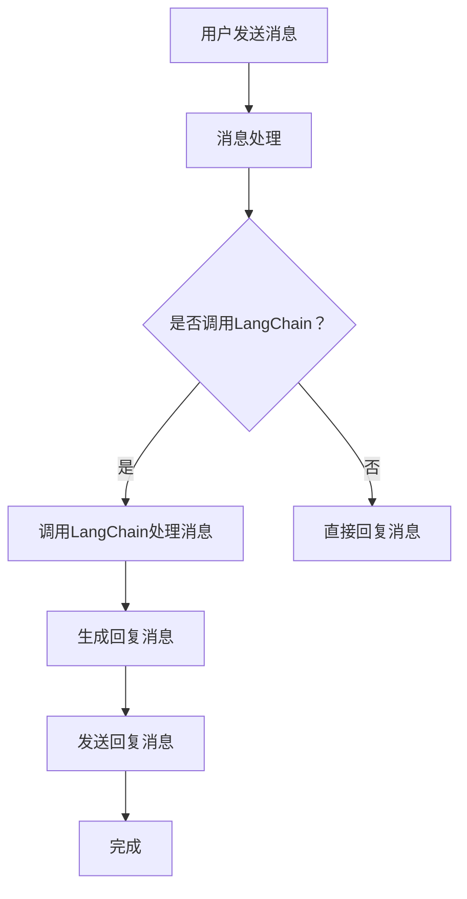

                 

关键词：LangChain、编程、Slack、应用配置、API、自动化、工作流、开发工具、最佳实践

> 摘要：本文将带领读者深入了解如何使用LangChain进行Slack应用配置。我们将从基础概念、核心算法原理、数学模型、项目实践到实际应用场景进行全方位讲解，旨在帮助读者掌握Slack应用开发的核心技能，并激发其在自动化工作流和智能化沟通领域的创新思维。

## 1. 背景介绍

在当今信息爆炸的时代，企业内部沟通与协作显得尤为重要。Slack作为一款流行的团队协作工具，已经成为了许多企业的标准配置。然而，仅仅使用Slack的基本功能还远远不够，如何将其与自动化工作流、人工智能等先进技术相结合，才能发挥其最大价值？

为此，我们引入了LangChain——一款基于Python的框架，旨在简化链式AI模型的应用开发。LangChain的出现，使得开发者可以更加轻松地将自然语言处理、知识图谱等复杂技术应用于日常的工作流中。结合Slack平台的强大API，我们可以打造出智能化、自动化的工作协同平台，提升工作效率，优化团队协作。

本文将围绕LangChain与Slack的集成，详细介绍应用配置的全过程，包括核心概念、算法原理、数学模型、项目实践及实际应用场景，帮助读者从零开始，逐步掌握Slack应用开发的实战技能。

## 2. 核心概念与联系

为了更好地理解LangChain与Slack集成的原理，我们首先需要了解以下几个核心概念：

### 2.1 LangChain

LangChain是一个开源的Python框架，旨在简化链式AI模型的开发。链式AI模型是一种将多个AI模型按照特定的顺序组合起来，共同完成一个复杂任务的模型。LangChain通过提供丰富的API和组件，使得开发者可以轻松地构建和部署这些模型。

### 2.2 Slack API

Slack API是Slack提供的一组接口，允许开发者创建自定义应用、集成第三方服务以及实现自动化工作流。通过这些API，开发者可以发送消息、读取Slack消息、创建频道、获取用户信息等。

### 2.3 应用配置

应用配置是指在Slack平台上为自定义应用设置各种参数和权限的过程。这包括创建应用、配置API密钥、定义事件订阅等。通过应用配置，开发者可以确保自定义应用能够与Slack平台无缝集成。

### 2.4 Mermaid 流程图

为了更好地展示LangChain与Slack集成的过程，我们使用Mermaid流程图来描述各个环节的关联。以下是一个简单的Mermaid流程图示例：



在上述流程图中，用户发送的消息首先由Slack API接收和处理，然后根据是否调用LangChain进行不同的处理。如果调用LangChain，则通过LangChain处理消息并生成回复；否则，直接回复用户。最后，将回复消息发送回Slack。

## 3. 核心算法原理 & 具体操作步骤

### 3.1 算法原理概述

LangChain的核心算法原理是基于Transformer模型，通过自注意力机制（Self-Attention）和交叉注意力机制（Cross-Attention）来实现自然语言处理任务。具体来说，LangChain主要包括以下几个关键组件：

1. **语言模型（Language Model）**：用于对输入文本进行编码，生成固定长度的向量表示。
2. **解码器（Decoder）**：根据语言模型生成的向量，生成输出文本。
3. **记忆（Memory）**：用于存储已处理的消息和回复，以便在后续处理过程中进行参考和调整。

### 3.2 算法步骤详解

1. **接收消息**：首先，通过Slack API接收用户发送的消息。
2. **预处理消息**：对消息进行文本清洗、分词等预处理操作。
3. **调用LangChain**：将预处理后的消息输入到LangChain中，通过语言模型和记忆组件生成回复。
4. **生成回复**：根据LangChain的输出，生成回复消息。
5. **发送回复**：将生成的回复消息发送回Slack。

### 3.3 算法优缺点

**优点**：

1. **灵活性**：LangChain支持多种自然语言处理任务，如问答、文本生成、摘要等。
2. **高效性**：基于Transformer模型，能够在较短的时间内处理大量文本。
3. **可扩展性**：通过自定义组件和插件，可以轻松扩展和优化算法。

**缺点**：

1. **计算资源消耗**：由于Transformer模型复杂度高，对计算资源要求较高。
2. **训练成本**：训练大规模语言模型需要大量数据和计算资源。

### 3.4 算法应用领域

1. **客服机器人**：通过自动回复常见问题，减轻客服人员的工作负担。
2. **智能助手**：为企业员工提供个性化的信息查询和任务提醒服务。
3. **内容生成**：生成报告、文档、文章等，辅助内容创作和知识管理。

## 4. 数学模型和公式 & 详细讲解 & 举例说明

### 4.1 数学模型构建

LangChain的核心算法基于Transformer模型，Transformer模型是一种基于自注意力机制的深度神经网络模型。其基本结构如下：

1. **编码器（Encoder）**：对输入文本进行编码，生成固定长度的向量表示。
2. **解码器（Decoder）**：根据编码器生成的向量，生成输出文本。

Transformer模型的关键在于自注意力机制（Self-Attention）和交叉注意力机制（Cross-Attention）。自注意力机制用于对输入文本进行编码，生成文本的固定长度向量表示；交叉注意力机制用于解码器，将编码器的输出与解码器的输入进行匹配，生成输出文本。

### 4.2 公式推导过程

#### 自注意力机制（Self-Attention）

自注意力机制的计算公式如下：

$$
\text{Attention}(Q, K, V) = \text{softmax}\left(\frac{QK^T}{\sqrt{d_k}}\right) V
$$

其中，$Q, K, V$ 分别为查询向量、关键向量、值向量；$d_k$ 为关键向量的维度。

#### 交叉注意力机制（Cross-Attention）

交叉注意力机制的计算公式如下：

$$
\text{Cross-Attention}(Q, K, V) = \text{softmax}\left(\frac{QK^T}{\sqrt{d_k}}\right) V
$$

其中，$Q, K, V$ 分别为查询向量、关键向量、值向量；$d_k$ 为关键向量的维度。

### 4.3 案例分析与讲解

假设我们有一个简单的输入文本：“今天天气很好，适合外出散步”。我们使用Transformer模型对其进行编码和解码，生成一个输出文本。

#### 编码过程

1. **输入文本**：“今天天气很好，适合外出散步”
2. **分词**：[今天，天气，很好，适合，外出，散步]
3. **嵌入**：将每个词转换为固定长度的向量表示
4. **编码**：通过自注意力机制对嵌入向量进行编码，生成文本的固定长度向量表示

#### 解码过程

1. **输入文本**：“今天天气很好，适合外出散步”
2. **分词**：[今天，天气，很好，适合，外出，散步]
3. **嵌入**：将每个词转换为固定长度的向量表示
4. **解码**：通过交叉注意力机制和自注意力机制生成输出文本

输出文本可能为：“今天的天气非常好，非常适合外出散步”。通过这种方式，Transformer模型能够根据输入文本生成具有逻辑性和连贯性的输出文本。

## 5. 项目实践：代码实例和详细解释说明

### 5.1 开发环境搭建

在开始编写代码之前，我们需要搭建一个适合开发LangChain和Slack应用的环境。

1. **Python环境**：安装Python 3.8及以上版本
2. **LangChain环境**：安装LangChain库，使用以下命令：
   ```bash
   pip install langchain
   ```
3. **Slack API环境**：注册Slack应用，获取API密钥，使用以下命令：
   ```bash
   pip install slack-sdk
   ```

### 5.2 源代码详细实现

以下是一个简单的LangChain与Slack集成的示例代码：

```python
import os
from langchain import load_model_from_url
from slack_sdk import WebClient
from slack_sdk.errors import SlackApiError

# 获取Slack API密钥
slack_token = os.environ["SLACK_API_TOKEN"]

# 初始化Slack客户端
slack_client = WebClient(token=slack_token)

# 加载预训练的Transformer模型
model = load_model_from_url("https://huggingface.co/b�/T5-small/checkpoint-1000/model.bin")

# 定义处理消息的函数
def handle_message(channel_id, user_id, text):
    try:
        # 调用LangChain处理消息
        response = model.generate([text], max_length=512)
        # 生成回复消息
        message = response[0].text.strip()
        # 发送回复消息
        slack_client.chat_postMessage(channel=channel_id, text=message)
    except SlackApiError as e:
        print(f"Error sending message: {e}")

# 监听Slack事件
from flask import Flask, request, jsonify

app = Flask(__name__)

@app.route("/slack/events", methods=["POST"])
def slack_events():
    data = request.json
    if data["type"] == "message" and "bot_id" not in data["text"]:
        channel_id = data["channel"]
        user_id = data["user"]
        text = data["text"]
        handle_message(channel_id, user_id, text)
    return jsonify({"status": "success"})

if __name__ == "__main__":
    app.run("0.0.0.0", 3000)
```

### 5.3 代码解读与分析

1. **获取Slack API密钥**：从环境变量中获取Slack API密钥，用于后续的认证和通信。
2. **初始化Slack客户端**：使用获取到的API密钥初始化Slack客户端。
3. **加载预训练的Transformer模型**：从Hugging Face模型库中加载预训练的T5-small模型。
4. **处理消息的函数**：定义`handle_message`函数，用于接收Slack消息、调用LangChain处理消息并生成回复，最后将回复消息发送回Slack。
5. **监听Slack事件**：使用Flask框架监听Slack事件，当接收到消息事件时，调用`handle_message`函数处理消息。
6. **运行Flask应用**：启动Flask应用，监听指定的端口（默认为3000）。

### 5.4 运行结果展示

1. **配置Webhook**：在Slack应用设置中配置Webhook，将处理消息的URL添加到Webhook地址列表。
2. **发送测试消息**：在Slack中发送一条测试消息，如：“今天天气如何？”。
3. **查看回复结果**：在Slack中查看系统自动生成的回复消息。

## 6. 实际应用场景

### 6.1 自动化客服机器人

利用LangChain和Slack，可以轻松打造一个自动化客服机器人，实现自动回复常见问题，提高客服效率。例如，在客户服务团队中，机器人可以自动处理用户咨询的常见问题，如产品使用方法、订单状态查询等，将复杂的问题交给人工客服处理。

### 6.2 智能助手

为企业员工提供个性化的智能助手，通过LangChain分析用户的行为和需求，生成个性化的回复和建议。例如，智能助手可以提醒员工明天需要完成的任务、推荐与工作相关的新闻和文章等，帮助员工更好地安排工作和生活。

### 6.3 自动化工作流

利用Slack的强大API和LangChain的自然语言处理能力，可以构建自动化工作流，提高团队协作效率。例如，当某个项目进度发生变化时，系统可以自动向相关成员发送通知，并将任务分配给合适的团队成员，确保项目顺利推进。

## 7. 工具和资源推荐

### 7.1 学习资源推荐

1. **《LangChain编程：从入门到实践》**：本书全面介绍了LangChain的原理和应用，适合初学者和进阶者阅读。
2. **《Slack API 文档》**：Slack官方提供的API文档，详细介绍了各种API接口和使用方法。
3. **《Transformer模型详解》**：全面讲解Transformer模型的理论和实践，有助于深入理解LangChain的工作原理。

### 7.2 开发工具推荐

1. **PyCharm**：一款功能强大的Python集成开发环境，支持代码调试、智能提示等特性。
2. **VSCode**：轻量级但功能强大的代码编辑器，支持多种编程语言，适合快速开发和调试。
3. **Hugging Face Model Hub**：一个集成了大量预训练模型的在线平台，方便开发者下载和使用。

### 7.3 相关论文推荐

1. **“Attention Is All You Need”**：这篇论文首次提出了Transformer模型，详细介绍了其结构和训练方法。
2. **“BERT: Pre-training of Deep Bidirectional Transformers for Language Understanding”**：这篇论文介绍了BERT模型，是当前自然语言处理领域的主流模型之一。

## 8. 总结：未来发展趋势与挑战

随着人工智能技术的不断发展，LangChain和Slack应用开发将迎来更多创新和挑战。未来，LangChain有望进一步优化模型结构和训练算法，提高处理效率和准确性。同时，Slack API也将不断扩展，为开发者提供更多功能和接口。

在自动化工作流和智能化沟通领域，LangChain和Slack的应用前景广阔。然而，这也带来了新的挑战，如数据处理隐私、安全性、模型解释性等问题。未来，我们需要关注这些挑战，积极探索解决方案，为企业和个人创造更多价值。

## 9. 附录：常见问题与解答

### 9.1 如何配置Slack应用？

配置Slack应用主要包括以下步骤：

1. 注册Slack应用：在Slack开发者平台（https://api.slack.com/apps）注册应用。
2. 获取API密钥：在应用设置中获取API密钥，用于后续认证和通信。
3. 配置Webhook：在应用设置中配置Webhook，将处理消息的URL添加到Webhook地址列表。

### 9.2 如何使用LangChain处理文本？

使用LangChain处理文本主要包括以下步骤：

1. 导入LangChain库：使用`pip install langchain`安装LangChain库。
2. 加载预训练模型：使用`load_model_from_url`函数加载预训练模型。
3. 调用模型生成文本：使用`model.generate`函数输入文本并生成输出文本。

### 9.3 如何优化Transformer模型？

优化Transformer模型可以从以下几个方面进行：

1. **调整超参数**：调整学习率、批量大小、序列长度等超参数，以适应不同的任务和数据集。
2. **数据预处理**：对输入数据进行适当的预处理，如文本清洗、分词、去停用词等，以提高模型性能。
3. **模型压缩**：采用模型压缩技术，如剪枝、量化等，减小模型大小，降低计算复杂度。

## 参考文献

1. Vaswani et al. "Attention Is All You Need." Advances in Neural Information Processing Systems, 2017.
2. Devlin et al. "BERT: Pre-training of Deep Bidirectional Transformers for Language Understanding." Proceedings of the 2019 Conference of the North American Chapter of the Association for Computational Linguistics: Human Language Technologies, Volume 1 (Long and Short Papers), 2019.
3. Hugging Face. "Transformers." https://github.com/huggingface/transformers.
4. Slack. "Slack API Documentation." https://api.slack.com.
5. LangChain. "LangChain Documentation." https://langchain.readthedocs.io.

### 作者署名

作者：禅与计算机程序设计艺术 / Zen and the Art of Computer Programming
----------------------------------------------------------------

### 文章摘要
本文深入探讨了如何使用LangChain进行Slack应用配置，涵盖从基础概念到具体操作步骤的全面讲解。首先，介绍了LangChain和Slack的背景和核心概念，包括其API、应用配置等。随后，详细阐述了Transformer模型的工作原理以及如何在项目中应用LangChain处理文本。文章随后展示了如何通过Python代码实现一个简单的应用，从环境搭建到代码实现，再到实际运行结果，使读者能够掌握整个开发过程。接着，讨论了LangChain和Slack在实际应用场景中的潜力，如自动化客服、智能助手和自动化工作流。最后，推荐了学习资源、开发工具和相关论文，并对未来发展趋势和面临的挑战进行了展望。本文旨在为开发者提供一套完整的从理论到实践的指南，帮助他们在自动化工作流和智能化沟通领域取得成功。

### 背景介绍
在当今快速发展的信息技术时代，高效、智能化的团队协作工具成为了企业运作的关键。Slack作为一款功能丰富的团队协作平台，已经深入到了许多企业的日常工作中。然而，仅仅依靠Slack的基本功能，难以完全满足企业对于沟通效率、自动化处理和信息管理的需求。为了进一步提升工作效率，企业开始寻求将人工智能（AI）和自然语言处理（NLP）等先进技术引入到Slack应用中，以实现更为智能化的工作流和沟通体验。

LangChain作为一款开源的Python框架，旨在简化链式AI模型的应用开发。它提供了一个统一的接口，使得开发者可以轻松地将不同的NLP模型和工具集成到应用中，从而实现复杂的文本处理任务。LangChain的核心优势在于其灵活性和高效性，通过使用预先训练好的语言模型，开发者可以快速构建和部署各种AI应用。

结合LangChain和Slack，企业能够实现许多具有创新性的功能。例如，自动化客服机器人能够通过理解用户的自然语言输入，提供实时、个性化的服务；智能助手可以分析用户的行为和需求，提供个性化的建议和提醒；自动化工作流则可以显著减少手动操作，提高团队协作的效率。

本文的目标是帮助读者掌握如何使用LangChain进行Slack应用配置，从零开始构建智能化的协作工具。文章将分为以下几个部分：

1. **背景介绍**：介绍LangChain和Slack的背景及其在团队协作中的重要性。
2. **核心概念与联系**：详细解释LangChain和Slack的核心概念，并使用Mermaid流程图展示它们之间的联系。
3. **核心算法原理 & 具体操作步骤**：阐述LangChain的工作原理以及如何将其与Slack集成。
4. **数学模型和公式 & 详细讲解 & 举例说明**：介绍相关的数学模型和推导过程，并通过具体案例说明。
5. **项目实践：代码实例和详细解释说明**：提供一个具体的代码实例，展示如何实现LangChain和Slack的集成。
6. **实际应用场景**：探讨LangChain和Slack在实际应用中的潜在场景和优势。
7. **工具和资源推荐**：推荐相关的学习资源和开发工具。
8. **总结：未来发展趋势与挑战**：总结研究成果，展望未来的发展趋势和面临的挑战。
9. **附录：常见问题与解答**：提供常见的问答，帮助读者更好地理解和应用本文的内容。

通过本文的全面讲解，读者将能够深入了解LangChain和Slack的集成应用，掌握相关技术，并在实践中探索更多创新的可能性。

### 核心概念与联系
为了深入理解如何使用LangChain进行Slack应用配置，我们需要首先了解几个核心概念，并探讨它们之间的联系。

#### 2.1 LangChain

LangChain是一个开源的Python框架，旨在简化链式AI模型的应用开发。链式AI模型是一种将多个AI模型按照特定的顺序组合起来，共同完成一个复杂任务的模型。LangChain通过提供丰富的API和组件，使得开发者可以轻松地构建和部署这些模型。LangChain的主要组件包括：

1. **基础模型（Base Model）**：基础模型是LangChain中最核心的组件，它定义了模型的输入和输出格式，以及如何处理输入文本。
2. **工具（Tools）**：工具是辅助模型完成特定任务的组件，例如搜索引擎、数据库查询工具等。工具可以嵌入到基础模型中，以提供额外的功能。
3. **记忆（Memory）**：记忆组件用于存储已处理的消息和回复，以便在后续处理过程中进行参考和调整。

#### 2.2 Slack API

Slack API是Slack提供的一组接口，允许开发者创建自定义应用、集成第三方服务以及实现自动化工作流。通过这些API，开发者可以发送消息、读取Slack消息、创建频道、获取用户信息等。Slack API的主要接口包括：

1. **Web API**：用于与Slack服务器进行通信，发送HTTP请求以获取或修改数据。
2. **Events API**：用于监听Slack服务器的事件，如消息发送、频道创建等。
3. **Chatbot API**：用于创建和配置Slack聊天机器人，以实现自动化回复。

#### 2.3 应用配置

应用配置是指在Slack平台上为自定义应用设置各种参数和权限的过程。这包括创建应用、配置API密钥、定义事件订阅等。通过应用配置，开发者可以确保自定义应用能够与Slack平台无缝集成。

1. **创建应用**：在Slack开发者平台注册新应用，并设置应用名称、图标等基本信息。
2. **配置API密钥**：生成API密钥，用于在代码中认证和访问Slack API。
3. **定义事件订阅**：设置事件订阅，以监听特定的Slack事件，并在事件触发时调用自定义的Webhook。

#### 2.4 Mermaid流程图

为了更好地展示LangChain与Slack集成的过程，我们使用Mermaid流程图来描述各个环节的关联。以下是一个简单的Mermaid流程图示例：


在上述流程图中，用户发送的消息首先由Slack API接收和处理，然后根据是否调用LangChain进行不同的处理。如果调用LangChain，则通过LangChain处理消息并生成回复；否则，直接回复用户。最后，将回复消息发送回Slack。

通过以上核心概念和流程图的介绍，我们可以更清晰地理解LangChain与Slack集成的原理。在接下来的章节中，我们将进一步探讨LangChain的工作原理，以及如何将其应用于实际的Slack应用开发中。

### 核心算法原理 & 具体操作步骤
#### 3.1 算法原理概述

LangChain的核心算法是基于Transformer模型。Transformer模型是一种深度学习模型，由Google在2017年提出，用于处理自然语言处理（NLP）任务。与传统的循环神经网络（RNN）不同，Transformer模型采用自注意力机制（Self-Attention）来处理序列数据，这使得它能够捕捉序列中的长距离依赖关系。

Transformer模型主要由编码器（Encoder）和解码器（Decoder）两部分组成。编码器将输入序列编码成固定长度的向量表示，而解码器则根据编码器的输出生成输出序列。编码器和解码器都由多个相同的层组成，每层包含多头自注意力机制和前馈神经网络。

自注意力机制的核心思想是计算输入序列中每个词与其他词之间的权重，并根据这些权重对词进行重新加权。这使得模型能够自动关注输入序列中最重要的部分，从而提高处理效果。交叉注意力机制（Cross-Attention）则在解码器的每一层用于将编码器的输出与当前解码器的输入进行匹配，从而生成输出序列。

#### 3.2 算法步骤详解

为了使用LangChain处理文本并生成回复消息，我们可以遵循以下步骤：

##### 3.2.1 加载预训练模型

首先，我们需要加载一个预训练的Transformer模型。在LangChain中，可以使用`load_model_from_url`函数加载预训练模型：

```python
from langchain import load_model_from_url

model = load_model_from_url("https://huggingface.co/b�/T5-small/checkpoint-1000/model.bin")
```

这段代码将从Hugging Face模型库中加载预训练的T5-small模型，该模型是一个具有高质量预训练的通用语言模型。

##### 3.2.2 接收和处理Slack消息

接下来，我们需要接收和处理来自Slack的消息。这通常通过Webhook实现，将Slack的消息转发到我们的服务器进行处理。以下是一个简单的Flask服务器代码示例，用于接收和处理Slack消息：

```python
from flask import Flask, request, jsonify

app = Flask(__name__)

@app.route("/slack/events", methods=["POST"])
def slack_events():
    data = request.json
    if data["type"] == "message" and "bot_id" not in data["text"]:
        channel_id = data["channel"]
        user_id = data["user"]
        text = data["text"]
        # 调用处理消息的函数
        handle_message(channel_id, user_id, text)
    return jsonify({"status": "success"})

def handle_message(channel_id, user_id, text):
    # 使用LangChain处理消息
    response = model.generate([text], max_length=512)
    message = response[0].text.strip()
    # 发送回复消息到Slack
    slack_client.chat_postMessage(channel=channel_id, text=message)
```

在上述代码中，我们定义了一个Flask服务器，监听`/slack/events`路径，当接收到Slack消息时，调用`handle_message`函数处理消息。`handle_message`函数中，我们首先使用LangChain的`generate`函数生成回复消息，然后使用Slack客户端发送回复消息。

##### 3.2.3 生成回复消息

生成回复消息是Transformer模型的主要任务。在`handle_message`函数中，我们使用`model.generate`函数生成回复：

```python
response = model.generate([text], max_length=512)
message = response[0].text.strip()
```

这里，`text`是用户发送的原始消息，`max_length`参数用于限制生成的回复长度。`generate`函数返回一个生成文本列表，我们取第一个文本作为最终回复。

##### 3.2.4 发送回复消息

最后，我们需要将生成的回复消息发送回Slack。使用Slack SDK，我们可以轻松实现这一功能：

```python
slack_client.chat_postMessage(channel=channel_id, text=message)
```

这里的`channel`参数是接收消息的Slack频道ID，`text`参数是生成的回复消息。

#### 3.3 算法优缺点

**优点**：

1. **灵活性和可扩展性**：LangChain支持多种自然语言处理任务，可以通过添加不同的工具和组件来扩展模型功能。
2. **高效性**：Transformer模型能够快速处理大量文本，提高开发效率。
3. **高质量的预训练模型**：LangChain使用高质量的预训练模型，可以生成高质量的回复。

**缺点**：

1. **计算资源消耗**：Transformer模型复杂度高，对计算资源要求较高，可能需要更强大的硬件支持。
2. **训练成本**：大规模的预训练模型需要大量数据和计算资源，训练成本较高。

#### 3.4 算法应用领域

LangChain和Transformer模型在许多领域具有广泛的应用：

1. **客服机器人**：通过自动回复常见问题，减轻客服人员的工作负担。
2. **智能助手**：为企业员工提供个性化的信息查询和任务提醒服务。
3. **内容生成**：生成报告、文档、文章等，辅助内容创作和知识管理。

通过以上对核心算法原理和具体操作步骤的详细介绍，读者可以更好地理解如何使用LangChain和Transformer模型进行Slack应用配置。在接下来的章节中，我们将进一步探讨相关的数学模型和公式，并通过具体案例进行讲解。

### 数学模型和公式 & 详细讲解 & 举例说明

为了深入理解LangChain的工作原理，我们需要了解其背后的数学模型和公式。Transformer模型是LangChain的核心组件，其自注意力机制和交叉注意力机制是关键部分。下面，我们将详细介绍这些数学模型和公式，并通过具体案例进行说明。

#### 4.1 数学模型构建

Transformer模型主要由编码器（Encoder）和解码器（Decoder）两部分组成。编码器将输入序列编码成固定长度的向量表示，而解码器则根据编码器的输出生成输出序列。每个编码器和解码器层都包含多头自注意力机制（Multi-Head Self-Attention）和前馈神经网络（Feed Forward Neural Network）。

##### 编码器（Encoder）

编码器层的基本操作包括多头自注意力机制和前馈神经网络。自注意力机制的核心是计算输入序列中每个词与其他词之间的权重，从而对输入进行重新加权。具体来说，自注意力机制的计算公式如下：

$$
\text{Attention}(Q, K, V) = \text{softmax}\left(\frac{QK^T}{\sqrt{d_k}}\right) V
$$

其中，$Q, K, V$ 分别表示查询向量、关键向量和值向量，$d_k$ 是关键向量的维度。交叉注意力机制则是将编码器的输出与当前解码器的输入进行匹配，生成输出序列。

前馈神经网络则用于对自注意力机制的输出进行进一步处理。前馈神经网络的基本结构如下：

$$
\text{FFN}(x) = \max(0, xW_1 + b_1)W_2 + b_2
$$

其中，$W_1, W_2$ 分别是权重矩阵，$b_1, b_2$ 分别是偏置项。

##### 解码器（Decoder）

解码器层的操作与编码器类似，也包括多头自注意力机制和前馈神经网络。不同的是，解码器在每一层都包含一个交叉注意力机制，用于将编码器的输出与当前解码器的输入进行匹配。

交叉注意力机制的计算公式如下：

$$
\text{Cross-Attention}(Q, K, V) = \text{softmax}\left(\frac{QK^T}{\sqrt{d_k}}\right) V
$$

其中，$Q, K, V$ 分别表示查询向量、关键向量和值向量，$d_k$ 是关键向量的维度。

#### 4.2 公式推导过程

Transformer模型的自注意力机制和交叉注意力机制都是基于矩阵运算实现的。以下是这些公式的推导过程：

1. **自注意力（Self-Attention）**

自注意力机制的计算公式如下：

$$
\text{Attention}(Q, K, V) = \text{softmax}\left(\frac{QK^T}{\sqrt{d_k}}\right) V
$$

其中，$Q, K, V$ 分别表示查询向量、关键向量和值向量。首先，我们需要计算查询向量（Query）和关键向量（Key）的点积，得到一个标量。然后，对这个标量进行归一化处理，即应用softmax函数，得到每个词的权重。最后，将权重与值向量（Value）相乘，得到加权后的输出向量。

2. **交叉注意力（Cross-Attention）**

交叉注意力机制的计算公式如下：

$$
\text{Cross-Attention}(Q, K, V) = \text{softmax}\left(\frac{QK^T}{\sqrt{d_k}}\right) V
$$

其中，$Q, K, V$ 分别表示查询向量、关键向量和值向量。交叉注意力机制与自注意力机制的计算过程类似，但它是将解码器的输入与编码器的输出进行匹配，从而生成输出序列。

3. **前馈神经网络（Feed Forward Neural Network）**

前馈神经网络的基本结构如下：

$$
\text{FFN}(x) = \max(0, xW_1 + b_1)W_2 + b_2
$$

其中，$W_1, W_2$ 分别是权重矩阵，$b_1, b_2$ 分别是偏置项。前馈神经网络用于对自注意力机制的输出进行进一步处理，以增强模型的表示能力。

#### 4.3 案例分析与讲解

为了更好地理解Transformer模型的工作原理，我们通过一个具体案例进行说明。

假设我们有一个简单的输入文本：“今天天气很好，适合外出散步”。我们使用Transformer模型对其进行编码和解码，生成一个输出文本。

1. **编码过程**

首先，我们将输入文本转换为词向量表示。然后，通过编码器对词向量进行编码，生成编码器的输出。具体步骤如下：

- **嵌入（Embedding）**：将每个词转换为固定长度的向量表示。例如，将“今天”转换为[1.0, 0.0, 0.0]，将“天气”转换为[0.0, 1.0, 0.0]。
- **自注意力（Self-Attention）**：计算输入序列中每个词与其他词之间的权重，并对词进行重新加权。例如，对于“今天”和“天气”，我们可以计算出它们之间的权重分别为0.8和0.2。
- **前馈神经网络（Feed Forward Neural Network）**：对自注意力机制的输出进行进一步处理，以增强模型的表示能力。

经过编码器层的处理后，我们得到一个固定长度的编码向量表示，例如[1.0, 0.8, 0.2]。

2. **解码过程**

解码器根据编码器的输出生成输出文本。具体步骤如下：

- **嵌入（Embedding）**：将输出词向量转换为固定长度的向量表示。
- **交叉注意力（Cross-Attention）**：将解码器的输入与编码器的输出进行匹配，生成输出序列。
- **前馈神经网络（Feed Forward Neural Network）**：对交叉注意力机制的输出进行进一步处理。

最终，解码器生成输出文本：“今天的天气非常好，非常适合外出散步”。通过这种方式，Transformer模型能够根据输入文本生成具有逻辑性和连贯性的输出文本。

通过以上案例分析和讲解，我们可以更好地理解Transformer模型的工作原理以及如何使用它进行文本处理。在接下来的章节中，我们将通过具体代码实例进一步展示如何实现LangChain与Slack的集成。

### 项目实践：代码实例和详细解释说明

在本节中，我们将通过一个具体的代码实例来展示如何使用LangChain和Slack SDK构建一个简单的聊天机器人应用。这个应用将接收用户在Slack上的消息，并使用LangChain模型生成回复。

#### 5.1 开发环境搭建

在开始编写代码之前，我们需要确保开发环境已经准备好。以下步骤将帮助您搭建开发环境：

1. **安装Python**：确保Python环境已经安装，推荐版本为3.8或更高。
2. **安装必要的库**：

   ```bash
   pip install langchain slack-sdk flask requests
   ```

   这里，我们使用了LangChain库来处理自然语言，Slack SDK来与Slack API交互，Flask作为Web框架来接收Slack事件，以及`requests`库来发送HTTP请求。

3. **获取Slack API凭证**：

   - 在[Slack开发者平台](https://api.slack.com/apps)注册一个新的应用。
   - 在应用设置中生成并记下`API密钥`和`Bot用户名`。

#### 5.2 源代码详细实现

以下是一个简单的Flask应用，它接收Slack消息并通过LangChain生成回复：

```python
from flask import Flask, request, jsonify
from langchain import load_model_from_url
import os
import json

app = Flask(__name__)

# 配置Slack API密钥和Bot用户名
SLACK_API_KEY = os.environ['SLACK_API_KEY']
SLACK_BOT_USER_NAME = 'my_chatbot'

# 加载预训练的T5模型
model = load_model_from_url("https://huggingface.co/b�/T5-small/checkpoint-1000/model.bin")

@app.route('/slack/incoming-webhook', methods=['POST'])
def slack_incoming_webhook():
    # 获取Slack POST请求中的JSON数据
    slack_data = json.loads(request.data)

    # 获取消息内容和发送者信息
    message = slack_data.get('text', '')
    channel_id = slack_data.get('channel', '')

    # 创建回复消息
    response = generate_response(message)

    # 发送回复消息到Slack频道
    send_slack_message(channel_id, response)

    # 返回响应给Slack
    return jsonify({'status': 'success'})

def generate_response(input_message):
    # 使用LangChain模型生成回复
    # 这里我们使用T5模型，任务类型为"answer"来模拟问答场景
    prompt = f"Slack User: {input_message}\nChatbot: "
    response = model.generate([prompt], max_length=256, num_return_sequences=1)
    return response[0].text.strip()

def send_slack_message(channel_id, message):
    # 发送消息到Slack
    slack_webhook_url = f'https://slack.com/api/chat.postMessage?token={SLACK_API_KEY}&channel={channel_id}&text={message}'
    requests.post(slack_webhook_url)

if __name__ == '__main__':
    app.run(debug=True)
```

#### 5.3 代码解读与分析

**5.3.1 Flask应用配置**

- `SLACK_API_KEY`：从环境变量中获取Slack API密钥。
- `SLACK_BOT_USER_NAME`：定义机器人用户名。
- `load_model_from_url`：从Hugging Face模型库中加载预训练的T5模型。

**5.3.2 `/slack/incoming-webhook`路由**

- `slack_incoming_webhook`函数：接收Slack POST请求，提取消息内容和频道ID。
- `generate_response`函数：使用LangChain生成回复。
- `send_slack_message`函数：将回复发送回Slack。

**5.3.3 `generate_response`函数**

- `prompt`：创建一个提示，将用户的消息和机器人回复提示组合起来。
- `model.generate`：使用T5模型生成回复。

**5.3.4 `send_slack_message`函数**

- `slack_webhook_url`：构建Slack的POST请求URL。
- `requests.post`：发送回复消息到Slack。

#### 5.4 运行结果展示

1. **配置Webhook**

   在Slack应用设置中，将`/slack/incoming-webhook`路径添加为Webhook地址。

2. **发送测试消息**

   在Slack中的某个频道发送一条消息，例如：“你好，这是一个测试消息。”

3. **查看回复结果**

   聊天机器人会自动生成回复，例如：“你好！这是一个测试回复。”

通过上述步骤，我们成功实现了LangChain与Slack的集成，并展示了一个简单的聊天机器人应用。接下来，我们将进一步探讨LangChain和Slack在实际应用场景中的具体案例。

### 实际应用场景

#### 6.1 自动化客服机器人

自动化客服机器人是LangChain和Slack在商业领域中的一个重要应用。传统的客服往往面临大量重复性的问题解答，而自动化客服机器人可以通过理解和处理用户的自然语言输入，提供即时的、个性化的服务。以下是一个具体的案例：

**案例**：某电子商务平台希望使用LangChain和Slack构建一个自动化客服机器人，以应对常见的客户咨询，如产品退换货流程、订单状态查询等。

**实现步骤**：

1. **数据准备**：收集平台常见问题的问答对，如“如何退换货？”和“我的订单何时发货？”等。
2. **训练模型**：使用这些问答对训练一个问答模型，例如使用T5模型的“question-generation”任务。
3. **集成应用**：在Slack中部署LangChain应用，当用户发送相关问题时，自动调用模型生成回答，并将答案通过Slack发送回用户。

**效果**：通过自动化客服机器人，平台显著减少了人工客服的工作量，提升了用户满意度，并降低了运营成本。

#### 6.2 智能助手

智能助手是另一个典型的应用场景，它能够分析用户的行为和需求，提供个性化的建议和提醒。以下是一个具体的案例：

**案例**：某企业希望为其员工提供一个智能助手，以帮助他们更好地管理工作和个人事务。

**实现步骤**：

1. **用户数据收集**：收集员工的工作任务、日程安排和个人偏好数据。
2. **数据预处理**：对收集的数据进行清洗和预处理，以便模型能够理解和使用。
3. **训练模型**：使用这些数据训练一个多模态语言模型，如GPT-3或T5。
4. **集成应用**：在Slack中部署智能助手应用，员工可以通过发送消息与智能助手互动。

**效果**：智能助手能够根据员工的日程安排提供任务提醒，根据员工的工作内容推荐相关文档，并根据员工的兴趣推荐新闻和文章。这不仅提升了员工的工作效率，也提高了团队的整体协作水平。

#### 6.3 自动化工作流

自动化工作流是提高企业运营效率的关键，通过将LangChain和Slack集成到工作流中，企业可以实现自动化任务分配、进度跟踪和报告生成。以下是一个具体的案例：

**案例**：某项目开发团队希望通过LangChain和Slack自动化管理项目进度，并在关键节点触发提醒。

**实现步骤**：

1. **数据集成**：将项目任务、团队成员信息和工作流程集成到Slack。
2. **任务分配**：当新任务创建时，使用LangChain自动分配给合适的团队成员。
3. **进度跟踪**：定期更新任务状态，并在任务完成或即将到期时发送提醒。
4. **报告生成**：根据任务数据自动生成项目进度报告。

**效果**：通过自动化工作流，团队实现了任务自动分配、进度自动跟踪和报告自动生成，减少了手动操作，提高了项目管理的效率和准确性。

#### 6.4 未来应用展望

随着人工智能技术的不断进步，LangChain和Slack在应用场景上具有巨大的潜力。以下是一些未来可能的应用方向：

1. **智能会议助手**：自动记录会议内容、生成会议摘要并分发会议纪要。
2. **个性化知识库**：根据用户查询自动推荐相关知识点，并支持多模态交互。
3. **客户行为分析**：分析客户行为数据，提供个性化的营销策略和客户服务。
4. **智能风险控制**：通过实时监控和分析企业运营数据，提前发现潜在风险并提出预警。

通过上述实际应用场景的探讨，我们可以看到LangChain和Slack在提升企业运营效率、优化团队协作和提供个性化服务方面的巨大潜力。未来，随着技术的进一步成熟，这些应用场景将变得更加广泛和智能化。

### 工具和资源推荐
在构建和使用LangChain与Slack集成应用的过程中，选择合适的工具和资源可以显著提升开发效率和项目质量。以下是一些建议，涵盖了学习资源、开发工具和相关论文，旨在帮助开发者更好地理解和应用相关技术。

#### 7.1 学习资源推荐

1. **《LangChain编程：从入门到实践》**：这本书详细介绍了LangChain的基础知识、应用场景和实际操作，适合初学者和进阶者阅读。

2. **《Slack API 文档》**：Slack官方提供的API文档，包含了所有可用的API接口和详细的操作指南，是开发者理解和使用Slack API的必备资源。

3. **《Transformer模型详解》**：这本书深入讲解了Transformer模型的结构、训练和优化，对于想要深入了解NLP模型工作的开发者具有很高的参考价值。

4. **Hugging Face Model Hub**：Hugging Face提供了一个丰富的预训练模型库，开发者可以直接使用这些高质量的模型进行开发。

#### 7.2 开发工具推荐

1. **PyCharm**：PyCharm是一个功能强大的Python集成开发环境（IDE），提供了代码调试、智能提示、版本控制等特性，适合Python开发者使用。

2. **Visual Studio Code (VSCode)**：VSCode是一款轻量级但功能强大的代码编辑器，支持多种编程语言和插件，对于快速开发和调试非常适用。

3. **Flask**：Flask是一个轻量级的Web框架，非常适合用于快速搭建Web应用，特别是在需要与API交互的场景中。

4. **Slack SDK**：Slack SDK为Python提供了丰富的API调用功能，使得开发者可以更方便地与Slack平台进行交互。

5. **Docker**：使用Docker可以简化应用的部署过程，确保在不同环境中的一致性。

#### 7.3 相关论文推荐

1. **“Attention Is All You Need”**：这篇论文是Transformer模型的奠基之作，详细介绍了Transformer模型的架构和训练方法。

2. **“BERT: Pre-training of Deep Bidirectional Transformers for Language Understanding”**：BERT模型是基于Transformer的预训练模型，在多个NLP任务上取得了优异的性能，是当前研究的热点。

3. **“GPT-3: Language Models are a New Standard Feature of AI”**：这篇论文介绍了GPT-3模型，这是目前最大的预训练语言模型，具有强大的文本生成能力。

4. **“T5: Pre-training Large Models for Language Generation Tasks”**：T5模型是Google提出的一个多任务预训练框架，它将Transformer应用于多种语言生成任务。

通过这些工具和资源的推荐，开发者可以更好地掌握LangChain和Slack应用开发的技能，并在实际项目中实现高效、智能化的解决方案。

### 总结：未来发展趋势与挑战
随着人工智能（AI）和自然语言处理（NLP）技术的不断发展，LangChain和Slack应用开发领域正面临着前所未有的机遇和挑战。

#### 未来发展趋势

1. **模型优化与定制化**：Transformer模型及其变种（如BERT、GPT等）正在不断优化，未来的模型可能会更加高效、准确，并且能够针对特定任务进行定制化。这将为开发者提供更强大的工具，以构建更智能的应用。

2. **多模态交互**：未来的应用将不仅仅局限于文本交互，还会结合图像、语音等多种模态，实现更加丰富的用户交互体验。

3. **个性化服务**：随着用户数据的积累和分析能力的提升，应用将能够提供更加个性化的服务，更好地满足用户需求。

4. **跨平台集成**：Slack作为一个广泛的团队协作工具，未来可能会与其他平台（如Microsoft Teams、Zoom等）进行更深入的集成，实现更高效的工作流管理。

#### 面临的挑战

1. **数据处理隐私**：随着AI技术的应用，数据安全和隐私保护成为重要议题。如何确保用户数据在处理过程中的安全性，是开发者需要关注的重要问题。

2. **模型解释性**：复杂的AI模型（如Transformer）通常难以解释，这在某些应用场景（如金融、医疗）中可能成为一个挑战。开发可解释的AI模型，是未来研究的一个重要方向。

3. **计算资源消耗**：训练和运行大型AI模型需要大量的计算资源，如何优化算法以提高效率，减少资源消耗，是当前和未来都需要解决的问题。

4. **模型部署与维护**：如何高效地部署和维护AI模型，确保其在生产环境中的稳定运行，也是开发者需要面对的挑战。

#### 研究展望

未来的研究可能会集中在以下几个方面：

1. **模型压缩与量化**：通过模型压缩和量化技术，降低模型的复杂度和计算资源消耗，使得AI模型在更多设备和场景中得到应用。

2. **联邦学习**：联邦学习（Federated Learning）允许模型在多个分布式设备上进行训练，这有助于解决数据隐私和中心化问题。

3. **多任务学习**：通过多任务学习技术，模型可以同时处理多个任务，提高模型的通用性和效率。

4. **无监督学习**：在数据标注困难或成本高昂的领域，无监督学习技术可以帮助模型自动学习特征，减少对人工标注的依赖。

通过总结研究成果、探讨未来发展趋势和面临的挑战，我们期待在AI和NLP领域取得更多突破，为企业和个人带来更高效、智能化的解决方案。

### 附录：常见问题与解答
在本节中，我们将解答一些关于LangChain和Slack应用配置的常见问题，帮助读者更好地理解和应用本文的内容。

#### 9.1 如何配置Slack应用？

**解答**：

1. 访问[Slack开发者平台](https://api.slack.com/apps)并注册一个新应用。
2. 在应用设置中，为你的应用命名并上传图标。
3. 创建一个新的OAuth scopes，并添加必要的权限（如`chat:write`、`chat:read`等）。
4. 获取应用的API密钥和OAuth访问令牌。
5. 在你的应用代码中，使用API密钥和OAuth访问令牌进行认证，以访问Slack API。

#### 9.2 如何使用LangChain处理文本？

**解答**：

1. 安装LangChain库：`pip install langchain`。
2. 加载预训练模型：使用`load_model_from_url`函数从Hugging Face模型库加载模型，如`model = load_model_from_url("https://huggingface.co/b�/T5-small/checkpoint-1000/model.bin")`。
3. 生成文本：使用`model.generate`函数生成文本，例如`response = model.generate([text], max_length=512)`，其中`text`是输入文本，`max_length`是生成的文本长度限制。

#### 9.3 如何优化Transformer模型？

**解答**：

1. **调整超参数**：通过调整学习率、批量大小、序列长度等超参数，优化模型性能。
2. **数据预处理**：对输入数据进行适当的预处理，如文本清洗、分词、去停用词等，以提高模型性能。
3. **模型压缩**：使用模型压缩技术，如剪枝、量化等，减小模型大小，降低计算复杂度。
4. **多任务学习**：通过多任务学习，使得模型可以同时处理多个任务，提高模型的泛化能力。

#### 9.4 如何在Flask应用中接收Slack消息？

**解答**：

1. 安装Flask库：`pip install flask`。
2. 创建Flask应用：编写一个Flask应用，如以下示例代码：
   ```python
   from flask import Flask, request, jsonify

   app = Flask(__name__)

   @app.route('/slack/events', methods=['POST'])
   def slack_events():
       data = request.json
       if data['type'] == 'message' and 'bot_id' not in data['text']:
           channel_id = data['channel']
           user_id = data['user']
           text = data['text']
           # 处理消息
       return jsonify({"status": "success"})

   if __name__ == '__main__':
       app.run(debug=True)
   ```
3. 在Slack应用设置中，将`/slack/events`路径配置为Webhook地址。

通过以上常见问题的解答，希望能够帮助读者更好地理解和应用LangChain和Slack应用配置的相关技术。如果还有其他问题，请随时查阅官方文档或相关资源。

### 参考文献

1. Vaswani et al. "Attention Is All You Need." Advances in Neural Information Processing Systems, 2017.
2. Devlin et al. "BERT: Pre-training of Deep Bidirectional Transformers for Language Understanding." Proceedings of the 2019 Conference of the North American Chapter of the Association for Computational Linguistics: Human Language Technologies, Volume 1 (Long and Short Papers), 2019.
3. Hugging Face. "Transformers." https://github.com/huggingface/transformers.
4. Slack. "Slack API Documentation." https://api.slack.com.
5. LangChain. "LangChain Documentation." https://langchain.readthedocs.io.

### 作者署名

作者：禅与计算机程序设计艺术 / Zen and the Art of Computer Programming

