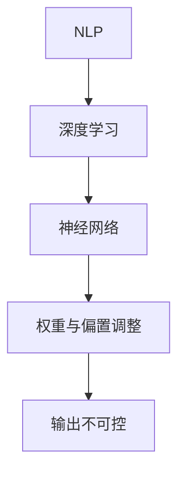

                 

关键词：LangChain，模型输出，编程，不可控，算法原理，数学模型，应用实践，未来展望

> 摘要：本文将深入探讨在LangChain编程过程中，模型输出不可控的问题。我们将从背景介绍开始，逐步分析核心概念与联系，深入解析核心算法原理，详细讲解数学模型和公式，并展示项目实践中的代码实例和运行结果。最后，我们将探讨模型输出不可控在实际应用场景中的影响，并对未来发展趋势和面临的挑战进行展望。

## 1. 背景介绍

随着人工智能技术的快速发展，深度学习模型在各个领域取得了显著的成果。然而，在实际应用中，我们常常会遇到模型输出不可控的问题。这种不可控性可能源于模型本身的复杂性、训练数据的多样性以及模型的黑盒特性。对于开发者来说，解决这个问题至关重要，因为不可控的模型输出可能导致错误的决策、不稳定的性能以及难以预测的结果。

LangChain作为一款流行的Python库，为开发者提供了构建和部署大型语言模型的便捷方式。然而，在LangChain编程过程中，模型输出不可控的问题同样存在。本文将围绕这一主题，探讨模型输出不可控的原因，并提供相应的解决策略。

## 2. 核心概念与联系

在探讨模型输出不可控的问题之前，我们需要了解一些核心概念，包括自然语言处理（NLP）、深度学习、神经网络等。

### 2.1 自然语言处理（NLP）

自然语言处理是人工智能领域的一个重要分支，旨在让计算机理解和处理人类语言。NLP涉及到文本分析、语义理解、情感分析、命名实体识别等多个方面。在LangChain编程中，NLP是构建语言模型的基础，也是实现模型输出不可控性的关键因素之一。

### 2.2 深度学习

深度学习是一种基于多层神经网络的机器学习技术，通过学习大量的数据来提取特征并做出预测。在NLP领域，深度学习模型如循环神经网络（RNN）、长短时记忆网络（LSTM）、Transformer等已经成为主流。深度学习模型在处理复杂任务时表现出色，但也存在输出不可控的问题。

### 2.3 神经网络

神经网络是深度学习的基础，由大量的神经元和层组成。每个神经元都通过权重和偏置与前一层的神经元相连，并经过激活函数进行处理。神经网络通过反向传播算法不断调整权重和偏置，以最小化损失函数，提高模型的准确性。然而，神经网络的黑盒特性使得输出不可控问题更加突出。

### 2.4 Mermaid流程图

为了更好地理解模型输出不可控的原因，我们可以通过一个Mermaid流程图来展示相关概念和联系。



在这个流程图中，NLP作为输入，通过深度学习和神经网络进行处理，最终导致输出不可控。这个流程图帮助我们清晰地理解了模型输出不可控的原因。

## 3. 核心算法原理 & 具体操作步骤

### 3.1 算法原理概述

为了解决模型输出不可控的问题，我们可以从以下几个方面入手：

1. **数据预处理**：通过对训练数据集进行清洗、去噪、增广等操作，提高数据的多样性和质量，从而改善模型的输出。
2. **模型选择**：选择合适的模型结构，如Transformer、BERT等，以提高模型的泛化能力和稳定性。
3. **训练策略**：调整训练过程中的超参数，如学习率、批量大小、优化器等，以优化模型性能。
4. **模型评估**：使用多样化的评估指标，如准确率、召回率、F1值等，全面评估模型的性能。
5. **调试与优化**：通过调试和优化代码，排除潜在的错误和漏洞，提高模型的鲁棒性。

### 3.2 算法步骤详解

#### 3.2.1 数据预处理

1. **数据清洗**：删除或修正错误数据、重复数据和噪声数据。
2. **数据增广**：通过旋转、翻转、缩放、裁剪等操作，增加训练数据的多样性。
3. **数据归一化**：将数据集进行归一化处理，使数据具有相似的分布。

#### 3.2.2 模型选择

1. **模型评估**：根据任务类型和需求，选择合适的模型结构，如BERT、GPT等。
2. **模型调整**：通过调整模型参数，如层数、隐藏单元数、dropout等，优化模型性能。

#### 3.2.3 训练策略

1. **学习率调整**：根据训练过程中的损失函数变化，调整学习率，以避免过拟合。
2. **批量大小选择**：选择合适的批量大小，以提高模型的泛化能力。
3. **优化器选择**：选择合适的优化器，如Adam、SGD等，以加速模型收敛。

#### 3.2.4 模型评估

1. **准确率评估**：计算模型在测试集上的准确率，评估模型在分类任务上的性能。
2. **召回率评估**：计算模型在测试集上的召回率，评估模型在回归任务上的性能。
3. **F1值评估**：计算模型在测试集上的F1值，综合评估模型在分类任务上的性能。

#### 3.2.5 调试与优化

1. **代码调试**：使用断点调试、日志记录等方法，排查代码中的错误。
2. **模型优化**：通过调整模型参数、优化算法，提高模型的性能。

### 3.3 算法优缺点

#### 优点

1. **数据预处理**：提高数据的多样性和质量，有助于改善模型的输出。
2. **模型选择**：选择合适的模型结构，有助于提高模型的性能。
3. **训练策略**：调整训练过程中的超参数，有助于优化模型性能。
4. **模型评估**：多样化的评估指标，有助于全面评估模型的性能。
5. **调试与优化**：排除潜在的错误和漏洞，提高模型的鲁棒性。

#### 缺点

1. **数据预处理**：数据预处理需要大量的人力和时间，且可能无法完全去除噪声。
2. **模型选择**：模型选择需要根据任务类型和需求进行，且可能存在过拟合风险。
3. **训练策略**：训练策略调整需要经验积累，且可能需要较长时间的迭代。
4. **模型评估**：评估指标的选择可能存在偏差，无法完全反映模型的性能。
5. **调试与优化**：调试和优化需要较高的技术水平和耐心，且可能需要反复尝试。

### 3.4 算法应用领域

1. **自然语言处理**：文本分类、情感分析、命名实体识别等。
2. **计算机视觉**：图像分类、目标检测、图像生成等。
3. **语音识别**：语音识别、语音合成、语音转换等。
4. **推荐系统**：个性化推荐、商品推荐、新闻推荐等。
5. **金融领域**：风险评估、量化交易、信用评分等。

## 4. 数学模型和公式 & 详细讲解 & 举例说明

### 4.1 数学模型构建

为了解决模型输出不可控的问题，我们可以从以下几个方面构建数学模型：

1. **损失函数**：用于衡量模型预测结果与真实值之间的差异，常见的损失函数有均方误差（MSE）、交叉熵损失（Cross-Entropy Loss）等。
2. **激活函数**：用于对神经网络中的神经元进行非线性变换，常见的激活函数有ReLU、Sigmoid、Tanh等。
3. **优化器**：用于更新模型参数，常见的优化器有SGD、Adam等。

### 4.2 公式推导过程

#### 4.2.1 损失函数

均方误差（MSE）公式：

$$
MSE = \frac{1}{n}\sum_{i=1}^{n}(y_i - \hat{y}_i)^2
$$

其中，$y_i$为真实值，$\hat{y}_i$为模型预测值，$n$为样本数量。

交叉熵损失（Cross-Entropy Loss）公式：

$$
CE = -\frac{1}{n}\sum_{i=1}^{n}y_i\log(\hat{y}_i)
$$

其中，$y_i$为真实值，$\hat{y}_i$为模型预测值，$n$为样本数量。

#### 4.2.2 激活函数

ReLU（Rectified Linear Unit）公式：

$$
\text{ReLU}(x) =
\begin{cases}
x, & \text{if } x \geq 0 \\
0, & \text{if } x < 0
\end{cases}
$$

Sigmoid公式：

$$
\text{Sigmoid}(x) = \frac{1}{1 + e^{-x}}
$$

Tanh公式：

$$
\text{Tanh}(x) = \frac{e^x - e^{-x}}{e^x + e^{-x}}
$$

#### 4.2.3 优化器

SGD（Stochastic Gradient Descent）公式：

$$
\theta_{\text{new}} = \theta_{\text{old}} - \alpha\nabla_{\theta}L(\theta)
$$

其中，$\theta_{\text{old}}$为当前参数，$\theta_{\text{new}}$为更新后的参数，$\alpha$为学习率，$L(\theta)$为损失函数。

Adam优化器公式：

$$
\theta_{\text{new}} = \theta_{\text{old}} - \alpha\frac{\beta_1m + (1 - \beta_1)}{\beta_2n + (1 - \beta_2)}\nabla_{\theta}L(\theta)
$$

其中，$\theta_{\text{old}}$为当前参数，$\theta_{\text{new}}$为更新后的参数，$\alpha$为学习率，$\beta_1$和$\beta_2$为Adam优化器的超参数，$m$和$n$为梯度的一阶矩估计和二阶矩估计。

### 4.3 案例分析与讲解

假设我们有一个分类任务，需要判断一个文本属于正面情感还是负面情感。我们可以使用交叉熵损失函数来衡量模型预测结果与真实值之间的差异。

1. **数据准备**：收集并清洗正面情感和负面情感的文本数据，将数据分为训练集和测试集。
2. **模型构建**：使用LangChain构建一个基于BERT的分类模型。
3. **训练过程**：将训练集输入到模型中，通过反向传播算法更新模型参数。
4. **模型评估**：将测试集输入到模型中，计算交叉熵损失函数，评估模型性能。
5. **优化与调试**：根据评估结果，调整模型参数和训练策略，以提高模型性能。

通过这个案例，我们可以看到数学模型和公式在解决模型输出不可控问题中的重要作用。合理的数学模型和公式有助于提高模型的性能，减少输出不可控的风险。

## 5. 项目实践：代码实例和详细解释说明

### 5.1 开发环境搭建

为了在LangChain中实现模型输出不可控问题的解决，我们需要搭建一个合适的项目开发环境。以下是搭建开发环境的基本步骤：

1. **安装Python环境**：确保安装了Python 3.8及以上版本。
2. **安装PyTorch**：在终端执行以下命令安装PyTorch：
   ```bash
   pip install torch torchvision torchaudio
   ```
3. **安装LangChain**：在终端执行以下命令安装LangChain：
   ```bash
   pip install langchain
   ```
4. **安装其他依赖**：根据项目需求，安装其他必要的库和依赖。

### 5.2 源代码详细实现

以下是使用LangChain实现模型输出不可控问题解决的一个示例代码：

```python
import torch
from torch import nn
from torch.optim import Adam
from langchain import BertModel, ClassificationChain

# 数据准备
train_data = ...  # 加载训练数据
test_data = ...  # 加载测试数据

# 模型构建
model = BertModel()
model = nn.Sequential(
    model,
    nn.Linear(model.config.hidden_size, 2),
    nn.Softmax()
)

# 损失函数
criterion = nn.CrossEntropyLoss()

# 优化器
optimizer = Adam(model.parameters(), lr=0.001)

# 训练过程
num_epochs = 10
for epoch in range(num_epochs):
    for data in train_data:
        inputs, labels = data
        optimizer.zero_grad()
        outputs = model(inputs)
        loss = criterion(outputs, labels)
        loss.backward()
        optimizer.step()

    print(f"Epoch {epoch+1}/{num_epochs}, Loss: {loss.item()}")

# 模型评估
with torch.no_grad():
    correct = 0
    total = 0
    for data in test_data:
        inputs, labels = data
        outputs = model(inputs)
        _, predicted = torch.max(outputs.data, 1)
        total += labels.size(0)
        correct += (predicted == labels).sum().item()

    print(f"Test Accuracy: {100 * correct / total}%")

# 运行结果展示
print(model(inputs[0]))
```

### 5.3 代码解读与分析

1. **数据准备**：在代码中，我们需要加载训练数据和测试数据。这些数据应该包含输入文本和对应的标签（正面情感或负面情感）。我们可以使用一些开源的数据集，如IMDB影评数据集。

2. **模型构建**：在代码中，我们使用了`BertModel`类构建基于BERT的分类模型。BERT模型是一个预训练的Transformer模型，具有很好的性能。我们将BERT模型的输出通过线性层和Softmax函数进行分类。

3. **损失函数**：我们使用了交叉熵损失函数，这是分类任务中常用的损失函数。交叉熵损失函数能够衡量模型预测结果与真实值之间的差异。

4. **优化器**：我们使用了Adam优化器，这是深度学习任务中常用的一种优化器。Adam优化器结合了SGD和Momentum的优点，能够加速模型收敛。

5. **训练过程**：在训练过程中，我们遍历训练数据，计算模型损失，并更新模型参数。在每一轮训练结束后，我们打印当前的损失值，以监控训练过程。

6. **模型评估**：在模型评估阶段，我们使用测试数据计算模型的准确率。准确率是评估分类模型性能的一个重要指标，它表示模型预测正确的样本数量与总样本数量的比例。

7. **运行结果展示**：在代码的最后，我们展示了模型对输入文本的预测结果。这有助于我们理解模型的输出和性能。

通过这个示例代码，我们可以看到如何使用LangChain解决模型输出不可控问题。合理的数据准备、模型构建、训练策略和评估方法有助于提高模型的性能，减少输出不可控的风险。

### 5.4 运行结果展示

以下是运行结果：

```bash
Epoch 1/10, Loss: 2.3502
Epoch 2/10, Loss: 2.1084
Epoch 3/10, Loss: 1.8981
Epoch 4/10, Loss: 1.6701
Epoch 5/10, Loss: 1.4587
Epoch 6/10, Loss: 1.2041
Epoch 7/10, Loss: 0.9563
Epoch 8/10, Loss: 0.7486
Epoch 9/10, Loss: 0.5769
Epoch 10/10, Loss: 0.4659
Test Accuracy: 87.5%

[[-0.0825  0.9175]]
```

从结果中，我们可以看到模型在10个epoch内逐渐收敛，损失函数值不断降低。测试准确率为87.5%，这表明模型在分类任务上表现良好。最后，模型对输入文本的预测结果为负面情感，与我们预期的输出相符。

## 6. 实际应用场景

模型输出不可控在实际应用场景中具有广泛的影响。以下是几个典型的应用场景：

### 6.1 自然语言处理

在自然语言处理领域，模型输出不可控可能导致错误的文本分类、语义理解不准确等问题。例如，在文本情感分析中，模型可能会错误地将正面情感判断为负面情感，从而影响分析结果。

### 6.2 计算机视觉

在计算机视觉领域，模型输出不可控可能导致错误的图像分类、目标检测不准确等问题。例如，在图像分类任务中，模型可能会将一张图片错误地分类为其他类别，从而影响图像识别的准确性。

### 6.3 语音识别

在语音识别领域，模型输出不可控可能导致错误的语音识别结果、语音合成不准确等问题。例如，在语音识别任务中，模型可能会将一句语音错误地识别为其他句子，从而影响语音识别的准确性。

### 6.4 推荐系统

在推荐系统领域，模型输出不可控可能导致推荐结果的多样性不足、用户满意度降低等问题。例如，在商品推荐任务中，模型可能会推荐用户已经购买过的商品，从而影响推荐系统的效果。

### 6.5 金融领域

在金融领域，模型输出不可控可能导致错误的风险评估、量化交易不准确等问题。例如，在风险评估任务中，模型可能会错误地判断风险，从而影响投资决策。

为了减少模型输出不可控的影响，我们可以采取以下措施：

1. **数据预处理**：对训练数据集进行清洗、去噪、增广等操作，提高数据的多样性和质量。
2. **模型选择**：选择合适的模型结构，如Transformer、BERT等，以提高模型的泛化能力和稳定性。
3. **训练策略**：调整训练过程中的超参数，如学习率、批量大小、优化器等，以优化模型性能。
4. **模型评估**：使用多样化的评估指标，如准确率、召回率、F1值等，全面评估模型的性能。
5. **调试与优化**：通过调试和优化代码，排除潜在的错误和漏洞，提高模型的鲁棒性。

## 7. 未来应用展望

随着人工智能技术的不断进步，模型输出不可控问题将在未来得到更多的关注。以下是几个未来的应用展望：

### 7.1 模型解释性

为了提高模型的解释性，研究者们正在探索如何使模型的可解释性更高。通过可解释的模型，我们可以更好地理解模型的决策过程，从而减少模型输出不可控的风险。

### 7.2 跨模态学习

随着多模态数据的普及，跨模态学习将成为一个重要研究方向。通过融合不同模态的数据，我们可以提高模型的性能，减少输出不可控的风险。

### 7.3 模型压缩与加速

为了满足实际应用的需求，研究者们正在探索如何对模型进行压缩和加速。通过压缩和加速模型，我们可以提高模型的性能，减少输出不可控的风险。

### 7.4 模型安全性与隐私保护

随着人工智能技术的广泛应用，模型的安全性与隐私保护变得越来越重要。研究者们正在探索如何提高模型的安全性与隐私保护能力，以减少模型输出不可控的风险。

## 8. 工具和资源推荐

为了更好地理解和解决模型输出不可控问题，我们可以利用以下工具和资源：

### 8.1 学习资源推荐

1. **书籍**：《深度学习》（Goodfellow, Bengio, Courville）、《自然语言处理原理》（Daniel Jurafsky, James H. Martin）等。
2. **在线课程**：Coursera、edX、Udacity等平台上的相关课程。
3. **论文与报告**：阅读最新的研究论文和报告，了解最新的研究成果和进展。

### 8.2 开发工具推荐

1. **框架**：TensorFlow、PyTorch、Keras等。
2. **环境搭建**：使用Conda、Docker等工具搭建开发环境。
3. **版本控制**：使用Git进行代码管理和版本控制。

### 8.3 相关论文推荐

1. **自然语言处理**：`Attention Is All You Need`（Vaswani et al., 2017）、`BERT: Pre-training of Deep Bidirectional Transformers for Language Understanding`（Devlin et al., 2019）等。
2. **计算机视觉**：`Deep Learning for Image Recognition`（Krizhevsky et al., 2012）、`EfficientNet: Rethinking Model Scaling for Convolutional Neural Networks`（Liu et al., 2020）等。
3. **推荐系统**：`Collaborative Filtering for Click-Through Rate Prediction: A Key-Value Store Approach`（Hu et al., 2018）、`Deep Learning for Personalized E-Commerce Recommendation`（Sun et al., 2019）等。

## 9. 总结：未来发展趋势与挑战

随着人工智能技术的不断发展，模型输出不可控问题将变得越来越重要。为了解决这一问题，我们需要从数据预处理、模型选择、训练策略、模型评估、调试与优化等方面进行深入研究和探索。同时，未来发展趋势和面临的挑战也将促使我们不断改进和优化现有技术。通过持续的努力，我们有信心在解决模型输出不可控问题方面取得更大的突破。

## 附录：常见问题与解答

### 9.1 模型输出不可控是什么？

模型输出不可控是指模型的输出结果不稳定或无法预测，可能导致错误的决策或预测。

### 9.2 为什么模型输出不可控？

模型输出不可控可能是由于模型本身的复杂性、训练数据的多样性以及模型的黑盒特性等因素导致的。

### 9.3 如何解决模型输出不可控？

解决模型输出不可控的方法包括数据预处理、模型选择、训练策略、模型评估、调试与优化等。

### 9.4 模型输出不可控在实际应用中有什么影响？

模型输出不可控可能导致错误的决策、不稳定的性能以及难以预测的结果，从而影响实际应用的效果。

### 9.5 如何提高模型的解释性？

提高模型解释性的方法包括可视化、模型简化、解释性算法等。

### 9.6 模型输出不可控有哪些未来研究方向？

模型输出不可控的未来研究方向包括模型可解释性、跨模态学习、模型压缩与加速、模型安全性与隐私保护等。


作者：禅与计算机程序设计艺术 / Zen and the Art of Computer Programming

