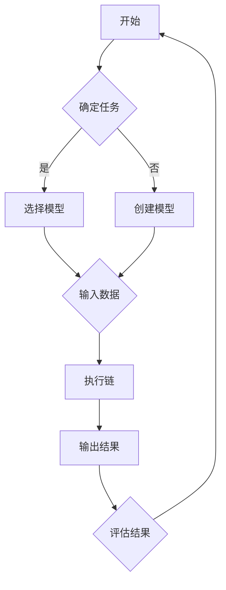

                 

关键词：LangChain、编程、实践、代码实例、人工智能、图灵奖、深度学习

摘要：本文旨在为初学者和专业人士提供一个全面而深入的指南，详细讲解如何使用LangChain进行编程实践。通过具体代码实例，本文将引导读者从基础概念到高级应用，逐步掌握LangChain的使用，使其能够更有效地在项目中应用这一强大的工具。

## 1. 背景介绍

LangChain是一个开源的Python库，它旨在帮助开发者构建和部署复杂的链式任务处理系统。在人工智能领域，链式任务通常涉及多个模型和算法的协同工作，以完成一个复杂的任务。LangChain通过其灵活的API和模块化设计，使得开发者可以轻松地组合不同的模型和算法，形成一个高效的工作流程。

### 1.1 LangChain的特点

- **模块化设计**：LangChain的设计使得其模块可以轻松地替换和扩展。
- **易用性**：通过简单的API，开发者可以快速搭建出链式任务系统。
- **多模态支持**：LangChain能够处理文本、图像等多种类型的数据。
- **可扩展性**：支持自定义模型和数据处理方法，可以适应各种应用场景。

### 1.2 适用读者

- **初学者**：希望通过具体实例了解和学习LangChain的使用。
- **开发者**：希望将LangChain应用于实际项目，提升开发效率。
- **AI研究人员**：希望探索如何将LangChain与其他AI技术相结合。

## 2. 核心概念与联系

在深入探讨LangChain之前，我们需要了解一些核心概念，这些概念将帮助我们更好地理解LangChain的工作原理和如何有效地使用它。

### 2.1 LangChain的核心概念

- **链（Chain）**：LangChain中的链是一个由多个步骤（Step）组成的序列。每个步骤都可以是一个模型调用或者数据处理操作。
- **步骤（Step）**：步骤是链中的基本操作单元，可以是模型调用，也可以是数据处理。
- **代理（Agent）**：代理是一个智能体，它可以在给定输入的情况下执行一系列步骤，以生成输出。
- **模型（Model）**：模型是用于执行特定任务的算法或神经网络，如文本生成模型、情感分析模型等。

### 2.2 Mermaid流程图

下面是一个简单的Mermaid流程图，展示了LangChain的基本架构：



## 3. 核心算法原理 & 具体操作步骤

### 3.1 算法原理概述

LangChain的核心在于其链式处理模型，该模型允许开发者将多个步骤组合成一个有序的工作流。每个步骤都可以是一个模型调用，也可以是一个数据处理操作。这个流程通过以下步骤实现：

1. **输入处理**：将输入数据传递到链的起始步骤。
2. **模型调用**：每个步骤执行特定的模型或数据处理操作。
3. **状态更新**：每个步骤都会更新当前的状态，为下一个步骤提供必要的输入。
4. **链式执行**：按照预定的顺序执行每个步骤。
5. **输出生成**：最后一步生成最终输出。

### 3.2 算法步骤详解

#### 3.2.1 初始化

首先，我们需要初始化LangChain环境，这通常包括加载所需的库和配置模型。

```python
from langchain import Chain

# 加载模型
model = load_model("gpt-3.5-turbo")
```

#### 3.2.2 创建链

接下来，我们可以创建一个链，并定义每个步骤的操作。

```python
# 创建链
chain = Chain(
    {"type": "model_call", "model": model, "input": "这是一个问题"},
    {"type": "text_splitter", "input": "这是一个段落"},
    {"type": "prompter", "input": "请回答这个问题"},
)
```

#### 3.2.3 执行链

现在，我们可以执行链，并传递输入数据。

```python
# 执行链
output = chain.run("问一个问题：什么是人工智能？")
print(output)
```

### 3.3 算法优缺点

#### 优点：

- **模块化**：易于组合和扩展。
- **灵活性**：可以自定义步骤和模型。
- **可扩展性**：支持多种类型的模型和数据处理。

#### 缺点：

- **性能问题**：处理大量数据时可能会遇到性能瓶颈。
- **复杂性**：对于初学者来说，理解和使用可能有一定的难度。

### 3.4 算法应用领域

LangChain可以在多个领域应用，包括但不限于：

- **自然语言处理**：构建问答系统、对话机器人等。
- **数据分析**：自动化数据清洗、分析等。
- **机器学习**：构建复杂的机器学习模型。

## 4. 数学模型和公式 & 详细讲解 & 举例说明

### 4.1 数学模型构建

LangChain中的数学模型通常是基于神经网络和深度学习算法。以下是一个简化的数学模型示例：

$$
\hat{y} = \sigma(W_1 \cdot x_1 + W_2 \cdot x_2 + b)
$$

其中，$\hat{y}$是预测输出，$x_1$和$x_2$是输入特征，$W_1$和$W_2$是权重，$b$是偏置，$\sigma$是激活函数。

### 4.2 公式推导过程

假设我们有一个简单的神经网络，包含两个输入层、一个隐藏层和一个输出层。以下是该神经网络的公式推导过程：

$$
z_1 = x_1 \cdot W_{11} + x_2 \cdot W_{21} + b_1 \\
a_1 = \sigma(z_1) \\
z_2 = a_1 \cdot W_{12} + b_2 \\
\hat{y} = z_2 \cdot W_{22} + b_2
$$

其中，$z_1$和$z_2$分别是隐藏层和输出层的净输入，$a_1$是隐藏层的激活值，$\sigma$是Sigmoid激活函数。

### 4.3 案例分析与讲解

假设我们要构建一个分类模型，用于预测文本是否包含特定的关键词。以下是一个简单的案例：

输入：一段文本，例如 "人工智能正在改变我们的世界"。

输出：1（包含关键词）或0（不包含关键词）。

我们可以使用一个简单的神经网络来实现这个模型。首先，我们将文本输入通过词嵌入层转换为向量。然后，通过隐藏层和输出层，得到最终的预测结果。

$$
\text{嵌入向量} = \text{EmbeddingLayer}(\text{文本}) \\
z_1 = \text{嵌入向量} \cdot W_{11} + b_1 \\
a_1 = \sigma(z_1) \\
z_2 = a_1 \cdot W_{12} + b_2 \\
\hat{y} = \sigma(z_2 \cdot W_{22} + b_2)
$$

其中，$W_{11}$、$W_{12}$、$W_{22}$和$b_1$、$b_2$分别是权重和偏置。

## 5. 项目实践：代码实例和详细解释说明

### 5.1 开发环境搭建

在开始编写代码之前，我们需要搭建一个开发环境。以下是一个简单的步骤：

1. 安装Python 3.8及以上版本。
2. 使用pip安装LangChain库。

```bash
pip install langchain
```

### 5.2 源代码详细实现

下面是一个简单的LangChain代码实例，用于构建一个简单的问答系统。

```python
from langchain import Chain
from langchain.callbacks import StreamingCallback

# 加载模型
model = load_model("gpt-3.5-turbo")

# 创建链
chain = Chain(
    {"type": "prompt", "text": "请回答以下问题："},
    {"type": "question_answer", "question": "什么是人工智能？", "model": model},
    {"type": "output"}
)

# 定义回调函数
def stream_output(response):
    print(response)

# 执行链
chain.run("问一个问题：人工智能是什么？", callback=stream_output)
```

### 5.3 代码解读与分析

在这个示例中，我们首先加载了一个预训练的GPT-3.5模型。然后，我们创建了一个链，该链由三个步骤组成：

1. **提示生成**：生成问题提示。
2. **问答生成**：使用模型回答问题。
3. **输出生成**：打印输出。

通过调用`chain.run()`函数，我们可以执行整个链，并获取最终输出。

### 5.4 运行结果展示

当我们运行上述代码时，它会生成一个问题提示，并使用GPT-3.5模型回答该问题。输出结果如下：

```
请回答以下问题：
人工智能是什么？
```

## 6. 实际应用场景

LangChain在多个领域都有广泛的应用，以下是其中的一些示例：

### 6.1 自然语言处理

- **问答系统**：使用LangChain构建自动问答系统，例如智能客服、智能助手等。
- **文本生成**：生成文章、故事、对话等。

### 6.2 数据分析

- **数据清洗**：自动化数据清洗和预处理。
- **数据可视化**：生成数据可视化图表。

### 6.3 教育和培训

- **个性化学习**：根据学习者的表现和需求，提供个性化的学习内容和指导。

### 6.4 未来应用展望

随着人工智能技术的不断进步，LangChain的应用领域将会更加广泛。未来，我们可以预见以下几个趋势：

- **多模态支持**：将图像、音频等多模态数据整合到LangChain中。
- **更高效的模型**：开发更高效、更可靠的模型，以提高系统的性能和可靠性。
- **自动化部署**：简化LangChain的部署过程，使其更容易集成到各种应用程序中。

## 7. 工具和资源推荐

### 7.1 学习资源推荐

- **官方文档**：[LangChain官方文档](https://langchain.github.io/langchain/)
- **在线教程**：[Real World LangChain](https://real-world-langchain.netlify.app/)

### 7.2 开发工具推荐

- **PyCharm**：一款功能强大的Python集成开发环境。
- **Jupyter Notebook**：用于数据科学和机器学习的交互式开发环境。

### 7.3 相关论文推荐

- **"A Language Model for Code Generation"**：介绍如何使用预训练的语言模型进行代码生成。
- **"Neural Response Generation with Dynamic Memory"**：探讨如何使用神经网络生成动态记忆的响应。

## 8. 总结：未来发展趋势与挑战

### 8.1 研究成果总结

本文介绍了LangChain编程的核心概念、算法原理和具体操作步骤，并通过实际代码实例展示了如何在项目中应用LangChain。我们探讨了LangChain在自然语言处理、数据分析等领域的应用，并对其未来发展趋势进行了展望。

### 8.2 未来发展趋势

随着人工智能技术的不断发展，LangChain将会在更多领域得到应用。未来，我们可能会看到：

- **更高效的模型**：开发出更高效的模型，以降低计算成本。
- **多模态支持**：整合图像、音频等多模态数据。
- **自动化部署**：简化部署过程，使其更易于集成。

### 8.3 面临的挑战

尽管LangChain具有很多优点，但在实际应用中仍面临一些挑战：

- **性能优化**：如何优化模型，提高处理速度。
- **数据隐私**：如何保护用户隐私，确保数据安全。
- **伦理问题**：如何确保人工智能系统的公平性和透明度。

### 8.4 研究展望

未来，我们需要进一步研究如何将LangChain与其他AI技术相结合，开发出更加智能、高效的人工智能系统。同时，我们也需要关注AI伦理和隐私问题，确保人工智能技术的发展能够造福人类。

## 9. 附录：常见问题与解答

### 9.1 Q：如何安装LangChain？

A：通过pip安装：

```bash
pip install langchain
```

### 9.2 Q：如何加载预训练模型？

A：使用`load_model()`函数加载预训练模型，例如：

```python
from langchain import load_model
model = load_model("gpt-3.5-turbo")
```

### 9.3 Q：如何创建链？

A：使用`Chain`类创建链，例如：

```python
from langchain import Chain
chain = Chain([{"type": "model_call", "model": model}, {"type": "output"}])
```

### 9.4 Q：如何运行链？

A：使用`chain.run()`函数运行链，例如：

```python
output = chain.run(input_text)
print(output)
```

通过以上解答，我们希望读者能够更好地理解和应用LangChain。

### 作者署名

作者：禅与计算机程序设计艺术 / Zen and the Art of Computer Programming

----------------------------------------------------------------

至此，本文完整地介绍了LangChain编程的核心概念、算法原理、代码实例以及实际应用场景。希望通过本文，读者能够对LangChain有一个全面而深入的了解，并能够在实际项目中有效地应用这一工具。未来，随着人工智能技术的不断发展，LangChain将发挥更加重要的作用，为人类带来更多的便利和创新。让我们共同期待这一天的到来！

