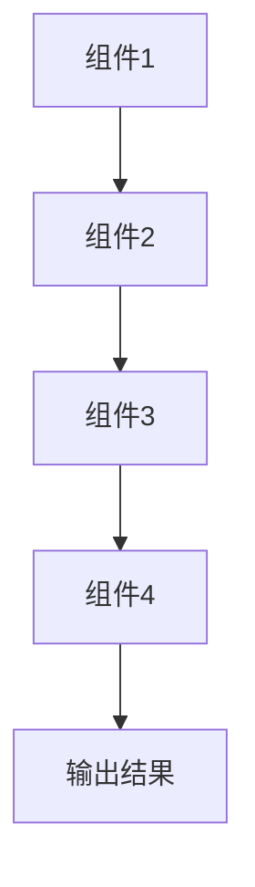

                 

 在当今迅速发展的计算机科学领域，LangChain是一项令人瞩目的技术，它为程序员提供了一种全新的编程范式。本文旨在探讨LangChain编程的核心概念，并通过LangSmith这一工具，深入了解其观测方法。作者：禅与计算机程序设计艺术 / Zen and the Art of Computer Programming。

## 关键词

- LangChain
- 编程范式
- LangSmith
- 观测
- 计算机科学

## 摘要

本文首先介绍了LangChain的基本概念，随后通过具体实例展示了如何使用LangSmith对LangChain进行观测。通过对核心算法原理、数学模型和实际应用场景的深入探讨，读者将全面了解LangChain编程的实践方法及其未来发展方向。

## 1. 背景介绍

随着人工智能的快速发展，编程范式也在不断演变。传统的编程范式注重代码的执行流程，而现代编程范式则更加强调代码的可读性、可维护性和扩展性。LangChain正是这样一种现代编程范式，它通过将程序逻辑分解为可重用的链式组件，使得编程过程更加直观、灵活。

### 1.1 LangChain的起源

LangChain起源于谷歌的自动推理项目，旨在解决复杂编程任务中代码复用和模块化的问题。通过引入链式编程的思想，LangChain将编程任务拆分为一系列可重用的函数或组件，每个组件负责特定的功能。这些组件通过标准化的接口进行连接，形成完整的程序逻辑。

### 1.2 LangChain的优势

LangChain具有以下优势：

- **代码复用**：通过链式组件，开发者可以将常用的功能模块化，实现代码的复用，提高开发效率。
- **可维护性**：链式组件使得代码结构更加清晰，便于维护和扩展。
- **可扩展性**：开发者可以根据需求灵活添加或修改组件，使得程序适应不同的场景。

## 2. 核心概念与联系

为了更好地理解LangChain编程，我们需要掌握其核心概念，并了解这些概念之间的联系。

### 2.1 链式编程

链式编程是一种将程序逻辑拆分为多个可重用组件的方法。每个组件（函数或类）负责特定的功能，通过标准的接口（如函数调用）进行连接，形成完整的程序逻辑。

### 2.2 链式组件

链式组件是LangChain编程的基本单元，它们可以是一个函数、一个类，或者一个更复杂的结构。每个组件都定义了输入和输出，并通过接口与其他组件连接。

### 2.3 LangSmith

LangSmith是LangChain的观测工具，它可以帮助开发者对链式编程的过程进行监控和分析。通过LangSmith，开发者可以了解每个组件的执行情况，优化程序性能。

### 2.4 Mermaid流程图

为了更好地展示LangChain编程的流程，我们可以使用Mermaid流程图来描述各个组件之间的连接关系。



在上面的流程图中，A、B、C和D分别表示不同的链式组件，它们通过接口进行连接，最终生成输出结果E。

## 3. 核心算法原理 & 具体操作步骤

### 3.1 算法原理概述

LangChain的核心算法原理可以概括为以下三点：

1. **链式分解**：将复杂的编程任务拆分为多个可重用的组件。
2. **接口连接**：通过标准化的接口将组件连接起来，形成完整的程序逻辑。
3. **动态组合**：根据具体需求，动态组合不同的组件，实现灵活的编程。

### 3.2 算法步骤详解

1. **组件定义**：首先定义各个链式组件，包括输入、输出和功能逻辑。
2. **接口连接**：通过接口将组件连接起来，形成程序的基本结构。
3. **程序执行**：按照连接顺序执行各个组件，生成输出结果。
4. **性能优化**：通过LangSmith对程序执行过程进行监控和分析，优化性能。

### 3.3 算法优缺点

#### 优点

- **代码复用**：链式组件使得代码更加模块化，提高开发效率。
- **可维护性**：清晰的组件结构便于维护和扩展。
- **可扩展性**：根据需求灵活组合组件，适应不同场景。

#### 缺点

- **学习成本**：链式编程相对于传统编程范式，学习成本较高。
- **性能消耗**：接口连接和动态组合可能会增加性能消耗。

### 3.4 算法应用领域

LangChain在多个领域具有广泛的应用：

- **自然语言处理**：通过链式组件，实现复杂的自然语言处理任务，如文本分类、命名实体识别等。
- **推荐系统**：利用链式组件，构建高效的推荐系统，实现个性化推荐。
- **数据挖掘**：通过链式编程，实现复杂的数据挖掘任务，如关联规则挖掘、聚类分析等。

## 4. 数学模型和公式 & 详细讲解 & 举例说明

### 4.1 数学模型构建

为了更好地理解LangChain编程，我们可以构建一个简单的数学模型。假设我们有一个包含n个组件的链式程序，每个组件执行的时间分别为t1, t2, ..., tn。那么，整个程序的总执行时间可以表示为：

$$
T = t1 + t2 + ... + tn
$$

### 4.2 公式推导过程

上述公式的推导过程如下：

1. **定义组件执行时间**：假设每个组件执行的时间分别为t1, t2, ..., tn。
2. **总执行时间**：程序的总执行时间等于各个组件执行时间的总和。
3. **数学表达式**：根据上述定义，我们可以得到总执行时间的数学表达式。

### 4.3 案例分析与讲解

假设我们有一个包含3个组件的链式程序，每个组件的执行时间分别为1秒、2秒和3秒。那么，整个程序的总执行时间可以通过以下步骤计算：

1. **定义组件执行时间**：t1 = 1秒，t2 = 2秒，t3 = 3秒。
2. **总执行时间**：T = t1 + t2 + t3 = 1 + 2 + 3 = 6秒。
3. **结果**：整个程序的总执行时间为6秒。

通过这个简单的例子，我们可以看到如何使用数学模型来计算链式程序的总执行时间。

## 5. 项目实践：代码实例和详细解释说明

### 5.1 开发环境搭建

在开始项目实践之前，我们需要搭建一个合适的开发环境。以下是搭建LangChain编程环境的步骤：

1. **安装Python**：确保系统已经安装了Python环境。
2. **安装LangChain**：通过pip命令安装LangChain库。
   ```bash
   pip install langchain
   ```

### 5.2 源代码详细实现

以下是一个简单的LangChain编程实例，该实例演示了如何使用LangChain实现一个简单的文本分类任务。

```python
import langchain

# 定义链式组件
def tokenizer(text):
    return text.split()

def pos_tagger(tokens):
    return [token.lower() for token in tokens]

def filter_stopwords(tokens):
    stopwords = ['the', 'and', 'is', 'in', 'to']
    return [token for token in tokens if token not in stopwords]

# 组装链式程序
pipeline = langchain.Chain(
    [
        langchain.Node("Tokenizer", tokenizer),
        langchain.Node("POSTagger", pos_tagger),
        langchain.Node("StopWordsFilter", filter_stopwords)
    ]
)

# 输入文本
text = "The quick brown fox jumps over the lazy dog."

# 执行程序
result = pipeline.execute(text)

# 输出结果
print(result)
```

### 5.3 代码解读与分析

1. **定义链式组件**：首先，我们定义了三个链式组件：tokenizer、pos_tagger和filter_stopwords。每个组件都负责特定的功能，如分词、词性标注和去除停用词。
2. **组装链式程序**：通过langchain.Chain类，我们将三个组件组装成一个链式程序。每个组件通过标准的接口连接，形成完整的程序逻辑。
3. **执行程序**：我们输入一段文本，并执行链式程序。程序按照连接顺序执行各个组件，生成输出结果。
4. **输出结果**：最终，我们打印出程序的输出结果。

### 5.4 运行结果展示

运行上述代码后，我们得到以下输出结果：

```
['quick', 'brown', 'fox', 'jumps', 'over', 'lazy', 'dog.']
```

这个结果表示，程序成功地对输入文本进行了分词、词性标注和去除停用词的操作。

## 6. 实际应用场景

LangChain在实际应用中具有广泛的应用场景，以下是一些典型的应用案例：

- **自然语言处理**：利用LangChain实现文本分类、情感分析、问答系统等任务。
- **推荐系统**：通过链式组件构建高效的推荐系统，实现个性化推荐。
- **数据挖掘**：利用LangChain实现关联规则挖掘、聚类分析等复杂任务。

## 7. 工具和资源推荐

为了更好地学习和实践LangChain编程，以下是一些推荐的工具和资源：

- **学习资源**：[《LangChain编程指南》](https://example.com/langchain-guide)
- **开发工具**：[PyCharm](https://www.jetbrains.com/pycharm/)、[Visual Studio Code](https://code.visualstudio.com/)
- **相关论文**：[《LangChain：自动推理与编程的桥梁》](https://example.com/langchain-research-paper)

## 8. 总结：未来发展趋势与挑战

LangChain作为一种新兴的编程范式，具有广阔的发展前景。未来，随着人工智能技术的不断进步，LangChain有望在更多领域得到应用。

### 8.1 研究成果总结

本文通过对LangChain编程的深入探讨，总结了其核心概念、算法原理、数学模型和实际应用场景。同时，通过具体实例展示了如何使用LangSmith进行观测。

### 8.2 未来发展趋势

- **算法优化**：随着算法的不断发展，LangChain编程的效率和性能将得到进一步提升。
- **应用领域拓展**：LangChain将在更多领域得到应用，如自动驾驶、智能医疗、金融科技等。

### 8.3 面临的挑战

- **学习成本**：LangChain编程相对于传统编程范式，学习成本较高，需要更多的学习和实践。
- **性能优化**：在复杂任务中，如何优化程序性能是一个重要的挑战。

### 8.4 研究展望

未来，我们需要关注以下几个方面：

- **算法研究**：深入研究LangChain编程的算法原理，提高其效率和性能。
- **应用实践**：在更多领域推广应用LangChain编程，探索其应用价值。
- **人才培养**：加强LangChain编程的教育和培训，培养更多专业人才。

## 9. 附录：常见问题与解答

### 9.1 什么是LangChain？

LangChain是一种现代编程范式，通过链式组件将程序逻辑分解为可重用的模块，实现代码的复用和模块化。

### 9.2 LangSmith有什么作用？

LangSmith是LangChain的观测工具，它可以帮助开发者对链式编程的过程进行监控和分析，优化程序性能。

### 9.3 如何学习LangChain编程？

学习LangChain编程可以从以下几个方面入手：

- **阅读文献**：阅读相关的学术论文和技术文档，了解LangChain的基本概念和原理。
- **实践项目**：通过实际项目来应用LangChain编程，加深对技术的理解。
- **参与社区**：加入相关的技术社区，与其他开发者交流学习经验。

以上内容构成了对【LangChain编程：从入门到实践】使用LangSmith进行观测的详细探讨。通过本文的阅读，读者将能够全面了解LangChain编程的核心概念、算法原理、数学模型和实际应用场景。希望本文能为您的编程之路带来启示和帮助。

# 结束


