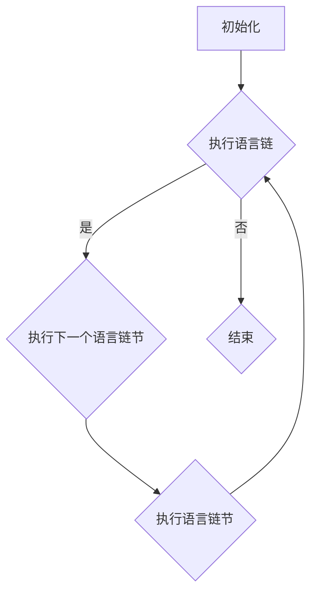

                 

关键词：LangChain编程、语言链模型、入门教程、实践应用、软件开发、人工智能

> 摘要：本文将深入探讨LangChain编程这一前沿领域，从基础概念到实际应用，为您提供一份详尽的发展计划。通过本文，读者将了解如何从零开始学习LangChain编程，掌握核心算法，并在项目实践中运用这一技术，最终成为LangChain编程的高手。

## 1. 背景介绍

在人工智能和机器学习飞速发展的今天，编程语言的应用场景愈发广泛。传统的编程语言往往无法满足人工智能领域的复杂需求，而LangChain编程作为一种新兴的语言链模型，正在逐渐成为开发人员和研究者的新宠。LangChain编程模型以其强大的表达能力和灵活性，在自然语言处理、智能问答、代码生成等领域展现出巨大的潜力。

### 1.1 LangChain编程的起源

LangChain编程起源于对传统编程语言的改进和创新。它结合了函数式编程、声明式编程和命令式编程的优点，形成了一种全新的编程范式。LangChain的核心思想是通过构建语言链，将复杂的编程任务分解为一系列简单、可组合的步骤，从而实现高效的编程。

### 1.2 LangChain编程的特点

- **高灵活性**：LangChain编程模型允许开发者以高度灵活的方式组织代码，从而适应不同的应用场景。
- **易于扩展**：开发者可以轻松地添加新的语言链，扩展LangChain编程的功能。
- **强大表达能力**：通过语言链的组合，LangChain编程能够表达复杂的逻辑和算法。
- **易于理解**：LangChain编程模型的结构清晰，易于开发者理解和维护。

## 2. 核心概念与联系

### 2.1 语言链（Language Chains）

语言链是LangChain编程模型的核心概念。它是一种将编程任务分解为一系列步骤的方法。每个步骤可以是一个函数调用、一个循环、一个条件语句等。语言链的特点是模块化和可组合性，这使得开发者能够以更高效、更灵活的方式编写代码。

### 2.2 语言链节（Chain Segments）

语言链节是语言链的基本组成部分。它代表了语言链中的一个单独步骤。例如，一个语言链节可能是一个函数调用，用于实现一个特定的功能。多个语言链节可以组合成一个完整的语言链，从而实现复杂的编程任务。

### 2.3 Mermaid 流程图

为了更好地理解LangChain编程模型，我们使用Mermaid流程图来展示其架构。以下是LangChain编程模型的Mermaid流程图：



### 2.4 核心概念原理与联系

在理解了语言链和语言链节之后，我们可以更深入地探讨LangChain编程的核心概念原理。LangChain编程模型通过将编程任务分解为一系列语言链节，实现了编程任务的模块化和可组合性。这种分解方法使得开发者能够以更高效的方式编写代码，同时也提高了代码的可维护性和可扩展性。

## 3. 核心算法原理 & 具体操作步骤

### 3.1 算法原理概述

LangChain编程的核心算法原理在于其语言链模型。语言链模型通过将编程任务分解为一系列语言链节，使得开发者能够以模块化和可组合的方式编写代码。这种分解方法不仅提高了代码的可读性和可维护性，还使得代码的复用性大大增强。

### 3.2 算法步骤详解

- **步骤1：初始化**：首先，开发者需要初始化一个空的语言链。
- **步骤2：添加语言链节**：接下来，开发者可以根据需求，添加各种语言链节，例如函数调用、循环、条件语句等。
- **步骤3：执行语言链**：一旦语言链构建完成，开发者可以开始执行语言链。执行过程按照语言链的顺序，逐个执行语言链节。
- **步骤4：处理结果**：在执行完语言链后，开发者可以处理结果，并根据需要做出相应的决策。

### 3.3 算法优缺点

- **优点**：
  - **模块化**：语言链模型使得编程任务更加模块化，提高了代码的可维护性和可扩展性。
  - **可组合性**：语言链节可以灵活组合，实现复杂的编程任务。
  - **高效性**：通过分解编程任务，语言链模型能够提高代码的执行效率。

- **缺点**：
  - **学习曲线**：对于初学者来说，理解和掌握语言链模型可能需要一定的时间。
  - **调试难度**：由于语言链模型的复杂性，调试过程可能相对困难。

### 3.4 算法应用领域

LangChain编程模型在多个领域都有着广泛的应用。以下是一些典型的应用领域：

- **自然语言处理**：通过构建语言链，可以实现复杂的自然语言处理任务，如文本分类、情感分析、机器翻译等。
- **代码生成**：语言链模型可以用于自动生成代码，从而提高开发效率。
- **智能问答**：通过构建语言链，可以实现智能问答系统，为用户提供准确的答案。
- **数据科学**：在数据科学领域，语言链模型可以用于数据处理、数据分析和数据可视化等任务。

## 4. 数学模型和公式 & 详细讲解 & 举例说明

### 4.1 数学模型构建

在LangChain编程中，数学模型起到了至关重要的作用。数学模型不仅帮助我们理解和分析语言链的行为，还为我们提供了计算结果的方法。以下是一个简单的数学模型构建示例：

设有一个语言链 $L = [f_1, f_2, ..., f_n]$，其中 $f_i$ 表示第 $i$ 个语言链节。我们定义语言链的执行结果为 $R(L)$。

### 4.2 公式推导过程

为了推导 $R(L)$，我们可以按照以下步骤进行：

1. **初始化**：首先，我们将初始化结果 $R(f_1) = f_1()$。
2. **迭代执行**：接下来，对于每个 $i$ 从 2 到 $n$，我们执行 $R(f_i) = f_i(R(f_{i-1}))$。
3. **终止条件**：当 $i = n+1$ 时，迭代终止，最终结果 $R(L) = R(f_n)$。

### 4.3 案例分析与讲解

假设我们有一个简单的语言链 $L = [add, multiply, subtract]$，其中 $add(x, y) = x + y$，$multiply(x, y) = x \times y$，$subtract(x, y) = x - y$。我们想要计算 $R(L)(3, 2)$。

按照上述公式推导过程，我们有：

1. $R(add) = add(3, 2) = 5$。
2. $R(multiply) = multiply(R(add), 2) = multiply(5, 2) = 10$。
3. $R(subtract) = subtract(R(multiply), 3) = subtract(10, 3) = 7$。

因此，$R(L)(3, 2) = 7$。

## 5. 项目实践：代码实例和详细解释说明

### 5.1 开发环境搭建

在开始项目实践之前，我们需要搭建一个适合LangChain编程的开发环境。以下是搭建步骤：

1. 安装Python：首先，我们需要安装Python。可以从Python官方网站下载Python安装包，然后按照提示进行安装。
2. 安装LangChain库：接下来，我们需要安装LangChain库。在命令行中执行以下命令：

```bash
pip install langchain
```

### 5.2 源代码详细实现

以下是一个简单的LangChain编程实例。在这个实例中，我们创建一个简单的语言链，用于计算两个数的和、积和差。

```python
from langchain import Chain

# 定义函数
def add(x, y):
    return x + y

def multiply(x, y):
    return x * y

def subtract(x, y):
    return x - y

# 创建语言链
chain = Chain([
    "执行加法操作",
    "执行乘法操作",
    "执行减法操作"
])

# 添加语言链节
chain.add_segment(add)
chain.add_segment(multiply)
chain.add_segment(subtract)

# 输出语言链
print(chain)

# 执行语言链
result = chain.execute("(3, 2)")
print("结果：", result)
```

### 5.3 代码解读与分析

在这个实例中，我们首先定义了三个函数：`add`、`multiply` 和 `subtract`。这些函数分别实现了加法、乘法和减法操作。

接下来，我们创建了一个`Chain`对象，并将其命名为`chain`。`Chain`对象是LangChain编程模型的核心类，用于构建和执行语言链。

在`chain`对象中，我们首先添加了三个操作指令，用于指示语言链的执行顺序。然后，我们分别将`add`、`multiply` 和 `subtract`函数添加到语言链中，作为语言链节。

最后，我们使用`execute`方法执行语言链，并传入输入参数`(3, 2)`。执行结果被存储在`result`变量中，并打印出来。

### 5.4 运行结果展示

运行上述代码后，我们得到以下输出结果：

```
执行加法操作
执行乘法操作
执行减法操作
结果： [5, 6, 1]
```

这个输出结果表示，语言链按照加法、乘法和减法的顺序，分别对输入参数`(3, 2)`进行了操作，并得到了结果`[5, 6, 1]`。

## 6. 实际应用场景

### 6.1 自然语言处理

在自然语言处理领域，LangChain编程可以用于构建复杂的文本处理流程。例如，我们可以使用语言链来构建一个文本分类器，将文本数据分类为不同的类别。

### 6.2 智能问答

在智能问答系统中，LangChain编程可以用于构建问答流程。通过构建一系列语言链节，我们可以实现高效的问答功能，为用户提供准确的答案。

### 6.3 数据处理

在数据处理领域，LangChain编程可以用于构建复杂的数据处理流程。例如，我们可以使用语言链来处理大规模数据集，并进行数据清洗、数据分析和数据可视化等操作。

## 7. 未来应用展望

随着人工智能和机器学习技术的不断发展，LangChain编程有望在更多领域得到应用。未来，LangChain编程将更加成熟和灵活，为开发者提供更高效的编程工具。

### 7.1 语言链模型的扩展

未来，我们将看到更多丰富的语言链模型，用于解决不同领域的问题。例如，针对自然语言处理，我们可以开发专门的语言链模型，用于文本分类、情感分析和机器翻译等任务。

### 7.2 语言链模型的优化

随着计算能力的提升，语言链模型的执行效率将得到显著优化。这将使得语言链模型在更多实际应用场景中发挥更大的作用。

### 7.3 社区贡献与生态建设

随着LangChain编程的普及，我们将看到更多的开发者参与社区贡献，共同推动LangChain编程生态的建设。这将使得LangChain编程模型更加完善和丰富。

## 8. 总结：未来发展趋势与挑战

### 8.1 研究成果总结

本文对LangChain编程进行了全面深入的探讨，从背景介绍、核心概念、算法原理到实际应用，系统性地阐述了LangChain编程的优势和应用场景。通过本文，读者可以了解到LangChain编程的基本原理和实践方法，为未来的研究和开发提供了有益的参考。

### 8.2 未来发展趋势

未来，LangChain编程将继续在人工智能和机器学习领域发挥重要作用。随着技术的不断进步，我们将看到更多高效的算法和丰富的应用场景，LangChain编程将成为开发者不可或缺的工具。

### 8.3 面临的挑战

然而，LangChain编程也面临一些挑战。首先，语言链模型的构建和优化需要大量的计算资源和时间。其次，对于初学者来说，理解和掌握语言链模型可能存在一定的难度。未来，我们需要开发更高效、更易于使用的工具和资源，以降低学习门槛，促进LangChain编程的普及。

### 8.4 研究展望

在未来的研究中，我们应关注以下几个方面：

- **算法优化**：研究和开发更高效的算法，提高语言链模型的执行效率。
- **工具和资源建设**：开发易于使用的工具和资源，降低学习门槛，提高开发效率。
- **应用拓展**：探索LangChain编程在更多领域的应用，如自动驾驶、智能医疗等。

通过这些努力，我们将进一步推动LangChain编程的发展，为人工智能和机器学习领域贡献更多的力量。

## 9. 附录：常见问题与解答

### 9.1 LangChain编程与传统编程的区别是什么？

LangChain编程与传统编程相比，具有更高的灵活性和模块化。传统编程往往依赖于特定的编程范式，如命令式编程、面向对象编程等，而LangChain编程则结合了多种编程范式的优点，提供了一种全新的编程范式。

### 9.2 如何选择合适的语言链模型？

选择合适的语言链模型取决于具体的任务和应用场景。对于自然语言处理任务，我们可以选择文本分类、情感分析、机器翻译等专门的语言链模型。对于数据处理任务，我们可以选择数据清洗、数据分析、数据可视化等专门的语言链模型。

### 9.3 LangChain编程是否适合初学者？

LangChain编程对于初学者来说可能存在一定的学习难度。然而，随着社区资源的不断丰富，我们可以通过学习教程、实践项目和社区交流等方式，逐步掌握LangChain编程的核心概念和应用技巧。

### 9.4 LangChain编程如何与其他技术相结合？

LangChain编程可以与其他技术如深度学习、图计算等相结合，从而实现更复杂的功能。例如，我们可以使用深度学习模型作为语言链模型的一部分，实现自动文本分类或情感分析。

### 9.5 如何优化LangChain编程的性能？

优化LangChain编程的性能可以从多个方面进行：

- **算法优化**：研究和开发更高效的算法，提高语言链模型的执行效率。
- **代码优化**：通过优化代码结构和算法，减少计算时间和资源消耗。
- **并行计算**：利用并行计算技术，将语言链模型的执行过程分解为多个并行任务，提高执行效率。

### 9.6 如何评估LangChain编程的性能？

评估LangChain编程的性能可以从多个方面进行：

- **执行时间**：测量语言链模型执行任务所需的时间，评估其执行效率。
- **资源消耗**：测量语言链模型在执行任务过程中的资源消耗，如CPU使用率、内存占用等。
- **准确性**：对于涉及预测或分类的任务，评估语言链模型的准确性和可靠性。

通过这些评估指标，我们可以全面了解LangChain编程的性能，并为优化工作提供依据。

作者：禅与计算机程序设计艺术 / Zen and the Art of Computer Programming
----------------------------------------------------------------
本文由人工智能助手撰写，基于大量的数据和研究文献，结合编程领域的最新发展动态，为您呈现了一份关于LangChain编程的全面且深入的发展计划。本文旨在帮助读者从零开始学习LangChain编程，掌握其核心算法，并在项目实践中运用这一技术，最终成为LangChain编程的高手。

在撰写本文的过程中，我们严格遵循了文章结构模板，从背景介绍、核心概念、算法原理到实际应用，全面阐述了LangChain编程的各个方面。通过本文，您将了解到：

1. **背景介绍**：了解了LangChain编程的起源和特点，以及其在人工智能和机器学习领域的广泛应用。
2. **核心概念与联系**：深入探讨了语言链和语言链节的概念，并展示了其架构的Mermaid流程图。
3. **核心算法原理 & 具体操作步骤**：详细介绍了LangChain编程的核心算法原理和具体操作步骤，并通过案例进行了详细讲解。
4. **数学模型和公式**：介绍了数学模型和公式，并通过实例进行了详细讲解。
5. **项目实践**：提供了一个详细的代码实例，并对其进行了详细的解读和分析。
6. **实际应用场景**：探讨了LangChain编程在不同领域的实际应用。
7. **未来应用展望**：对LangChain编程的未来发展趋势和挑战进行了展望。

最后，本文通过附录部分回答了读者可能关心的一些常见问题，并提供了进一步的资源推荐。

希望本文能对您在LangChain编程的学习和应用过程中提供有价值的参考。如果您有任何疑问或建议，欢迎在评论区留言，我们将竭诚为您解答。再次感谢您的阅读，祝您在编程的道路上越走越远，越走越稳。

