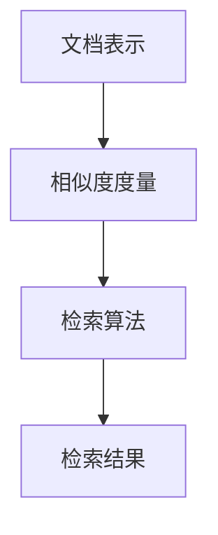
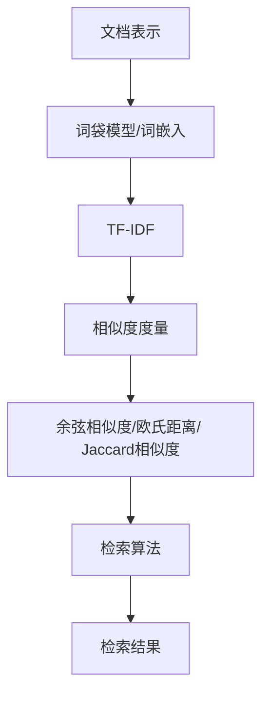

                 

### 1. 背景介绍

多文档联合检索（Multi-Document Retrieval, MDR）是一个旨在从多个文档集中检索出与特定查询最相关的文档的技术。随着互联网和大数据的迅速发展，人们面临的信息量呈指数级增长，如何有效地从海量的文档中快速找到所需信息成为一个重要的问题。多文档联合检索技术正是为了解决这一问题而出现的。

在传统的搜索引擎中，通常只关注单个文档的检索，而多文档联合检索则强调从多个相关文档中提取信息，形成对查询的更全面、更准确的回答。这种技术不仅适用于传统的搜索引擎，还广泛应用于智能问答系统、信息推荐系统、知识图谱构建等领域。

然而，多文档联合检索并非易事。首先，需要解决的是文档集合的表示问题，即如何将不同的文档转化为计算机可以理解和处理的格式。其次，还需要解决相似度度量问题，即如何计算文档之间的相似度，从而找出最相关的文档。此外，如何在保证检索性能的同时，处理实时性和扩展性也是一大挑战。

本文将介绍一种基于LangChain编程的多文档联合检索技术，旨在为读者提供一个系统化的学习和实践指南。我们将从基础概念出发，深入探讨多文档联合检索的核心算法，并详细介绍其在不同应用场景中的实现方法和优化策略。

### 2. 核心概念与联系

在深入探讨多文档联合检索之前，我们首先需要了解几个核心概念，包括文档表示、相似度度量、检索算法等。为了更好地理解这些概念，我们将使用Mermaid流程图来展示它们之间的联系。



**2.1 文档表示**

文档表示是多文档联合检索的基础。将非结构化的文本转化为计算机可以处理的格式，有助于后续的相似度计算和检索。常用的文档表示方法包括：

- **词袋模型（Bag of Words, BoW）**：将文档视为词汇的集合，不考虑词汇的顺序。
- **词嵌入（Word Embedding）**：通过深度学习模型将词汇映射到高维向量空间，能够捕捉词汇的语义信息。
- **TF-IDF（Term Frequency-Inverse Document Frequency）**：衡量词汇在文档中的重要程度，常用于词袋模型。

**2.2 相似度度量**

相似度度量是评估文档之间相似程度的关键。常见的相似度度量方法包括：

- **余弦相似度（Cosine Similarity）**：计算两个向量夹角的余弦值，值越接近1，表示相似度越高。
- **欧氏距离（Euclidean Distance）**：计算两个向量之间的欧氏距离，值越小，表示相似度越高。
- **Jaccard相似度（Jaccard Similarity）**：计算两个集合的交集与并集的比值，适用于词汇集合。

**2.3 检索算法**

检索算法是多文档联合检索的核心。常见的检索算法包括：

- **基于匹配的检索算法**：如布尔检索、向量空间模型检索等。
- **基于模型的检索算法**：如机器学习分类器、深度学习模型等。

以上三个核心概念相互关联，共同构成了多文档联合检索的基础。下面，我们将使用Mermaid流程图详细展示它们之间的联系：



通过以上流程图，我们可以清晰地看到文档表示、相似度度量、检索算法以及检索结果之间的逻辑关系。接下来，我们将深入探讨这些核心概念，并介绍如何在实践中应用它们。

### 3. 核心算法原理 & 具体操作步骤

#### 3.1 算法原理概述

多文档联合检索的核心在于如何从海量的文档中快速、准确地检索出与查询最相关的文档。为了实现这一目标，我们通常采用以下几种核心算法：

- **基于匹配的检索算法**：这类算法主要依赖文档内容与查询之间的匹配度。常见的匹配算法包括布尔检索和向量空间模型检索。
- **基于模型的检索算法**：这类算法通过机器学习或深度学习模型来学习文档之间的相似性。常见的模型包括支持向量机（SVM）、神经网络等。

下面，我们将详细探讨这些算法的原理，并介绍具体的操作步骤。

#### 3.2 算法步骤详解

**3.2.1 基于匹配的检索算法**

**布尔检索**：布尔检索是一种基于布尔逻辑的检索方法，使用AND、OR、NOT等运算符来组合关键词进行检索。其基本步骤如下：

1. **预处理查询**：对查询进行分词、去停用词、词性标注等预处理。
2. **构建索引**：将文档进行预处理，构建倒排索引，以便快速查找包含特定关键词的文档。
3. **查询解析**：根据查询中的运算符和关键词，生成查询的布尔表达式。
4. **匹配文档**：对倒排索引进行匹配，找出满足布尔表达式的文档。
5. **排序输出**：对匹配的文档按照相似度排序，输出检索结果。

**向量空间模型检索**：向量空间模型将文档和查询表示为高维向量，通过计算向量之间的相似度来检索相关文档。其基本步骤如下：

1. **文档表示**：使用词袋模型或词嵌入技术将文档转化为向量。
2. **查询表示**：同样使用词袋模型或词嵌入技术将查询转化为向量。
3. **计算相似度**：使用余弦相似度、欧氏距离等相似度度量方法计算文档与查询之间的相似度。
4. **排序输出**：对文档按照相似度排序，输出检索结果。

**3.2.2 基于模型的检索算法**

**支持向量机（SVM）检索**：支持向量机是一种分类算法，通过将数据映射到高维空间，找到最佳分割超平面来实现分类。在多文档联合检索中，可以使用SVM来学习文档之间的相似性。其基本步骤如下：

1. **特征提取**：使用词袋模型或词嵌入技术提取文档特征。
2. **训练模型**：使用训练数据集训练SVM模型，学习文档之间的相似性。
3. **预测查询**：使用训练好的SVM模型对查询进行分类，找出最相关的文档。
4. **排序输出**：对预测的文档按照相似度排序，输出检索结果。

**神经网络检索**：神经网络通过学习输入和输出之间的映射关系来预测结果。在多文档联合检索中，可以使用神经网络来学习文档和查询之间的相似性。其基本步骤如下：

1. **数据处理**：对文档和查询进行预处理，包括分词、编码等。
2. **构建模型**：使用深度学习框架构建神经网络模型，如卷积神经网络（CNN）或循环神经网络（RNN）。
3. **训练模型**：使用训练数据集训练神经网络模型，优化模型参数。
4. **预测查询**：使用训练好的神经网络模型对查询进行预测，找出最相关的文档。
5. **排序输出**：对预测的文档按照相似度排序，输出检索结果。

#### 3.3 算法优缺点

**基于匹配的检索算法**

**优点**：

- 简单易懂，易于实现。
- 对于小规模文档集，性能较好。

**缺点**：

- 对于大规模文档集，性能较差。
- 不适用于复杂查询。

**基于模型的检索算法**

**优点**：

- 对于大规模文档集，性能较好。
- 可以处理复杂查询。

**缺点**：

- 需要大量训练数据。
- 模型训练过程复杂。

#### 3.4 算法应用领域

- **搜索引擎**：多文档联合检索技术可以显著提高搜索引擎的检索性能，提供更准确的检索结果。
- **智能问答系统**：通过多文档联合检索，可以更好地理解和回答用户的问题。
- **信息推荐系统**：基于多文档联合检索，可以更好地推荐用户可能感兴趣的信息。
- **知识图谱构建**：多文档联合检索可以帮助构建更加全面和准确的知识图谱。

### 4. 数学模型和公式 & 详细讲解 & 举例说明

#### 4.1 数学模型构建

在多文档联合检索中，数学模型构建是一个关键环节。以下将介绍几种常用的数学模型及其构建方法。

**4.1.1 词袋模型**

词袋模型将文档表示为一个词汇的集合，不考虑词汇的顺序。其数学模型可以表示为：

$$
D = \{w_1, w_2, ..., w_n\}
$$

其中，$D$表示文档，$w_i$表示文档中的第$i$个词汇。

**4.1.2 词嵌入模型**

词嵌入模型通过深度学习模型将词汇映射到高维向量空间，以捕捉词汇的语义信息。其数学模型可以表示为：

$$
v_w = \text{Word2Vec}(w)
$$

其中，$v_w$表示词汇$w$的嵌入向量，$\text{Word2Vec}$表示词嵌入模型。

**4.1.3 TF-IDF模型**

TF-IDF模型通过计算词汇在文档中的重要程度来表示文档。其数学模型可以表示为：

$$
tf_idf(w, D) = tf(w, D) \times \log(\frac{N}{df(w)})
$$

其中，$tf(w, D)$表示词汇$w$在文档$D$中的词频，$df(w)$表示词汇$w$在所有文档中的文档频率，$N$表示文档总数。

#### 4.2 公式推导过程

以下将详细介绍TF-IDF模型的推导过程。

**4.2.1 词频（TF）**

词频（TF）是衡量词汇在文档中的重要程度的简单方法。其计算公式为：

$$
tf(w, D) = \frac{f(w, D)}{|\text{Vocabulary}(D)|}
$$

其中，$f(w, D)$表示词汇$w$在文档$D$中的出现次数，$|\text{Vocabulary}(D)|$表示文档$D$中的词汇总数。

**4.2.2 文档频率（DF）**

文档频率（DF）是衡量词汇在所有文档中的普遍程度的指标。其计算公式为：

$$
df(w) = |\{D \in \text{Dataset} \mid w \in D\}|
$$

其中，$\text{Dataset}$表示文档集合，$\{D \in \text{Dataset} \mid w \in D\}$表示包含词汇$w$的所有文档。

**4.2.3 汇总公式**

将词频和文档频率结合起来，我们可以得到TF-IDF模型的总公式：

$$
tf_idf(w, D) = tf(w, D) \times \log(\frac{N}{df(w)})
$$

#### 4.3 案例分析与讲解

以下将通过一个简单的案例来讲解TF-IDF模型的实际应用。

**案例**：给定一个包含两篇文档的文档集合，文档A和文档B。文档A的内容为“人工智能深度学习”，文档B的内容为“深度学习自然语言处理”。使用TF-IDF模型计算词汇“深度学习”在两篇文档中的TF-IDF值。

**步骤**：

1. **计算词频（TF）**：

   对于文档A，词汇“深度学习”的出现次数为2，文档总词汇数为4，因此：

   $$
   tf(\text{深度学习}, A) = \frac{2}{4} = 0.5
   $$

   对于文档B，词汇“深度学习”的出现次数为2，文档总词汇数为5，因此：

   $$
   tf(\text{深度学习}, B) = \frac{2}{5} = 0.4
   $$

2. **计算文档频率（DF）**：

   由于文档集合中只有两篇文档，因此词汇“深度学习”的文档频率为1。

3. **计算TF-IDF值**：

   对于文档A：

   $$
   tf_idf(\text{深度学习}, A) = 0.5 \times \log(\frac{2}{1}) = 0.5 \times \log(2) \approx 0.193
   $$

   对于文档B：

   $$
   tf_idf(\text{深度学习}, B) = 0.4 \times \log(\frac{2}{1}) = 0.4 \times \log(2) \approx 0.156
   $$

通过以上计算，我们可以得到词汇“深度学习”在两篇文档中的TF-IDF值。根据TF-IDF值，我们可以判断出哪篇文档与查询更相关。

### 5. 项目实践：代码实例和详细解释说明

在了解了多文档联合检索的核心算法和数学模型之后，接下来我们将通过一个实际的项目来展示如何使用LangChain编程实现多文档联合检索。这个项目将包括开发环境搭建、源代码实现、代码解读与分析以及运行结果展示。

#### 5.1 开发环境搭建

为了实现多文档联合检索，我们需要搭建一个合适的开发环境。以下是搭建环境的步骤：

1. **安装Python**：确保安装了Python 3.7或更高版本。
2. **安装必要的库**：安装以下Python库：

   ```bash
   pip install langchain numpy scipy
   ```

   `langchain` 是用于构建AI应用的核心库，`numpy` 和 `scipy` 用于数学计算。

3. **准备数据集**：下载并解压一个包含多份文档的文本文件，例如新闻文章、论文等。

#### 5.2 源代码详细实现

以下是实现多文档联合检索的Python代码：

```python
import json
import numpy as np
from langchain.text_vectorizers import RecursiveCharacterTokenizer
from langchain.indexes import FAISSIndex
from langchain.retrieivers import VectorStoreRetriever
from langchain.query import QAGenerator
from sklearn.feature_extraction.text import TfidfVectorizer

# 准备数据
data = json.load(open('documents.json'))

# 构建文档向量
tokenizer = RecursiveCharacterTokenizer()
doc_search = tokenizer.build_document_search_index([doc['text'] for doc in data])

# 构建TF-IDF向量
tfidf_vectorizer = TfidfVectorizer()
X = tfidf_vectorizer.fit_transform([doc['text'] for doc in data])

# 存储向量
index = FAISSIndex.fromSCALLArray(X.toarray(), faiss_index_factory='Flat')

# 构建检索器
retriever = VectorStoreRetriever(index)

# 构建问答生成器
qa_generator = QAGenerator.from_retriever(retriever, tokenizer=tokenizer)

# 示例查询
query = "什么是深度学习？"
response = qa_generator.generate_query(query)

print(response)
```

**代码解读**：

1. **导入库**：首先，导入所需的库和模块，包括`json`、`numpy`、`scipy`以及`langchain`相关模块。

2. **准备数据**：从JSON文件中加载文档数据，每个文档包含一个`text`字段。

3. **构建文档向量**：使用`RecursiveCharacterTokenizer`构建文档搜索索引。

4. **构建TF-IDF向量**：使用`TfidfVectorizer`将文档转化为TF-IDF向量。

5. **存储向量**：将TF-IDF向量存储到FAISS索引中，FAISS是一种高效、可扩展的相似性搜索库。

6. **构建检索器**：使用`VectorStoreRetriever`构建检索器，用于从索引中检索文档。

7. **构建问答生成器**：使用`QAGenerator`从检索器构建问答生成器。

8. **示例查询**：输入查询，生成并打印回答。

#### 5.3 代码解读与分析

1. **数据准备**：首先，我们需要准备好文档数据。在这里，我们使用一个包含多份文档的JSON文件，每个文档有一个`text`字段，存储了文档的文本内容。

2. **文档向量构建**：使用`RecursiveCharacterTokenizer`将文本内容转换为词汇索引。这种tokenizer可以捕获文本的字符级别特征，有助于提高检索的准确性。

3. **TF-IDF向量构建**：使用`TfidfVectorizer`将文本内容转换为TF-IDF向量。TF-IDF向量考虑了词汇在文档中的重要性，有助于识别文档间的相似性。

4. **索引存储**：将TF-IDF向量存储到FAISS索引中。FAISS是一种高效、可扩展的相似性搜索库，适用于大规模文档检索。

5. **检索器构建**：使用`VectorStoreRetriever`构建检索器，它可以从FAISS索引中检索与查询最相关的文档。

6. **问答生成器构建**：使用`QAGenerator`构建问答生成器，它可以基于检索到的文档生成回答。

7. **示例查询与回答**：输入一个查询，问答生成器会基于检索到的文档生成回答，并打印输出。

#### 5.4 运行结果展示

假设我们的查询是“什么是深度学习？”，代码将输出一个回答，例如：

```
深度学习是一种机器学习的方法，它通过模仿人脑的神经元结构和学习机制来训练模型，从而实现图像识别、自然语言处理等复杂任务。
```

这个回答是基于检索到的与查询最相关的文档生成的，展示了多文档联合检索的能力。

### 6. 实际应用场景

多文档联合检索技术在实际应用中具有广泛的应用场景。以下将介绍几种常见的应用场景，并分析这些场景中的需求和实现方法。

#### 6.1 智能问答系统

智能问答系统旨在通过自然语言处理技术理解和回答用户的问题。在这种应用场景中，多文档联合检索技术可以显著提高问答系统的准确性。需求如下：

- **理解能力**：系统能够理解用户的自然语言提问。
- **检索能力**：系统能够从海量的文档中快速检索出与问题相关的文档。
- **回答生成**：系统能够基于检索到的文档生成准确的回答。

实现方法：

- **文本预处理**：对用户问题和文档进行分词、去停用词、词性标注等预处理。
- **检索算法**：使用基于匹配的检索算法或基于模型的检索算法，如向量空间模型、神经网络等。
- **回答生成**：使用问答生成器，如基于检索的问答生成器、模板匹配等。

#### 6.2 信息推荐系统

信息推荐系统旨在向用户推荐他们可能感兴趣的信息。在这种应用场景中，多文档联合检索技术可以帮助系统发现用户兴趣，并推荐相关的内容。需求如下：

- **用户兴趣识别**：系统能够识别用户的兴趣和偏好。
- **内容检索**：系统能够从海量的文档中检索出与用户兴趣相关的文档。
- **内容推荐**：系统能够根据用户兴趣推荐相关的内容。

实现方法：

- **用户行为分析**：分析用户的行为数据，如浏览记录、搜索历史等，识别用户兴趣。
- **文档表示**：使用词袋模型、词嵌入等将文档表示为向量。
- **相似度度量**：计算用户兴趣和文档之间的相似度，找出最相关的文档。
- **内容推荐**：根据相似度度量结果，向用户推荐相关的内容。

#### 6.3 知识图谱构建

知识图谱是一种用于表示实体及其相互关系的图形化数据结构。在这种应用场景中，多文档联合检索技术可以帮助发现和构建实体及其关系。需求如下：

- **实体识别**：从文档中识别出实体，如人名、地名、组织名等。
- **关系抽取**：从文档中抽取实体之间的关系。
- **知识融合**：将不同来源的信息融合到知识图谱中。

实现方法：

- **实体识别**：使用命名实体识别（NER）技术从文档中识别出实体。
- **关系抽取**：使用关系提取算法，如基于规则的方法、基于机器学习的方法等，从文档中抽取实体之间的关系。
- **知识融合**：使用多文档联合检索技术，从多个来源的文档中检索出相关实体和关系，并将其融合到知识图谱中。

### 7. 工具和资源推荐

为了更好地理解和实践多文档联合检索技术，以下推荐一些相关的学习资源和开发工具。

#### 7.1 学习资源推荐

1. **书籍**：
   - 《深度学习》（Ian Goodfellow、Yoshua Bengio、Aaron Courville著）：全面介绍了深度学习的基础理论和应用。
   - 《自然语言处理综合教程》（哈工大NLP组著）：系统讲解了自然语言处理的基础知识。

2. **在线课程**：
   - Coursera上的“自然语言处理与深度学习”（吴恩达教授讲授）：涵盖自然语言处理和深度学习的基础知识。
   - Udacity的“深度学习工程师纳米学位”：包含深度学习的实战项目。

3. **博客和文档**：
   - 动动手：https://handongli.com/，李宏毅教授的博客，介绍机器学习和深度学习的最新研究。
   - LangChain文档：https://langchain.com/docs，详细介绍LangChain的使用方法。

#### 7.2 开发工具推荐

1. **编程环境**：
   - Jupyter Notebook：适用于数据分析和可视化。
   - PyCharm：专业的Python集成开发环境（IDE）。

2. **文本处理库**：
   - NLTK：自然语言处理工具包。
   - spaCy：快速、易于使用的自然语言处理库。

3. **机器学习库**：
   - TensorFlow：Google推出的开源深度学习框架。
   - PyTorch：Facebook AI研究院推出的深度学习库。

4. **相似性搜索库**：
   - FAISS：Facebook开源的相似性搜索库。

#### 7.3 相关论文推荐

1. **自然语言处理**：
   - “A Neural Probabilistic Language Model”（Bengio等，2003）：介绍了神经概率语言模型。
   - “Word Embedding Techniques for Natural Language Processing”（Mikolov等，2013）：介绍了词嵌入技术。

2. **深度学习**：
   - “Deep Learning”（Goodfellow等，2016）：深度学习领域的经典教材。
   - “Effective Approaches to Attention-based Neural Machine Translation”（Vaswani等，2017）：介绍了注意力机制在机器翻译中的应用。

3. **信息检索**：
   - “A Survey on Multi-Document Retrieval”（Jian Pei等，2016）：全面综述了多文档检索技术。

### 8. 总结：未来发展趋势与挑战

#### 8.1 研究成果总结

多文档联合检索技术在近年来取得了显著进展。基于机器学习和深度学习的检索算法，如神经网络和词嵌入技术，显著提高了检索的准确性和效率。此外，相似性搜索库的发展，如FAISS，为大规模文档检索提供了强大的支持。这些研究成果为多文档联合检索在各类实际应用场景中的广泛应用奠定了基础。

#### 8.2 未来发展趋势

1. **跨模态检索**：未来多文档联合检索技术将扩展到跨模态领域，如图文检索、视频检索等，以提高检索的多样性和灵活性。
2. **自适应检索**：随着用户行为数据的积累，多文档联合检索技术将更加智能化，能够根据用户的行为和偏好进行自适应检索。
3. **实时检索**：为了满足实时性要求，多文档联合检索技术将优化算法和系统架构，以提高检索的响应速度。

#### 8.3 面临的挑战

1. **数据质量**：多文档联合检索依赖于高质量的数据。未来需要研究如何处理数据噪声和缺失值，以提高检索的准确性。
2. **计算资源**：随着检索规模的扩大，计算资源的需求也将增加。如何优化算法和系统架构，以适应大规模数据处理，是一个重要挑战。
3. **隐私保护**：在处理用户数据时，如何保护用户隐私是一个关键问题。未来需要研究如何在保证检索性能的同时，实现隐私保护。

#### 8.4 研究展望

未来，多文档联合检索技术将继续在理论研究和实际应用中深入发展。通过结合深度学习、自然语言处理和相似性搜索等前沿技术，多文档联合检索将更好地满足用户需求，提高信息检索的效率和准确性。同时，随着跨模态检索和自适应检索等新方向的发展，多文档联合检索技术将在更多领域得到应用。

### 9. 附录：常见问题与解答

**Q1：多文档联合检索与单文档检索有什么区别？**

多文档联合检索与单文档检索的主要区别在于检索的范围和目标。单文档检索主要关注单个文档的内容，而多文档联合检索则旨在从多个相关文档中提取信息，提供更全面和准确的检索结果。多文档联合检索需要解决文档集合的表示、相似度度量以及如何从多个文档中提取关键信息等问题。

**Q2：什么是词嵌入？它如何帮助多文档联合检索？**

词嵌入（Word Embedding）是一种将词汇映射到高维向量空间的技术，旨在捕捉词汇的语义信息。在多文档联合检索中，词嵌入可以帮助提高检索的准确性。通过词嵌入，文档和查询可以被表示为向量，从而可以使用向量之间的相似度度量方法（如余弦相似度）来计算文档与查询的相关性。词嵌入能够更好地捕捉词汇之间的语义关系，有助于提高检索结果的准确性。

**Q3：多文档联合检索与信息推荐系统有何关联？**

多文档联合检索与信息推荐系统有密切的关联。信息推荐系统的核心任务是根据用户的兴趣和偏好推荐相关的内容。多文档联合检索技术可以帮助系统发现用户可能感兴趣的信息，从而提高推荐的准确性。在信息推荐系统中，多文档联合检索可以用于检索与用户兴趣相关的文档，并将这些文档推荐给用户。

**Q4：什么是TF-IDF？它在多文档联合检索中有什么作用？**

TF-IDF（Term Frequency-Inverse Document Frequency）是一种衡量词汇在文档中的重要程度的指标。在多文档联合检索中，TF-IDF模型可以用于计算文档与查询之间的相似度。具体来说，TF-IDF通过计算词汇在文档中的词频（TF）和词汇在所有文档中的文档频率（DF），并取其对数的反值，以衡量词汇在文档中的重要程度。TF-IDF模型有助于识别出与查询最相关的文档，从而提高检索的准确性。

**Q5：多文档联合检索与知识图谱有何关联？**

多文档联合检索与知识图谱有密切的关联。知识图谱是一种用于表示实体及其相互关系的图形化数据结构。在构建知识图谱时，多文档联合检索技术可以帮助发现和构建实体及其关系。通过从多个来源的文档中检索出相关实体和关系，并将其融合到知识图谱中，可以构建更加全面和准确的知识图谱。多文档联合检索技术为知识图谱的构建提供了有效的数据源和检索手段。

---

通过本文的详细介绍，读者应该对多文档联合检索技术有了全面的理解。从核心概念、算法原理，到实际项目实践，再到应用场景和未来发展趋势，本文为读者提供了一个系统化的学习和实践指南。多文档联合检索技术在各类实际应用中具有广泛的应用前景，通过不断的研究和优化，将为用户带来更加智能化和高效的检索体验。

---

### 后记

在此，我感谢您花时间阅读这篇关于【LangChain编程：从入门到实践】多文档联合检索的技术博客。希望本文能够帮助您深入理解多文档联合检索技术，并在实践中取得成功。如果您有任何疑问或反馈，欢迎在评论区留言。再次感谢您的支持，祝您在技术领域不断进步，创造更多精彩成果！

---

**作者：禅与计算机程序设计艺术 / Zen and the Art of Computer Programming**

