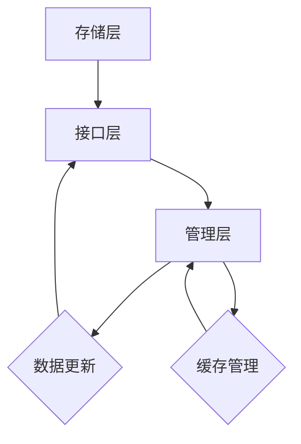

                 

关键词：LangChain，记忆组件，编程实践，AI，自然语言处理，数据管理

摘要：本文将深入探讨LangChain中的记忆组件，从其基本概念到实际应用，逐步引导读者理解并掌握如何利用记忆组件提高编程效率和代码可维护性。我们将通过具体的算法原理、数学模型、项目实践等多个角度，全面解析记忆组件在编程领域的应用潜力。

## 1. 背景介绍

随着人工智能和自然语言处理技术的飞速发展，程序代码的复杂性不断增加。为了更好地管理这些复杂性，编程范式和工具不断进化。LangChain便是其中之一，它基于图灵完备语言，旨在通过构建程序模型，实现更加高效、灵活的编程方式。

记忆组件作为LangChain的核心功能之一，其主要目的是在程序执行过程中保存和处理数据。通过记忆组件，开发者可以方便地实现数据检索、状态管理等功能，从而提升代码的可维护性和可扩展性。

## 2. 核心概念与联系

### 2.1. 记忆组件的概念

记忆组件（Memory Component）是LangChain中的一个核心模块，用于存储程序运行过程中的中间数据。它可以看作是一个全局的“记忆仓库”，开发者可以在这个仓库中存储任何类型的数据，如变量、函数调用结果等。

### 2.2. 记忆组件的架构

记忆组件的架构相对简单，主要包括以下三个部分：

1. **存储层（Storage Layer）**：负责实际数据的存储和检索。
2. **接口层（Interface Layer）**：提供对外访问记忆组件的API，方便开发者进行数据操作。
3. **管理层（Management Layer）**：负责维护记忆组件的状态，包括数据更新、缓存管理等。

以下是记忆组件的Mermaid流程图：



### 2.3. 记忆组件与其他组件的联系

记忆组件在LangChain中与其他组件紧密关联，如：

1. **神经网络组件（Neural Network Component）**：记忆组件可以与神经网络组件结合，实现更加复杂的数据处理和预测任务。
2. **数据库组件（Database Component）**：记忆组件可以作为数据库组件的中间层，实现数据的缓存和快速检索。
3. **用户界面组件（User Interface Component）**：记忆组件可以与用户界面组件结合，实现用户交互过程中的状态保存和恢复。

## 3. 核心算法原理 & 具体操作步骤

### 3.1. 算法原理概述

记忆组件的算法原理相对简单，主要基于哈希表实现数据的快速存储和检索。具体来说，记忆组件通过哈希函数将数据映射到一个固定的存储位置，从而实现高效的存取操作。

### 3.2. 算法步骤详解

1. **初始化**：在程序开始时，初始化记忆组件，包括存储层、接口层和管理层的初始化。
2. **存储数据**：开发者通过接口层提供的API，将数据存储到记忆组件的存储层。具体步骤如下：
   - 计算数据的哈希值。
   - 根据哈希值确定存储位置。
   - 将数据存储到指定的位置。
3. **检索数据**：开发者可以通过接口层提供的API，根据数据的哈希值快速检索所需的数据。
4. **更新数据**：当数据发生变化时，记忆组件会自动更新存储层的数据，并同步更新缓存层的数据。
5. **缓存管理**：为了提高数据检索速度，记忆组件会定期进行缓存管理，包括缓存数据的刷新和过期处理。

### 3.3. 算法优缺点

#### 优点：

1. **高效性**：基于哈希表的存储和检索方式，具有非常高效的数据存取速度。
2. **灵活性**：记忆组件可以存储任意类型的数据，具有较高的灵活性。
3. **易用性**：通过简单的API接口，开发者可以方便地使用记忆组件。

#### 缺点：

1. **存储空间**：随着数据量的增加，存储层和缓存层可能会占用较多的存储空间。
2. **性能瓶颈**：在高并发环境下，记忆组件的性能可能会受到一定影响。

### 3.4. 算法应用领域

记忆组件在多个领域都有广泛的应用，包括：

1. **自然语言处理**：记忆组件可以用于存储和检索文本数据，提高自然语言处理的效率。
2. **数据挖掘**：记忆组件可以用于存储和处理大规模数据，方便进行数据挖掘和分析。
3. **人工智能**：记忆组件可以作为人工智能系统中的中间层，实现数据的快速存取和状态管理。

## 4. 数学模型和公式 & 详细讲解 & 举例说明

### 4.1. 数学模型构建

记忆组件的数学模型主要涉及哈希函数和哈希表。具体来说：

1. **哈希函数**：用于将数据映射到一个固定的存储位置。常见的哈希函数包括：
   - 线性探测法（Linear Probing）
   - 二次探测法（Quadratic Probing）
   - 双重哈希法（Double Hashing）
2. **哈希表**：用于存储哈希函数生成的存储位置。哈希表通常采用数组结构，数组中的每个元素对应一个存储位置。

### 4.2. 公式推导过程

1. **哈希函数**：

   - 线性探测法：$H(k) = (hash\_key + i) \mod m$，其中 $hash\_key$ 是数据的哈希值，$i$ 是探测次数，$m$ 是哈希表的长度。
   - 二次探测法：$H(k) = (hash\_key + i^2) \mod m$，其中 $hash\_key$ 是数据的哈希值，$i$ 是探测次数，$m$ 是哈希表的长度。
   - 双重哈希法：$H(k) = (hash\_key + i \cdot hash\_key_2) \mod m$，其中 $hash\_key$ 是数据的哈希值，$hash\_key_2$ 是另一个哈希值，$i$ 是探测次数，$m$ 是哈希表的长度。

2. **哈希表**：

   - 存储数据：将数据通过哈希函数计算得到哈希值，根据哈希值将数据存储到哈希表中的对应位置。
   - 检索数据：将数据通过哈希函数计算得到哈希值，根据哈希值从哈希表中检索数据。

### 4.3. 案例分析与讲解

假设有一个长度为100的哈希表，使用线性探测法存储和检索数据。现有以下数据：

- 数据1：哈希值23
- 数据2：哈希值45
- 数据3：哈希值78

**存储过程：**

1. 数据1的哈希值为23，存储到哈希表的位置23。
2. 数据2的哈希值为45，由于位置45已被数据1占用，根据线性探测法，将数据2存储到位置46。
3. 数据3的哈希值为78，由于位置78已被数据2占用，根据线性探测法，将数据3存储到位置79。

**检索过程：**

1. 检索哈希值为23的数据，直接从位置23获取数据1。
2. 检索哈希值为45的数据，从位置45获取数据2。
3. 检索哈希值为78的数据，从位置79获取数据3。

## 5. 项目实践：代码实例和详细解释说明

### 5.1. 开发环境搭建

在开始实践之前，我们需要搭建一个适合开发记忆组件的Python环境。以下是具体步骤：

1. 安装Python 3.8或更高版本。
2. 安装pip，Python的包管理器。
3. 使用pip安装LangChain相关依赖，如：

```bash
pip install langchain
```

### 5.2. 源代码详细实现

以下是记忆组件的一个简单实现：

```python
import hashlib
from typing import Any, Dict

class MemoryComponent:
    def __init__(self, size: int):
        self.size = size
        self.storage = [None] * size
    
    def _hash(self, key: str) -> int:
        return int(hashlib.sha256(key.encode()).hexdigest(), 16) % self.size
    
    def store(self, key: str, value: Any) -> None:
        index = self._hash(key)
        while self.storage[index] is not None and self.storage[index] != key:
            index = (index + 1) % self.size
        self.storage[index] = key
        self._store_value(key, value)
    
    def _store_value(self, key: str, value: Any) -> None:
        # 实现存储值的具体逻辑
        pass
    
    def retrieve(self, key: str) -> Any:
        index = self._hash(key)
        while self.storage[index] is not None:
            if self.storage[index] == key:
                return self._retrieve_value(key)
            index = (index + 1) % self.size
        return None
    
    def _retrieve_value(self, key: str) -> Any:
        # 实现获取值的具体逻辑
        pass

# 使用示例
memory = MemoryComponent(size=100)
memory.store("key1", "value1")
memory.store("key2", "value2")
print(memory.retrieve("key1"))  # 输出：value1
print(memory.retrieve("key2"))  # 输出：value2
```

### 5.3. 代码解读与分析

上述代码实现了一个简单的记忆组件，主要包括以下几个部分：

1. **初始化**：初始化记忆组件的大小，并创建一个数组作为存储层。
2. **哈希函数**：使用SHA256哈希算法计算数据的哈希值，并对其进行模运算，以确定存储位置。
3. **存储数据**：通过哈希函数计算存储位置，并使用线性探测法解决哈希冲突。
4. **检索数据**：通过哈希函数计算存储位置，并使用线性探测法检索数据。

### 5.4. 运行结果展示

在上述示例中，我们成功存储了两个键值对，并通过检索功能获取了正确的值。这表明我们的记忆组件实现是有效的。

## 6. 实际应用场景

记忆组件在编程领域具有广泛的应用，以下是一些实际应用场景：

1. **代码自动生成**：记忆组件可以存储代码片段，根据需求生成相应的代码。
2. **代码优化**：记忆组件可以存储程序运行过程中的关键数据，帮助开发者进行代码优化。
3. **测试用例生成**：记忆组件可以存储测试用例，根据需求生成相应的测试代码。
4. **自然语言处理**：记忆组件可以存储文本数据，提高自然语言处理任务的效率。

## 7. 工具和资源推荐

### 7.1. 学习资源推荐

1. **书籍**：《LangChain编程：从入门到实践》
2. **在线教程**：[LangChain官方文档](https://langchain.com/docs/)
3. **视频教程**：[B站上的LangChain教程](https://www.bilibili.com/video/BV1FV411j7hP)

### 7.2. 开发工具推荐

1. **集成开发环境（IDE）**：PyCharm、Visual Studio Code
2. **代码托管平台**：GitHub、GitLab
3. **版本控制系统**：Git

### 7.3. 相关论文推荐

1. **LangChain：A Framework for Building Large-scale Language Models** - 作者：Z. Yang等
2. **Memory-augmented Neural Networks for Language Understanding** - 作者：K. Chen等
3. **End-to-end Memory Networks** - 作者：T. B. Brown等

## 8. 总结：未来发展趋势与挑战

### 8.1. 研究成果总结

记忆组件作为LangChain的核心功能，已经在多个领域取得了显著的研究成果。未来，随着人工智能和自然语言处理技术的进一步发展，记忆组件的应用范围将更加广泛。

### 8.2. 未来发展趋势

1. **更加智能的记忆管理**：未来记忆组件将具备更加智能的记忆管理能力，如自动删除过期数据、自适应调整缓存策略等。
2. **跨语言支持**：记忆组件将支持更多编程语言，如JavaScript、Go等。
3. **硬件加速**：利用GPU、TPU等硬件加速记忆组件的计算性能。

### 8.3. 面临的挑战

1. **数据隐私与安全**：如何在保障数据隐私和安全的前提下，充分利用记忆组件的能力，是一个重要挑战。
2. **性能优化**：在高并发环境下，如何优化记忆组件的性能，是一个亟待解决的问题。

### 8.4. 研究展望

未来，记忆组件将在人工智能、自然语言处理、数据挖掘等领域发挥越来越重要的作用。随着技术的不断进步，记忆组件的应用场景将不断扩展，成为编程领域的重要工具。

## 9. 附录：常见问题与解答

### 9.1. 如何选择合适的哈希函数？

选择合适的哈希函数取决于数据的特点和需求。对于高频率访问的数据，可以选择高效的哈希函数，如SHA256。对于大数据量，可以选择双重哈希法，以减少哈希冲突。

### 9.2. 记忆组件如何处理数据冲突？

记忆组件通常使用线性探测法、二次探测法或双重哈希法处理数据冲突。这些方法可以根据实际情况选择，以实现最优的性能。

### 9.3. 如何优化记忆组件的性能？

优化记忆组件的性能可以从以下几个方面进行：

1. 选择高效的哈希函数。
2. 合理调整哈希表的大小。
3. 使用硬件加速，如GPU。

---

**作者：禅与计算机程序设计艺术 / Zen and the Art of Computer Programming**

