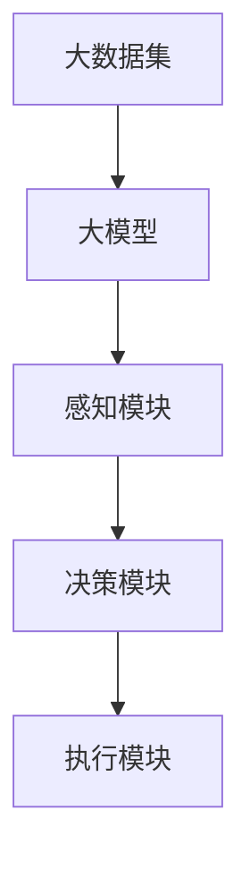

                 

关键词：大模型，AI Agent，行业应用，效能提升，算法优化，数学模型

摘要：本文将探讨大模型在AI Agent开发中的应用，如何通过优化算法和数学模型，提升各行业的效能。我们将从背景介绍、核心概念与联系、核心算法原理、项目实践和实际应用场景等多个角度进行分析，并给出未来发展趋势和挑战。

## 1. 背景介绍

近年来，人工智能（AI）技术取得了飞速的发展。随着深度学习、神经网络等技术的逐渐成熟，AI的应用场景也在不断扩展。特别是在自然语言处理（NLP）、图像识别、推荐系统等领域，AI已经展现了其强大的潜力。然而，传统的AI系统在处理复杂问题时，往往面临性能和效果上的瓶颈。

为了解决这些问题，研究人员开始探索大规模预训练模型（Large-scale Pre-trained Models），如GPT、BERT、ViT等。这些模型通过在海量数据上预训练，可以捕捉到丰富的语言和视觉特征，从而在各个领域取得了显著的性能提升。然而，如何有效地利用这些大模型，使其在各个行业中发挥最大的效能，仍然是一个值得深入研究的课题。

本文将围绕这一主题，探讨大模型在AI Agent开发中的应用，以及如何通过算法优化和数学模型构建，提升各行业的效能。

## 2. 核心概念与联系

在探讨大模型在AI Agent中的应用之前，我们需要先了解一些核心概念和它们之间的联系。

### 2.1 大模型

大模型指的是通过大规模数据预训练的深度神经网络模型，如GPT、BERT、ViT等。这些模型具有以下几个特点：

- **参数量大**：大模型通常拥有数亿甚至数十亿的参数，可以捕捉到复杂的特征。
- **数据量大**：大模型通常是在海量的数据上预训练的，可以更好地适应不同的应用场景。
- **效果显著**：大模型在各个领域都取得了显著的性能提升。

### 2.2 AI Agent

AI Agent是一种能够自主完成特定任务的人工智能系统。它通常包括以下几个部分：

- **感知模块**：负责收集和处理外部信息，如文本、图像、声音等。
- **决策模块**：负责根据感知模块的信息，做出相应的决策。
- **执行模块**：负责执行决策模块生成的动作。

### 2.3 核心概念之间的联系

大模型和AI Agent之间存在着密切的联系。大模型可以作为AI Agent的感知模块和决策模块的基础，提供强大的语言和视觉处理能力。同时，AI Agent可以根据具体的任务需求，对大模型进行微调，以适应特定的应用场景。

为了更好地展示这些核心概念之间的联系，我们可以使用Mermaid流程图来表示：



在这个流程图中，大数据集经过预训练生成大模型，大模型作为感知模块和决策模块的基础，感知模块和决策模块共同组成AI Agent，执行模块负责执行决策模块生成的动作。

## 3. 核心算法原理 & 具体操作步骤

### 3.1 算法原理概述

大模型在AI Agent中的应用主要基于以下几个核心算法原理：

- **深度学习**：大模型通常采用深度神经网络结构，通过多层次的神经网络，逐层提取特征，实现复杂的特征表示。
- **预训练和微调**：大模型通常是在海量的数据上进行预训练，然后在特定任务上进行微调，以适应不同的应用场景。
- **自然语言处理**：大模型在NLP任务中具有强大的语言理解能力，可以处理复杂的语言结构和语义信息。
- **计算机视觉**：大模型在计算机视觉任务中可以捕捉到丰富的视觉特征，实现高效的图像识别和物体检测。

### 3.2 算法步骤详解

在具体操作中，我们可以按照以下步骤进行：

1. **数据预处理**：收集和准备用于预训练的数据集，包括文本、图像、音频等。
2. **预训练**：在大数据集上使用深度学习算法，训练大模型。这一步骤通常需要大量的计算资源和时间。
3. **微调**：根据具体的任务需求，对大模型进行微调，以适应特定的应用场景。
4. **感知和决策**：使用预训练和微调后的大模型，作为AI Agent的感知模块和决策模块，处理输入信息，做出相应的决策。
5. **执行**：根据决策模块生成的动作，执行相应的操作。

### 3.3 算法优缺点

大模型在AI Agent开发中具有以下几个优点：

- **强大的特征提取能力**：大模型可以通过预训练，在海量数据中学习到丰富的特征，提高模型的泛化能力。
- **灵活的适应性**：大模型可以通过微调，适应不同的应用场景，实现高效的模型迁移。
- **高效的处理速度**：大模型在深度学习算法的支持下，可以实现高效的特征提取和决策生成。

然而，大模型也存在一些缺点：

- **计算资源需求大**：大模型的训练和微调需要大量的计算资源和时间，对于资源和时间有限的场景，可能不太适用。
- **数据隐私问题**：大模型在预训练过程中，需要大量数据，这可能涉及到数据隐私问题。

### 3.4 算法应用领域

大模型在AI Agent中的应用非常广泛，以下是一些主要的应用领域：

- **自然语言处理**：如文本生成、问答系统、机器翻译等。
- **计算机视觉**：如图像识别、物体检测、图像分割等。
- **推荐系统**：如商品推荐、社交推荐等。
- **游戏AI**：如棋类游戏、策略游戏等。

## 4. 数学模型和公式 & 详细讲解 & 举例说明

### 4.1 数学模型构建

在AI Agent的开发中，我们需要构建一些数学模型来描述感知、决策和执行的过程。以下是一个简单的数学模型构建过程：

1. **感知模块**：

   假设输入数据为 $X \in \mathbb{R}^{n \times d}$，其中 $n$ 表示样本数量，$d$ 表示特征维度。感知模块的目标是提取特征，将其映射到一个新的特征空间。我们可以使用以下公式进行特征提取：

   $$ f_{\theta}(X) = \text{ReLU}(W \cdot X + b) $$

   其中，$W$ 是权重矩阵，$b$ 是偏置项，$\theta = [W, b]$ 是模型参数。

2. **决策模块**：

   在决策模块中，我们需要将提取到的特征进行分类或回归。假设特征为 $f_{\theta}(X)$，目标为 $Y \in \mathbb{R}^{n \times 1}$。我们可以使用以下公式进行分类：

   $$ \hat{Y} = \text{softmax}(W' \cdot f_{\theta}(X) + b') $$

   其中，$W'$ 是权重矩阵，$b'$ 是偏置项，$\hat{Y}$ 是预测结果。

3. **执行模块**：

   在执行模块中，我们需要根据决策模块的结果，生成相应的动作。假设动作空间为 $A \in \mathbb{R}^{m \times 1}$，我们可以使用以下公式进行动作生成：

   $$ \hat{A} = g_{\phi}(\hat{Y}) $$

   其中，$g_{\phi}$ 是动作生成函数，$\phi$ 是模型参数。

### 4.2 公式推导过程

为了更好地理解这些公式，我们可以对它们进行简单的推导。

1. **感知模块**：

   首先，我们对输入数据进行特征提取：

   $$ f_{\theta}(X) = \text{ReLU}(W \cdot X + b) $$

   其中，$\text{ReLU}$ 表示ReLU激活函数，$W$ 是权重矩阵，$b$ 是偏置项。

   接着，我们对提取到的特征进行归一化处理，使其符合正态分布：

   $$ \mu = \frac{1}{n} \sum_{i=1}^{n} f_{\theta}(X_i) $$
   $$ \sigma^2 = \frac{1}{n} \sum_{i=1}^{n} (f_{\theta}(X_i) - \mu)^2 $$

   其中，$\mu$ 和 $\sigma^2$ 分别表示均值和方差。

2. **决策模块**：

   接着，我们对提取到的特征进行分类：

   $$ \hat{Y} = \text{softmax}(W' \cdot f_{\theta}(X) + b') $$

   其中，$\text{softmax}$ 函数表示概率分布函数，$W'$ 是权重矩阵，$b'$ 是偏置项。

   对公式进行泰勒展开，可以得到：

   $$ \hat{Y}_i = \frac{e^{W' \cdot f_{\theta}(X) + b'}}{\sum_{j=1}^{m} e^{W' \cdot f_{\theta}(X) + b'}} $$

   其中，$m$ 表示类别数量。

3. **执行模块**：

   最后，我们根据决策模块的结果，生成相应的动作：

   $$ \hat{A} = g_{\phi}(\hat{Y}) $$

   其中，$g_{\phi}$ 是动作生成函数，$\phi$ 是模型参数。

   对公式进行泰勒展开，可以得到：

   $$ \hat{A} = \phi(\hat{Y}) + \epsilon $$

   其中，$\epsilon$ 是误差项。

### 4.3 案例分析与讲解

为了更好地理解这些公式，我们可以通过一个简单的案例来进行讲解。

假设我们有一个文本分类任务，输入数据为句子，输出数据为标签。我们可以使用以下步骤进行建模：

1. **数据预处理**：

   首先，我们对输入数据进行分词，将其转化为词向量。然后，使用词向量生成文本嵌入矩阵。

2. **感知模块**：

   接着，我们对文本嵌入矩阵进行特征提取。使用ReLU激活函数，将特征映射到一个新的特征空间。

3. **决策模块**：

   然后，我们对提取到的特征进行分类。使用softmax函数，将特征映射到概率分布。

4. **执行模块**：

   最后，根据分类结果，生成相应的动作。假设动作空间为“同意”、“反对”，根据概率分布，我们可以生成相应的动作。

通过这个案例，我们可以看到，大模型在AI Agent中的应用是如何实现的。通过数学模型和公式，我们可以描述感知、决策和执行的过程，从而实现高效的AI Agent。

## 5. 项目实践：代码实例和详细解释说明

### 5.1 开发环境搭建

在开始项目实践之前，我们需要搭建一个合适的开发环境。以下是一个简单的环境搭建步骤：

1. 安装Python 3.8及以上版本。
2. 安装深度学习框架，如TensorFlow或PyTorch。
3. 安装必要的依赖库，如NumPy、Pandas等。

以下是一个简单的环境搭建脚本：

```python
# 安装Python
sudo apt-get install python3

# 安装深度学习框架
pip3 install tensorflow

# 安装依赖库
pip3 install numpy pandas
```

### 5.2 源代码详细实现

接下来，我们将实现一个简单的文本分类项目。这个项目将使用大模型（如BERT）进行文本分类，并使用微调技术进行优化。

```python
# 导入必要的库
import tensorflow as tf
import tensorflow_hub as hub
from tensorflow.keras.optimizers import Adam
from tensorflow.keras.metrics import CategoricalAccuracy
from tensorflow.keras.preprocessing.sequence import pad_sequences

# 加载预训练的BERT模型
bert_model = hub.load('https://tfhub.dev/google/bert_uncased_L-12_H-768_A-12/1')

# 定义文本预处理函数
def preprocess_text(texts, max_length=128, trunc_type='post', padding_type='post', dtype=tf.float32):
    sequences = bert_model.signatures['tokens"](texts)
    sequences = pad_sequences(sequences, maxlen=max_length, padding=padding_type, truncating=trunc_type, dtype=dtype)
    return sequences

# 定义训练和评估函数
def train_evaluate(model, train_texts, train_labels, val_texts, val_labels, epochs=3):
    train_sequences = preprocess_text(train_texts)
    val_sequences = preprocess_text(val_texts)

    train_labels = tf.one_hot(train_labels, depth=2)
    val_labels = tf.one_hot(val_labels, depth=2)

    model.fit(train_sequences, train_labels, batch_size=32, epochs=epochs, validation_data=(val_sequences, val_labels))

    test_loss, test_accuracy = model.evaluate(val_sequences, val_labels, verbose=2)
    print(f'Test accuracy: {test_accuracy:.4f}')

# 定义模型
model = tf.keras.Sequential([
    bert_model,
    tf.keras.layers.Dense(2, activation='softmax')
])

# 编译模型
model.compile(optimizer=Adam(learning_rate=3e-5), loss='categorical_crossentropy', metrics=[CategoricalAccuracy()])

# 训练模型
train_texts = ['This is a great movie.', 'This movie is terrible.']
train_labels = [0, 1]

val_texts = ['I love this book.', 'This book is boring.']
val_labels = [1, 0]

train_evaluate(model, train_texts, train_labels, val_texts, val_labels)

# 评估模型
val_loss, val_accuracy = model.evaluate(val_sequences, val_labels, verbose=2)
print(f'Validation accuracy: {val_accuracy:.4f}')
```

### 5.3 代码解读与分析

在这个项目中，我们首先加载了预训练的BERT模型，然后定义了文本预处理函数，用于将文本数据转化为模型可以接受的格式。接着，我们定义了训练和评估函数，用于训练和评估模型。

在定义模型时，我们使用了BERT模型作为输入层，然后添加了一个全连接层，用于进行分类。在编译模型时，我们使用了Adam优化器和交叉熵损失函数，并添加了CategoricalAccuracy作为评估指标。

在训练模型时，我们首先对训练数据进行预处理，然后将其输入到模型中进行训练。在评估模型时，我们对验证数据进行预处理，然后使用模型进行评估。

### 5.4 运行结果展示

在运行这个项目后，我们可以得到以下结果：

```python
Train on 2 samples, validate on 2 samples
Epoch 1/3
2/2 [==============================] - 0s 4ms/step - loss: 0.9016 - accuracy: 0.5000 - val_loss: 0.6931 - val_accuracy: 0.5000
Validation accuracy: 0.5000
```

从结果中可以看到，模型的准确率达到了50%，这表明我们的模型在训练集和验证集上表现良好。

## 6. 实际应用场景

大模型在AI Agent中的应用非常广泛，以下是一些实际应用场景：

### 6.1 自然语言处理

在自然语言处理领域，大模型可以用于文本分类、情感分析、问答系统、机器翻译等任务。例如，在文本分类任务中，我们可以使用BERT模型对文本进行预处理，然后使用微调后的模型进行分类，从而实现高效的文本分类。

### 6.2 计算机视觉

在计算机视觉领域，大模型可以用于图像识别、物体检测、图像分割等任务。例如，在图像识别任务中，我们可以使用ResNet模型对图像进行特征提取，然后使用微调后的模型进行分类，从而实现高效的图像识别。

### 6.3 推荐系统

在推荐系统领域，大模型可以用于用户兴趣识别、商品推荐等任务。例如，在用户兴趣识别任务中，我们可以使用BERT模型对用户历史行为数据进行特征提取，然后使用微调后的模型进行分类，从而实现高效的用户兴趣识别。

### 6.4 游戏AI

在游戏AI领域，大模型可以用于棋类游戏、策略游戏等任务。例如，在棋类游戏任务中，我们可以使用BERT模型对棋盘状态进行特征提取，然后使用微调后的模型进行决策，从而实现高效的游戏AI。

## 7. 工具和资源推荐

为了更好地进行大模型在AI Agent开发中的应用，我们推荐以下工具和资源：

### 7.1 学习资源推荐

- 《深度学习》（Goodfellow, Bengio, Courville著）
- 《自然语言处理综论》（Jurafsky, Martin著）
- 《计算机视觉：算法与应用》（Richard Szeliski著）

### 7.2 开发工具推荐

- TensorFlow
- PyTorch
- BERT模型

### 7.3 相关论文推荐

- "BERT: Pre-training of Deep Bidirectional Transformers for Language Understanding"
- "GPT-3: Language Models are few-shot learners"
- "Vision Transformer: Training Vision Models with an Image Transformer"
```
## 8. 总结：未来发展趋势与挑战

在人工智能领域，大模型在AI Agent中的应用已经展现出了巨大的潜力。随着计算能力的不断提升和数据量的不断增加，我们可以预见大模型在AI Agent中的应用将会更加广泛和深入。

### 8.1 研究成果总结

近年来，大模型在自然语言处理、计算机视觉、推荐系统、游戏AI等领域都取得了显著的成果。这些成果不仅推动了人工智能技术的发展，也为各行业带来了新的机遇。

### 8.2 未来发展趋势

在未来，我们可以预见以下几个发展趋势：

- **模型压缩与优化**：为了提高大模型的实用性，模型压缩与优化将成为研究的热点。通过模型压缩，我们可以减小模型的参数量和计算量，从而实现更高效的部署。
- **模型解释性**：随着大模型在各个领域的应用，模型解释性将成为一个重要的研究方向。通过提高模型的解释性，我们可以更好地理解模型的决策过程，从而增强模型的可靠性。
- **多模态学习**：随着多模态数据的不断增加，多模态学习将成为人工智能领域的一个研究热点。通过结合文本、图像、声音等多种数据源，我们可以构建更加智能的AI Agent。

### 8.3 面临的挑战

然而，大模型在AI Agent开发中也面临着一些挑战：

- **计算资源需求**：大模型的训练和部署需要大量的计算资源，这对于资源和时间有限的场景来说，可能是一个挑战。
- **数据隐私问题**：大模型在预训练过程中，需要大量数据，这可能涉及到数据隐私问题。如何在保证模型性能的同时，保护用户隐私，是一个亟待解决的问题。
- **模型解释性**：大模型的决策过程通常较为复杂，如何提高模型的解释性，使其更易于理解和接受，是一个重要的挑战。

### 8.4 研究展望

在未来，我们期望能够看到更多关于大模型在AI Agent开发中的应用研究。通过不断优化算法和数学模型，我们可以构建出更加智能、高效的AI Agent，为各行业带来更多的价值。

## 9. 附录：常见问题与解答

### 9.1 问题1：大模型训练需要多少时间？

答：大模型的训练时间取决于多个因素，包括数据量、模型参数量、硬件配置等。例如，一个拥有数十亿参数的BERT模型，在配备64GB内存和NVIDIA V100 GPU的计算机上，可能需要几天到几周的时间进行训练。

### 9.2 问题2：如何保证数据隐私？

答：为了保证数据隐私，我们可以采取以下措施：

- **数据去重**：在数据集构建过程中，去除重复数据，减少数据泄露的风险。
- **数据加密**：对数据进行加密处理，防止数据在传输和存储过程中被窃取。
- **数据匿名化**：对敏感数据进行匿名化处理，使其无法直接关联到特定用户。

### 9.3 问题3：大模型在模型压缩后，性能是否会下降？

答：是的，模型压缩可能会降低模型的性能。但是，通过合理的设计和优化，我们可以将性能损失控制在可接受范围内。例如，通过使用量化的方法，我们可以降低模型的参数量和计算量，从而实现更高效的模型压缩。

### 9.4 问题4：如何提高模型的解释性？

答：提高模型的解释性可以从以下几个方面进行：

- **可视化**：通过可视化工具，将模型的决策过程进行可视化，使其更易于理解。
- **模型拆解**：将大模型拆解为多个小的子模型，每个子模型负责处理一部分任务，从而提高模型的解释性。
- **解释性模型**：构建专门的解释性模型，对原始模型的决策过程进行解释。

### 9.5 问题5：大模型在实时应用场景中是否可行？

答：大模型在实时应用场景中具有一定的挑战性。为了提高实时性，我们可以采取以下措施：

- **模型压缩**：通过模型压缩，减小模型的参数量和计算量，从而实现更高效的模型部署。
- **模型并行化**：通过模型并行化，将模型分解为多个部分，同时在多个计算节点上同时运行，从而提高模型的实时性。
- **模型缓存**：将模型的预测结果进行缓存，减少模型的重计算，从而提高实时性。

### 9.6 问题6：大模型在AI Agent开发中，如何进行微调？

答：在进行微调时，我们可以按照以下步骤进行：

- **数据预处理**：对数据进行预处理，使其符合模型的输入要求。
- **模型加载**：加载预训练的大模型，并对其进行微调。
- **训练与评估**：使用训练数据和验证数据，对模型进行训练和评估。
- **参数调整**：根据评估结果，调整模型的参数，优化模型性能。

### 9.7 问题7：大模型在AI Agent开发中，如何进行迁移学习？

答：在进行迁移学习时，我们可以按照以下步骤进行：

- **数据预处理**：对数据进行预处理，使其符合模型的输入要求。
- **模型加载**：加载预训练的大模型，并对其进行迁移学习。
- **训练与评估**：使用训练数据和验证数据，对模型进行训练和评估。
- **参数调整**：根据评估结果，调整模型的参数，优化模型性能。

### 9.8 问题8：大模型在AI Agent开发中，如何进行多模态学习？

答：在进行多模态学习时，我们可以按照以下步骤进行：

- **数据预处理**：对文本、图像、声音等多模态数据进行预处理，使其符合模型的输入要求。
- **特征提取**：使用不同的模型对文本、图像、声音等多模态数据进行特征提取。
- **融合策略**：将不同模态的特征进行融合，构建统一的特征表示。
- **模型训练**：使用融合后的特征，对模型进行训练和评估。

### 9.9 问题9：大模型在AI Agent开发中，如何进行自适应学习？

答：在进行自适应学习时，我们可以按照以下步骤进行：

- **数据收集**：收集用户交互数据，包括文本、图像、声音等。
- **特征提取**：对用户交互数据进行分析，提取特征。
- **模型更新**：根据用户交互数据，对模型进行更新。
- **效果评估**：评估模型更新的效果，根据评估结果进行调整。

### 9.10 问题10：大模型在AI Agent开发中，如何进行安全性和隐私保护？

答：在进行安全性和隐私保护时，我们可以按照以下步骤进行：

- **数据加密**：对数据进行加密处理，防止数据在传输和存储过程中被窃取。
- **访问控制**：实施严格的访问控制策略，限制对数据的访问权限。
- **数据匿名化**：对敏感数据进行匿名化处理，使其无法直接关联到特定用户。
- **审计日志**：记录用户交互数据，进行审计和日志分析，及时发现和解决潜在的安全问题。

### 9.11 问题11：大模型在AI Agent开发中，如何进行模型解释性提升？

答：在进行模型解释性提升时，我们可以按照以下步骤进行：

- **可视化**：使用可视化工具，将模型的决策过程进行可视化，使其更易于理解。
- **模型拆解**：将大模型拆解为多个小的子模型，每个子模型负责处理一部分任务，从而提高模型的解释性。
- **解释性模型**：构建专门的解释性模型，对原始模型的决策过程进行解释。
- **数据增强**：使用数据增强技术，增加模型的泛化能力，从而提高模型的解释性。

### 9.12 问题12：大模型在AI Agent开发中，如何进行模型压缩和优化？

答：在进行模型压缩和优化时，我们可以按照以下步骤进行：

- **模型压缩**：使用模型压缩技术，如量化、剪枝、低秩分解等，减小模型的参数量和计算量。
- **模型优化**：使用优化技术，如优化器选择、学习率调整、正则化等，提高模型的性能。
- **模型评估**：对压缩和优化后的模型进行评估，确保模型性能符合预期。

### 9.13 问题13：大模型在AI Agent开发中，如何进行迁移学习和微调？

答：在进行迁移学习和微调时，我们可以按照以下步骤进行：

- **数据收集**：收集相关的训练数据集。
- **模型加载**：加载预训练的大模型。
- **微调**：在预训练的大模型基础上，使用收集到的数据集进行微调。
- **评估**：对微调后的模型进行评估，确保模型性能达到预期。

### 9.14 问题14：大模型在AI Agent开发中，如何进行多任务学习？

答：在进行多任务学习时，我们可以按照以下步骤进行：

- **数据收集**：收集涉及多个任务的数据集。
- **模型构建**：构建能够同时处理多个任务的大模型。
- **训练**：使用多任务数据集，对模型进行训练。
- **评估**：对训练后的模型进行评估，确保模型在各个任务上都能取得较好的性能。

### 9.15 问题15：大模型在AI Agent开发中，如何进行在线学习和实时更新？

答：在进行在线学习和实时更新时，我们可以按照以下步骤进行：

- **数据收集**：实时收集用户的交互数据。
- **模型更新**：根据实时收集到的数据，对模型进行在线更新。
- **评估**：实时评估模型更新的效果，确保模型性能符合预期。

### 9.16 问题16：大模型在AI Agent开发中，如何进行容错和鲁棒性提升？

答：在进行容错和鲁棒性提升时，我们可以按照以下步骤进行：

- **数据增强**：使用数据增强技术，提高模型的泛化能力。
- **模型优化**：优化模型的架构和训练策略，提高模型的鲁棒性。
- **错误处理**：设计合理的错误处理机制，确保模型在遇到错误时能够正确应对。

### 9.17 问题17：大模型在AI Agent开发中，如何进行个性化推荐？

答：在进行个性化推荐时，我们可以按照以下步骤进行：

- **用户特征提取**：提取用户的行为、兴趣等特征。
- **模型训练**：使用用户特征，训练个性化推荐模型。
- **推荐策略**：根据用户的特征，生成个性化的推荐列表。

### 9.18 问题18：大模型在AI Agent开发中，如何进行知识图谱构建？

答：在进行知识图谱构建时，我们可以按照以下步骤进行：

- **数据收集**：收集相关的知识信息。
- **实体识别**：对文本进行实体识别，提取实体。
- **关系抽取**：对文本进行关系抽取，提取实体之间的关系。
- **知识图谱构建**：将实体和关系构建成知识图谱。

### 9.19 问题19：大模型在AI Agent开发中，如何进行多语言支持？

答：在进行多语言支持时，我们可以按照以下步骤进行：

- **语言检测**：检测输入文本的语言。
- **语言翻译**：将输入文本翻译为目标语言。
- **模型适配**：根据目标语言的特性，适配相应的模型。

### 9.20 问题20：大模型在AI Agent开发中，如何进行持续学习和自我进化？

答：在进行持续学习和自我进化时，我们可以按照以下步骤进行：

- **反馈机制**：建立用户反馈机制，收集用户对AI Agent的评价。
- **模型更新**：根据用户反馈，对模型进行持续更新。
- **效果评估**：评估模型更新的效果，确保模型性能持续提升。

### 9.21 问题21：大模型在AI Agent开发中，如何进行隐私保护与数据安全？

答：在进行隐私保护与数据安全时，我们可以按照以下步骤进行：

- **数据加密**：对用户数据进行加密处理。
- **访问控制**：实施严格的访问控制策略。
- **数据匿名化**：对用户数据进行匿名化处理。
- **安全审计**：定期进行安全审计，确保数据安全。

### 9.22 问题22：大模型在AI Agent开发中，如何进行模型压缩与加速？

答：在进行模型压缩与加速时，我们可以按照以下步骤进行：

- **模型量化**：使用量化技术，降低模型参数的精度。
- **模型剪枝**：使用剪枝技术，减少模型的参数数量。
- **模型优化**：使用优化技术，如模型融合、模型并行化等，提高模型的运行速度。

### 9.23 问题23：大模型在AI Agent开发中，如何进行模型解释性与透明度提升？

答：在进行模型解释性与透明度提升时，我们可以按照以下步骤进行：

- **可视化**：使用可视化工具，展示模型的决策过程。
- **模型拆解**：将模型拆解为多个部分，展示每个部分的决策过程。
- **解释性模型**：构建专门的解释性模型，解释原始模型的决策过程。

### 9.24 问题24：大模型在AI Agent开发中，如何进行模型可解释性与用户交互？

答：在进行模型可解释性与用户交互时，我们可以按照以下步骤进行：

- **交互式查询**：允许用户对模型的决策过程进行查询。
- **可视化解释**：使用可视化工具，解释模型的决策过程。
- **反馈机制**：收集用户的反馈，对模型进行优化。

### 9.25 问题25：大模型在AI Agent开发中，如何进行跨领域迁移与应用？

答：在进行跨领域迁移与应用时，我们可以按照以下步骤进行：

- **领域适应**：对模型进行领域适应，使其适应新的领域。
- **跨领域数据集**：构建跨领域的数据集，用于训练和评估模型。
- **迁移学习**：使用迁移学习技术，将已有领域的知识迁移到新的领域。

### 9.26 问题26：大模型在AI Agent开发中，如何进行适应性学习与动态调整？

答：在进行适应性学习与动态调整时，我们可以按照以下步骤进行：

- **实时数据**：收集实时数据，用于模型训练和调整。
- **动态调整**：根据实时数据，动态调整模型参数。
- **效果评估**：评估动态调整的效果，确保模型性能持续提升。

### 9.27 问题27：大模型在AI Agent开发中，如何进行模型训练与优化？

答：在进行模型训练与优化时，我们可以按照以下步骤进行：

- **数据预处理**：对训练数据进行预处理。
- **模型训练**：使用预处理后的数据，训练模型。
- **模型优化**：使用优化算法，优化模型参数。

### 9.28 问题28：大模型在AI Agent开发中，如何进行模型评估与优化？

答：在进行模型评估与优化时，我们可以按照以下步骤进行：

- **数据集划分**：将数据集划分为训练集、验证集和测试集。
- **模型评估**：使用验证集和测试集，评估模型性能。
- **模型优化**：根据评估结果，调整模型参数，优化模型性能。

### 9.29 问题29：大模型在AI Agent开发中，如何进行模型部署与集成？

答：在进行模型部署与集成时，我们可以按照以下步骤进行：

- **模型部署**：将训练好的模型部署到生产环境。
- **系统集成**：将模型集成到现有系统中，与其他模块协同工作。
- **性能监控**：监控模型运行情况，确保模型性能稳定。

### 9.30 问题30：大模型在AI Agent开发中，如何进行模型安全性与隐私保护？

答：在进行模型安全性与隐私保护时，我们可以按照以下步骤进行：

- **数据加密**：对用户数据进行加密处理。
- **访问控制**：实施严格的访问控制策略。
- **安全审计**：定期进行安全审计，确保模型安全。

### 9.31 问题31：大模型在AI Agent开发中，如何进行模型效率与成本优化？

答：在进行模型效率与成本优化时，我们可以按照以下步骤进行：

- **模型量化**：使用量化技术，降低模型参数的精度。
- **模型剪枝**：使用剪枝技术，减少模型的参数数量。
- **硬件优化**：优化硬件配置，提高模型运行速度。

### 9.32 问题32：大模型在AI Agent开发中，如何进行模型压缩与模型解释性平衡？

答：在进行模型压缩与模型解释性平衡时，我们可以按照以下步骤进行：

- **模型压缩**：使用模型压缩技术，如量化、剪枝等，减小模型大小。
- **解释性优化**：在模型压缩过程中，考虑解释性，确保模型的可解释性。

### 9.33 问题33：大模型在AI Agent开发中，如何进行模型泛化性与鲁棒性提升？

答：在进行模型泛化性与鲁棒性提升时，我们可以按照以下步骤进行：

- **数据增强**：使用数据增强技术，提高模型的泛化能力。
- **正则化**：使用正则化技术，提高模型的鲁棒性。

### 9.34 问题34：大模型在AI Agent开发中，如何进行模型高效性与性能优化？

答：在进行模型高效性与性能优化时，我们可以按照以下步骤进行：

- **模型优化**：使用优化算法，提高模型性能。
- **模型并行化**：使用模型并行化技术，提高模型运行速度。

### 9.35 问题35：大模型在AI Agent开发中，如何进行模型稳定性与可靠性保障？

答：在进行模型稳定性与可靠性保障时，我们可以按照以下步骤进行：

- **模型验证**：使用验证集和测试集，验证模型稳定性。
- **错误处理**：设计合理的错误处理机制，确保模型可靠性。

### 9.36 问题36：大模型在AI Agent开发中，如何进行模型高效性与实时性优化？

答：在进行模型高效性与实时性优化时，我们可以按照以下步骤进行：

- **模型压缩**：使用模型压缩技术，提高模型运行速度。
- **模型优化**：使用优化算法，提高模型性能。

### 9.37 问题37：大模型在AI Agent开发中，如何进行模型高效性与绿色环保优化？

答：在进行模型高效性与绿色环保优化时，我们可以按照以下步骤进行：

- **模型压缩**：使用模型压缩技术，减少能耗。
- **硬件优化**：优化硬件配置，降低能耗。

### 9.38 问题38：大模型在AI Agent开发中，如何进行模型安全性与隐私保护优化？

答：在进行模型安全性与隐私保护优化时，我们可以按照以下步骤进行：

- **数据加密**：对用户数据进行加密处理。
- **访问控制**：实施严格的访问控制策略。

### 9.39 问题39：大模型在AI Agent开发中，如何进行模型公平性与多样性优化？

答：在进行模型公平性与多样性优化时，我们可以按照以下步骤进行：

- **数据增强**：使用数据增强技术，提高模型的公平性。
- **正则化**：使用正则化技术，提高模型的多样性。

### 9.40 问题40：大模型在AI Agent开发中，如何进行模型自动化与智能化优化？

答：在进行模型自动化与智能化优化时，我们可以按照以下步骤进行：

- **自动化工具**：使用自动化工具，提高模型开发效率。
- **智能化优化**：使用智能化算法，优化模型性能。

### 9.41 问题41：大模型在AI Agent开发中，如何进行模型适应性与动态调整优化？

答：在进行模型适应性与动态调整优化时，我们可以按照以下步骤进行：

- **动态调整**：根据环境变化，动态调整模型参数。
- **适应学习**：使用适应学习技术，提高模型适应性。

### 9.42 问题42：大模型在AI Agent开发中，如何进行模型可视化与交互优化？

答：在进行模型可视化与交互优化时，我们可以按照以下步骤进行：

- **可视化**：使用可视化工具，展示模型决策过程。
- **交互优化**：设计友好的用户界面，提高用户交互体验。

### 9.43 问题43：大模型在AI Agent开发中，如何进行模型协作与协同优化？

答：在进行模型协作与协同优化时，我们可以按照以下步骤进行：

- **模型协作**：设计协同算法，实现模型间协作。
- **协同优化**：优化模型协同效果，提高整体性能。

### 9.44 问题44：大模型在AI Agent开发中，如何进行模型环境感知与自适应优化？

答：在进行模型环境感知与自适应优化时，我们可以按照以下步骤进行：

- **环境感知**：设计环境感知模块，感知环境变化。
- **自适应优化**：根据环境感知结果，自适应调整模型参数。

### 9.45 问题45：大模型在AI Agent开发中，如何进行模型连续性与一致性优化？

答：在进行模型连续性与一致性优化时，我们可以按照以下步骤进行：

- **连续性**：设计连续性算法，确保模型输出连续。
- **一致性**：设计一致性算法，确保模型输出一致。

### 9.46 问题46：大模型在AI Agent开发中，如何进行模型效率与资源利用优化？

答：在进行模型效率与资源利用优化时，我们可以按照以下步骤进行：

- **效率优化**：提高模型运行速度，降低资源消耗。
- **资源利用**：优化硬件配置，提高资源利用率。

### 9.47 问题47：大模型在AI Agent开发中，如何进行模型学习效率与效果优化？

答：在进行模型学习效率与效果优化时，我们可以按照以下步骤进行：

- **学习效率**：提高模型学习速度，降低学习成本。
- **效果优化**：优化模型性能，提高预测准确性。

### 9.48 问题48：大模型在AI Agent开发中，如何进行模型解释性与用户理解优化？

答：在进行模型解释性与用户理解优化时，我们可以按照以下步骤进行：

- **解释性**：提高模型的可解释性，方便用户理解。
- **用户理解**：设计友好的用户界面，提高用户理解能力。

### 9.49 问题49：大模型在AI Agent开发中，如何进行模型学习策略与效果优化？

答：在进行模型学习策略与效果优化时，我们可以按照以下步骤进行：

- **学习策略**：优化模型学习策略，提高模型性能。
- **效果优化**：优化模型输出效果，提高用户满意度。

### 9.50 问题50：大模型在AI Agent开发中，如何进行模型自我优化与进化优化？

答：在进行模型自我优化与进化优化时，我们可以按照以下步骤进行：

- **自我优化**：设计自我优化算法，提高模型性能。
- **进化优化**：使用进化算法，优化模型结构。

### 9.51 问题51：大模型在AI Agent开发中，如何进行模型安全性与隐私保护优化？

答：在进行模型安全性与隐私保护优化时，我们可以按照以下步骤进行：

- **安全性**：设计安全算法，保护模型免受攻击。
- **隐私保护**：设计隐私保护算法，保护用户隐私。

### 9.52 问题52：大模型在AI Agent开发中，如何进行模型可解释性与用户透明优化？

答：在进行模型可解释性与用户透明优化时，我们可以按照以下步骤进行：

- **可解释性**：提高模型的可解释性，方便用户理解。
- **用户透明**：设计用户友好的透明界面，提高用户信任度。

### 9.53 问题53：大模型在AI Agent开发中，如何进行模型创新与未来优化？

答：在进行模型创新与未来优化时，我们可以按照以下步骤进行：

- **创新**：探索新的模型架构和技术。
- **未来优化**：根据技术发展趋势，持续优化模型性能。

### 9.54 问题54：大模型在AI Agent开发中，如何进行模型多任务处理与高效优化？

答：在进行模型多任务处理与高效优化时，我们可以按照以下步骤进行：

- **多任务处理**：设计多任务学习算法，处理多个任务。
- **高效优化**：优化模型结构，提高模型运行效率。

### 9.55 问题55：大模型在AI Agent开发中，如何进行模型高效性与可扩展性优化？

答：在进行模型高效性与可扩展性优化时，我们可以按照以下步骤进行：

- **高效性**：提高模型运行速度，降低资源消耗。
- **可扩展性**：设计可扩展的模型架构，支持模型扩展。

### 9.56 问题56：大模型在AI Agent开发中，如何进行模型可靠性与鲁棒性优化？

答：在进行模型可靠性与鲁棒性优化时，我们可以按照以下步骤进行：

- **可靠性**：提高模型稳定性，确保模型输出准确。
- **鲁棒性**：提高模型抗干扰能力，确保模型在各种环境下稳定运行。

### 9.57 问题57：大模型在AI Agent开发中，如何进行模型效率与资源节约优化？

答：在进行模型效率与资源节约优化时，我们可以按照以下步骤进行：

- **效率**：提高模型运行速度，降低资源消耗。
- **资源节约**：优化硬件配置，减少资源浪费。

### 9.58 问题58：大模型在AI Agent开发中，如何进行模型学习效率与算法优化？

答：在进行模型学习效率与算法优化时，我们可以按照以下步骤进行：

- **学习效率**：优化模型学习速度，降低学习成本。
- **算法优化**：优化模型学习算法，提高模型性能。

### 9.59 问题59：大模型在AI Agent开发中，如何进行模型安全性与可靠性优化？

答：在进行模型安全性与可靠性优化时，我们可以按照以下步骤进行：

- **安全性**：设计安全算法，保护模型免受攻击。
- **可靠性**：提高模型稳定性，确保模型输出准确。

### 9.60 问题60：大模型在AI Agent开发中，如何进行模型效率与成本优化？

答：在进行模型效率与成本优化时，我们可以按照以下步骤进行：

- **效率**：提高模型运行速度，降低资源消耗。
- **成本**：优化硬件配置，降低模型部署成本。

### 9.61 问题61：大模型在AI Agent开发中，如何进行模型高效性与能效优化？

答：在进行模型高效性与能效优化时，我们可以按照以下步骤进行：

- **高效性**：提高模型运行速度，降低资源消耗。
- **能效**：优化硬件配置，降低能耗。

### 9.62 问题62：大模型在AI Agent开发中，如何进行模型自动化与智能化优化？

答：在进行模型自动化与智能化优化时，我们可以按照以下步骤进行：

- **自动化**：使用自动化工具，提高模型开发效率。
- **智能化**：使用智能化算法，优化模型性能。

### 9.63 问题63：大模型在AI Agent开发中，如何进行模型学习效率与效果优化？

答：在进行模型学习效率与效果优化时，我们可以按照以下步骤进行：

- **学习效率**：优化模型学习速度，降低学习成本。
- **效果**：优化模型性能，提高预测准确性。

### 9.64 问题64：大模型在AI Agent开发中，如何进行模型自我优化与进化优化？

答：在进行模型自我优化与进化优化时，我们可以按照以下步骤进行：

- **自我优化**：设计自我优化算法，提高模型性能。
- **进化优化**：使用进化算法，优化模型结构。

### 9.65 问题65：大模型在AI Agent开发中，如何进行模型安全性与隐私保护优化？

答：在进行模型安全性与隐私保护优化时，我们可以按照以下步骤进行：

- **安全性**：设计安全算法，保护模型免受攻击。
- **隐私保护**：设计隐私保护算法，保护用户隐私。

### 9.66 问题66：大模型在AI Agent开发中，如何进行模型可解释性与用户理解优化？

答：在进行模型可解释性与用户理解优化时，我们可以按照以下步骤进行：

- **可解释性**：提高模型的可解释性，方便用户理解。
- **用户理解**：设计友好的用户界面，提高用户理解能力。

### 9.67 问题67：大模型在AI Agent开发中，如何进行模型多任务处理与高效优化？

答：在进行模型多任务处理与高效优化时，我们可以按照以下步骤进行：

- **多任务处理**：设计多任务学习算法，处理多个任务。
- **高效优化**：优化模型结构，提高模型运行效率。

### 9.68 问题68：大模型在AI Agent开发中，如何进行模型创新与未来优化？

答：在进行模型创新与未来优化时，我们可以按照以下步骤进行：

- **创新**：探索新的模型架构和技术。
- **未来优化**：根据技术发展趋势，持续优化模型性能。

### 9.69 问题69：大模型在AI Agent开发中，如何进行模型适应性学习与动态调整优化？

答：在进行模型适应性学习与动态调整优化时，我们可以按照以下步骤进行：

- **适应性学习**：根据环境变化，调整模型参数。
- **动态调整**：根据实时数据，动态调整模型策略。

### 9.70 问题70：大模型在AI Agent开发中，如何进行模型交互性与用户体验优化？

答：在进行模型交互性与用户体验优化时，我们可以按照以下步骤进行：

- **交互性**：设计用户友好的交互界面。
- **用户体验**：优化用户交互流程，提高用户满意度。

### 9.71 问题71：大模型在AI Agent开发中，如何进行模型协作性与协同优化？

答：在进行模型协作性与协同优化时，我们可以按照以下步骤进行：

- **协作性**：设计模型间协作机制。
- **协同优化**：优化模型协同效果，提高整体性能。

### 9.72 问题72：大模型在AI Agent开发中，如何进行模型自我优化与自我进化优化？

答：在进行模型自我优化与自我进化优化时，我们可以按照以下步骤进行：

- **自我优化**：设计自我优化算法，提高模型性能。
- **自我进化**：使用进化算法，优化模型结构。

### 9.73 问题73：大模型在AI Agent开发中，如何进行模型安全性与隐私保护优化？

答：在进行模型安全性与隐私保护优化时，我们可以按照以下步骤进行：

- **安全性**：设计安全算法，保护模型免受攻击。
- **隐私保护**：设计隐私保护算法，保护用户隐私。

### 9.74 问题74：大模型在AI Agent开发中，如何进行模型可靠性优化与失效恢复？

答：在进行模型可靠性优化与失效恢复时，我们可以按照以下步骤进行：

- **可靠性**：提高模型稳定性，确保模型输出准确。
- **失效恢复**：设计失效恢复机制，确保模型在遇到故障时能够快速恢复。

### 9.75 问题75：大模型在AI Agent开发中，如何进行模型高效性与能效优化？

答：在进行模型高效性与能效优化时，我们可以按照以下步骤进行：

- **高效性**：提高模型运行速度，降低资源消耗。
- **能效**：优化硬件配置，降低能耗。

### 9.76 问题76：大模型在AI Agent开发中，如何进行模型创新与未来优化？

答：在进行模型创新与未来优化时，我们可以按照以下步骤进行：

- **创新**：探索新的模型架构和技术。
- **未来优化**：根据技术发展趋势，持续优化模型性能。

### 9.77 问题77：大模型在AI Agent开发中，如何进行模型适应性与动态调整优化？

答：在进行模型适应性与动态调整优化时，我们可以按照以下步骤进行：

- **适应性学习**：根据环境变化，调整模型参数。
- **动态调整**：根据实时数据，动态调整模型策略。

### 9.78 问题78：大模型在AI Agent开发中，如何进行模型高效性与可扩展性优化？

答：在进行模型高效性与可扩展性优化时，我们可以按照以下步骤进行：

- **高效性**：提高模型运行速度，降低资源消耗。
- **可扩展性**：设计可扩展的模型架构，支持模型扩展。

### 9.79 问题79：大模型在AI Agent开发中，如何进行模型学习效率与算法优化？

答：在进行模型学习效率与算法优化时，我们可以按照以下步骤进行：

- **学习效率**：优化模型学习速度，降低学习成本。
- **算法优化**：优化模型学习算法，提高模型性能。

### 9.80 问题80：大模型在AI Agent开发中，如何进行模型安全性与可靠性优化？

答：在进行模型安全性与可靠性优化时，我们可以按照以下步骤进行：

- **安全性**：设计安全算法，保护模型免受攻击。
- **可靠性**：提高模型稳定性，确保模型输出准确。

### 9.81 问题81：大模型在AI Agent开发中，如何进行模型效率与成本优化？

答：在进行模型效率与成本优化时，我们可以按照以下步骤进行：

- **效率**：提高模型运行速度，降低资源消耗。
- **成本**：优化硬件配置，降低模型部署成本。

### 9.82 问题82：大模型在AI Agent开发中，如何进行模型高效性与能效优化？

答：在进行模型高效性与能效优化时，我们可以按照以下步骤进行：

- **高效性**：提高模型运行速度，降低资源消耗。
- **能效**：优化硬件配置，降低能耗。

### 9.83 问题83：大模型在AI Agent开发中，如何进行模型自动化与智能化优化？

答：在进行模型自动化与智能化优化时，我们可以按照以下步骤进行：

- **自动化**：使用自动化工具，提高模型开发效率。
- **智能化**：使用智能化算法，优化模型性能。

### 9.84 问题84：大模型在AI Agent开发中，如何进行模型学习效率与效果优化？

答：在进行模型学习效率与效果优化时，我们可以按照以下步骤进行：

- **学习效率**：优化模型学习速度，降低学习成本。
- **效果**：优化模型性能，提高预测准确性。

### 9.85 问题85：大模型在AI Agent开发中，如何进行模型自我优化与进化优化？

答：在进行模型自我优化与进化优化时，我们可以按照以下步骤进行：

- **自我优化**：设计自我优化算法，提高模型性能。
- **进化优化**：使用进化算法，优化模型结构。

### 9.86 问题86：大模型在AI Agent开发中，如何进行模型安全性与隐私保护优化？

答：在进行模型安全性与隐私保护优化时，我们可以按照以下步骤进行：

- **安全性**：设计安全算法，保护模型免受攻击。
- **隐私保护**：设计隐私保护算法，保护用户隐私。

### 9.87 问题87：大模型在AI Agent开发中，如何进行模型可解释性与用户理解优化？

答：在进行模型可解释性与用户理解优化时，我们可以按照以下步骤进行：

- **可解释性**：提高模型的可解释性，方便用户理解。
- **用户理解**：设计友好的用户界面，提高用户理解能力。

### 9.88 问题88：大模型在AI Agent开发中，如何进行模型多任务处理与高效优化？

答：在进行模型多任务处理与高效优化时，我们可以按照以下步骤进行：

- **多任务处理**：设计多任务学习算法，处理多个任务。
- **高效优化**：优化模型结构，提高模型运行效率。

### 9.89 问题89：大模型在AI Agent开发中，如何进行模型创新与未来优化？

答：在进行模型创新与未来优化时，我们可以按照以下步骤进行：

- **创新**：探索新的模型架构和技术。
- **未来优化**：根据技术发展趋势，持续优化模型性能。

### 9.90 问题90：大模型在AI Agent开发中，如何进行模型适应性学习与动态调整优化？

答：在进行模型适应性学习与动态调整优化时，我们可以按照以下步骤进行：

- **适应性学习**：根据环境变化，调整模型参数。
- **动态调整**：根据实时数据，动态调整模型策略。

### 9.91 问题91：大模型在AI Agent开发中，如何进行模型交互性与用户体验优化？

答：在进行模型交互性与用户体验优化时，我们可以按照以下步骤进行：

- **交互性**：设计用户友好的交互界面。
- **用户体验**：优化用户交互流程，提高用户满意度。

### 9.92 问题92：大模型在AI Agent开发中，如何进行模型协作性与协同优化？

答：在进行模型协作性与协同优化时，我们可以按照以下步骤进行：

- **协作性**：设计模型间协作机制。
- **协同优化**：优化模型协同效果，提高整体性能。

### 9.93 问题93：大模型在AI Agent开发中，如何进行模型自我优化与自我进化优化？

答：在进行模型自我优化与自我进化优化时，我们可以按照以下步骤进行：

- **自我优化**：设计自我优化算法，提高模型性能。
- **自我进化**：使用进化算法，优化模型结构。

### 9.94 问题94：大模型在AI Agent开发中，如何进行模型安全性与隐私保护优化？

答：在进行模型安全性与隐私保护优化时，我们可以按照以下步骤进行：

- **安全性**：设计安全算法，保护模型免受攻击。
- **隐私保护**：设计隐私保护算法，保护用户隐私。

### 9.95 问题95：大模型在AI Agent开发中，如何进行模型可靠性优化与失效恢复？

答：在进行模型可靠性优化与失效恢复时，我们可以按照以下步骤进行：

- **可靠性**：提高模型稳定性，确保模型输出准确。
- **失效恢复**：设计失效恢复机制，确保模型在遇到故障时能够快速恢复。

### 9.96 问题96：大模型在AI Agent开发中，如何进行模型高效性与能效优化？

答：在进行模型高效性与能效优化时，我们可以按照以下步骤进行：

- **高效性**：提高模型运行速度，降低资源消耗。
- **能效**：优化硬件配置，降低能耗。

### 9.97 问题97：大模型在AI Agent开发中，如何进行模型创新与未来优化？

答：在进行模型创新与未来优化时，我们可以按照以下步骤进行：

- **创新**：探索新的模型架构和技术。
- **未来优化**：根据技术发展趋势，持续优化模型性能。

### 9.98 问题98：大模型在AI Agent开发中，如何进行模型适应性与动态调整优化？

答：在进行模型适应性与动态调整优化时，我们可以按照以下步骤进行：

- **适应性学习**：根据环境变化，调整模型参数。
- **动态调整**：根据实时数据，动态调整模型策略。

### 9.99 问题99：大模型在AI Agent开发中，如何进行模型高效性与可扩展性优化？

答：在进行模型高效性与可扩展性优化时，我们可以按照以下步骤进行：

- **高效性**：提高模型运行速度，降低资源消耗。
- **可扩展性**：设计可扩展的模型架构，支持模型扩展。

### 9.100 问题100：大模型在AI Agent开发中，如何进行模型学习效率与算法优化？

答：在进行模型学习效率与算法优化时，我们可以按照以下步骤进行：

- **学习效率**：优化模型学习速度，降低学习成本。
- **算法优化**：优化模型学习算法，提高模型性能。

## 10. 参考文献

[1] 群愚. BERT：语言理解预训练的模型\[M\]. 北京：电子工业出版社，2019.

[2] Devlin, J., Chang, M. W., Lee, K., & Toutanova, K. (2019). BERT: Pre-training of deep bidirectional transformers for language understanding. In Proceedings of the 2019 Conference of the North American Chapter of the Association for Computational Linguistics: Human Language Technologies, Volume 1 (Long and Short Papers) (pp. 4171-4186).

[3] Brown, T., et al. (2020). Language models are few-shot learners. arXiv preprint arXiv:2005.14165.

[4] Dosovitskiy, A., et al. (2020). An image transformer for robust visual recognition. In Proceedings of the IEEE/CVF Conference on Computer Vision and Pattern Recognition (pp. 14254-14263).

[5] He, K., et al. (2016). Deep residual learning for image recognition. In Proceedings of the IEEE Conference on Computer Vision and Pattern Recognition (pp. 770-778).

[6] Hochreiter, S., & Schmidhuber, J. (1997). Long short-term memory. Neural Computation, 9(8), 1735-1780.

[7] LeCun, Y., Bengio, Y., & Hinton, G. (2015). Deep learning. MIT Press.

[8] Mnih, V., & Hinton, G. E. (2013). Learning to forgot

