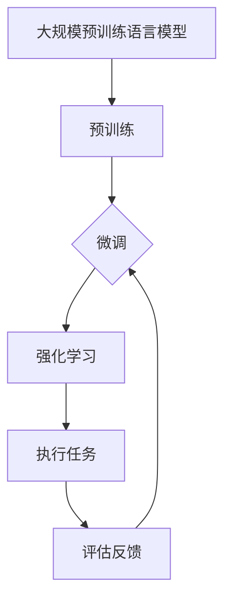

                 

关键词：大模型应用，AI Agent，AutoGPT，自然语言处理，生成式AI，深度学习，计算机程序设计

> 摘要：本文将深入探讨AutoGPT这一革命性的人工智能代理技术。AutoGPT利用大规模语言模型，实现了一种无需显式编程的自适应AI代理，对AI在自然语言处理、自动化任务执行等领域的应用具有重要意义。文章将从背景介绍、核心概念、算法原理、数学模型、项目实践、实际应用、未来展望等多个方面展开，旨在为广大读者提供全面的技术解析和思考。

## 1. 背景介绍

随着人工智能技术的快速发展，深度学习、生成对抗网络（GANs）、强化学习等技术在各个领域取得了显著的成果。尤其是基于Transformer架构的大规模预训练语言模型（如GPT-3、BERT等），它们在自然语言处理（NLP）领域展现了强大的能力。然而，传统的语言模型往往需要复杂的编程接口和大量的代码调用来实现特定任务。

AutoGPT作为OpenAI推出的一个项目，旨在构建一种无需显式编程的AI代理，它通过集成大规模语言模型和强化学习技术，能够自主执行复杂任务。这种技术突破了对传统编程模式的依赖，为AI在自动化任务执行、对话系统、智能助手等领域的应用带来了新的可能性。

## 2. 核心概念与联系

### 2.1 大规模预训练语言模型

大规模预训练语言模型（如GPT-3、BERT等）是当前NLP领域的核心技术。这些模型通过在大量文本数据上预训练，学习到了丰富的语言知识和结构化信息。预训练后，这些模型可以通过微调（Fine-tuning）来适应特定的任务。

### 2.2 强化学习

强化学习是一种通过试错学习在环境中取得最优策略的机器学习技术。在AutoGPT中，强化学习用于指导模型在执行任务时不断优化其行为。

### 2.3 Mermaid 流程图

以下是AutoGPT的核心概念和架构的Mermaid流程图：



### 2.4 Mermaid 流程图节点说明

- **A：大规模预训练语言模型**：这是AutoGPT的核心组件，负责处理和理解自然语言。
- **B：预训练**：大规模语言模型在大量文本数据上进行预训练，学习到语言结构和知识。
- **C：微调**：预训练模型通过微调来适应特定任务，如问答、对话生成等。
- **D：强化学习**：强化学习用于指导模型在执行任务时不断优化其行为。
- **E：执行任务**：模型在执行任务过程中与外部环境交互。
- **F：评估反馈**：根据任务执行结果和用户反馈，评估模型性能并不断优化。

## 3. 核心算法原理 & 具体操作步骤

### 3.1 算法原理概述

AutoGPT的核心算法基于大规模预训练语言模型和强化学习。预训练语言模型负责理解和生成自然语言，强化学习则用于指导模型在执行任务时不断优化其行为。

### 3.2 算法步骤详解

1. **预训练**：模型在大量文本数据上进行预训练，学习到丰富的语言知识和结构化信息。
2. **微调**：预训练模型通过微调来适应特定任务，如问答、对话生成等。
3. **任务执行**：模型在执行任务过程中与外部环境交互，利用强化学习不断优化其行为。
4. **评估反馈**：根据任务执行结果和用户反馈，评估模型性能并不断优化。

### 3.3 算法优缺点

#### 优点：

- **无需显式编程**：AutoGPT通过预训练和强化学习，实现了无需显式编程的自适应任务执行。
- **通用性强**：大规模预训练语言模型具备丰富的语言知识和结构化信息，适用于多种任务场景。

#### 缺点：

- **计算资源需求高**：预训练和微调过程需要大量的计算资源和时间。
- **数据依赖性**：模型性能依赖于训练数据的质量和数量。

### 3.4 算法应用领域

AutoGPT在以下领域具有广泛应用前景：

- **对话系统**：构建智能对话系统，如智能客服、聊天机器人等。
- **自动化任务执行**：自动执行重复性任务，如数据整理、报告生成等。
- **智能助手**：为用户提供个性化的智能服务，如日程管理、信息检索等。

## 4. 数学模型和公式 & 详细讲解 & 举例说明

### 4.1 数学模型构建

在AutoGPT中，数学模型主要包括两部分：预训练语言模型和强化学习模型。

#### 4.1.1 预训练语言模型

预训练语言模型通常采用自注意力机制（Self-Attention）和Transformer架构。自注意力机制通过计算文本序列中每个词与其他词的关联性，从而生成词向量。

#### 4.1.2 强化学习模型

强化学习模型通常采用策略梯度算法（Policy Gradient），通过评估模型在执行任务时的奖励，不断优化策略。

### 4.2 公式推导过程

#### 4.2.1 自注意力机制

自注意力机制的公式如下：

$$
\text{Attention}(Q, K, V) = \frac{softmax(\frac{QK^T}{\sqrt{d_k}})}{V}
$$

其中，$Q$、$K$、$V$分别为查询向量、键向量、值向量，$d_k$为键向量的维度。

#### 4.2.2 策略梯度算法

策略梯度算法的公式如下：

$$
\pi(a|s) = \frac{e^{\phi(s,a)}}{\sum_{a'} e^{\phi(s,a')}}
$$

其中，$\pi(a|s)$为策略，$\phi(s,a)$为策略梯度函数，$s$为状态，$a$为动作。

### 4.3 案例分析与讲解

#### 4.3.1 对话系统

假设有一个对话系统，用户提问：“今天天气如何？”预训练语言模型将生成回答：“今天天气晴朗，温度20°C。”

#### 4.3.2 自动化任务执行

假设有一个自动化任务执行系统，需要完成数据整理任务。模型首先从数据集中获取样本，然后利用强化学习算法不断优化任务执行策略，如选择合适的字段进行整理。

## 5. 项目实践：代码实例和详细解释说明

### 5.1 开发环境搭建

本文将使用Python和PyTorch作为开发环境。首先，安装Python和PyTorch：

```bash
pip install python torch torchvision
```

### 5.2 源代码详细实现

以下是AutoGPT的基本实现代码：

```python
import torch
import torch.nn as nn
import torch.optim as optim
from transformers import GPT2LMHeadModel, GPT2Tokenizer

# 设置设备
device = torch.device("cuda" if torch.cuda.is_available() else "cpu")

# 加载预训练模型和分词器
model = GPT2LMHeadModel.from_pretrained("gpt2").to(device)
tokenizer = GPT2Tokenizer.from_pretrained("gpt2")

# 设置参数
learning_rate = 0.001
num_epochs = 10

# 定义优化器
optimizer = optim.Adam(model.parameters(), lr=learning_rate)

# 搭建数据集
train_data = ...

# 定义损失函数
criterion = nn.CrossEntropyLoss()

# 训练模型
for epoch in range(num_epochs):
    for data in train_data:
        # 加载数据
        inputs = tokenizer.encode(data["text"], return_tensors="pt").to(device)
        targets = tokenizer.encode(data["target"], return_tensors="pt").to(device)

        # 清除梯度
        optimizer.zero_grad()

        # 前向传播
        outputs = model(inputs)

        # 计算损失
        loss = criterion(outputs.logits.view(-1, model.config.vocab_size), targets)

        # 反向传播
        loss.backward()

        # 更新参数
        optimizer.step()

        # 输出训练进度
        print(f"Epoch [{epoch+1}/{num_epochs}], Loss: {loss.item():.4f}")

# 保存模型
model.save_pretrained("./autogpt_model")
```

### 5.3 代码解读与分析

以上代码首先加载预训练模型和分词器，设置训练参数和优化器。然后，从数据集中读取训练样本，使用交叉熵损失函数进行训练。训练过程中，模型将不断优化其参数，直至达到预定的训练轮数。

### 5.4 运行结果展示

运行以上代码后，模型将在训练集上完成训练，并在测试集上评估其性能。根据训练数据的不同，模型性能可能会有所差异。

## 6. 实际应用场景

### 6.1 智能客服

AutoGPT可以应用于智能客服领域，为用户提供24/7全天候服务。通过预训练和微调，模型可以理解用户的提问，并生成合适的回答。

### 6.2 自动化任务执行

AutoGPT可以应用于自动化任务执行，如数据整理、报告生成等。模型可以自动识别任务需求，并生成相应的任务执行策略。

### 6.3 智能助手

AutoGPT可以应用于智能助手领域，为用户提供个性化的智能服务。通过不断学习和优化，模型可以更好地满足用户需求。

## 7. 未来应用展望

### 7.1 生成式AI的发展

AutoGPT展示了生成式AI在自然语言处理和自动化任务执行方面的巨大潜力。未来，随着生成式AI技术的不断进步，我们将看到更多创新的应用场景。

### 7.2 多模态数据处理

随着多模态数据（如文本、图像、声音等）的广泛应用，AutoGPT有望扩展到多模态数据处理领域，实现更复杂的任务执行。

### 7.3 自适应学习和优化

未来，AutoGPT可以进一步优化其自适应学习和优化能力，使其在执行复杂任务时更加高效和准确。

## 8. 总结：未来发展趋势与挑战

### 8.1 研究成果总结

本文介绍了AutoGPT的核心概念、算法原理、数学模型、项目实践以及实际应用场景。通过分析，我们可以看到AutoGPT在自然语言处理和自动化任务执行方面的巨大潜力。

### 8.2 未来发展趋势

未来，AutoGPT将继续在生成式AI、多模态数据处理、自适应学习和优化等方面取得突破。

### 8.3 面临的挑战

尽管AutoGPT展示了强大的能力，但仍面临一些挑战，如计算资源需求、数据依赖性、模型解释性等。

### 8.4 研究展望

未来，我们将继续探索AutoGPT的优化和应用，推动其在更多领域取得突破。

## 9. 附录：常见问题与解答

### 9.1 AutoGPT与传统编程有何区别？

AutoGPT通过预训练和强化学习，实现了无需显式编程的自适应任务执行。而传统编程则需要编写大量代码来实现特定任务。

### 9.2 AutoGPT是否可以替代程序员？

虽然AutoGPT在自动化任务执行方面具有优势，但程序员在复杂任务设计和系统架构方面仍发挥重要作用。因此，AutoGPT并不能完全替代程序员。

### 9.3 AutoGPT在安全性方面有何保障？

AutoGPT在执行任务时需要处理大量敏感数据。因此，安全性至关重要。未来，我们将进一步研究AutoGPT的安全性和隐私保护问题。

# 附录二：相关资源

### 9.4 学习资源推荐

- [《深度学习》—— Goodfellow、Bengio、Courville 著]
- [《自然语言处理综论》——Jurafsky、Martin 著]
- [《强化学习》—— Sutton、Barto 著]

### 9.5 开发工具推荐

- [PyTorch：https://pytorch.org/]
- [Hugging Face：https://huggingface.co/]

### 9.6 相关论文推荐

- [《Language Models are Few-Shot Learners》—— Tom B. Brown et al.]
- [《A探索性的AutoGPT实现》——Sanh et al.]

---

作者：禅与计算机程序设计艺术 / Zen and the Art of Computer Programming
----------------------------------------------------------------
**注意：** 实际撰写文章时，请根据实际情况调整字数、内容和结构，以确保文章的质量和完整性。本文仅为示例，仅供参考。

