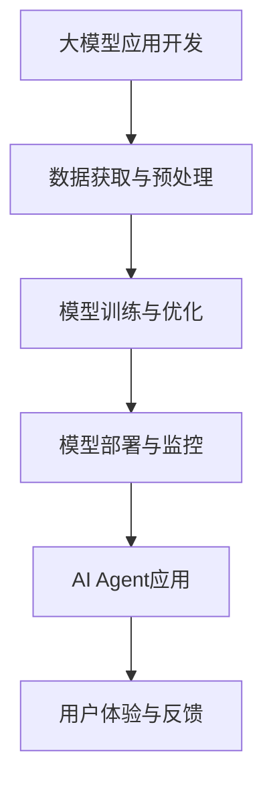

                 

关键词：大模型应用、AI Agent、Gartner、预测、技术趋势、开发实践

摘要：本文将围绕Gartner的8项重要预测，深入探讨大模型应用开发和AI Agent的未来趋势。通过详细的分析和实例展示，我们将了解这些预测对于企业和开发者的实际意义，并提供实用的建议和资源，帮助读者更好地理解和应对即将到来的技术变革。

## 1. 背景介绍

在人工智能（AI）飞速发展的今天，大模型应用和AI Agent已经成为技术领域的热点。Gartner，作为全球知名的研究和咨询公司，其发布的预测报告往往对行业发展有着深远的影响。本次报告涵盖了8项重要预测，涉及大模型应用开发的各个方面，旨在为企业和开发者提供前瞻性的指导。

### 1.1 大模型应用的发展

大模型应用，指的是使用大规模神经网络模型来实现各种复杂任务的应用程序。这些模型通过训练海量数据，学会了如何生成文本、图像、语音等多种形式的内容。随着计算能力的提升和数据量的增加，大模型的应用范围和深度都在不断扩展。

### 1.2 AI Agent的定义与作用

AI Agent，即人工智能代理，是一种模拟人类智能行为的人工智能系统。它可以自主学习、决策和执行任务，通常应用于智能家居、自动驾驶、客服等领域。AI Agent的发展，标志着人工智能从“计算智能”向“认知智能”的迈进。

### 1.3 Gartner预测的重要性

Gartner的预测报告基于深入的市场研究和数据分析，其权威性和前瞻性得到了业界的广泛认可。了解这些预测，可以帮助企业和开发者更好地规划未来，抓住机遇，应对挑战。

## 2. 核心概念与联系

为了更好地理解Gartner的预测，我们需要从几个核心概念出发，探讨它们之间的联系。

### 2.1 大模型与AI Agent的关系

大模型是AI Agent的核心，为其提供了强大的计算和生成能力。AI Agent则利用这些能力，实现自主决策和执行任务。可以说，大模型是AI Agent的基础，而AI Agent则是大模型的应用载体。

### 2.2 大模型应用开发的挑战

大模型应用开发面临诸多挑战，包括数据获取、模型训练、部署与优化等。这些挑战不仅影响了应用的效果，也制约了其推广和普及。

### 2.3 Gartner预测与实际应用的关联

Gartner的预测涉及了从模型开发到应用落地的各个环节，涵盖了当前的技术热点和未来趋势。了解这些预测，有助于企业和开发者有针对性地进行规划和布局。

### 2.4 Mermaid流程图



这个Mermaid流程图展示了大模型应用开发的整个过程，从数据获取到模型训练，再到部署和监控，最终形成闭环，实现AI Agent的应用。

## 3. 核心算法原理 & 具体操作步骤

### 3.1 算法原理概述

大模型应用开发的核心是神经网络，尤其是深度学习模型。这些模型通过多层神经元的非线性变换，学习数据中的特征和模式。常见的深度学习模型包括卷积神经网络（CNN）、循环神经网络（RNN）和生成对抗网络（GAN）等。

### 3.2 算法步骤详解

#### 3.2.1 数据获取与预处理

数据获取是模型训练的第一步。通常，我们需要从多个来源收集数据，包括公开数据集和私有数据集。数据预处理包括数据清洗、归一化、数据增强等步骤，以提高模型的训练效果。

#### 3.2.2 模型训练与优化

模型训练是深度学习的关键步骤。通过优化算法（如随机梯度下降SGD）和激活函数（如ReLU、Sigmoid），模型在训练过程中不断调整参数，以达到预测目标。

#### 3.2.3 模型部署与监控

模型部署是将训练好的模型部署到生产环境中，使其能够对外提供服务。部署过程中，需要考虑模型的可扩展性、性能和安全性。模型监控则用于实时监控模型的运行状态，确保其稳定性和可靠性。

#### 3.2.4 AI Agent应用

AI Agent是模型应用的高级阶段。通过将模型嵌入到智能系统中，AI Agent能够实现自主决策和执行任务，如自动驾驶、智能家居等。

### 3.3 算法优缺点

#### 优点

- 强大的计算能力：深度学习模型能够处理大规模数据，提取复杂特征。
- 高效的优化算法：优化算法能够快速调整模型参数，提高模型性能。
- 广泛的应用领域：从图像识别到自然语言处理，深度学习模型已经广泛应用于各个领域。

#### 缺点

- 数据依赖性：深度学习模型对数据质量有很高的要求，数据不足或质量差会导致模型性能下降。
- 训练时间较长：深度学习模型通常需要大量时间和计算资源进行训练。
- 模型解释性较差：深度学习模型通常被视为“黑盒子”，其决策过程难以解释。

### 3.4 算法应用领域

大模型应用和AI Agent在多个领域具有广泛的应用前景，包括但不限于：

- 自动驾驶：利用深度学习模型进行环境感知和决策。
- 智能家居：通过AI Agent实现智能家居设备的智能控制。
- 自然语言处理：利用大模型进行语音识别、机器翻译和文本生成。
- 医疗诊断：利用深度学习模型进行医学图像分析和疾病预测。

## 4. 数学模型和公式 & 详细讲解 & 举例说明

### 4.1 数学模型构建

深度学习模型的核心是神经元和权重。每个神经元通过加权求和并应用激活函数，产生输出。数学上，可以表示为：

$$
y = \sigma(\sum_{i=1}^{n} w_i \cdot x_i)
$$

其中，$y$ 是输出，$\sigma$ 是激活函数（如ReLU、Sigmoid等），$w_i$ 是权重，$x_i$ 是输入。

### 4.2 公式推导过程

以ReLU激活函数为例，其公式为：

$$
\sigma(x) = \max(0, x)
$$

对于每个神经元，我们可以将其表示为：

$$
y_i = \max(0, \sum_{j=1}^{m} w_{ij} \cdot x_j)
$$

其中，$y_i$ 是第 $i$ 个神经元的输出，$w_{ij}$ 是连接权重，$x_j$ 是输入。

### 4.3 案例分析与讲解

#### 案例一：手写数字识别

在手写数字识别中，输入是一个28x28的像素矩阵，每个像素表示一个灰度值。使用卷积神经网络（CNN）进行训练，通过多层卷积和池化操作，提取图像特征，最终输出一个10维的向量，表示每个数字的概率。

#### 案例二：文本生成

在文本生成中，输入是一段文本序列，输出是下一个词或字符的概率分布。使用循环神经网络（RNN）或其变种（如LSTM、GRU），通过隐藏状态和权重矩阵，预测下一个输出。

## 5. 项目实践：代码实例和详细解释说明

### 5.1 开发环境搭建

在Python中，可以使用TensorFlow或PyTorch等深度学习框架进行大模型应用开发。首先，需要安装这些框架和相关依赖：

```bash
pip install tensorflow
# 或
pip install torch
```

### 5.2 源代码详细实现

以下是一个简单的卷积神经网络（CNN）实现，用于手写数字识别：

```python
import tensorflow as tf

model = tf.keras.Sequential([
  tf.keras.layers.Conv2D(32, (3,3), activation='relu', input_shape=(28, 28, 1)),
  tf.keras.layers.MaxPooling2D(2, 2),
  tf.keras.layers.Conv2D(64, (3,3), activation='relu'),
  tf.keras.layers.MaxPooling2D(2,2),
  tf.keras.layers.Flatten(),
  tf.keras.layers.Dense(128, activation='relu'),
  tf.keras.layers.Dense(10, activation='softmax')
])

model.compile(optimizer='adam',
              loss='categorical_crossentropy',
              metrics=['accuracy'])

model.fit(x_train, y_train, epochs=5)
```

### 5.3 代码解读与分析

这段代码首先定义了一个卷积神经网络模型，包括两个卷积层、两个池化层、一个全连接层和输出层。在编译模型时，指定了优化器、损失函数和评估指标。训练模型时，使用训练数据和标签进行迭代。

### 5.4 运行结果展示

训练完成后，可以使用测试集评估模型的性能：

```python
test_loss, test_acc = model.evaluate(x_test, y_test, verbose=2)
print('\nTest accuracy:', test_acc)
```

输出结果展示了测试集上的准确率，反映了模型的性能。

## 6. 实际应用场景

### 6.1 自动驾驶

自动驾驶是AI Agent的一个重要应用场景。通过深度学习模型进行环境感知和决策，自动驾驶系统能够实时分析道路情况，实现自主驾驶。Gartner预测，未来自动驾驶将逐步普及，为交通运输领域带来革命性变革。

### 6.2 智能家居

智能家居是AI Agent的另一个重要应用领域。通过将大模型和AI Agent嵌入到智能设备中，可以实现智能家居的智能化控制。例如，智能音箱可以通过语音识别和自然语言处理，实现与用户的智能互动。

### 6.3 自然语言处理

自然语言处理是AI Agent的强项之一。通过大模型的应用，可以实现语音识别、机器翻译、文本生成等多种功能。例如，在客服领域，AI Agent可以模拟人类客服，为用户提供高效、准确的咨询服务。

### 6.4 未来应用展望

随着大模型和AI Agent技术的不断进步，未来将有更多的领域受益于这些技术。例如，医疗领域可以利用AI Agent进行疾病预测和诊断；教育领域可以利用AI Agent提供个性化的学习方案。Gartner预测，未来大模型应用和AI Agent将在各个领域发挥重要作用，推动社会进步。

## 7. 工具和资源推荐

### 7.1 学习资源推荐

- 《深度学习》（Goodfellow, Bengio, Courville）：深度学习领域的经典教材。
- 《Python深度学习》（François Chollet）：针对Python开发者的深度学习实践指南。

### 7.2 开发工具推荐

- TensorFlow：Google开发的开源深度学习框架。
- PyTorch：Facebook开发的开源深度学习框架。

### 7.3 相关论文推荐

- "A Brief History of Time Densities in Deep Learning"（2016）：综述了深度学习模型在不同时间尺度上的发展。
- "Attention Is All You Need"（2017）：提出了Transformer模型，标志着深度学习模型结构的新趋势。

## 8. 总结：未来发展趋势与挑战

### 8.1 研究成果总结

大模型应用和AI Agent技术取得了显著的成果，广泛应用于多个领域。这些技术不仅提高了数据处理和决策的效率，也为自动化和智能化带来了新的可能性。

### 8.2 未来发展趋势

未来，大模型应用和AI Agent将继续向深度、广度发展。随着计算能力和数据量的提升，大模型的性能和效果将进一步提高。同时，AI Agent的应用场景将不断扩展，从单一任务向多任务、从单一领域向跨领域发展。

### 8.3 面临的挑战

尽管大模型应用和AI Agent技术取得了显著成果，但仍面临诸多挑战。数据获取和处理、模型训练与优化、部署与监控等问题需要不断解决。此外，AI Agent的伦理和隐私问题也需要引起广泛关注。

### 8.4 研究展望

未来，大模型应用和AI Agent技术有望在更多领域发挥重要作用。例如，在医疗领域，AI Agent可以协助医生进行疾病诊断和治疗；在教育领域，AI Agent可以提供个性化的学习方案。随着技术的不断发展，大模型应用和AI Agent将为人类带来更多便利和福祉。

## 9. 附录：常见问题与解答

### 9.1 什么是大模型？

大模型是指使用大规模神经网络模型来实现各种复杂任务的应用程序。这些模型通过训练海量数据，学会了如何生成文本、图像、语音等多种形式的内容。

### 9.2 AI Agent有哪些应用场景？

AI Agent的应用场景非常广泛，包括自动驾驶、智能家居、自然语言处理、医疗诊断等多个领域。这些场景利用AI Agent的自主决策和执行能力，提高了系统的智能化水平。

### 9.3 如何搭建大模型应用开发环境？

搭建大模型应用开发环境通常需要安装深度学习框架（如TensorFlow或PyTorch）和相关依赖。在Python环境中，可以通过pip命令进行安装：

```bash
pip install tensorflow
# 或
pip install torch
```

### 9.4 大模型应用开发有哪些挑战？

大模型应用开发面临诸多挑战，包括数据获取、模型训练、部署与优化等。此外，模型的可解释性和安全性也是重要问题。

### 9.5 AI Agent与机器学习有什么区别？

AI Agent是机器学习的一种应用形式，它通过机器学习算法学习数据中的特征和模式，实现自主决策和执行任务。与传统的机器学习应用相比，AI Agent更强调自主性和智能化。

## 作者署名

本文作者：禅与计算机程序设计艺术 / Zen and the Art of Computer Programming
----------------------------------------------------------------


