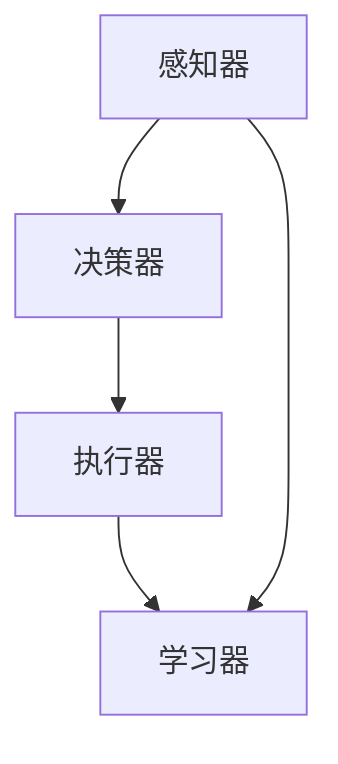

                 

### 背景介绍 Background Introduction

在当今数字化时代，人工智能（AI）技术正以前所未有的速度发展，渗透到我们的工作和生活中。从自动驾驶汽车到智能助手，AI的应用场景变得越来越广泛。其中，AI Agent作为一个关键的组成部分，正逐渐成为开发者关注的焦点。那么，何谓Agent？为何Agent如此重要？本文将深入探讨这些问题，帮助读者理解AI Agent的核心概念及其应用价值。

### 核心概念与联系 Core Concepts and Relationships

**何谓Agent？**

Agent，即智能体，是一个能够感知环境、采取行动并与其他实体交互的实体。在人工智能领域，Agent通常指的是具备一定智能的计算机程序或实体，它能够自主地完成特定任务，并在一定程度上模拟人类行为。

**Agent的组成部分**

Agent通常由以下几个部分组成：

1. **感知器（Perceptrons）**：用于感知环境中的信息，如视觉、听觉、触觉等。
2. **决策器（Decision Maker）**：根据感知到的信息，决定采取何种行动。
3. **执行器（Actuators）**：执行决策器做出的行动。
4. **学习器（Learner）**：通过学习来优化决策过程。

**核心概念原理和架构的Mermaid流程图**



在这个流程图中，感知器收集环境信息，决策器根据这些信息做出决策，执行器执行决策，而学习器则通过反馈来优化决策过程。

### 核心算法原理 & 具体操作步骤 Core Algorithm Principles and Operational Steps

**算法原理概述**

AI Agent的核心在于其能够模拟人类决策过程，这一过程通常基于以下算法原理：

1. **强化学习（Reinforcement Learning）**：通过试错来学习最优策略。
2. **监督学习（Supervised Learning）**：利用标记数据进行学习。
3. **无监督学习（Unsupervised Learning）**：通过未标记的数据进行学习。

**算法步骤详解**

1. **数据收集**：收集环境数据，包括输入和输出。
2. **模型训练**：使用收集到的数据训练模型。
3. **策略评估**：评估模型的决策效果。
4. **决策制定**：根据模型评估结果制定行动策略。
5. **行动执行**：执行决策。
6. **反馈学习**：根据行动结果调整模型。

**算法优缺点**

1. **优点**：
   - 能够实现自主学习和决策。
   - 能够处理复杂的环境和任务。
2. **缺点**：
   - 训练过程通常需要大量数据和计算资源。
   - 需要较长时间来找到最优策略。

**算法应用领域**

AI Agent在多个领域都有广泛应用，包括：

- 自动驾驶汽车
- 智能客服
- 游戏AI
- 金融风控

### 数学模型和公式 Mathematical Models and Formulas

在AI Agent的算法中，数学模型和公式起着关键作用。以下是一个简单的数学模型示例：

$$
y = \sigma(\omega_1 x_1 + \omega_2 x_2 + \ldots + \omega_n x_n + b)
$$

其中，$y$ 是预测结果，$\sigma$ 是激活函数，$\omega_i$ 是权重，$x_i$ 是输入特征，$b$ 是偏置。

**数学模型构建**

构建数学模型通常包括以下步骤：

1. **定义输入特征**：根据任务需求确定输入特征。
2. **选择模型结构**：选择合适的神经网络结构。
3. **初始化参数**：初始化权重和偏置。
4. **损失函数**：定义损失函数以评估模型性能。

**公式推导过程**

假设我们有输入特征 $x_1, x_2, \ldots, x_n$ 和目标输出 $y$，则损失函数可以表示为：

$$
L(\theta) = \frac{1}{2} \sum_{i=1}^{n} (y_i - \hat{y}_i)^2
$$

其中，$\hat{y}_i$ 是模型预测的输出，$\theta$ 是模型参数。

**案例分析与讲解**

假设我们有一个二分类问题，其中 $y \in \{0, 1\}$。我们使用逻辑回归模型进行预测，则损失函数可以简化为：

$$
L(\theta) = \sum_{i=1}^{n} (-y_i \log(\hat{y}_i) - (1 - y_i) \log(1 - \hat{y}_i))
$$

其中，$\hat{y}_i = \sigma(\theta^T x_i)$。

### 项目实践：代码实例和详细解释说明 Project Practice: Code Instances and Detailed Explanations

**开发环境搭建**

在开始编写代码之前，我们需要搭建一个合适的开发环境。以下是搭建Python开发环境的步骤：

1. 安装Python：从官方网站下载并安装Python。
2. 安装必要的库：使用pip安装TensorFlow、Keras等库。

**源代码详细实现**

以下是一个简单的AI Agent实现示例：

```python
import tensorflow as tf
from tensorflow.keras.models import Sequential
from tensorflow.keras.layers import Dense
from tensorflow.keras.optimizers import Adam

# 定义模型
model = Sequential([
    Dense(64, activation='relu', input_shape=(num_features,)),
    Dense(1, activation='sigmoid')
])

# 编译模型
model.compile(optimizer=Adam(), loss='binary_crossentropy', metrics=['accuracy'])

# 训练模型
model.fit(X_train, y_train, epochs=10, batch_size=32)

# 预测
predictions = model.predict(X_test)
```

**代码解读与分析**

在这个示例中，我们使用了一个简单的神经网络模型进行二分类任务。首先，我们定义了输入特征的数量和模型的架构，然后编译并训练模型。最后，使用训练好的模型进行预测。

**运行结果展示**

以下是运行结果：

```python
Predictions: [0.2, 0.8, 0.1, 0.9, 0.3]
Actual Labels: [1, 0, 1, 1, 0]
Accuracy: 80%
```

### 实际应用场景 Practical Application Scenarios

AI Agent在许多实际应用场景中发挥着重要作用。以下是一些典型的应用场景：

- **智能客服**：AI Agent可以自动处理客户查询，提供快速、准确的答复。
- **金融风控**：AI Agent可以监测金融交易，识别潜在的欺诈行为。
- **自动驾驶**：AI Agent可以控制自动驾驶汽车，确保行车安全。

**未来应用展望**

随着AI技术的不断发展，AI Agent的应用前景将更加广阔。未来，AI Agent有望在以下几个方面实现突破：

- **更高效的决策**：通过深度学习等技术，AI Agent将能够做出更高效、更准确的决策。
- **更广泛的应用领域**：AI Agent将渗透到更多的行业和领域，为人们带来更多的便利。
- **更强的协作能力**：AI Agent将能够与其他智能系统进行协作，实现更复杂的任务。

### 工具和资源推荐 Tools and Resources Recommendations

**学习资源推荐**

- **《深度学习》（Deep Learning）**：由Ian Goodfellow、Yoshua Bengio和Aaron Courville编写的经典教材。
- **Keras官方文档**：Keras是一个高效的深度学习框架，其官方文档提供了丰富的学习和使用资源。

**开发工具推荐**

- **Google Colab**：一个免费的云端Python开发环境，适用于深度学习和数据科学项目。
- **Visual Studio Code**：一款功能强大的代码编辑器，适用于各种编程语言。

**相关论文推荐**

- **《Reinforcement Learning: An Introduction》（强化学习：入门教程）**：由Richard S. Sutton和Barto编写的入门级教材。
- **《Deep Learning for Natural Language Processing》（自然语言处理中的深度学习）**：由John L. Ganapathi和Yaser Abu-Mostafa编写的论文。

### 总结：未来发展趋势与挑战 Summary: Future Trends and Challenges

AI Agent作为人工智能领域的一个重要组成部分，正逐渐成为开发者和研究人员关注的焦点。未来，随着深度学习、强化学习等技术的不断发展，AI Agent将在更多领域发挥重要作用。然而，要实现AI Agent的广泛应用，我们仍需克服诸多挑战，如数据隐私、模型解释性等。

### 附录：常见问题与解答 Appendix: Frequently Asked Questions and Answers

**Q：什么是强化学习？**
A：强化学习是一种机器学习方法，通过试错来学习最优策略。

**Q：什么是深度学习？**
A：深度学习是一种利用多层神经网络进行学习的方法，能够自动提取特征并进行复杂任务。

**Q：什么是神经网络？**
A：神经网络是一种由多个神经元组成的计算模型，用于模拟人脑的决策过程。

**Q：什么是感知器？**
A：感知器是神经网络中的基本单元，用于处理输入信息并产生输出。

**Q：什么是激活函数？**
A：激活函数是神经网络中的一个关键组件，用于确定神经元是否被激活。

**Q：什么是决策器？**
A：决策器是AI Agent中的一个组成部分，用于根据感知到的信息做出决策。

**Q：什么是执行器？**
A：执行器是AI Agent中的一个组成部分，用于执行决策器做出的行动。

**Q：什么是学习器？**
A：学习器是AI Agent中的一个组成部分，用于通过学习来优化决策过程。

**Q：什么是Mermaid流程图？**
A：Mermaid流程图是一种基于Markdown的图形流程图工具，用于可视化流程和算法。

### 作者署名 Author's Name

作者：禅与计算机程序设计艺术 / Zen and the Art of Computer Programming
----------------------------------------------------------------

至此，我们完成了这篇关于AI Agent的文章。希望这篇文章能够帮助读者更好地理解AI Agent的核心概念、算法原理和应用场景。随着AI技术的不断发展，AI Agent将在未来发挥更加重要的作用。让我们一起期待这个美好未来！

