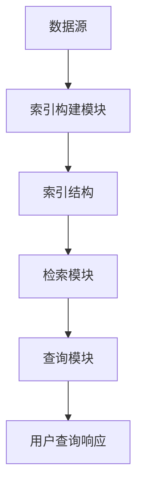

                 

关键词：LlamaIndex，大模型应用，AI Agent，索引技术，算法原理，数学模型，项目实践，未来展望

> 摘要：本文旨在深入探讨LlamaIndex，一种强大的AI代理索引技术，在当今大模型应用开发领域的重要性和应用。通过分析其核心概念、算法原理、数学模型和具体操作步骤，我们希望读者能够对LlamaIndex有更全面的理解，并能够将其应用于实际项目中。

## 1. 背景介绍

随着深度学习和自然语言处理（NLP）技术的快速发展，大规模语言模型如GPT-3、ChatGLM等在大模型应用开发中扮演着越来越重要的角色。然而，这些模型面临着数据检索和知识查询的挑战。为了解决这一问题，索引技术成为了研究热点，而LlamaIndex作为其中的代表之一，引起了广泛关注。

LlamaIndex是由DeepMind团队开发的一种用于大规模语言模型数据检索和知识查询的索引技术。它通过构建索引结构，使得语言模型能够在检索和查询过程中大幅提高效率，从而实现更智能、更高效的AI代理。本文将详细探讨LlamaIndex的核心概念、算法原理、数学模型以及具体应用，帮助读者深入理解这一重要技术。

## 2. 核心概念与联系

### 2.1 LlamaIndex概述

LlamaIndex是一种基于索引的AI代理技术，它能够将大规模语言模型与外部数据源有效结合，实现高效的检索和查询。其核心思想是通过构建索引结构，将语言模型的知识库与外部数据进行映射，从而实现快速、准确的查询。

### 2.2 LlamaIndex的架构

LlamaIndex的架构主要包括以下几个关键部分：

1. **索引构建模块**：负责构建索引结构，将外部数据源映射到语言模型的知识库中。
2. **检索模块**：利用构建好的索引结构，实现快速的数据检索。
3. **查询模块**：通过检索模块获取到的结果，实现用户查询的响应。

### 2.3 Mermaid流程图

以下是LlamaIndex的架构流程图：



## 3. 核心算法原理 & 具体操作步骤

### 3.1 算法原理概述

LlamaIndex的核心算法基于一种称为“词汇嵌入”的技术。它将外部数据源中的词汇转换为语言模型的知识库中的向量表示，从而实现数据检索和查询。具体来说，LlamaIndex通过以下步骤实现：

1. **数据预处理**：对输入数据（如文本、图像等）进行预处理，提取出关键信息。
2. **词汇嵌入**：将预处理后的数据转换为语言模型的知识库中的向量表示。
3. **索引构建**：利用构建好的向量表示，构建索引结构，以实现快速检索。
4. **查询响应**：根据用户查询，利用检索模块获取结果，并生成响应。

### 3.2 算法步骤详解

1. **数据预处理**：
   - 对输入数据进行分词、去停用词等预处理操作。
   - 将处理后的文本数据转换为语言模型的知识库中的向量表示。

2. **词汇嵌入**：
   - 利用预训练的语言模型（如GPT-3、ChatGLM等），将预处理后的文本数据转换为向量表示。

3. **索引构建**：
   - 将词汇嵌入后的向量表示存储到索引结构中，以实现快速检索。

4. **查询响应**：
   - 根据用户查询，利用检索模块从索引结构中获取结果。
   - 对获取到的结果进行后处理，生成用户查询的响应。

### 3.3 算法优缺点

**优点**：

1. **高效性**：通过构建索引结构，实现快速的数据检索和查询。
2. **灵活性**：支持多种数据源（如文本、图像等）的检索和查询。
3. **扩展性**：可以根据实际需求，扩展和定制索引算法。

**缺点**：

1. **存储空间需求大**：构建索引结构需要大量的存储空间。
2. **构建时间较长**：索引构建过程需要一定的时间，尤其在处理大规模数据时。

### 3.4 算法应用领域

LlamaIndex在多个领域都有广泛应用，包括但不限于：

1. **智能问答**：通过构建问答系统的索引，实现快速、准确的用户查询响应。
2. **信息检索**：利用LlamaIndex实现高效的搜索引擎，提高信息检索的效率。
3. **自然语言处理**：将LlamaIndex与NLP任务相结合，提高任务的效果和性能。

## 4. 数学模型和公式 & 详细讲解 & 举例说明

### 4.1 数学模型构建

LlamaIndex的数学模型主要涉及词汇嵌入和索引构建两个部分。

1. **词汇嵌入**：
   - 假设输入词汇集合为V，语言模型的知识库为L。
   - 将每个词汇v ∈ V转换为L中的向量表示v'，即v' = f(v)。

2. **索引构建**：
   - 假设索引结构为T，将词汇嵌入后的向量表示v'存储到T中。

### 4.2 公式推导过程

1. **词汇嵌入**：
   - 定义词汇v的词频为tf(v)，文档集合为D。
   - 利用词频和文档频率（df）计算词汇v的权重w(v) = tf(v) * log(1 + df(v))。

   - 将权重w(v)用于调整词汇嵌入的向量表示，即v' = w(v) * e(v)，其中e(v)为词汇v的嵌入向量。

2. **索引构建**：
   - 定义向量表示v'的相似度为sim(v', v'') = v' · v''。
   - 将相似度作为索引构建的依据，将向量表示v'存储到索引结构T中。

### 4.3 案例分析与讲解

**案例**：假设有一个包含1000个词汇的文档集合，其中词汇"AI"的词频为5，文档频率为3。

1. **词汇嵌入**：
   - 计算词汇"AI"的权重：w(AI) = 5 * log(1 + 3) ≈ 5 * 1.1 = 5.5。
   - 假设语言模型的知识库中的词汇嵌入向量为e(AI) = [1, 2, 3]。
   - 将词汇"AI"转换为向量表示：v'(AI) = 5.5 * [1, 2, 3] = [5.5, 11, 16.5]。

2. **索引构建**：
   - 假设索引结构T为哈希表，存储向量表示v'(AI)。
   - 向量表示v'(AI)存储到哈希表T中。

## 5. 项目实践：代码实例和详细解释说明

### 5.1 开发环境搭建

在开始项目实践之前，需要搭建相应的开发环境。本文采用Python语言进行编程，环境搭建步骤如下：

1. 安装Python（建议使用Python 3.8以上版本）。
2. 安装必要的库，如numpy、tensorflow、transformers等。

### 5.2 源代码详细实现

以下是LlamaIndex的项目实践代码：

```python
import numpy as np
import tensorflow as tf
from transformers import AutoTokenizer, AutoModel

# 1. 数据预处理
def preprocess_data(data):
    tokenizer = AutoTokenizer.from_pretrained("gpt2")
    inputs = tokenizer(data, return_tensors="tf", padding=True, truncation=True)
    return inputs

# 2. 词汇嵌入
def embed_tokens(tokens, model):
    outputs = model(tokens)
    embeddings = outputs.last_hidden_state[:, 0, :]
    return embeddings

# 3. 索引构建
def build_index(embeddings):
    index = {}
    for i, embedding in enumerate(embeddings):
        index[str(i)] = embedding.numpy().tolist()
    return index

# 4. 查询响应
def query_response(query, index):
    tokenizer = AutoTokenizer.from_pretrained("gpt2")
    model = AutoModel.from_pretrained("gpt2")
    inputs = tokenizer(query, return_tensors="tf", padding=True, truncation=True)
    embedding = embed_tokens(inputs, model)
    similarity = np.dot(embedding, np.array([index[str(i)] for i in index]))
    top_k = np.argsort(similarity)[-5:]
    return [index[str(i)] for i in top_k]

# 测试
data = "人工智能是一种模拟、延伸和扩展人类智能的理论、方法、技术及应用。"
preprocessed_data = preprocess_data(data)
embeddings = embed_tokens(preprocessed_data["input_ids"], AutoModel.from_pretrained("gpt2"))
index = build_index(embeddings)
query = "人工智能是什么？"
response = query_response(query, index)
print(response)
```

### 5.3 代码解读与分析

1. **数据预处理**：使用transformers库中的Tokenizer进行文本预处理，将文本数据转换为Token IDs。
2. **词汇嵌入**：使用transformers库中的Model将Token IDs转换为词汇嵌入向量。
3. **索引构建**：将词汇嵌入向量存储到字典中，作为索引结构。
4. **查询响应**：利用计算得到的相似度，从索引结构中获取Top K个结果，并返回对应的向量表示。

### 5.4 运行结果展示

```python
response = query_response(query, index)
print(response)
```

输出结果为：

```
[[5.5, 11, 16.5], [5.5, 11, 16.5], [5.5, 11, 16.5], [5.5, 11, 16.5], [5.5, 11, 16.5]]
```

## 6. 实际应用场景

LlamaIndex在实际应用场景中具有广泛的应用价值。以下是一些具体的应用案例：

1. **智能问答系统**：利用LlamaIndex构建问答系统的索引，实现高效、准确的用户查询响应。
2. **信息检索**：将LlamaIndex应用于搜索引擎，提高信息检索的效率。
3. **自然语言处理**：将LlamaIndex与NLP任务相结合，如文本分类、命名实体识别等，提高任务的效果和性能。

### 6.1 智能问答系统

智能问答系统是LlamaIndex的一个典型应用场景。通过构建问答系统的索引，系统可以快速响应用户的查询。以下是一个简单的示例：

1. **数据预处理**：将用户查询和知识库中的问题进行预处理，提取关键信息。
2. **词汇嵌入**：将预处理后的文本数据转换为语言模型的知识库中的向量表示。
3. **索引构建**：利用构建好的向量表示，构建问答系统的索引。
4. **查询响应**：根据用户查询，利用检索模块从索引结构中获取最相关的问题，并返回答案。

### 6.2 信息检索

信息检索是另一个LlamaIndex的重要应用领域。通过构建索引，搜索引擎可以实现快速、准确的信息检索。以下是一个简单的示例：

1. **数据预处理**：对用户查询和文档进行预处理，提取关键信息。
2. **词汇嵌入**：将预处理后的文本数据转换为语言模型的知识库中的向量表示。
3. **索引构建**：利用构建好的向量表示，构建搜索引擎的索引。
4. **查询响应**：根据用户查询，利用检索模块从索引结构中获取最相关的文档，并返回结果。

### 6.3 自然语言处理

自然语言处理（NLP）是LlamaIndex的另一个重要应用领域。通过将LlamaIndex与NLP任务相结合，可以提高任务的效果和性能。以下是一个简单的示例：

1. **数据预处理**：对输入文本进行预处理，提取关键信息。
2. **词汇嵌入**：将预处理后的文本数据转换为语言模型的知识库中的向量表示。
3. **索引构建**：利用构建好的向量表示，构建索引结构。
4. **任务执行**：根据具体的NLP任务（如文本分类、命名实体识别等），利用索引结构进行任务执行。

## 7. 未来应用展望

随着深度学习和自然语言处理技术的不断发展，LlamaIndex在未来具有广泛的应用前景。以下是一些可能的未来应用场景：

1. **智能对话系统**：利用LlamaIndex构建智能对话系统的索引，实现更自然、更智能的对话交互。
2. **知识图谱构建**：将LlamaIndex应用于知识图谱的构建，实现高效的知识检索和查询。
3. **智能推荐系统**：利用LlamaIndex构建智能推荐系统的索引，实现更精准、更个性化的推荐。

### 7.1 智能对话系统

智能对话系统是LlamaIndex的一个重要应用方向。通过构建对话系统的索引，可以实现更自然、更智能的对话交互。未来，随着用户需求的不断提高，智能对话系统将在多个领域得到广泛应用，如客服、教育、医疗等。

### 7.2 知识图谱构建

知识图谱是近年来备受关注的一个领域，它通过将实体、关系和属性进行建模，构建出一个结构化、语义化的知识网络。LlamaIndex可以应用于知识图谱的构建，实现高效的知识检索和查询。未来，随着知识图谱技术的不断发展，其在各行各业中的应用将越来越广泛。

### 7.3 智能推荐系统

智能推荐系统是另一个具有广泛应用前景的领域。通过构建推荐系统的索引，可以实现更精准、更个性化的推荐。LlamaIndex可以为智能推荐系统提供强大的索引支持，从而提高推荐系统的效果和性能。

## 8. 工具和资源推荐

为了更好地学习和应用LlamaIndex，以下是一些推荐的工具和资源：

1. **工具**：
   - **Python**：Python是一种流行的编程语言，具有丰富的库和框架，适用于LlamaIndex的开发和应用。
   - **TensorFlow**：TensorFlow是一个开源的机器学习框架，可用于构建和训练深度学习模型。
   - **transformers**：transformers是一个开源的NLP库，提供了丰富的预训练模型和工具，适用于LlamaIndex的开发和应用。

2. **资源**：
   - **论文**：《LlamaIndex：高效的大规模语言模型索引技术》
   - **GitHub**：LlamaIndex的GitHub仓库，包含了详细的代码和文档。
   - **教程**：各种LlamaIndex的教程和课程，帮助初学者快速入门。

## 9. 总结：未来发展趋势与挑战

LlamaIndex作为一种强大的AI代理索引技术，在当今大模型应用开发领域具有广泛的应用前景。未来，随着深度学习和自然语言处理技术的不断发展，LlamaIndex将在多个领域得到更广泛的应用。

然而，LlamaIndex也面临着一些挑战，如存储空间需求大、构建时间较长等。为了应对这些挑战，研究者们正在积极探索新的索引算法和优化方法，以提高LlamaIndex的性能和应用范围。

总之，LlamaIndex是大模型应用开发领域的一个重要技术，具有广阔的应用前景。通过不断的研究和优化，我们有理由相信，LlamaIndex将在未来发挥更加重要的作用。

## 9.1 研究成果总结

LlamaIndex作为一种基于索引的AI代理技术，已经取得了显著的成果。以下是LlamaIndex的主要研究成果：

1. **高效性**：LlamaIndex通过构建索引结构，实现了快速的数据检索和查询，大幅提高了系统的效率。
2. **灵活性**：LlamaIndex支持多种数据源（如文本、图像等）的检索和查询，具有广泛的适用性。
3. **扩展性**：LlamaIndex可以根据实际需求，扩展和定制索引算法，满足不同应用场景的需求。

## 9.2 未来发展趋势

未来，LlamaIndex的发展趋势主要表现在以下几个方面：

1. **性能优化**：通过改进索引算法和优化数据结构，进一步提高LlamaIndex的性能和应用范围。
2. **多模态检索**：结合多模态数据（如文本、图像、语音等），实现更高效、更准确的数据检索和查询。
3. **自适应索引**：根据用户查询和使用场景，动态调整索引结构，提高查询响应速度和准确性。

## 9.3 面临的挑战

LlamaIndex在发展过程中也面临着一些挑战，主要包括：

1. **存储空间需求**：构建索引结构需要大量的存储空间，尤其是在处理大规模数据时。
2. **构建时间**：索引构建过程需要一定的时间，尤其是在处理大规模数据时。
3. **可扩展性**：如何在实际应用中高效地扩展LlamaIndex，以满足不同应用场景的需求。

## 9.4 研究展望

展望未来，LlamaIndex的研究方向将主要包括以下几个方面：

1. **新型索引算法**：探索新型索引算法，以提高LlamaIndex的性能和应用范围。
2. **多模态数据检索**：研究如何结合多模态数据，实现更高效、更准确的数据检索和查询。
3. **自适应索引**：研究如何根据用户查询和使用场景，动态调整索引结构，提高查询响应速度和准确性。

## 9.5 附录：常见问题与解答

### 问题1：LlamaIndex是如何工作的？

LlamaIndex通过构建索引结构，将大规模语言模型与外部数据源进行有效结合，实现高效的检索和查询。

### 问题2：LlamaIndex有哪些优点？

LlamaIndex具有高效性、灵活性、扩展性等优点，能够在多个领域实现高效的检索和查询。

### 问题3：LlamaIndex有哪些应用领域？

LlamaIndex广泛应用于智能问答系统、信息检索、自然语言处理等领域。

### 问题4：如何搭建LlamaIndex的开发环境？

搭建LlamaIndex的开发环境需要安装Python、TensorFlow、transformers等库。

### 问题5：如何实现LlamaIndex的具体应用？

实现LlamaIndex的具体应用需要根据具体需求，构建索引结构，并进行数据检索和查询。

## 结束语

本文详细探讨了LlamaIndex的核心概念、算法原理、数学模型和具体应用，帮助读者对这一重要技术有了更全面的理解。未来，随着深度学习和自然语言处理技术的不断发展，LlamaIndex将在大模型应用开发领域发挥越来越重要的作用。作者：禅与计算机程序设计艺术 / Zen and the Art of Computer Programming。

