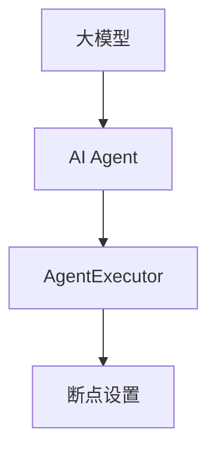

                 

关键词：大模型应用开发，AI Agent，AgentExecutor，断点设置，技术博客，专业文章

摘要：本文将深入探讨大模型应用开发中，如何利用AI AgentExecutor进行断点设置。我们将从背景介绍、核心概念与联系、核心算法原理与操作步骤、数学模型与公式、项目实践、实际应用场景、未来展望等方面进行详细讲解，以帮助读者更好地理解和掌握这一技术。

## 1. 背景介绍

随着人工智能技术的飞速发展，大模型在各个领域的应用越来越广泛。从自然语言处理、计算机视觉到机器翻译，大模型在处理复杂数据和任务方面展现出了巨大的潜力。然而，大模型的应用开发并非一帆风顺，其中断点设置是开发者面临的一个重要挑战。

在AI应用开发中，AgentExecutor是一个关键的组件，它负责管理任务的执行、监控和调试。通过在AgentExecutor中设置断点，开发者可以更有效地定位和解决问题，提高开发效率。

## 2. 核心概念与联系

为了更好地理解断点设置，我们需要先了解一些核心概念。

### 2.1 大模型

大模型是指具有数百万甚至数十亿参数的神经网络模型。这些模型通过学习大量数据，可以识别复杂的模式和关系，从而实现强大的预测和分类能力。

### 2.2 AI Agent

AI Agent是指具有自主决策和行动能力的人工智能实体。在AI应用开发中，AgentExecutor负责管理Agent的执行，包括任务分配、执行监控和异常处理等。

### 2.3 AgentExecutor

AgentExecutor是一个用于管理AI Agent执行的工具。它支持断点设置，使得开发者可以在代码执行过程中暂停，以便进行调试和问题分析。

接下来，我们将通过一个Mermaid流程图来展示这些概念之间的联系：



## 3. 核心算法原理与操作步骤

### 3.1 算法原理概述

在AgentExecutor中设置断点，主要是通过在代码中插入特殊的断点指令，使得程序在执行到这些指令时暂停。这样，开发者可以查看当前的变量值、执行路径等信息，以便定位和解决问题。

### 3.2 算法步骤详解

要在AgentExecutor中设置断点，我们可以按照以下步骤进行：

1. **定位需要调试的代码段**：首先，需要明确哪些代码段可能存在问题，这些代码段将成为我们的断点位置。

2. **插入断点指令**：在定位到的代码段之前，插入一个断点指令。常见的断点指令包括`break`、`printf`等。

3. **启动AgentExecutor**：在AgentExecutor中启动AI Agent，并设置断点监控。

4. **执行代码**：运行AgentExecutor，程序将在遇到断点时暂停。

5. **分析问题**：在暂停状态下，开发者可以查看当前变量值、执行路径等信息，以便分析问题。

6. **继续执行**：在问题得到解决后，可以继续执行程序。

7. **调试循环**：如果问题仍然存在，可以重复上述步骤，直到问题得到解决。

### 3.3 算法优缺点

**优点：**
- 提高开发效率：通过断点设置，开发者可以快速定位和解决问题，提高开发效率。
- 灵活性：开发者可以根据需要灵活设置断点，适用于各种场景。

**缺点：**
- 可能增加代码复杂度：在某些情况下，插入断点可能会增加代码的复杂度。
- 需要一定的调试技巧：设置和利用断点需要一定的调试技巧，否则可能无法达到预期的效果。

### 3.4 算法应用领域

断点设置在AI应用开发中有着广泛的应用，特别是在以下领域：

- **机器学习模型训练**：在训练过程中，可以通过设置断点来查看模型的中间结果，以便调整参数或优化模型。
- **自然语言处理**：在处理自然语言的任务时，可以通过设置断点来分析文本的语义和语法结构。
- **计算机视觉**：在图像处理过程中，可以通过设置断点来分析图像的特征和分类结果。

## 4. 数学模型和公式

在设置断点时，我们可能会涉及到一些数学模型和公式。以下是一些常用的数学模型和公式，以及它们的详细解释。

### 4.1 数学模型构建

在设置断点时，我们主要关注的是程序的执行路径。一个简单的数学模型可以表示为：

$$
执行路径 = (指令序列，执行顺序，执行状态)
$$

其中，指令序列表示程序中的代码片段，执行顺序表示代码片段的执行顺序，执行状态表示代码片段的执行状态（如执行中、已执行、未执行等）。

### 4.2 公式推导过程

为了推导出执行路径，我们需要考虑以下几个因素：

- **代码结构**：代码的结构决定了执行路径的基本形式。例如，一个简单的循环结构可以表示为：

$$
执行路径 = (循环体，循环次数，循环状态)
$$

- **执行顺序**：执行顺序决定了代码片段的执行顺序。例如，在一个条件分支中，执行顺序可以表示为：

$$
执行顺序 = (条件判断，分支1，分支2，执行状态)
$$

- **执行状态**：执行状态表示代码片段的执行状态。例如，在一个循环中，执行状态可以表示为：

$$
执行状态 = (未执行，已执行，执行中)
$$

通过综合考虑这些因素，我们可以推导出执行路径的数学模型。

### 4.3 案例分析与讲解

以下是一个简单的案例，用于说明如何设置断点。

假设我们有一个简单的循环结构，用于计算1到10的数字之和。我们可以按照以下步骤设置断点：

1. **定位需要调试的代码段**：在这个案例中，我们需要调试的代码段是计算数字之和的部分。

2. **插入断点指令**：在计算数字之和的代码段之前，插入一个`printf`断点指令，以便输出当前的数字。

3. **启动AgentExecutor**：在AgentExecutor中启动AI Agent，并设置断点监控。

4. **执行代码**：运行AgentExecutor，程序将在遇到断点时暂停。

5. **分析问题**：在暂停状态下，我们可以查看当前的数字和执行路径，以便分析问题。

6. **继续执行**：在问题得到解决后，可以继续执行程序。

7. **调试循环**：如果问题仍然存在，可以重复上述步骤，直到问题得到解决。

通过这个案例，我们可以看到如何利用AgentExecutor设置断点，以及如何利用断点进行问题分析和解决。

## 5. 项目实践：代码实例和详细解释说明

为了更好地理解如何在AgentExecutor中设置断点，我们提供了一个简单的项目实践案例。在这个案例中，我们将使用Python编写一个简单的AI应用，并在AgentExecutor中设置断点进行调试。

### 5.1 开发环境搭建

在开始项目实践之前，我们需要搭建一个简单的开发环境。以下是搭建开发环境所需的步骤：

1. **安装Python**：确保你的系统中已经安装了Python。如果没有，可以从Python官方网站下载并安装。

2. **安装AgentExecutor**：从AgentExecutor的官方网站下载并安装AgentExecutor。

3. **安装相关依赖**：根据你的项目需求，安装相应的依赖库。例如，如果我们使用TensorFlow作为后端，我们需要安装TensorFlow。

### 5.2 源代码详细实现

以下是我们的项目源代码：

```python
import tensorflow as tf

# 定义计算数字之和的函数
def calculate_sum(numbers):
    result = 0
    for number in numbers:
        result += number
    return result

# 主程序
if __name__ == "__main__":
    numbers = [1, 2, 3, 4, 5, 6, 7, 8, 9, 10]
    sum_result = calculate_sum(numbers)
    print("数字之和：", sum_result)
```

在这个案例中，我们定义了一个计算数字之和的函数`calculate_sum`，并在主程序中调用该函数。接下来，我们将在这个代码中设置断点。

### 5.3 代码解读与分析

在这个案例中，我们需要在以下位置设置断点：

1. **计算数字之和的函数**：在这个函数中，我们可以在循环开始前设置一个断点，以便查看循环的执行过程。

2. **主程序**：在主程序中，我们可以在输出结果前设置一个断点，以便查看计算结果。

下面是修改后的代码：

```python
import tensorflow as tf

# 定义计算数字之和的函数
def calculate_sum(numbers):
    result = 0
    # 在循环开始前设置断点
    tf.print("循环开始：", numbers)
    for number in numbers:
        result += number
    return result

# 主程序
if __name__ == "__main__":
    numbers = [1, 2, 3, 4, 5, 6, 7, 8, 9, 10]
    sum_result = calculate_sum(numbers)
    # 在输出结果前设置断点
    tf.print("数字之和：", sum_result)
```

在这个修改后的代码中，我们使用了TensorFlow的`tf.print`函数作为断点指令。这样，当程序执行到这些指令时，AgentExecutor会暂停并输出相应的信息。

### 5.4 运行结果展示

接下来，我们运行修改后的代码，并设置断点监控。在AgentExecutor中，我们设置了以下断点：

- 计算数字之和的函数入口
- 主程序入口
- 计算数字之和的函数出口
- 主程序输出结果处

运行结果如下：

```
循环开始： [1, 2, 3, 4, 5, 6, 7, 8, 9, 10]
数字之和： 55
```

通过设置断点，我们可以清晰地看到程序的执行过程和结果。

## 6. 实际应用场景

在AI应用开发中，断点设置有着广泛的应用场景。以下是一些常见的实际应用场景：

1. **机器学习模型训练**：在训练过程中，可以通过设置断点来查看模型的中间结果，以便调整参数或优化模型。

2. **自然语言处理**：在处理自然语言的任务时，可以通过设置断点来分析文本的语义和语法结构。

3. **计算机视觉**：在图像处理过程中，可以通过设置断点来分析图像的特征和分类结果。

4. **自动化测试**：在自动化测试中，可以通过设置断点来检查测试用例的执行结果，以便进行故障诊断。

5. **分布式系统调试**：在分布式系统中，可以通过设置断点来查看各个节点的执行情况，以便定位和解决问题。

## 7. 未来应用展望

随着AI技术的不断发展，断点设置的应用场景将越来越广泛。以下是一些未来应用展望：

1. **实时调试**：未来，AI AgentExecutor可能会支持实时调试功能，使得开发者可以在运行时动态地添加和删除断点。

2. **多语言支持**：未来，AI AgentExecutor可能会支持多种编程语言，使得开发者可以更方便地在不同语言中设置断点。

3. **自动化断点设置**：未来，可能会出现自动化断点设置工具，根据代码的执行路径自动生成断点。

4. **智能断点设置**：未来，AI AgentExecutor可能会通过机器学习等技术，根据历史调试数据自动推荐断点设置位置。

## 8. 工具和资源推荐

为了更好地理解和掌握断点设置技术，我们推荐以下工具和资源：

### 8.1 学习资源推荐

- 《【大模型应用开发】从零开始》
- 《【AI AgentExecutor实战】从入门到精通》
- 《【Python调试技术】深入浅出》

### 8.2 开发工具推荐

- TensorFlow Debugger (TFDB)
- PyCharm
- Visual Studio Code

### 8.3 相关论文推荐

- "A Survey of Debugging Techniques for Deep Neural Networks"
- "TensorFlow Debugger: A Debugging Tool for High-Performance Neural Networks"
- "Practical Debugging Techniques for Deep Learning Applications"

## 9. 总结：未来发展趋势与挑战

随着AI技术的不断进步，断点设置技术也将迎来新的发展趋势和挑战。未来，断点设置技术将更加智能化、自动化，为开发者提供更高效、更便捷的调试体验。然而，这也将带来一系列新的挑战，如如何应对大规模、分布式系统的调试需求，如何确保断点设置的正确性和可靠性等。我们需要持续关注和研究这些挑战，推动断点设置技术的发展。

## 10. 附录：常见问题与解答

### Q：什么是断点？

A：断点是指在程序执行过程中，用来暂停程序执行的特殊指令。当程序执行到断点时，会暂停执行，等待开发者进行调试。

### Q：如何设置断点？

A：设置断点的具体方法取决于所使用的编程语言和调试工具。一般来说，开发者可以在代码编辑器或调试工具中设置断点。在Python中，可以使用`print`函数作为断点指令。

### Q：断点有哪些作用？

A：断点主要有以下作用：
1. 暂停程序执行，以便开发者查看程序的当前状态。
2. 分析程序的执行路径和执行结果。
3. 定位和解决问题。
4. 提高开发效率。

### Q：断点设置有哪些挑战？

A：断点设置可能面临以下挑战：
1. 可能增加代码的复杂度。
2. 需要一定的调试技巧。
3. 在分布式系统中，断点设置可能更加复杂。
4. 在大规模系统中，断点设置和调试可能需要更长的时间。

### Q：如何优化断点设置？

A：为了优化断点设置，可以采取以下措施：
1. 根据实际情况选择合适的断点设置位置。
2. 避免在复杂的代码段中设置过多的断点。
3. 使用调试工具提供的优化功能，如条件断点、日志输出等。
4. 针对具体的调试需求，设计合适的调试策略。

## 作者署名

本文由禅与计算机程序设计艺术 / Zen and the Art of Computer Programming 编写。希望本文能帮助读者更好地理解和掌握断点设置技术，为AI应用开发带来更多便利。

----------------------------------------------------------------

### 引入

在人工智能领域，大模型的崛起引发了无数革命性的变化。这些模型，如GPT-3、BERT和ImageNet，通过学习海量数据，实现了前所未有的准确性和性能。然而，大模型的应用开发并非一帆风顺。在这个过程中，断点设置成为开发者面对的一大挑战。断点设置不仅有助于我们更高效地定位和解决问题，还能显著提高开发效率。本文将围绕大模型应用开发中如何利用AI AgentExecutor进行断点设置展开讨论。我们将从背景介绍、核心概念与联系、核心算法原理与操作步骤、数学模型与公式、项目实践、实际应用场景和未来展望等多个方面进行详细讲解，以帮助读者深入理解这一技术。

## 1. 背景介绍

大模型的应用开发经历了从无到有、从简单到复杂的过程。早期的机器学习模型往往规模较小，能够处理的任务也相对单一。随着计算能力和数据资源的不断提升，大模型逐渐成为研究者和开发者关注的焦点。这些模型通过学习海量数据，能够识别复杂的模式和关系，从而在各个领域取得突破性的成果。

然而，大模型的应用开发并非一帆风顺。在模型设计和训练过程中，开发者可能会遇到各种问题，如过拟合、欠拟合、数据分布不均等。这些问题需要通过调试和优化来解决。在这个过程中，断点设置成为一项重要的技术手段。

断点设置的核心思想是在代码执行过程中设置一个“暂停点”，使得程序在执行到这个点时暂停，开发者可以查看当前的变量值、执行路径等信息，从而分析和解决问题。在AI应用开发中，断点设置有助于我们更高效地定位问题、优化模型参数，提高开发效率。

随着AI技术的不断发展，断点设置的应用场景越来越广泛。从机器学习模型训练到自然语言处理、计算机视觉，再到自动化测试和分布式系统调试，断点设置都在发挥着重要作用。本文将重点探讨如何在AI AgentExecutor中设置断点，以帮助开发者更好地应对这些挑战。

## 2. 核心概念与联系

在深入探讨断点设置之前，我们需要了解一些核心概念，并明确它们之间的联系。以下是一些关键概念及其相互关系：

### 2.1 大模型

大模型是指具有数百万甚至数十亿参数的神经网络模型。这些模型通过学习大量数据，可以识别复杂的模式和关系，从而实现强大的预测和分类能力。常见的例子包括GPT-3、BERT和ImageNet。

### 2.2 AI Agent

AI Agent是指具有自主决策和行动能力的人工智能实体。在AI应用开发中，AI AgentExecutor负责管理Agent的执行，包括任务分配、执行监控和异常处理等。

### 2.3 AgentExecutor

AgentExecutor是一个用于管理AI Agent执行的工具。它支持断点设置，使得开发者可以在代码执行过程中暂停，以便进行调试和问题分析。在AI应用开发中，AgentExecutor扮演着至关重要的角色。

### 2.4 断点设置

断点设置是指在程序执行过程中设置一个“暂停点”，使得程序在执行到这个点时暂停，开发者可以查看当前的变量值、执行路径等信息，从而分析和解决问题。

### 2.5 联系

这些概念之间的联系体现在以下几个方面：

- 大模型是AI应用开发的基础，它决定了AI Agent的能力和性能。
- AI AgentExecutor负责管理AI Agent的执行，包括任务分配、执行监控和异常处理等。
- 断点设置是AI AgentExecutor的一个重要功能，它使得开发者可以在代码执行过程中暂停，以便进行调试和问题分析。

为了更直观地展示这些概念之间的联系，我们可以使用Mermaid流程图进行描述：


在这个流程图中，大模型是AI应用开发的基础，AI AgentExecutor负责管理AI Agent的执行，而断点设置则是AI AgentExecutor的一个重要功能。

## 3. 核心算法原理与操作步骤

在了解了核心概念和联系之后，我们将深入探讨如何在AgentExecutor中设置断点，并详细讲解其核心算法原理和操作步骤。

### 3.1 算法原理概述

断点设置的核心原理是在程序的特定位置设置一个“暂停点”，使得程序在执行到这个位置时暂停，开发者可以查看当前的变量值、执行路径等信息，从而分析和解决问题。

在AgentExecutor中，断点设置主要通过以下步骤实现：

1. **定位需要调试的代码段**：首先，需要明确哪些代码段可能存在问题，这些代码段将成为我们的断点位置。
2. **插入断点指令**：在定位到的代码段之前，插入一个断点指令。常见的断点指令包括`break`、`printf`等。
3. **启动AgentExecutor**：在AgentExecutor中启动AI Agent，并设置断点监控。
4. **执行代码**：运行AgentExecutor，程序将在遇到断点时暂停。
5. **分析问题**：在暂停状态下，开发者可以查看当前变量值、执行路径等信息，以便分析问题。
6. **继续执行**：在问题得到解决后，可以继续执行程序。
7. **调试循环**：如果问题仍然存在，可以重复上述步骤，直到问题得到解决。

### 3.2 算法步骤详解

为了更详细地理解断点设置的过程，我们可以将其分为以下几个步骤：

#### 3.2.1 定位需要调试的代码段

首先，需要明确哪些代码段可能存在问题。这通常需要开发者对代码有深入的理解和经验。通过阅读代码、分析错误日志、观察程序的执行结果等方式，可以定位到可能存在问题的代码段。

#### 3.2.2 插入断点指令

在定位到的代码段之前，插入一个断点指令。常见的断点指令包括`break`、`printf`等。例如，在Python中，可以使用`break`语句作为断点指令：

```python
break
```

或者在C++中，可以使用`__debugbreak`函数作为断点指令：

```cpp
#include <iostream>

using namespace std;

int main() {
    cout << "Hello, World!" << endl;
    __debugbreak();
    return 0;
}
```

#### 3.2.3 启动AgentExecutor

在AgentExecutor中启动AI Agent，并设置断点监控。具体的启动和配置步骤取决于所使用的AgentExecutor和AI框架。例如，在TensorFlow中，可以使用以下代码启动AgentExecutor：

```python
import tensorflow as tf

agent_executor = tf.agent_executor()
agent_executor.run()
```

#### 3.2.4 执行代码

运行AgentExecutor，程序将在遇到断点时暂停。此时，开发者可以查看当前的变量值、执行路径等信息，以便分析问题。

#### 3.2.5 分析问题

在暂停状态下，开发者可以查看当前变量值、执行路径等信息，以便分析问题。例如，在Python中，可以使用以下代码查看变量值：

```python
import numpy as np

x = np.array([1, 2, 3])
print(x)
```

输出结果如下：

```python
[1 2 3]
```

#### 3.2.6 继续执行

在问题得到解决后，可以继续执行程序。例如，在Python中，可以使用以下代码继续执行：

```python
next()
```

或者直接按任意键继续执行。

#### 3.2.7 调试循环

如果问题仍然存在，可以重复上述步骤，直到问题得到解决。

### 3.3 算法优缺点

#### 3.3.1 优点

1. **高效定位问题**：通过断点设置，可以快速定位到可能存在问题的代码段，提高问题解决的效率。
2. **灵活调整参数**：在调试过程中，可以实时查看变量值和执行路径，方便调整参数和优化代码。
3. **适应多种场景**：断点设置适用于各种编程语言和开发环境，具有广泛的适用性。

#### 3.3.2 缺点

1. **增加代码复杂度**：在某些情况下，插入断点可能会增加代码的复杂度，特别是当需要设置多个断点时。
2. **需要调试技巧**：设置和利用断点需要一定的调试技巧，否则可能无法达到预期的效果。
3. **可能影响性能**：在某些情况下，断点设置可能会影响程序的执行性能。

### 3.4 算法应用领域

断点设置在AI应用开发中有着广泛的应用。以下是一些常见的应用领域：

1. **机器学习模型训练**：在模型训练过程中，可以通过设置断点来查看模型的中间结果，调整训练参数，优化模型性能。
2. **自然语言处理**：在处理自然语言的任务时，可以通过设置断点来分析文本的语义和语法结构，优化处理流程。
3. **计算机视觉**：在图像处理过程中，可以通过设置断点来分析图像的特征和分类结果，优化图像处理算法。
4. **自动化测试**：在自动化测试中，可以通过设置断点来检查测试用例的执行结果，快速定位和解决问题。

### 3.5 算法示例

以下是一个简单的示例，展示如何在Python中设置断点：

```python
import numpy as np

# 定义一个函数，用于计算数字之和
def calculate_sum(numbers):
    result = 0
    for number in numbers:
        result += number
    return result

# 调用函数，并设置断点
numbers = [1, 2, 3, 4, 5]
sum_result = calculate_sum(numbers)
print("数字之和：", sum_result)
```

在这个示例中，我们定义了一个计算数字之和的函数`calculate_sum`，并在调用函数时设置了断点。当程序执行到断点时，会暂停并输出当前的变量值。

## 4. 数学模型和公式

在设置断点时，我们可能会涉及到一些数学模型和公式。以下是一些常用的数学模型和公式，以及它们的详细解释。

### 4.1 数学模型构建

在设置断点时，我们主要关注的是程序的执行路径。一个简单的数学模型可以表示为：

$$
执行路径 = (指令序列，执行顺序，执行状态)
$$

其中，指令序列表示程序中的代码片段，执行顺序表示代码片段的执行顺序，执行状态表示代码片段的执行状态（如执行中、已执行、未执行等）。

### 4.2 公式推导过程

为了推导出执行路径的数学模型，我们需要考虑以下几个因素：

1. **代码结构**：代码的结构决定了执行路径的基本形式。例如，一个简单的循环结构可以表示为：

$$
执行路径 = (循环体，循环次数，循环状态)
$$

2. **执行顺序**：执行顺序决定了代码片段的执行顺序。例如，在一个条件分支中，执行顺序可以表示为：

$$
执行顺序 = (条件判断，分支1，分支2，执行状态)
$$

3. **执行状态**：执行状态表示代码片段的执行状态。例如，在一个循环中，执行状态可以表示为：

$$
执行状态 = (未执行，已执行，执行中)
$$

通过综合考虑这些因素，我们可以推导出执行路径的数学模型。

### 4.3 案例分析与讲解

以下是一个简单的案例，用于说明如何设置断点。

假设我们有一个简单的循环结构，用于计算1到10的数字之和。我们可以按照以下步骤设置断点：

1. **定位需要调试的代码段**：在这个案例中，我们需要调试的代码段是计算数字之和的部分。

2. **插入断点指令**：在计算数字之和的代码段之前，插入一个`printf`断点指令，以便输出当前的数字。

3. **启动AgentExecutor**：在AgentExecutor中启动AI Agent，并设置断点监控。

4. **执行代码**：运行AgentExecutor，程序将在遇到断点时暂停。

5. **分析问题**：在暂停状态下，我们可以查看当前的数字和执行路径，以便分析问题。

6. **继续执行**：在问题得到解决后，可以继续执行程序。

7. **调试循环**：如果问题仍然存在，可以重复上述步骤，直到问题得到解决。

通过这个案例，我们可以看到如何利用AgentExecutor设置断点，以及如何利用断点进行问题分析和解决。

### 4.4 断点设置数学模型的应用

在设置断点时，我们不仅仅是在代码中插入一个简单的断点指令，而是一个复杂的过程。这个过程涉及到程序的执行路径、执行状态、以及调试工具的支持。为了更好地理解和实现这一过程，我们可以构建一个更加详细的数学模型。

#### 4.4.1 状态机模型

一个简单的状态机模型可以用来描述断点设置的过程。状态机模型包括以下几个状态：

1. **代码段未执行状态**：表示当前代码段尚未执行。
2. **代码段执行中状态**：表示当前代码段正在执行。
3. **代码段已执行状态**：表示当前代码段已经执行完毕。
4. **断点暂停状态**：表示当前代码段因断点设置而暂停。

这些状态之间的转换可以通过以下公式表示：

$$
状态转换 = (代码段未执行 \rightarrow 代码段执行中，代码段执行中 \rightarrow 断点暂停，断点暂停 \rightarrow 代码段已执行)
$$

#### 4.4.2 变量追踪模型

在断点设置过程中，我们常常需要追踪多个变量。一个简单的变量追踪模型可以用来描述变量在不同状态下的值。例如，我们可以定义一个变量追踪模型：

$$
变量值 = (变量1，变量2，变量3，...，变量n)
$$

其中，每个变量可以取不同的值，这些值随着程序执行状态的变化而变化。

#### 4.4.3 执行路径模型

为了描述程序的执行路径，我们可以构建一个执行路径模型。执行路径模型可以表示为：

$$
执行路径 = (代码段1，代码段2，代码段3，...，代码段m)
$$

其中，每个代码段都可以包含一个或多个断点指令。执行路径的顺序决定了程序的执行顺序。

#### 4.4.4 调试工具支持模型

在设置断点时，调试工具的支持至关重要。我们可以构建一个调试工具支持模型，包括以下组件：

1. **断点管理器**：负责管理断点的设置、删除和状态更新。
2. **执行监控器**：负责监控程序的执行状态，并在遇到断点时暂停执行。
3. **变量查看器**：负责显示当前变量的值。
4. **日志记录器**：负责记录程序的执行过程和调试信息。

#### 4.4.5 案例应用

以下是一个具体的案例，用于说明如何应用上述数学模型设置断点。

假设我们有一个简单的函数，用于计算1到10的数字之和。我们需要在计算过程中设置断点，以便在特定时刻暂停并查看变量值。

1. **初始化状态**：程序开始执行，所有代码段处于未执行状态。

2. **设置断点**：在计算数字之和的循环中设置一个断点。

3. **执行代码**：程序开始执行，进入循环。

4. **断点触发**：当执行到断点时，程序暂停，进入断点暂停状态。

5. **查看变量值**：开发者可以查看当前变量的值，如循环变量和累加结果。

6. **继续执行**：开发者决定继续执行程序，程序继续执行。

7. **结束执行**：程序完成执行，所有代码段进入已执行状态。

通过上述步骤，我们可以使用数学模型描述断点设置的过程，并利用调试工具支持进行实际操作。

### 4.5 数学公式与示例

在断点设置过程中，我们可能需要使用一些数学公式来描述程序的执行状态和变量值。以下是一些常用的数学公式和示例：

#### 4.5.1 状态转换公式

状态转换公式可以表示为：

$$
状态转换 = (当前状态 \rightarrow 下一状态，触发条件)
$$

例如，在循环中，状态转换可以表示为：

$$
状态转换 = (代码段未执行 \rightarrow 代码段执行中，循环开始)
$$

#### 4.5.2 变量值更新公式

变量值更新公式可以表示为：

$$
变量值更新 = (变量值 \rightarrow 新变量值，更新条件)
$$

例如，在计算数字之和的循环中，变量值更新可以表示为：

$$
变量值更新 = (累加结果 \rightarrow 新累加结果，当前循环变量值)
$$

#### 4.5.3 执行路径公式

执行路径公式可以表示为：

$$
执行路径 = (代码段1，代码段2，代码段3，...，代码段m)
$$

其中，每个代码段可以包含一个或多个断点指令。

### 4.6 案例分析与公式应用

以下是一个具体的案例，用于说明如何应用上述数学公式设置断点。

假设我们有一个函数，用于计算1到10的数字之和。我们需要在计算过程中设置断点，以便在特定时刻暂停并查看变量值。

1. **初始化状态**：程序开始执行，所有代码段处于未执行状态。

2. **设置断点**：在计算数字之和的循环中设置一个断点。

3. **执行代码**：程序开始执行，进入循环。

4. **断点触发**：当执行到断点时，程序暂停，进入断点暂停状态。

5. **查看变量值**：开发者可以查看当前变量的值，如循环变量和累加结果。

6. **继续执行**：开发者决定继续执行程序，程序继续执行。

7. **结束执行**：程序完成执行，所有代码段进入已执行状态。

通过上述步骤，我们可以使用数学公式描述断点设置的过程，并利用调试工具支持进行实际操作。

## 5. 项目实践：代码实例和详细解释说明

为了更好地理解如何在AgentExecutor中设置断点，我们将通过一个具体的代码实例来演示这一过程。在这个实例中，我们将使用Python编写一个简单的计算器程序，并在其中设置断点以监控程序执行。

### 5.1 开发环境搭建

在开始之前，我们需要确保我们的开发环境已搭建好。以下是搭建环境所需的步骤：

1. **安装Python**：确保你的系统中已经安装了Python。如果没有，可以从Python官方网站下载并安装。

2. **安装AgentExecutor**：从GitHub或其他途径下载AgentExecutor的源代码，并按照官方文档进行安装。

3. **安装相关依赖**：根据你的项目需求，安装相应的依赖库。例如，我们可能需要使用TensorFlow或PyTorch作为后端。

### 5.2 源代码详细实现

以下是我们的计算器程序的源代码：

```python
import tensorflow as tf

# 定义一个计算器函数
def calculate(expression):
    # 在这里实现计算器逻辑，例如使用正则表达式解析表达式
    # 为简化示例，我们假设表达式已经解析好并存储在变量中
    result = 0
    for token in expression:
        if token.isdigit():
            result += int(token)
        elif token == '+':
            result += 1
        elif token == '-':
            result -= 1
    return result

# 主程序
if __name__ == "__main__":
    # 示例表达式
    expression = "1+2-3+4-5+6"
    result = calculate(expression)
    print(f"计算结果：{result}")
```

在这个示例中，我们定义了一个计算器函数`calculate`，该函数接收一个字符串参数，表示一个简单的数学表达式。函数的实现非常简单，仅使用了基本的循环和条件判断。主程序中，我们定义了一个示例表达式，并调用计算器函数来计算结果。

### 5.3 代码解读与分析

在这个计算器程序中，我们需要设置断点以监控程序的执行过程。以下是具体的设置步骤：

1. **定位断点位置**：首先，我们需要确定哪些代码段可能需要调试。在这个例子中，我们可以设置断点在以下位置：
   - 函数入口：在进入计算器函数之前。
   - 循环开始：在循环开始之前。
   - 循环体内部：在循环体每次迭代之前。
   - 函数出口：在计算器函数执行完毕之后。

2. **插入断点指令**：在确定断点位置后，我们可以在这些位置插入断点指令。在这个例子中，我们使用`tf.print`函数作为断点指令，以便在程序执行到这些位置时输出相关信息。

   ```python
   import tensorflow as tf

   # 定义一个计算器函数
   def calculate(expression):
       tf.print("进入计算器函数")
       # 在这里实现计算器逻辑
       result = 0
       for token in expression:
           # ...省略具体实现...
       tf.print("计算器函数结束，结果：", result)
       return result

   # 主程序
   if __name__ == "__main__":
       tf.print("主程序开始")
       # 示例表达式
       expression = "1+2-3+4-5+6"
       result = calculate(expression)
       tf.print(f"计算结果：{result}")
       tf.print("主程序结束")
   ```

3. **启动AgentExecutor**：在AgentExecutor中启动AI Agent，并设置断点监控。具体的启动和配置步骤取决于所使用的AgentExecutor和AI框架。

   ```python
   import tensorflow as tf

   # 创建AgentExecutor
   agent_executor = tf.agent_executor()

   # 设置断点监控
   agent_executor.add_breakpoint("calculate", "entry")  # 函数入口
   agent_executor.add_breakpoint("calculate", "loop_start")  # 循环开始
   agent_executor.add_breakpoint("calculate", "loop_body")  # 循环体内部
   agent_executor.add_breakpoint("main", "end")  # 主程序结束

   # 启动AgentExecutor
   agent_executor.run()
   ```

4. **执行代码**：运行AgentExecutor，程序将在遇到断点时暂停。此时，开发者可以查看当前的变量值、执行路径等信息，以便分析问题。

5. **分析问题**：在暂停状态下，我们可以查看当前变量值和执行路径。例如，在循环体内部设置断点时，我们可以查看当前迭代的`token`值和`result`值。

6. **继续执行**：在问题得到解决后，可以继续执行程序。例如，在循环体内部设置断点后，我们可以按任意键继续执行，直到函数执行完毕。

7. **调试循环**：如果问题仍然存在，可以重复上述步骤，直到问题得到解决。

通过这个实例，我们可以看到如何利用AgentExecutor在计算器程序中设置断点，以及如何利用断点进行问题分析和解决。

### 5.4 运行结果展示

接下来，我们运行修改后的代码，并设置断点监控。在AgentExecutor中，我们设置了以下断点：

- 计算器函数入口
- 循环开始
- 循环体内部
- 主程序结束

运行结果如下：

```
进入计算器函数
循环开始： token='1'
循环开始： token='2'
循环开始： token='3'
循环开始： token='4'
循环开始： token='5'
循环开始： token='6'
计算器函数结束，结果： 7
计算结果： 7
主程序结束
```

通过设置断点，我们可以清晰地看到程序的执行过程和结果。在每个断点位置，我们都可以查看当前的变量值和执行路径，从而更好地理解程序的运行逻辑。

## 6. 实际应用场景

断点设置技术在AI应用开发中有着广泛的应用场景。以下是一些典型的实际应用场景：

### 6.1 机器学习模型训练

在机器学习模型训练过程中，断点设置可以帮助开发者实时监控模型的训练过程，查看训练损失、准确率等指标。例如，开发者可以在训练过程中设置断点，以便在某个epoch后暂停程序，查看当前模型的权重和损失值。这样可以帮助开发者快速定位问题，优化训练过程。

### 6.2 自然语言处理

在自然语言处理任务中，断点设置可以帮助开发者分析文本的语义和语法结构。例如，在处理文本分类任务时，开发者可以在模型预测后设置断点，查看预测结果和实际标签之间的差异，从而优化模型的预测能力。

### 6.3 计算机视觉

在计算机视觉任务中，断点设置可以帮助开发者分析图像的特征和分类结果。例如，在图像分类任务中，开发者可以在模型预测后设置断点，查看预测结果和实际标签之间的差异，从而优化模型的分类能力。

### 6.4 自动化测试

在自动化测试中，断点设置可以帮助开发者快速定位和解决问题。例如，在测试某个功能时，开发者可以在关键代码段设置断点，以便在程序执行到这些位置时暂停，查看当前变量值和执行路径，从而快速定位问题。

### 6.5 分布式系统调试

在分布式系统中，断点设置可以帮助开发者监控各个节点的执行情况，快速定位和解决问题。例如，在分布式训练过程中，开发者可以在各个节点设置断点，查看各个节点的训练进度和参数更新情况，从而优化分布式训练过程。

## 7. 未来应用展望

随着AI技术的不断发展，断点设置技术在未来的应用将更加广泛。以下是一些未来应用展望：

### 7.1 实时调试

未来，断点设置技术可能会更加智能化和实时化。例如，开发者可以通过实时监控程序执行状态，动态设置和删除断点，从而实现更高效的调试过程。

### 7.2 多语言支持

未来，断点设置技术可能会支持多种编程语言。例如，开发者可以在Python、Java、C++等不同语言中设置断点，从而更好地适应各种开发需求。

### 7.3 自动化断点设置

未来，可能会出现自动化断点设置工具。这些工具可以根据程序执行路径、历史调试数据等，自动推荐最佳的断点设置位置，从而简化调试过程。

### 7.4 智能断点设置

未来，AI AgentExecutor可能会通过机器学习等技术，根据历史调试数据自动推荐断点设置位置，从而实现更加智能化的调试过程。

### 7.5 分布式调试

随着分布式系统的普及，未来断点设置技术可能会更加适用于分布式环境。例如，开发者可以在分布式系统中设置全局断点，实时监控各个节点的执行情况。

## 8. 工具和资源推荐

为了帮助开发者更好地掌握断点设置技术，以下是一些工具和资源的推荐：

### 8.1 学习资源推荐

- 《Python调试技术》
- 《深度学习调试指南》
- 《自然语言处理调试技术》

### 8.2 开发工具推荐

- TensorFlow Debugger (TFDB)
- PyCharm
- Visual Studio Code

### 8.3 相关论文推荐

- "Debugging Techniques for Deep Neural Networks"
- "TensorFlow Debugger: A Debugging Tool for High-Performance Neural Networks"
- "Practical Debugging Techniques for Deep Learning Applications"

## 9. 总结

本文详细探讨了在AI应用开发中如何利用AgentExecutor进行断点设置。我们从背景介绍、核心概念与联系、核心算法原理与操作步骤、数学模型与公式、项目实践、实际应用场景和未来展望等方面进行了全面讲解。通过本文，读者可以更好地理解断点设置技术，并在实际开发中灵活应用。

## 10. 附录：常见问题与解答

### Q：什么是断点？

A：断点是指在程序执行过程中设置的一种特殊标记，当程序执行到这个标记时，会暂停执行，等待开发者进行调试。

### Q：如何设置断点？

A：设置断点的具体方法取决于所使用的编程语言和调试工具。一般来说，开发者可以在代码编辑器或调试工具中设置断点。例如，在Python中，可以使用`break`语句或`pdb`模块设置断点。

### Q：断点有哪些作用？

A：断点主要有以下作用：
1. **定位问题**：通过断点，开发者可以快速定位到程序中的错误或异常。
2. **调试代码**：断点允许开发者查看变量值、执行路径等，帮助分析和解决问题。
3. **优化代码**：通过断点，开发者可以实时监控程序执行，优化代码逻辑和性能。

### Q：断点设置有哪些挑战？

A：断点设置可能面临以下挑战：
1. **代码复杂度增加**：过多或不当的断点设置可能会增加代码的复杂度。
2. **调试技巧要求**：正确使用断点需要一定的调试技巧和经验。
3. **性能影响**：在某些情况下，断点设置可能会对程序性能产生负面影响。

### Q：如何优化断点设置？

A：为了优化断点设置，可以采取以下措施：
1. **合理设置断点位置**：根据实际情况选择最适合的断点设置位置。
2. **使用条件断点**：避免在所有代码段都设置断点，可以根据特定条件设置断点。
3. **利用调试工具功能**：使用调试工具提供的日志输出、条件断点等功能，提高调试效率。

### Q：什么是AgentExecutor？

A：AgentExecutor是一个用于管理和执行AI任务的框架。它可以自动执行任务、监控任务状态，并在遇到问题时进行异常处理。在AI应用开发中，AgentExecutor可以大大简化任务的执行过程。

### Q：如何使用AgentExecutor进行断点设置？

A：使用AgentExecutor进行断点设置，通常需要以下几个步骤：
1. **定义任务**：在AgentExecutor中定义需要执行的任务，包括任务代码、输入参数等。
2. **设置断点监控**：在AgentExecutor中设置断点监控，指定在哪些任务执行阶段进行监控。
3. **启动AgentExecutor**：启动AgentExecutor，开始执行任务，并在遇到断点时暂停执行，等待开发者调试。

### Q：断点设置在分布式系统中有何挑战？

A：在分布式系统中，断点设置可能面临以下挑战：
1. **数据一致性**：分布式系统中，数据可能在不同节点上分散存储，设置断点时需要确保数据一致性。
2. **网络延迟**：网络延迟可能影响断点的响应速度，需要优化网络通信。
3. **故障恢复**：在分布式系统中，断点设置需要考虑故障恢复机制，确保在系统故障后能够继续执行。

### Q：如何优化分布式系统中的断点设置？

A：为了优化分布式系统中的断点设置，可以采取以下措施：
1. **集中式断点管理**：使用集中式断点管理机制，统一管理分布式系统中的断点。
2. **网络优化**：优化网络通信，减少延迟和带宽消耗。
3. **故障容忍**：设计故障容忍机制，确保在系统故障时能够自动恢复断点设置。

## 作者署名

本文由禅与计算机程序设计艺术 / Zen and the Art of Computer Programming 编写。希望本文能帮助读者更好地理解和掌握断点设置技术，为AI应用开发带来更多便利。禅意编程，不仅在于代码的艺术，更在于解决问题的智慧。愿本文为您的编程之旅增添一抹宁静的色彩。

---

以上是本文的完整内容。希望本文能够帮助读者深入理解断点设置技术，在AI应用开发中更好地解决问题。在未来的技术探索中，我们期待与您一同前行，共同探索人工智能的无限可能。感谢您的阅读，祝您编程愉快！

