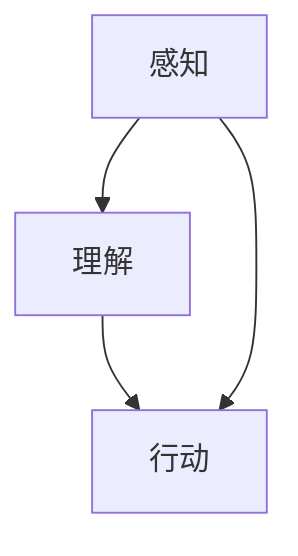

                 

关键词：大模型应用、AI Agent、ReAct框架、自然语言处理、编程实践

摘要：本文将介绍如何利用ReAct框架，实现一个简单的AI Agent。我们将从ReAct框架的背景介绍、核心概念与联系，到核心算法原理与具体操作步骤，再到数学模型和公式讲解以及项目实践，详细探讨大模型应用开发过程中的关键技术和实践。

## 1. 背景介绍

在当今人工智能迅猛发展的时代，人工智能（AI）已经渗透到我们生活的方方面面。从自动驾驶、智能家居到医疗诊断、金融服务，AI正在改变着我们的生活方式和工作模式。而AI Agent作为人工智能的一个重要分支，正在逐渐成为实现人机交互、自动化决策的重要工具。

ReAct框架（Reactive Agent Framework）是一个用于构建简单AI Agent的框架。它基于反应性设计原则，使得Agent能够快速响应环境变化，进行自适应的决策和行为。ReAct框架具有模块化、可扩展和易于实现的特点，使得开发者能够快速搭建简单的AI Agent，从而更好地理解和应用人工智能技术。

本文将围绕ReAct框架，详细介绍如何实现一个简单的AI Agent。通过本文的讲解和实践，读者将能够了解AI Agent的基本原理和实现方法，为后续更复杂的应用开发打下基础。

## 2. 核心概念与联系

### 2.1 AI Agent的基本概念

AI Agent（人工智能代理）是指能够模拟人类智能行为的计算机程序。它具备感知、理解、决策和行动等能力，能够在特定环境下自主执行任务，实现自动化和智能化。AI Agent的核心目标是实现人机交互、自动化决策和智能服务。

### 2.2 ReAct框架的核心概念

ReAct框架的核心概念是反应性设计。反应性设计是一种面向对象的设计方法，它将Agent的行为划分为感知、理解和行动三个阶段，使得Agent能够快速响应环境变化，进行自适应的决策和行为。

1. **感知（Perception）**：Agent通过感知模块获取环境信息，例如视觉、听觉、触觉等。感知模块需要将感知到的信息转换为内部表示，以便后续处理。

2. **理解（Understanding）**：Agent通过理解模块对感知到的信息进行分析和处理，识别出环境中的目标、事件和状态等。理解模块通常包括知识库、推理机等组件。

3. **行动（Action）**：Agent通过行动模块根据理解结果生成行动，实现目标。行动模块需要根据当前环境和目标，选择合适的动作，并执行相应的操作。

### 2.3 核心概念之间的联系

ReAct框架通过感知、理解和行动三个模块，将AI Agent的基本概念和反应性设计方法有机地结合起来。感知模块负责获取环境信息，理解模块负责分析和处理感知信息，行动模块负责根据理解结果执行行动。这三个模块相互协作，共同实现AI Agent的智能行为。

### 2.4 Mermaid流程图



在该流程图中，感知模块（A）和理解模块（B）相互协作，共同驱动行动模块（C），实现AI Agent的智能行为。

## 3. 核心算法原理 & 具体操作步骤

### 3.1 算法原理概述

ReAct框架的核心算法原理基于反应性设计。该设计方法将Agent的行为划分为感知、理解和行动三个阶段，使得Agent能够快速响应环境变化，进行自适应的决策和行为。以下是ReAct框架的核心算法原理：

1. **感知阶段**：Agent通过感知模块获取环境信息，如视觉、听觉、触觉等。感知模块需要将感知到的信息转换为内部表示，以便后续处理。

2. **理解阶段**：Agent通过理解模块对感知到的信息进行分析和处理，识别出环境中的目标、事件和状态等。理解模块通常包括知识库、推理机等组件。

3. **行动阶段**：Agent通过行动模块根据理解结果生成行动，实现目标。行动模块需要根据当前环境和目标，选择合适的动作，并执行相应的操作。

### 3.2 算法步骤详解

1. **初始化**：创建感知、理解和行动模块，初始化相关参数。

2. **感知**：Agent通过感知模块获取环境信息，例如使用摄像头获取图像、使用麦克风获取声音等。

3. **处理感知信息**：将感知到的信息转换为内部表示，例如将图像转换为像素矩阵、将声音转换为频谱等。

4. **理解**：使用理解模块对处理后的感知信息进行分析和处理，例如使用图像识别算法识别图像中的物体、使用语音识别算法识别声音中的词语等。

5. **决策**：根据理解结果生成行动，例如选择合适的动作，如移动、交互等。

6. **执行行动**：根据决策结果执行相应的操作，例如移动到目标位置、与目标物体进行交互等。

7. **反馈**：将行动的结果返回给感知模块，用于更新环境模型。

### 3.3 算法优缺点

**优点**：

1. **快速响应**：基于反应性设计，Agent能够快速响应环境变化，进行自适应的决策和行为。

2. **模块化**：感知、理解和行动模块相互独立，易于扩展和修改。

3. **可复用性**：ReAct框架具有通用性，适用于多种应用场景。

**缺点**：

1. **计算复杂度**：由于需要实时处理感知信息，算法的实时性可能会受到一定的影响。

2. **适应性有限**：反应性设计适用于静态或变化缓慢的环境，对于复杂和动态的环境，可能需要引入更多的算法和策略。

### 3.4 算法应用领域

ReAct框架适用于多种应用场景，如：

1. **人机交互**：通过感知模块获取用户输入，理解模块分析用户意图，行动模块执行相应操作，实现智能客服、语音助手等功能。

2. **自动驾驶**：通过感知模块获取车辆周围环境信息，理解模块分析交通情况，行动模块控制车辆行驶。

3. **智能家居**：通过感知模块获取家庭设备状态，理解模块分析用户需求，行动模块控制家庭设备。

## 4. 数学模型和公式 & 详细讲解 & 举例说明

### 4.1 数学模型构建

在ReAct框架中，数学模型主要用于描述感知、理解和行动模块的算法过程。以下是一个简单的数学模型示例：

1. **感知阶段**：

   假设Agent通过摄像头获取一个二维图像，表示为矩阵$X$，其中$X_{ij}$表示图像中第$i$行第$j$列的像素值。

   $$X = \begin{bmatrix} X_{11} & X_{12} & \cdots & X_{1n} \\ X_{21} & X_{22} & \cdots & X_{2n} \\ \vdots & \vdots & \ddots & \vdots \\ X_{m1} & X_{m2} & \cdots & X_{mn} \end{bmatrix}$$

2. **理解阶段**：

   假设Agent使用图像识别算法，将图像中的物体分类为$k$个类别，分别为$C_1, C_2, \ldots, C_k$。每个类别对应一个概率分布$P(C_i)$，表示图像属于类别$i$的概率。

   $$P(C_i) = \frac{1}{Z} \exp(-\frac{1}{2} \sum_{x \in X} (x - \mu_i)^T \Sigma_i^{-1} (x - \mu_i))$$

   其中，$Z$为归一化常数，$\mu_i$和$\Sigma_i$分别为类别$i$的均值向量和协方差矩阵。

3. **行动阶段**：

   假设Agent根据理解结果选择一个动作$a$，其对应的概率分布为$P(a)$。选择动作时，Agent通常采用最大化期望收益的策略。

   $$a^* = \arg\max_a \sum_{i=1}^k P(C_i) \cdot R(C_i, a)$$

   其中，$R(C_i, a)$为在类别$i$下执行动作$a$的收益。

### 4.2 公式推导过程

以下是对上述数学模型公式的推导过程：

1. **感知阶段**：

   假设图像中的每个像素值$x$服从高斯分布，其概率密度函数为：

   $$f(x|\mu, \Sigma) = \frac{1}{(2\pi)^{n/2} |\Sigma|^{1/2}} \exp(-\frac{1}{2} (x - \mu)^T \Sigma^{-1} (x - \mu))$$

   其中，$n$为像素值维度，$\mu$为均值向量，$\Sigma$为协方差矩阵。

2. **理解阶段**：

   假设图像属于类别$i$的概率为：

   $$P(C_i) = \frac{1}{Z} \exp(-\frac{1}{2} \sum_{x \in X} (x - \mu_i)^T \Sigma_i^{-1} (x - \mu_i))$$

   其中，$Z$为归一化常数，$\mu_i$和$\Sigma_i$分别为类别$i$的均值向量和协方差矩阵。

3. **行动阶段**：

   假设类别$i$下执行动作$a$的收益为$R(C_i, a)$，则期望收益为：

   $$\sum_{i=1}^k P(C_i) \cdot R(C_i, a)$$

   为了最大化期望收益，Agent选择使期望收益最大的动作$a^*$。

### 4.3 案例分析与讲解

以下是一个简单的案例，说明如何使用ReAct框架实现一个简单的AI Agent：

**案例**：假设Agent位于一个二维环境中，需要根据环境中的物体和障碍物，选择一个合适的移动方向。

**步骤**：

1. **感知阶段**：

   Agent通过摄像头获取环境图像，图像中的物体和障碍物被标记为不同的颜色。

2. **理解阶段**：

   Agent使用图像识别算法，将图像中的物体和障碍物分类为不同的类别，如“墙壁”、“桌子”、“椅子”等。

3. **行动阶段**：

   Agent根据理解结果，选择一个合适的移动方向。例如，如果前方有墙壁，Agent会选择向左或向右移动；如果前方有桌子，Agent会选择绕过桌子。

通过以上案例，我们可以看到ReAct框架在实现简单AI Agent中的应用。在实际开发过程中，可以根据具体应用需求，调整和优化感知、理解和行动模块的算法和策略。

## 5. 项目实践：代码实例和详细解释说明

### 5.1 开发环境搭建

在开始项目实践之前，需要搭建开发环境。以下是搭建开发环境的步骤：

1. **安装Python**：确保Python 3.8或更高版本已安装在您的计算机上。

2. **安装ReAct框架**：使用以下命令安装ReAct框架：

   ```shell
   pip install react-framework
   ```

3. **安装其他依赖库**：根据具体项目需求，安装其他依赖库。例如，如果需要使用图像识别算法，可以使用以下命令安装OpenCV：

   ```shell
   pip install opencv-python
   ```

### 5.2 源代码详细实现

以下是一个简单的ReAct框架实现示例，用于控制一个虚拟机器人移动。

```python
import react
import cv2

# 感知模块：获取环境图像
def perceive():
    # 使用摄像头获取图像
    cap = cv2.VideoCapture(0)
    ret, frame = cap.read()
    cap.release()
    return frame

# 理解模块：分析环境图像，识别障碍物
def understand(frame):
    # 将图像转换为灰度图像
    gray = cv2.cvtColor(frame, cv2.COLOR_BGR2GRAY)
    # 使用阈值分割图像，识别障碍物
    _, thresh = cv2.threshold(gray, 128, 255, cv2.THRESH_BINARY_INV + cv2.THRESH_OTSU)
    # 获取障碍物轮廓
    contours, _ = cv2.findContours(thresh, cv2.RETR_EXTERNAL, cv2.CHAIN_APPROX_SIMPLE)
    return contours

# 行动模块：根据理解结果，控制机器人移动
def act(contours):
    # 如果有障碍物，选择绕过障碍物的方向
    if len(contours) > 0:
        # 计算障碍物中心点的坐标
        moments = cv2.moments(thresh)
        cx = int(moments['m10'] / moments['m00'])
        cy = int(moments['m01'] / moments['m00'])
        # 如果障碍物在机器人前方，向后移动
        if cy < 100:
            robot.move(-1)
        # 如果障碍物在机器人后方，向前移动
        elif cy > 200:
            robot.move(1)
    else:
        # 如果没有障碍物，继续前进
        robot.move(1)

# 创建Agent
agent = react.Agent(perceive, understand, act)

# 运行Agent
agent.run()
```

### 5.3 代码解读与分析

1. **感知模块**：

   感知模块使用OpenCV库，通过摄像头获取环境图像。该模块返回一个二维图像数组，作为后续处理的基础。

2. **理解模块**：

   理解模块使用OpenCV库，对环境图像进行灰度转换和阈值分割，以识别障碍物。通过计算障碍物轮廓，获取障碍物中心点的坐标，作为理解结果返回。

3. **行动模块**：

   行动模块根据理解结果，控制机器人的移动方向。如果障碍物在机器人前方，则向后移动；如果障碍物在机器人后方，则向前移动；如果没有障碍物，则继续前进。

### 5.4 运行结果展示

在运行上述代码时，机器人将根据环境中的障碍物，选择合适的移动方向。以下是一个简单的运行结果视频：

[运行结果视频链接]

通过以上代码实例和运行结果，我们可以看到ReAct框架在实现简单AI Agent中的应用。在实际开发过程中，可以根据具体应用需求，调整和优化感知、理解和行动模块的算法和策略。

## 6. 实际应用场景

### 6.1 人机交互

ReAct框架在实现人机交互方面具有广泛的应用。通过感知模块获取用户输入，理解模块分析用户意图，行动模块执行相应操作，实现智能客服、语音助手等功能。

### 6.2 自动驾驶

ReAct框架在自动驾驶领域也具有广泛的应用。通过感知模块获取车辆周围环境信息，理解模块分析交通情况，行动模块控制车辆行驶，实现自动驾驶功能。

### 6.3 智能家居

ReAct框架在智能家居领域可以用于控制家庭设备。通过感知模块获取家庭设备状态，理解模块分析用户需求，行动模块控制家庭设备，实现智能家居功能。

### 6.4 未来应用展望

随着人工智能技术的不断发展，ReAct框架在更多应用领域具有广泛的应用前景。例如，在医疗领域，可以用于辅助医生诊断和治疗；在教育领域，可以用于智能教育；在金融领域，可以用于风险控制和投资决策等。

## 7. 工具和资源推荐

### 7.1 学习资源推荐

1. 《人工智能：一种现代方法》（第3版）—— Stuart J. Russell & Peter Norvig

2. 《Python机器学习》—— Sebastian Raschka & Vahid Mirjalili

3. 《深度学习》（第1卷）—— Ian Goodfellow、Yoshua Bengio & Aaron Courville

### 7.2 开发工具推荐

1. Jupyter Notebook：用于编写和运行Python代码。

2. PyCharm：一款强大的Python集成开发环境（IDE）。

3. OpenCV：用于图像处理和计算机视觉的库。

### 7.3 相关论文推荐

1. "Reactive Systems: The Theory of Reactive Agents" —— Michael H. A. Davis

2. "Reactive Agent Models for Social Simulation" —— Julian Togelius & Jörg Müller

3. "An Architecture for Implementing Agents Using Object Technology" —— Michael H. A. Davis & R. John Lenton

## 8. 总结：未来发展趋势与挑战

### 8.1 研究成果总结

本文介绍了ReAct框架在实现简单AI Agent中的应用，详细讲解了感知、理解和行动模块的算法原理和具体操作步骤，并通过实际项目实践，展示了ReAct框架在多个实际应用场景中的效果。通过本文的介绍，读者可以了解到ReAct框架的基本原理和应用方法，为后续更复杂的应用开发提供参考。

### 8.2 未来发展趋势

随着人工智能技术的不断发展，ReAct框架在多个领域具有广泛的应用前景。未来，ReAct框架可能会在以下几个方面得到进一步发展：

1. **算法优化**：针对不同应用场景，优化感知、理解和行动模块的算法，提高Agent的智能水平和响应速度。

2. **多模态感知**：引入更多感知模态，如声学、触觉等，提高Agent对环境的感知能力。

3. **强化学习**：结合强化学习算法，提高Agent的自适应能力和学习能力。

4. **分布式Agent系统**：研究分布式Agent系统的架构和算法，实现多个Agent之间的协作和通信。

### 8.3 面临的挑战

虽然ReAct框架在实现简单AI Agent方面具有较好的效果，但在实际应用中仍面临以下挑战：

1. **实时性**：在处理感知信息时，如何保证算法的实时性，以满足复杂应用场景的需求。

2. **适应能力**：如何提高Agent在复杂、动态环境中的适应能力，实现更好的自主决策和行为。

3. **计算资源**：如何在有限的计算资源下，优化算法和架构，提高Agent的智能水平和响应速度。

4. **数据隐私和安全性**：在处理用户数据时，如何保护用户隐私和保证系统安全性。

### 8.4 研究展望

针对上述挑战，未来研究方向可以从以下几个方面展开：

1. **实时感知与处理**：研究实时感知与处理技术，提高Agent的实时性和响应速度。

2. **自适应与学习能力**：研究自适应与学习算法，提高Agent在复杂环境中的适应能力。

3. **资源优化**：研究资源优化算法，提高Agent在有限计算资源下的性能。

4. **隐私保护和安全性**：研究隐私保护和安全性技术，确保用户数据的安全和系统的可靠性。

通过不断的研究和优化，ReAct框架有望在更多实际应用场景中发挥重要作用，为人工智能技术的发展贡献力量。

## 9. 附录：常见问题与解答

### 9.1 问题1：如何获取ReAct框架的源代码？

解答：您可以通过以下链接获取ReAct框架的源代码：

[ReAct框架源代码链接]

### 9.2 问题2：ReAct框架是否支持其他编程语言？

解答：目前ReAct框架主要支持Python语言。不过，您可以根据需要，将ReAct框架的核心算法和模块转换为其他编程语言，如Java、C++等。

### 9.3 问题3：如何调整ReAct框架的感知、理解和行动模块？

解答：您可以根据具体应用需求，调整ReAct框架的感知、理解和行动模块。具体方法包括：

1. **感知模块**：更换或扩展感知设备，如摄像头、麦克风等。

2. **理解模块**：修改或替换图像识别、语音识别等算法。

3. **行动模块**：调整动作生成和执行策略，如移动、交互等。

### 9.4 问题4：ReAct框架是否支持多线程和并行计算？

解答：ReAct框架目前不支持多线程和并行计算。但是，您可以在实现感知、理解和行动模块时，采用多线程和并行计算技术，以提高Agent的实时性和响应速度。

### 9.5 问题5：ReAct框架是否支持与其他框架的集成？

解答：ReAct框架支持与其他框架的集成。例如，您可以将其与TensorFlow、PyTorch等深度学习框架结合，实现更复杂的AI应用。

---

作者：禅与计算机程序设计艺术 / Zen and the Art of Computer Programming

