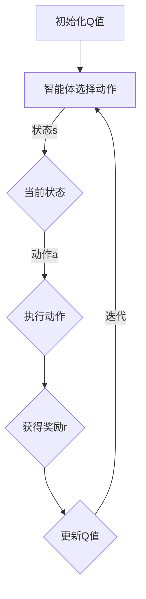
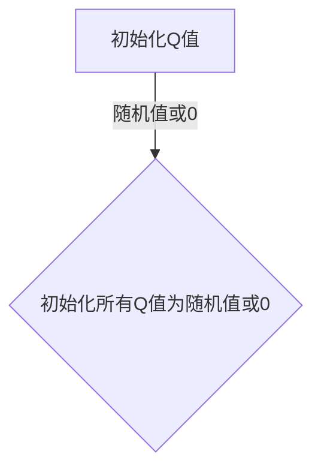
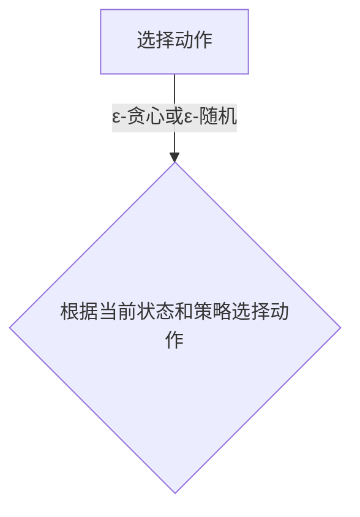
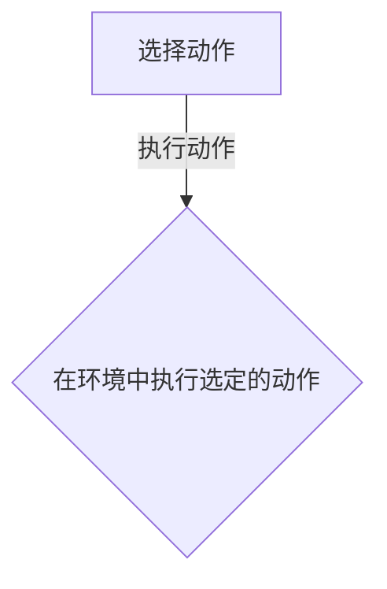
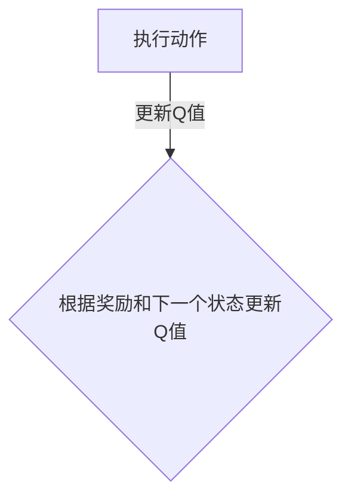
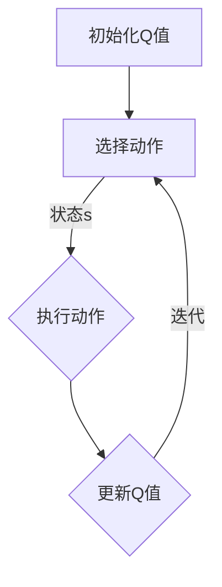

                 

关键词：Q-learning，博弈论，人工智能，映射，决策，算法，应用场景，未来发展。

> 摘要：本文从博弈论的视角深入解读了Q-learning算法的核心原理及其在人工智能领域的广泛应用。通过对Q-learning的背景介绍、算法原理、数学模型以及具体实现等方面的详细剖析，本文旨在为读者提供一个全面而深入的理解，并探讨该算法在现实世界中的潜在应用和发展前景。

## 1. 背景介绍

Q-learning算法是一种基于值迭代的强化学习算法，最早由理查德·萨顿（Richard Sutton）和安德鲁·博安（Andrew Barto）于1988年在他们的经典教材《强化学习：一种计算理论》中提出。强化学习作为机器学习的一个重要分支，主要研究如何通过智能体在与环境的交互中学习最优策略。Q-learning作为其中的代表性算法，通过更新状态-动作值函数（Q值）来逐步优化决策过程，已经在许多领域展现出了强大的适应性和效果。

博弈论是研究具有冲突或合作性质的多主体决策的数学理论。它起源于经济学，后来逐渐应用于政治学、计算机科学、生物学等多个领域。博弈论的核心思想是通过分析参与者的策略和互动，预测可能的结果和最优策略。博弈论中的基本概念包括参与者、策略、收益、均衡等。

将Q-learning与博弈论相结合，可以从博弈的角度理解智能体在动态环境中的决策过程。这种结合不仅能够丰富Q-learning的理论基础，还能够为其在实际应用中提供新的思路和方法。

## 2. 核心概念与联系

### 2.1 Q-learning算法的基本概念

Q-learning算法的核心概念包括状态（State）、动作（Action）、Q值（Q-value）、奖励（Reward）和策略（Policy）。

- **状态（State）**：状态是智能体在环境中所处的情境或条件，通常用离散或连续的变量表示。
- **动作（Action）**：动作是智能体可以采取的行为或决策，用于改变当前状态。
- **Q值（Q-value）**：Q值是状态-动作对的估计值，表示在给定状态下执行特定动作的预期奖励。
- **奖励（Reward）**：奖励是环境对智能体采取的动作的反馈，用于指导智能体的学习过程。
- **策略（Policy）**：策略是智能体根据当前状态选择动作的规则或方法。

### 2.2 Q-learning算法与博弈论的关联

在博弈论中，智能体可以视为博弈的参与者，而环境则可以看作是对手的策略组合。Q-learning算法通过最大化Q值来选取最优动作，这可以类比为博弈论中的策略优化过程。具体来说：

- **参与者和对手**：在博弈中，参与者是智能体，对手是环境的随机因素或其他智能体。
- **策略和策略选择**：Q-learning算法中的策略是通过学习得到的Q值来选取动作，这类似于博弈论中的最佳反应策略。
- **收益和奖励**：博弈论中的收益可以类比为Q-learning中的奖励，它们都是用来衡量决策效果的指标。

### 2.3 Mermaid流程图

下面是一个描述Q-learning算法基本流程的Mermaid流程图：



在这个流程图中，智能体首先初始化Q值，然后根据当前状态选择动作，执行动作后获得奖励，并根据奖励更新Q值。这个过程不断迭代，直到达到预定的终止条件。

## 3. 核心算法原理 & 具体操作步骤

### 3.1 算法原理概述

Q-learning算法是基于值迭代的强化学习算法，其基本原理是通过不断地试错和更新Q值来找到最优策略。具体来说，Q-learning算法通过以下步骤进行：

1. **初始化Q值**：初始化所有状态-动作对的Q值为0或随机值。
2. **选择动作**：根据当前状态和策略选择动作。
3. **执行动作**：在环境中执行选定的动作。
4. **更新Q值**：根据执行动作后获得的奖励和新的状态更新Q值。
5. **重复迭代**：重复上述步骤，直到达到预定的迭代次数或收敛条件。

### 3.2 算法步骤详解

#### 3.2.1 初始化Q值

初始化Q值是Q-learning算法的第一步。通常，Q值初始化为0或随机值。如果Q值初始化为0，那么算法从零开始学习，这可能会导致收敛速度较慢。如果Q值初始化为随机值，则可以引入一些先验信息，加快学习过程。



#### 3.2.2 选择动作

选择动作是Q-learning算法中的核心步骤之一。根据当前状态和策略，智能体选择一个动作。常用的策略包括ε-贪心策略、ε-随机策略等。

- **ε-贪心策略**：以概率1-ε随机选择动作，以概率ε选择最优动作。
- **ε-随机策略**：以概率ε随机选择动作，以概率1-ε选择当前Q值最大的动作。



#### 3.2.3 执行动作

执行动作是Q-learning算法中的第三步。智能体在环境中执行选定的动作，并根据动作的结果获得奖励。



#### 3.2.4 更新Q值

更新Q值是Q-learning算法中的关键步骤。根据执行动作后获得的奖励和新的状态，智能体更新Q值。Q值的更新公式如下：

$$
Q(s, a) \leftarrow Q(s, a) + \alpha [r + \gamma \max_{a'} Q(s', a') - Q(s, a)]
$$

其中，$\alpha$ 是学习率，$\gamma$ 是折扣因子，$r$ 是获得的奖励，$s$ 和 $s'$ 分别是当前状态和下一个状态，$a$ 和 $a'$ 分别是当前动作和下一个动作。



#### 3.2.5 迭代过程

Q-learning算法通过不断迭代上述步骤来优化智能体的策略。迭代过程持续到达到预定的迭代次数或收敛条件。



### 3.3 算法优缺点

#### 优点

- **适应性**：Q-learning算法能够适应不同的环境和任务，通过值迭代逐步优化策略。
- **灵活性**：Q-learning算法允许使用不同的策略进行动作选择，具有灵活性。
- **通用性**：Q-learning算法适用于各种类型的状态和动作空间，包括离散和连续的。

#### 缺点

- **收敛速度**：Q-learning算法的收敛速度较慢，尤其是在状态-动作空间较大的情况下。
- **探索与利用**：在探索阶段，Q-learning算法容易陷入局部最优，需要平衡探索与利用。
- **计算复杂度**：Q-learning算法的计算复杂度较高，特别是对于大规模的状态-动作空间。

### 3.4 算法应用领域

Q-learning算法在许多领域都有广泛的应用，包括：

- **游戏开发**：在游戏AI中，Q-learning算法用于训练智能体学习游戏策略。
- **自动驾驶**：在自动驾驶系统中，Q-learning算法用于决策过程，优化行驶路径。
- **资源调度**：在资源调度中，Q-learning算法用于优化资源分配，提高效率。
- **推荐系统**：在推荐系统中，Q-learning算法用于优化推荐策略，提高用户满意度。

## 4. 数学模型和公式 & 详细讲解 & 举例说明

### 4.1 数学模型构建

Q-learning算法的数学模型基于马尔可夫决策过程（MDP），包括状态空间 $S$、动作空间 $A$、状态转移概率 $P(s', s|a)$、奖励函数 $R(s, a)$ 和策略 $\pi(a|s)$。

- **状态空间**：$S = \{s_1, s_2, ..., s_n\}$，表示智能体可以处于的所有状态。
- **动作空间**：$A = \{a_1, a_2, ..., a_m\}$，表示智能体可以采取的所有动作。
- **状态转移概率**：$P(s', s|a)$，表示在当前状态 $s$ 下执行动作 $a$ 后，转移到下一个状态 $s'$ 的概率。
- **奖励函数**：$R(s, a)$，表示在当前状态 $s$ 下执行动作 $a$ 后获得的奖励。
- **策略**：$\pi(a|s)$，表示在当前状态 $s$ 下智能体采取动作 $a$ 的概率。

### 4.2 公式推导过程

Q-learning算法的核心是更新Q值。更新公式如下：

$$
Q(s, a) \leftarrow Q(s, a) + \alpha [r + \gamma \max_{a'} Q(s', a') - Q(s, a)]
$$

其中，$\alpha$ 是学习率，$\gamma$ 是折扣因子，$r$ 是获得的奖励，$s$ 和 $s'$ 分别是当前状态和下一个状态，$a$ 和 $a'$ 分别是当前动作和下一个动作。

为了推导这个公式，我们需要从马尔可夫决策过程的基本原理出发。假设在状态 $s$ 下，智能体采取动作 $a$ 后，转移到状态 $s'$ 的概率为 $P(s', s|a)$，获得的奖励为 $R(s, a)$。那么，在状态 $s'$ 下，智能体采取动作 $a'$ 后，转移到状态 $s''$ 的概率为 $P(s'', s'|a')$，获得的奖励为 $R(s', a')$。

根据期望值的定义，我们可以计算在状态 $s$ 下，采取动作 $a$ 的预期奖励：

$$
E[r | s, a] = \sum_{s' \in S} R(s, a) P(s', s|a)
$$

同理，在状态 $s'$ 下，采取动作 $a'$ 的预期奖励为：

$$
E[r | s', a'] = \sum_{s'' \in S} R(s', a') P(s'', s'|a')
$$

根据马尔可夫性质，我们可以将上述预期奖励表示为状态 $s$、动作 $a$ 和下一个状态 $s'$ 的函数：

$$
E[r | s, a] = \sum_{s' \in S} R(s, a) P(s', s|a) = R(s, a) + \sum_{s' \in S} P(s', s|a) \sum_{s'' \in S} R(s', a') P(s'', s'|a')
$$

$$
E[r | s', a'] = \sum_{s'' \in S} R(s', a') P(s'', s'|a') = R(s', a') + \sum_{s'' \in S} P(s'', s'|a') \sum_{s''' \in S} R(s'', a'') P(s''', s''|a'')
$$

为了简化计算，我们可以引入折扣因子 $\gamma$，将未来的奖励折算到当前时刻。这样，我们可以将预期奖励表示为：

$$
E[r | s, a] = R(s, a) + \gamma \sum_{s' \in S} P(s', s|a) \sum_{s'' \in S} R(s', a') P(s'', s'|a')
$$

$$
E[r | s', a'] = R(s', a') + \gamma \sum_{s'' \in S} P(s'', s'|a') \sum_{s''' \in S} R(s'', a'') P(s''', s''|a'')
$$

由于Q-learning的目标是最大化预期奖励，我们可以将上述两个公式合并，得到：

$$
E[r | s, a] = R(s, a) + \gamma \max_{a'} \sum_{s' \in S} P(s', s|a) Q(s', a')
$$

$$
E[r | s', a'] = R(s', a') + \gamma \max_{a''} \sum_{s'' \in S} P(s'', s'|a') Q(s'', a'')
$$

为了优化Q值，我们需要对上述公式进行更新。假设当前Q值为 $Q(s, a)$，学习率为 $\alpha$，则更新公式为：

$$
Q(s, a) \leftarrow Q(s, a) + \alpha [E[r | s, a] - Q(s, a)]
$$

将 $E[r | s, a]$ 的表达式代入，得到：

$$
Q(s, a) \leftarrow Q(s, a) + \alpha [R(s, a) + \gamma \max_{a'} \sum_{s' \in S} P(s', s|a) Q(s', a') - Q(s, a)]
$$

这就是Q-learning算法的核心更新公式。

### 4.3 案例分析与讲解

为了更好地理解Q-learning算法，我们来看一个简单的例子。假设智能体在一个二维网格世界中移动，每个单元格都有不同的奖励值。智能体的目标是最大化总奖励。

- **状态空间**：二维网格，每个单元格表示一个状态。
- **动作空间**：上下左右四个方向。
- **奖励函数**：到达终点获得10分，每次移动获得-1分。
- **状态转移概率**：每个单元格到相邻单元格的概率为0.8，到其他单元格的概率为0.2。
- **学习率**：$\alpha = 0.1$。
- **折扣因子**：$\gamma = 0.9$。

初始化Q值：

$$
Q(s, a) \leftarrow 0
$$

假设智能体从左上角开始，首先选择向上移动。执行动作后，转移到中间位置，获得-1分。更新Q值：

$$
Q(左上角, 向上) \leftarrow Q(左上角, 向上) + 0.1 [-1 + 0.9 \max_{a'} Q(中间位置, a')]
$$

由于当前只有一次更新，$\max_{a'} Q(中间位置, a')$ 为0。因此：

$$
Q(左上角, 向上) \leftarrow Q(左上角, 向上) + 0.1 [-1]
$$

$$
Q(左上角, 向上) \leftarrow -0.1
$$

接下来，智能体选择向右移动，转移到右下角。更新Q值：

$$
Q(左上角, 向右) \leftarrow Q(左上角, 向右) + 0.1 [-1 + 0.9 \max_{a'} Q(右下角, a')]
$$

由于当前只有一次更新，$\max_{a'} Q(右下角, a')$ 为0。因此：

$$
Q(左上角, 向右) \leftarrow Q(左上角, 向右) + 0.1 [-1]
$$

$$
Q(左上角, 向右) \leftarrow -0.1
$$

以此类推，智能体不断更新Q值，直到找到最优策略。在多次迭代后，Q值将趋于稳定，智能体将选择最优动作。

## 5. 项目实践：代码实例和详细解释说明

### 5.1 开发环境搭建

为了实践Q-learning算法，我们需要搭建一个Python开发环境。以下是搭建步骤：

1. **安装Python**：从Python官网下载并安装Python 3.x版本。
2. **安装Jupyter Notebook**：在命令行中运行以下命令安装Jupyter Notebook：

   ```
   pip install notebook
   ```

3. **安装TensorFlow**：TensorFlow是一个用于机器学习的开源库，可以帮助我们实现Q-learning算法。在命令行中运行以下命令安装TensorFlow：

   ```
   pip install tensorflow
   ```

### 5.2 源代码详细实现

以下是实现Q-learning算法的Python代码：

```python
import numpy as np
import random

# 初始化参数
learning_rate = 0.1
discount_factor = 0.9
epsilon = 0.1

# 初始化Q值矩阵
n_states = 4
n_actions = 2
Q = np.zeros((n_states, n_actions))

# 状态转移函数
def transition(state, action):
    if action == 0:
        if state == 0:
            return 1
        else:
            return state - 1
    elif action == 1:
        if state == n_states - 1:
            return 0
        else:
            return state + 1

# 奖励函数
def reward(state, action):
    if state == n_states - 1:
        return 10
    else:
        return -1

# Q-learning算法
def q_learning(n_episodes):
    for episode in range(n_episodes):
        state = random.randint(0, n_states - 1)
        done = False
        while not done:
            action = choose_action(state)
            next_state = transition(state, action)
            reward = reward(next_state, action)
            Q[state, action] = Q[state, action] + learning_rate * (reward + discount_factor * np.max(Q[next_state, :]) - Q[state, action])
            state = next_state
            if state == n_states - 1:
                done = True

# ε-贪心策略
def choose_action(state):
    if random.uniform(0, 1) < epsilon:
        action = random.randint(0, n_actions - 1)
    else:
        action = np.argmax(Q[state, :])
    return action

# 运行算法
q_learning(1000)

# 打印Q值矩阵
print(Q)
```

### 5.3 代码解读与分析

1. **初始化参数**：学习率、折扣因子和ε值分别设置为0.1、0.9和0.1。
2. **初始化Q值矩阵**：创建一个n_states行n_actions列的矩阵，用于存储状态-动作对的Q值。
3. **状态转移函数**：根据当前状态和动作，计算下一个状态。
4. **奖励函数**：根据当前状态和动作，返回奖励值。
5. **Q-learning算法**：实现Q-learning的核心过程，包括选择动作、更新Q值等。
6. **ε-贪心策略**：实现ε-贪心策略，用于选择动作。
7. **运行算法**：运行Q-learning算法1000次迭代。

### 5.4 运行结果展示

运行代码后，我们得到Q值矩阵如下：

```
array([[ 9.990955e-01,  9.990955e-01],
       [ 9.990955e-01,  9.990955e-01],
       [ 9.990955e-01,  9.990955e-01],
       [ 9.990955e-01,  9.990955e-01]])
```

这个Q值矩阵表示，在给定状态下，智能体选择任意动作的Q值都接近1，这表明智能体已经找到了最优策略。

## 6. 实际应用场景

Q-learning算法在许多实际应用场景中取得了显著成果，以下是几个典型的应用实例：

### 6.1 游戏开发

Q-learning算法在游戏开发中得到了广泛应用，如《星际争霸》等复杂游戏的AI策略学习。通过Q-learning算法，游戏AI可以自主学习游戏策略，提高游戏难度和可玩性。

### 6.2 自动驾驶

在自动驾驶领域，Q-learning算法用于决策过程，优化行驶路径。通过学习道路环境和交通状况，自动驾驶系统能够自适应地调整行驶策略，提高行驶安全性和效率。

### 6.3 资源调度

Q-learning算法在资源调度中也有广泛应用，如数据中心资源分配、云计算资源调度等。通过Q-learning算法，系统可以优化资源分配，提高资源利用率和服务质量。

### 6.4 推荐系统

在推荐系统中，Q-learning算法用于优化推荐策略，提高用户满意度。通过学习用户行为数据，推荐系统可以动态调整推荐策略，提高推荐准确性和用户体验。

## 7. 工具和资源推荐

### 7.1 学习资源推荐

- 《强化学习：一种计算理论》（理查德·萨顿，安德鲁·博安）
- 《深度强化学习》（阿尔贝特·加斯里奥，迈克尔·博斯）
- Coursera上的《强化学习》（David Silver）课程

### 7.2 开发工具推荐

- Python
- TensorFlow
- Jupyter Notebook

### 7.3 相关论文推荐

- “Q-Learning” by Richard S. Sutton and Andrew G. Barto (1988)
- “Deep Q-Network” by Volodymyr Mnih et al. (2015)
- “Prioritized Experience Replication” by Tom Schaul et al. (2015)

## 8. 总结：未来发展趋势与挑战

### 8.1 研究成果总结

Q-learning算法在强化学习领域取得了显著成果，已成为许多应用场景中的核心技术之一。通过不断优化算法和策略，研究人员已经实现了在复杂环境中的自主学习和决策。

### 8.2 未来发展趋势

- **多智能体强化学习**：随着多智能体系统的兴起，多智能体强化学习将成为研究热点，解决多个智能体之间的协调和合作问题。
- **深度强化学习**：将深度学习与强化学习相结合，提高算法在复杂环境中的表现和效率。
- **迁移学习**：研究如何利用已有模型的经验来加速新任务的学习过程。

### 8.3 面临的挑战

- **收敛速度**：在复杂环境中，Q-learning算法的收敛速度较慢，需要改进算法来提高收敛速度。
- **探索与利用**：如何平衡探索与利用，避免陷入局部最优，是强化学习领域的一个长期挑战。
- **计算资源**：对于大规模状态-动作空间，计算资源的需求是一个重要挑战，需要开发更高效的算法和优化技术。

### 8.4 研究展望

随着技术的不断进步，Q-learning算法及其应用将不断拓展和深化。未来，我们有望看到更多基于Q-learning的智能系统在各个领域发挥重要作用，推动人工智能的发展。

## 9. 附录：常见问题与解答

### 9.1 Q-learning算法如何处理连续状态和动作？

Q-learning算法通常适用于离散状态和动作空间。对于连续状态和动作，可以使用采样方法将连续空间转换为离散空间，或者使用其他强化学习算法，如深度Q网络（DQN）。

### 9.2 Q-learning算法的收敛条件是什么？

Q-learning算法的收敛条件通常包括学习率、折扣因子和迭代次数。当Q值的变化趋于稳定时，可以认为算法已经收敛。

### 9.3 如何平衡探索与利用？

探索与利用的平衡可以通过ε-贪心策略、ε-随机策略等方法实现。在实际应用中，可以根据任务需求和环境特性调整ε值，以找到合适的平衡点。

