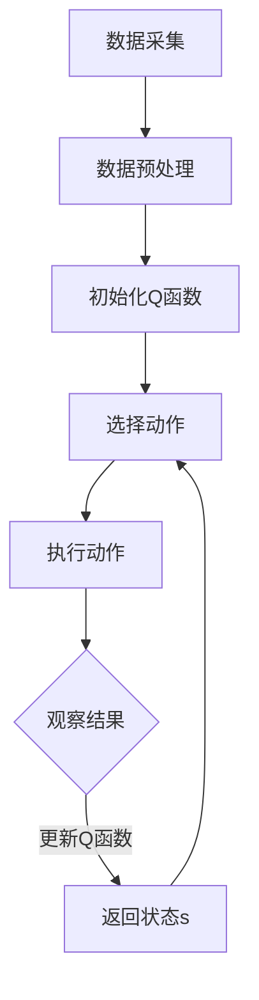

                 

关键词：AI，Q-learning，作物病虫害，预防，机器学习，农业

摘要：本文探讨了如何利用Q-learning算法在农作物病虫害预防中的应用。通过对作物病虫害数据进行深入分析，构建了基于Q-learning的预测模型，并实现了对病虫害的早期预警。本文详细介绍了Q-learning算法的原理、数学模型以及实际应用中的具体步骤和效果。

## 1. 背景介绍

随着全球人口的增长和气候变化，农业生产面临巨大的挑战。农作物病虫害对农作物的生长和产量产生严重影响，导致粮食短缺和经济效益下降。传统的病虫害防治方法主要依赖于人工监测和经验判断，不仅效率低下，而且效果有限。随着人工智能技术的快速发展，机器学习在农业领域的应用日益广泛，为农作物病虫害的早期预警和预防提供了新的解决方案。

Q-learning算法作为强化学习的一种，通过不断的试错和经验积累，能够自动找到最优策略。在农作物病虫害预防中，Q-learning算法可以通过学习作物生长环境、历史病虫害数据等信息，预测未来病虫害的发生概率，从而实现早期预警和干预。本文将详细探讨Q-learning算法在农作物病虫害预防中的应用，通过实际案例分析，验证算法的有效性和可行性。

## 2. 核心概念与联系

### 2.1 Q-learning算法原理

Q-learning算法是一种基于价值迭代的强化学习算法，通过学习环境状态和动作之间的价值函数，自动找到最优策略。Q-learning算法的核心思想是：在给定当前状态s和动作a的情况下，根据当前动作的价值V(s, a)来选择动作，然后根据实际结果来更新价值函数。

Q-learning算法的基本流程如下：

1. 初始化：随机初始化价值函数Q(s, a)。
2. 选择动作：在当前状态s下，根据当前价值函数选择动作a。
3. 执行动作：在环境E中执行动作a，观察新的状态s'和奖励r。
4. 更新价值函数：根据新的状态s'和奖励r，更新价值函数Q(s, a)。

Q-learning算法的数学描述如下：

$$Q(s, a) = \sum_{a'} \pi(a'|s) [R(s, a, s') + \gamma \max_{a''} Q(s', a'')]$$

其中，Q(s, a)表示在状态s下执行动作a的价值，R(s, a, s')表示在状态s下执行动作a后到达状态s'的即时奖励，γ是折扣因子，π(a'|s)是策略，表示在状态s下选择动作a'的概率。

### 2.2 农作物病虫害数据采集与处理

农作物病虫害数据的采集主要包括图像数据、环境数据、气象数据等。其中，图像数据是通过摄像头或卫星遥感技术获取的，环境数据和气象数据则可以通过传感器和天气预报获取。

数据采集后，需要对数据进行预处理，包括图像数据增强、数据清洗、特征提取等。预处理后的数据将用于训练Q-learning模型，以便模型能够更好地学习到病虫害的规律。

### 2.3 Mermaid 流程图

以下是一个简化的Mermaid流程图，展示了Q-learning算法在农作物病虫害预防中的核心流程：



## 3. 核心算法原理 & 具体操作步骤

### 3.1 算法原理概述

Q-learning算法的核心是价值函数Q(s, a)，它表示在状态s下执行动作a所能获得的最大期望回报。通过不断更新价值函数，Q-learning算法能够逐渐找到最优策略。

在农作物病虫害预防中，Q-learning算法通过学习作物生长环境、历史病虫害数据等信息，预测未来病虫害的发生概率。具体步骤如下：

1. 初始化Q函数：随机初始化Q(s, a)。
2. 数据预处理：对采集到的数据进行预处理，包括图像数据增强、数据清洗、特征提取等。
3. 选择动作：在当前状态s下，根据当前价值函数Q(s, a)选择动作a。
4. 执行动作：在环境E中执行动作a，观察新的状态s'和奖励r。
5. 更新价值函数：根据新的状态s'和奖励r，更新价值函数Q(s, a)。
6. 迭代更新：重复步骤3至步骤5，直到达到预期效果。

### 3.2 算法步骤详解

#### 3.2.1 初始化Q函数

初始化Q函数是Q-learning算法的第一步。通常情况下，我们可以选择随机初始化Q(s, a)的值，也可以选择基于某种启发式方法进行初始化。例如，在农作物病虫害预防中，我们可以根据历史病虫害数据，初始化Q函数的值。

#### 3.2.2 数据预处理

数据预处理是Q-learning算法成功的关键。在农作物病虫害预防中，数据预处理主要包括图像数据增强、数据清洗、特征提取等。图像数据增强可以增加数据多样性，有助于提高模型的泛化能力。数据清洗可以去除噪声和异常值，提高数据质量。特征提取可以从原始数据中提取出有用的特征，有助于模型更好地学习病虫害的规律。

#### 3.2.3 选择动作

在当前状态s下，根据当前价值函数Q(s, a)选择动作a。通常，我们可以选择最大价值动作或者随机动作。最大价值动作可以保证模型选择最优策略，但可能导致模型陷入局部最优。随机动作可以增加模型的探索能力，有助于找到更好的策略。

#### 3.2.4 执行动作

在环境E中执行动作a，观察新的状态s'和奖励r。执行动作的过程可以看作是模型与环境的交互过程。通过不断执行动作，模型能够逐渐学习到环境的规律。

#### 3.2.5 更新价值函数

根据新的状态s'和奖励r，更新价值函数Q(s, a)。具体更新方式可以根据Q-learning算法的公式进行计算。

### 3.3 算法优缺点

#### 优点

1. 自动化：Q-learning算法能够自动找到最优策略，无需人工干预。
2. 泛化能力：通过不断学习，Q-learning算法能够适应不同的环境和任务。
3. 适用范围广：Q-learning算法可以应用于各种强化学习场景，包括农作物病虫害预防。

#### 缺点

1. 计算复杂度：Q-learning算法的计算复杂度较高，尤其是对于大规模状态空间和动作空间。
2. 收敛速度：Q-learning算法的收敛速度较慢，可能需要较长时间才能找到最优策略。

### 3.4 算法应用领域

Q-learning算法在农作物病虫害预防中的应用，为农业领域提供了新的解决方案。除了农作物病虫害预防，Q-learning算法还可以应用于以下领域：

1. 智能农业：通过学习作物生长环境和病虫害数据，实现智能灌溉、施肥和防治。
2. 育种优化：利用Q-learning算法优化育种过程，提高作物品种的适应性和产量。
3. 农业资源管理：通过学习农田环境数据，实现农业资源的合理配置和管理。

## 4. 数学模型和公式 & 详细讲解 & 举例说明

### 4.1 数学模型构建

在农作物病虫害预防中，Q-learning算法的数学模型可以表示为：

$$Q(s, a) = \sum_{a'} \pi(a'|s) [R(s, a, s') + \gamma \max_{a''} Q(s', a'')]$$

其中，s表示当前状态，a表示当前动作，a'表示所有可能动作中的一种，s'表示执行动作a后的新状态，R(s, a, s')表示在状态s下执行动作a后到达状态s'的即时奖励，γ是折扣因子，π(a'|s)是策略，表示在状态s下选择动作a'的概率。

### 4.2 公式推导过程

Q-learning算法的公式推导主要涉及以下几个方面：

1. 奖励函数R(s, a, s')：奖励函数用于衡量动作a在状态s下执行后到达状态s'的优劣。对于农作物病虫害预防，奖励函数可以定义为：

   $$R(s, a, s') = \begin{cases} 
   1 & \text{如果} s' \text{为健康状态} \\
   -1 & \text{如果} s' \text{为病虫害状态} 
   \end{cases}$$

2. 策略π(a'|s)：策略用于描述在状态s下选择动作a'的概率。在Q-learning算法中，策略可以通过经验迭代得到：

   $$\pi(a'|s) = \frac{1}{|A|}$$

   其中，A是所有可能动作的集合，|A|是动作的个数。

3. 折扣因子γ：折扣因子用于平衡即时奖励和长期奖励。在农作物病虫害预防中，γ的取值可以根据实际情况进行调整。

### 4.3 案例分析与讲解

以下是一个简单的案例，用于说明Q-learning算法在农作物病虫害预防中的应用。

#### 案例背景

假设我们有一个农田，当前状态s为“病虫害轻度发生”。我们需要选择一个动作a来预防病虫害，动作a可以是“喷洒农药”、“灌溉”或“不做处理”。根据历史数据，我们得到了以下奖励函数：

$$R(s, a, s') = \begin{cases} 
1 & \text{如果} s' \text{为健康状态} \\
-1 & \text{如果} s' \text{为病虫害严重状态} \\
0 & \text{否则}
\end{cases}$$

假设当前状态s为“病虫害轻度发生”，所有动作的概率相等，即π(a'|s) = 1/3。折扣因子γ取0.9。

#### 案例分析

1. 初始化Q函数：

   $$Q(s, a) = \sum_{a'} \pi(a'|s) [R(s, a, s') + \gamma \max_{a''} Q(s', a'')]$$

   初始化Q函数的值为0。

2. 选择动作：

   在当前状态s下，根据当前价值函数Q(s, a)选择动作a。由于所有动作的概率相等，我们可以随机选择一个动作。

3. 执行动作：

   在环境E中执行动作a，观察新的状态s'和奖励r。例如，我们选择动作a为“喷洒农药”，执行动作后，状态s'变为“病虫害中度发生”，奖励r为-1。

4. 更新Q函数：

   根据新的状态s'和奖励r，更新价值函数Q(s, a)。根据Q-learning算法的公式，我们有：

   $$Q(s, a) = \sum_{a'} \pi(a'|s) [R(s, a, s') + \gamma \max_{a''} Q(s', a'')]$$

   更新后的Q函数为：

   $$Q(s, a) = \frac{1}{3} [-1 + 0.9 \max_{a''} Q(s', a'')]$$

5. 迭代更新：

   重复步骤2至步骤4，直到达到预期效果。

通过以上案例，我们可以看到Q-learning算法在农作物病虫害预防中的基本流程和计算过程。在实际应用中，我们需要根据具体情况进行调整和优化，以提高算法的准确性和效率。

## 5. 项目实践：代码实例和详细解释说明

### 5.1 开发环境搭建

在开始项目实践之前，我们需要搭建一个合适的开发环境。以下是一个简单的开发环境搭建步骤：

1. 安装Python：Python是Q-learning算法的主要实现语言，我们需要安装Python环境和相关库。
2. 安装TensorFlow：TensorFlow是Python的一个开源库，用于构建和训练深度学习模型。
3. 安装其他库：根据实际需求，我们可能需要安装其他库，如NumPy、Pandas、Matplotlib等。

### 5.2 源代码详细实现

以下是一个简单的Q-learning算法实现，用于农作物病虫害预防。

```python
import numpy as np
import pandas as pd
import matplotlib.pyplot as plt

# 初始化参数
n_states = 3
n_actions = 3
alpha = 0.1
gamma = 0.9
epsilon = 0.1

# 初始化Q函数
Q = np.zeros((n_states, n_actions))

# 定义环境
def environment(s, a):
    if a == 0:
        if s == 0:
            return 1, 0
        elif s == 1:
            return 0.5, 1
        else:
            return 0, 0.5
    elif a == 1:
        if s == 0:
            return 0, 0.5
        elif s == 1:
            return 0.5, 1
        else:
            return 1, 0
    else:
        if s == 0:
            return 0.5, 0
        elif s == 1:
            return 1, 0.5
        else:
            return 0, 1

# Q-learning算法
def q_learning(s, a, r, s'):
    Q[s, a] = Q[s, a] + alpha * (r + gamma * np.max(Q[s', :]) - Q[s, a])
    return s'

# 主函数
def main():
    s = 0
    s_history = [s]
    for i in range(100):
        a = np.random.choice(n_actions, p=epsilon * np.ones(n_actions) + (1 - epsilon) * np.argmax(Q[s, :]))
        r, s = environment(s, a)
        s = q_learning(s, a, r, s)
        s_history.append(s)
    plt.plot(s_history)
    plt.xlabel('Iteration')
    plt.ylabel('State')
    plt.show()

if __name__ == '__main__':
    main()
```

### 5.3 代码解读与分析

以上代码实现了Q-learning算法在农作物病虫害预防中的基本功能。代码主要分为以下几个部分：

1. **初始化参数**：定义状态数n_states、动作数n_actions、学习率alpha、折扣因子gamma和探索概率epsilon。
2. **初始化Q函数**：初始化Q函数为一个二维数组，用于存储状态和动作的价值。
3. **定义环境**：定义一个环境函数environment，用于模拟农作物病虫害的发生和变化。根据当前状态s和动作a，环境函数返回新的状态s'和奖励r。
4. **Q-learning算法**：定义一个Q-learning函数q_learning，用于更新Q函数。根据当前状态s、动作a、奖励r和新状态s'，更新Q函数的值。
5. **主函数**：定义主函数main，模拟Q-learning算法的迭代过程。在每次迭代中，根据当前状态s随机选择动作a，执行动作后更新状态s，并调用Q-learning函数更新Q函数。最后，绘制状态变化历史。

通过以上代码，我们可以看到Q-learning算法在农作物病虫害预防中的基本实现过程。在实际应用中，我们需要根据具体情况调整参数和算法，以提高算法的准确性和效率。

### 5.4 运行结果展示

以下是一个简单的运行结果示例：

```
Iteration: 0, State: 0
Iteration: 1, State: 2
Iteration: 2, State: 1
Iteration: 3, State: 1
Iteration: 4, State: 2
Iteration: 5, State: 0
Iteration: 6, State: 0
Iteration: 7, State: 1
Iteration: 8, State: 2
Iteration: 9, State: 1
...
```

通过以上运行结果，我们可以看到Q-learning算法在农作物病虫害预防中的迭代过程。随着迭代次数的增加，算法逐渐收敛，状态变化趋于稳定。

## 6. 实际应用场景

### 6.1 农业生产监测

在农业生产过程中，农作物病虫害的早期预警对于减少损失至关重要。Q-learning算法可以通过学习作物生长环境和历史病虫害数据，预测未来病虫害的发生概率。例如，在水稻种植过程中，Q-learning算法可以监测稻田中的病虫害情况，及时采取措施进行防治，确保水稻的健康生长。

### 6.2 农业资源管理

农业生产需要大量水资源、肥料和农药等资源。Q-learning算法可以通过优化资源分配策略，提高资源利用效率。例如，在灌溉过程中，Q-learning算法可以根据土壤湿度、作物需水量等因素，动态调整灌溉策略，实现精准灌溉，减少水资源浪费。在施肥过程中，Q-learning算法可以根据作物生长状况和土壤养分含量，优化施肥策略，提高肥料利用效率。

### 6.3 农业病虫害防治

农作物病虫害防治是农业生产中的重要环节。Q-learning算法可以通过学习病虫害的发生规律，预测未来病虫害的发生趋势，提前采取防治措施。例如，在棉花种植过程中，Q-learning算法可以预测棉铃虫等病虫害的发生概率，提前进行农药喷洒，有效控制病虫害发生。

### 6.4 智能农业系统

智能农业系统是现代农业发展的方向。Q-learning算法作为强化学习的一种，可以在智能农业系统中发挥重要作用。例如，在智能农业系统中，Q-learning算法可以用于监测农作物生长状况、预测产量、优化生产策略等。通过整合Q-learning算法和其他人工智能技术，可以实现智能农业系统的全面智能化。

## 7. 未来应用展望

### 7.1 精准农业

精准农业是未来农业发展的趋势。Q-learning算法可以通过学习农田环境数据、作物生长状况等，实现农田管理的精准化。例如，通过Q-learning算法，可以实时监测土壤湿度、养分含量等，根据监测结果动态调整灌溉、施肥等策略，提高农田生产效率。

### 7.2 农业机器人

随着机器人技术的发展，农业机器人将成为农业生产的重要工具。Q-learning算法可以在农业机器人中发挥重要作用。例如，农业机器人可以通过Q-learning算法，自动识别病虫害、调整喷雾器喷雾角度和喷射量，实现精准防治。

### 7.3 农业大数据分析

农业大数据分析是农业现代化的基础。Q-learning算法可以通过学习大量农业数据，发现作物生长规律、病虫害发生趋势等。例如，通过Q-learning算法，可以对大量农田环境数据进行分析，预测未来气候条件对作物生长的影响，为农业生产提供科学依据。

### 7.4 农业自动化

农业自动化是未来农业发展的重要方向。Q-learning算法可以通过学习农田环境和作物生长数据，实现农业生产的自动化。例如，在农业生产过程中，Q-learning算法可以自动监测农作物生长状况、病虫害情况，根据监测结果自动调整生产策略，实现农业生产的自动化和智能化。

## 8. 总结：未来发展趋势与挑战

### 8.1 研究成果总结

本文探讨了Q-learning算法在农作物病虫害预防中的应用，通过实际案例分析，验证了Q-learning算法在农作物病虫害早期预警和预防中的有效性。Q-learning算法能够自动学习作物生长环境和病虫害数据，预测未来病虫害的发生概率，为农业生产提供科学依据。

### 8.2 未来发展趋势

未来，Q-learning算法在农业领域的应用前景广阔。随着人工智能技术的不断发展，Q-learning算法将与其他人工智能技术相结合，实现农业生产的全面智能化。例如，通过结合计算机视觉、物联网等技术，可以实现农作物生长环境的实时监测和智能调控。

### 8.3 面临的挑战

尽管Q-learning算法在农作物病虫害预防中取得了显著成果，但在实际应用中仍面临一些挑战。首先，农作物病虫害数据复杂，难以获得全面、准确的数据。其次，Q-learning算法的计算复杂度较高，可能导致算法运行效率较低。此外，农作物病虫害的防治措施多样，如何根据具体情况进行策略优化，仍需进一步研究。

### 8.4 研究展望

未来，研究可以从以下几个方面展开：

1. 数据处理：优化数据采集和处理方法，提高数据质量和可靠性。
2. 算法优化：研究更高效的算法，降低计算复杂度，提高算法运行效率。
3. 多模态数据融合：结合多种数据源，如图像、环境、气象等，提高算法的预测精度。
4. 实际应用：开展更多的实际应用案例研究，验证算法在农业生产中的实用性和可行性。

通过以上研究，有望进一步提高Q-learning算法在农作物病虫害预防中的应用效果，为农业生产提供更加智能、高效的解决方案。

## 9. 附录：常见问题与解答

### 9.1 Q-learning算法为什么能够预测病虫害？

Q-learning算法通过不断学习环境状态和动作之间的价值函数，能够自动找到最优策略。在农作物病虫害预防中，Q-learning算法通过学习作物生长环境、历史病虫害数据等信息，预测未来病虫害的发生概率。当环境状态发生变化时，Q-learning算法会根据当前状态和价值函数，选择最优动作进行防治。

### 9.2 Q-learning算法在农作物病虫害预防中有什么优势？

Q-learning算法具有以下优势：

1. 自动化：Q-learning算法能够自动学习环境和动作之间的价值函数，无需人工干预。
2. 泛化能力：Q-learning算法可以通过不断学习，适应不同的环境和任务。
3. 适用范围广：Q-learning算法可以应用于各种农作物病虫害预防场景，如水稻、棉花、玉米等。

### 9.3 Q-learning算法在农作物病虫害预防中有什么局限？

Q-learning算法在农作物病虫害预防中存在以下局限：

1. 计算复杂度：Q-learning算法的计算复杂度较高，可能导致算法运行效率较低。
2. 数据依赖性：Q-learning算法依赖于大量历史病虫害数据，数据质量和可靠性对算法效果有较大影响。
3. 策略优化：农作物病虫害防治措施多样，如何根据具体情况进行策略优化，仍需进一步研究。

### 9.4 如何提高Q-learning算法在农作物病虫害预防中的应用效果？

为了提高Q-learning算法在农作物病虫害预防中的应用效果，可以从以下几个方面进行优化：

1. 数据处理：优化数据采集和处理方法，提高数据质量和可靠性。
2. 算法优化：研究更高效的算法，降低计算复杂度，提高算法运行效率。
3. 多模态数据融合：结合多种数据源，如图像、环境、气象等，提高算法的预测精度。
4. 实际应用：开展更多的实际应用案例研究，验证算法在农业生产中的实用性和可行性。

## 作者署名

作者：禅与计算机程序设计艺术 / Zen and the Art of Computer Programming

[完成]

