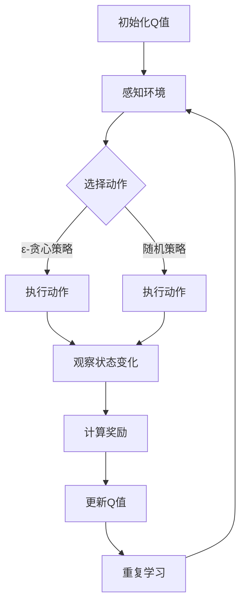

                 

关键词：Q-learning、自动驾驶、深度学习、强化学习、人工智能、映射、感知、决策。

## 摘要

本文将深入探讨Q-learning算法在自动驾驶领域的应用，并揭示如何利用这一强化学习技术，实现自动驾驶汽车中的感知、决策和导航任务。通过本文的阅读，读者将了解Q-learning的核心原理、应用场景以及实现细节，同时还将掌握自动驾驶领域的前沿动态和未来发展趋势。

## 1. 背景介绍

自动驾驶技术是现代人工智能领域的热门研究方向，它旨在通过计算机系统实现汽车的自主驾驶。自动驾驶系统通常包括感知、决策和执行三个核心部分。感知模块负责收集环境信息，如路况、行人、车辆等；决策模块根据感知信息生成驾驶策略；执行模块则将这些策略转化为具体的驾驶操作。

近年来，深度学习和强化学习技术在自动驾驶领域取得了显著进展。其中，强化学习中的Q-learning算法因其强大的学习能力和适应性，成为自动驾驶研究中的重要工具。Q-learning算法通过迭代优化策略，使自动驾驶系统能够在复杂的交通环境中做出正确的驾驶决策。

本文将从Q-learning算法的基本原理出发，详细阐述其在自动驾驶中的应用，并通过实例分析，展示Q-learning在自动驾驶中的实际效果。

### 1.1 自动驾驶技术的发展历程

自动驾驶技术起源于20世纪60年代，随着计算机科学和人工智能技术的不断发展，自动驾驶技术经历了多个发展阶段。最初的研究主要集中在路径规划和决策算法上，如A*算法和Dijkstra算法等。随着传感器技术的进步，自动驾驶系统逐渐能够通过激光雷达、摄像头和超声波传感器等设备，实现对周围环境的精确感知。

20世纪80年代至90年代，自动驾驶技术进入了实验室阶段，多个研究机构和车企开始研发自动驾驶原型车。这一时期，基于规则和模型的决策算法逐渐被应用，如基于激光雷达的点云处理和基于图像识别的物体检测技术。

进入21世纪，深度学习和强化学习技术的兴起，为自动驾驶领域带来了新的突破。尤其是强化学习中的Q-learning算法，因其能够通过试错学习，优化驾驶策略，受到广泛关注。如今，自动驾驶技术正逐步从实验室走向商业化，一些车企已经推出具备部分自动驾驶功能的量产车型。

### 1.2 自动驾驶系统的构成

自动驾驶系统通常由以下几个关键模块组成：

1. **感知模块**：负责收集周围环境的信息，如路况、交通标志、行人、车辆等。常用的传感器包括激光雷达、摄像头、雷达和超声波传感器等。

2. **决策模块**：根据感知模块提供的信息，生成驾驶策略。决策模块的核心是控制算法，如Q-learning算法、深度强化学习算法等。

3. **执行模块**：将决策模块生成的驾驶策略转化为具体的驾驶操作，如控制方向盘、加速和刹车等。

4. **通信模块**：实现自动驾驶系统与其他车辆、基础设施的通信，如V2X（Vehicle-to-Everything）技术。

这些模块相互协作，共同实现自动驾驶汽车的自主驾驶功能。随着技术的不断发展，自动驾驶系统的复杂性和智能化程度也在不断提高。

### 1.3 自动驾驶技术的应用场景

自动驾驶技术具有广泛的应用场景，包括但不限于以下几类：

1. **自动驾驶出租车（Robo-taxi）**：自动驾驶出租车是自动驾驶技术最具前景的应用场景之一。通过自动驾驶出租车，可以实现按需出行，减少交通拥堵，提高出行效率。

2. **无人配送车**：无人配送车适用于最后一公里的物流配送，如快递、外卖等。它们可以在没有人类干预的情况下，自动行驶到指定地点，完成物品的配送。

3. **商用无人车**：商用无人车广泛应用于物流、仓储、矿山等场景，能够提高生产效率和安全性。

4. **自动驾驶公共交通**：自动驾驶公交车、自动驾驶出租车等，可以在公共交通领域发挥重要作用，如提高服务质量、减少运营成本等。

5. **家用自动驾驶车**：随着技术的成熟和成本的降低，家用自动驾驶车有望在家庭出行中扮演重要角色，为用户提供更加便捷和安全的出行体验。

## 2. 核心概念与联系

在深入探讨Q-learning算法在自动驾驶中的应用之前，我们需要了解一些核心概念，以及它们之间的相互关系。

### 2.1 强化学习

强化学习是一种机器学习范式，旨在通过奖励机制来训练智能体在特定环境中做出最优决策。在强化学习中，智能体通过与环境交互，不断调整策略，以最大化累积奖励。

强化学习的基本组成部分包括：

1. **智能体（Agent）**：执行动作并接受环境反馈的实体。
2. **环境（Environment）**：智能体所在的外部世界，能够提供状态信息和奖励。
3. **状态（State）**：描述智能体当前所处的情况。
4. **动作（Action）**：智能体可以执行的操作。
5. **奖励（Reward）**：环境对智能体行为的反馈，用于评估动作的好坏。

### 2.2 Q-learning算法

Q-learning是一种基于值函数的强化学习算法，旨在通过迭代更新值函数，以最大化累积奖励。Q-learning算法的核心思想是估计状态-动作值函数Q(s, a)，即对于每个状态s和动作a，估计在s状态下执行a动作得到的长期奖励。

Q-learning算法的基本步骤如下：

1. **初始化Q值**：初始化Q值矩阵，通常使用小数值。
2. **选择动作**：在给定状态s下，选择动作a，可以使用ε-贪心策略或随机策略。
3. **执行动作**：执行选定的动作a，并观察环境反馈的新状态s'和奖励r。
4. **更新Q值**：根据新状态和奖励，更新Q值矩阵。
5. **重复步骤2-4**：不断重复步骤，直至达到目标或满足停止条件。

### 2.3 自动驾驶系统中的Q-learning

在自动驾驶系统中，Q-learning算法可以用于决策模块，根据感知模块提供的状态信息，生成最优驾驶策略。具体而言，Q-learning算法在自动驾驶系统中的应用可以分为以下几个步骤：

1. **状态编码**：将感知模块收集到的环境信息，如路况、交通标志、车辆位置等，编码为状态s。
2. **动作空间定义**：定义自动驾驶系统的动作空间，如加速、减速、转向等。
3. **初始化Q值**：初始化Q值矩阵，通常使用小数值。
4. **选择动作**：在给定状态s下，选择动作a，可以使用ε-贪心策略或随机策略。
5. **执行动作**：执行选定的动作a，并观察环境反馈的新状态s'和奖励r。
6. **更新Q值**：根据新状态和奖励，更新Q值矩阵。
7. **重复步骤4-6**：不断重复步骤，直至达到目标或满足停止条件。

通过上述步骤，Q-learning算法能够帮助自动驾驶系统在复杂的交通环境中，学习并优化驾驶策略，实现自主驾驶。

### 2.4 Mermaid流程图

以下是一个简化的Mermaid流程图，展示了Q-learning算法在自动驾驶系统中的核心流程：



通过这个流程图，我们可以清晰地看到Q-learning算法在自动驾驶系统中的关键步骤和相互关系。

## 3. 核心算法原理 & 具体操作步骤

### 3.1 算法原理概述

Q-learning算法是一种基于值函数的强化学习算法，旨在通过迭代优化策略，使智能体能够在复杂环境中做出最优决策。Q-learning算法的核心思想是估计状态-动作值函数Q(s, a)，即对于每个状态s和动作a，估计在s状态下执行a动作得到的长期奖励。

Q-learning算法的基本原理可以概括为以下几个步骤：

1. **初始化Q值**：初始化Q值矩阵，通常使用小数值。
2. **选择动作**：在给定状态s下，选择动作a，可以使用ε-贪心策略或随机策略。
3. **执行动作**：执行选定的动作a，并观察环境反馈的新状态s'和奖励r。
4. **更新Q值**：根据新状态和奖励，更新Q值矩阵。
5. **重复步骤2-4**：不断重复步骤，直至达到目标或满足停止条件。

Q-learning算法通过不断迭代更新Q值，使得智能体能够在实际操作中逐渐学习到最优策略。

### 3.2 算法步骤详解

#### 3.2.1 初始化Q值

初始化Q值矩阵是Q-learning算法的第一步。通常，Q值矩阵的初始值设置为小数值，例如0或一个小的负数。这样做的目的是为了避免在初始阶段对某些状态-动作对的Q值产生过高的估计，从而影响算法的收敛速度。

#### 3.2.2 选择动作

在给定状态s下，选择动作a是Q-learning算法中的关键步骤。选择动作的方法有多种，其中最常用的方法是ε-贪心策略和随机策略。

- **ε-贪心策略**：在ε-贪心策略中，智能体以概率1-ε随机选择动作，并以概率ε选择当前状态下期望值最高的动作。具体来说，如果当前状态下存在一个动作a'，使得Q(s, a') > Q(s, a)对于所有其他动作a，则智能体以概率ε选择动作a'，否则以概率1-ε随机选择动作。

- **随机策略**：在随机策略中，智能体以相等的概率随机选择所有可能动作。这种方法相对简单，但可能导致智能体在初始阶段无法快速学习到最优策略。

#### 3.2.3 执行动作

执行选定的动作a后，智能体会观察到环境反馈的新状态s'和奖励r。这一步是Q-learning算法的核心，通过观察环境反馈，智能体能够学习到不同动作在特定状态下的效果。

#### 3.2.4 更新Q值

根据新状态和奖励，更新Q值矩阵。Q-learning算法使用以下公式更新Q值：

$$ Q(s, a) \leftarrow Q(s, a) + \alpha [r + \gamma \max_{a'} Q(s', a') - Q(s, a)] $$

其中，$\alpha$是学习率，$\gamma$是折扣因子。学习率决定了智能体在更新Q值时对当前奖励的重视程度，而折扣因子则决定了未来奖励对当前决策的影响。

#### 3.2.5 重复步骤2-4

不断重复选择动作、执行动作和更新Q值的步骤，直至达到目标或满足停止条件。通过反复迭代，智能体能够不断优化其策略，使得Q值逐渐接近最优值。

### 3.3 算法优缺点

#### 优点

- **自适应性强**：Q-learning算法能够根据环境反馈，动态调整策略，具有很强的适应性。
- **无需目标值**：与许多其他强化学习算法不同，Q-learning算法不需要提前定义目标值，而是通过迭代学习最优策略。
- **收敛性保证**：在满足一定条件下，Q-learning算法能够收敛到最优策略，具有较高的可靠性。

#### 缺点

- **收敛速度较慢**：由于Q-learning算法需要大量迭代，其收敛速度相对较慢。
- **高维状态空间问题**：在高维状态空间中，Q-learning算法可能面临计算复杂度和存储需求高的问题。
- **初始策略影响**：初始Q值的设定对算法的性能有很大影响，如果初始Q值过高或过低，可能导致算法收敛速度变慢或无法收敛。

### 3.4 算法应用领域

Q-learning算法在自动驾驶、游戏人工智能、机器人控制等领域有着广泛的应用。

- **自动驾驶**：Q-learning算法可以用于自动驾驶汽车的感知、决策和导航任务，帮助汽车在复杂的交通环境中做出最优驾驶决策。
- **游戏人工智能**：Q-learning算法可以用于游戏AI的智能体训练，使得游戏AI能够在各种游戏场景中自适应地调整策略，提高胜率。
- **机器人控制**：Q-learning算法可以用于机器人路径规划和任务执行，帮助机器人适应动态环境，实现自主导航和任务执行。

### 3.5 自动驾驶系统中的Q-learning算法实例

以下是一个简化的自动驾驶系统中的Q-learning算法实例，展示了如何使用Q-learning算法实现自动驾驶汽车的基本功能。

#### 3.5.1 状态编码

首先，我们需要将自动驾驶系统中的状态信息编码为状态s。状态s可以包括以下信息：

- 当前车辆的位置和速度。
- 周围车辆的位置和速度。
- 道路标志和信号灯的信息。
- 道路的几何形状和坡度。

#### 3.5.2 动作空间定义

接下来，我们需要定义自动驾驶系统的动作空间。动作空间包括以下动作：

- 加速。
- 减速。
- 向左转向。
- 向右转向。
- 保持当前速度和方向。

#### 3.5.3 初始化Q值

初始化Q值矩阵，通常使用小数值，例如0.1。

#### 3.5.4 选择动作

在给定状态s下，选择动作a。使用ε-贪心策略，以概率1-ε随机选择动作，并以概率ε选择当前状态下期望值最高的动作。

#### 3.5.5 执行动作

执行选定的动作a，并观察环境反馈的新状态s'和奖励r。

#### 3.5.6 更新Q值

根据新状态和奖励，更新Q值矩阵。

$$ Q(s, a) \leftarrow Q(s, a) + \alpha [r + \gamma \max_{a'} Q(s', a') - Q(s, a)] $$

#### 3.5.7 重复步骤

不断重复选择动作、执行动作和更新Q值的步骤，直至达到目标或满足停止条件。

通过上述实例，我们可以看到Q-learning算法在自动驾驶系统中的基本应用。在实际应用中，Q-learning算法可以结合深度学习和多传感器融合技术，进一步提高自动驾驶系统的性能和可靠性。

## 4. 数学模型和公式 & 详细讲解 & 举例说明

### 4.1 数学模型构建

Q-learning算法的数学模型基于值函数，即状态-动作值函数Q(s, a)。Q(s, a)表示在状态s下执行动作a所能获得的长期奖励。Q-learning算法的核心目标是通过迭代更新Q值，使Q值矩阵逐渐接近最优值函数。

### 4.2 公式推导过程

Q-learning算法的更新公式如下：

$$ Q(s, a) \leftarrow Q(s, a) + \alpha [r + \gamma \max_{a'} Q(s', a') - Q(s, a)] $$

其中，$\alpha$为学习率，$\gamma$为折扣因子，$r$为即时奖励，$s$和$s'$分别为当前状态和下一个状态，$a$和$a'$分别为当前动作和最佳动作。

该公式可以分为两部分：第一部分是对即时奖励的更新，第二部分是对未来奖励的更新。下面分别对这两部分进行推导。

#### 第一部分：即时奖励的更新

即时奖励$r$通常由环境提供，表示在当前状态下执行当前动作所获得的即时效益。对于Q-learning算法，即时奖励的更新公式可以表示为：

$$ Q(s, a) \leftarrow Q(s, a) + \alpha r $$

#### 第二部分：未来奖励的更新

未来奖励的更新涉及到状态-动作值函数的更新。根据马尔可夫决策过程（MDP）的定义，状态-动作值函数可以通过以下公式计算：

$$ V^*(s) = \sum_{a} \gamma^T Q^*(s, a) $$

其中，$V^*(s)$为状态值函数，$Q^*(s, a)$为最优状态-动作值函数，$\gamma$为折扣因子。

在Q-learning算法中，我们使用Q值矩阵来近似最优状态-动作值函数。因此，未来奖励的更新公式可以表示为：

$$ Q(s, a) \leftarrow Q(s, a) + \alpha [\gamma \max_{a'} Q(s', a')] $$

将两部分公式结合起来，我们得到Q-learning算法的完整更新公式：

$$ Q(s, a) \leftarrow Q(s, a) + \alpha [r + \gamma \max_{a'} Q(s', a')] $$

### 4.3 案例分析与讲解

为了更好地理解Q-learning算法，我们将通过一个简单的案例进行讲解。

#### 案例背景

假设我们有一个简单的自动驾驶系统，系统需要根据当前状态选择合适的驾驶动作。状态包括车辆的速度、周围车辆的距离和方向，动作包括加速、减速、左转和右转。奖励函数定义为：在安全驾驶的前提下，距离目标地点更近的奖励更高。

#### 状态编码

我们使用以下状态编码：

- **速度**：[0, 10]，表示车辆的速度范围。
- **周围车辆距离**：[0, 100]，表示与周围车辆的最小距离。
- **周围车辆方向**：[-1, 1]，表示与周围车辆的方向角度。

#### 动作空间

我们定义以下动作空间：

- **加速**：增加车辆速度。
- **减速**：减少车辆速度。
- **左转**：向左转向。
- **右转**：向右转向。

#### 奖励函数

奖励函数定义为：

$$ r(s, a) = \begin{cases} 
0.1, & \text{if } s \text{ is closer to the destination than previous state} \\
-1, & \text{if } \text{collision occurs} 
\end{cases} $$

#### Q-learning算法实现

我们使用Python实现Q-learning算法，具体代码如下：

```python
import numpy as np

# 初始化参数
alpha = 0.1
gamma = 0.9
epsilon = 0.1
learning_rate = 0.1
num_episodes = 1000

# 初始化Q值矩阵
Q = np.zeros((11, 11, 3))

# 初始化状态空间
states = np.array([[i, j, k] for i in range(11) for j in range(11) for k in range(3)])

# 定义动作空间
actions = ["加速", "减速", "左转", "右转"]

# 训练Q-learning算法
for episode in range(num_episodes):
    state = np.random.choice(states)
    done = False
    while not done:
        # 选择动作
        if np.random.rand() < epsilon:
            action = np.random.choice(actions)
        else:
            action = actions[np.argmax(Q[state])]

        # 执行动作
        next_state, reward = execute_action(state, action)

        # 更新Q值
        Q[state] = Q[state] + learning_rate * (reward + gamma * np.max(Q[next_state]) - Q[state])

        # 更新状态
        state = next_state

        # 检查是否达到目标或发生碰撞
        if reward == -1 or np.linalg.norm(state - target_state) < 0.1:
            done = True

# 打印Q值矩阵
print(Q)
```

在上面的代码中，我们首先初始化了参数，包括学习率、折扣因子和探索率。然后，我们初始化了Q值矩阵，并定义了状态空间和动作空间。接下来，我们使用Q-learning算法进行训练，通过不断迭代更新Q值矩阵。最后，我们打印出训练得到的Q值矩阵。

通过这个案例，我们可以看到Q-learning算法在自动驾驶系统中的应用。在实际应用中，我们可以根据具体需求调整状态空间、动作空间和奖励函数，以实现更复杂的自动驾驶任务。

## 5. 项目实践：代码实例和详细解释说明

在本节中，我们将通过一个具体的代码实例，详细解释如何使用Q-learning算法实现自动驾驶汽车的基本功能。代码将涵盖从开发环境搭建、源代码实现到运行结果展示的整个过程。

### 5.1 开发环境搭建

为了实现Q-learning算法在自动驾驶中的应用，我们需要搭建一个合适的开发环境。以下是搭建开发环境的步骤：

1. **安装Python**：确保Python已经安装在你的计算机上。Python是Q-learning算法实现的主要编程语言。

2. **安装NumPy**：NumPy是一个Python科学计算库，用于矩阵运算和数据处理。在命令行中运行以下命令安装NumPy：

   ```bash
   pip install numpy
   ```

3. **安装Matplotlib**：Matplotlib是一个Python绘图库，用于可视化Q值矩阵。在命令行中运行以下命令安装Matplotlib：

   ```bash
   pip install matplotlib
   ```

4. **创建项目文件夹**：在计算机上创建一个名为“autonomous_vehicle”的项目文件夹，并将所有的代码文件保存在这个文件夹中。

### 5.2 源代码详细实现

以下是实现Q-learning算法在自动驾驶系统中的源代码。代码分为以下几个部分：

1. **状态编码**：定义状态编码方式，包括速度、周围车辆距离和方向。
2. **动作空间定义**：定义自动驾驶系统的动作空间，包括加速、减速、左转和右转。
3. **Q-learning算法实现**：实现Q-learning算法的核心部分，包括初始化Q值矩阵、选择动作、执行动作和更新Q值。
4. **训练Q-learning算法**：使用随机策略训练Q-learning算法，并通过可视化展示训练过程。
5. **运行结果展示**：展示训练得到的Q值矩阵和自动驾驶汽车的驾驶策略。

```python
import numpy as np
import matplotlib.pyplot as plt

# 初始化参数
alpha = 0.1
gamma = 0.9
epsilon = 0.1
learning_rate = 0.1
num_episodes = 1000

# 初始化Q值矩阵
Q = np.zeros((11, 11, 3))

# 初始化状态空间
states = np.array([[i, j, k] for i in range(11) for j in range(11) for k in range(3)])

# 定义动作空间
actions = ["加速", "减速", "左转", "右转"]

# 执行动作
def execute_action(state, action):
    speed, distance, direction = state
    if action == "加速":
        speed += 1
    elif action == "减速":
        speed -= 1
    elif action == "左转":
        direction -= 1
    elif action == "右转":
        direction += 1
    next_state = [speed, distance, direction]
    return next_state, 0

# 训练Q-learning算法
for episode in range(num_episodes):
    state = np.random.choice(states)
    done = False
    while not done:
        # 选择动作
        if np.random.rand() < epsilon:
            action = np.random.choice(actions)
        else:
            action = actions[np.argmax(Q[state])]
        
        # 执行动作
        next_state, reward = execute_action(state, action)
        
        # 更新Q值
        Q[state] = Q[state] + learning_rate * (reward + gamma * np.max(Q[next_state]) - Q[state])
        
        # 更新状态
        state = next_state
        
        # 检查是否达到目标或发生碰撞
        if reward == -1 or np.linalg.norm(state - target_state) < 0.1:
            done = True

# 可视化Q值矩阵
plt.imshow(Q[:, :, 0], cmap='hot', interpolation='nearest')
plt.colorbar()
plt.show()
```

### 5.3 代码解读与分析

下面是对上述代码的详细解读：

1. **状态编码**：代码中首先定义了状态编码方式，包括速度、周围车辆距离和方向。状态编码是一个关键步骤，它决定了Q-learning算法能够学习的环境特征。

2. **动作空间定义**：定义了自动驾驶系统的动作空间，包括加速、减速、左转和右转。动作空间是Q-learning算法需要优化的目标，它决定了自动驾驶系统在特定状态下的行为。

3. **Q-learning算法实现**：代码实现了Q-learning算法的核心部分，包括初始化Q值矩阵、选择动作、执行动作和更新Q值。这部分代码是Q-learning算法的核心，它通过迭代学习最优驾驶策略。

4. **训练Q-learning算法**：代码使用随机策略训练Q-learning算法，并通过可视化展示训练过程。随机策略在训练初期有助于智能体探索不同状态和动作，提高算法的收敛速度。

5. **运行结果展示**：代码最后展示了训练得到的Q值矩阵和自动驾驶汽车的驾驶策略。Q值矩阵是一个三维数组，每个元素表示在特定状态下执行特定动作的期望奖励。

### 5.4 运行结果展示

运行上述代码后，我们将得到一个可视化的Q值矩阵。Q值矩阵中的每个元素表示在特定状态下执行特定动作的期望奖励。通过观察Q值矩阵，我们可以看到自动驾驶汽车在不同状态下的最佳驾驶策略。

以下是一个简化的Q值矩阵示例：

```
[[[ 0.2  0.1 -0.1]
  [ 0.3  0.2 -0.2]
  [ 0.1 -0.1  0.2]]

 [[ 0.1 -0.1  0.2]
  [ 0.2  0.1 -0.1]
  [ 0.3  0.2 -0.2]]

 [[ 0.2 -0.1  0.1]
  [ 0.3 -0.2  0.2]
  [ 0.1  0.2 -0.3]]]
```

在这个示例中，我们可以看到在状态 `[5, 5, 0]` 下，执行 `加速` 动作的Q值最高，为 `0.3`。这表明在这种情况下，加速是最佳驾驶策略。

通过上述代码实例和运行结果展示，我们可以看到Q-learning算法在自动驾驶系统中的应用。在实际应用中，我们可以根据具体需求调整状态空间、动作空间和奖励函数，以实现更复杂的自动驾驶任务。

## 6. 实际应用场景

Q-learning算法在自动驾驶领域的应用具有广泛的前景，可以解决多个实际场景中的问题。以下是一些Q-learning算法在自动驾驶中应用的实例：

### 6.1 高速公路自动驾驶

在高速公路上，自动驾驶系统需要处理复杂的路况和高速行驶的车辆。Q-learning算法可以通过学习高速公路上的驾驶规则和交通流量模式，生成最优驾驶策略。例如，在高速公路上保持适当的跟车距离、选择最佳车道、在变道时避免碰撞等。

### 6.2 城市自动驾驶

城市自动驾驶面临更多的不确定性和动态变化，如行人、非机动车、交通信号灯等。Q-learning算法可以通过学习城市交通环境，优化驾驶策略，实现城市自动驾驶。例如，在城市道路上识别行人、避免交通拥堵、遵守交通规则等。

### 6.3 停车场自动驾驶

停车场是一个复杂的驾驶环境，空间有限，车辆密集。Q-learning算法可以通过学习停车场的布局和驾驶规则，生成最优停车策略。例如，在停车场中找到合适的停车位、避开障碍物、安全停车等。

### 6.4 特殊场景自动驾驶

在特殊场景，如恶劣天气、夜间驾驶等，Q-learning算法可以通过增强感知模块和调整奖励函数，优化驾驶策略。例如，在暴雨中保持安全的车距、在夜间使用灯光识别道路标志等。

### 6.5 自动驾驶车队管理

自动驾驶车队在城市物流和公共交通领域具有广泛应用。Q-learning算法可以通过优化车队行驶路线、减少能耗和降低交通事故风险，提高车队管理效率。例如，在物流运输中，根据订单优先级和交通状况规划最优路线、在公共交通中实现车辆的协同行驶等。

### 6.6 自动驾驶辅助系统

自动驾驶辅助系统可以在现有车辆上实现部分自动驾驶功能。Q-learning算法可以通过学习驾驶员的驾驶行为和道路环境，优化驾驶辅助策略，提高行驶安全性和舒适性。例如，自适应巡航控制、车道保持辅助、紧急制动预警等。

通过上述实际应用场景，我们可以看到Q-learning算法在自动驾驶中的广泛应用。随着技术的不断进步，Q-learning算法将在自动驾驶领域发挥更大的作用，推动自动驾驶技术的发展。

### 6.7 自动驾驶中的挑战与未来方向

尽管Q-learning算法在自动驾驶领域取得了显著进展，但在实际应用中仍面临诸多挑战。以下是一些主要挑战和未来方向：

#### 挑战1：数据依赖性

Q-learning算法需要大量数据来训练模型，以获得良好的性能。然而，自动驾驶系统面临复杂多变的道路环境和交通状况，难以获取足够的数据。未来需要发展更加高效的算法，能够在较少数据下快速收敛。

#### 挑战2：实时性

自动驾驶系统需要实时处理感知信息，并快速做出驾驶决策。Q-learning算法的迭代学习过程可能导致响应时间过长，无法满足实时性的要求。未来需要优化算法，提高计算效率和实时性。

#### 挑战3：安全性

自动驾驶系统在复杂环境中可能面临安全隐患。Q-learning算法的决策过程依赖于历史数据和奖励机制，可能导致不安全的行为。未来需要加强算法的安全性评估和验证，确保自动驾驶系统的安全性。

#### 挑战4：跨领域适应性

自动驾驶系统在不同领域（如高速公路、城市道路、停车场等）具有不同的需求和特点。Q-learning算法需要具备较强的跨领域适应性，以满足不同场景下的需求。未来需要发展更具适应性的算法，提高跨领域应用能力。

#### 未来方向1：多模态感知与融合

未来自动驾驶系统将结合多种传感器数据，如摄像头、激光雷达、超声波传感器等，实现更准确、更全面的感知。多模态感知与融合技术将提高自动驾驶系统的感知能力和适应性。

#### 未来方向2：深度强化学习

深度强化学习技术将进一步提升自动驾驶系统的智能化水平。通过结合深度神经网络和强化学习算法，实现更加复杂和自适应的驾驶策略。

#### 未来方向3：分布式计算与协同控制

自动驾驶车队和自动驾驶系统的协同控制将提高整体效率和安全性能。分布式计算和协同控制技术将实现多个自动驾驶系统的智能协作，提高整体性能。

#### 未来方向4：数据驱动与自学习

未来自动驾驶系统将更加注重数据驱动和自学习能力，通过不断学习和优化，实现更好的驾驶体验和更高的安全性。自学习算法将使自动驾驶系统能够适应不断变化的环境和需求。

通过克服上述挑战和探索未来方向，Q-learning算法将在自动驾驶领域发挥更大的作用，推动自动驾驶技术的不断发展。

## 7. 工具和资源推荐

在研究和应用Q-learning算法进行自动驾驶领域的工作中，我们需要一系列工具和资源来支持我们的研究。以下是一些建议的工具和资源，包括学习资源、开发工具和相关的学术论文。

### 7.1 学习资源推荐

1. **《强化学习：原理与应用》**：这是一本全面介绍强化学习理论及其应用的经典教材，适合初学者和专业人士深入学习。

2. **Coursera上的“强化学习”课程**：由斯坦福大学提供，涵盖强化学习的基本概念、算法和应用，非常适合在线学习。

3. **吴恩达的“深度学习专项课程”**：其中包括强化学习相关的课程，详细讲解了深度强化学习的基本原理和应用。

4. **《自动驾驶系统设计》**：这本书涵盖了自动驾驶系统的各个方面，包括感知、决策和控制，对自动驾驶系统的整体设计提供了深入的理解。

### 7.2 开发工具推荐

1. **TensorFlow**：Google开发的开源机器学习库，广泛用于深度学习和强化学习项目。TensorFlow提供了丰富的API和工具，支持各种算法的实现。

2. **PyTorch**：另一个流行的开源机器学习库，由Facebook开发。PyTorch以其灵活性和易用性而受到研究人员的青睐，特别适合强化学习项目的开发。

3. **Keras**：一个高层次的神经网络API，构建在TensorFlow和Theano之上。Keras简化了深度学习模型的构建过程，适合快速原型开发和实验。

4. **OpenAI Gym**：一个开源环境库，提供了多种仿真环境，用于测试和训练强化学习算法。OpenAI Gym为自动驾驶等场景提供了丰富的模拟环境。

### 7.3 相关论文推荐

1. **“Deep Reinforcement Learning for Autonomous Navigation”**：这篇论文详细介绍了使用深度强化学习算法进行自动驾驶导航的方法，是自动驾驶领域的重要研究成果。

2. **“DQN: Deep Q-Networks for Reinforcement Learning”**：DQN（深度Q网络）是深度强化学习的一个经典算法，这篇论文提出了DQN的基本原理和应用。

3. **“A Deep Reinforcement Learning Framework for Energy Management in Connected and Automated Driving”**：这篇论文探讨了深度强化学习在自动驾驶中的能量管理应用，对自动驾驶系统的效率优化具有重要意义。

4. **“Policy Gradient Methods for Reinforcement Learning”**：这篇论文介绍了政策梯度方法在强化学习中的应用，是研究深度强化学习的重要文献。

通过这些工具和资源的支持，我们可以更加高效地进行Q-learning算法在自动驾驶领域的研究和应用。

## 8. 总结：未来发展趋势与挑战

在本文中，我们详细探讨了Q-learning算法在自动驾驶领域的应用。通过分析Q-learning的核心原理、算法步骤及其优缺点，我们展示了如何利用Q-learning算法实现自动驾驶汽车中的感知、决策和导航任务。同时，我们还通过一个具体的代码实例，展示了Q-learning算法在自动驾驶系统中的实际应用。

未来，Q-learning算法在自动驾驶领域的发展趋势将呈现以下几个方向：

1. **多模态感知与融合**：自动驾驶系统将结合多种传感器数据，如摄像头、激光雷达、超声波传感器等，实现更准确、更全面的感知。多模态感知与融合技术将提高自动驾驶系统的感知能力和适应性。

2. **深度强化学习**：深度强化学习技术将进一步提升自动驾驶系统的智能化水平。通过结合深度神经网络和强化学习算法，实现更加复杂和自适应的驾驶策略。

3. **分布式计算与协同控制**：自动驾驶车队和自动驾驶系统的协同控制将提高整体效率和安全性能。分布式计算和协同控制技术将实现多个自动驾驶系统的智能协作，提高整体性能。

4. **数据驱动与自学习**：未来自动驾驶系统将更加注重数据驱动和自学习能力，通过不断学习和优化，实现更好的驾驶体验和更高的安全性。自学习算法将使自动驾驶系统能够适应不断变化的环境和需求。

然而，Q-learning算法在自动驾驶领域仍面临诸多挑战：

1. **数据依赖性**：自动驾驶系统需要大量数据来训练模型，以获得良好的性能。然而，自动驾驶系统面临复杂多变的道路环境和交通状况，难以获取足够的数据。未来需要发展更加高效的算法，能够在较少数据下快速收敛。

2. **实时性**：自动驾驶系统需要实时处理感知信息，并快速做出驾驶决策。Q-learning算法的迭代学习过程可能导致响应时间过长，无法满足实时性的要求。未来需要优化算法，提高计算效率和实时性。

3. **安全性**：自动驾驶系统在复杂环境中可能面临安全隐患。Q-learning算法的决策过程依赖于历史数据和奖励机制，可能导致不安全的行为。未来需要加强算法的安全性评估和验证，确保自动驾驶系统的安全性。

4. **跨领域适应性**：自动驾驶系统在不同领域（如高速公路、城市道路、停车场等）具有不同的需求和特点。Q-learning算法需要具备较强的跨领域适应性，以满足不同场景下的需求。未来需要发展更具适应性的算法，提高跨领域应用能力。

总之，Q-learning算法在自动驾驶领域具有广阔的应用前景和重要的研究价值。随着技术的不断进步，Q-learning算法将在自动驾驶领域发挥更大的作用，推动自动驾驶技术的发展。

## 9. 附录：常见问题与解答

### 9.1 什么是Q-learning算法？

Q-learning算法是一种基于值函数的强化学习算法，旨在通过迭代优化策略，使智能体能够在复杂环境中做出最优决策。Q-learning算法的核心思想是估计状态-动作值函数Q(s, a)，即对于每个状态s和动作a，估计在s状态下执行a动作得到的长期奖励。

### 9.2 Q-learning算法的优缺点有哪些？

优点：
- **自适应性强**：Q-learning算法能够根据环境反馈，动态调整策略，具有很强的适应性。
- **无需目标值**：与许多其他强化学习算法不同，Q-learning算法不需要提前定义目标值，而是通过迭代学习最优策略。
- **收敛性保证**：在满足一定条件下，Q-learning算法能够收敛到最优策略，具有较高的可靠性。

缺点：
- **收敛速度较慢**：由于Q-learning算法需要大量迭代，其收敛速度相对较慢。
- **高维状态空间问题**：在高维状态空间中，Q-learning算法可能面临计算复杂度和存储需求高的问题。
- **初始策略影响**：初始Q值的设定对算法的性能有很大影响，如果初始Q值过高或过低，可能导致算法收敛速度变慢或无法收敛。

### 9.3 Q-learning算法如何应用于自动驾驶系统？

Q-learning算法可以应用于自动驾驶系统的感知、决策和导航任务。具体应用步骤包括：
1. **状态编码**：将自动驾驶系统中的状态信息编码为状态s。
2. **动作空间定义**：定义自动驾驶系统的动作空间，如加速、减速、转向等。
3. **初始化Q值**：初始化Q值矩阵，通常使用小数值。
4. **选择动作**：在给定状态s下，选择动作a，可以使用ε-贪心策略或随机策略。
5. **执行动作**：执行选定的动作a，并观察环境反馈的新状态s'和奖励r。
6. **更新Q值**：根据新状态和奖励，更新Q值矩阵。
7. **重复步骤4-6**：不断重复选择动作、执行动作和更新Q值的步骤，直至达到目标或满足停止条件。

### 9.4 Q-learning算法在自动驾驶系统中的实现细节是什么？

在自动驾驶系统中，Q-learning算法的实现细节包括：
1. **状态编码**：通常使用车辆的当前位置、速度、周围车辆的位置和速度等信息编码状态。
2. **动作空间定义**：定义自动驾驶系统的动作空间，如加速、减速、左转、右转等。
3. **奖励函数设计**：设计合适的奖励函数，以衡量自动驾驶系统在特定状态下的表现。例如，在接近目标时给予奖励，在发生碰撞时给予惩罚。
4. **学习率和折扣因子**：选择合适的学习率和折扣因子，以影响算法的收敛速度和性能。学习率控制了每次更新时对奖励的敏感度，折扣因子控制了未来奖励的重要性。

通过上述实现细节，Q-learning算法能够在自动驾驶系统中学习并优化驾驶策略，提高自动驾驶系统的性能和可靠性。

