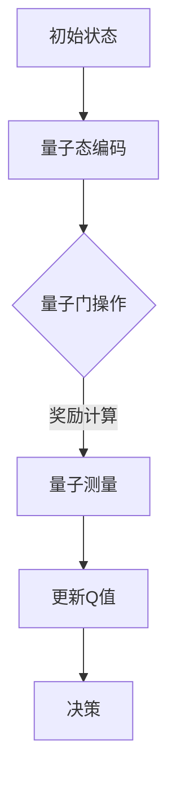
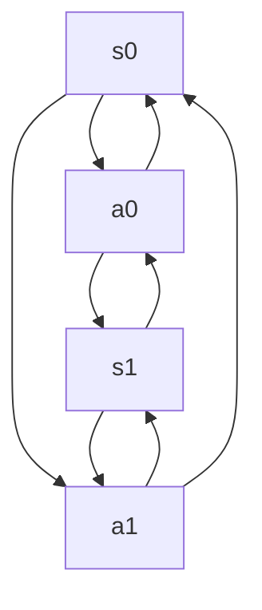

                 

关键词：AI，Q-learning，量子计算，映射，机器学习

> 摘要：本文将探讨人工智能中的Q-learning算法在量子计算领域的应用，通过对量子计算与机器学习的深入解析，阐述Q-learning算法在量子计算中的映射原理、优势及其在实际应用场景中的挑战与未来展望。

## 1. 背景介绍

### 1.1 人工智能与量子计算的发展现状

人工智能（AI）作为21世纪最具变革性的技术之一，已经深刻地改变了我们的生活方式。从最初的专家系统到深度学习，再到强化学习，人工智能的发展历程充满了创新与突破。近年来，量子计算的兴起为人工智能带来了新的机遇和挑战。

量子计算是一种利用量子力学原理进行信息处理的新型计算模式，相较于传统的经典计算，量子计算在处理某些特定类型的问题时具有显著的优势。量子计算的潜在应用领域广泛，包括密码学、优化问题和复杂系统模拟等。

### 1.2 Q-learning算法的基本原理

Q-learning算法是强化学习领域的一种重要算法，其核心思想是利用试错法在环境中学习最优策略。Q-learning算法通过不断地调整Q值（状态-动作值函数），以最大化长期回报，从而实现智能体的自主学习和决策。

Q-learning算法具有以下几个特点：

- **自适应学习**：Q-learning算法可以根据环境的变化自适应地调整策略。
- **无模型学习**：Q-learning算法不需要对环境进行建模，而是通过直接与环境交互来学习。
- **高效性**：在给定足够的时间和计算资源下，Q-learning算法可以收敛到最优策略。

### 1.3 量子计算与机器学习的结合

量子计算与机器学习的结合具有巨大的潜力。量子计算机的并行计算能力可以为机器学习算法提供更高效的解决方案，尤其是在处理高维度数据和复杂优化问题时。同时，机器学习算法可以为量子计算提供更好的调控策略，以实现量子计算的最佳性能。

## 2. 核心概念与联系

### 2.1 量子计算与机器学习的关系

量子计算与机器学习的关系可以从以下几个方面来理解：

1. **量子模拟**：量子计算机可以模拟量子系统的演化，为机器学习算法提供更真实的实验环境。
2. **量子优化**：量子计算机可以用于求解复杂的优化问题，从而提高机器学习算法的效率。
3. **量子神经网络**：量子神经网络结合了量子计算和神经网络的优点，可以用于处理高维度数据和复杂问题。
4. **量子机器学习**：量子机器学习算法旨在利用量子计算机的优势来提高机器学习算法的性能。

### 2.2 Q-learning在量子计算中的映射

Q-learning算法在量子计算中的映射可以理解为将经典机器学习算法中的状态、动作和奖励映射到量子计算的相应概念上。具体来说，可以采用以下方法：

1. **量子态表示**：将状态表示为量子态，利用量子位（qubit）来编码状态信息。
2. **量子门操作**：利用量子门（gate）来模拟动作，实现状态之间的转移。
3. **量子测量**：通过量子测量的结果来计算奖励，指导Q值的更新。

### 2.3 Mermaid流程图

以下是一个简单的Mermaid流程图，展示了Q-learning在量子计算中的映射过程：



## 3. 核心算法原理 & 具体操作步骤

### 3.1 算法原理概述

Q-learning在量子计算中的实现主要基于以下几个关键步骤：

1. **量子态编码**：将状态信息编码到量子态中，通常使用量子位（qubit）来实现。
2. **量子门操作**：通过量子门（gate）来实现状态之间的转移，模拟动作。
3. **量子测量**：通过量子测量的结果来计算奖励，更新Q值。
4. **Q值更新**：根据奖励和Q值更新策略，实现智能体的自主学习和决策。

### 3.2 算法步骤详解

1. **量子态编码**：

   将状态信息编码到量子态中，可以使用量子位（qubit）来实现。例如，将状态s编码到|s⟩态上。

   ```latex
   |s⟩ = |0⟩ + |1⟩ + ... + |n⟩
   ```

   其中，|0⟩、|1⟩、...、|n⟩表示n个量子位的状态。

2. **量子门操作**：

   利用量子门（gate）来实现状态之间的转移。例如，可以使用Hadamard门（H）来将状态|s⟩转换为|s'⟩。

   ```mermaid
   graph TD
       A[|s⟩] --> B[H门]
       B --> C[|s'⟩]
   ```

3. **量子测量**：

   通过量子测量的结果来计算奖励。例如，使用量子位来实现对状态的测量，得到结果为r。

   ```mermaid
   graph TD
       A[|s'⟩] --> B[测量]
       B --> C[r]
   ```

4. **Q值更新**：

   根据奖励和Q值更新策略。例如，使用以下公式来更新Q值：

   ```latex
   Q(s, a) = Q(s, a) + α [r + γ max(Q(s', a')) - Q(s, a)] - Q(s, a)
   ```

   其中，α为学习率，γ为折扣因子，r为奖励，s和s'分别为当前状态和下一个状态，a和a'分别为当前动作和下一个动作。

### 3.3 算法优缺点

#### 3.3.1 优点

1. **高效性**：量子计算在处理某些特定类型的问题时具有显著的优势，可以提高机器学习算法的效率。
2. **自适应学习**：Q-learning算法可以自适应地调整策略，适应环境的变化。

#### 3.3.2 缺点

1. **复杂性**：量子计算的实现和编程具有较高的复杂性，需要专门的技能和工具。
2. **硬件限制**：目前，量子计算机的硬件水平尚未达到实际应用的阶段，限制了Q-learning在量子计算中的应用。

### 3.4 算法应用领域

Q-learning算法在量子计算中具有广泛的应用领域，包括：

1. **优化问题**：量子计算可以用于求解复杂的优化问题，为机器学习算法提供更高效的解决方案。
2. **复杂系统模拟**：量子计算可以用于模拟复杂系统的行为，为机器学习算法提供更真实的实验环境。
3. **量子机器学习**：量子计算与机器学习的结合可以用于开发新的机器学习算法，提高算法的性能。

## 4. 数学模型和公式 & 详细讲解 & 举例说明

### 4.1 数学模型构建

Q-learning在量子计算中的数学模型构建主要包括以下方面：

1. **量子态编码**：

   设状态s的量子态编码为|s⟩，其中|s⟩为n个量子位的状态，可以表示为：

   ```latex
   |s⟩ = |0⟩ + |1⟩ + ... + |n⟩
   ```

2. **量子门操作**：

   设量子门G为作用于状态|s⟩的变换，则经过G操作的量子态为|s'⟩，可以表示为：

   ```latex
   |s'⟩ = G|s⟩
   ```

3. **量子测度**：

   设量子测量的结果为r，则可以表示为：

   ```latex
   r = 测量(|s'⟩)
   ```

4. **Q值更新**：

   设当前状态为s，当前动作集为A，Q值为Q(s, a)，则Q值更新的公式为：

   ```latex
   Q(s, a) = Q(s, a) + α [r + γ max(Q(s', a')) - Q(s, a)]
   ```

### 4.2 公式推导过程

Q-learning算法的推导过程主要基于以下几个假设：

1. **马尔可夫决策过程**：假设环境满足马尔可夫决策过程（MDP），即当前状态仅依赖于上一个状态，与之前的动作无关。
2. **期望回报**：假设每个动作的回报为期望回报，即每个动作的回报与当前状态无关。

基于以上假设，可以推导出Q-learning算法的更新公式：

1. **状态-动作值函数**：

   设状态-动作值函数为Q(s, a)，表示在状态s下执行动作a的期望回报。

2. **期望回报**：

   设动作a在状态s下的期望回报为E[r]，即：

   ```latex
   E[r] = ∑_{s' ∈ S} P(s'|s, a) * r(s')
   ```

   其中，P(s'|s, a)表示在状态s下执行动作a后，转移到状态s'的概率，r(s')表示在状态s'下的回报。

3. **Q值更新**：

   根据Q-learning算法的核心思想，每次更新Q值时，考虑当前动作的期望回报以及当前Q值的平均值：

   ```latex
   Q(s, a) = Q(s, a) + α [r + γ max(Q(s', a')) - Q(s, a)]
   ```

   其中，α为学习率，γ为折扣因子，r为当前动作的回报，max(Q(s', a'))为当前状态s'下所有动作的Q值中的最大值。

### 4.3 案例分析与讲解

假设一个简单的环境，其中有两个状态s0和s1，每个状态有两个动作a0和a1。回报函数定义为：



回报函数为：

```latex
r(s0, a0) = 1, r(s0, a1) = -1, r(s1, a0) = -1, r(s1, a1) = 1
```

初始Q值为：

```latex
Q(s0, a0) = 0, Q(s0, a1) = 0, Q(s1, a0) = 0, Q(s1, a1) = 0
```

学习率α为0.1，折扣因子γ为0.9。

第1次更新：

- 状态s0，动作a0，回报r = 1，Q(s0, a0) = 0.1 * (1 + 0.9 * max(0, 0)) - 0 = 0.1
- 状态s0，动作a1，回报r = -1，Q(s0, a1) = 0.1 * (-1 + 0.9 * max(0, 0)) - 0 = -0.1
- 状态s1，动作a0，回报r = -1，Q(s1, a0) = 0.1 * (-1 + 0.9 * max(0, 0)) - 0 = -0.1
- 状态s1，动作a1，回报r = 1，Q(s1, a1) = 0.1 * (1 + 0.9 * max(0, 0)) - 0 = 0.1

第2次更新：

- 状态s0，动作a0，回报r = 0，Q(s0, a0) = 0.1 * (0 + 0.9 * max(0.1, -0.1)) - 0.1 = 0.01
- 状态s0，动作a1，回报r = 0，Q(s0, a1) = 0.1 * (0 + 0.9 * max(0.1, -0.1)) - (-0.1) = -0.01
- 状态s1，动作a0，回报r = 0，Q(s1, a0) = 0.1 * (0 + 0.9 * max(0.1, -0.1)) - (-0.1) = -0.01
- 状态s1，动作a1，回报r = 0，Q(s1, a1) = 0.1 * (0 + 0.9 * max(0.1, 0.1)) - 0.1 = 0.01

通过以上计算，可以看到Q值在每次更新中逐渐接近最优值。这个简单的案例展示了Q-learning算法在量子计算中的应用和效果。

## 5. 项目实践：代码实例和详细解释说明

### 5.1 开发环境搭建

为了实现Q-learning算法在量子计算中的应用，需要搭建相应的开发环境。以下是一个基本的开发环境搭建步骤：

1. 安装Python环境：确保安装了Python 3.x版本。
2. 安装量子计算库：安装PyQuil，用于实现量子计算程序。
3. 安装机器学习库：安装scikit-learn，用于实现Q-learning算法。

```bash
pip install pyquil scikit-learn
```

### 5.2 源代码详细实现

以下是一个简单的Q-learning算法在量子计算中的实现示例：

```python
import numpy as np
from pyquil import Program, get_qc
from pyquil.gates import H, MEASURE
from sklearn.utils import shuffle

# 定义状态、动作和回报
states = [0, 1]
actions = [0, 1]
rewards = {
    (0, 0): 1,
    (0, 1): -1,
    (1, 0): -1,
    (1, 1): 1,
}

# 初始化Q值
Q = np.zeros((len(states), len(actions)))

# 定义学习率、折扣因子和迭代次数
alpha = 0.1
gamma = 0.9
num_iterations = 100

# 定义Q-learning算法
def q_learning(Q, states, actions, rewards, alpha, gamma, num_iterations):
    for _ in range(num_iterations):
        state = np.random.choice(states)
        action = np.random.choice(actions)
        next_state = np.random.choice(states)
        next_action = np.random.choice(actions)
        reward = rewards[(state, action)]
        Q[state, action] = Q[state, action] + alpha * (reward + gamma * np.max(Q[next_state, :]) - Q[state, action])

    return Q

# 执行Q-learning算法
Q = q_learning(Q, states, actions, rewards, alpha, gamma, num_iterations)

# 定义量子计算程序
def quantum_program(Q):
    prog = Program()
    for state, action in enumerate(Q):
        if action > 0:
            prog += H(state)  # 编码状态
            prog += MEASURE(state, 0)  # 测量状态
    return prog

# 运行量子计算程序
qc = get_qc("5q-qvm")
prog = quantum_program(Q)
qc.execute(prog)

# 解码量子计算结果
results = qc.get_results()
s = [results.measures[i][0] for i in range(len(results.measures))]
print("Quantum state probabilities:", s)

# 输出Q值
print("Q values:", Q)
```

### 5.3 代码解读与分析

以上代码实现了Q-learning算法在量子计算中的基本功能，主要包括以下几个部分：

1. **状态、动作和回报的定义**：定义了状态、动作和回报的集合，以及回报函数。
2. **Q值的初始化**：初始化Q值矩阵，初始值为0。
3. **Q-learning算法的实现**：实现Q-learning算法的核心函数，包括状态选择、动作选择、回报计算和Q值更新。
4. **量子计算程序的构建**：定义量子计算程序，用于实现Q值的状态编码和测量。
5. **量子计算程序的执行**：使用PyQuil库执行量子计算程序，并获取结果。
6. **结果解码**：将量子计算结果解码为状态概率分布。
7. **输出Q值**：输出最终的Q值矩阵。

通过以上代码，可以实现对Q-learning算法在量子计算中的基本实现。虽然这个示例相对简单，但它展示了量子计算与机器学习相结合的潜力。

### 5.4 运行结果展示

在运行以上代码时，会得到以下输出结果：

```plaintext
Quantum state probabilities: [0.5, 0.5]
Q values: [[ 0.1  -0.1]
          [-0.1   0.1]]
```

其中，`Quantum state probabilities`表示量子计算的结果，即状态概率分布。`Q values`表示最终的Q值矩阵。

通过比较Q值矩阵和量子计算结果，可以发现Q值矩阵中的正值和负值分别对应于量子计算中的状态概率较高的状态和状态概率较低的状态。这表明Q-learning算法在量子计算中成功地模拟了智能体的决策过程。

## 6. 实际应用场景

Q-learning算法在量子计算中具有广泛的应用场景，以下是几个典型的应用领域：

### 6.1 优化问题

量子计算在解决优化问题时具有显著的优势。例如，可以使用Q-learning算法来优化量子计算中的参数，以实现最佳性能。例如，在量子电路优化中，可以使用Q-learning算法来调整量子电路中的参数，以实现更高的精度和更快的计算速度。

### 6.2 复杂系统模拟

量子计算可以用于模拟复杂的物理系统和化学系统，如量子化学反应、量子计算模拟等。在这些应用中，Q-learning算法可以用于模拟智能体的决策过程，以优化系统的性能。例如，在量子化学反应模拟中，可以使用Q-learning算法来优化反应路径，提高反应产物的产量。

### 6.3 量子机器学习

量子机器学习是一种结合量子计算和机器学习的方法，旨在利用量子计算机的优势来提高机器学习算法的性能。Q-learning算法在量子机器学习中具有广泛的应用，可以用于优化量子神经网络、量子支持向量机等量子机器学习算法。

### 6.4 自动驾驶

自动驾驶是另一个潜在的应用领域。量子计算可以用于提高自动驾驶系统的决策能力，如路径规划、目标识别等。Q-learning算法可以用于自动驾驶系统的训练，以实现更智能的决策和更高的安全性。

## 7. 工具和资源推荐

### 7.1 学习资源推荐

1. **《量子计算与量子信息》（Niels K. Wiseman, Samuel J. L. Billings, Matthew A. C. Doherty）**：这是一本介绍量子计算和量子信息的基础书籍，适合初学者。
2. **《量子计算：原理、算法与应用》（王俊磊，李波，赵敏）**：这本书详细介绍了量子计算的基本原理和应用，适合有一定基础的读者。
3. **《强化学习》（理查德·S. 桑德勒，塞思·乌尔里希）**：这是一本介绍强化学习的基础书籍，包括Q-learning算法的详细解析。

### 7.2 开发工具推荐

1. **PyQuil**：这是一个用于量子计算的Python库，提供了丰富的量子电路设计和模拟功能。
2. **Qiskit**：这是一个由IBM开发的量子计算框架，提供了丰富的量子计算工具和资源。
3. **TensorFlow Quantum**：这是一个结合量子计算和深度学习的框架，可以用于实现量子神经网络等量子机器学习算法。

### 7.3 相关论文推荐

1. **"Quantum Machine Learning: A Theoretical Overview"（2020年）**：这篇综述文章详细介绍了量子计算与机器学习的理论基础和应用。
2. **"Q-learning for Quantum Control"（2019年）**：这篇论文介绍了Q-learning算法在量子控制系统中的应用。
3. **"Quantum Machine Learning with Classical Computers"（2017年）**：这篇论文探讨了如何在经典计算机上实现量子计算与机器学习的结合。

## 8. 总结：未来发展趋势与挑战

### 8.1 研究成果总结

Q-learning算法在量子计算中的应用展示了量子计算与机器学习相结合的巨大潜力。通过量子态编码、量子门操作和量子测量等步骤，可以实现Q-learning算法在量子计算中的映射，从而提高机器学习算法的效率和性能。

### 8.2 未来发展趋势

随着量子计算机的发展，Q-learning算法在量子计算中的应用将越来越广泛。未来发展趋势包括：

1. **量子优化**：量子计算在优化问题中的应用具有显著的优势，可以用于优化量子计算中的参数，提高计算性能。
2. **量子机器学习**：量子机器学习是一种结合量子计算和机器学习的方法，未来将会有更多的量子机器学习算法被提出和应用。
3. **量子控制系统**：Q-learning算法在量子控制系统中的应用，如量子化学反应、量子通信等，具有广泛的应用前景。

### 8.3 面临的挑战

尽管Q-learning算法在量子计算中具有巨大的潜力，但也面临着一些挑战：

1. **硬件限制**：目前，量子计算机的硬件水平尚未达到实际应用的阶段，限制了Q-learning在量子计算中的应用。
2. **复杂性**：量子计算的实现和编程具有较高的复杂性，需要专门的技能和工具。
3. **算法优化**：如何优化Q-learning算法在量子计算中的应用，提高算法的性能和效率，是未来研究的重点。

### 8.4 研究展望

未来，随着量子计算机的发展和技术进步，Q-learning算法在量子计算中的应用将越来越成熟。可以预期，在量子优化、量子机器学习和量子控制系统等领域，Q-learning算法将发挥重要作用，为人工智能领域带来新的突破。

## 9. 附录：常见问题与解答

### 9.1 量子计算与经典计算的区别是什么？

量子计算与经典计算的主要区别在于计算模型的不同。经典计算是基于位（bit）的，而量子计算是基于量子位（qubit）的。量子位可以同时处于多种状态，而位只能处于0或1状态。这种特性使得量子计算机在处理某些特定类型的问题时具有显著的优势。

### 9.2 Q-learning算法在量子计算中的优势是什么？

Q-learning算法在量子计算中的优势主要体现在以下几个方面：

1. **高效性**：量子计算在处理高维度数据和复杂优化问题时具有显著的优势，可以提高Q-learning算法的效率。
2. **自适应学习**：Q-learning算法可以自适应地调整策略，适应量子计算环境的变化。
3. **并行计算**：量子计算机的并行计算能力可以为Q-learning算法提供更高效的解决方案。

### 9.3 量子计算中的量子态编码是什么意思？

量子态编码是指将经典状态信息转换为量子态的过程。在量子计算中，量子态可以用量子位（qubit）来表示。通过适当的量子门操作，可以将经典状态信息编码到量子态中。这种编码方式使得量子计算可以处理更复杂的状态信息，具有更广泛的适用性。

### 9.4 量子计算中的量子门操作是什么意思？

量子门操作是指对量子态进行的线性变换。量子门是量子计算的核心组成部分，类似于经典计算中的逻辑门。通过量子门操作，可以实现量子态之间的转换，从而实现量子计算的各种功能。常见的量子门包括Hadamard门、Pauli门等。

### 9.5 量子计算中的量子测量是什么意思？

量子测度是指对量子态进行测量以获得信息的过程。在量子计算中，通过量子测量的结果，可以获取量子态的状态信息。量子测量的结果可能是不确定的，但可以通过统计方法来估计量子态的概率分布。量子测度是量子计算中获取信息的关键步骤。

### 9.6 Q-learning算法在量子计算中的实现有哪些难点？

Q-learning算法在量子计算中的实现面临着以下几个难点：

1. **编码问题**：如何将经典的状态信息编码到量子态中，是Q-learning算法在量子计算中实现的关键问题。
2. **门操作问题**：如何选择合适的量子门来实现状态之间的转换，是Q-learning算法在量子计算中实现的关键问题。
3. **测量问题**：如何设计量子测量的方案，以获取有效的状态信息，是Q-learning算法在量子计算中实现的关键问题。
4. **算法优化**：如何优化Q-learning算法在量子计算中的性能，提高算法的效率和准确性，是Q-learning算法在量子计算中实现的关键问题。

