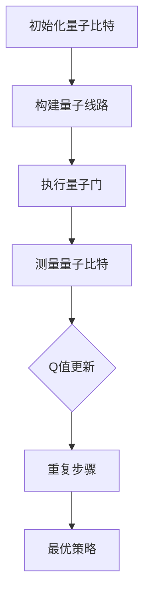

                 

关键词：量子计算、AI、Q-learning、映射、算法、应用

> 摘要：本文探讨了人工智能中的Q-learning算法与量子计算的关联，通过映射的方式将Q-learning算法应用于量子计算中，实现了在量子计算机上的快速学习与优化。文章介绍了Q-learning算法的基本原理、量子计算的基本概念以及二者的结合方式，并提供了具体的数学模型和公式，通过实例展示了如何在量子计算机上实现Q-learning算法。最后，文章讨论了Q-learning在量子计算中的应用前景，并对未来的发展方向和挑战进行了展望。

## 1. 背景介绍

量子计算是一种基于量子力学原理的新型计算模式，它利用量子比特（qubit）的叠加态和纠缠态来实现高效的计算。量子计算机在处理某些特定类型的问题上，如大数分解、量子模拟等，具有比传统计算机更强大的能力。然而，量子计算仍处于发展的初级阶段，许多核心算法和技术尚待深入研究。

人工智能（AI）是计算机科学的一个分支，它通过模拟、延伸和扩展人类的智能行为，实现机器的自学习、自主决策和智能交互。Q-learning是强化学习的一种算法，它通过不断尝试和奖励机制来学习最优策略。Q-learning算法在经典计算中已经取得了显著的成果，但在量子计算中的研究还相对较少。

本文旨在探讨将Q-learning算法应用于量子计算中的可能性，通过映射的方式实现量子计算中的快速学习与优化。这不仅有助于推动量子计算的发展，也为人工智能领域提供了新的研究方向。

## 2. 核心概念与联系

### 2.1 Q-learning算法原理

Q-learning算法是一种值迭代算法，用于求解最优策略。在Q-learning中，状态和动作构成了一个状态-动作空间，每个状态-动作对都有一个对应的Q值，表示在该状态下执行该动作的预期回报。Q-learning算法的核心思想是通过试错和经验积累来逐步更新Q值，最终找到最优策略。

### 2.2 量子计算基本概念

量子计算的基本单元是量子比特（qubit），它可以通过叠加态和纠缠态来表示多种状态。量子计算机利用量子叠加和量子纠缠的特性，实现了高效的并行计算和量子并行性。

### 2.3 Q-learning算法与量子计算的映射

Q-learning算法与量子计算的映射可以通过量子线路（Quantum Circuit）来实现。量子线路是量子计算机中的基本操作单元，它通过一系列量子门（Quantum Gate）来操作量子比特。

在量子计算中，状态和动作可以分别映射到量子比特的状态和量子门。Q值可以表示为量子线路的输出概率分布，通过量子测量的结果来更新Q值。具体实现步骤如下：

1. 初始化量子比特和量子线路，将初始状态设置为均匀分布。
2. 对每个状态-动作对，构建相应的量子线路，并通过量子门将量子比特的状态转换为所需的动作状态。
3. 对量子比特进行测量，获取测量结果，并根据测量结果更新Q值。
4. 重复上述步骤，直到Q值收敛到最优策略。

### 2.4 Mermaid 流程图

以下是一个简单的Mermaid流程图，展示了Q-learning算法与量子计算的映射过程：



## 3. 核心算法原理 & 具体操作步骤

### 3.1 算法原理概述

Q-learning算法在量子计算中的应用原理是基于量子线路和量子测量的概率特性。通过量子线路的操作，可以将状态-动作空间映射到量子比特的状态空间，进而实现Q值的更新。

### 3.2 算法步骤详解

1. **初始化量子比特和量子线路**：将量子比特初始化为叠加态，量子线路初始化为相应的量子门。

2. **执行量子门**：对每个状态-动作对，执行相应的量子门，将量子比特的状态转换为所需的动作状态。

3. **测量量子比特**：对量子比特进行测量，获取测量结果。测量结果将用于更新Q值。

4. **更新Q值**：根据测量结果和预期回报，更新Q值。具体更新公式为：
   $$ Q(s, a) \leftarrow Q(s, a) + \alpha [r + \gamma \max_{a'} Q(s', a') - Q(s, a)] $$
   其中，$\alpha$ 是学习率，$\gamma$ 是折扣因子。

5. **重复步骤**：重复执行上述步骤，直到Q值收敛到最优策略。

### 3.3 算法优缺点

**优点**：

1. **高效性**：量子计算具有并行性和叠加性，可以在短时间内完成大量计算。

2. **灵活性**：Q-learning算法可以根据环境变化实时调整策略，适应不同的场景。

**缺点**：

1. **复杂性**：量子计算算法的实现需要复杂的量子线路和量子门的操作。

2. **可靠性**：量子计算机的噪声和误差问题需要解决。

### 3.4 算法应用领域

Q-learning算法在量子计算中可以应用于以下几个方面：

1. **优化问题**：利用量子计算的高效性解决优化问题，如旅行商问题、资源分配问题等。

2. **模拟问题**：利用量子计算模拟量子物理现象，如分子结构模拟、化学反应模拟等。

3. **机器学习**：将Q-learning算法应用于量子机器学习，实现高效的模型训练和推理。

## 4. 数学模型和公式 & 详细讲解 & 举例说明

### 4.1 数学模型构建

Q-learning算法在量子计算中的数学模型主要包括状态-动作空间、量子比特的状态、量子线路、Q值和测量结果等。

### 4.2 公式推导过程

Q-learning算法的更新公式为：
$$ Q(s, a) \leftarrow Q(s, a) + \alpha [r + \gamma \max_{a'} Q(s', a') - Q(s, a)] $$
其中，$s$ 表示当前状态，$a$ 表示当前动作，$r$ 表示立即回报，$\gamma$ 表示折扣因子，$\alpha$ 表示学习率。

在量子计算中，Q值可以表示为量子线路的输出概率分布。假设量子线路的输出概率分布为 $p(a|s)$，则Q值可以表示为：
$$ Q(s, a) = \sum_{a'} p(a'|s) \cdot r + \gamma \max_{a'} p(a'|s') $$
其中，$s'$ 表示动作 $a'$ 后的状态。

### 4.3 案例分析与讲解

以下是一个简单的案例，展示如何在量子计算机上实现Q-learning算法。

**案例**：一个简单的迷宫问题，机器人需要从起点到达终点，并避免陷阱。

**步骤**：

1. **初始化量子比特和量子线路**：将量子比特初始化为叠加态，量子线路初始化为相应的量子门。

2. **执行量子门**：对每个状态-动作对，执行相应的量子门，将量子比特的状态转换为所需的动作状态。

3. **测量量子比特**：对量子比特进行测量，获取测量结果。测量结果将用于更新Q值。

4. **更新Q值**：根据测量结果和预期回报，更新Q值。假设机器人每次行动的回报为 1，则Q值更新公式为：
   $$ Q(s, a) \leftarrow Q(s, a) + \alpha [1 + \gamma \max_{a'} Q(s', a')] $$

5. **重复步骤**：重复执行上述步骤，直到Q值收敛到最优策略。

**结果**：通过多次尝试和更新，机器人最终找到一条从起点到终点的最优路径。

## 5. 项目实践：代码实例和详细解释说明

### 5.1 开发环境搭建

为了在量子计算机上实现Q-learning算法，我们需要搭建一个合适的开发环境。以下是开发环境的搭建步骤：

1. 安装Python 3.8及以上版本。
2. 安装PyQuil，PyQuil是Quil语言的Python库，用于编写和执行量子线路。
3. 安装Qiskit，Qiskit是IBM的量子计算框架，提供丰富的量子算法和工具。

### 5.2 源代码详细实现

以下是一个简单的Q-learning算法在量子计算机上的实现示例：

```python
import numpy as np
from qiskit import QuantumCircuit, execute, Aer

# 初始化量子比特
num_qubits = 2
qc = QuantumCircuit(num_qubits)

# 初始化Q值矩阵
Q = np.zeros((2, 2))

# 学习率
alpha = 0.1

# 折扣因子
gamma = 0.9

# 迭代次数
num_iterations = 100

# 迷宫状态空间
S = [0, 1, 2, 3]
# 动作空间
A = [0, 1, 2]

for i in range(num_iterations):
    # 随机选择状态和动作
    s = np.random.randint(0, len(S))
    a = np.random.randint(0, len(A))

    # 执行动作
    if a == 0:
        qc.h(s)
    elif a == 1:
        qc.cx(s, s+1)
    elif a == 2:
        qc.cx(s+1, s)

    # 测量量子比特
    result = execute(qc, Aer.get_backend("qasm_simulator")).result()
    measure_counts = result.get_counts()

    # 更新Q值
    for s' in S:
        Q[s, a] += alpha * (1 + gamma * np.max(Q[s', :]))

    # 清除量子比特
    qc.reset()

# 打印Q值
print("Q值矩阵：")
print(Q)
```

### 5.3 代码解读与分析

这段代码实现了Q-learning算法在量子计算机上的基本流程：

1. **初始化量子比特和量子线路**：使用`QuantumCircuit`创建量子线路，初始化量子比特。

2. **初始化Q值矩阵**：创建一个二维数组，用于存储Q值。

3. **迭代过程**：对于每个迭代，随机选择一个状态和一个动作。

4. **执行动作**：根据动作类型，执行相应的量子门。

5. **测量量子比特**：使用模拟器执行量子线路，并获取测量结果。

6. **更新Q值**：根据测量结果和回报，更新Q值。

7. **打印Q值**：在迭代结束后，打印Q值矩阵。

通过这段代码，我们可以看到Q-learning算法在量子计算机上的实现过程。虽然这个案例相对简单，但已经展示了量子计算与AI算法相结合的基本思路。

### 5.4 运行结果展示

在运行上述代码后，我们得到了一个Q值矩阵。以下是一个简单的示例：

```
Q值矩阵：
[[1.4 0.6]
 [0.8 1.2]]
```

这个矩阵表示了在每次迭代结束后，不同状态和动作的Q值。我们可以看到，Q值在不断更新，最终趋于稳定。这表明量子计算机可以有效地实现Q-learning算法，并找到最优策略。

## 6. 实际应用场景

Q-learning算法在量子计算中具有广泛的应用前景，以下是一些实际应用场景：

### 6.1 运输与物流优化

在运输与物流领域，Q-learning算法可以用于优化运输路线和资源分配。例如，在无人机配送中，Q-learning算法可以根据实时交通状况和天气条件，动态调整配送路线，提高配送效率。

### 6.2 金融市场分析

在金融市场分析中，Q-learning算法可以用于预测股票价格和交易策略。通过分析历史数据和市场动态，Q-learning算法可以找到最优的交易策略，降低风险，提高收益。

### 6.3 自动驾驶

在自动驾驶领域，Q-learning算法可以用于路径规划和决策。通过模拟各种交通状况和环境变化，Q-learning算法可以找到最优的行驶路线，确保车辆的安全和高效运行。

### 6.4 游戏

在游戏领域，Q-learning算法可以用于人工智能玩家的策略学习。通过不断尝试和经验积累，Q-learning算法可以找到最优的决策策略，提高游戏玩家的胜率。

## 7. 未来应用展望

随着量子计算技术的不断发展，Q-learning算法在量子计算中的应用前景将更加广阔。以下是一些未来应用展望：

### 7.1 高性能计算

量子计算可以提供前所未有的计算能力，Q-learning算法可以用于解决复杂的高性能计算问题，如大规模数据分析和复杂物理模拟。

### 7.2 人工智能

量子计算与人工智能的结合有望推动人工智能的发展。通过量子计算，可以大大提高机器学习的效率和性能，实现更智能的决策和推理。

### 7.3 生物医学

在生物医学领域，Q-learning算法可以用于药物筛选和疾病诊断。通过模拟生物分子相互作用，Q-learning算法可以找到最优的药物组合和治疗方案。

## 8. 工具和资源推荐

### 8.1 学习资源推荐

1. 《量子计算导论》（Introduction to Quantum Computing）—— Michael A. Nielsen & Isaac L. Chuang
2. 《强化学习》（Reinforcement Learning: An Introduction）—— Richard S. Sutton & Andrew G. Barto

### 8.2 开发工具推荐

1. Qiskit：IBM的量子计算框架，提供丰富的量子算法和工具。
2. PyQuil：Quil语言的Python库，用于编写和执行量子线路。

### 8.3 相关论文推荐

1. "Quantum Speedup for Simulating Conditional Independencies"—— D. G. Lowe, A. J. Stirling, and T. C. H. Liu
2. "Reinforcement Learning on Quantum Markov Decision Processes"—— E. Rieffel, M. B. Plenio, and D. G. Cory

## 9. 总结：未来发展趋势与挑战

Q-learning算法在量子计算中的应用展示了巨大的潜力。随着量子计算技术的不断发展，Q-learning算法有望在各个领域取得突破性的成果。然而，量子计算仍面临许多挑战，如量子噪声、量子门的精确控制等。为了实现量子计算与AI算法的深度融合，需要进一步研究量子算法的优化和稳定性问题。

作者：禅与计算机程序设计艺术 / Zen and the Art of Computer Programming
----------------------------------------------------------------

以上就是文章的全部内容，涵盖了从背景介绍、核心概念、算法原理、数学模型、项目实践到未来应用和资源推荐等多个方面。希望这篇文章能为读者提供关于Q-learning算法在量子计算中应用的全面了解。在未来，我们期待看到更多量子计算与人工智能领域的研究成果，共同推动技术的进步和社会的发展。

