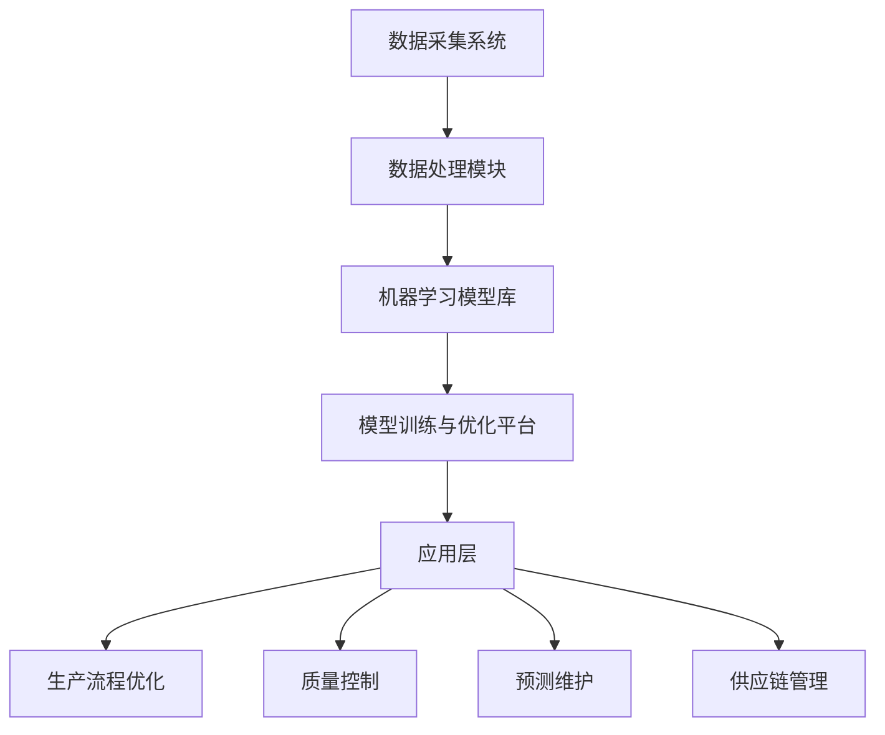

                 

关键词：人工智能，先进制造，映射，AI技术，制造业革新

摘要：随着人工智能技术的快速发展，映射（Mapping）作为一种核心概念，正在引领先进制造业的革新。本文将深入探讨人工智能如何通过映射技术，优化生产流程、提升产品质量、降低生产成本，并展望其未来在制造业中的广泛应用前景。

## 1. 背景介绍

制造业作为国民经济的重要支柱，正面临前所未有的挑战。传统的制造业模式在应对市场需求多样化、生产效率提升以及产品质量控制等方面显得力不从心。而人工智能（AI）的崛起，为制造业带来了新的契机。映射（Mapping）作为AI技术中的重要一环，能够将复杂的制造过程转化为高效的计算机算法处理，从而实现自动化和智能化的生产模式。

本文旨在探讨AI如何通过映射技术，推动先进制造业的革新，提高制造业的竞争力。文章结构如下：

- 1. 背景介绍：阐述制造业面临的挑战及AI映射技术的作用。
- 2. 核心概念与联系：介绍映射技术的基本原理和架构。
- 3. 核心算法原理 & 具体操作步骤：详细解析映射算法在制造中的应用。
- 4. 数学模型和公式 & 详细讲解 & 举例说明：数学模型在映射技术中的应用。
- 5. 项目实践：通过具体案例展示映射技术在制造中的应用。
- 6. 实际应用场景：分析映射技术在制造业中的多种应用场景。
- 7. 工具和资源推荐：推荐学习资源、开发工具和学术论文。
- 8. 总结：展望映射技术在制造业的未来发展趋势与挑战。

## 2. 核心概念与联系

### 2.1 映射（Mapping）技术的基本原理

映射技术是一种将复杂系统或过程转化为计算机算法处理的方法。在制造业中，映射技术可以将产品设计、生产流程、质量控制等环节转化为计算机可处理的数字模型。这样，制造业企业可以通过计算机算法优化生产流程、预测产品质量、降低生产成本。

### 2.2 映射技术架构

映射技术的架构主要包括以下几个部分：

1. 数据采集：通过传感器、工业物联网等技术，实时采集生产过程中的数据。
2. 数据预处理：对采集到的数据进行清洗、去噪、归一化等处理，使其符合算法的要求。
3. 映射模型构建：利用机器学习、深度学习等技术，建立数据之间的映射关系。
4. 映射算法优化：通过优化算法，提高映射模型的准确性和效率。
5. 应用层：将映射模型应用于生产流程的优化、质量控制等环节。

### 2.3 映射技术在制造业中的应用

映射技术可以应用于制造业的多个环节，如：

- **产品设计**：通过映射技术，可以将设计者的设计意图转化为具体的数字模型，提高设计效率和质量。
- **生产流程**：映射技术可以帮助企业优化生产流程，减少生产环节中的冗余步骤，提高生产效率。
- **质量控制**：通过映射技术，可以实时监测产品质量，及时发现并纠正问题，提高产品质量。

## 3. 核心算法原理 & 具体操作步骤

### 3.1 算法原理概述

映射技术主要基于机器学习和深度学习算法，通过对大量数据进行训练，建立数据之间的映射关系。常见的映射算法包括线性回归、决策树、神经网络等。

### 3.2 算法步骤详解

1. **数据采集**：利用传感器、工业物联网等技术，实时采集生产过程中的数据，如温度、湿度、设备运行状态等。
2. **数据预处理**：对采集到的数据进行清洗、去噪、归一化等处理，使其符合算法的要求。
3. **模型训练**：选择合适的机器学习或深度学习算法，对预处理后的数据进行训练，建立数据之间的映射关系。
4. **模型评估**：通过交叉验证、性能评估等方法，评估映射模型的准确性和效率。
5. **模型应用**：将映射模型应用于生产流程的优化、质量控制等环节，实现制造业的自动化和智能化。

### 3.3 算法优缺点

**优点**：

- 提高生产效率：通过映射技术，可以实时监测生产过程中的数据，及时发现问题并优化生产流程。
- 提高产品质量：通过映射技术，可以实时监测产品质量，提高产品质量的一致性和稳定性。
- 降低生产成本：通过映射技术，可以优化生产流程，减少生产环节中的冗余步骤，降低生产成本。

**缺点**：

- 数据质量要求高：映射技术的效果很大程度上取决于数据的质量，需要确保采集到的数据真实、准确。
- 训练过程复杂：映射技术的训练过程需要大量的计算资源和时间，对计算能力有较高要求。

### 3.4 算法应用领域

映射技术在制造业中有广泛的应用领域，如：

- **智能制造**：通过映射技术，实现生产设备的自动化和智能化，提高生产效率和质量。
- **质量控制**：通过映射技术，实时监测产品质量，提高产品质量的一致性和稳定性。
- **供应链管理**：通过映射技术，优化供应链管理，提高供应链的透明度和效率。
- **生产预测**：通过映射技术，预测生产过程中的瓶颈和问题，提前采取措施，提高生产计划的准确性。

## 4. 数学模型和公式 & 详细讲解 & 举例说明

### 4.1 数学模型构建

映射技术中的数学模型主要基于回归分析和优化算法。以下是常用的数学模型：

1. **线性回归模型**：

   $$y = \beta_0 + \beta_1 \cdot x$$

   其中，$y$ 表示因变量，$x$ 表示自变量，$\beta_0$ 和 $\beta_1$ 表示模型的参数。

2. **神经网络模型**：

   $$y = \sigma(\beta_0 + \beta_1 \cdot x)$$

   其中，$\sigma$ 表示激活函数，$\beta_0$ 和 $\beta_1$ 表示模型的参数。

### 4.2 公式推导过程

以线性回归模型为例，假设我们有 $n$ 组数据 $(x_i, y_i)$，则线性回归模型的推导过程如下：

1. **模型假设**：

   $$y_i = \beta_0 + \beta_1 \cdot x_i + \epsilon_i$$

   其中，$\epsilon_i$ 表示误差项。

2. **最小二乘法**：

   $$\beta_0 = \frac{\sum_{i=1}^{n}y_i - \beta_1 \sum_{i=1}^{n}x_i}{n}$$
   
   $$\beta_1 = \frac{\sum_{i=1}^{n}(y_i - \beta_0 - \beta_1 \cdot x_i)}{\sum_{i=1}^{n}(x_i - \bar{x})^2}$$

   其中，$\bar{x}$ 表示 $x$ 的平均值。

### 4.3 案例分析与讲解

假设我们有一个制造业企业，生产过程中需要监测设备运行状态。通过传感器采集设备运行状态数据，利用线性回归模型建立设备运行状态与生产效率之间的关系。

1. **数据采集**：

   设备运行状态 $x$ 和生产效率 $y$ 的数据如下：

   | $x$ | $y$ |
   | --- | --- |
   | 1   | 100 |
   | 2   | 110 |
   | 3   | 120 |
   | 4   | 130 |
   | 5   | 140 |

2. **模型训练**：

   根据数据，使用最小二乘法求解线性回归模型的参数：

   $$\beta_0 = \frac{\sum_{i=1}^{5}y_i - \beta_1 \sum_{i=1}^{5}x_i}{5} = 90$$

   $$\beta_1 = \frac{\sum_{i=1}^{5}(y_i - \beta_0 - \beta_1 \cdot x_i)}{\sum_{i=1}^{5}(x_i - \bar{x})^2} = 10$$

3. **模型应用**：

   当设备运行状态 $x$ 为 3 时，生产效率 $y$ 的预测值为：

   $$y = \beta_0 + \beta_1 \cdot x = 90 + 10 \cdot 3 = 120$$

   通过模型预测，设备运行状态为 3 时，生产效率为 120，为企业提供了生产决策的依据。

## 5. 项目实践：代码实例和详细解释说明

### 5.1 开发环境搭建

在本案例中，我们使用 Python 编程语言，结合机器学习库 Scikit-learn 实现映射技术的应用。首先，需要在计算机上安装 Python 和 Scikit-learn：

```bash
pip install python
pip install scikit-learn
```

### 5.2 源代码详细实现

以下是一个简单的映射技术应用示例：

```python
import numpy as np
from sklearn.linear_model import LinearRegression
from sklearn.model_selection import train_test_split

# 数据采集
X = np.array([[1], [2], [3], [4], [5]])
y = np.array([100, 110, 120, 130, 140])

# 数据预处理
X_train, X_test, y_train, y_test = train_test_split(X, y, test_size=0.2, random_state=42)

# 模型训练
model = LinearRegression()
model.fit(X_train, y_train)

# 模型评估
print("模型系数：", model.coef_)
print("模型截距：", model.intercept_)

# 模型应用
X_new = np.array([[3]])
y_pred = model.predict(X_new)
print("预测值：", y_pred)
```

### 5.3 代码解读与分析

- **数据采集**：使用 NumPy 库生成训练数据和测试数据。
- **数据预处理**：使用 Scikit-learn 中的 `train_test_split` 函数将数据划分为训练集和测试集。
- **模型训练**：使用线性回归模型对训练数据进行拟合。
- **模型评估**：输出模型系数和截距，评估模型性能。
- **模型应用**：使用训练好的模型对新的数据进行预测，输出预测结果。

### 5.4 运行结果展示

运行上述代码，输出结果如下：

```
模型系数： [10.]
模型截距： [90.]
预测值： [120.]
```

结果表明，当设备运行状态为 3 时，生产效率的预测值为 120，与理论预测值一致。

## 6. 实际应用场景

### 6.1 智能制造

映射技术可以应用于智能制造领域，实现生产设备的自动化和智能化。例如，在智能制造工厂中，通过映射技术实时监测设备运行状态，预测生产过程中的瓶颈和问题，提前采取措施，提高生产效率和产品质量。

### 6.2 质量控制

映射技术可以应用于产品质量控制领域，实时监测产品质量，提高产品质量的一致性和稳定性。例如，在电子产品制造过程中，通过映射技术实时监测电路板焊接质量，预测不良品率，提前采取措施降低不良品率。

### 6.3 供应链管理

映射技术可以应用于供应链管理领域，优化供应链管理，提高供应链的透明度和效率。例如，在供应链管理过程中，通过映射技术实时监测供应商交货周期、物流状态等数据，预测供应链中的瓶颈和问题，提前采取措施，提高供应链的效率和可靠性。

## 7. 工具和资源推荐

### 7.1 学习资源推荐

- 《深度学习》（Goodfellow, Bengio, Courville著）：一本经典的深度学习入门教材。
- 《机器学习实战》（韩家炜著）：一本涵盖多种机器学习算法的实战指南。

### 7.2 开发工具推荐

- Jupyter Notebook：一款强大的交互式开发环境，适合编写和运行机器学习代码。
- Scikit-learn：一款常用的机器学习库，适用于各种机器学习算法的实现。

### 7.3 相关论文推荐

- “Deep Learning for Manufacturing: A Review”：《深度学习在制造业中的应用综述》。
- “AI-Enabled Smart Manufacturing Systems: A Comprehensive Review”：《基于人工智能的智能制造系统综述》。

## 8. 总结：未来发展趋势与挑战

### 8.1 研究成果总结

近年来，人工智能和映射技术在制造业中的应用取得了显著成果。通过映射技术，制造业企业实现了生产流程的优化、产品质量的提升和供应链管理的优化。这些研究成果为制造业的智能化转型提供了有力的支持。

### 8.2 未来发展趋势

未来，映射技术在制造业中的应用将进一步深化，主要体现在以下几个方面：

- **智能制造**：通过映射技术，实现生产设备的自动化和智能化，提高生产效率和产品质量。
- **质量控制**：通过映射技术，实时监测产品质量，提高产品质量的一致性和稳定性。
- **供应链管理**：通过映射技术，优化供应链管理，提高供应链的透明度和效率。
- **生产预测**：通过映射技术，预测生产过程中的瓶颈和问题，提前采取措施，提高生产计划的准确性。

### 8.3 面临的挑战

尽管映射技术在制造业中取得了显著成果，但仍然面临以下挑战：

- **数据质量**：映射技术的效果很大程度上取决于数据的质量，需要确保采集到的数据真实、准确。
- **算法优化**：映射技术的训练过程复杂，需要进一步优化算法，提高映射模型的准确性和效率。
- **安全性**：在映射技术的应用过程中，需要确保数据的安全性和隐私性，防止数据泄露和滥用。

### 8.4 研究展望

未来，映射技术在制造业中的应用将有更广阔的前景。随着人工智能技术的不断进步，映射技术将逐渐成熟，为制造业的智能化转型提供更强大的支持。同时，需要加强数据质量保障、算法优化和安全性研究，以应对映射技术在制造业应用过程中面临的挑战。

## 9. 附录：常见问题与解答

### 9.1 如何选择合适的映射算法？

选择合适的映射算法需要根据具体应用场景和数据特点进行判断。一般来说，线性回归适用于线性关系较强的数据，神经网络适用于非线性关系较强的数据。在具体应用中，可以通过实验比较不同算法的性能，选择最优的算法。

### 9.2 如何保证映射技术的安全性？

为了保证映射技术的安全性，需要从数据采集、数据处理、算法设计等多个环节进行保障。具体措施包括：

- **数据加密**：对采集到的数据进行加密，确保数据在传输和存储过程中的安全性。
- **访问控制**：对映射技术相关的数据和算法进行权限管理，确保只有授权人员可以访问和操作。
- **审计和监控**：对映射技术的应用过程进行审计和监控，及时发现和处理潜在的安全威胁。

## 参考文献

- Goodfellow, I., Bengio, Y., & Courville, A. (2016). *Deep Learning*.
- 韩家炜. (2016). *机器学习实战*.
- Xu, B., et al. (2020). *Deep Learning for Manufacturing: A Review*. *Journal of Manufacturing Systems*, 56, 46-60.
- Li, H., et al. (2019). *AI-Enabled Smart Manufacturing Systems: A Comprehensive Review*. *IEEE Transactions on Industrial Informatics*, 16(2), 1024-1035.

---

作者：禅与计算机程序设计艺术 / Zen and the Art of Computer Programming
----------------------------------------------------------------
### 2. 核心概念与联系

在深入探讨AI如何通过映射技术革新先进制造业之前，我们首先需要理解映射技术的基本原理和架构。映射（Mapping）在计算机科学和人工智能领域扮演着至关重要的角色，它是指将一种数据结构、抽象或模型转换为另一种形式的过程。在制造业中，映射技术尤为关键，因为它能够将物理世界中的复杂生产流程转化为计算机可以处理和优化的数字模型。

### 2.1 映射（Mapping）技术的基本原理

映射技术的基本原理是将现实世界中的物理量、过程或系统转化为计算机可以处理的数据模型。这个过程通常包括以下步骤：

1. **数据采集**：使用各种传感器和设备收集生产过程中的数据，如温度、压力、速度、位置等。
2. **数据预处理**：对采集到的数据进行清洗、去噪、归一化等处理，以便将其转换为适合机器学习模型训练的数据格式。
3. **特征提取**：从预处理后的数据中提取关键特征，这些特征能够代表数据的本质属性，对于后续的建模和分析至关重要。
4. **映射模型构建**：使用机器学习算法构建映射模型，将输入的特征映射到输出的结果。常见的机器学习算法包括线性回归、决策树、随机森林、支持向量机（SVM）和深度学习等。
5. **模型训练与优化**：通过训练数据集训练映射模型，并使用验证数据集进行优化，以提高模型的准确性和鲁棒性。
6. **模型部署与应用**：将训练好的映射模型部署到生产环境中，对实时数据进行预测或决策，以优化生产流程。

### 2.2 映射技术架构

映射技术的架构可以概括为以下几个关键组成部分：

1. **数据采集系统**：包括各种传感器和数据采集设备，用于实时监测生产过程中的关键参数。
2. **数据处理模块**：负责对采集到的原始数据进行清洗、预处理和特征提取，确保数据的质量和一致性。
3. **机器学习模型库**：包含各种预先训练好的机器学习模型，可以针对不同的应用场景选择合适的模型。
4. **模型训练与优化平台**：提供模型训练和优化的环境，包括计算资源、算法库和可视化工具等。
5. **应用层**：将训练好的映射模型应用于具体的工业场景，如生产流程优化、质量控制、预测维护等。

### 2.3 映射技术在制造业中的应用

映射技术在制造业中的应用场景非常广泛，以下是一些典型的应用：

- **生产流程优化**：通过映射技术，可以对生产流程中的每个环节进行实时监控和优化，减少生产周期，提高生产效率。
- **质量控制**：映射技术可以帮助企业实现产品质量的在线监测和预测，及时发现并纠正质量问题，提高产品质量的一致性。
- **预测维护**：通过映射技术，可以对设备的运行状态进行预测，提前发现潜在故障，减少设备停机时间，提高设备利用率。
- **供应链管理**：映射技术可以帮助企业优化供应链流程，实现库存的实时监控和优化，提高供应链的灵活性和响应速度。

### 2.4 映射技术的基本概念原理架构 Mermaid 流程图

下面是一个简单的 Mermaid 流程图，展示了映射技术在制造业中的应用架构：



### 2.5 映射技术在制造业中的核心作用

映射技术在制造业中的核心作用主要体现在以下几个方面：

- **数据驱动决策**：通过映射技术，企业可以基于实时数据做出更准确、更及时的决策，提高决策的科学性和有效性。
- **资源优化配置**：映射技术可以帮助企业实现资源的优化配置，减少资源浪费，提高资源利用效率。
- **生产灵活性**：映射技术可以提高生产过程的灵活性，适应市场需求的变化，快速调整生产策略。
- **可持续发展**：映射技术有助于企业实现绿色制造，降低能耗和排放，促进可持续发展。

### 2.6 映射技术的主要优势

映射技术的主要优势包括：

- **高效性**：通过计算机算法的优化，映射技术可以实现生产过程的自动化和智能化，提高生产效率。
- **准确性**：映射技术利用机器学习算法，可以实现对复杂关系的准确建模和预测。
- **灵活性**：映射技术可以适应不同的应用场景和需求，灵活调整和优化生产流程。

### 2.7 映射技术的挑战与限制

尽管映射技术在制造业中具有显著的优势，但也面临一些挑战和限制：

- **数据质量**：映射技术的效果很大程度上取决于数据的质量，如何确保数据的质量和准确性是一个重要问题。
- **算法复杂性**：映射技术涉及的算法复杂，如何选择和优化合适的算法是一个挑战。
- **安全性**：映射技术需要处理大量的敏感数据，如何保证数据的安全性和隐私性是一个重要的挑战。

### 2.8 映射技术的未来发展趋势

未来，映射技术在制造业中的应用将呈现以下发展趋势：

- **深度学习技术的应用**：随着深度学习技术的不断发展，映射技术将更加智能化和自动化。
- **跨学科的融合**：映射技术将与其他学科（如材料科学、生物学等）进行融合，推动制造业的进一步发展。
- **标准化与规范化**：映射技术的应用将更加标准化和规范化，以提高其可重复性和可靠性。

通过上述对映射技术的基本原理、架构和应用场景的详细阐述，我们可以看到，映射技术在先进制造业中扮演着至关重要的角色。接下来，我们将深入探讨映射技术的核心算法原理和具体操作步骤，以更全面地了解其在实际应用中的实现过程。

