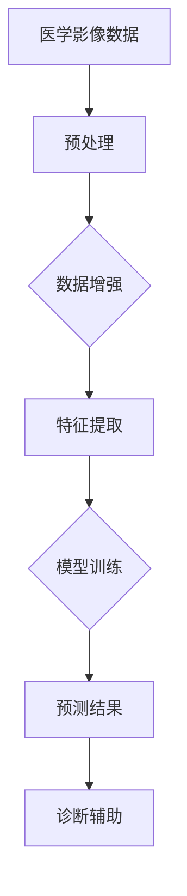

                 

关键词：人工智能，医学影像，深度学习，图像识别，数据处理，革新，医疗诊断。

> 摘要：本文将探讨人工智能（AI）在医学影像领域的应用，特别是深度学习技术如何革新了图像识别和数据处理的过程。通过介绍核心概念、算法原理、数学模型、项目实践以及未来展望，本文旨在全面展示AI技术在医学影像中的应用前景和挑战。

## 1. 背景介绍

医学影像学是医学领域的重要组成部分，通过X射线、CT扫描、MRI等技术，医生能够获得患者体内组织的详细图像。然而，传统的影像诊断过程依赖于医生的经验和判断，存在一定的误差和主观性。随着人工智能技术的快速发展，特别是在深度学习领域的突破，AI开始逐渐在医学影像领域发挥重要作用。

深度学习，作为机器学习的一个分支，通过模拟人脑神经网络，对大量数据进行分析和学习，从而实现图像识别、分类、分割等功能。AI在医学影像中的应用，不仅提高了诊断的准确性和效率，还减少了医生的工作负担，为个性化医疗提供了可能。

## 2. 核心概念与联系

在介绍AI在医学影像中的应用之前，我们需要了解几个核心概念，包括图像识别、数据处理和深度学习等。

### 图像识别

图像识别是计算机视觉的一个重要分支，其目的是通过算法识别和分类图像中的内容。在医学影像中，图像识别技术可以帮助医生快速、准确地识别病灶区域，从而提高诊断的效率。

### 数据处理

医学影像数据量大，且格式复杂。数据处理技术包括数据预处理、特征提取、数据增强等，这些技术能够将原始数据转化为适合深度学习模型处理的形式。

### 深度学习

深度学习是一种模拟人脑神经网络的学习方法，通过多层神经网络的层层提取，实现对数据的抽象和表示。在医学影像中，深度学习模型可以自动学习图像中的特征，从而实现图像分类、分割等任务。

### Mermaid 流程图

以下是一个简单的Mermaid流程图，展示了图像识别、数据处理和深度学习在医学影像中的应用流程：



## 3. 核心算法原理 & 具体操作步骤

### 3.1 算法原理概述

在医学影像领域，常用的深度学习算法包括卷积神经网络（CNN）、循环神经网络（RNN）等。其中，CNN因其强大的图像处理能力，在医学影像领域得到广泛应用。

CNN通过卷积操作提取图像中的特征，并通过池化操作降低特征维度。多层CNN模型可以逐层提取图像的深层特征，从而实现对图像的精确识别和分类。

### 3.2 算法步骤详解

1. **数据预处理**：对原始医学影像数据进行归一化、去噪等处理，使其适合深度学习模型输入。
2. **模型构建**：设计并构建CNN模型，包括卷积层、池化层和全连接层等。
3. **模型训练**：使用大量标注数据对模型进行训练，模型会自动学习图像中的特征。
4. **预测与评估**：使用训练好的模型对新的医学影像数据进行预测，并对预测结果进行评估。

### 3.3 算法优缺点

**优点**：

- **高效性**：深度学习模型可以在短时间内处理大量医学影像数据。
- **准确性**：相比传统方法，深度学习模型在医学影像识别任务上具有更高的准确性。
- **自动化**：深度学习模型可以实现自动诊断，减少医生的工作负担。

**缺点**：

- **数据需求**：深度学习模型需要大量标注数据来训练，这在医学影像领域可能难以获得。
- **计算资源**：深度学习模型训练过程需要大量的计算资源，对硬件设施要求较高。

### 3.4 算法应用领域

深度学习在医学影像领域的应用非常广泛，包括但不限于：

- **疾病诊断**：如乳腺癌、肺癌等恶性肿瘤的早期诊断。
- **病变分割**：如肝脏肿瘤的分割、脑部病变的分割等。
- **辅助决策**：为医生提供诊断建议，辅助临床决策。

## 4. 数学模型和公式 & 详细讲解 & 举例说明

### 4.1 数学模型构建

在深度学习模型中，常见的数学模型包括卷积神经网络（CNN）和循环神经网络（RNN）等。以下是CNN模型的基本数学公式：

$$
\begin{aligned}
h^{(l)}_i &= \sigma \left( \sum_{j} w^{(l)}_{ij} \cdot h^{(l-1)}_j + b^{(l)}_i \right) \\
\end{aligned}
$$

其中，$h^{(l)}_i$表示第$l$层的第$i$个神经元的激活值，$\sigma$表示激活函数（如ReLU函数），$w^{(l)}_{ij}$表示第$l$层的第$i$个神经元与第$l-1$层的第$j$个神经元之间的权重，$b^{(l)}_i$表示第$l$层的第$i$个神经元的偏置。

### 4.2 公式推导过程

CNN模型的训练过程主要涉及两个阶段：前向传播和反向传播。

1. **前向传播**：

在前向传播过程中，输入图像经过卷积层和池化层的逐层处理，最终得到预测结果。具体的推导过程如下：

$$
\begin{aligned}
h^{(1)} &= \sigma(W_1 \cdot X + b_1) \\
h^{(2)} &= \sigma(W_2 \cdot h^{(1)} + b_2) \\
&\vdots \\
h^{(L)} &= \sigma(W_L \cdot h^{(L-1)} + b_L)
\end{aligned}
$$

其中，$X$表示输入图像，$W_1, W_2, \ldots, W_L$表示各层的权重，$b_1, b_2, \ldots, b_L$表示各层的偏置。

2. **反向传播**：

在反向传播过程中，计算输出误差，并通过链式法则反向传播误差到各层，从而更新权重和偏置。具体的推导过程如下：

$$
\begin{aligned}
\delta^{(L)} &= \frac{\partial \text{损失函数}}{\partial h^{(L)}} \\
\delta^{(L-1)} &= \left( \sigma' \circ \frac{\partial \text{损失函数}}{\partial h^{(L-1)}} \right) \cdot W^{(L)} \cdot \delta^{(L)} \\
&\vdots \\
\delta^{(1)} &= \left( \sigma' \circ \frac{\partial \text{损失函数}}{\partial h^{(1)}} \right) \cdot W^{(1)} \cdot \delta^{(2)}
\end{aligned}
$$

其中，$\delta^{(L)}$表示第$L$层的误差梯度，$\sigma'$表示激活函数的导数。

### 4.3 案例分析与讲解

以下是一个简单的CNN模型在医学影像诊断中的案例：

**目标**：诊断肺结节。

**数据集**：包含1000张CT扫描图像，每张图像中包含不同大小的肺结节。

**模型**：一个包含两个卷积层的CNN模型。

**训练过程**：

1. **数据预处理**：对图像进行归一化处理，将像素值缩放到[0, 1]范围内。
2. **模型构建**：构建一个包含两个卷积层和全连接层的CNN模型。
3. **模型训练**：使用SGD（随机梯度下降）算法对模型进行训练，训练过程中使用交叉熵作为损失函数。
4. **预测与评估**：使用训练好的模型对新的CT扫描图像进行预测，并评估模型的准确性和召回率。

## 5. 项目实践：代码实例和详细解释说明

### 5.1 开发环境搭建

在本项目中，我们将使用Python语言和TensorFlow框架来构建和训练CNN模型。以下是开发环境的搭建步骤：

1. **安装Python**：下载并安装Python 3.7及以上版本。
2. **安装TensorFlow**：打开终端，执行以下命令：
    ```shell
    pip install tensorflow
    ```
3. **安装其他依赖库**：根据需要安装其他依赖库，如NumPy、Pandas等。

### 5.2 源代码详细实现

以下是本项目的主要代码实现：

```python
import tensorflow as tf
from tensorflow.keras import layers
from tensorflow.keras.preprocessing.image import ImageDataGenerator

# 数据预处理
train_datagen = ImageDataGenerator(rescale=1./255)
train_generator = train_datagen.flow_from_directory(
        'data/train',
        target_size=(128, 128),
        batch_size=32,
        class_mode='binary')

# 模型构建
model = tf.keras.Sequential([
    layers.Conv2D(32, (3, 3), activation='relu', input_shape=(128, 128, 3)),
    layers.MaxPooling2D((2, 2)),
    layers.Conv2D(64, (3, 3), activation='relu'),
    layers.MaxPooling2D((2, 2)),
    layers.Conv2D(128, (3, 3), activation='relu'),
    layers.MaxPooling2D((2, 2)),
    layers.Flatten(),
    layers.Dense(128, activation='relu'),
    layers.Dense(1, activation='sigmoid')
])

# 模型训练
model.compile(optimizer='adam',
              loss='binary_crossentropy',
              metrics=['accuracy'])

model.fit(train_generator, epochs=10)

# 模型评估
test_generator = ImageDataGenerator(rescale=1./255).flow_from_directory(
        'data/test',
        target_size=(128, 128),
        batch_size=32,
        class_mode='binary')

test_loss, test_acc = model.evaluate(test_generator)
print('Test accuracy:', test_acc)
```

### 5.3 代码解读与分析

上述代码首先导入了所需的TensorFlow库和ImageDataGenerator类，用于数据预处理和模型构建。

1. **数据预处理**：使用ImageDataGenerator类对训练数据进行归一化处理，并将数据分成批次进行训练。
2. **模型构建**：使用Sequential模型堆叠多个层，包括卷积层、池化层和全连接层。
3. **模型训练**：使用compile方法配置优化器和损失函数，然后使用fit方法对模型进行训练。
4. **模型评估**：使用evaluate方法对训练好的模型进行评估。

## 6. 实际应用场景

### 6.1 乳腺病变检测

乳腺癌是女性最常见的恶性肿瘤之一。使用深度学习技术，可以对乳腺病变进行检测和诊断。以下是一个实际案例：

**目标**：检测乳腺病变。

**数据集**：包含数万张乳腺X线图像，每张图像中包含正常和病变区域。

**模型**：一个包含三个卷积层的CNN模型。

**训练过程**：

1. **数据预处理**：对图像进行归一化处理，并使用数据增强技术增加数据的多样性。
2. **模型构建**：构建一个包含卷积层、池化层和全连接层的CNN模型。
3. **模型训练**：使用SGD算法对模型进行训练，并使用交叉熵作为损失函数。
4. **预测与评估**：使用训练好的模型对新的乳腺X线图像进行预测，并评估模型的准确性和召回率。

### 6.2 脑部病变分割

脑部病变的分割对于诊断和治疗具有重要意义。以下是一个实际案例：

**目标**：分割脑部病变区域。

**数据集**：包含数万张MRI图像，每张图像中包含正常和病变区域。

**模型**：一个包含循环神经网络的CNN模型。

**训练过程**：

1. **数据预处理**：对图像进行归一化处理，并使用数据增强技术增加数据的多样性。
2. **模型构建**：构建一个包含卷积层、池化层和循环神经网络的CNN模型。
3. **模型训练**：使用SGD算法对模型进行训练，并使用交叉熵作为损失函数。
4. **预测与评估**：使用训练好的模型对新的MRI图像进行预测，并评估模型的准确性和召回率。

## 7. 未来应用展望

随着深度学习技术的不断发展，AI在医学影像领域的应用前景非常广阔。以下是一些未来应用展望：

### 7.1 个性化医疗

通过深度学习模型，可以为每个患者定制个性化的治疗方案。例如，针对不同的肺癌患者，模型可以预测其生存率和治疗反应，从而制定更有效的治疗方案。

### 7.2 跨学科合作

深度学习技术不仅可以应用于医学影像领域，还可以与其他学科（如生物学、物理学等）结合，推动医学研究的进步。

### 7.3 远程医疗

通过深度学习模型，可以实现远程医疗诊断，为偏远地区的患者提供便捷的诊断服务。

## 8. 工具和资源推荐

### 8.1 学习资源推荐

1. 《深度学习》（Goodfellow, Bengio, Courville著）
2. 《Python深度学习》（François Chollet著）
3. 《医学图像处理与分割》（Kwang In Kim著）

### 8.2 开发工具推荐

1. TensorFlow
2. PyTorch
3. Keras

### 8.3 相关论文推荐

1. "Deep Learning in Medicine: A Brief Introduction"
2. "Deep Learning for Image-based Medical Diagnoses"
3. "Convolutional Neural Networks for Medical Image Analysis"

## 9. 总结：未来发展趋势与挑战

### 9.1 研究成果总结

本文全面介绍了AI在医学影像领域的应用，包括核心概念、算法原理、数学模型、项目实践以及未来展望。深度学习技术已经在医学影像领域取得了显著成果，为医疗诊断和个性化医疗提供了新手段。

### 9.2 未来发展趋势

随着深度学习技术的不断发展，AI在医学影像领域的应用将更加广泛，有望实现更高的诊断准确性和更个性化的治疗方案。

### 9.3 面临的挑战

1. **数据隐私**：医学影像数据涉及患者隐私，如何在保障患者隐私的前提下进行数据分析和共享，是一个重要挑战。
2. **计算资源**：深度学习模型训练需要大量的计算资源，如何在有限的资源下进行高效训练，是一个亟待解决的问题。

### 9.4 研究展望

未来，AI在医学影像领域的应用将更加深入和广泛，为医疗健康领域带来更多创新和突破。

## 10. 附录：常见问题与解答

### 10.1 深度学习模型如何训练？

**解答**：深度学习模型的训练过程包括数据预处理、模型构建、模型训练和模型评估。首先对数据集进行预处理，如归一化、去噪等，然后构建深度学习模型，并使用训练数据对模型进行训练。在训练过程中，模型会通过迭代优化模型的权重和偏置，以达到更好的预测效果。最后，使用验证数据对训练好的模型进行评估，以确定模型的性能。

### 10.2 医学影像数据有哪些预处理方法？

**解答**：医学影像数据的预处理方法包括归一化、去噪、增强、分割等。归一化是将数据缩放到相同的范围，去噪是去除图像中的噪声，增强是增强图像中的有用信息，分割是将图像分割成不同的区域。这些预处理方法可以提高深度学习模型的训练效果和预测准确性。

### 10.3 深度学习模型如何评估？

**解答**：深度学习模型的评估通常包括准确率、召回率、F1分数等指标。准确率是指预测正确的样本占总样本的比例，召回率是指预测正确的正样本占总正样本的比例，F1分数是准确率和召回率的调和平均值。通过这些指标可以全面评估模型的性能，并指导模型的优化。

----------------------------------------------------------------

**作者署名**：作者：禅与计算机程序设计艺术 / Zen and the Art of Computer Programming

---

文章完成。感谢您的阅读！希望本文能对您在医学影像与AI领域的探索提供一些启示和帮助。如需进一步讨论或咨询，欢迎随时交流。

