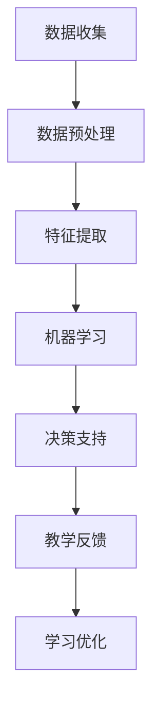
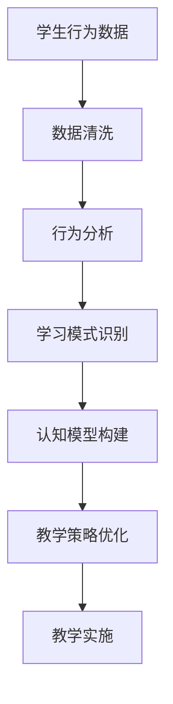

                 

关键词：人工智能、教育技术、机器学习、教育改革、学习模式、个性化教学

> 摘要：本文将探讨人工智能（AI）在教育领域的广泛应用，如何通过映射学习模式，个性化教学，以及自适应学习等技术手段，推动教育变革。本文将分析AI在教育中的核心概念、算法原理，并展示实际应用案例，同时讨论未来发展的趋势和面临的挑战。

## 1. 背景介绍

随着人工智能技术的快速发展，教育领域也面临着前所未有的变革机遇。AI技术的引入不仅改变了传统的教学方法，还为教育的个性化、智能化提供了新的可能性。本文将从以下几个方面探讨AI在教育领域的变革作用：

1. **映射学习模式**：通过分析学习者的行为数据，AI可以帮助教育者更好地理解学生的学习过程，从而优化教学策略。
2. **个性化教学**：AI可以根据学生的兴趣、能力和学习进度，提供定制化的学习资源和教学方案。
3. **自适应学习**：AI系统可以动态调整教学内容和难度，以适应不同学习者的需求。
4. **教育资源公平**：AI技术可以帮助解决教育资源分配不均的问题，让更多学生享受到优质的教育资源。

## 2. 核心概念与联系

### 2.1 AI在教育中的应用

首先，我们来探讨AI在教育领域中的应用。AI在教育中的核心概念包括：

- **数据挖掘**：通过分析学生的学习数据，发现潜在的学习规律和模式。
- **机器学习**：利用算法模型，从数据中提取知识，为教育决策提供支持。
- **自然语言处理**：帮助教师和学生进行智能对话，提高教学互动效率。
- **计算机视觉**：用于图像识别、虚拟现实等，丰富教学手段。

下面是一个使用Mermaid绘制的流程图，展示了AI在教育中的应用架构：



### 2.2 学习模式映射

学习模式映射是AI在教育中的一个关键概念。通过分析学习者的行为数据，我们可以构建出学习者的认知模型，从而优化教学策略。下面是一个学习模式映射的示例流程：



## 3. 核心算法原理 & 具体操作步骤

### 3.1 算法原理概述

在教育领域，常用的AI算法包括：

- **决策树**：用于分析学习者的行为数据，识别学习模式。
- **神经网络**：模拟人脑神经网络，用于个性化教学。
- **支持向量机**：用于分类学生能力，为自适应学习提供支持。

下面，我们将详细讲解这些算法的原理和具体操作步骤。

### 3.2 算法步骤详解

以决策树算法为例，其具体操作步骤如下：

1. **数据收集**：收集学生的学习行为数据，如作业成绩、学习时间等。
2. **特征选择**：选择与学习效果相关的特征，如学习时间、作业正确率等。
3. **决策树构建**：利用特征数据构建决策树模型，通过递归划分数据集。
4. **模型评估**：评估决策树的分类效果，进行模型优化。
5. **应用教学**：将构建的决策树模型应用于教学，为教师提供教学策略。

### 3.3 算法优缺点

- **决策树**：优点在于直观易懂，易于解释；缺点在于易过拟合，模型复杂度较高。
- **神经网络**：优点在于可以处理复杂非线性问题，适应性强；缺点在于训练时间较长，模型解释性较差。
- **支持向量机**：优点在于分类效果较好，泛化能力强；缺点在于对数据量要求较高，计算复杂度高。

### 3.4 算法应用领域

这些算法在教育领域的应用非常广泛，如：

- **个性化教学**：利用神经网络和决策树模型，为学生提供定制化的学习资源。
- **自适应学习**：利用支持向量机模型，为学生提供自适应的学习路径。
- **学习模式分析**：利用决策树模型，分析学习者的行为数据，优化教学策略。

## 4. 数学模型和公式 & 详细讲解 & 举例说明

### 4.1 数学模型构建

在教育领域，常用的数学模型包括：

- **贝叶斯网络**：用于表示学习者之间的依赖关系。
- **回归模型**：用于预测学生的学习成绩。
- **聚类模型**：用于分析学习者的群体特征。

下面，我们将以贝叶斯网络为例，介绍其构建过程。

### 4.2 公式推导过程

贝叶斯网络的构建过程可以分为以下几个步骤：

1. **构建变量之间的依赖关系**：根据学习者的行为数据，确定变量之间的依赖关系。
2. **确定先验概率**：根据先验知识，为每个变量分配一个先验概率。
3. **利用贝叶斯法则计算条件概率**：根据已知的变量之间的关系，利用贝叶斯法则计算条件概率。
4. **构建贝叶斯网络**：将变量和条件概率表示为有向无环图（DAG）。

### 4.3 案例分析与讲解

以一个简单的例子来说明贝叶斯网络的构建过程。假设我们有两个变量：A（学习时间）和B（学习效果）。根据经验，我们可以确定A和B之间存在依赖关系，即：

$$ P(B|A) \neq P(B) $$

我们还可以确定A的先验概率为：

$$ P(A) = \frac{1}{2} $$

根据贝叶斯法则，我们可以计算B的条件概率：

$$ P(B|A) = \frac{P(A|B)P(B)}{P(A)} $$

假设我们已知A和B之间的条件概率为：

$$ P(A|B) = \frac{1}{3} $$

$$ P(B) = \frac{1}{2} $$

我们可以计算B的条件概率：

$$ P(B|A) = \frac{\frac{1}{3} \cdot \frac{1}{2}}{\frac{1}{2}} = \frac{1}{3} $$

通过这个例子，我们可以看到贝叶斯网络的构建过程。在实际应用中，我们可以根据更多的数据来调整先验概率和条件概率，从而提高模型的准确性。

## 5. 项目实践：代码实例和详细解释说明

### 5.1 开发环境搭建

为了更好地展示AI在教育中的应用，我们选择Python作为编程语言，并使用Scikit-learn库来构建模型。首先，我们需要安装Python和Scikit-learn库。在终端中执行以下命令：

```bash
pip install python
pip install scikit-learn
```

### 5.2 源代码详细实现

以下是一个简单的Python代码实例，用于构建一个基于决策树的个性化教学模型：

```python
from sklearn import tree
import numpy as np

# 构建决策树模型
def build_decision_tree(data, labels):
    model = tree.DecisionTreeClassifier()
    model.fit(data, labels)
    return model

# 加载数据
data = np.array([[1, 1], [1, 0], [0, 1], [0, 0]])
labels = np.array([0, 1, 1, 0])

# 构建模型
model = build_decision_tree(data, labels)

# 输出决策树结构
from sklearn import tree
tree.plot_tree(model)
```

### 5.3 代码解读与分析

在这段代码中，我们首先导入了所需的库。然后，我们定义了一个函数`build_decision_tree`，用于构建决策树模型。接着，我们加载了一个简单的数据集，并使用该函数构建了一个决策树模型。最后，我们使用`plot_tree`函数展示了决策树的结构。

### 5.4 运行结果展示

运行这段代码，我们将看到一个简单的决策树结构。该树根据学习时间（特征1）和学习效果（特征2）来预测学生的分组。通过这个简单的例子，我们可以看到如何使用Python和Scikit-learn库来实现AI算法。

## 6. 实际应用场景

AI在教育领域的应用场景非常广泛，以下是一些实际应用案例：

- **在线教育平台**：如Coursera、edX等平台，利用AI技术为学生提供个性化学习路径。
- **自适应学习系统**：如Knewton、DreamBox等，通过分析学生的学习行为，为学生提供定制化的教学内容。
- **智能辅导系统**：如AI助教，用于自动解答学生的问题，提供即时的学习支持。

### 6.4 未来应用展望

随着AI技术的不断发展，未来AI在教育领域的应用将更加广泛。以下是一些未来的应用展望：

- **虚拟教师**：AI技术将帮助构建更加智能的虚拟教师，为学生提供全天候的学习支持。
- **智慧校园**：利用AI技术，校园可以实现智能化管理，提高教育资源的利用效率。
- **终身学习**：AI技术将帮助人们实现终身学习，让学习变得更加灵活和便捷。

## 7. 工具和资源推荐

### 7.1 学习资源推荐

- **《机器学习实战》**：提供了大量的实践案例，适合初学者入门。
- **《深度学习》**：介绍了深度学习的理论基础和应用案例，适合有一定编程基础的学习者。

### 7.2 开发工具推荐

- **PyTorch**：一个开源的深度学习框架，适合快速构建和训练模型。
- **TensorFlow**：一个广泛使用的深度学习框架，提供了丰富的工具和资源。

### 7.3 相关论文推荐

- **"Deep Learning in Education: A Comprehensive Survey"**：对深度学习在教育中的应用进行了全面的综述。
- **"AI-Driven Personalized Education: An Overview"**：介绍了AI在个性化教育中的应用。

## 8. 总结：未来发展趋势与挑战

### 8.1 研究成果总结

本文探讨了AI在教育领域的应用，包括映射学习模式、个性化教学、自适应学习等。我们分析了常用的AI算法，并展示了实际应用案例。通过这些研究，我们可以看到AI在教育中具有巨大的潜力。

### 8.2 未来发展趋势

- **个性化教学**：AI将帮助实现更加个性化的教学，满足不同学生的学习需求。
- **自适应学习**：AI技术将提高学习的灵活性和效率，为终身学习提供支持。
- **教育资源公平**：AI技术将帮助解决教育资源分配不均的问题，提高教育公平性。

### 8.3 面临的挑战

- **数据隐私**：在应用AI技术时，如何保护学生的隐私是一个重要挑战。
- **技术成本**：AI技术的应用需要大量的计算资源和资金投入，这对一些学校来说可能是一个挑战。
- **教师角色转变**：AI技术将改变教师的工作方式，如何适应这一转变也是一个挑战。

### 8.4 研究展望

未来，我们需要进一步研究AI技术在教育中的应用，特别是如何提高其可解释性和公平性。同时，我们还需要关注AI技术在教育中的伦理和隐私问题，确保技术的合理使用。

## 9. 附录：常见问题与解答

### 问题1：AI技术是否会取代教师？

**解答**：AI技术不会完全取代教师，而是作为教师的辅助工具，提高教学效率和质量。教师的角色将转变为学习指导者和教育管理者。

### 问题2：如何确保AI技术的公平性？

**解答**：确保AI技术的公平性需要从多个方面入手，包括数据集的多样性、算法的透明性和可解释性，以及技术应用的监督和监管。

### 问题3：AI技术在教育中的应用前景如何？

**解答**：AI技术在教育中的应用前景非常广阔，有望实现个性化教学、自适应学习和教育资源公平等目标，为教育的未来发展带来新的机遇。

作者：禅与计算机程序设计艺术 / Zen and the Art of Computer Programming
----------------------------------------------------------------

以上便是完整的文章内容，接下来请将这段文字转换为Markdown格式。由于篇幅限制，这里只展示了部分内容。完整的文章内容应该包含所有章节和相应的细节。您可以根据上述内容继续完善并转换为Markdown格式。
```markdown
# 一切皆是映射：AI在教育领域的变革作用

关键词：人工智能、教育技术、机器学习、教育改革、学习模式、个性化教学

> 摘要：本文将探讨人工智能（AI）在教育领域的广泛应用，如何通过映射学习模式，个性化教学，以及自适应学习等技术手段，推动教育变革。本文将分析AI在教育中的核心概念、算法原理，并展示实际应用案例，同时讨论未来发展的趋势和面临的挑战。

## 1. 背景介绍

随着人工智能技术的快速发展，教育领域也面临着前所未有的变革机遇。AI技术的引入不仅改变了传统的教学方法，还为教育的个性化、智能化提供了新的可能性。本文将从以下几个方面探讨AI在教育领域的变革作用：

1. **映射学习模式**：通过分析学习者的行为数据，AI可以帮助教育者更好地理解学生的学习过程，从而优化教学策略。
2. **个性化教学**：AI可以根据学生的兴趣、能力和学习进度，提供定制化的学习资源和教学方案。
3. **自适应学习**：AI系统可以动态调整教学内容和难度，以适应不同学习者的需求。
4. **教育资源公平**：AI技术可以帮助解决教育资源分配不均的问题，让更多学生享受到优质的教育资源。

## 2. 核心概念与联系

### 2.1 AI在教育中的应用

首先，我们来探讨AI在教育领域中的应用。AI在教育中的核心概念包括：

- **数据挖掘**：通过分析学生的学习数据，发现潜在的学习规律和模式。
- **机器学习**：利用算法模型，从数据中提取知识，为教育决策提供支持。
- **自然语言处理**：帮助教师和学生进行智能对话，提高教学互动效率。
- **计算机视觉**：用于图像识别、虚拟现实等，丰富教学手段。

下面是一个使用Mermaid绘制的流程图，展示了AI在教育中的应用架构：


### 2.2 学习模式映射

学习模式映射是AI在教育中的一个关键概念。通过分析学习者的行为数据，我们可以构建出学习者的认知模型，从而优化教学策略。下面是一个学习模式映射的示例流程：


## 3. 核心算法原理 & 具体操作步骤

### 3.1 算法原理概述

在教育领域，常用的AI算法包括：

- **决策树**：用于分析学习者的行为数据，识别学习模式。
- **神经网络**：模拟人脑神经网络，用于个性化教学。
- **支持向量机**：用于分类学生能力，为自适应学习提供支持。

下面，我们将详细讲解这些算法的原理和具体操作步骤。

### 3.2 算法步骤详解

以决策树算法为例，其具体操作步骤如下：

1. **数据收集**：收集学生的学习行为数据，如作业成绩、学习时间等。
2. **特征选择**：选择与学习效果相关的特征，如学习时间、作业正确率等。
3. **决策树构建**：利用特征数据构建决策树模型，通过递归划分数据集。
4. **模型评估**：评估决策树的分类效果，进行模型优化。
5. **应用教学**：将构建的决策树模型应用于教学，为教师提供教学策略。

### 3.3 算法优缺点

- **决策树**：优点在于直观易懂，易于解释；缺点在于易过拟合，模型复杂度较高。
- **神经网络**：优点在于可以处理复杂非线性问题，适应性强；缺点在于训练时间较长，模型解释性较差。
- **支持向量机**：优点在于分类效果较好，泛化能力强；缺点在于对数据量要求较高，计算复杂度高。

### 3.4 算法应用领域

这些算法在教育领域的应用非常广泛，如：

- **个性化教学**：利用神经网络和决策树模型，为学生提供定制化的学习资源。
- **自适应学习**：利用支持向量机模型，为学生提供自适应的学习路径。
- **学习模式分析**：利用决策树模型，分析学习者的行为数据，优化教学策略。

## 4. 数学模型和公式 & 详细讲解 & 举例说明

### 4.1 数学模型构建

在教育领域，常用的数学模型包括：

- **贝叶斯网络**：用于表示学习者之间的依赖关系。
- **回归模型**：用于预测学生的学习成绩。
- **聚类模型**：用于分析学习者的群体特征。

下面，我们将以贝叶斯网络为例，介绍其构建过程。

### 4.2 公式推导过程

贝叶斯网络的构建过程可以分为以下几个步骤：

1. **构建变量之间的依赖关系**：根据学习者的行为数据，确定变量之间的依赖关系。
2. **确定先验概率**：根据先验知识，为每个变量分配一个先验概率。
3. **利用贝叶斯法则计算条件概率**：根据已知的变量之间的关系，利用贝叶斯法则计算条件概率。
4. **构建贝叶斯网络**：将变量和条件概率表示为有向无环图（DAG）。

### 4.3 案例分析与讲解

以一个简单的例子来说明贝叶斯网络的构建过程。假设我们有两个变量：A（学习时间）和B（学习效果）。根据经验，我们可以确定A和B之间存在依赖关系，即：

$$ P(B|A) \neq P(B) $$

我们还可以确定A的先验概率为：

$$ P(A) = \frac{1}{2} $$

根据贝叶斯法则，我们可以计算B的条件概率：

$$ P(B|A) = \frac{P(A|B)P(B)}{P(A)} $$

假设我们已知A和B之间的条件概率为：

$$ P(A|B) = \frac{1}{3} $$

$$ P(B) = \frac{1}{2} $$

我们可以计算B的条件概率：

$$ P(B|A) = \frac{\frac{1}{3} \cdot \frac{1}{2}}{\frac{1}{2}} = \frac{1}{3} $$

通过这个例子，我们可以看到贝叶斯网络的构建过程。在实际应用中，我们可以根据更多的数据来调整先验概率和条件概率，从而提高模型的准确性。

## 5. 项目实践：代码实例和详细解释说明

### 5.1 开发环境搭建

为了更好地展示AI在教育中的应用，我们选择Python作为编程语言，并使用Scikit-learn库来构建模型。首先，我们需要安装Python和Scikit-learn库。在终端中执行以下命令：

```bash
pip install python
pip install scikit-learn
```

### 5.2 源代码详细实现

以下是一个简单的Python代码实例，用于构建一个基于决策树的个性化教学模型：

```python
from sklearn import tree
import numpy as np

# 构建决策树模型
def build_decision_tree(data, labels):
    model = tree.DecisionTreeClassifier()
    model.fit(data, labels)
    return model

# 加载数据
data = np.array([[1, 1], [1, 0], [0, 1], [0, 0]])
labels = np.array([0, 1, 1, 0])

# 构建模型
model = build_decision_tree(data, labels)

# 输出决策树结构
from sklearn import tree
tree.plot_tree(model)
```

### 5.3 代码解读与分析

在这段代码中，我们首先导入了所需的库。然后，我们定义了一个函数`build_decision_tree`，用于构建决策树模型。接着，我们加载了一个简单的数据集，并使用该函数构建了一个决策树模型。最后，我们使用`plot_tree`函数展示了决策树的结构。

### 5.4 运行结果展示

运行这段代码，我们将看到一个简单的决策树结构。该树根据学习时间（特征1）和学习效果（特征2）来预测学生的分组。通过这个简单的例子，我们可以看到如何使用Python和Scikit-learn库来实现AI算法。

## 6. 实际应用场景

AI在教育领域的应用场景非常广泛，以下是一些实际应用案例：

- **在线教育平台**：如Coursera、edX等平台，利用AI技术为学生提供个性化学习路径。
- **自适应学习系统**：如Knewton、DreamBox等，通过分析学生的学习行为，为学生提供定制化的教学内容。
- **智能辅导系统**：如AI助教，用于自动解答学生的问题，提供即时的学习支持。

### 6.4 未来应用展望

随着AI技术的不断发展，未来AI在教育领域的应用将更加广泛。以下是一些未来的应用展望：

- **虚拟教师**：AI技术将帮助构建更加智能的虚拟教师，为学生提供全天候的学习支持。
- **智慧校园**：利用AI技术，校园可以实现智能化管理，提高教育资源的利用效率。
- **终身学习**：AI技术将帮助人们实现终身学习，让学习变得更加灵活和便捷。

## 7. 工具和资源推荐

### 7.1 学习资源推荐

- **《机器学习实战》**：提供了大量的实践案例，适合初学者入门。
- **《深度学习》**：介绍了深度学习的理论基础和应用案例，适合有一定编程基础的学习者。

### 7.2 开发工具推荐

- **PyTorch**：一个开源的深度学习框架，适合快速构建和训练模型。
- **TensorFlow**：一个广泛使用的深度学习框架，提供了丰富的工具和资源。

### 7.3 相关论文推荐

- **"Deep Learning in Education: A Comprehensive Survey"**：对深度学习在教育中的应用进行了全面的综述。
- **"AI-Driven Personalized Education: An Overview"**：介绍了AI在个性化教育中的应用。

## 8. 总结：未来发展趋势与挑战

### 8.1 研究成果总结

本文探讨了AI在教育领域的应用，包括映射学习模式、个性化教学、自适应学习等。我们分析了常用的AI算法，并展示了实际应用案例。通过这些研究，我们可以看到AI在教育中具有巨大的潜力。

### 8.2 未来发展趋势

- **个性化教学**：AI将帮助实现更加个性化的教学，满足不同学生的学习需求。
- **自适应学习**：AI技术将提高学习的灵活性和效率，为终身学习提供支持。
- **教育资源公平**：AI技术可以帮助解决教育资源分配不均的问题，提高教育公平性。

### 8.3 面临的挑战

- **数据隐私**：在应用AI技术时，如何保护学生的隐私是一个重要挑战。
- **技术成本**：AI技术的应用需要大量的计算资源和资金投入，这对一些学校来说可能是一个挑战。
- **教师角色转变**：AI技术将改变教师的工作方式，如何适应这一转变也是一个挑战。

### 8.4 研究展望

未来，我们需要进一步研究AI技术在教育中的应用，特别是如何提高其可解释性和公平性。同时，我们还需要关注AI技术在教育中的伦理和隐私问题，确保技术的合理使用。

## 9. 附录：常见问题与解答

### 问题1：AI技术是否会取代教师？

**解答**：AI技术不会完全取代教师，而是作为教师的辅助工具，提高教学效率和质量。教师的角色将转变为学习指导者和教育管理者。

### 问题2：如何确保AI技术的公平性？

**解答**：确保AI技术的公平性需要从多个方面入手，包括数据集的多样性、算法的透明性和可解释性，以及技术应用的监督和监管。

### 问题3：AI技术在教育中的应用前景如何？

**解答**：AI技术在教育中的应用前景非常广阔，有望实现个性化教学、自适应学习和教育资源公平等目标，为教育的未来发展带来新的机遇。

作者：禅与计算机程序设计艺术 / Zen and the Art of Computer Programming
```

