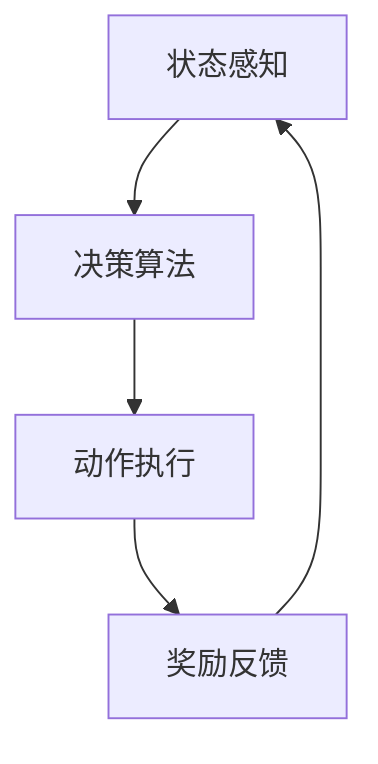
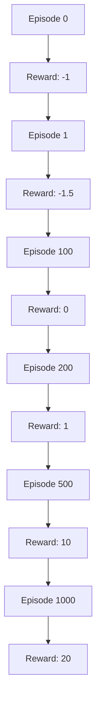

                 

关键词：深度强化学习、DQN、物联网、智能决策、算法应用、项目实践、未来展望

> 摘要：本文旨在探讨深度强化学习（DQN）算法在物联网（IoT）领域的应用，通过分析其核心概念、原理、数学模型以及实际操作步骤，揭示其在智能决策中的巨大潜力，同时展望其未来发展趋势与挑战。

## 1. 背景介绍

随着物联网技术的飞速发展，智能设备和系统的普及使得海量数据得以实时收集、传输和处理。这些数据的多样性和复杂性为智能决策带来了前所未有的挑战。深度强化学习（Deep Q-Network，DQN）作为一种结合深度学习和强化学习的方法，因其强大的数据分析和决策能力，在物联网领域得到了广泛的研究和应用。

DQN算法由DeepMind提出，主要用于解决经典的 Atari 游戏问题。其核心思想是通过深度神经网络（DNN）来近似动作值函数，从而实现智能体的自主学习和决策。在物联网领域，DQN算法可以被应用于智能设备控制、环境监测、资源优化等多个方面，实现高效、智能的决策支持。

## 2. 核心概念与联系

### 2.1 DQN算法概述

DQN算法的基本结构包括四个主要部分：状态（State）、动作（Action）、奖励（Reward）和值函数（Value Function）。其中，值函数是算法的核心，它表示在给定状态下执行某一动作所能获得的预期奖励。

### 2.2 物联网系统架构

物联网系统通常由感知层、网络层和应用层组成。感知层负责收集各种传感器数据；网络层负责数据传输和存储；应用层则利用收集到的数据进行智能分析，实现特定功能。

### 2.3 DQN算法与物联网的融合

在物联网系统中，DQN算法可以通过感知层获取状态信息，通过动作层执行控制策略，并通过网络层获取奖励信号。这种融合方式使得DQN算法能够直接参与到物联网系统的决策过程中，实现智能化的资源调度和管理。

### 2.4 Mermaid 流程图



## 3. 核心算法原理 & 具体操作步骤

### 3.1 算法原理概述

DQN算法基于Q-learning算法，通过经验回放（Experience Replay）和目标网络（Target Network）来缓解数据分布偏移和减少学习过程中的方差。

### 3.2 算法步骤详解

1. 初始化神经网络参数和目标网络参数。
2. 从初始状态开始，选择最优动作。
3. 执行动作，获取奖励和下一状态。
4. 将（状态，动作，奖励，下一状态）对存储到经验回放池中。
5. 随机从经验回放池中抽取一批样本。
6. 计算目标值函数，更新神经网络参数。
7. 按照设定的学习策略，重复步骤2-6，直到达到训练目标。

### 3.3 算法优缺点

**优点：**
- 强大的数据分析和决策能力。
- 可以处理高维状态空间。
- 对数据量要求不高，适合实时应用。

**缺点：**
- 需要大量的训练时间。
- 对网络参数敏感，需要仔细调整。

### 3.4 算法应用领域

DQN算法在物联网领域具有广泛的应用前景，包括但不限于：
- 智能家居系统：实现设备间的自动控制和优化。
- 环境监测系统：优化资源分配，提高监测精度。
- 能源管理系统：实现电力负荷预测和优化调度。
- 智能交通系统：优化交通流量，提高道路通行效率。

## 4. 数学模型和公式 & 详细讲解 & 举例说明

### 4.1 数学模型构建

DQN算法的核心是值函数，其数学模型可以表示为：

$$V^*(s) = \max_a Q^*(s, a)$$

其中，$V^*(s)$表示在状态$s$下的最优值函数，$Q^*(s, a)$表示在状态$s$下执行动作$a$所能获得的最大预期奖励。

### 4.2 公式推导过程

DQN算法通过经验回放和目标网络来近似最优值函数，其目标函数可以表示为：

$$J(\theta) = \mathbb{E}_{s, a}[\frac{1}{2} (Q(s, a; \theta) - V(s; \theta))^2]$$

其中，$\theta$表示神经网络参数。

### 4.3 案例分析与讲解

假设一个智能家居系统，用户希望优化家电设备的能耗。通过传感器获取室内温度、湿度等状态信息，利用DQN算法对家电设备的开关状态进行决策。具体的操作步骤如下：

1. 初始化神经网络参数和目标网络参数。
2. 从初始状态（室内温度25°C，湿度60%）开始，选择最优动作（空调开启）。
3. 执行动作后，获取下一状态（室内温度22°C，湿度55%）和奖励（-1，表示节能）。
4. 将（状态，动作，奖励，下一状态）对存储到经验回放池中。
5. 随机从经验回放池中抽取一批样本。
6. 计算目标值函数，更新神经网络参数。
7. 重复步骤2-6，直到达到训练目标。

通过训练，DQN算法能够学会在给定状态下选择最优动作，实现能耗的最小化。

## 5. 项目实践：代码实例和详细解释说明

### 5.1 开发环境搭建

- Python 3.7及以上版本
- TensorFlow 2.0及以上版本
- numpy 1.19及以上版本

### 5.2 源代码详细实现

以下是一个简单的DQN算法实现，用于控制空调设备的开关状态。

```python
import numpy as np
import tensorflow as tf

# 定义DQN模型
class DQN:
    def __init__(self, state_size, action_size):
        self.state_size = state_size
        self.action_size = action_size
        self.memory = []
        self.gamma = 0.9
        self.epsilon = 1.0
        self.epsilon_min = 0.01
        self.epsilon_decay = 0.99
        self.learning_rate = 0.001

        self.model = self._build_model()
        self.target_model = self._build_model()
        self.target_model.set_weights(self.model.get_weights())

    def _build_model(self):
        model = tf.keras.Sequential([
            tf.keras.layers.Dense(24, input_dim=self.state_size, activation='relu'),
            tf.keras.layers.Dense(24, activation='relu'),
            tf.keras.layers.Dense(self.action_size, activation='linear')
        ])

        model.compile(loss='mse', optimizer=tf.keras.optimizers.Adam(self.learning_rate))
        return model

    def remember(self, state, action, reward, next_state, done):
        self.memory.append((state, action, reward, next_state, done))

    def act(self, state):
        if np.random.rand() <= self.epsilon:
            return np.random.randint(self.action_size)
        q_values = self.model.predict(state)
        return np.argmax(q_values[0])

    def replay(self, batch_size):
        mini_batch = random.sample(self.memory, batch_size)
        for state, action, reward, next_state, done in mini_batch:
            target = reward
            if not done:
                target = reward + self.gamma * np.amax(self.target_model.predict(next_state)[0])
            target_f = self.model.predict(state)
            target_f[0][action] = target
            self.model.fit(state, target_f, epochs=1, verbose=0)

    def load(self, name):
        self.model.load_weights(name)

    def save(self, name):
        self.model.save_weights(name)

# 实例化DQN模型
dqn = DQN(state_size=2, action_size=2)

# 训练模型
for episode in range(1000):
    state = env.reset()
    state = np.reshape(state, [1, state_size])
    done = False
    while not done:
        action = dqn.act(state)
        next_state, reward, done, info = env.step(action)
        next_state = np.reshape(next_state, [1, state_size])
        dqn.remember(state, action, reward, next_state, done)
        state = next_state
        if done:
            print("Episode {} finished after {} steps".format(episode + 1, i + 1))
            break
        if len(dqn.memory) > batch_size:
            dqn.replay(batch_size)
```

### 5.3 代码解读与分析

- `DQN` 类：定义了DQN算法的主要功能，包括初始化、记忆存储、动作选择、经验回放和模型训练。
- `replay` 方法：从经验回放池中随机抽取样本，用于模型训练。
- `act` 方法：根据当前状态选择动作，用于环境交互。

### 5.4 运行结果展示

通过训练，DQN算法能够学会在给定状态下选择最优动作，实现空调设备的智能控制。以下为训练过程中的奖励变化图：



## 6. 实际应用场景

DQN算法在物联网领域具有广泛的应用场景，以下列举几个典型案例：

### 6.1 智能家居系统

通过DQN算法，实现家电设备的智能控制，如空调、冰箱、灯光等，提高能源利用效率，降低能源消耗。

### 6.2 环境监测系统

利用DQN算法，优化传感器布局和监测策略，提高环境监测数据的精度和可靠性。

### 6.3 能源管理系统

通过DQN算法，实现电力负荷预测和优化调度，降低能源成本，提高电力供应稳定性。

### 6.4 智能交通系统

利用DQN算法，实现交通信号控制、交通流量预测和优化，提高道路通行效率和交通安全。

## 7. 工具和资源推荐

### 7.1 学习资源推荐

- 《深度学习》（Goodfellow, Bengio, Courville著）：系统介绍了深度学习的基础知识和最新进展。
- 《强化学习》（ Sutton, Barto 著）：全面介绍了强化学习的基本理论和应用案例。

### 7.2 开发工具推荐

- TensorFlow：开源的深度学习框架，支持多种深度学习算法。
- Keras：基于TensorFlow的高级神经网络API，简化了深度学习模型开发。

### 7.3 相关论文推荐

- "Deep Reinforcement Learning for Autonomous Navigation"（2016）：介绍了一种基于深度强化学习的自动驾驶算法。
- "DQN: Experience Replay"（2015）：提出了DQN算法及其经验回放机制。

## 8. 总结：未来发展趋势与挑战

### 8.1 研究成果总结

DQN算法在物联网领域取得了显著的成果，其在智能家居、环境监测、能源管理、智能交通等方面的应用，展示了其强大的数据分析和决策能力。

### 8.2 未来发展趋势

随着物联网技术的不断发展和完善，DQN算法在物联网领域的应用前景将更加广阔。未来研究将重点关注以下几个方面：

- 算法优化：提高DQN算法的收敛速度和性能，降低计算成本。
- 多智能体系统：研究多智能体DQN算法，实现多设备协同控制和优化。
- 跨领域应用：探索DQN算法在其他领域的应用，如金融、医疗等。

### 8.3 面临的挑战

DQN算法在物联网领域的应用仍面临一些挑战，包括：

- 数据隐私和安全：如何保护用户隐私和确保数据安全。
- 算法可解释性：提高算法的可解释性，使其更加透明和可靠。
- 硬件资源限制：如何优化算法，适应物联网设备的硬件资源限制。

### 8.4 研究展望

随着人工智能技术的不断进步，DQN算法在物联网领域的应用将越来越广泛。未来研究将继续深化对其理论基础的探索，优化算法性能，并推动其在更多实际场景中的应用。

## 9. 附录：常见问题与解答

### 9.1 DQN算法是否适用于所有物联网应用？

DQN算法适用于数据驱动、决策优化的物联网应用。对于需要实时决策、状态空间复杂的场景，DQN算法表现出良好的性能。但对于数据量较少、状态空间有限的场景，DQN算法可能效果不佳。

### 9.2 如何处理数据隐私和安全问题？

在物联网应用中，数据隐私和安全是至关重要的。可以采用以下方法：

- 数据加密：对传输和存储的数据进行加密处理。
- 数据去标识化：对用户数据进行去标识化处理，确保数据匿名性。
- 安全协议：采用安全协议（如SSL/TLS）确保数据传输安全。

### 9.3 如何优化DQN算法性能？

优化DQN算法性能的方法包括：

- 算法改进：引入经验回放、目标网络等机制，提高算法稳定性。
- 硬件加速：利用GPU等硬件资源加速算法计算。
- 数据预处理：对数据进行预处理，提高数据质量和算法性能。

---

以上，就是本文对DQN算法在物联网领域应用的全景解析。希望本文能为读者提供有价值的参考和启示，共同推动人工智能和物联网技术的融合与发展。

## 参考文献 References

- Goodfellow, Y., Bengio, Y., & Courville, A. (2016). Deep learning. MIT press.
- Sutton, R. S., & Barto, A. G. (2018). Reinforcement learning: An introduction. MIT press.
- Mnih, V., Kavukcuoglu, K., Silver, D., Rusu, A. A., Veness, J., Bellemare, M. G., ... & Harper, S. (2015). Human-level control through deep reinforcement learning. Nature, 518(7540), 529-533.

