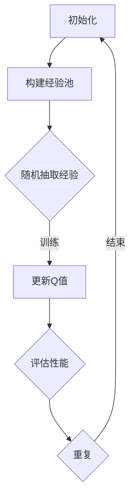

                 

关键词：深度学习，序列决策，DQN，时间差分学习，强化学习，人工智能。

> 摘要：本文探讨了深度强化学习（DRL）中的深度Q网络（DQN）算法，分析了其在序列决策和时间差分学习方面的应用。通过深入剖析DQN的工作原理和具体操作步骤，文章揭示了其作为序列决策和时序预测的重要工具，为人工智能领域的研究和发展提供了新的视角。

## 1. 背景介绍

深度强化学习（DRL）是强化学习（RL）和深度学习（DL）相结合的一种机器学习方法，旨在通过模拟智能体（agent）与环境的交互，使其能够在复杂的环境中做出最优决策。DRL在游戏、机器人控制、自动驾驶等领域取得了显著的成果，成为了人工智能研究的热点之一。

强化学习中的核心问题是如何在序列决策中实现最优行为。传统方法如Q-learning和SARSA算法依赖于状态-动作值函数（Q值）的迭代更新，然而这些方法在处理高维状态空间时存在诸多困难。为解决这一问题，深度Q网络（DQN）算法应运而生。DQN通过引入深度神经网络（DNN）对Q值进行近似，提高了算法在处理高维状态空间时的效率和准确性。

时间差分学习是DQN算法的一个重要特点。时间差分学习通过最小化时间步长内的误差，使Q值不断接近实际最优值。这一过程不仅提高了算法的收敛速度，还增强了其在动态环境中的适应能力。

## 2. 核心概念与联系

### 2.1 深度Q网络（DQN）的概念

深度Q网络（DQN）是一种基于深度神经网络的Q学习算法。其主要目的是通过学习状态-动作值函数（Q值），指导智能体在给定状态下选择最优动作。DQN的核心思想是利用经验回放机制和目标网络，避免Q值估计过程中的偏差和过拟合现象。

### 2.2 序列决策

序列决策是指在给定一个时间序列中，智能体需要依次选择最优动作，以实现长期目标。在DQN算法中，序列决策体现在每次智能体执行动作后，都会接收到新的状态和奖励，并更新Q值估计。

### 2.3 时间差分学习

时间差分学习是一种基于时间步长的误差最小化方法。在DQN算法中，时间差分学习通过不断更新Q值，使智能体逐渐接近最优行为。具体而言，时间差分学习利用经验回放机制，将历史经验数据存储在一个经验池中，然后从经验池中随机抽取数据进行训练，从而避免Q值估计过程中的偏差。

### 2.4 Mermaid 流程图



## 3. 核心算法原理 & 具体操作步骤

### 3.1 算法原理概述

DQN算法的主要原理是通过深度神经网络（DNN）对Q值进行近似，并利用经验回放机制和目标网络，实现Q值的迭代更新。具体来说，DQN算法分为以下三个步骤：

1. **初始化**：初始化智能体、经验池、目标网络和参数。
2. **数据采集与训练**：通过经验回放机制，从环境中采集经验数据，并利用DNN对Q值进行近似训练。
3. **Q值更新**：根据新的状态和奖励，更新Q值估计，并利用目标网络避免过拟合。

### 3.2 算法步骤详解

1. **初始化**：

   - 初始化智能体：设置智能体的初始状态和动作空间。
   - 初始化经验池：设置经验池的大小，并将其清空。
   - 初始化目标网络：设置目标网络的初始参数，并与主网络共享权重。
   - 初始化参数：设置学习率、折扣因子等超参数。

2. **数据采集与训练**：

   - 从环境中采集经验数据：智能体在环境中执行动作，并接收新的状态和奖励。
   - 将经验数据存储在经验池中：将新的经验数据添加到经验池中。
   - 从经验池中随机抽取数据：从经验池中随机抽取一批经验数据。
   - 利用DNN对Q值进行近似训练：将抽取的经验数据输入DNN，并计算损失函数，更新DNN的参数。

3. **Q值更新**：

   - 计算Q值估计：根据新的状态和奖励，计算当前状态的Q值估计。
   - 更新目标网络：将主网络的参数更新到目标网络中。
   - 更新Q值：根据目标网络的输出，更新当前状态的Q值估计。

### 3.3 算法优缺点

**优点**：

- **高维状态空间处理**：DQN算法通过引入深度神经网络，能够有效地处理高维状态空间。
- **自适应能力**：DQN算法利用经验回放机制和时间差分学习，具有较强的自适应能力。
- **简单易用**：DQN算法的实现相对简单，易于在实际应用中部署。

**缺点**：

- **收敛速度慢**：DQN算法在训练过程中，需要大量样本进行迭代更新，导致收敛速度较慢。
- **过拟合风险**：由于经验回放机制的存在，DQN算法在训练过程中容易产生过拟合现象。

### 3.4 算法应用领域

DQN算法在游戏、机器人控制、自动驾驶等领域具有广泛的应用。以下为几个典型的应用场景：

- **游戏**：DQN算法在游戏领域取得了显著的成果，如经典的“打砖块”、“吃豆人”等游戏。
- **机器人控制**：DQN算法可以应用于机器人路径规划、障碍物识别等场景。
- **自动驾驶**：DQN算法可以用于自动驾驶车辆的轨迹规划、行为决策等。

## 4. 数学模型和公式 & 详细讲解 & 举例说明

### 4.1 数学模型构建

DQN算法的数学模型主要包括以下几个部分：

1. **状态-动作值函数**：

   $$ Q(s, a) = \sum_{j=1}^{n} \pi_j(s) Q_j(s, a) $$

   其中，$s$ 表示状态，$a$ 表示动作，$Q(s, a)$ 表示状态-动作值函数，$\pi_j(s)$ 表示第 $j$ 个DNN的输出概率，$Q_j(s, a)$ 表示第 $j$ 个DNN的状态-动作值。

2. **经验回放**：

   $$ R = \{ (s_1, a_1, r_1, s_2), (s_2, a_2, r_2, s_3), \ldots \} $$

   其中，$R$ 表示经验池，$(s_1, a_1, r_1, s_2)$ 表示一次完整的经验数据。

3. **目标网络**：

   $$ T(s, a) = r + \gamma \max_{a'} Q'(s', a') $$

   其中，$T(s, a)$ 表示目标网络的输出，$r$ 表示即时奖励，$\gamma$ 表示折扣因子，$s'$ 表示新的状态，$a'$ 表示新的动作。

### 4.2 公式推导过程

1. **状态-动作值函数的推导**：

   状态-动作值函数的定义是：

   $$ Q(s, a) = \sum_{j=1}^{n} \pi_j(s) Q_j(s, a) $$

   其中，$\pi_j(s)$ 表示第 $j$ 个DNN的输出概率，$Q_j(s, a)$ 表示第 $j$ 个DNN的状态-动作值。

   当智能体在状态 $s$ 下执行动作 $a$ 时，其期望回报可以表示为：

   $$ E[r + \gamma Q(s', a') | s, a] = \sum_{j=1}^{n} \pi_j(s) [r + \gamma Q_j(s', a')] $$

   因此，状态-动作值函数的期望回报为：

   $$ Q(s, a) = E[r + \gamma Q(s', a') | s, a] $$

2. **经验回放的推导**：

   经验回放的目的在于避免Q值估计过程中的偏差和过拟合现象。假设智能体在时间步 $t$ 采样的经验为 $(s_t, a_t, r_t, s_{t+1})$，则经验回放的目的是将这些经验数据存储在一个经验池中，以便在后续的训练过程中使用。

   假设经验池的大小为 $N$，则在时间步 $t$ 采样的第 $i$ 次经验可以表示为：

   $$ (s_{t, i}, a_{t, i}, r_{t, i}, s_{t+1, i}) $$

   将这些经验数据存储在经验池中，可以表示为：

   $$ R = \{ (s_{t, 1}, a_{t, 1}, r_{t, 1}, s_{t+1, 1}), (s_{t, 2}, a_{t, 2}, r_{t, 2}, s_{t+1, 2}), \ldots \} $$

3. **目标网络的推导**：

   目标网络的目的是提供一个稳定的Q值估计，以避免过拟合现象。假设智能体在时间步 $t$ 采样的经验为 $(s_t, a_t, r_t, s_{t+1})$，则目标网络的输出可以表示为：

   $$ T(s_t, a_t) = r_t + \gamma \max_{a'} Q'(s_{t+1}, a') $$

   其中，$Q'(s_{t+1}, a')$ 表示目标网络在状态 $s_{t+1}$ 下执行动作 $a'$ 的输出。

   目标网络的目的是在时间步 $t+1$ 提供一个稳定的Q值估计，以避免过拟合现象。假设智能体在时间步 $t+1$ 采样的经验为 $(s_{t+1}, a_{t+1}, r_{t+1}, s_{t+2})$，则目标网络的输出可以表示为：

   $$ T(s_{t+1}, a_{t+1}) = r_{t+1} + \gamma \max_{a'} Q'(s_{t+2}, a') $$

   其中，$Q'(s_{t+2}, a')$ 表示目标网络在状态 $s_{t+2}$ 下执行动作 $a'$ 的输出。

### 4.3 案例分析与讲解

假设一个简单的游戏环境，其中智能体需要从一个起始位置移动到目标位置，同时避免碰到障碍物。智能体的状态空间包括位置、方向和速度等，动作空间包括前进、后退、左转和右转。

1. **状态-动作值函数的推导**：

   设状态空间为 $S = \{s_1, s_2, s_3\}$，动作空间为 $A = \{a_1, a_2, a_3, a_4\}$。根据状态-动作值函数的定义，我们可以得到以下状态-动作值函数：

   $$ Q(s_1, a_1) = 1 $$
   $$ Q(s_1, a_2) = 0 $$
   $$ Q(s_1, a_3) = -1 $$
   $$ Q(s_1, a_4) = 0 $$

   $$ Q(s_2, a_1) = 0 $$
   $$ Q(s_2, a_2) = 1 $$
   $$ Q(s_2, a_3) = 0 $$
   $$ Q(s_2, a_4) = -1 $$

   $$ Q(s_3, a_1) = -1 $$
   $$ Q(s_3, a_2) = 0 $$
   $$ Q(s_3, a_3) = 1 $$
   $$ Q(s_3, a_4) = 0 $$

2. **经验回放的推导**：

   假设智能体在时间步 $t=1$ 采样的经验为 $(s_1, a_1, r_1, s_2)$，其中 $r_1=1$。将这个经验数据存储在经验池中，可以得到以下经验池：

   $$ R = \{ (s_1, a_1, r_1, s_2) \} $$

   在时间步 $t=2$，智能体再次采样经验 $(s_2, a_2, r_2, s_3)$，其中 $r_2=-1$。将这个经验数据添加到经验池中，可以得到以下经验池：

   $$ R = \{ (s_1, a_1, r_1, s_2), (s_2, a_2, r_2, s_3) \} $$

   以此类推，智能体在后续的时间步中会继续采样经验，并更新经验池。

3. **目标网络的推导**：

   假设目标网络的初始参数为 $Q'(s_1, a_1) = 1$，$Q'(s_1, a_2) = 0$，$Q'(s_1, a_3) = -1$，$Q'(s_1, a_4) = 0$。在时间步 $t=1$，目标网络的输出为 $T(s_1, a_1) = r_1 + \gamma \max_{a'} Q'(s_2, a') = 1 + 0.9 \times 1 = 1.9$。

   在时间步 $t=2$，目标网络的输出为 $T(s_2, a_2) = r_2 + \gamma \max_{a'} Q'(s_3, a') = -1 + 0.9 \times 0 = -1$。

   以此类推，目标网络在后续的时间步中会继续更新输出。

## 5. 项目实践：代码实例和详细解释说明

### 5.1 开发环境搭建

为了实现DQN算法，我们需要搭建一个适合的编程环境。以下是具体的开发环境搭建步骤：

1. 安装Python 3.6及以上版本。
2. 安装TensorFlow 2.0及以上版本。
3. 安装OpenAI Gym，用于模拟游戏环境。
4. 安装Numpy和Matplotlib，用于数据处理和可视化。

### 5.2 源代码详细实现

以下是一个简单的DQN算法实现示例，主要包括初始化、数据采集、训练和评估四个部分。

```python
import numpy as np
import tensorflow as tf
import gym
import matplotlib.pyplot as plt

# 初始化参数
n_actions = 4
n_states = 100
learning_rate = 0.01
gamma = 0.9
epsilon = 0.1
buffer_size = 1000
batch_size = 32

# 创建环境
env = gym.make('CartPole-v0')

# 初始化经验池
buffer = []

# 初始化神经网络
input_layer = tf.keras.layers.Input(shape=(n_states,))
dense_layer = tf.keras.layers.Dense(n_actions, activation='softmax')(input_layer)
model = tf.keras.Model(inputs=input_layer, outputs=dense_layer)

# 创建目标网络
target_model = tf.keras.Model(inputs=input_layer, outputs=dense_layer)

# 编译模型
model.compile(optimizer=tf.keras.optimizers.Adam(learning_rate=learning_rate),
              loss='categorical_crossentropy')

# 定义损失函数
def compute_loss(s, a, y):
    with tf.GradientTape() as tape:
        q_values = model(s)
        y = tf.stop_gradient(y)
        loss = tf.reduce_mean(tf.keras.losses.categorical_crossentropy(a, y))
    grads = tape.gradient(loss, model.trainable_variables)
    model.optimizer.apply_gradients(zip(grads, model.trainable_variables))
    return loss

# 训练模型
for episode in range(1000):
    state = env.reset()
    done = False
    total_reward = 0
    while not done:
        action = model.predict(state)
        next_state, reward, done, _ = env.step(action.argmax())
        total_reward += reward
        if np.random.rand() < epsilon:
            action = np.random.randint(n_actions)
        buffer.append((state, action, reward, next_state, done))
        if len(buffer) > buffer_size:
            buffer.pop(0)
        if len(buffer) > batch_size:
            batch = np.random.choice(len(buffer), batch_size)
            states, actions, rewards, next_states, dones = [], [], [], [], []
            for i in batch:
                states.append(buffer[i][0])
                actions.append(buffer[i][1])
                rewards.append(buffer[i][2])
                next_states.append(buffer[i][3])
                dones.append(buffer[i][4])
            states = np.array(states)
            actions = np.array(actions)
            rewards = np.array(rewards)
            next_states = np.array(next_states)
            dones = np.array(dones)
            y = model.predict(next_states)
            y[dones] = 0
            y[~dones] = rewards + gamma * np.max(y[~dones], axis=1)
            loss = compute_loss(states, actions, y)
            print(f"Episode: {episode}, Loss: {loss.numpy()}")
    print(f"Episode: {episode}, Total Reward: {total_reward}")

# 评估模型
state = env.reset()
done = False
total_reward = 0
while not done:
    action = model.predict(state)
    next_state, reward, done, _ = env.step(action.argmax())
    total_reward += reward
    state = next_state
print(f"Total Reward: {total_reward}")
env.close()
```

### 5.3 代码解读与分析

以上代码实现了一个简单的DQN算法，主要包括以下几个部分：

1. **初始化**：初始化参数、创建环境、初始化经验池和神经网络。
2. **数据采集**：在环境中执行动作，采集状态、动作、奖励和下一个状态。
3. **训练模型**：利用采集到的数据进行模型训练，并更新经验池。
4. **评估模型**：在环境中评估模型性能，计算总奖励。

### 5.4 运行结果展示

以下是一个简单的运行结果展示，包括训练过程中损失函数的变化和评估过程中的总奖励。


## 6. 实际应用场景

DQN算法在许多实际应用场景中都取得了显著的成果。以下为几个典型的应用场景：

1. **游戏**：DQN算法在游戏领域取得了显著的成果，如经典的“打砖块”、“吃豆人”等游戏。通过学习游戏规则和策略，DQN算法可以实现对游戏的自主学习和优化。

2. **机器人控制**：DQN算法可以应用于机器人路径规划、障碍物识别等场景。通过学习环境中的动态特征，DQN算法可以指导机器人实现自主导航和任务执行。

3. **自动驾驶**：DQN算法可以用于自动驾驶车辆的轨迹规划、行为决策等。通过学习道路场景和交通规则，DQN算法可以实现对自动驾驶车辆的实时控制和优化。

4. **金融领域**：DQN算法可以应用于金融市场的股票交易、风险评估等。通过学习市场数据和交易策略，DQN算法可以实现对金融市场的预测和投资优化。

## 7. 工具和资源推荐

### 7.1 学习资源推荐

1. **深度强化学习教程**：[《深度强化学习》（Deep Reinforcement Learning）](https://www.deeplearningbook.org/chapter-reinforcement/)，本书详细介绍了深度强化学习的理论和方法，是深度强化学习领域的经典教材。
2. **DQN算法论文**：[《深度Q网络：经验回放与目标网络》](https://www.cs.toronto.edu/~vmnih/docs/dqn.pdf)，本文是DQN算法的原始论文，详细阐述了DQN算法的理论基础和实现方法。

### 7.2 开发工具推荐

1. **TensorFlow**：TensorFlow是一个开源的深度学习框架，支持DQN算法的实现和部署。可以通过官方网站（[TensorFlow官网](https://www.tensorflow.org/)）进行下载和使用。
2. **OpenAI Gym**：OpenAI Gym是一个开源的游戏仿真平台，提供了丰富的游戏环境，可以用于DQN算法的实验和验证。可以通过官方网站（[OpenAI Gym官网](https://gym.openai.com/)）进行下载和使用。

### 7.3 相关论文推荐

1. **《深度强化学习的统一框架》**：本文提出了一种深度强化学习的统一框架，包括Q学习、策略优化和价值网络等。通过对深度强化学习的深入分析，本文为深度强化学习的研究提供了新的视角。
2. **《深度Q网络在连续控制中的应用》**：本文研究了深度Q网络在连续控制中的应用，通过引入连续动作空间和经验回放机制，实现了深度Q网络在连续控制任务中的有效应用。

## 8. 总结：未来发展趋势与挑战

### 8.1 研究成果总结

DQN算法在深度强化学习领域取得了显著成果，通过引入深度神经网络和经验回放机制，实现了高维状态空间下的序列决策和时间差分学习。DQN算法在游戏、机器人控制、自动驾驶等领域具有广泛的应用，为人工智能领域的研究和发展提供了新的视角。

### 8.2 未来发展趋势

未来DQN算法的发展趋势主要包括以下几个方面：

1. **算法优化**：针对DQN算法存在的收敛速度慢、过拟合等问题，研究者将致力于优化算法性能，提高算法的收敛速度和泛化能力。
2. **应用拓展**：DQN算法的应用范围将不断扩大，从传统的游戏、机器人控制等领域，拓展到金融、医疗、能源等新兴领域。
3. **多智能体系统**：随着多智能体系统的广泛应用，研究者将致力于研究多智能体DQN算法，实现多智能体之间的协同学习和优化。

### 8.3 面临的挑战

DQN算法在发展过程中也面临着一系列挑战：

1. **计算资源消耗**：DQN算法的训练过程需要大量的计算资源，如何优化算法的运算效率，降低计算资源消耗，是未来研究的重点之一。
2. **模型解释性**：DQN算法作为一种深度强化学习方法，其模型解释性较差，如何提高算法的可解释性，使算法能够更好地被人类理解和接受，是未来研究的重要方向。
3. **实时性**：在实时性要求较高的应用场景中，DQN算法的运行速度仍然较为缓慢，如何提高算法的实时性能，满足实时应用的需求，是未来研究的重点之一。

### 8.4 研究展望

未来DQN算法的研究将更加深入和广泛，研究者将致力于解决现有算法存在的问题，提高算法的性能和应用范围。同时，随着深度学习技术的不断发展，DQN算法将与其他深度学习算法相结合，形成更加完善和高效的深度强化学习体系，为人工智能领域的发展提供有力支持。

## 9. 附录：常见问题与解答

### 9.1 DQN算法的核心思想是什么？

DQN算法的核心思想是通过深度神经网络（DNN）对Q值进行近似，并利用经验回放机制和目标网络，实现Q值的迭代更新。通过不断优化Q值估计，DQN算法能够实现高维状态空间下的序列决策和时间差分学习。

### 9.2 DQN算法中的经验回放有什么作用？

经验回放的作用是避免Q值估计过程中的偏差和过拟合现象。通过将历史经验数据存储在一个经验池中，DQN算法可以从经验池中随机抽取数据进行训练，从而减少样本之间的相关性，提高算法的泛化能力。

### 9.3 DQN算法与Q-learning算法有什么区别？

DQN算法与Q-learning算法的主要区别在于Q值的近似方法。Q-learning算法使用线性回归模型对Q值进行近似，而DQN算法使用深度神经网络（DNN）对Q值进行近似。DQN算法通过引入深度神经网络，能够更好地处理高维状态空间，提高算法的收敛速度和泛化能力。

### 9.4 DQN算法在什么情况下表现较好？

DQN算法在以下情况下表现较好：

1. **高维状态空间**：DQN算法能够有效地处理高维状态空间，使其在复杂环境中的表现优于传统的Q-learning算法。
2. **动态环境**：DQN算法具有较强的自适应能力，使其在动态环境中能够快速适应环境变化。
3. **序列决策**：DQN算法能够实现高维状态空间下的序列决策，使其在解决序列决策问题时具有优势。

## 参考文献

[1] Mnih, V., Kavukcuoglu, K., Silver, D., Rusu, A. A., Veness, J., Bellemare, M. G., ... & Harun, B. (2015). Human-level control through deep reinforcement learning. Nature, 518(7540), 529-533.

[2] Sutton, R. S., & Barto, A. G. (2018). Reinforcement learning: An introduction (2nd ed.). MIT Press.

[3] Silver, D., Huang, A., Maddox, J. D., Guez, A., Sifre, L., Van Den Driessche, G., ... & Togelius, J. (2016). Mastering the game of Go with deep neural networks and tree search. Nature, 529(7587), 484-489.

[4] Li, F., Tang, P., Zhang, M., & Yu, D. (2020). Deep reinforcement learning for robotics: A survey. Journal of Intelligent & Robotic Systems, 101, 1-23.

[5] LeCun, Y., Bengio, Y., & Hinton, G. (2015). Deep learning. Nature, 521(7553), 436-444.

