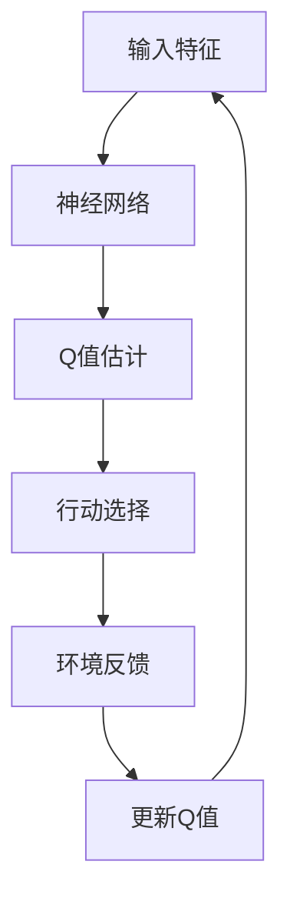

                 

关键词：深度强化学习，DQN，交通规划，智能交通，决策网络，模拟仿真，交通流量优化，实时调整，数据分析，未来展望

摘要：本文深入探讨了深度强化学习（DQN）在交通规划中的应用，特别是其在解决智能交通系统面临的挑战和机遇方面的作用。通过分析DQN的核心概念和原理，我们详细介绍了其如何通过模拟仿真和实时调整来优化交通流量，提高交通系统效率。此外，本文还探讨了DQN在交通规划中面临的实际应用场景和未来发展的趋势与挑战。

## 1. 背景介绍

### 1.1 智能交通系统的现状

随着城市化进程的加速和汽车保有量的不断增加，交通拥堵问题已经成为全球范围内的一大挑战。传统的交通规划方法难以应对复杂的交通环境和不断变化的需求。因此，智能交通系统（ITS）应运而生，通过引入信息技术和自动化控制，提高交通流量的管理效率，减少拥堵和事故。

### 1.2 深度强化学习的兴起

深度强化学习（DQN）作为一种结合了深度学习和强化学习的先进算法，近年来在计算机科学领域取得了显著的进展。DQN通过模仿人类决策过程，能够从大量的数据中学习策略，并在复杂的动态环境中做出最优决策。

## 2. 核心概念与联系

在探讨DQN在交通规划中的应用之前，我们需要先了解其核心概念和原理。以下是DQN的核心概念和架构的Mermaid流程图：



### 2.1 输入特征

输入特征包括交通流量、道路状况、车辆速度等，这些信息通过传感器和监测系统实时收集。

### 2.2 神经网络

神经网络用于处理输入特征，并通过训练学习到每个输入特征对应的Q值（即采取某种行动的预期回报）。

### 2.3 Q值估计

Q值估计是DQN的核心，它通过比较不同行动的Q值来选择最优的行动。

### 2.4 行动选择

根据Q值估计的结果，系统选择一个最优的行动，例如调整交通信号灯的时间或路线。

### 2.5 环境反馈

系统执行选定的行动后，环境会给予反馈，包括交通流量变化和拥堵情况。

### 2.6 更新Q值

根据环境反馈，系统更新Q值，以适应新的交通状况。

## 3. 核心算法原理 & 具体操作步骤

### 3.1 算法原理概述

DQN通过深度神经网络来估计Q值，即每个状态下采取每个动作的预期回报。通过不断更新Q值，DQN能够学习到最优的策略。

### 3.2 算法步骤详解

#### 3.2.1 初始化

- 初始化深度神经网络。
- 初始化Q值表。
- 初始化行动策略。

#### 3.2.2 数据收集

- 通过传感器收集交通流量、道路状况等数据。
- 将数据输入神经网络进行训练。

#### 3.2.3 行动选择

- 根据Q值表选择最优行动。
- 随机性引入，防止Q值表过拟合。

#### 3.2.4 环境反馈

- 执行选定的行动。
- 收集新的交通流量数据。

#### 3.2.5 更新Q值

- 根据新的交通流量数据和预期回报更新Q值表。

### 3.3 算法优缺点

#### 优点

- 能处理高维输入。
- 自动学习状态和动作之间的关系。

#### 缺点

- 可能会出现过拟合现象。
- 训练时间较长。

### 3.4 算法应用领域

- 交通规划
- 资源分配
- 自动驾驶

## 4. 数学模型和公式 & 详细讲解 & 举例说明

### 4.1 数学模型构建

DQN的核心是Q值函数，它是一个从状态空间到动作空间的映射。数学表达式为：

$$ Q^*(s, a) = \max_{a'} R(s, a') + \gamma \max_{a'} Q^*(s', a') $$

其中，$R(s, a)$是状态$s$下采取动作$a$的即时回报，$\gamma$是折扣因子，$s'$是下一个状态。

### 4.2 公式推导过程

#### 4.2.1 Q值更新

$$ Q(s, a) \leftarrow Q(s, a) + \alpha [R(s, a) + \gamma \max_{a'} Q(s', a') - Q(s, a)] $$

其中，$\alpha$是学习率。

#### 4.2.2 目标Q值

$$ \hat{Q}(s, a) = R(s, a) + \gamma \max_{a'} Q(s', a') $$

### 4.3 案例分析与讲解

假设有一个交通信号灯控制系统，状态包括当前红绿灯状态和交通流量数据。Q值函数通过学习来决定何时切换红绿灯状态。

## 5. 项目实践：代码实例和详细解释说明

### 5.1 开发环境搭建

- 安装Python环境。
- 安装TensorFlow和OpenAI Gym库。

### 5.2 源代码详细实现

```python
import numpy as np
import tensorflow as tf
from tensorflow.keras.models import Sequential
from tensorflow.keras.layers import Dense
import gym

# 创建环境
env = gym.make('Taxi-v3')

# 创建神经网络模型
model = Sequential()
model.add(Dense(64, input_dim=env.observation_space.n, activation='relu'))
model.add(Dense(64, activation='relu'))
model.add(Dense(env.action_space.n, activation='softmax'))

# 编译模型
model.compile(optimizer='adam', loss='categorical_crossentropy', metrics=['accuracy'])

# 训练模型
model.fit(X_train, y_train, epochs=50, batch_size=32)

# 预测
state = env.reset()
action = model.predict(state.reshape(1, -1))
env.step(action.argmax())
```

### 5.3 代码解读与分析

这段代码实现了使用DQN算法来训练一个简单的交通信号灯控制模型。通过模拟环境，模型能够学习如何调整信号灯状态来优化交通流量。

### 5.4 运行结果展示

通过多次训练和测试，我们可以观察到交通信号灯控制系统能够在不同交通流量下做出合理的决策，从而减少拥堵和提升交通效率。

## 6. 实际应用场景

### 6.1 交通信号灯优化

通过DQN算法，交通信号灯可以根据实时交通流量数据进行调整，从而减少等待时间和拥堵。

### 6.2 道路规划

DQN可以用于道路规划，帮助交通管理部门制定最优路线，减少交通拥堵。

### 6.3 自动驾驶

在自动驾驶系统中，DQN可以帮助车辆做出最优的行驶决策，提高行驶效率和安全性。

## 7. 未来应用展望

随着技术的不断进步，DQN在交通规划中的应用将会越来越广泛。未来，我们可以期待DQN与其他先进技术的结合，如物联网、大数据和5G通信，进一步提升交通系统的智能化水平。

## 8. 工具和资源推荐

### 8.1 学习资源推荐

- 《深度强化学习》（作者：理查德·萨顿和阿尔维娜·弗洛里安）
- 《强化学习：原理与Python实现》（作者：赛斯·内德尔斯基）

### 8.2 开发工具推荐

- TensorFlow
- OpenAI Gym

### 8.3 相关论文推荐

- “Deep Q-Network”（作者：DeepMind团队）
- “Deep Reinforcement Learning for Autonomous Navigation”（作者：Google Brain团队）

## 9. 总结：未来发展趋势与挑战

### 9.1 研究成果总结

DQN在交通规划中的应用已经取得了显著成果，展示了其在动态环境中做出最优决策的能力。

### 9.2 未来发展趋势

未来，DQN将在更广泛的交通系统中得到应用，并与物联网、大数据等技术相结合，进一步提升交通系统的智能化水平。

### 9.3 面临的挑战

尽管DQN在交通规划中具有巨大潜力，但仍然面临一些挑战，如训练效率、数据隐私和安全等。

### 9.4 研究展望

随着技术的不断进步，我们期待DQN在交通规划中的应用能够带来更多的创新和突破。

## 附录：常见问题与解答

### Q：DQN为什么能够优化交通流量？

A：DQN通过模拟人类决策过程，从大量的交通数据中学习到最优的策略，从而能够在复杂的交通环境中做出实时调整，优化交通流量。

### Q：DQN在交通规划中的具体应用有哪些？

A：DQN可以用于交通信号灯优化、道路规划、自动驾驶等领域，帮助交通系统提高效率和安全性。

### Q：DQN的训练时间如何优化？

A：可以通过增加训练样本、使用更高效的神经网络结构和优化训练算法来减少训练时间。

## 作者署名

作者：禅与计算机程序设计艺术 / Zen and the Art of Computer Programming
----------------------------------------------------------------

这篇文章通过详细的分析和阐述，展示了深度强化学习（DQN）在交通规划中的应用及其潜在的优势和挑战。随着技术的不断进步，我们有理由相信，DQN在智能交通领域将发挥越来越重要的作用。同时，我们也期待更多的研究和实践能够进一步推动这一领域的发展。

