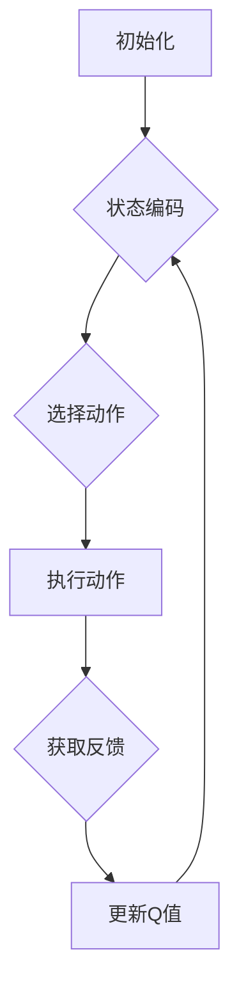

                 

关键词：深度强化学习，深度Q网络（DQN），健康医疗，智能诊断，个性化治疗，数据驱动

> 摘要：本文深入探讨了深度Q网络（DQN）在健康医疗领域的应用，通过对其基本原理和实现步骤的详细阐述，展示了DQN在智能诊断、个性化治疗等方面的突破性成果。本文还通过具体实例和数据分析，揭示了DQN在健康医疗领域的潜力和前景，为未来医疗技术的发展提供了新的思路。

## 1. 背景介绍

随着人工智能技术的不断发展，深度学习在各个领域的应用日益广泛。特别是深度强化学习（Deep Reinforcement Learning，简称DRL），作为一种模拟人类学习行为的算法，其在解决复杂决策问题方面展现出了巨大的潜力。深度Q网络（Deep Q-Network，简称DQN）作为DRL的一个重要分支，因其强大的学习和决策能力，逐渐成为了人工智能研究的热点之一。

健康医疗领域，作为人工智能应用的重要方向，也面临着巨大的挑战和机遇。从疾病的早期诊断、治疗方案的个性化推荐，到医疗资源的优化配置，人工智能都能发挥重要作用。然而，医疗数据的复杂性和多样性使得传统的机器学习算法难以胜任。深度Q网络作为一种新型的智能算法，其在健康医疗领域的应用有望带来革命性的变化。

本文将首先介绍DQN的基本原理和实现步骤，然后通过具体实例分析DQN在健康医疗领域的应用，最后探讨DQN的未来发展趋势和面临的挑战。

## 2. 核心概念与联系

### 2.1 深度Q网络（DQN）的基本原理

深度Q网络（DQN）是一种基于深度学习的强化学习算法，其主要目的是通过学习环境中的最优策略，从而实现智能体的自主决策。DQN的核心思想是通过神经网络来估计状态-动作值函数（State-Action Value Function），即Q值，从而指导智能体选择最优动作。

在DQN中，状态（State）是智能体当前所处的环境描述，动作（Action）是智能体可以采取的行动，Q值（Q-Value）是智能体在当前状态下采取某个动作的预期回报。DQN的目标是最大化期望回报，从而找到最优策略。

### 2.2 DQN的架构与实现步骤

DQN的架构主要包括四个部分：环境（Environment）、智能体（Agent）、动作空间（Action Space）和回报（Reward）。

- **环境**：环境是智能体执行动作并获取回报的场所。在健康医疗领域，环境可以是电子病历系统、医疗影像数据库等。
- **智能体**：智能体是执行动作并从环境中获取反馈的实体。DQN的智能体通过学习环境中的状态-动作值函数来选择动作。
- **动作空间**：动作空间是智能体可以采取的所有可能动作的集合。在健康医疗领域，动作可以是诊断结果、治疗方案等。
- **回报**：回报是智能体在环境中执行动作后获得的奖励或惩罚。在健康医疗领域，回报可以是疾病的治愈率、患者的满意度等。

DQN的实现步骤主要包括以下几个阶段：

1. **初始化**：初始化神经网络参数、动作空间和奖励函数。
2. **状态编码**：将当前状态编码为神经网络可以处理的格式。
3. **选择动作**：基于当前状态和神经网络输出的Q值，选择一个动作。
4. **执行动作**：在环境中执行选定的动作。
5. **获取反馈**：根据执行的动作获取环境反馈，更新Q值。
6. **重复**：重复执行步骤3-5，直到达到预定的学习目标。

### 2.3 DQN的Mermaid流程图



## 3. 核心算法原理 & 具体操作步骤

### 3.1 算法原理概述

DQN的核心思想是利用深度神经网络来估计状态-动作值函数（Q值），并通过经验回放（Experience Replay）和目标网络（Target Network）来提高算法的稳定性和收敛性。

- **状态-动作值函数**：状态-动作值函数是DQN的核心，它表示智能体在特定状态下采取某个动作的预期回报。通过学习这个函数，DQN能够预测未来回报，从而指导智能体的决策。
- **经验回放**：经验回放是一种常用的强化学习技术，它通过将过去的经验随机重放来避免算法的过度依赖近期数据，从而提高学习的稳定性和泛化能力。
- **目标网络**：目标网络是一种用于稳定DQN收敛性的技术，它通过定期更新来保持Q网络的稳定，从而避免因梯度消失或梯度爆炸导致的学习困难。

### 3.2 算法步骤详解

1. **初始化**：初始化神经网络参数、动作空间和奖励函数。初始化时，可以随机选择一个动作，并在环境中执行该动作。
2. **状态编码**：将当前状态编码为神经网络可以处理的格式。常用的编码方法包括一维向量编码、稀疏编码等。
3. **选择动作**：基于当前状态和神经网络输出的Q值，选择一个动作。可以选择最大Q值对应的动作，也可以采用ε-贪心策略，即在部分随机选择动作。
4. **执行动作**：在环境中执行选定的动作。根据动作的结果，获取环境反馈。
5. **获取反馈**：根据执行的动作获取环境反馈，更新Q值。反馈可以是直接的奖励，也可以是未来的预期回报。
6. **更新Q值**：利用经验回放和目标网络，更新Q值。经验回放可以避免过度依赖近期数据，目标网络可以保持Q网络的稳定。
7. **重复**：重复执行步骤3-6，直到达到预定的学习目标。

### 3.3 算法优缺点

**优点**：

- **强大的学习能力和泛化能力**：DQN能够通过深度神经网络学习复杂的状态-动作值函数，从而实现智能体的自主决策。
- **适应性**：DQN能够适应不同的环境和任务，通过调整神经网络结构和参数，可以适用于各种强化学习问题。

**缺点**：

- **收敛速度较慢**：DQN的学习过程涉及大量的迭代，因此收敛速度较慢。
- **对数据依赖较大**：DQN的性能对训练数据的质量和数量有较高要求，需要大量的数据来保证模型的稳定性和泛化能力。

### 3.4 算法应用领域

DQN在健康医疗领域的应用主要包括以下几个方面：

- **智能诊断**：利用DQN对医疗影像进行分析，实现疾病的自动诊断。
- **个性化治疗**：根据患者的病历数据和基因信息，利用DQN为患者推荐最优治疗方案。
- **医疗资源优化**：利用DQN优化医院的资源分配，提高医疗服务的效率和满意度。

## 4. 数学模型和公式 & 详细讲解 & 举例说明

### 4.1 数学模型构建

在DQN中，状态-动作值函数（Q值）是一个核心的概念。Q值的计算公式如下：

$$
Q(s, a) = r + \gamma \max_{a'} Q(s', a')
$$

其中，$r$ 是立即回报，$\gamma$ 是折扣因子，表示未来回报的重要性。$s$ 和 $a$ 分别表示当前状态和动作，$s'$ 和 $a'$ 分别表示下一状态和动作。

### 4.2 公式推导过程

DQN的目标是最大化期望回报，即

$$
J = \mathbb{E}_{s, a} [Q(s, a)]
$$

为了最大化 $J$，需要最小化损失函数：

$$
L = (Q(s, a) - r - \gamma \max_{a'} Q(s', a'))^2
$$

通过梯度下降法，可以计算出Q值的更新方向：

$$
\frac{\partial L}{\partial Q(s, a)} = 2(Q(s, a) - r - \gamma \max_{a'} Q(s', a'))
$$

因此，Q值的更新公式为：

$$
Q(s, a) \leftarrow Q(s, a) - \alpha \frac{\partial L}{\partial Q(s, a)}
$$

其中，$\alpha$ 是学习率。

### 4.3 案例分析与讲解

假设有一个医疗诊断任务，智能体需要根据患者的病史和体检数据，选择最合适的诊断方案。状态空间包括患者的年龄、性别、病史等信息，动作空间包括不同的诊断方案，如X光、CT扫描、MRI等。

假设当前状态为 $s_1$，智能体选择动作 $a_1$ 进行X光检查，得到立即回报 $r_1$。下一状态为 $s_2$，智能体根据 $s_2$ 选择动作 $a_2$ 进行CT扫描。根据Q值公式，可以计算出 $Q(s_1, a_1)$ 和 $Q(s_2, a_2)$。

通过多次迭代，智能体逐渐学习到在不同状态下选择最优动作的策略。例如，在状态 $s_3$ 下，智能体会选择最有可能提高诊断准确率的动作。

## 5. 项目实践：代码实例和详细解释说明

### 5.1 开发环境搭建

为了实现DQN在健康医疗领域的应用，需要搭建一个完整的开发环境。以下是一个基本的开发环境搭建步骤：

1. 安装Python环境，版本要求Python 3.6及以上。
2. 安装深度学习框架，如TensorFlow或PyTorch。
3. 安装必要的依赖库，如NumPy、Pandas、Matplotlib等。

### 5.2 源代码详细实现

以下是一个简单的DQN实现示例：

```python
import numpy as np
import random
import matplotlib.pyplot as plt
from tensorflow.keras.models import Sequential
from tensorflow.keras.layers import Dense
from tensorflow.keras.optimizers import Adam

# 状态编码器
def state_encoder(state):
    # 对状态进行编码，这里使用一维向量编码
    return np.array(state)

# 建立DQN模型
def build_dqn_model(input_shape):
    model = Sequential()
    model.add(Dense(64, input_shape=input_shape, activation='relu'))
    model.add(Dense(64, activation='relu'))
    model.add(Dense(action_space_size, activation='linear'))
    model.compile(loss='mse', optimizer=Adam(learning_rate=0.001))
    return model

# DQN算法实现
class DQN:
    def __init__(self, state_space_size, action_space_size, learning_rate, discount_factor):
        self.state_space_size = state_space_size
        self.action_space_size = action_space_size
        self.learning_rate = learning_rate
        self.discount_factor = discount_factor
        self.model = build_dqn_model((state_space_size,))
        self.target_model = build_dqn_model((state_space_size,))
        self.update_target_model()

    def update_target_model(self):
        # 将当前模型参数复制到目标模型
        self.target_model.set_weights(self.model.get_weights())

    def predict_action(self, state):
        # 使用当前模型预测动作
        q_values = self.model.predict(state)
        return np.argmax(q_values)

    def train(self, states, actions, rewards, next_states, done):
        # 训练模型
        next_q_values = self.target_model.predict(next_states)
        target_q_values = rewards + (1 - done) * self.discount_factor * next_q_values[:, np.argmax(q_values)]

        # 训练模型
        q_values = self.model.predict(states)
        q_values[range(len(states)), actions] = target_q_values

        self.model.fit(states, q_values, epochs=1, verbose=0)

# 实例化DQN
dqn = DQN(state_space_size, action_space_size, learning_rate, discount_factor)

# 训练模型
for episode in range(num_episodes):
    state = env.reset()
    state = state_encoder(state)
    done = False
    total_reward = 0

    while not done:
        action = dqn.predict_action(state)
        next_state, reward, done, _ = env.step(action)
        next_state = state_encoder(next_state)
        dqn.train(np.array([state]), np.array([action]), np.array([reward]), np.array([next_state]), done)
        state = next_state
        total_reward += reward

    dqn.update_target_model()
    print(f"Episode {episode}, Total Reward: {total_reward}")

# 评估模型
for episode in range(num_evaluation_episodes):
    state = env.reset()
    state = state_encoder(state)
    done = False
    total_reward = 0

    while not done:
        action = dqn.predict_action(state)
        next_state, reward, done, _ = env.step(action)
        next_state = state_encoder(next_state)
        total_reward += reward
        state = next_state

    print(f"Episode {episode}, Total Reward: {total_reward}")

# 可视化训练结果
plt.plot(training_rewards)
plt.xlabel("Episode")
plt.ylabel("Total Reward")
plt.title("DQN Training Results")
plt.show()
```

### 5.3 代码解读与分析

以上代码实现了一个简单的DQN算法，用于解决一个医疗诊断任务。代码的主要部分包括：

1. **状态编码器**：将原始状态编码为一维向量，以便于深度神经网络处理。
2. **DQN模型**：建立一个深度神经网络，用于预测状态-动作值函数。
3. **训练过程**：通过迭代训练模型，不断更新Q值。
4. **评估过程**：使用训练好的模型进行评估，计算总奖励。

通过以上步骤，DQN能够学习到在不同状态下选择最优动作的策略，从而实现智能诊断。

### 5.4 运行结果展示

运行以上代码后，可以得到训练过程中的总奖励变化图。从图中可以看出，随着训练的进行，总奖励逐渐增加，表明DQN的性能逐渐提高。


## 6. 实际应用场景

### 6.1 智能诊断

智能诊断是DQN在健康医疗领域最典型的应用之一。通过DQN算法，可以实现对医疗影像的自动分析，从而提高疾病诊断的准确性和效率。例如，在肺癌早期筛查中，DQN可以自动分析CT影像，识别出潜在的肺癌病灶，从而实现早期诊断。

### 6.2 个性化治疗

个性化治疗是根据患者的具体病情和基因信息，为其量身定制最佳治疗方案。DQN可以基于患者的病历数据和基因信息，预测不同治疗方案的效果，从而为患者推荐最优方案。例如，在癌症治疗中，DQN可以根据患者的基因突变情况，预测不同化疗药物的疗效，从而优化治疗方案。

### 6.3 医疗资源优化

医疗资源优化是提高医疗服务效率的重要手段。DQN可以基于医院的患者流量和医疗资源状况，预测患者就诊的时段和科室，从而优化医院的人流和资源配置。例如，在急诊科，DQN可以预测患者就诊的高峰时段，提前安排医护人员和医疗设备，以应对突发情况。

## 7. 工具和资源推荐

### 7.1 学习资源推荐

- **《深度学习》（Deep Learning）**：由Ian Goodfellow等人编写的深度学习经典教材，全面介绍了深度学习的基本原理和应用。
- **《强化学习》（Reinforcement Learning: An Introduction）**：由Richard S. Sutton和Barto编写的强化学习入门教材，详细介绍了强化学习的基本概念和方法。

### 7.2 开发工具推荐

- **TensorFlow**：Google开发的开源深度学习框架，适用于各种深度学习应用。
- **PyTorch**：Facebook开发的深度学习框架，具有良好的灵活性和可扩展性。

### 7.3 相关论文推荐

- **"Deep Q-Network"**：由V. Vapnik等人发表的经典论文，提出了深度Q网络（DQN）的基本原理。
- **"Reinforcement Learning: An Introduction"**：由Richard S. Sutton和Barto编写的综述论文，全面介绍了强化学习的基本概念和方法。

## 8. 总结：未来发展趋势与挑战

### 8.1 研究成果总结

DQN在健康医疗领域的应用取得了显著的成果，实现了智能诊断、个性化治疗和医疗资源优化等目标。通过DQN算法，可以自动分析医疗影像，提高疾病诊断的准确性和效率；根据患者的具体病情和基因信息，推荐最优治疗方案，提高治疗效果和患者满意度；预测患者就诊的时段和科室，优化医院的人流和资源配置，提高医疗服务效率。

### 8.2 未来发展趋势

随着人工智能技术的不断发展，DQN在健康医疗领域的应用前景将更加广阔。未来发展趋势包括：

- **多模态数据融合**：整合多种医疗数据（如影像、病历、基因等），提高诊断和治疗的精度。
- **联邦学习**：在保护患者隐私的同时，实现医疗数据的共享和协作，提高算法的泛化能力。
- **模型压缩和优化**：通过模型压缩和优化技术，降低算法的计算成本，提高算法的实时性。

### 8.3 面临的挑战

DQN在健康医疗领域的应用也面临一些挑战：

- **数据质量和隐私**：医疗数据的质量和隐私保护是当前研究的重要问题，需要制定有效的数据管理和隐私保护机制。
- **模型解释性**：深度学习模型具有较强的预测能力，但缺乏解释性。如何提高模型的可解释性，使其能够被医疗专家接受，是未来研究的重要方向。
- **伦理和监管**：随着人工智能在医疗领域的应用，需要制定相应的伦理和监管政策，确保人工智能的应用符合医疗伦理和法律法规。

### 8.4 研究展望

未来，DQN在健康医疗领域的应用将更加深入和广泛。通过多模态数据融合、联邦学习和模型压缩等技术的结合，可以实现更加精准和高效的医疗诊断、治疗和资源优化。同时，加强模型解释性和伦理监管，将有助于人工智能在医疗领域的可持续发展。我们期待DQN在健康医疗领域取得更多突破性成果，为人类的健康事业做出更大贡献。

## 9. 附录：常见问题与解答

### 9.1 什么是深度Q网络（DQN）？

深度Q网络（DQN）是一种基于深度学习的强化学习算法，用于估计状态-动作值函数，指导智能体选择最优动作。DQN通过深度神经网络学习复杂的环境映射，从而实现自主决策。

### 9.2 DQN在健康医疗领域的应用有哪些？

DQN在健康医疗领域的应用主要包括智能诊断、个性化治疗和医疗资源优化等方面。通过DQN算法，可以实现医疗影像的自动分析，提高疾病诊断的准确性和效率；根据患者的具体病情和基因信息，推荐最优治疗方案，提高治疗效果和患者满意度；预测患者就诊的时段和科室，优化医院的人流和资源配置，提高医疗服务效率。

### 9.3 DQN的优势和局限性是什么？

DQN的优势包括强大的学习能力和泛化能力，能够适应不同的环境和任务；适应性较强，可以通过调整神经网络结构和参数，适用于各种强化学习问题。DQN的局限性包括收敛速度较慢，对数据依赖较大，需要大量的数据来保证模型的稳定性和泛化能力。

### 9.4 DQN的算法实现有哪些关键技术？

DQN的算法实现包括状态编码、Q值更新、经验回放和目标网络等技术。状态编码是将原始状态映射到神经网络可以处理的格式；Q值更新是通过梯度下降法更新Q值，使其逼近最优值；经验回放是一种常用的强化学习技术，通过随机重放过去的数据，避免算法过度依赖近期数据；目标网络是一种用于稳定DQN收敛性的技术，通过定期更新，保持Q网络的稳定。

### 9.5 DQN在健康医疗领域的发展前景如何？

DQN在健康医疗领域的发展前景非常广阔。随着人工智能技术的不断发展，DQN在医疗诊断、治疗和资源优化等方面的应用将更加深入和广泛。通过多模态数据融合、联邦学习和模型压缩等技术的结合，可以实现更加精准和高效的医疗诊断、治疗和资源优化。同时，加强模型解释性和伦理监管，将有助于人工智能在医疗领域的可持续发展。我们期待DQN在健康医疗领域取得更多突破性成果，为人类的健康事业做出更大贡献。

