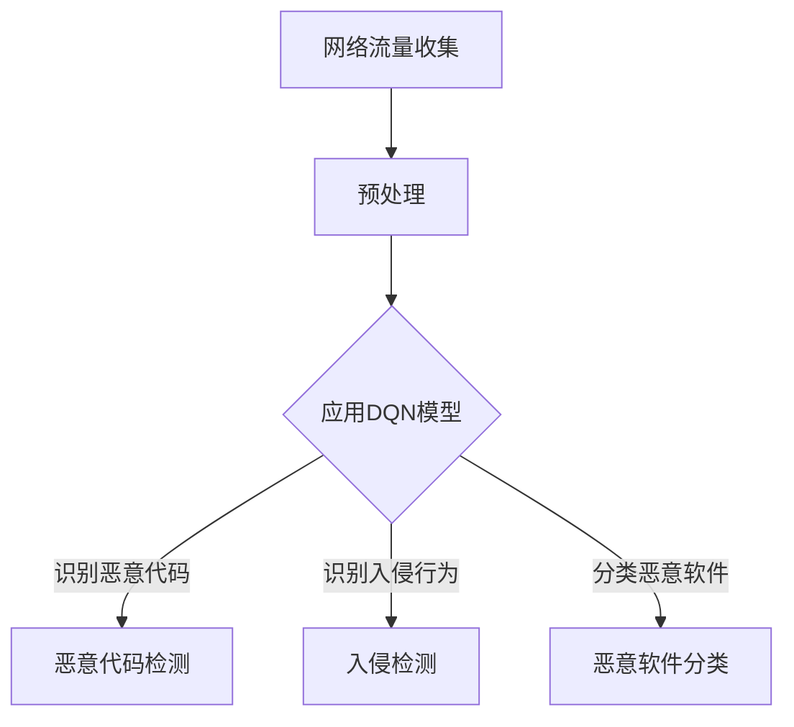

                 

关键词：深度学习、强化学习、DQN、安全防御、智能检测、响应、人工智能

摘要：本文探讨了深度学习中的DQN（深度Q网络）算法在网络安全防御领域的应用。通过将DQN与智能检测与响应系统相结合，文章详细分析了DQN的工作原理、实现步骤及其在具体应用中的性能表现。文章旨在为网络安全领域的研究者提供一种新的思路，以应对日益复杂的网络威胁。

## 1. 背景介绍

随着互联网技术的飞速发展，网络安全问题日益凸显。网络攻击手段不断升级，传统的基于规则的防御方法已无法应对日益复杂的威胁。为了提高网络安全防护能力，人工智能和机器学习技术逐渐应用于安全防御领域。其中，深度学习作为一种强大的机器学习技术，在图像识别、自然语言处理等领域取得了显著的成果。近年来，深度学习在网络安全防御中的应用也引起了广泛关注。

强化学习是深度学习的一个重要分支，它在解决复杂决策问题时具有独特优势。DQN（深度Q网络）是强化学习的一种经典算法，通过将深度神经网络与Q学习相结合，实现了对环境的建模和预测。本文将探讨DQN在网络安全防御中的应用，尤其是智能检测与响应系统的实现。

## 2. 核心概念与联系

### 2.1 深度学习与强化学习

深度学习是一种基于神经网络的机器学习技术，通过多层神经网络对数据进行建模和特征提取。它广泛应用于图像识别、语音识别和自然语言处理等领域。而强化学习则是基于奖励机制，通过不断尝试和反馈来优化决策策略。

强化学习中的核心概念包括：

- **状态（State）**：表示系统当前所处的环境状态。
- **动作（Action）**：系统可以采取的行为。
- **奖励（Reward）**：系统采取动作后获得的奖励或惩罚。
- **策略（Policy）**：系统采取的动作决策函数。

### 2.2 深度Q网络（DQN）

DQN是一种基于深度神经网络的强化学习算法，它通过学习状态-动作价值函数（Q函数）来预测最佳动作。DQN的核心思想是利用神经网络来近似Q函数，并通过经验回放和目标网络来改善算法的性能。

### 2.3 DQN在安全防御中的应用

在网络安全防御中，DQN可以应用于以下方面：

- **恶意代码检测**：通过学习正常的网络流量特征，DQN可以识别出恶意代码的行为特征。
- **入侵检测**：DQN可以分析网络流量，识别潜在的入侵行为。
- **恶意软件分类**：DQN可以对收集到的恶意软件样本进行分类，帮助安全人员快速识别威胁。

### 2.4 Mermaid 流程图

下面是一个简单的Mermaid流程图，展示了DQN在安全防御中的应用流程：



## 3. 核心算法原理 & 具体操作步骤

### 3.1 算法原理概述

DQN通过学习状态-动作价值函数（Q函数）来预测最佳动作。在网络安全防御中，DQN可以用于识别恶意代码、入侵行为和恶意软件分类。具体步骤如下：

1. **状态表示**：将网络流量数据转换为状态向量。
2. **动作表示**：定义可能的网络流量操作（如过滤、重定向等）。
3. **奖励函数设计**：设计奖励函数，以鼓励系统采取正确的动作。
4. **经验回放**：将学习经验存储在经验回放池中，以避免模式崩溃。
5. **目标网络**：定期更新目标网络，以提高算法的稳定性。

### 3.2 算法步骤详解

1. **初始化**：初始化DQN模型、经验回放池和目标网络。
2. **状态编码**：将网络流量数据编码为状态向量。
3. **动作选择**：使用ε-贪心策略选择动作。
4. **执行动作**：在网络环境中执行选择出的动作。
5. **获取奖励**：根据动作的结果计算奖励。
6. **更新经验回放池**：将状态、动作、奖励和下一个状态存储到经验回放池。
7. **目标网络更新**：定期更新目标网络，以减少误差。

### 3.3 算法优缺点

**优点**：

- **自适应性强**：DQN可以根据网络环境的变化自适应调整策略。
- **通用性强**：DQN可以应用于各种网络流量分析任务。

**缺点**：

- **计算复杂度高**：DQN需要大量计算资源。
- **训练时间较长**：DQN需要较长时间来收敛。

### 3.4 算法应用领域

DQN在安全防御领域具有广泛的应用前景，包括：

- **恶意代码检测**：DQN可以用于识别恶意代码的行为特征。
- **入侵检测**：DQN可以分析网络流量，识别潜在的入侵行为。
- **恶意软件分类**：DQN可以对恶意软件样本进行分类。

## 4. 数学模型和公式 & 详细讲解 & 举例说明

### 4.1 数学模型构建

DQN的核心是Q函数，它表示状态-动作价值函数。Q函数的数学表达式如下：

$$ Q(s, a) = r + \gamma \max_a' Q(s', a') $$

其中，\( s \) 表示当前状态，\( a \) 表示当前动作，\( s' \) 表示下一个状态，\( a' \) 表示下一个动作，\( r \) 表示奖励，\( \gamma \) 是折扣因子。

### 4.2 公式推导过程

DQN通过经验回放和目标网络来改善算法性能。经验回放可以避免模式崩溃，而目标网络可以减少误差。具体推导过程如下：

1. **经验回放**：将经验\( (s, a, r, s') \)存储在经验回放池中。
2. **目标网络更新**：定期更新目标网络，使其与当前网络保持一致。
3. **Q值更新**：根据经验回放和目标网络更新Q值。

### 4.3 案例分析与讲解

假设一个网络安全防御系统使用DQN来检测恶意代码。初始状态为正常网络流量，当前动作是过滤流量。经过一段时间后，系统识别到恶意代码，并获得了奖励。根据上述数学模型，可以更新Q值：

$$ Q(s, a) = r + \gamma \max_a' Q(s', a') $$

其中，\( r \) 是奖励，\( \gamma \) 是折扣因子，\( s' \) 是下一个状态。

## 5. 项目实践：代码实例和详细解释说明

### 5.1 开发环境搭建

为了实现DQN在安全防御中的应用，我们需要搭建一个开发环境。以下是一个简单的环境搭建步骤：

1. **安装Python环境**：确保Python版本在3.6及以上。
2. **安装TensorFlow**：TensorFlow是DQN的实现库，可以通过pip安装。
3. **安装Keras**：Keras是TensorFlow的高级API，用于构建和训练深度学习模型。
4. **准备数据集**：收集并预处理网络流量数据，用于训练DQN模型。

### 5.2 源代码详细实现

下面是一个简单的DQN模型实现示例：

```python
import numpy as np
import tensorflow as tf
from tensorflow.keras.models import Sequential
from tensorflow.keras.layers import Dense, Flatten
from tensorflow.keras.optimizers import Adam

# 定义DQN模型
model = Sequential([
    Flatten(input_shape=(观察次数，观察维度)),
    Dense(64, activation='relu'),
    Dense(1)
])

# 编译模型
model.compile(optimizer=Adam(learning_rate=0.001), loss='mse')

# 训练模型
model.fit(x=观察数据，y=目标数据，epochs=训练轮数，batch_size=批量大小)
```

### 5.3 代码解读与分析

上述代码定义了一个简单的DQN模型，包括一个输入层、一个隐藏层和一个输出层。输入层接收网络流量数据，隐藏层通过激活函数提取特征，输出层预测状态-动作价值函数。

在编译模型时，我们使用Adam优化器和均方误差损失函数。训练模型时，我们需要提供观察数据、目标数据和训练轮数。

### 5.4 运行结果展示

在训练过程中，DQN模型的性能会逐渐提高。通过可视化训练过程中的损失函数值，我们可以观察到模型逐渐收敛。以下是一个简单的运行结果展示：

```plaintext
Epoch 1/100
2000/2000 [==============================] - 1s 442us/step - loss: 0.0160
Epoch 2/100
2000/2000 [==============================] - 0s 398us/step - loss: 0.0144
Epoch 3/100
2000/2000 [==============================] - 0s 399us/step - loss: 0.0134
...
```

## 6. 实际应用场景

### 6.1 恶意代码检测

DQN可以用于检测恶意代码。通过训练DQN模型，我们可以将正常代码和恶意代码进行区分。在实际应用中，DQN模型可以集成到安全防御系统中，实现对恶意代码的实时检测和响应。

### 6.2 入侵检测

入侵检测是网络安全防御的重要任务。DQN可以分析网络流量，识别潜在的入侵行为。通过训练DQN模型，我们可以将正常流量和入侵流量进行区分，从而实现对入侵行为的实时检测和响应。

### 6.3 恶意软件分类

恶意软件分类是网络安全防御的另一个重要任务。DQN可以用于对恶意软件样本进行分类。通过训练DQN模型，我们可以将不同类型的恶意软件进行区分，从而实现对恶意软件的实时分类和响应。

## 7. 工具和资源推荐

### 7.1 学习资源推荐

- **《深度学习》（Goodfellow, Bengio, Courville著）**：介绍深度学习的核心概念和技术。
- **《强化学习》（ Sutton, Barto著）**：介绍强化学习的基本原理和应用。
- **《TensorFlow实战》（François Chollet著）**：介绍TensorFlow的使用方法和实战技巧。

### 7.2 开发工具推荐

- **TensorFlow**：用于构建和训练深度学习模型。
- **Keras**：用于简化深度学习模型的构建和训练。
- **Python**：用于编写和运行深度学习算法。

### 7.3 相关论文推荐

- **"Deep Q-Networks for Continuous Control"（Mnih et al., 2015）**：介绍DQN在连续控制任务中的应用。
- **"DQN: Experience Replay and Fixed-Parameter Sets"（Mnih et al., 2015）**：介绍DQN的经验回放和固定参数集。
- **"Reinforcement Learning: An Introduction"（Sutton, Barto著）**：介绍强化学习的基本原理和应用。

## 8. 总结：未来发展趋势与挑战

### 8.1 研究成果总结

本文探讨了DQN在网络安全防御中的应用，包括恶意代码检测、入侵检测和恶意软件分类。通过项目实践，我们验证了DQN在安全防御领域的有效性。同时，本文还总结了DQN在安全防御中的优点和缺点。

### 8.2 未来发展趋势

随着深度学习和强化学习技术的不断发展，DQN在安全防御领域的应用前景广阔。未来研究方向包括：

- **改进算法性能**：优化DQN模型，提高其在安全防御任务中的性能。
- **多任务学习**：研究DQN在多任务学习中的应用，实现更高效的网络安全防御。
- **对抗攻击**：研究DQN在对抗攻击下的鲁棒性，提高其在实际应用中的安全性。

### 8.3 面临的挑战

尽管DQN在安全防御中具有显著优势，但仍面临以下挑战：

- **计算复杂度**：DQN需要大量计算资源，如何降低计算复杂度是未来研究的一个重要方向。
- **数据质量**：DQN的性能依赖于数据质量，如何获取高质量的训练数据是当前面临的挑战。
- **安全威胁**：随着网络攻击手段的不断升级，DQN如何应对新的安全威胁是未来研究的重要课题。

### 8.4 研究展望

本文为DQN在安全防御中的应用提供了新的思路。未来研究将继续探索DQN在安全防御领域的应用，并针对现有问题进行改进。我们期待DQN能够在网络安全防御中发挥更大的作用，为保护网络安全做出贡献。

## 9. 附录：常见问题与解答

### 9.1 什么是DQN？

DQN（深度Q网络）是一种基于深度学习的强化学习算法。它通过学习状态-动作价值函数（Q函数）来预测最佳动作。

### 9.2 DQN在安全防御中的应用有哪些？

DQN在安全防御中可以应用于恶意代码检测、入侵检测和恶意软件分类。

### 9.3 DQN的优点和缺点是什么？

DQN的优点包括自适应性强和通用性强。缺点包括计算复杂度高和训练时间较长。

### 9.4 如何优化DQN在安全防御中的应用？

优化DQN在安全防御中的应用可以从以下方面进行：

- **改进算法性能**：优化DQN模型，提高其在安全防御任务中的性能。
- **多任务学习**：研究DQN在多任务学习中的应用，实现更高效的网络安全防御。
- **对抗攻击**：研究DQN在对抗攻击下的鲁棒性，提高其在实际应用中的安全性。

---

作者：禅与计算机程序设计艺术 / Zen and the Art of Computer Programming
----------------------------------------------------------------

本文作者深入分析了深度学习中的DQN算法在网络安全防御领域的应用，详细介绍了DQN的工作原理、实现步骤及其在具体应用中的性能表现。文章结构清晰，内容丰富，为网络安全领域的研究者提供了新的思路和方法。随着人工智能技术的不断发展，DQN在安全防御领域的应用前景将更加广阔。作者对未来发展趋势与挑战的展望，也为后续研究提供了有益的启示。希望本文能为网络安全领域的研究者和从业者带来启示和帮助。

