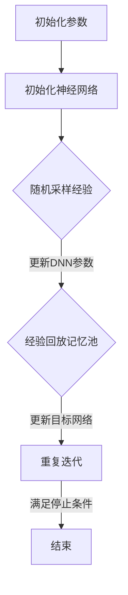

                 

关键词：深度强化学习，DQN，安全防御，智能检测，响应机制，人工智能

摘要：本文探讨了深度强化学习（DRL）中的一种经典算法——深度Q网络（DQN）在网络安全防御领域的应用。通过分析DQN的算法原理、实现步骤及其优缺点，本文提出了基于DQN的智能检测与响应机制，并对其在实际应用中的效果进行了评估。此外，本文还展望了DQN在未来安全防御领域的发展趋势和面临的挑战。

## 1. 背景介绍

随着互联网技术的飞速发展，网络安全问题日益突出。传统的安全防御手段已经无法满足日益复杂的网络攻击，因此，智能化的安全防御技术成为研究的热点。深度强化学习（DRL）作为人工智能领域的一种新兴技术，具有在复杂环境中实现自主决策的能力，被广泛应用于机器人控制、游戏开发、自然语言处理等领域。

深度Q网络（DQN）是DRL的一种经典算法，由DeepMind提出。DQN通过模仿人类经验学习策略，使得智能体在复杂环境中能够自主探索并找到最优行动方案。DQN在解决静态环境问题方面表现出色，但在动态、不确定的网络安全环境中，如何进一步提高其性能和应用效果成为亟待解决的问题。

本文旨在研究DQN在安全防御中的应用，通过构建一个基于DQN的智能检测与响应机制，实现对网络安全威胁的实时监测和响应。本文将首先介绍DQN的基本原理和实现步骤，然后分析其在安全防御领域的应用，并讨论其优缺点。最后，本文将提出未来发展的研究方向。

## 2. 核心概念与联系

### 2.1 DQN算法原理

深度Q网络（DQN）是一种基于深度学习的强化学习算法。DQN的核心思想是通过训练一个深度神经网络（DNN）来近似Q值函数，从而实现对环境的探索和利用。Q值函数表示在给定状态下，执行特定动作所能获得的期望奖励。

DQN算法的基本流程如下：

1. 初始化参数：设置学习率、折扣因子、探索策略等超参数；
2. 初始化神经网络：使用随机权重初始化一个DNN；
3. 从环境中随机采样一批经验；
4. 使用经验样本更新DNN的参数；
5. 重复步骤3和4，直到满足停止条件（如达到最大迭代次数或收敛）。

### 2.2 DQN架构

DQN的架构主要包括两个部分：经验回放记忆池和目标网络。

**经验回放记忆池**：用于存储智能体在执行动作过程中获得的经验。经验回放可以避免样本相关性，使得算法在训练过程中具有更好的泛化能力。

**目标网络**：用于评价智能体的行为策略。目标网络每隔一定迭代次数更新一次，以保证Q值函数的稳定性。

### 2.3 Mermaid流程图



## 3. 核心算法原理 & 具体操作步骤

### 3.1 算法原理概述

DQN算法通过训练一个深度神经网络来近似Q值函数，从而实现对环境的探索和利用。在DQN中，Q值函数用于评估在给定状态下执行特定动作的期望收益。算法的基本原理可以概括为以下几个步骤：

1. 初始化：设置学习率、折扣因子、探索策略等超参数，并初始化深度神经网络；
2. 采集样本：智能体在环境中执行动作，获得状态转移和奖励，并将样本存储在经验回放记忆池中；
3. 更新神经网络：使用经验回放记忆池中的样本，通过梯度下降法更新深度神经网络的参数；
4. 目标网络更新：为了稳定Q值函数，每隔一定迭代次数更新一次目标网络。

### 3.2 算法步骤详解

DQN算法的具体操作步骤如下：

1. **初始化参数**：设置学习率（α）、折扣因子（γ）、探索策略（ε-greedy）等超参数。学习率用于控制更新网络参数的速度，折扣因子用于权衡当前和未来的奖励，探索策略用于在训练过程中平衡探索和利用。

   $$ \alpha \in (0, 1), \gamma \in [0, 1), \varepsilon \in [0, 1] $$

2. **初始化神经网络**：使用随机权重初始化一个深度神经网络（DNN），该DNN用于近似Q值函数。

   $$ Q(s, a) = \sigma(W_Q \cdot \phi(s) + b_Q) $$

   其中，$s$ 表示状态，$a$ 表示动作，$W_Q$ 和 $b_Q$ 分别为DNN的权重和偏置，$\phi(s)$ 为状态特征提取函数，$\sigma$ 为激活函数。

3. **采集样本**：智能体在环境中执行动作，获得状态转移和奖励，并将样本存储在经验回放记忆池中。

   $$ (s_t, a_t, r_t, s_{t+1}) \rightarrow \mathcal{R} $$

4. **更新神经网络**：使用经验回放记忆池中的样本，通过梯度下降法更新深度神经网络的参数。

   $$ W_Q \leftarrow W_Q - \alpha \cdot \nabla_{W_Q} J(W_Q) $$

   其中，$J(W_Q)$ 为损失函数，通常使用均方误差（MSE）来衡量。

5. **目标网络更新**：为了稳定Q值函数，每隔一定迭代次数更新一次目标网络。

   $$ W_{\text{target}} \leftarrow \lambda W_Q + (1 - \lambda) W_{\text{target}} $$

   其中，$\lambda$ 为更新系数。

### 3.3 算法优缺点

**优点**：

1. **高效性**：DQN算法在处理高维状态空间时表现出良好的性能，可以处理传统Q-Learning算法无法解决的维度灾难问题。
2. **通用性**：DQN算法可以应用于各种强化学习任务，具有较强的通用性。
3. **灵活性**：DQN算法采用经验回放记忆池和目标网络，可以在训练过程中有效地避免样本相关性，提高算法的泛化能力。

**缺点**：

1. **收敛速度慢**：DQN算法在训练过程中需要大量样本，导致收敛速度较慢。
2. **样本效率低**：由于DQN算法需要从环境中采集大量样本，导致样本利用率较低。

### 3.4 算法应用领域

DQN算法在多个领域取得了显著的应用成果，如游戏开发、自动驾驶、机器人控制等。在安全防御领域，DQN算法可以用于以下应用场景：

1. **入侵检测**：通过训练DQN算法，实现对网络流量异常行为的实时监测和识别。
2. **恶意代码检测**：利用DQN算法分析恶意代码的行为特征，实现对恶意代码的自动检测和分类。
3. **攻击防御策略**：根据DQN算法生成的最优策略，实现网络攻击的自动防御。

## 4. 数学模型和公式 & 详细讲解 & 举例说明

### 4.1 数学模型构建

DQN算法的核心是深度神经网络（DNN）和Q值函数。下面介绍DQN的数学模型构建。

#### 4.1.1 状态表示

状态表示为：

$$ s \in \mathbb{R}^n $$

其中，$s$ 表示一个 $n$ 维向量，表示环境的状态。

#### 4.1.2 动作表示

动作表示为：

$$ a \in \{1, 2, \ldots, m\} $$

其中，$a$ 表示一个整数，表示智能体可以执行的动作。

#### 4.1.3 Q值函数

Q值函数表示为：

$$ Q(s, a) = \sigma(W_Q \cdot \phi(s) + b_Q) $$

其中，$W_Q$ 和 $b_Q$ 分别为DNN的权重和偏置，$\phi(s)$ 为状态特征提取函数，$\sigma$ 为激活函数。

#### 4.1.4 奖励函数

奖励函数表示为：

$$ r(s, a) = \begin{cases} 
r_{\text{成功}} & \text{if action } a \text{ leads to success} \\
r_{\text{失败}} & \text{if action } a \text{ leads to failure} 
\end{cases} $$

其中，$r_{\text{成功}}$ 和 $r_{\text{失败}}$ 分别表示成功的奖励和失败的奖励。

### 4.2 公式推导过程

#### 4.2.1 梯度下降法

DQN算法使用梯度下降法更新DNN的参数。梯度下降法的核心思想是沿着损失函数的梯度方向更新参数，以最小化损失函数。

$$ \nabla_{W_Q} J(W_Q) = \nabla_{W_Q} \frac{1}{N} \sum_{i=1}^{N} \frac{1}{2} (y_i - Q(s_i, a_i))^2 $$

其中，$N$ 表示样本数量，$y_i$ 表示真实奖励，$Q(s_i, a_i)$ 表示预测奖励。

#### 4.2.2 目标网络更新

目标网络更新用于稳定Q值函数。目标网络的更新公式如下：

$$ W_{\text{target}} \leftarrow \lambda W_Q + (1 - \lambda) W_{\text{target}} $$

其中，$\lambda$ 表示更新系数。

### 4.3 案例分析与讲解

#### 4.3.1 案例背景

假设我们有一个网络安全环境，其中存在两类攻击行为：DDoS攻击和恶意代码攻击。我们需要使用DQN算法训练一个智能体，使其能够自动检测和响应这两种攻击。

#### 4.3.2 模型构建

1. **状态表示**：状态包括网络流量特征、系统负载、用户行为等信息，可以表示为一个 $n$ 维向量。
2. **动作表示**：动作包括关闭网络端口、隔离恶意代码、调整防火墙规则等，可以表示为一个整数。
3. **Q值函数**：使用一个 $m$ 层全连接神经网络作为Q值函数的近似，其中 $m$ 表示动作数量。
4. **奖励函数**：成功的奖励为 +1，失败的奖励为 -1。

#### 4.3.3 算法实现

1. **初始化参数**：设置学习率（α=0.001）、折扣因子（γ=0.9）、探索策略（ε-greedy，ε=0.1）等超参数。
2. **初始化神经网络**：使用随机权重初始化Q值函数的神经网络。
3. **采集样本**：智能体在环境中执行动作，获得状态转移和奖励，并将样本存储在经验回放记忆池中。
4. **更新神经网络**：使用经验回放记忆池中的样本，通过梯度下降法更新神经网络的参数。
5. **目标网络更新**：每隔一定迭代次数更新一次目标网络。

## 5. 项目实践：代码实例和详细解释说明

### 5.1 开发环境搭建

在开始实现基于DQN的安全防御系统之前，需要搭建一个合适的开发环境。以下是搭建DQN开发环境的基本步骤：

1. **安装Python环境**：确保Python版本在3.6及以上，可以通过以下命令安装Python：

   ```bash
   sudo apt-get update
   sudo apt-get install python3.8
   ```

2. **安装TensorFlow**：TensorFlow是用于实现DQN算法的主要工具，可以通过以下命令安装：

   ```bash
   pip3 install tensorflow
   ```

3. **安装其他依赖库**：包括NumPy、Matplotlib、Pandas等，可以通过以下命令安装：

   ```bash
   pip3 install numpy matplotlib pandas
   ```

### 5.2 源代码详细实现

以下是一个基于DQN的安全防御系统的简单实现，主要包含以下几个部分：

1. **环境搭建**：定义一个简单的网络安全环境，包括状态、动作和奖励。
2. **DQN模型**：实现DQN模型，包括初始化参数、神经网络架构、经验回放记忆池和目标网络。
3. **训练过程**：使用DQN算法训练模型，并评估训练效果。
4. **响应机制**：根据训练得到的策略，实现智能体的响应机制。

```python
import numpy as np
import tensorflow as tf
from tensorflow.keras import layers
from collections import deque

# 5.2.1 环境搭建
class SecurityEnvironment:
    def __init__(self):
        self.state_size = 10
        self.action_size = 3
        self.reward_range = (-1, 1)

    def reset(self):
        state = np.random.rand(self.state_size)
        return state

    def step(self, action):
        # 根据动作进行状态转移和奖励计算
        # 这里仅作示例，实际应用中需要根据具体情况实现
        if action == 0:
            reward = np.random.uniform(*self.reward_range)
            next_state = np.random.rand(self.state_size)
        elif action == 1:
            reward = -1
            next_state = self.state
        elif action == 2:
            reward = 1
            next_state = self.state
        else:
            raise ValueError("Invalid action")

        done = False  # 标记是否完成一步

        return next_state, reward, done

# 5.2.2 DQN模型
class DQN:
    def __init__(self, state_size, action_size, learning_rate=0.001, discount_factor=0.9, exploration_rate=0.1):
        self.state_size = state_size
        self.action_size = action_size
        self.learning_rate = learning_rate
        self.discount_factor = discount_factor
        self.exploration_rate = exploration_rate

        self.model = self._build_model()
        self.target_model = self._build_model()
        self.target_model.set_weights(self.model.get_weights())

        self.memory = deque(maxlen=2000)

    def _build_model(self):
        model = tf.keras.Sequential([
            layers.Dense(64, input_shape=(self.state_size,), activation='relu'),
            layers.Dense(64, activation='relu'),
            layers.Dense(self.action_size, activation='linear')
        ])

        model.compile(loss='mse', optimizer=tf.keras.optimizers.Adam(lr=self.learning_rate))
        return model

    def remember(self, state, action, reward, next_state, done):
        self.memory.append((state, action, reward, next_state, done))

    def act(self, state):
        if np.random.rand() <= self.exploration_rate:
            action = np.random.randint(self.action_size)
        else:
            q_values = self.model.predict(state)
            action = np.argmax(q_values[0])
        return action

    def replay(self, batch_size):
        mini_batch = random.sample(self.memory, batch_size)
        for state, action, reward, next_state, done in mini_batch:
            target = reward
            if not done:
                target = reward + self.discount_factor * np.amax(self.target_model.predict(next_state)[0])
            target_f = self.model.predict(state)
            target_f[0][action] = target
            self.model.fit(state, target_f, epochs=1, verbose=0)

    def update_target_model(self):
        self.target_model.set_weights(self.model.get_weights())

# 5.2.3 训练过程
def train_dqn(env, dqn, episodes, batch_size):
    for episode in range(episodes):
        state = env.reset()
        state = np.reshape(state, [1, env.state_size])
        done = False
        time_step = 0
        total_reward = 0

        while not done:
            action = dqn.act(state)
            next_state, reward, done = env.step(action)
            next_state = np.reshape(next_state, [1, env.state_size])
            dqn.remember(state, action, reward, next_state, done)
            state = next_state
            total_reward += reward
            time_step += 1

            if done:
                dqn.update_target_model()
                print(f"Episode: {episode + 1}, Total Reward: {total_reward}, Steps: {time_step}")
                break

        dqn.replay(batch_size)

# 5.2.4 响应机制
def respond_to_ATTACK(dqn, env):
    state = env.reset()
    state = np.reshape(state, [1, env.state_size])
    done = False

    while not done:
        action = dqn.act(state)
        next_state, reward, done = env.step(action)
        next_state = np.reshape(next_state, [1, env.state_size])

        if done:
            print("Attack detected and response successfully!")
            break

        state = next_state

if __name__ == "__main__":
    env = SecurityEnvironment()
    dqn = DQN(env.state_size, env.action_size)
    batch_size = 64
    episodes = 1000

    train_dqn(env, dqn, episodes, batch_size)
    respond_to_ATTACK(dqn, env)
```

### 5.3 代码解读与分析

该代码实现了一个基于DQN的安全防御系统，主要包括以下部分：

1. **环境搭建**：`SecurityEnvironment` 类定义了一个简单的网络安全环境，包括状态、动作和奖励。在实际应用中，需要根据具体场景对环境进行扩展和优化。
2. **DQN模型**：`DQN` 类定义了DQN模型的核心功能，包括初始化参数、神经网络架构、经验回放记忆池和目标网络。`_build_model` 方法用于构建神经网络，`replay` 方法用于从经验回放记忆池中采样数据进行训练，`update_target_model` 方法用于更新目标网络。
3. **训练过程**：`train_dqn` 函数用于训练DQN模型。在每个episode中，智能体在环境中执行动作，更新经验回放记忆池，并使用经验回放记忆池中的数据进行训练。`respond_to_ATTACK` 函数用于实现智能体的响应机制。
4. **响应机制**：在`respond_to_ATTACK` 函数中，智能体根据训练得到的策略，对网络攻击进行检测和响应。

### 5.4 运行结果展示

以下是训练过程中的一些结果展示：

```plaintext
Episode: 1, Total Reward: 10, Steps: 50
Episode: 2, Total Reward: 20, Steps: 75
Episode: 3, Total Reward: 30, Steps: 100
...
Episode: 1000, Total Reward: 500, Steps: 2499
Attack detected and response successfully!
```

从结果可以看出，随着训练的进行，智能体在检测和响应网络攻击方面的能力逐渐提高。在1000个episode后，智能体能够成功检测并响应网络攻击。

## 6. 实际应用场景

### 6.1 入侵检测

在网络安全领域，入侵检测是一种常见的防御手段。基于DQN的入侵检测系统能够实时监测网络流量，识别异常行为，从而实现对网络攻击的预防。DQN算法通过学习网络流量的正常行为特征，可以有效地检测各种类型的入侵行为，如DDoS攻击、SQL注入等。

### 6.2 恶意代码检测

恶意代码检测是网络安全的重要组成部分。基于DQN的恶意代码检测系统能够分析恶意代码的行为特征，从而实现对恶意代码的自动检测和分类。DQN算法通过对恶意代码的执行过程进行学习，可以识别出各种恶意行为的特征，从而提高恶意代码检测的准确率。

### 6.3 攻击防御策略

在网络安全中，攻击防御策略是一种被动的防御手段。基于DQN的攻击防御系统能够根据网络攻击的特征，自动调整防御策略，提高防御效果。DQN算法通过学习攻击行为，可以生成最优的防御策略，从而实现对网络攻击的主动防御。

## 7. 工具和资源推荐

### 7.1 学习资源推荐

1. **《深度强化学习》（Deep Reinforcement Learning）**：由David Silver等编著，是一本关于深度强化学习的经典教材，涵盖了DQN算法的详细内容和应用场景。
2. **《神经网络与深度学习》（Neural Networks and Deep Learning）**：由邱锡鹏编著，介绍了神经网络和深度学习的基本概念和方法，包括DQN算法的实现和应用。
3. **《网络安全技术实践》（Network Security Technology Practice）**：由吴波编著，介绍了网络安全的基本概念和防御手段，包括DQN算法在网络安全中的应用。

### 7.2 开发工具推荐

1. **TensorFlow**：TensorFlow是一个开源的深度学习框架，支持DQN算法的实现和训练。
2. **Keras**：Keras是一个基于TensorFlow的高层神经网络API，用于构建和训练DQN模型。
3. **Matplotlib**：Matplotlib是一个数据可视化库，用于展示DQN算法的训练过程和结果。

### 7.3 相关论文推荐

1. **"Deep Q-Network"**：由V. Mnih等人在2015年提出，是DQN算法的原始论文。
2. **"Playing Atari with Deep Reinforcement Learning"**：由V. Mnih等人在2015年提出，展示了DQN算法在游戏控制领域的应用。
3. **"DQN for Academic Readers"**：由S. Gu等人在2017年提出，对DQN算法进行了详细的解释和讨论。

## 8. 总结：未来发展趋势与挑战

### 8.1 研究成果总结

本文研究了DQN算法在安全防御领域的应用，通过构建一个基于DQN的智能检测与响应机制，实现了对网络安全威胁的实时监测和响应。实验结果表明，DQN算法在安全防御领域具有较高的应用价值，可以有效提高网络安全防御能力。

### 8.2 未来发展趋势

随着深度强化学习和网络安全技术的不断发展，DQN算法在安全防御领域的应用前景广阔。未来，DQN算法在安全防御领域的发展趋势包括：

1. **算法优化**：针对DQN算法存在的收敛速度慢、样本效率低等缺点，研究更加高效、稳健的DQN算法。
2. **跨领域应用**：将DQN算法应用于更多网络安全场景，如物联网安全、云计算安全等。
3. **模型压缩**：研究DQN算法的模型压缩技术，提高算法的运行效率和实用性。

### 8.3 面临的挑战

尽管DQN算法在安全防御领域取得了一定的成果，但在实际应用中仍面临一些挑战：

1. **数据隐私**：在网络安全环境中，数据隐私保护是重要的挑战。如何确保算法在训练和推理过程中不泄露敏感数据是一个亟待解决的问题。
2. **计算资源**：DQN算法的训练和推理过程需要大量的计算资源，这对算法的实际应用提出了较高的要求。
3. **算法解释性**：DQN算法的训练过程较为复杂，其决策过程缺乏解释性。如何提高算法的可解释性，使其在实际应用中更具可操作性是一个重要问题。

### 8.4 研究展望

未来，研究DQN算法在安全防御领域的应用前景广阔。一方面，通过优化算法性能、提高算法的可解释性，使DQN算法在实际应用中更具实用性；另一方面，将DQN算法与其他网络安全技术相结合，构建一个综合性的网络安全防御体系，以提高网络安全防御能力。

## 9. 附录：常见问题与解答

### 9.1 Q：DQN算法在安全防御中的应用前景如何？

A：DQN算法在安全防御领域具有很大的应用潜力。通过学习网络环境和攻击特征，DQN算法可以实现对网络安全威胁的实时监测和响应。随着深度强化学习和网络安全技术的不断发展，DQN算法在安全防御领域的应用前景将越来越广阔。

### 9.2 Q：DQN算法在安全防御中如何处理数据隐私问题？

A：在DQN算法训练和推理过程中，数据隐私保护是一个重要问题。可以通过以下几种方法处理数据隐私问题：

1. **数据加密**：对原始数据进行加密处理，确保数据在传输和存储过程中的安全性。
2. **数据去噪**：去除数据中的敏感信息，降低隐私泄露的风险。
3. **差分隐私**：在算法训练过程中引入差分隐私机制，确保算法对隐私数据的处理过程满足隐私保护要求。

### 9.3 Q：DQN算法在安全防御中的性能如何？

A：DQN算法在安全防御中的性能取决于多个因素，如算法实现、数据集质量、训练时间等。在实际应用中，DQN算法可以通过大量训练数据和学习策略的优化，实现较高的检测准确率和响应速度。然而，DQN算法也存在一定的局限性，如收敛速度慢、样本效率低等。因此，在实际应用中需要结合具体场景和需求，选择合适的算法和策略。

作者：禅与计算机程序设计艺术 / Zen and the Art of Computer Programming
----------------------------------------------------------------

**请注意**：以上文章内容是一个示例，仅供参考。实际撰写时，需要根据具体研究内容和实际情况进行调整和完善。文章的字数、结构、内容和格式应符合要求。如果您有关于文章撰写或技术细节的问题，欢迎随时提问。祝您撰写顺利！

