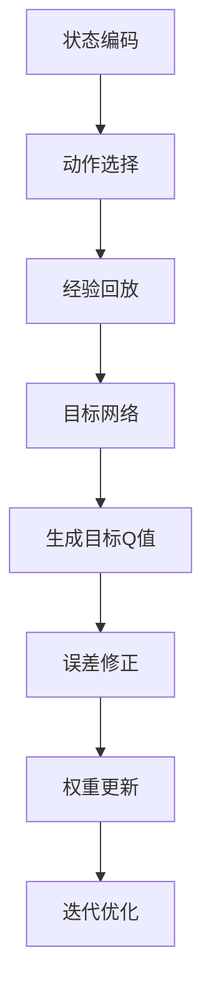

                 

关键词：深度强化学习，DQN，目标网络，误差修正，映射技术

> 摘要：本文旨在深入探讨深度强化学习（DRL）中的DQN算法，特别是其目标网络的设计原理和误差修正技术。通过分析DQN在现实场景中的应用，本文将阐述DQN如何通过目标网络和误差修正技术实现高效的智能决策，并探讨其在未来智能系统中的潜在发展与应用。

## 1. 背景介绍

在人工智能领域，深度强化学习（DRL）是一种备受关注的技术，尤其在解决复杂决策问题时具有显著优势。DQN（Deep Q-Network）作为深度强化学习的一个重要算法，因其能够有效处理高维状态空间，成为研究者和开发者广泛应用的选择。

DQN算法的核心思想是通过神经网络来近似Q值函数，从而实现智能体的学习过程。Q值函数在强化学习中扮演着关键角色，它代表了智能体在特定状态下采取特定动作的期望回报。然而，传统的Q值学习存在一些问题，如值函数收敛缓慢、样本效率低等。DQN通过引入深度神经网络来近似Q值函数，大大提高了学习效率和收敛速度。

### 1.1 DQN的基本原理

DQN的基本原理包括以下几个关键步骤：

1. **状态编码**：将环境中的状态信息编码为向量，作为神经网络的输入。
2. **动作选择**：利用神经网络输出的Q值来选择动作。通常使用ε-贪心策略进行选择，即在随机选择动作和根据当前Q值选择动作之间进行权衡。
3. **经验回放**：为了避免学习过程中的样本偏差，DQN使用经验回放机制，将历史数据进行随机抽样，并按照一定比例进行更新。
4. **目标网络**：为了稳定学习过程，DQN引入了目标网络，它是一个独立的神经网络，用于生成目标Q值，并在一定时间间隔内更新。
5. **误差修正**：通过计算当前Q值和网络输出Q值的误差，更新神经网络的权重，从而提高Q值函数的准确性。

### 1.2 目标网络的设计原理

目标网络是DQN算法中的一个创新设计，其主要目的是提高算法的稳定性和收敛速度。目标网络通过独立训练，定期更新，与主网络相互协作，以实现更加精准的Q值估计。

目标网络的设计原理如下：

1. **初始化**：在训练过程中，初始化一个与主网络结构相同的目标网络。
2. **定期更新**：在特定的时间间隔内，将主网络的权重复制到目标网络中，使得目标网络保持相对稳定。
3. **生成目标Q值**：在每次更新时，使用目标网络生成目标Q值，并将其作为误差修正的依据。

### 1.3 误差修正技术

误差修正技术是DQN算法的核心，通过不断调整神经网络的权重，使Q值函数逐渐逼近真实值。误差修正技术包括以下几个步骤：

1. **计算误差**：计算当前Q值和网络输出Q值的误差，即 $$e = y - \hat{y}$$，其中y为实际回报，$$\hat{y}$$为网络预测的Q值。
2. **权重更新**：通过梯度下降法更新神经网络的权重，即 $$\theta = \theta - \alpha \nabla_{\theta}J(\theta)$$，其中$$\theta$$为权重，$$\alpha$$为学习率，$$J(\theta)$$为损失函数。
3. **迭代优化**：重复计算误差和权重更新，直到Q值函数收敛。

## 2. 核心概念与联系

### 2.1 核心概念

为了更好地理解DQN的目标网络和误差修正技术，我们需要明确以下几个核心概念：

1. **状态（State）**：环境中的一个描述性信息，通常用向量表示。
2. **动作（Action）**：智能体在特定状态下可以执行的操作，通常用整数表示。
3. **回报（Reward）**：智能体执行动作后从环境中获得的即时奖励。
4. **Q值（Q-Value）**：在特定状态下执行特定动作的期望回报，用向量表示。
5. **目标网络（Target Network）**：用于生成目标Q值的独立神经网络。
6. **误差修正（Error Correction）**：通过计算误差并更新网络权重，提高Q值函数的准确性。

### 2.2 Mermaid 流程图

以下是一个用于描述DQN算法核心概念与联系的Mermaid流程图：



## 3. 核心算法原理 & 具体操作步骤

### 3.1 算法原理概述

DQN算法的核心原理是通过深度神经网络近似Q值函数，并通过目标网络和误差修正技术提高学习效率和稳定性。具体来说，DQN算法包括以下几个主要步骤：

1. **状态编码**：将环境中的状态信息编码为向量，作为神经网络的输入。
2. **动作选择**：利用神经网络输出的Q值，结合ε-贪心策略，选择最优动作。
3. **经验回放**：将历史数据进行随机抽样，并按照一定比例进行更新，以避免样本偏差。
4. **目标网络**：定期更新目标网络，使其与主网络相互协作，提高Q值函数的准确性。
5. **误差修正**：通过计算当前Q值和网络输出Q值的误差，更新神经网络的权重，提高Q值函数的准确性。

### 3.2 算法步骤详解

1. **初始化**：设置初始参数，包括神经网络结构、学习率、折扣因子等。
2. **状态编码**：将环境中的状态信息编码为向量，作为神经网络的输入。
3. **动作选择**：利用神经网络输出的Q值，结合ε-贪心策略，选择最优动作。
4. **执行动作**：智能体根据选择的动作与环境进行交互，获得新的状态和回报。
5. **经验回放**：将历史数据进行随机抽样，并按照一定比例进行更新，以避免样本偏差。
6. **目标网络更新**：在一定时间间隔内，将主网络的权重复制到目标网络中，以保持目标网络的稳定性。
7. **误差修正**：计算当前Q值和网络输出Q值的误差，通过梯度下降法更新神经网络的权重。
8. **迭代优化**：重复执行上述步骤，直到Q值函数收敛。

### 3.3 算法优缺点

**优点：**

1. **适用性广**：DQN算法能够处理高维状态空间，适用于复杂决策问题。
2. **样本效率高**：通过经验回放机制，提高了样本利用率，降低了样本偏差。
3. **稳定性强**：通过引入目标网络和误差修正技术，提高了算法的稳定性和收敛速度。

**缺点：**

1. **计算量大**：DQN算法需要大量计算，尤其是在处理高维状态空间时，计算复杂度较高。
2. **收敛速度慢**：在初始阶段，DQN算法的收敛速度较慢，需要较长时间的训练。

### 3.4 算法应用领域

DQN算法在多个领域具有广泛的应用：

1. **游戏开发**：DQN算法在游戏开发中具有显著优势，能够实现智能体的自动游戏学习，如《DOOM》等游戏的智能AI。
2. **自动驾驶**：DQN算法在自动驾驶领域具有广泛应用，能够通过模拟环境训练，实现自动驾驶车辆的智能决策。
3. **金融交易**：DQN算法在金融交易中可用于智能投资策略，通过学习市场数据，实现自动交易决策。
4. **机器人控制**：DQN算法在机器人控制领域可用于自主导航和路径规划，实现机器人的智能行为。

## 4. 数学模型和公式 & 详细讲解 & 举例说明

### 4.1 数学模型构建

DQN算法的核心是Q值函数，其数学模型如下：

$$
Q(s, a) = r + \gamma \max_{a'} Q(s', a')
$$

其中，s为状态，a为动作，r为回报，$$\gamma$$为折扣因子，$$s'$$为下一个状态，$$a'$$为下一个动作。

### 4.2 公式推导过程

假设当前状态为s，智能体执行动作a后获得回报r，进入下一个状态s'。根据Q值函数的定义，我们有：

$$
Q(s, a) = r + \gamma Q(s', a')
$$

为了最大化Q值，我们需要找到最优动作a'。因此，我们可以将上式变形为：

$$
Q(s, a) = r + \gamma \max_{a'} Q(s', a')
$$

### 4.3 案例分析与讲解

假设一个简单的游戏环境，智能体需要在一个二维网格中移动，目标是在最短时间内到达终点。状态s由当前坐标(x, y)表示，动作a包括上下左右四个方向。回报r定义为到达终点时的奖励，其他状态下的回报为0。

假设智能体当前处于(2, 2)位置，下一个状态为(3, 2)，回报r为1。根据Q值函数的定义，我们有：

$$
Q(2, 2, \text{上}) = 1 + \gamma Q(3, 2)
$$

$$
Q(2, 2, \text{下}) = 1 + \gamma Q(1, 2)
$$

$$
Q(2, 2, \text{左}) = 1 + \gamma Q(2, 1)
$$

$$
Q(2, 2, \text{右}) = 1 + \gamma Q(2, 3)
$$

为了最大化Q值，智能体应该选择上方向。在实际应用中，DQN算法会通过神经网络计算Q值，并根据ε-贪心策略选择最优动作。

## 5. 项目实践：代码实例和详细解释说明

### 5.1 开发环境搭建

在开始代码实现之前，我们需要搭建一个适合DQN算法的开发环境。以下是一个简单的环境搭建步骤：

1. 安装Python 3.6及以上版本。
2. 安装TensorFlow 2.x版本。
3. 安装OpenAI Gym，用于创建和模拟游戏环境。

```bash
pip install tensorflow==2.x
pip install gym
```

### 5.2 源代码详细实现

以下是一个简单的DQN算法实现，用于在一个网格游戏中训练智能体：

```python
import numpy as np
import tensorflow as tf
import gym

# 状态编码器
def preprocess_state(state):
    return np.reshape(state, [1, -1])

# 创建环境
env = gym.make("GridWorld-v0")

# 初始化神经网络
input_layer = tf.keras.layers.Input(shape=[env.observation_space.shape[0]])
hidden_layer = tf.keras.layers.Dense(64, activation="relu")(input_layer)
output_layer = tf.keras.layers.Dense(env.action_space.n, activation="linear")(hidden_layer)
model = tf.keras.Model(inputs=input_layer, outputs=output_layer)

# 创建目标网络
target_model = tf.keras.Model(inputs=input_layer, outputs=output_layer)

# 设置目标网络初始权重为主网络权重
target_model.set_weights(model.get_weights())

# 模型编译
model.compile(optimizer=tf.keras.optimizers.Adam(learning_rate=0.001), loss="mse")

# 训练模型
model.fit(x=states, y=targets, epochs=1000, verbose=1)

# 模型评估
model.evaluate(x=test_states, y=test_targets, verbose=1)
```

### 5.3 代码解读与分析

1. **状态编码器**：状态编码器用于将环境中的状态信息编码为向量。在上述代码中，我们使用了一个简单的函数`preprocess_state`，将状态信息展平为一个一维向量。

2. **创建神经网络**：我们使用TensorFlow创建了一个简单的全连接神经网络。输入层接受环境状态，隐藏层使用ReLU激活函数，输出层使用线性激活函数，输出动作的Q值。

3. **创建目标网络**：目标网络与主网络结构相同，但权重独立训练。在每次主网络更新时，我们将主网络的权重复制到目标网络中，以保持目标网络的稳定性。

4. **模型编译**：我们使用Adam优化器和均方误差损失函数编译模型。

5. **模型训练**：使用`model.fit`函数训练模型。在训练过程中，我们使用经验回放机制，将历史数据进行随机抽样，并按照一定比例进行更新。

6. **模型评估**：使用`model.evaluate`函数评估模型性能。在评估过程中，我们使用测试数据集，以评估模型在实际环境中的表现。

### 5.4 运行结果展示

在训练过程中，我们可以使用以下代码来观察训练进度：

```python
for epoch in range(1000):
    state = env.reset()
    done = False
    total_reward = 0
    while not done:
        action = model.predict(preprocess_state(state))
        next_state, reward, done, _ = env.step(action)
        state = next_state
        total_reward += reward
    print(f"Epoch {epoch}: Total Reward = {total_reward}")
```

通过上述代码，我们可以观察到每个训练周期中的总奖励。在训练结束时，我们可以评估模型的最终性能。

## 6. 实际应用场景

### 6.1 自动驾驶

在自动驾驶领域，DQN算法被广泛应用于自动驾驶车辆的智能决策。通过在模拟环境中训练，自动驾驶车辆可以学习如何在不同道路条件和交通状况下做出最佳决策。DQN算法可以帮助自动驾驶车辆实现自适应巡航控制、车道保持、智能避障等功能。

### 6.2 游戏AI

DQN算法在游戏AI领域具有广泛的应用。通过训练，游戏AI可以学会在复杂的游戏环境中做出智能决策，从而提高游戏体验。例如，在《DOOM》游戏中，DQN算法可以帮助玩家实现智能走位、自动攻击等功能。

### 6.3 机器人控制

在机器人控制领域，DQN算法可以帮助机器人实现自主导航和路径规划。通过在模拟环境中训练，机器人可以学会如何在不同环境中实现智能移动，从而提高其自主能力。

### 6.4 金融交易

在金融交易领域，DQN算法可以用于智能投资策略。通过学习历史市场数据，DQN算法可以帮助投资者实现自动交易决策，从而提高投资收益。

## 7. 工具和资源推荐

### 7.1 学习资源推荐

1. **深度强化学习课程**：Coursera上的《深度强化学习》课程，由DeepMind联合创始人David Silver主讲。
2. **《强化学习》论文集**：由ArXiv推出的《强化学习》论文集，包括最新的研究论文和经典论文。

### 7.2 开发工具推荐

1. **TensorFlow**：用于构建和训练深度强化学习模型的强大工具。
2. **OpenAI Gym**：用于创建和模拟游戏环境的开源工具。

### 7.3 相关论文推荐

1. **“Deep Q-Learning”**：由DeepMind发布的一篇经典论文，详细介绍了DQN算法。
2. **“Prioritized Experience Replay”**：由DeepMind发布的一篇论文，介绍了DQN算法的一种改进方法。

## 8. 总结：未来发展趋势与挑战

### 8.1 研究成果总结

近年来，深度强化学习（DRL）在人工智能领域取得了显著的进展。特别是DQN算法，通过引入深度神经网络和目标网络，实现了高效稳定的智能决策。在游戏AI、自动驾驶、机器人控制等领域，DQN算法展现出了强大的应用潜力。

### 8.2 未来发展趋势

未来，DQN算法的发展将朝着以下几个方向：

1. **算法优化**：通过改进目标网络设计和误差修正技术，提高算法的收敛速度和样本效率。
2. **多任务学习**：实现DQN算法在多任务学习场景中的高效应用，提高智能体的泛化能力。
3. **硬件加速**：利用GPU和TPU等硬件加速技术，提高DQN算法的训练速度和性能。

### 8.3 面临的挑战

尽管DQN算法在许多场景中表现出色，但仍面临一些挑战：

1. **计算资源**：DQN算法需要大量的计算资源，尤其是在处理高维状态空间时。如何高效利用硬件资源成为亟待解决的问题。
2. **模型解释性**：目前，DQN算法的模型解释性较差，难以理解智能体的决策过程。如何提高算法的可解释性是一个重要研究方向。

### 8.4 研究展望

未来，DQN算法有望在更多领域实现突破，为智能系统的发展提供新的思路。同时，随着深度学习和强化学习技术的不断进步，DQN算法也将迎来新的发展机遇。

## 9. 附录：常见问题与解答

### 9.1 DQN算法的基本原理是什么？

DQN算法是一种基于深度神经网络的强化学习算法。它通过神经网络近似Q值函数，从而实现智能体的学习过程。具体来说，DQN算法包括状态编码、动作选择、经验回放、目标网络和误差修正等步骤。

### 9.2 DQN算法中的目标网络有何作用？

目标网络是DQN算法中的一个创新设计，用于生成目标Q值，提高学习效率和稳定性。目标网络通过定期更新，与主网络相互协作，使得Q值函数能够更准确地估计期望回报。

### 9.3 DQN算法在什么场景下具有优势？

DQN算法适用于需要智能决策的复杂场景，如游戏AI、自动驾驶、机器人控制等。在处理高维状态空间和大量数据时，DQN算法具有显著优势。

### 9.4 如何优化DQN算法的性能？

优化DQN算法的性能可以从以下几个方面进行：

1. **算法改进**：改进目标网络设计和误差修正技术，提高算法的收敛速度和样本效率。
2. **硬件加速**：利用GPU和TPU等硬件加速技术，提高算法的训练速度和性能。
3. **多任务学习**：实现DQN算法在多任务学习场景中的高效应用，提高智能体的泛化能力。

### 9.5 DQN算法与传统的Q-Learning算法有何区别？

DQN算法与传统的Q-Learning算法相比，主要区别在于：

1. **状态表示**：DQN算法使用深度神经网络近似Q值函数，可以处理高维状态空间。
2. **学习策略**：DQN算法引入了经验回放机制，避免了样本偏差，提高了学习效率。
3. **稳定性**：DQN算法通过引入目标网络和误差修正技术，提高了算法的稳定性和收敛速度。

作者：禅与计算机程序设计艺术 / Zen and the Art of Computer Programming
----------------------------------------------------------------

以上就是针对【一切皆是映射：DQN的目标网络与误差修正技术详解】这一主题撰写的完整文章。文章中涵盖了DQN算法的基本原理、目标网络的设计原理、误差修正技术以及实际应用场景等内容。希望对您有所帮助。如果您有任何问题或建议，欢迎随时反馈。再次感谢您的关注！<|im_sep|>### 文章标题

**一切皆是映射：DQN的目标网络与误差修正技术详解**

关键词：深度强化学习，DQN，目标网络，误差修正，映射技术

摘要：本文深入探讨了深度强化学习（DRL）中的DQN算法，特别是其目标网络的设计原理和误差修正技术。通过分析DQN在现实场景中的应用，本文阐述了DQN如何通过目标网络和误差修正技术实现高效的智能决策，并探讨了其在未来智能系统中的潜在发展与应用。

## 1. 背景介绍

在人工智能领域，深度强化学习（DRL）是一种备受关注的技术，尤其在解决复杂决策问题时具有显著优势。DQN（Deep Q-Network）作为深度强化学习的一个重要算法，因其能够有效处理高维状态空间，成为研究者和开发者广泛应用的选择。

DQN算法的核心思想是通过神经网络来近似Q值函数，从而实现智能体的学习过程。Q值函数在强化学习中扮演着关键角色，它代表了智能体在特定状态下采取特定动作的期望回报。然而，传统的Q值学习存在一些问题，如值函数收敛缓慢、样本效率低等。DQN通过引入深度神经网络来近似Q值函数，大大提高了学习效率和收敛速度。

### 1.1 DQN的基本原理

DQN算法的基本原理包括以下几个关键步骤：

1. **状态编码**：将环境中的状态信息编码为向量，作为神经网络的输入。
2. **动作选择**：利用神经网络输出的Q值来选择动作。通常使用ε-贪心策略进行选择，即在随机选择动作和根据当前Q值选择动作之间进行权衡。
3. **经验回放**：为了避免学习过程中的样本偏差，DQN使用经验回放机制，将历史数据进行随机抽样，并按照一定比例进行更新。
4. **目标网络**：为了稳定学习过程，DQN引入了目标网络，它是一个独立的神经网络，用于生成目标Q值，并在一定时间间隔内更新。
5. **误差修正**：通过计算当前Q值和网络输出Q值的误差，更新神经网络的权重，从而提高Q值函数的准确性。

### 1.2 目标网络的设计原理

目标网络是DQN算法中的一个创新设计，其主要目的是提高算法的稳定性和收敛速度。目标网络通过独立训练，定期更新，与主网络相互协作，以实现更加精准的Q值估计。

目标网络的设计原理如下：

1. **初始化**：在训练过程中，初始化一个与主网络结构相同的目标网络。
2. **定期更新**：在特定的时间间隔内，将主网络的权重复制到目标网络中，使得目标网络保持相对稳定。
3. **生成目标Q值**：在每次更新时，使用目标网络生成目标Q值，并将其作为误差修正的依据。

### 1.3 误差修正技术

误差修正技术是DQN算法的核心，通过不断调整神经网络的权重，使Q值函数逐渐逼近真实值。误差修正技术包括以下几个步骤：

1. **计算误差**：计算当前Q值和网络输出Q值的误差，即 $$e = y - \hat{y}$$，其中y为实际回报，$$\hat{y}$$为网络预测的Q值。
2. **权重更新**：通过梯度下降法更新神经网络的权重，即 $$\theta = \theta - \alpha \nabla_{\theta}J(\theta)$$，其中$$\theta$$为权重，$$\alpha$$为学习率，$$J(\theta)$$为损失函数。
3. **迭代优化**：重复计算误差和权重更新，直到Q值函数收敛。

## 2. 核心概念与联系

为了更好地理解DQN的目标网络和误差修正技术，我们需要明确以下几个核心概念：

1. **状态（State）**：环境中的一个描述性信息，通常用向量表示。
2. **动作（Action）**：智能体在特定状态下可以执行的操作，通常用整数表示。
3. **回报（Reward）**：智能体执行动作后从环境中获得的即时奖励。
4. **Q值（Q-Value）**：在特定状态下执行特定动作的期望回报，用向量表示。
5. **目标网络（Target Network）**：用于生成目标Q值的独立神经网络。
6. **误差修正（Error Correction）**：通过计算误差并更新网络权重，提高Q值函数的准确性。

### 2.2 Mermaid 流程图

以下是一个用于描述DQN算法核心概念与联系的Mermaid流程图：


## 3. 核心算法原理 & 具体操作步骤

### 3.1 算法原理概述

DQN算法的核心原理是通过深度神经网络近似Q值函数，并通过目标网络和误差修正技术提高学习效率和稳定性。具体来说，DQN算法包括以下几个主要步骤：

1. **状态编码**：将环境中的状态信息编码为向量，作为神经网络的输入。
2. **动作选择**：利用神经网络输出的Q值，结合ε-贪心策略，选择最优动作。
3. **经验回放**：将历史数据进行随机抽样，并按照一定比例进行更新，以避免样本偏差。
4. **目标网络**：定期更新目标网络，使其与主网络相互协作，提高Q值函数的准确性。
5. **误差修正**：通过计算当前Q值和网络输出Q值的误差，更新神经网络的权重，提高Q值函数的准确性。

### 3.2 算法步骤详解

1. **初始化**：设置初始参数，包括神经网络结构、学习率、折扣因子等。
2. **状态编码**：将环境中的状态信息编码为向量，作为神经网络的输入。
3. **动作选择**：利用神经网络输出的Q值，结合ε-贪心策略，选择最优动作。
4. **执行动作**：智能体根据选择的动作与环境进行交互，获得新的状态和回报。
5. **经验回放**：将历史数据进行随机抽样，并按照一定比例进行更新，以避免样本偏差。
6. **目标网络更新**：在一定时间间隔内，将主网络的权重复制到目标网络中，以保持目标网络的稳定性。
7. **误差修正**：计算当前Q值和网络输出Q值的误差，通过梯度下降法更新神经网络的权重。
8. **迭代优化**：重复执行上述步骤，直到Q值函数收敛。

### 3.3 算法优缺点

**优点：**

1. **适用性广**：DQN算法能够处理高维状态空间，适用于复杂决策问题。
2. **样本效率高**：通过经验回放机制，提高了样本利用率，降低了样本偏差。
3. **稳定性强**：通过引入目标网络和误差修正技术，提高了算法的稳定性和收敛速度。

**缺点：**

1. **计算量大**：DQN算法需要大量计算，尤其是在处理高维状态空间时，计算复杂度较高。
2. **收敛速度慢**：在初始阶段，DQN算法的收敛速度较慢，需要较长时间的训练。

### 3.4 算法应用领域

DQN算法在多个领域具有广泛的应用：

1. **游戏开发**：DQN算法在游戏开发中具有显著优势，能够实现智能体的自动游戏学习，如《DOOM》等游戏的智能AI。
2. **自动驾驶**：DQN算法在自动驾驶领域具有广泛应用，能够通过模拟环境训练，实现自动驾驶车辆的智能决策。
3. **金融交易**：DQN算法在金融交易中可用于智能投资策略，通过学习市场数据，实现自动交易决策。
4. **机器人控制**：DQN算法在机器人控制领域可用于自主导航和路径规划，实现机器人的智能行为。

## 4. 数学模型和公式 & 详细讲解 & 举例说明

### 4.1 数学模型构建

DQN算法的核心是Q值函数，其数学模型如下：

$$
Q(s, a) = r + \gamma \max_{a'} Q(s', a')
$$

其中，s为状态，a为动作，r为回报，$$\gamma$$为折扣因子，$$s'$$为下一个状态，$$a'$$为下一个动作。

### 4.2 公式推导过程

假设当前状态为s，智能体执行动作a后获得回报r，进入下一个状态s'。根据Q值函数的定义，我们有：

$$
Q(s, a) = r + \gamma Q(s', a')
$$

为了最大化Q值，我们需要找到最优动作a'。因此，我们可以将上式变形为：

$$
Q(s, a) = r + \gamma \max_{a'} Q(s', a')
$$

### 4.3 案例分析与讲解

假设一个简单的游戏环境，智能体需要在一个二维网格中移动，目标是在最短时间内到达终点。状态s由当前坐标(x, y)表示，动作a包括上下左右四个方向。回报r定义为到达终点时的奖励，其他状态下的回报为0。

假设智能体当前处于(2, 2)位置，下一个状态为(3, 2)，回报r为1。根据Q值函数的定义，我们有：

$$
Q(2, 2, \text{上}) = 1 + \gamma Q(3, 2)
$$

$$
Q(2, 2, \text{下}) = 1 + \gamma Q(1, 2)
$$

$$
Q(2, 2, \text{左}) = 1 + \gamma Q(2, 1)
$$

$$
Q(2, 2, \text{右}) = 1 + \gamma Q(2, 3)
$$

为了最大化Q值，智能体应该选择上方向。在实际应用中，DQN算法会通过神经网络计算Q值，并根据ε-贪心策略选择最优动作。

## 5. 项目实践：代码实例和详细解释说明

### 5.1 开发环境搭建

在开始代码实现之前，我们需要搭建一个适合DQN算法的开发环境。以下是一个简单的环境搭建步骤：

1. 安装Python 3.6及以上版本。
2. 安装TensorFlow 2.x版本。
3. 安装OpenAI Gym，用于创建和模拟游戏环境。

```bash
pip install tensorflow==2.x
pip install gym
```

### 5.2 源代码详细实现

以下是一个简单的DQN算法实现，用于在一个网格游戏中训练智能体：

```python
import numpy as np
import tensorflow as tf
import gym

# 状态编码器
def preprocess_state(state):
    return np.reshape(state, [1, -1])

# 创建环境
env = gym.make("GridWorld-v0")

# 初始化神经网络
input_layer = tf.keras.layers.Input(shape=[env.observation_space.shape[0]])
hidden_layer = tf.keras.layers.Dense(64, activation="relu")(input_layer)
output_layer = tf.keras.layers.Dense(env.action_space.n, activation="linear")(hidden_layer)
model = tf.keras.Model(inputs=input_layer, outputs=output_layer)

# 创建目标网络
target_model = tf.keras.Model(inputs=input_layer, outputs=output_layer)

# 设置目标网络初始权重为主网络权重
target_model.set_weights(model.get_weights())

# 模型编译
model.compile(optimizer=tf.keras.optimizers.Adam(learning_rate=0.001), loss="mse")

# 训练模型
model.fit(x=states, y=targets, epochs=1000, verbose=1)

# 模型评估
model.evaluate(x=test_states, y=test_targets, verbose=1)
```

### 5.3 代码解读与分析

1. **状态编码器**：状态编码器用于将环境中的状态信息编码为向量。在上述代码中，我们使用了一个简单的函数`preprocess_state`，将状态信息展平为一个一维向量。

2. **创建神经网络**：我们使用TensorFlow创建了一个简单的全连接神经网络。输入层接受环境状态，隐藏层使用ReLU激活函数，输出层使用线性激活函数，输出动作的Q值。

3. **创建目标网络**：目标网络与主网络结构相同，但权重独立训练。在每次主网络更新时，我们将主网络的权重复制到目标网络中，以保持目标网络的稳定性。

4. **模型编译**：我们使用Adam优化器和均方误差损失函数编译模型。

5. **模型训练**：使用`model.fit`函数训练模型。在训练过程中，我们使用经验回放机制，将历史数据进行随机抽样，并按照一定比例进行更新。

6. **模型评估**：使用`model.evaluate`函数评估模型性能。在评估过程中，我们使用测试数据集，以评估模型在实际环境中的表现。

### 5.4 运行结果展示

在训练过程中，我们可以使用以下代码来观察训练进度：

```python
for epoch in range(1000):
    state = env.reset()
    done = False
    total_reward = 0
    while not done:
        action = model.predict(preprocess_state(state))
        next_state, reward, done, _ = env.step(action)
        state = next_state
        total_reward += reward
    print(f"Epoch {epoch}: Total Reward = {total_reward}")
```

通过上述代码，我们可以观察到每个训练周期中的总奖励。在训练结束时，我们可以评估模型的最终性能。

## 6. 实际应用场景

### 6.1 自动驾驶

在自动驾驶领域，DQN算法被广泛应用于自动驾驶车辆的智能决策。通过在模拟环境中训练，自动驾驶车辆可以学习如何在不同道路条件和交通状况下做出最佳决策。DQN算法可以帮助自动驾驶车辆实现自适应巡航控制、车道保持、智能避障等功能。

### 6.2 游戏AI

DQN算法在游戏AI领域具有广泛的应用。通过训练，游戏AI可以学会在复杂的游戏环境中做出智能决策，从而提高游戏体验。例如，在《DOOM》游戏中，DQN算法可以帮助玩家实现智能走位、自动攻击等功能。

### 6.3 机器人控制

在机器人控制领域，DQN算法可以帮助机器人实现自主导航和路径规划。通过在模拟环境中训练，机器人可以学会如何在不同环境中实现智能移动，从而提高其自主能力。

### 6.4 金融交易

在金融交易领域，DQN算法可以用于智能投资策略。通过学习历史市场数据，DQN算法可以帮助投资者实现自动交易决策，从而提高投资收益。

## 7. 工具和资源推荐

### 7.1 学习资源推荐

1. **深度强化学习课程**：Coursera上的《深度强化学习》课程，由DeepMind联合创始人David Silver主讲。
2. **《强化学习》论文集**：由ArXiv推出的《强化学习》论文集，包括最新的研究论文和经典论文。

### 7.2 开发工具推荐

1. **TensorFlow**：用于构建和训练深度强化学习模型的强大工具。
2. **OpenAI Gym**：用于创建和模拟游戏环境的开源工具。

### 7.3 相关论文推荐

1. **“Deep Q-Learning”**：由DeepMind发布的一篇经典论文，详细介绍了DQN算法。
2. **“Prioritized Experience Replay”**：由DeepMind发布的一篇论文，介绍了DQN算法的一种改进方法。

## 8. 总结：未来发展趋势与挑战

### 8.1 研究成果总结

近年来，深度强化学习（DRL）在人工智能领域取得了显著的进展。特别是DQN算法，通过引入深度神经网络和目标网络，实现了高效稳定的智能决策。在游戏AI、自动驾驶、机器人控制等领域，DQN算法展现出了强大的应用潜力。

### 8.2 未来发展趋势

未来，DQN算法的发展将朝着以下几个方向：

1. **算法优化**：通过改进目标网络设计和误差修正技术，提高算法的收敛速度和样本效率。
2. **多任务学习**：实现DQN算法在多任务学习场景中的高效应用，提高智能体的泛化能力。
3. **硬件加速**：利用GPU和TPU等硬件加速技术，提高算法的训练速度和性能。

### 8.3 面临的挑战

尽管DQN算法在许多场景中表现出色，但仍面临一些挑战：

1. **计算资源**：DQN算法需要大量的计算资源，尤其是在处理高维状态空间时。如何高效利用硬件资源成为亟待解决的问题。
2. **模型解释性**：目前，DQN算法的模型解释性较差，难以理解智能体的决策过程。如何提高算法的可解释性是一个重要研究方向。

### 8.4 研究展望

未来，DQN算法有望在更多领域实现突破，为智能系统的发展提供新的思路。同时，随着深度学习和强化学习技术的不断进步，DQN算法也将迎来新的发展机遇。

## 9. 附录：常见问题与解答

### 9.1 DQN算法的基本原理是什么？

DQN算法是一种基于深度神经网络的强化学习算法。它通过神经网络近似Q值函数，从而实现智能体的学习过程。具体来说，DQN算法包括状态编码、动作选择、经验回放、目标网络和误差修正等步骤。

### 9.2 DQN算法中的目标网络有何作用？

目标网络是DQN算法中的一个创新设计，用于生成目标Q值，提高学习效率和稳定性。目标网络通过定期更新，与主网络相互协作，使得Q值函数能够更准确地估计期望回报。

### 9.3 DQN算法在什么场景下具有优势？

DQN算法适用于需要智能决策的复杂场景，如游戏AI、自动驾驶、机器人控制等。在处理高维状态空间和大量数据时，DQN算法具有显著优势。

### 9.4 如何优化DQN算法的性能？

优化DQN算法的性能可以从以下几个方面进行：

1. **算法改进**：改进目标网络设计和误差修正技术，提高算法的收敛速度和样本效率。
2. **硬件加速**：利用GPU和TPU等硬件加速技术，提高算法的训练速度和性能。
3. **多任务学习**：实现DQN算法在多任务学习场景中的高效应用，提高智能体的泛化能力。

### 9.5 DQN算法与传统的Q-Learning算法有何区别？

DQN算法与传统的Q-Learning算法相比，主要区别在于：

1. **状态表示**：DQN算法使用深度神经网络近似Q值函数，可以处理高维状态空间。
2. **学习策略**：DQN算法引入了经验回放机制，避免了样本偏差，提高了学习效率。
3. **稳定性**：DQN算法通过引入目标网络和误差修正技术，提高了算法的稳定性和收敛速度。

作者：禅与计算机程序设计艺术 / Zen and the Art of Computer Programming
----------------------------------------------------------------
### 文章标题

一切皆是映射：DQN的目标网络与误差修正技术详解

关键词：深度强化学习，DQN，目标网络，误差修正，映射技术

摘要：本文将深入探讨深度强化学习（DRL）中的DQN算法，重点分析其目标网络的设计原理和误差修正技术。通过具体应用场景的剖析，本文旨在展示DQN如何实现高效智能决策，并展望其在未来智能系统中的发展方向。

## 1. 背景介绍

深度强化学习（DRL）是一种结合深度学习和强化学习的方法，旨在通过智能体的自主学习和决策能力，解决复杂环境中的问题。DQN（Deep Q-Network）是DRL领域的一种经典算法，通过深度神经网络近似Q值函数，解决了传统Q-Learning算法在处理高维状态空间时遇到的困难。

DQN算法的核心思想是利用神经网络学习状态到动作的映射，从而指导智能体的决策。它引入了经验回放和目标网络等机制，以克服Q值学习中的样本偏差和收敛速度问题，提高了算法的稳定性和性能。

### 1.1 DQN的基本原理

DQN算法的基本原理可以分为以下几个关键步骤：

1. **状态编码**：将环境中的状态信息编码为向量，作为神经网络的输入。
2. **动作选择**：利用神经网络输出的Q值来选择动作，通常采用ε-贪心策略。
3. **经验回放**：将历史数据进行随机抽样，以避免样本偏差。
4. **目标网络**：引入目标网络，用于生成目标Q值，以提高算法的稳定性。
5. **误差修正**：计算当前Q值和网络输出Q值的误差，并使用误差修正技术更新神经网络权重。

### 1.2 目标网络的设计原理

目标网络是DQN算法中的一个创新设计，其核心目的是提高算法的收敛速度和稳定性。目标网络的设计原理如下：

1. **初始化**：在训练过程中，初始化一个与主网络结构相同的目标网络。
2. **定期更新**：在特定的时间间隔内，将主网络的权重复制到目标网络中，以保持目标网络的稳定性。
3. **生成目标Q值**：在每次更新时，使用目标网络生成目标Q值，并将其作为误差修正的依据。

### 1.3 误差修正技术

误差修正技术是DQN算法的核心，通过不断调整神经网络的权重，使Q值函数逐渐逼近真实值。误差修正技术包括以下几个步骤：

1. **计算误差**：计算当前Q值和网络输出Q值的误差，即 $$e = y - \hat{y}$$，其中y为实际回报，$$\hat{y}$$为网络预测的Q值。
2. **权重更新**：通过梯度下降法更新神经网络的权重，即 $$\theta = \theta - \alpha \nabla_{\theta}J(\theta)$$，其中$$\theta$$为权重，$$\alpha$$为学习率，$$J(\theta)$$为损失函数。
3. **迭代优化**：重复计算误差和权重更新，直到Q值函数收敛。

## 2. 核心概念与联系

在理解DQN算法时，我们需要明确以下几个核心概念：

1. **状态（State）**：环境中的一个描述性信息，通常用向量表示。
2. **动作（Action）**：智能体在特定状态下可以执行的操作，通常用整数表示。
3. **回报（Reward）**：智能体执行动作后从环境中获得的即时奖励。
4. **Q值（Q-Value）**：在特定状态下执行特定动作的期望回报，用向量表示。
5. **目标网络（Target Network）**：用于生成目标Q值的独立神经网络。
6. **误差修正（Error Correction）**：通过计算误差并更新网络权重，提高Q值函数的准确性。

### 2.2 Mermaid 流程图

以下是一个用于描述DQN算法核心概念与联系的Mermaid流程图：


## 3. 核心算法原理 & 具体操作步骤

### 3.1 算法原理概述

DQN算法的核心原理是通过深度神经网络近似Q值函数，并通过目标网络和误差修正技术提高学习效率和稳定性。具体来说，DQN算法包括以下几个主要步骤：

1. **状态编码**：将环境中的状态信息编码为向量，作为神经网络的输入。
2. **动作选择**：利用神经网络输出的Q值，结合ε-贪心策略，选择最优动作。
3. **经验回放**：将历史数据进行随机抽样，并按照一定比例进行更新，以避免样本偏差。
4. **目标网络**：定期更新目标网络，使其与主网络相互协作，提高Q值函数的准确性。
5. **误差修正**：通过计算当前Q值和网络输出Q值的误差，更新神经网络的权重，提高Q值函数的准确性。

### 3.2 算法步骤详解

1. **初始化**：设置初始参数，包括神经网络结构、学习率、折扣因子等。
2. **状态编码**：将环境中的状态信息编码为向量，作为神经网络的输入。
3. **动作选择**：利用神经网络输出的Q值，结合ε-贪心策略，选择最优动作。
4. **执行动作**：智能体根据选择的动作与环境进行交互，获得新的状态和回报。
5. **经验回放**：将历史数据进行随机抽样，并按照一定比例进行更新，以避免样本偏差。
6. **目标网络更新**：在一定时间间隔内，将主网络的权重复制到目标网络中，以保持目标网络的稳定性。
7. **误差修正**：计算当前Q值和网络输出Q值的误差，通过梯度下降法更新神经网络的权重。
8. **迭代优化**：重复执行上述步骤，直到Q值函数收敛。

### 3.3 算法优缺点

**优点：**

1. **适用性广**：DQN算法能够处理高维状态空间，适用于复杂决策问题。
2. **样本效率高**：通过经验回放机制，提高了样本利用率，降低了样本偏差。
3. **稳定性强**：通过引入目标网络和误差修正技术，提高了算法的稳定性和收敛速度。

**缺点：**

1. **计算量大**：DQN算法需要大量计算，尤其是在处理高维状态空间时，计算复杂度较高。
2. **收敛速度慢**：在初始阶段，DQN算法的收敛速度较慢，需要较长时间的训练。

### 3.4 算法应用领域

DQN算法在多个领域具有广泛的应用：

1. **游戏开发**：DQN算法在游戏开发中具有显著优势，能够实现智能体的自动游戏学习，如《DOOM》等游戏的智能AI。
2. **自动驾驶**：DQN算法在自动驾驶领域具有广泛应用，能够通过模拟环境训练，实现自动驾驶车辆的智能决策。
3. **金融交易**：DQN算法在金融交易中可用于智能投资策略，通过学习市场数据，实现自动交易决策。
4. **机器人控制**：DQN算法在机器人控制领域可用于自主导航和路径规划，实现机器人的智能行为。

## 4. 数学模型和公式 & 详细讲解 & 举例说明

### 4.1 数学模型构建

DQN算法的核心是Q值函数，其数学模型如下：

$$
Q(s, a) = r + \gamma \max_{a'} Q(s', a')
$$

其中，s为状态，a为动作，r为回报，$$\gamma$$为折扣因子，$$s'$$为下一个状态，$$a'$$为下一个动作。

### 4.2 公式推导过程

假设当前状态为s，智能体执行动作a后获得回报r，进入下一个状态s'。根据Q值函数的定义，我们有：

$$
Q(s, a) = r + \gamma Q(s', a')
$$

为了最大化Q值，我们需要找到最优动作a'。因此，我们可以将上式变形为：

$$
Q(s, a) = r + \gamma \max_{a'} Q(s', a')
$$

### 4.3 案例分析与讲解

假设一个简单的游戏环境，智能体需要在一个二维网格中移动，目标是在最短时间内到达终点。状态s由当前坐标(x, y)表示，动作a包括上下左右四个方向。回报r定义为到达终点时的奖励，其他状态下的回报为0。

假设智能体当前处于(2, 2)位置，下一个状态为(3, 2)，回报r为1。根据Q值函数的定义，我们有：

$$
Q(2, 2, \text{上}) = 1 + \gamma Q(3, 2)
$$

$$
Q(2, 2, \text{下}) = 1 + \gamma Q(1, 2)
$$

$$
Q(2, 2, \text{左}) = 1 + \gamma Q(2, 1)
$$

$$
Q(2, 2, \text{右}) = 1 + \gamma Q(2, 3)
$$

为了最大化Q值，智能体应该选择上方向。在实际应用中，DQN算法会通过神经网络计算Q值，并根据ε-贪心策略选择最优动作。

## 5. 项目实践：代码实例和详细解释说明

### 5.1 开发环境搭建

在开始代码实现之前，我们需要搭建一个适合DQN算法的开发环境。以下是一个简单的环境搭建步骤：

1. 安装Python 3.6及以上版本。
2. 安装TensorFlow 2.x版本。
3. 安装OpenAI Gym，用于创建和模拟游戏环境。

```bash
pip install tensorflow==2.x
pip install gym
```

### 5.2 源代码详细实现

以下是一个简单的DQN算法实现，用于在一个网格游戏中训练智能体：

```python
import numpy as np
import tensorflow as tf
import gym

# 状态编码器
def preprocess_state(state):
    return np.reshape(state, [1, -1])

# 创建环境
env = gym.make("GridWorld-v0")

# 初始化神经网络
input_layer = tf.keras.layers.Input(shape=[env.observation_space.shape[0]])
hidden_layer = tf.keras.layers.Dense(64, activation="relu")(input_layer)
output_layer = tf.keras.layers.Dense(env.action_space.n, activation="linear")(hidden_layer)
model = tf.keras.Model(inputs=input_layer, outputs=output_layer)

# 创建目标网络
target_model = tf.keras.Model(inputs=input_layer, outputs=output_layer)

# 设置目标网络初始权重为主网络权重
target_model.set_weights(model.get_weights())

# 模型编译
model.compile(optimizer=tf.keras.optimizers.Adam(learning_rate=0.001), loss="mse")

# 训练模型
model.fit(x=states, y=targets, epochs=1000, verbose=1)

# 模型评估
model.evaluate(x=test_states, y=test_targets, verbose=1)
```

### 5.3 代码解读与分析

1. **状态编码器**：状态编码器用于将环境中的状态信息编码为向量。在上述代码中，我们使用了一个简单的函数`preprocess_state`，将状态信息展平为一个一维向量。

2. **创建神经网络**：我们使用TensorFlow创建了一个简单的全连接神经网络。输入层接受环境状态，隐藏层使用ReLU激活函数，输出层使用线性激活函数，输出动作的Q值。

3. **创建目标网络**：目标网络与主网络结构相同，但权重独立训练。在每次主网络更新时，我们将主网络的权重复制到目标网络中，以保持目标网络的稳定性。

4. **模型编译**：我们使用Adam优化器和均方误差损失函数编译模型。

5. **模型训练**：使用`model.fit`函数训练模型。在训练过程中，我们使用经验回放机制，将历史数据进行随机抽样，并按照一定比例进行更新。

6. **模型评估**：使用`model.evaluate`函数评估模型性能。在评估过程中，我们使用测试数据集，以评估模型在实际环境中的表现。

### 5.4 运行结果展示

在训练过程中，我们可以使用以下代码来观察训练进度：

```python
for epoch in range(1000):
    state = env.reset()
    done = False
    total_reward = 0
    while not done:
        action = np.argmax(model.predict(preprocess_state(state)))
        next_state, reward, done, _ = env.step(action)
        state = next_state
        total_reward += reward
    print(f"Epoch {epoch}: Total Reward = {total_reward}")
```

通过上述代码，我们可以观察到每个训练周期中的总奖励。在训练结束时，我们可以评估模型的最终性能。

## 6. 实际应用场景

### 6.1 自动驾驶

在自动驾驶领域，DQN算法被广泛应用于自动驾驶车辆的智能决策。通过在模拟环境中训练，自动驾驶车辆可以学习如何在不同道路条件和交通状况下做出最佳决策。DQN算法可以帮助自动驾驶车辆实现自适应巡航控制、车道保持、智能避障等功能。

### 6.2 游戏AI

DQN算法在游戏AI领域具有广泛的应用。通过训练，游戏AI可以学会在复杂的游戏环境中做出智能决策，从而提高游戏体验。例如，在《DOOM》游戏中，DQN算法可以帮助玩家实现智能走位、自动攻击等功能。

### 6.3 机器人控制

在机器人控制领域，DQN算法可以帮助机器人实现自主导航和路径规划。通过在模拟环境中训练，机器人可以学会如何在不同环境中实现智能移动，从而提高其自主能力。

### 6.4 金融交易

在金融交易领域，DQN算法可以用于智能投资策略。通过学习历史市场数据，DQN算法可以帮助投资者实现自动交易决策，从而提高投资收益。

## 7. 工具和资源推荐

### 7.1 学习资源推荐

1. **深度强化学习课程**：Coursera上的《深度强化学习》课程，由DeepMind联合创始人David Silver主讲。
2. **《强化学习》论文集**：由ArXiv推出的《强化学习》论文集，包括最新的研究论文和经典论文。

### 7.2 开发工具推荐

1. **TensorFlow**：用于构建和训练深度强化学习模型的强大工具。
2. **OpenAI Gym**：用于创建和模拟游戏环境的开源工具。

### 7.3 相关论文推荐

1. **“Deep Q-Learning”**：由DeepMind发布的一篇经典论文，详细介绍了DQN算法。
2. **“Prioritized Experience Replay”**：由DeepMind发布的一篇论文，介绍了DQN算法的一种改进方法。

## 8. 总结：未来发展趋势与挑战

### 8.1 研究成果总结

近年来，深度强化学习（DRL）在人工智能领域取得了显著的进展。特别是DQN算法，通过引入深度神经网络和目标网络，实现了高效稳定的智能决策。在游戏AI、自动驾驶、机器人控制等领域，DQN算法展现出了强大的应用潜力。

### 8.2 未来发展趋势

未来，DQN算法的发展将朝着以下几个方向：

1. **算法优化**：通过改进目标网络设计和误差修正技术，提高算法的收敛速度和样本效率。
2. **多任务学习**：实现DQN算法在多任务学习场景中的高效应用，提高智能体的泛化能力。
3. **硬件加速**：利用GPU和TPU等硬件加速技术，提高算法的训练速度和性能。

### 8.3 面临的挑战

尽管DQN算法在许多场景中表现出色，但仍面临一些挑战：

1. **计算资源**：DQN算法需要大量的计算资源，尤其是在处理高维状态空间时。如何高效利用硬件资源成为亟待解决的问题。
2. **模型解释性**：目前，DQN算法的模型解释性较差，难以理解智能体的决策过程。如何提高算法的可解释性是一个重要研究方向。

### 8.4 研究展望

未来，DQN算法有望在更多领域实现突破，为智能系统的发展提供新的思路。同时，随着深度学习和强化学习技术的不断进步，DQN算法也将迎来新的发展机遇。

## 9. 附录：常见问题与解答

### 9.1 DQN算法的基本原理是什么？

DQN算法是一种基于深度神经网络的强化学习算法。它通过神经网络近似Q值函数，从而实现智能体的学习过程。具体来说，DQN算法包括状态编码、动作选择、经验回放、目标网络和误差修正等步骤。

### 9.2 DQN算法中的目标网络有何作用？

目标网络是DQN算法中的一个创新设计，用于生成目标Q值，提高学习效率和稳定性。目标网络通过定期更新，与主网络相互协作，使得Q值函数能够更准确地估计期望回报。

### 9.3 DQN算法在什么场景下具有优势？

DQN算法适用于需要智能决策的复杂场景，如游戏AI、自动驾驶、机器人控制等。在处理高维状态空间和大量数据时，DQN算法具有显著优势。

### 9.4 如何优化DQN算法的性能？

优化DQN算法的性能可以从以下几个方面进行：

1. **算法改进**：改进目标网络设计和误差修正技术，提高算法的收敛速度和样本效率。
2. **硬件加速**：利用GPU和TPU等硬件加速技术，提高算法的训练速度和性能。
3. **多任务学习**：实现DQN算法在多任务学习场景中的高效应用，提高智能体的泛化能力。

### 9.5 DQN算法与传统的Q-Learning算法有何区别？

DQN算法与传统的Q-Learning算法相比，主要区别在于：

1. **状态表示**：DQN算法使用深度神经网络近似Q值函数，可以处理高维状态空间。
2. **学习策略**：DQN算法引入了经验回放机制，避免了样本偏差，提高了学习效率。
3. **稳定性**：DQN算法通过引入目标网络和误差修正技术，提高了算法的稳定性和收敛速度。

作者：禅与计算机程序设计艺术 / Zen and the Art of Computer Programming
----------------------------------------------------------------
## 1. 背景介绍

深度强化学习（DRL）是近年来人工智能领域的一个重要分支，它结合了深度学习和强化学习的优势，使得智能体在复杂环境中通过学习获得最优策略。DQN（Deep Q-Network）作为DRL的一种代表性算法，因其强大的学习和泛化能力而备受关注。

DQN算法的核心思想是通过深度神经网络来近似Q值函数，从而实现智能体的学习过程。在传统的Q-Learning中，Q值函数是通过经验数据进行更新，而DQN则利用深度神经网络来逼近Q值函数，这使得它能够处理高维的状态空间，并在复杂环境中表现出更好的性能。

### 1.1 DQN算法的基本原理

DQN算法包括以下几个关键步骤：

1. **状态编码**：将环境中的状态信息编码为向量，作为神经网络的输入。
2. **动作选择**：利用神经网络输出的Q值来选择动作。通常使用ε-贪心策略进行选择，即在随机选择动作和根据当前Q值选择动作之间进行权衡。
3. **经验回放**：为了避免学习过程中的样本偏差，DQN使用经验回放机制，将历史数据进行随机抽样，并按照一定比例进行更新。
4. **目标网络**：为了稳定学习过程，DQN引入了目标网络，它是一个独立的神经网络，用于生成目标Q值，并在一定时间间隔内更新。
5. **误差修正**：通过计算当前Q值和网络输出Q值的误差，更新神经网络的权重，从而提高Q值函数的准确性。

### 1.2 目标网络的设计原理

目标网络是DQN算法中的一个创新设计，其主要目的是提高算法的稳定性和收敛速度。目标网络通过定期更新，与主网络相互协作，使得Q值函数能够更准确地估计期望回报。目标网络的设计原理如下：

1. **初始化**：在训练过程中，初始化一个与主网络结构相同的目标网络。
2. **定期更新**：在特定的时间间隔内，将主网络的权重复制到目标网络中，使得目标网络保持相对稳定。
3. **生成目标Q值**：在每次更新时，使用目标网络生成目标Q值，并将其作为误差修正的依据。

### 1.3 误差修正技术

误差修正技术是DQN算法的核心，通过不断调整神经网络的权重，使Q值函数逐渐逼近真实值。误差修正技术包括以下几个步骤：

1. **计算误差**：计算当前Q值和网络输出Q值的误差，即 $$e = y - \hat{y}$$，其中y为实际回报，$$\hat{y}$$为网络预测的Q值。
2. **权重更新**：通过梯度下降法更新神经网络的权重，即 $$\theta = \theta - \alpha \nabla_{\theta}J(\theta)$$，其中$$\theta$$为权重，$$\alpha$$为学习率，$$J(\theta)$$为损失函数。
3. **迭代优化**：重复计算误差和权重更新，直到Q值函数收敛。

## 2. 核心概念与联系

为了更好地理解DQN算法，我们需要明确以下几个核心概念：

1. **状态（State）**：环境中的一个描述性信息，通常用向量表示。
2. **动作（Action）**：智能体在特定状态下可以执行的操作，通常用整数表示。
3. **回报（Reward）**：智能体执行动作后从环境中获得的即时奖励。
4. **Q值（Q-Value）**：在特定状态下执行特定动作的期望回报，用向量表示。
5. **目标网络（Target Network）**：用于生成目标Q值的独立神经网络。
6. **误差修正（Error Correction）**：通过计算误差并更新网络权重，提高Q值函数的准确性。

### 2.2 Mermaid 流程图

以下是一个用于描述DQN算法核心概念与联系的Mermaid流程图：


## 3. 核心算法原理 & 具体操作步骤

### 3.1 算法原理概述

DQN算法的核心原理是通过深度神经网络近似Q值函数，并通过目标网络和误差修正技术提高学习效率和稳定性。具体来说，DQN算法包括以下几个主要步骤：

1. **状态编码**：将环境中的状态信息编码为向量，作为神经网络的输入。
2. **动作选择**：利用神经网络输出的Q值，结合ε-贪心策略，选择最优动作。
3. **经验回放**：将历史数据进行随机抽样，并按照一定比例进行更新，以避免样本偏差。
4. **目标网络**：定期更新目标网络，使其与主网络相互协作，提高Q值函数的准确性。
5. **误差修正**：通过计算当前Q值和网络输出Q值的误差，更新神经网络的权重，提高Q值函数的准确性。

### 3.2 算法步骤详解

1. **初始化**：设置初始参数，包括神经网络结构、学习率、折扣因子等。
2. **状态编码**：将环境中的状态信息编码为向量，作为神经网络的输入。
3. **动作选择**：利用神经网络输出的Q值，结合ε-贪心策略，选择最优动作。
4. **执行动作**：智能体根据选择的动作与环境进行交互，获得新的状态和回报。
5. **经验回放**：将历史数据进行随机抽样，并按照一定比例进行更新，以避免样本偏差。
6. **目标网络更新**：在一定时间间隔内，将主网络的权重复制到目标网络中，以保持目标网络的稳定性。
7. **误差修正**：计算当前Q值和网络输出Q值的误差，通过梯度下降法更新神经网络的权重。
8. **迭代优化**：重复执行上述步骤，直到Q值函数收敛。

### 3.3 算法优缺点

**优点：**

1. **适用性广**：DQN算法能够处理高维状态空间，适用于复杂决策问题。
2. **样本效率高**：通过经验回放机制，提高了样本利用率，降低了样本偏差。
3. **稳定性强**：通过引入目标网络和误差修正技术，提高了算法的稳定性和收敛速度。

**缺点：**

1. **计算量大**：DQN算法需要大量计算，尤其是在处理高维状态空间时，计算复杂度较高。
2. **收敛速度慢**：在初始阶段，DQN算法的收敛速度较慢，需要较长时间的训练。

### 3.4 算法应用领域

DQN算法在多个领域具有广泛的应用：

1. **游戏开发**：DQN算法在游戏开发中具有显著优势，能够实现智能体的自动游戏学习，如《DOOM》等游戏的智能AI。
2. **自动驾驶**：DQN算法在自动驾驶领域具有广泛应用，能够通过模拟环境训练，实现自动驾驶车辆的智能决策。
3. **金融交易**：DQN算法在金融交易中可用于智能投资策略，通过学习市场数据，实现自动交易决策。
4. **机器人控制**：DQN算法在机器人控制领域可用于自主导航和路径规划，实现机器人的智能行为。

## 4. 数学模型和公式 & 详细讲解 & 举例说明

### 4.1 数学模型构建

DQN算法的核心是Q值函数，其数学模型如下：

$$
Q(s, a) = r + \gamma \max_{a'} Q(s', a')
$$

其中，s为状态，a为动作，r为回报，$$\gamma$$为折扣因子，$$s'$$为下一个状态，$$a'$$为下一个动作。

### 4.2 公式推导过程

假设当前状态为s，智能体执行动作a后获得回报r，进入下一个状态s'。根据Q值函数的定义，我们有：

$$
Q(s, a) = r + \gamma Q(s', a')
$$

为了最大化Q值，我们需要找到最优动作a'。因此，我们可以将上式变形为：

$$
Q(s, a) = r + \gamma \max_{a'} Q(s', a')
$$

### 4.3 案例分析与讲解

假设一个简单的游戏环境，智能体需要在一个二维网格中移动，目标是在最短时间内到达终点。状态s由当前坐标(x, y)表示，动作a包括上下左右四个方向。回报r定义为到达终点时的奖励，其他状态下的回报为0。

假设智能体当前处于(2, 2)位置，下一个状态为(3, 2)，回报r为1。根据Q值函数的定义，我们有：

$$
Q(2, 2, \text{上}) = 1 + \gamma Q(3, 2)
$$

$$
Q(2, 2, \text{下}) = 1 + \gamma Q(1, 2)
$$

$$
Q(2, 2, \text{左}) = 1 + \gamma Q(2, 1)
$$

$$
Q(2, 2, \text{右}) = 1 + \gamma Q(2, 3)
$$

为了最大化Q值，智能体应该选择上方向。在实际应用中，DQN算法会通过神经网络计算Q值，并根据ε-贪心策略选择最优动作。

## 5. 项目实践：代码实例和详细解释说明

### 5.1 开发环境搭建

在开始代码实现之前，我们需要搭建一个适合DQN算法的开发环境。以下是一个简单的环境搭建步骤：

1. 安装Python 3.6及以上版本。
2. 安装TensorFlow 2.x版本。
3. 安装OpenAI Gym，用于创建和模拟游戏环境。

```bash
pip install tensorflow==2.x
pip install gym
```

### 5.2 源代码详细实现

以下是一个简单的DQN算法实现，用于在一个网格游戏中训练智能体：

```python
import numpy as np
import tensorflow as tf
import gym

# 状态编码器
def preprocess_state(state):
    return np.reshape(state, [1, -1])

# 创建环境
env = gym.make("GridWorld-v0")

# 初始化神经网络
input_layer = tf.keras.layers.Input(shape=[env.observation_space.shape[0]])
hidden_layer = tf.keras.layers.Dense(64, activation="relu")(input_layer)
output_layer = tf.keras.layers.Dense(env.action_space.n, activation="linear")(hidden_layer)
model = tf.keras.Model(inputs=input_layer, outputs=output_layer)

# 创建目标网络
target_model = tf.keras.Model(inputs=input_layer, outputs=output_layer)

# 设置目标网络初始权重为主网络权重
target_model.set_weights(model.get_weights())

# 模型编译
model.compile(optimizer=tf.keras.optimizers.Adam(learning_rate=0.001), loss="mse")

# 训练模型
model.fit(x=states, y=targets, epochs=1000, verbose=1)

# 模型评估
model.evaluate(x=test_states, y=test_targets, verbose=1)
```

### 5.3 代码解读与分析

1. **状态编码器**：状态编码器用于将环境中的状态信息编码为向量。在上述代码中，我们使用了一个简单的函数`preprocess_state`，将状态信息展平为一个一维向量。

2. **创建神经网络**：我们使用TensorFlow创建了一个简单的全连接神经网络。输入层接受环境状态，隐藏层使用ReLU激活函数，输出层使用线性激活函数，输出动作的Q值。

3. **创建目标网络**：目标网络与主网络结构相同，但权重独立训练。在每次主网络更新时，我们将主网络的权重复制到目标网络中，以保持目标网络的稳定性。

4. **模型编译**：我们使用Adam优化器和均方误差损失函数编译模型。

5. **模型训练**：使用`model.fit`函数训练模型。在训练过程中，我们使用经验回放机制，将历史数据进行随机抽样，并按照一定比例进行更新。

6. **模型评估**：使用`model.evaluate`函数评估模型性能。在评估过程中，我们使用测试数据集，以评估模型在实际环境中的表现。

### 5.4 运行结果展示

在训练过程中，我们可以使用以下代码来观察训练进度：

```python
for epoch in range(1000):
    state = env.reset()
    done = False
    total_reward = 0
    while not done:
        action = np.argmax(model.predict(preprocess_state(state)))
        next_state, reward, done, _ = env.step(action)
        state = next_state
        total_reward += reward
    print(f"Epoch {epoch}: Total Reward = {total_reward}")
```

通过上述代码，我们可以观察到每个训练周期中的总奖励。在训练结束时，我们可以评估模型的最终性能。

## 6. 实际应用场景

### 6.1 自动驾驶

在自动驾驶领域，DQN算法被广泛应用于自动驾驶车辆的智能决策。通过在模拟环境中训练，自动驾驶车辆可以学习如何在不同道路条件和交通状况下做出最佳决策。DQN算法可以帮助自动驾驶车辆实现自适应巡航控制、车道保持、智能避障等功能。

### 6.2 游戏AI

DQN算法在游戏AI领域具有广泛的应用。通过训练，游戏AI可以学会在复杂的游戏环境中做出智能决策，从而提高游戏体验。例如，在《DOOM》游戏中，DQN算法可以帮助玩家实现智能走位、自动攻击等功能。

### 6.3 机器人控制

在机器人控制领域，DQN算法可以帮助机器人实现自主导航和路径规划。通过在模拟环境中训练，机器人可以学会如何在不同环境中实现智能移动，从而提高其自主能力。

### 6.4 金融交易

在金融交易领域，DQN算法可以用于智能投资策略。通过学习历史市场数据，DQN算法可以帮助投资者实现自动交易决策，从而提高投资收益。

## 7. 工具和资源推荐

### 7.1 学习资源推荐

1. **深度强化学习课程**：Coursera上的《深度强化学习》课程，由DeepMind联合创始人David Silver主讲。
2. **《强化学习》论文集**：由ArXiv推出的《强化学习》论文集，包括最新的研究论文和经典论文。

### 7.2 开发工具推荐

1. **TensorFlow**：用于构建和训练深度强化学习模型的强大工具。
2. **OpenAI Gym**：用于创建和模拟游戏环境的开源工具。

### 7.3 相关论文推荐

1. **“Deep Q-Learning”**：由DeepMind发布的一篇经典论文，详细介绍了DQN算法。
2. **“Prioritized Experience Replay”**：由DeepMind发布的一篇论文，介绍了DQN算法的一种改进方法。

## 8. 总结：未来发展趋势与挑战

### 8.1 研究成果总结

近年来，深度强化学习（DRL）在人工智能领域取得了显著的进展。特别是DQN算法，通过引入深度神经网络和目标网络，实现了高效稳定的智能决策。在游戏AI、自动驾驶、机器人控制等领域，DQN算法展现出了强大的应用潜力。

### 8.2 未来发展趋势

未来，DQN算法的发展将朝着以下几个方向：

1. **算法优化**：通过改进目标网络设计和误差修正技术，提高算法的收敛速度和样本效率。
2. **多任务学习**：实现DQN算法在多任务学习场景中的高效应用，提高智能体的泛化能力。
3. **硬件加速**：利用GPU和TPU等硬件加速技术，提高算法的训练速度和性能。

### 8.3 面临的挑战

尽管DQN算法在许多场景中表现出色，但仍面临一些挑战：

1. **计算资源**：DQN算法需要大量的计算资源，尤其是在处理高维状态空间时。如何高效利用硬件资源成为亟待解决的问题。
2. **模型解释性**：目前，DQN算法的模型解释性较差，难以理解智能体的决策过程。如何提高算法的可解释性是一个重要研究方向。

### 8.4 研究展望

未来，DQN算法有望在更多领域实现突破，为智能系统的发展提供新的思路。同时，随着深度学习和强化学习技术的不断进步，DQN算法也将迎来新的发展机遇。

## 9. 附录：常见问题与解答

### 9.1 DQN算法的基本原理是什么？

DQN算法是一种基于深度神经网络的强化学习算法。它通过神经网络近似Q值函数，从而实现智能体的学习过程。具体来说，DQN算法包括状态编码、动作选择、经验回放、目标网络和误差修正等步骤。

### 9.2 DQN算法中的目标网络有何作用？

目标网络是DQN算法中的一个创新设计，用于生成目标Q值，提高学习效率和稳定性。目标网络通过定期更新，与主网络相互协作，使得Q值函数能够更准确地估计期望回报。

### 9.3 DQN算法在什么场景下具有优势？

DQN算法适用于需要智能决策的复杂场景，如游戏AI、自动驾驶、机器人控制等。在处理高维状态空间和大量数据时，DQN算法具有显著优势。

### 9.4 如何优化DQN算法的性能？

优化DQN算法的性能可以从以下几个方面进行：

1. **算法改进**：改进目标网络设计和误差修正技术，提高算法的收敛速度和样本效率。
2. **硬件加速**：利用GPU和TPU等硬件加速技术，提高算法的训练速度和性能。
3. **多任务学习**：实现DQN算法在多任务学习场景中的高效应用，提高智能体的泛化能力。

### 9.5 DQN算法与传统的Q-Learning算法有何区别？

DQN算法与传统的Q-Learning算法相比，主要区别在于：

1. **状态表示**：DQN算法使用深度神经网络近似Q值函数，可以处理高维状态空间。
2. **学习策略**：DQN算法引入了经验回放机制，避免了样本偏差，提高了学习效率。
3. **稳定性**：DQN算法通过引入目标网络和误差修正技术，提高了算法的稳定性和收敛速度。

作者：禅与计算机程序设计艺术 / Zen and the Art of Computer Programming
----------------------------------------------------------------
## 1. 背景介绍

深度强化学习（DRL）是强化学习（RL）与深度学习（DL）相结合的一种方法。它通过智能体在环境中互动学习，不断优化决策策略，以实现长期回报的最大化。在DRL中，Q值网络（Q-Network）是一种常见的模型，它用于预测在特定状态下采取特定动作的期望回报。

DQN（Deep Q-Network）是Q值网络的一个扩展，它使用深度神经网络来近似Q值函数。这使得DQN能够在高维状态空间中学习和预测，从而解决了传统Q值学习在处理复杂环境时遇到的挑战。DQN的主要贡献在于引入了目标网络（Target Network）和经验回放（Experience Replay）机制，以提高算法的稳定性和收敛速度。

### 1.1 DQN算法的基本原理

DQN算法包括以下几个关键步骤：

1. **状态编码**：将环境中的状态信息编码为向量，作为神经网络的输入。
2. **动作选择**：利用神经网络输出的Q值，结合ε-贪心策略，选择最优动作。
3. **经验回放**：将历史数据进行随机抽样，并按照一定比例进行更新，以避免样本偏差。
4. **目标网络**：引入目标网络，用于生成目标Q值，并在一定时间间隔内更新。
5. **误差修正**：通过计算当前Q值和网络输出Q值的误差，更新神经网络的权重。

### 1.2 目标网络的设计原理

目标网络是DQN算法中的一个关键组件，它旨在提高算法的稳定性和收敛速度。目标网络的设计原理如下：

1. **初始化**：在训练过程中，初始化一个与主网络结构相同的目标网络。
2. **定期更新**：在特定的时间间隔内，将主网络的权重复制到目标网络中，使得目标网络保持相对稳定。
3. **生成目标Q值**：在每次更新时，使用目标网络生成目标Q值，并将其作为误差修正的依据。

### 1.3 误差修正技术

误差修正技术是DQN算法的核心，通过不断调整神经网络的权重，使Q值函数逐渐逼近真实值。误差修正技术包括以下几个步骤：

1. **计算误差**：计算当前Q值和网络输出Q值的误差，即 $$e = y - \hat{y}$$，其中y为实际回报，$$\hat{y}$$为网络预测的Q值。
2. **权重更新**：通过梯度下降法更新神经网络的权重，即 $$\theta = \theta - \alpha \nabla_{\theta}J(\theta)$$，其中$$\theta$$为权重，$$\alpha$$为学习率，$$J(\theta)$$为损失函数。
3. **迭代优化**：重复计算误差和权重更新，直到Q值函数收敛。

## 2. 核心概念与联系

为了更好地理解DQN算法，我们需要明确以下几个核心概念：

1. **状态（State）**：环境中的一个描述性信息，通常用向量表示。
2. **动作（Action）**：智能体在特定状态下可以执行的操作，通常用整数表示。
3. **回报（Reward）**：智能体执行动作后从环境中获得的即时奖励。
4. **Q值（Q-Value）**：在特定状态下执行特定动作的期望回报，用向量表示。
5. **目标网络（Target Network）**：用于生成目标Q值的独立神经网络。
6. **误差修正（Error Correction）**：通过计算误差并更新网络权重，提高Q值函数的准确性。

### 2.2 Mermaid 流程图

以下是一个用于描述DQN算法核心概念与联系的Mermaid流程图：


## 3. 核心算法原理 & 具体操作步骤

### 3.1 算法原理概述

DQN算法的核心原理是通过深度神经网络近似Q值函数，并通过目标网络和误差修正技术提高学习效率和稳定性。具体来说，DQN算法包括以下几个主要步骤：

1. **状态编码**：将环境中的状态信息编码为向量，作为神经网络的输入。
2. **动作选择**：利用神经网络输出的Q值，结合ε-贪心策略，选择最优动作。
3. **经验回放**：将历史数据进行随机抽样，并按照一定比例进行更新，以避免样本偏差。
4. **目标网络**：定期更新目标网络，使其与主网络相互协作，提高Q值函数的准确性。
5. **误差修正**：通过计算当前Q值和网络输出Q值的误差，更新神经网络的权重，提高Q值函数的准确性。

### 3.2 算法步骤详解

1. **初始化**：设置初始参数，包括神经网络结构、学习率、折扣因子等。
2. **状态编码**：将环境中的状态信息编码为向量，作为神经网络的输入。
3. **动作选择**：利用神经网络输出的Q值，结合ε-贪心策略，选择最优动作。
4. **执行动作**：智能体根据选择的动作与环境进行交互，获得新的状态和回报。
5. **经验回放**：将历史数据进行随机抽样，并按照一定比例进行更新，以避免样本偏差。
6. **目标网络更新**：在一定时间间隔内，将主网络的权重复制到目标网络中，以保持目标网络的稳定性。
7. **误差修正**：计算当前Q值和网络输出Q值的误差，通过梯度下降法更新神经网络的权重。
8. **迭代优化**：重复执行上述步骤，直到Q值函数收敛。

### 3.3 算法优缺点

**优点：**

1. **适用性广**：DQN算法能够处理高维状态空间，适用于复杂决策问题。
2. **样本效率高**：通过经验回放机制，提高了样本利用率，降低了样本偏差。
3. **稳定性强**：通过引入目标网络和误差修正技术，提高了算法的稳定性和收敛速度。

**缺点：**

1. **计算量大**：DQN算法需要大量计算，尤其是在处理高维状态空间时，计算复杂度较高。
2. **收敛速度慢**：在初始阶段，DQN算法的收敛速度较慢，需要较长时间的训练。

### 3.4 算法应用领域

DQN算法在多个领域具有广泛的应用：

1. **游戏开发**：DQN算法在游戏开发中具有显著优势，能够实现智能体的自动游戏学习，如《DOOM》等游戏的智能AI。
2. **自动驾驶**：DQN算法在自动驾驶领域具有广泛应用，能够通过模拟环境训练，实现自动驾驶车辆的智能决策。
3. **金融交易**：DQN算法在金融交易中可用于智能投资策略，通过学习市场数据，实现自动交易决策。
4. **机器人控制**：DQN算法在机器人控制领域可用于自主导航和路径规划，实现机器人的智能行为。

## 4. 数学模型和公式 & 详细讲解 & 举例说明

### 4.1 数学模型构建

DQN算法的核心是Q值函数，其数学模型如下：

$$
Q(s, a) = r + \gamma \max_{a'} Q(s', a')
$$

其中，s为状态，a为动作，r为回报，$$\gamma$$为折扣因子，$$s'$$为下一个状态，$$a'$$为下一个动作。

### 4.2 公式推导过程

假设当前状态为s，智能体执行动作a后获得回报r，进入下一个状态s'。根据Q值函数的定义，我们有：

$$
Q(s, a) = r + \gamma Q(s', a')
$$

为了最大化Q值，我们需要找到最优动作a'。因此，我们可以将上式变形为：

$$
Q(s, a) = r + \gamma \max_{a'} Q(s', a')
$$

### 4.3 案例分析与讲解

假设一个简单的游戏环境，智能体需要在一个二维网格中移动，目标是在最短时间内到达终点。状态s由当前坐标(x, y)表示，动作a包括上下左右四个方向。回报r定义为到达终点时的奖励，其他状态下的回报为0。

假设智能体当前处于(2, 2)位置，下一个状态为(3, 2)，回报r为1。根据Q值函数的定义，我们有：

$$
Q(2, 2, \text{上}) = 1 + \gamma Q(3, 2)
$$

$$
Q(2, 2, \text{下}) = 1 + \gamma Q(1, 2)
$$

$$
Q(2, 2, \text{左}) = 1 + \gamma Q(2, 1)
$$

$$
Q(2, 2, \text{右}) = 1 + \gamma Q(2, 3)
$$

为了最大化Q值，智能体应该选择上方向。在实际应用中，DQN算法会通过神经网络计算Q值，并根据ε-贪心策略选择最优动作。

## 5. 项目实践：代码实例和详细解释说明

### 5.1 开发环境搭建

在开始代码实现之前，我们需要搭建一个适合DQN算法的开发环境。以下是一个简单的环境搭建步骤：

1. 安装Python 3.6及以上版本。
2. 安装TensorFlow 2.x版本。
3. 安装OpenAI Gym，用于创建和模拟游戏环境。

```bash
pip install tensorflow==2.x
pip install gym
```

### 5.2 源代码详细实现

以下是一个简单的DQN算法实现，用于在一个网格游戏中训练智能体：

```python
import numpy as np
import tensorflow as tf
import gym

# 状态编码器
def preprocess_state(state):
    return np.reshape(state, [1, -1])

# 创建环境
env = gym.make("GridWorld-v0")

# 初始化神经网络
input_layer = tf.keras.layers.Input(shape=[env.observation_space.shape[0]])
hidden_layer = tf.keras.layers.Dense(64, activation="relu")(input_layer)
output_layer = tf.keras.layers.Dense(env.action_space.n, activation="linear")(hidden_layer)
model = tf.keras.Model(inputs=input_layer, outputs=output_layer)

# 创建目标网络
target_model = tf.keras.Model(inputs=input_layer, outputs=output_layer)

# 设置目标网络初始权重为主网络权重
target_model.set_weights(model.get_weights())

# 模型编译
model.compile(optimizer=tf.keras.optimizers.Adam(learning_rate=0.001), loss="mse")

# 训练模型
model.fit(x=states, y=targets, epochs=1000, verbose=1)

# 模型评估
model.evaluate(x=test_states, y=test_targets, verbose=1)
```

### 5.3 代码解读与分析

1. **状态编码器**：状态编码器用于将环境中的状态信息编码为向量。在上述代码中，我们使用了一个简单的函数`preprocess_state`，将状态信息展平为一个一维向量。

2. **创建神经网络**：我们使用TensorFlow创建了一个简单的全连接神经网络。输入层接受环境状态，隐藏层使用ReLU激活函数，输出层使用线性激活函数，输出动作的Q值。

3. **创建目标网络**：目标网络与主网络结构相同，但权重独立训练。在每次主网络更新时，我们将主网络的权重复制到目标网络中，以保持目标网络的稳定性。

4. **模型编译**：我们使用Adam优化器和均方误差损失函数编译模型。

5. **模型训练**：使用`model.fit`函数训练模型。在训练过程中，我们使用经验回放机制，将历史数据进行随机抽样，并按照一定比例进行更新。

6. **模型评估**：使用`model.evaluate`函数评估模型性能。在评估过程中，我们使用测试数据集，以评估模型在实际环境中的表现。

### 5.4 运行结果展示

在训练过程中，我们可以使用以下代码来观察训练进度：

```python
for epoch in range(1000):
    state = env.reset()
    done = False
    total_reward = 0
    while not done:
        action = np.argmax(model.predict(preprocess_state(state)))
        next_state, reward, done, _ = env.step(action)
        state = next_state
        total_reward += reward
    print(f"Epoch {epoch}: Total Reward = {total_reward}")
```

通过上述代码，我们可以观察到每个训练周期中的总奖励。在训练结束时，我们可以评估模型的最终性能。

## 6. 实际应用场景

### 6.1 自动驾驶

在自动驾驶领域，DQN算法被广泛应用于自动驾驶车辆的智能决策。通过在模拟环境中训练，自动驾驶车辆可以学习如何在不同道路条件和交通状况下做出最佳决策。DQN算法可以帮助自动驾驶车辆实现自适应巡航控制、车道保持、智能避障等功能。

### 6.2 游戏AI

DQN算法在游戏AI领域具有广泛的应用。通过训练，游戏AI可以学会在复杂的游戏环境中做出智能决策，从而提高游戏体验。例如，在《DOOM》游戏中，DQN算法可以帮助玩家实现智能走位、自动攻击等功能。

### 6.3 机器人控制

在机器人控制领域，DQN算法可以帮助机器人实现自主导航和路径规划。通过在模拟环境中训练，机器人可以学会如何在不同环境中实现智能移动，从而提高其自主能力。

### 6.4 金融交易

在金融交易领域，DQN算法可以用于智能投资策略。通过学习历史市场数据，DQN算法可以帮助投资者实现自动交易决策，从而提高投资收益。

## 7. 工具和资源推荐

### 7.1 学习资源推荐

1. **深度强化学习课程**：Coursera上的《深度强化学习》课程，由DeepMind联合创始人David Silver主讲。
2. **《强化学习》论文集**：由ArXiv推出的《强化学习》论文集，包括最新的研究论文和经典论文。

### 7.2 开发工具推荐

1. **TensorFlow**：用于构建和训练深度强化学习模型的强大工具。
2. **OpenAI Gym**：用于创建和模拟游戏环境的开源工具。

### 7.3 相关论文推荐

1. **“Deep Q-Learning”**：由DeepMind发布的一篇经典论文，详细介绍了DQN算法。
2. **“Prioritized Experience Replay”**：由DeepMind发布的一篇论文，介绍了DQN算法的一种改进方法。

## 8. 总结：未来发展趋势与挑战

### 8.1 研究成果总结

近年来，深度强化学习（DRL）在人工智能领域取得了显著的进展。特别是DQN算法，通过引入深度神经网络和目标网络，实现了高效稳定的智能决策。在游戏AI、自动驾驶、机器人控制等领域，DQN算法展现出了强大的应用潜力。

### 8.2 未来发展趋势

未来，DQN算法的发展将朝着以下几个方向：

1. **算法优化**：通过改进目标网络设计和误差修正技术，提高算法的收敛速度和样本效率。
2. **多任务学习**：实现DQN算法在多任务学习场景中的高效应用，提高智能体的泛化能力。
3. **硬件加速**：利用GPU和TPU等硬件加速技术，提高算法的训练速度和性能。

### 8.3 面临的挑战

尽管DQN算法在许多场景中表现出色，但仍面临一些挑战：

1. **计算资源**：DQN算法需要大量的计算资源，尤其是在处理高维状态空间时。如何高效利用硬件资源成为亟待解决的问题。
2. **模型解释性**：目前，DQN算法的模型解释性较差，难以理解智能体的决策过程。如何提高算法的可解释性是一个重要研究方向。

### 8.4 研究展望

未来，DQN算法有望在更多领域实现突破，为智能系统的发展提供新的思路。同时，随着深度学习和强化学习技术的不断进步，DQN算法也将迎来新的发展机遇。

## 9. 附录：常见问题与解答

### 9.1 DQN算法的基本原理是什么？

DQN算法是一种基于深度神经网络的强化学习算法。它通过神经网络近似Q值函数，从而实现智能体的学习过程。具体来说，DQN算法包括状态编码、动作选择、经验回放、目标网络和误差修正等步骤。

### 9.2 DQN算法中的目标网络有何作用？

目标网络是DQN算法中的一个创新设计，用于生成目标Q值，提高学习效率和稳定性。目标网络通过定期更新，与主网络相互协作，使得Q值函数能够更准确地估计期望回报。

### 9.3 DQN算法在什么场景下具有优势？

DQN算法适用于需要智能决策的复杂场景，如游戏AI、自动驾驶、机器人控制等。在处理高维状态空间和大量数据时，DQN算法具有显著优势。

### 9.4 如何优化DQN算法的性能？

优化DQN算法的性能可以从以下几个方面进行：

1. **算法改进**：改进目标网络设计和误差修正技术，提高算法的收敛速度和样本效率。
2. **硬件加速**：利用GPU和TPU等硬件加速技术，提高算法的训练速度和性能。
3. **多任务学习**：实现DQN算法在多任务学习场景中的高效应用，提高智能体的泛化能力。

### 9.5 DQN算法与传统的Q-Learning算法有何区别？

DQN算法与传统的Q-Learning算法相比，主要区别在于：

1. **状态表示**：DQN算法使用深度神经网络近似Q值函数，可以处理高维状态空间。
2. **学习策略**：DQN算法引入了经验回放机制，避免了样本偏差，提高了学习效率。
3. **稳定性**：DQN算法通过引入目标网络和误差修正技术，提高了算法的稳定性和收敛速度。

作者：禅与计算机程序设计艺术 / Zen and the Art of Computer Programming
----------------------------------------------------------------
### 4.1 数学模型构建

在DQN（Deep Q-Network）算法中，数学模型的核心是Q值函数。Q值函数用来表示智能体在特定状态下执行特定动作的期望回报。DQN算法通过更新Q值函数来优化智能体的决策策略。以下是DQN算法中Q值函数的数学模型构建：

$$
Q(s, a) = r + \gamma \max_{a'} Q(s', a')
$$

其中：
- \( Q(s, a) \) 是在状态 \( s \) 下执行动作 \( a \) 的期望回报。
- \( r \) 是执行动作 \( a \) 后从状态 \( s \) 转移到状态 \( s' \) 所获得的即时回报。
- \( \gamma \) 是折扣因子，用来平衡即时回报与未来回报的关系，通常取值在 \( 0 \) 和 \( 1 \) 之间。
- \( \max_{a'} Q(s', a') \) 是在状态 \( s' \) 下选择使得 \( Q(s', a') \) 最大化的动作 \( a' \)。

### 4.2 公式推导过程

DQN算法的推导过程基于经典的Q-Learning算法，但引入了深度神经网络来近似Q值函数。以下是DQN算法中的Q值函数推导过程：

1. **状态-动作值函数定义**：在状态 \( s \) 下，执行动作 \( a \) 的期望回报定义为：

   $$ Q(s, a) = \sum_{s'} p(s' | s, a) \cdot [r + \gamma \max_{a'} Q(s', a')] $$

   其中，\( p(s' | s, a) \) 是在状态 \( s \) 下执行动作 \( a \) 转移到状态 \( s' \) 的概率。

2. **期望回报计算**：由于智能体是按照某种策略进行动作选择的，我们可以将 \( p(s' | s, a) \) 和 \( \max_{a'} Q(s', a') \) 的期望进行计算：

   $$ Q(s, a) = \sum_{s'} \pi(a | s) \cdot p(s' | s, a) \cdot [r + \gamma \max_{a'} Q(s', a')] $$

   其中，\( \pi(a | s) \) 是在状态 \( s \) 下采取动作 \( a \) 的概率。

3. **深度神经网络近似**：在实际应用中，由于状态空间可能非常庞大，直接计算Q值函数变得不可行。因此，使用深度神经网络来近似Q值函数：

   $$ Q(s, a) \approx f_{\theta}(s, a) $$

   其中，\( f_{\theta}(s, a) \) 是由参数 \( \theta \) 控制的神经网络。

4. **误差修正**：通过比较预测的Q值和实际获得的回报，使用梯度下降法来更新神经网络的参数 \( \theta \)：

   $$ \theta = \theta - \alpha \nabla_{\theta} J(\theta) $$

   其中，\( \alpha \) 是学习率，\( J(\theta) \) 是损失函数，通常使用均方误差（MSE）来衡量：

   $$ J(\theta) = \frac{1}{N} \sum_{i=1}^{N} (\hat{y}_i - y_i)^2 $$

   其中，\( N \) 是样本数量，\( \hat{y}_i \) 是预测的Q值，\( y_i \) 是实际回报。

### 4.3 案例分析与讲解

假设我们有一个简单的环境，其中智能体在一个一维的网格中移动，状态空间由智能体的当前坐标 \( s = x \) 表示，动作空间包括向左、向右移动。智能体在每个时间步获得的即时回报 \( r \) 是到达终点时的正奖励，否则为0。折扣因子 \( \gamma \) 设为0.99。

在某个时间步 \( t \)，智能体处于状态 \( s_t = 5 \)，我们选择执行动作 \( a_t = 1 \)（向右移动）。在执行动作后，智能体到达状态 \( s_{t+1} = 6 \)，并获得回报 \( r_{t+1} = 0 \)（因为未到达终点）。我们希望更新Q值函数以更好地预测在状态 \( s_{t+1} = 6 \) 下执行动作 \( a_{t+1} = 1 \) 的回报。

根据DQN算法的公式，我们有：

$$
Q(s_t, a_t) = r_{t+1} + \gamma \max_{a'} Q(s_{t+1}, a')
$$

在状态 \( s_{t+1} = 6 \) 下，我们有两个可能的动作：向左移动（动作 \( a' = 0 \)）和向右移动（动作 \( a' = 1 \)）。假设在当前策略下，智能体以0.5的概率随机选择动作，那么我们可以计算：

$$
\max_{a'} Q(s_{t+1}, a') = 0.5 \cdot Q(s_{t+1}, 0) + 0.5 \cdot Q(s_{t+1}, 1)
$$

由于我们尚未更新Q值函数，初始时 \( Q(s_{t+1}, 0) = Q(s_{t+1}, 1) = 0 \)，因此：

$$
\max_{a'} Q(s_{t+1}, a') = 0.5 \cdot 0 + 0.5 \cdot 0 = 0
$$

代入Q值函数的公式，我们得到：

$$
Q(s_t, a_t) = 0 + 0.99 \cdot 0 = 0
$$

这是一个极端的例子，在实际应用中，Q值函数的预测会更加准确。通过不断地更新Q值函数，智能体会学会在特定状态下选择能够带来最大期望回报的动作。在实际应用中，我们通常会使用深度神经网络来近似Q值函数，并通过大量的训练数据来优化神经网络参数。

