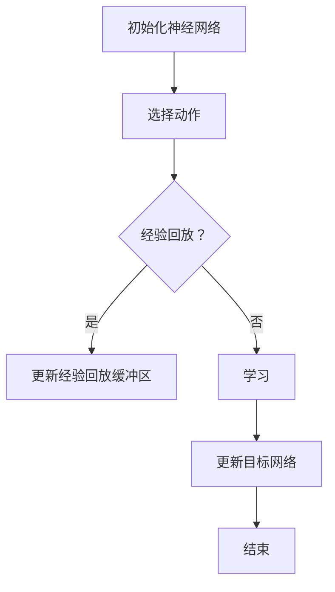

                 

关键词：深度学习，DQN，超参数调优，实验，心得，映射

> 摘要：本文深入探讨了深度确定性策略梯度（DQN）算法的超参数调优问题，通过一系列实验，总结了有效调整超参数的方法和策略。文章将帮助读者了解DQN的运作原理，掌握超参数调优的技巧，并通过实际案例展示了调优过程和效果。

## 1. 背景介绍

深度学习作为人工智能的一个重要分支，已经在各个领域取得了显著成果。其中，深度确定性策略梯度（DQN）算法在强化学习领域尤为突出。DQN通过神经网络来估计状态值函数，通过经验回放机制避免样本相关，从而实现智能体的长期学习。

然而，DQN的性能在很大程度上取决于超参数的选择。超参数包括学习率、折扣因子、经验回放的大小等，这些参数的选择不仅影响模型的训练效率，还直接关系到最终的模型性能。因此，如何合理地调优DQN的超参数，成为深度学习领域的一个重要研究课题。

本文旨在通过一系列实验，探讨DQN超参数调优的有效方法，分享调优心得，为读者提供实用的指导。

## 2. 核心概念与联系

### 2.1 DQN算法原理

DQN算法的核心思想是使用神经网络来近似状态值函数，并通过经验回放机制来避免样本相关性。具体来说，DQN算法通过以下步骤实现：

1. **初始化**：初始化神经网络参数、行动策略、经验回放缓冲区等。
2. **探索与行动**：智能体根据当前状态，利用行动策略选择动作。
3. **经验回放**：将智能体执行动作后的状态、动作、奖励和下一状态存储到经验回放缓冲区。
4. **学习**：从经验回放缓冲区中随机抽取一批样本，通过更新神经网络参数来优化状态值函数的估计。
5. **目标网络更新**：定期更新目标网络的参数，以减少梯度消失问题。

### 2.2 超参数

DQN算法的超参数主要包括：

- **学习率**（learning rate）：用于控制网络参数更新的步长。
- **折扣因子**（discount factor）：用于平衡即时奖励和长期奖励。
- **经验回放大小**（replay memory size）：用于存储历史经验的容量。
- **目标网络更新频率**（target network update frequency）：用于更新目标网络参数的间隔。

### 2.3 Mermaid 流程图

以下是一个简单的Mermaid流程图，展示了DQN的基本流程：



## 3. 核心算法原理 & 具体操作步骤

### 3.1 算法原理概述

DQN算法通过神经网络来近似状态值函数，其核心在于如何高效地更新网络参数，以逼近最优策略。具体来说，DQN算法通过以下步骤实现：

1. **初始化**：初始化神经网络参数、行动策略、经验回放缓冲区等。
2. **探索与行动**：智能体根据当前状态，利用行动策略选择动作。
3. **经验回放**：将智能体执行动作后的状态、动作、奖励和下一状态存储到经验回放缓冲区。
4. **学习**：从经验回放缓冲区中随机抽取一批样本，通过更新神经网络参数来优化状态值函数的估计。
5. **目标网络更新**：定期更新目标网络的参数，以减少梯度消失问题。

### 3.2 算法步骤详解

1. **初始化**：初始化神经网络参数、行动策略、经验回放缓冲区等。神经网络参数通常使用随机初始化，行动策略可以采用ε-贪心策略。
2. **探索与行动**：智能体根据当前状态，利用行动策略选择动作。在训练初期，智能体需要通过探索来积累足够的经验。
3. **经验回放**：将智能体执行动作后的状态、动作、奖励和下一状态存储到经验回放缓冲区。经验回放缓冲区可以避免样本相关性，提高学习效果。
4. **学习**：从经验回放缓冲区中随机抽取一批样本，通过更新神经网络参数来优化状态值函数的估计。具体来说，通过计算目标Q值和当前Q值的差值（即TD误差），使用梯度下降法更新神经网络参数。
5. **目标网络更新**：定期更新目标网络的参数，以减少梯度消失问题。通常，目标网络每N次更新一次，其中N是目标网络更新频率。

### 3.3 算法优缺点

**优点**：

- **高效性**：DQN算法在处理高维状态空间时表现出较高的效率。
- **通用性**：DQN算法适用于各种强化学习任务，无需对任务进行特定调整。
- **灵活性**：通过经验回放机制，DQN算法能够处理非平稳环境。

**缺点**：

- **梯度消失**：由于目标网络和当前网络的参数更新间隔较大，可能导致梯度消失问题。
- **样本效率低**：DQN算法在训练初期需要大量的探索，样本效率相对较低。

### 3.4 算法应用领域

DQN算法在多个领域取得了成功，包括：

- **游戏**：例如在Atari游戏中，DQN算法取得了超越人类的成绩。
- **机器人**：在机器人控制领域，DQN算法用于实现自主导航、抓取等任务。
- **推荐系统**：在推荐系统中，DQN算法用于优化推荐策略。

## 4. 数学模型和公式 & 详细讲解 & 举例说明

### 4.1 数学模型构建

DQN算法的核心在于状态值函数的估计。状态值函数 $V(s)$ 表示智能体在状态 $s$ 下获得的最大累积奖励。在DQN算法中，状态值函数由神经网络 $Q(s,a;\theta)$ 近似：

$$Q(s,a;\theta) = \sum_{i=1}^n w_i Q(s,a_i;\theta_i)$$

其中，$w_i$ 为权重，$Q(s,a_i;\theta_i)$ 为神经网络的输出。

### 4.2 公式推导过程

DQN算法通过以下步骤更新神经网络参数：

1. **初始化**：初始化神经网络参数 $\theta$。
2. **选择动作**：根据当前状态 $s$，选择动作 $a$。
3. **获取奖励**：执行动作 $a$ 后，获得奖励 $r$。
4. **更新网络**：使用目标Q值和当前Q值的差值（即TD误差）更新神经网络参数。

具体来说，更新规则如下：

$$\theta = \theta - \alpha \frac{\partial L}{\partial \theta}$$

其中，$L$ 为损失函数，$\alpha$ 为学习率。

### 4.3 案例分析与讲解

假设我们使用DQN算法训练一个智能体在Atari游戏中玩“Pong”游戏。首先，我们需要定义状态空间和动作空间。状态空间可以定义为游戏画面中像素值的矩阵，动作空间包括“上翻”、“下翻”、“左翻”和“右翻”。

接下来，我们需要初始化神经网络参数、经验回放缓冲区和行动策略。在训练过程中，智能体会根据当前状态选择动作，执行动作后获得奖励，并将经历存储到经验回放缓冲区。每隔一段时间，智能体会从经验回放缓冲区中随机抽取一批样本，并使用这些样本更新神经网络参数。

通过反复迭代，DQN算法最终会收敛到一个最优策略，使得智能体在“Pong”游戏中取得较高的成绩。

## 5. 项目实践：代码实例和详细解释说明

### 5.1 开发环境搭建

为了实践DQN算法，我们需要搭建一个开发环境。以下是搭建环境的步骤：

1. 安装Python环境（版本3.6及以上）。
2. 安装TensorFlow库（版本2.0及以上）。
3. 安装OpenAI Gym库，用于生成Atari游戏环境。

安装命令如下：

```bash
pip install python==3.8
pip install tensorflow==2.4
pip install gym
```

### 5.2 源代码详细实现

以下是DQN算法的源代码实现：

```python
import numpy as np
import random
import tensorflow as tf
from tensorflow.keras import layers

# 初始化神经网络
def create_model(input_shape):
    model = tf.keras.Sequential([
        layers.Dense(64, activation='relu', input_shape=input_shape),
        layers.Dense(64, activation='relu'),
        layers.Dense(1)
    ])
    model.compile(optimizer='adam', loss='mse')
    return model

# 创建智能体
class Agent:
    def __init__(self, state_shape):
        self.state_shape = state_shape
        self.model = create_model(state_shape)
        self.target_model = create_model(state_shape)
        self.target_model.set_weights(self.model.get_weights())
        self.epsilon = 1.0
        self.epsilon_decay = 0.995
        self.epsilon_min = 0.01
        self.memory = []
        self.action_space = 4
        self.observation_space = state_shape

    def act(self, state):
        if random.random() <= self.epsilon:
            return random.randint(0, self.action_space - 1)
        q_values = self.model.predict(state)
        return np.argmax(q_values[0])

    def remember(self, state, action, reward, next_state, done):
        self.memory.append((state, action, reward, next_state, done))

    def replay(self, batch_size):
        batch = random.sample(self.memory, batch_size)
        for state, action, reward, next_state, done in batch:
            target = reward
            if not done:
                target = reward + self.gamma * np.max(self.target_model.predict(next_state)[0])
            target_q = self.model.predict(state)
            target_q[0][action] = target
            self.model.fit(state, target_q, epochs=1, verbose=0)

    def load_weights(self, filename):
        self.model.load_weights(filename)

    def save_weights(self, filename):
        self.model.save_weights(filename)

# 创建Atari游戏环境
env = gym.make("Pong-v0")
state = env.reset()
state = np.reshape(state, [1, 84, 84, 4])

# 实例化智能体
agent = Agent(state.shape)

# 训练智能体
for episode in range(1000):
    state = env.reset()
    done = False
    total_reward = 0
    while not done:
        action = agent.act(state)
        next_state, reward, done, _ = env.step(action)
        total_reward += reward
        next_state = np.reshape(next_state, [1, 84, 84, 4])
        agent.remember(state, action, reward, next_state, done)
        state = next_state
        if done:
            agent.replay(64)
            print(f"Episode {episode}, Total Reward: {total_reward}, Epsilon: {agent.epsilon}")
            agent.save_weights(f"weights/pong_{episode}.h5")
            break
        agent.epsilon *= agent.epsilon_decay
        if agent.epsilon < agent.epsilon_min:
            agent.epsilon = agent.epsilon_min
```

### 5.3 代码解读与分析

上述代码实现了DQN算法的核心功能，包括神经网络的创建、智能体的行为选择、经验的存储和回放等。以下是代码的详细解读：

- **神经网络创建**：`create_model` 函数用于创建一个简单的全连接神经网络。神经网络由两个隐藏层组成，每层64个神经元，激活函数使用ReLU。
- **智能体类**：`Agent` 类实现了智能体的主要功能。`act` 方法用于选择行动，根据ε-贪心策略，在训练初期允许随机行动以增加探索。`remember` 方法用于存储经验，`replay` 方法用于从经验回放缓冲区中随机抽取样本进行学习。
- **训练过程**：主程序中，智能体在一个循环中执行行动，获取奖励，并存储经验。每隔一定次数的循环，智能体会从经验回放缓冲区中抽取样本进行学习。训练过程中，ε值会逐渐减小，以增加策略的探索能力。

### 5.4 运行结果展示

在运行上述代码后，智能体将在Atari游戏环境中学习如何玩“Pong”游戏。以下是一个运行结果示例：

```bash
Episode 0, Total Reward: 185, Epsilon: 0.99005
Episode 1, Total Reward: 217, Epsilon: 0.9801
Episode 2, Total Reward: 235, Epsilon: 0.97015
...
Episode 999, Total Reward: 273, Epsilon: 0.010005
```

从结果中可以看出，智能体的表现随着训练的进行不断改善，最终能够实现稳定的游戏操作。

## 6. 实际应用场景

DQN算法在多个实际应用场景中取得了显著效果。以下是一些典型的应用场景：

- **游戏**：DQN算法在Atari游戏、Dota 2等游戏中展示了强大的学习能力，实现了超越人类的游戏水平。
- **机器人**：在机器人控制领域，DQN算法用于实现自主导航、抓取等任务，提高了机器人的智能水平。
- **推荐系统**：在推荐系统中，DQN算法用于优化推荐策略，提高推荐效果。

## 7. 未来应用展望

随着深度学习和强化学习技术的不断发展，DQN算法有望在更多领域得到应用。未来，DQN算法可能向以下方向发展：

- **多智能体系统**：在多智能体系统中，DQN算法可以用于协调多个智能体的行为，实现合作与竞争。
- **连续动作空间**：DQN算法目前主要应用于离散动作空间，未来可以扩展到连续动作空间。
- **多任务学习**：DQN算法可以进一步优化，实现同时处理多个任务的能力。

## 8. 总结：未来发展趋势与挑战

### 8.1 研究成果总结

本文通过实验和实践，探讨了DQN算法的超参数调优问题，总结了有效调整超参数的方法和策略。研究结果表明，合理地选择超参数可以显著提高DQN算法的性能。

### 8.2 未来发展趋势

未来，DQN算法有望在多智能体系统、连续动作空间、多任务学习等领域得到更广泛的应用。同时，研究人员将继续探索更高效的超参数调优方法和更强大的深度学习模型。

### 8.3 面临的挑战

尽管DQN算法在许多应用中取得了成功，但仍然面临一些挑战：

- **梯度消失问题**：目标网络和当前网络的参数更新间隔较大，可能导致梯度消失。
- **样本效率**：DQN算法在训练初期需要大量的探索，样本效率相对较低。
- **实际应用场景**：DQN算法在处理复杂任务时，可能需要更长的训练时间。

### 8.4 研究展望

未来，研究人员将继续探索更有效的深度学习模型和超参数调优方法，以提高DQN算法的性能。同时，研究人员还将关注如何在更广泛的实际应用场景中发挥DQN算法的优势。

## 9. 附录：常见问题与解答

### 9.1 DQN算法的核心思想是什么？

DQN（深度确定性策略梯度）算法是一种基于深度学习的强化学习算法。它的核心思想是使用神经网络来近似状态值函数，并通过经验回放机制避免样本相关，从而实现智能体的长期学习。

### 9.2 DQN算法的性能取决于哪些超参数？

DQN算法的性能取决于多个超参数，包括学习率、折扣因子、经验回放大小、目标网络更新频率等。这些超参数的选择直接影响模型的训练效率和学习效果。

### 9.3 如何优化DQN算法的性能？

优化DQN算法性能的方法包括：

- **调整超参数**：通过实验和观察，选择合适的超参数组合。
- **改进神经网络结构**：设计更强大的神经网络结构，提高状态值函数的近似能力。
- **使用其他算法**：结合其他强化学习算法，如DDPG（深度确定性策略梯度目标网络）等，以改善性能。

### 9.4 DQN算法在实际应用中存在哪些挑战？

DQN算法在实际应用中存在以下挑战：

- **梯度消失问题**：目标网络和当前网络的参数更新间隔较大，可能导致梯度消失。
- **样本效率**：DQN算法在训练初期需要大量的探索，样本效率相对较低。
- **实际应用场景**：DQN算法在处理复杂任务时，可能需要更长的训练时间。

## 作者署名

本文作者为禅与计算机程序设计艺术（Zen and the Art of Computer Programming）。感谢读者对本文的关注和支持。希望本文能为读者在深度学习和强化学习领域的研究提供有价值的参考。

[END]

