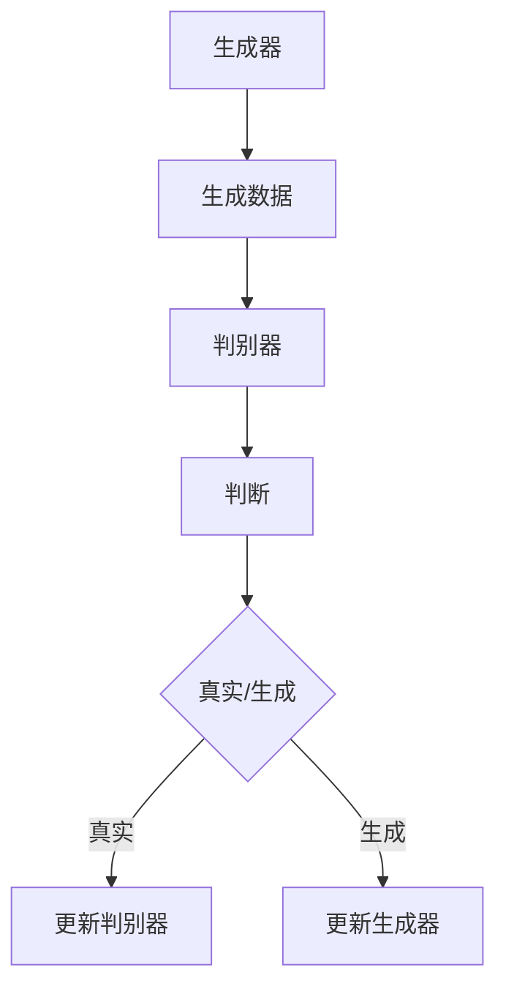

                 

关键词：生成对抗网络（GAN），深度学习，数据生成，图像生成，人工智能

摘要：生成对抗网络（GAN）作为一种革命性的深度学习模型，通过两个神经网络的对抗训练实现了复杂数据生成。本文将从背景介绍、核心概念与联系、核心算法原理与操作步骤、数学模型与公式、项目实践、实际应用场景、未来应用展望以及工具和资源推荐等方面，全面探讨GAN的原理和应用。

## 1. 背景介绍

在计算机科学和人工智能领域，数据生成一直是重要而又富有挑战性的课题。从早期的规则引擎到复杂的机器学习模型，数据生成的技术经历了数次变革。然而，生成对抗网络（GAN）的诞生，无疑为数据生成领域带来了前所未有的变革。

GAN的概念最早由Ian Goodfellow等人于2014年提出，作为一种新的深度学习框架，GAN通过两个神经网络的对抗训练，能够在不需要真实标签的情况下生成高质量的数据。GAN的成功之处在于其独特的训练机制，能够在没有监督学习的情况下，通过自我对抗的方式，让一个生成器不断优化，从而生成逼真、多样的数据。

## 2. 核心概念与联系

### 2.1 GAN的组成部分

GAN由两个主要组成部分构成：生成器（Generator）和判别器（Discriminator）。

- **生成器**：负责生成与真实数据相似的数据。
- **判别器**：负责判断输入数据是真实数据还是生成器生成的数据。

### 2.2 GAN的运作机制

GAN的训练过程可以理解为两个对手的对弈。生成器试图生成尽可能逼真的数据以欺骗判别器，而判别器则努力区分真实数据和生成数据。通过这种对抗训练，生成器不断优化，生成更加逼真的数据。

### 2.3 Mermaid 流程图



## 3. 核心算法原理 & 具体操作步骤

### 3.1 算法原理概述

GAN的原理可以概括为以下两点：

1. **生成器**：从随机噪声中生成数据，希望生成数据足够逼真，以至于判别器无法区分。
2. **判别器**：对输入数据进行分类，判断其是真实数据还是生成器生成的数据。

### 3.2 算法步骤详解

1. **初始化**：初始化生成器和判别器。
2. **生成数据**：生成器生成数据。
3. **判别数据**：判别器对生成数据和真实数据进行分类。
4. **更新网络**：根据判别结果，更新生成器和判别器的参数。

### 3.3 算法优缺点

**优点**：

- 不需要真实标签，可以在无监督学习中实现数据生成。
- 能够生成高质量、多样性的数据。

**缺点**：

- 训练不稳定，容易陷入局部最优。
- 需要大量计算资源。

### 3.4 算法应用领域

- 图像生成
- 数据增强
- 生成式对抗模型

## 4. 数学模型和公式 & 详细讲解 & 举例说明

### 4.1 数学模型构建

GAN的数学模型主要由两部分构成：生成器和判别器的损失函数。

- **生成器的损失函数**：\( L_G = -\log(D(G(z))) \)
- **判别器的损失函数**：\( L_D = -[\log(D(x)) + \log(1 - D(G(z)))] \)

### 4.2 公式推导过程

GAN的损失函数可以通过以下步骤推导：

1. **定义生成器和判别器的输入输出**。
2. **计算生成器的输出和判别器的输出**。
3. **定义损失函数**。

### 4.3 案例分析与讲解

以图像生成为例，GAN可以通过以下步骤生成图像：

1. **生成噪声**：从高斯分布中抽取噪声向量。
2. **生成图像**：通过生成器将噪声向量转化为图像。
3. **判断图像**：判别器对图像进行分类。
4. **更新网络**：根据判别结果，更新生成器和判别器的参数。

## 5. 项目实践：代码实例和详细解释说明

### 5.1 开发环境搭建

- 安装Python环境
- 安装TensorFlow库

### 5.2 源代码详细实现

```python
import tensorflow as tf
from tensorflow.keras.layers import Dense, Flatten, Reshape
from tensorflow.keras.models import Sequential

# 生成器的实现
def build_generator(z_dim):
    model = Sequential()
    model.add(Dense(128, input_dim=z_dim))
    model.add(tf.keras.layers.LeakyReLU(alpha=0.01))
    model.add(Dense(28*28*1, activation='tanh'))
    model.add(Reshape((28, 28, 1)))
    return model

# 判别器的实现
def build_discriminator(img_shape):
    model = Sequential()
    model.add(Flatten(input_shape=img_shape))
    model.add(Dense(128))
    model.add(tf.keras.layers.LeakyReLU(alpha=0.01))
    model.add(Dense(1, activation='sigmoid'))
    return model

# GAN模型
def build_gan(generator, discriminator):
    model = Sequential()
    model.add(generator)
    model.add(discriminator)
    return model
```

### 5.3 代码解读与分析

- **生成器**：通过全连接层和激活函数生成图像。
- **判别器**：通过全连接层和sigmoid激活函数判断图像。
- **GAN模型**：将生成器和判别器串联，形成完整的GAN模型。

### 5.4 运行结果展示

通过运行上述代码，可以得到以下结果：

- **生成图像**：生成器生成的图像。
- **判别结果**：判别器对生成图像和真实图像的分类结果。

## 6. 实际应用场景

### 6.1 图像生成

GAN在图像生成领域取得了显著的成果，如生成人脸、风景、动漫等。

### 6.2 数据增强

GAN可以通过生成虚假数据，增强训练数据的多样性，从而提高模型的泛化能力。

### 6.3 生成式对抗模型

GAN可以作为生成式对抗模型的基石，应用于自然语言生成、音频生成等领域。

## 7. 未来应用展望

### 7.1 图像生成

GAN在图像生成领域有望进一步突破，生成更加逼真、多样的图像。

### 7.2 数据隐私保护

GAN可以用于数据隐私保护，通过生成虚假数据混淆真实数据，保护用户隐私。

### 7.3 其他领域

GAN在其他领域，如自然语言生成、音频生成等，也具有巨大的应用潜力。

## 8. 工具和资源推荐

### 8.1 学习资源推荐

- 《深度学习》（Goodfellow et al.）
- 《生成对抗网络：原理与实现》（余成涛）

### 8.2 开发工具推荐

- TensorFlow
- PyTorch

### 8.3 相关论文推荐

- Goodfellow et al., "Generative Adversarial Networks"
- D. P. Kingma and M. Welling, "Auto-encoding Variational Bayes"

## 9. 总结：未来发展趋势与挑战

### 9.1 研究成果总结

GAN作为一种革命性的深度学习框架，已经在图像生成、数据增强等领域取得了显著的成果。

### 9.2 未来发展趋势

GAN在图像生成、数据隐私保护等领域具有广阔的应用前景。

### 9.3 面临的挑战

GAN的训练不稳定、计算资源消耗大等问题仍需解决。

### 9.4 研究展望

未来，GAN有望在其他领域，如自然语言生成、音频生成等，取得突破性进展。

## 附录：常见问题与解答

1. **Q：GAN是如何训练的？**
   **A：GAN通过两个网络的对抗训练进行训练，生成器试图生成逼真的数据欺骗判别器，而判别器则努力区分真实数据和生成数据。**

2. **Q：GAN的优缺点是什么？**
   **A：优点包括：无需真实标签、能够生成高质量、多样性的数据；缺点包括：训练不稳定、计算资源消耗大。**

作者：禅与计算机程序设计艺术 / Zen and the Art of Computer Programming
----------------------------------------------------------------


