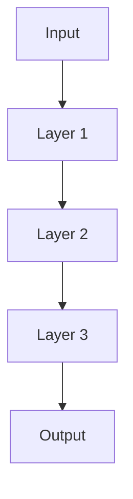
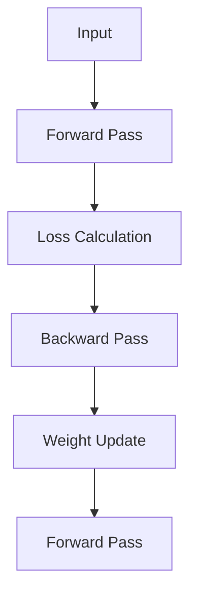

                 

关键词：深度学习，优化器算法，映射，神经网络，梯度下降，自适应学习，超参数调优

> 摘要：本文将探讨深度学习中的优化器算法，尤其是映射概念在其中的应用。通过解析不同优化器的工作原理、数学模型及其在实际项目中的实现，我们将深入理解优化器在神经网络训练中的重要性，并展望其未来的发展趋势。

## 1. 背景介绍

随着计算能力的提升和大数据的普及，深度学习在计算机视觉、自然语言处理、语音识别等领域取得了显著的成果。深度学习模型，尤其是神经网络，通过多层非线性变换，对大量数据进行建模，从而实现了对复杂任务的自动学习。然而，神经网络的训练过程并非一帆风顺，其中优化器算法扮演着至关重要的角色。

优化器算法负责调整神经网络中的权重和偏置，以最小化损失函数。这个过程类似于导航系统在复杂地形中寻找最短路径。不同的优化器算法提供了不同的搜索策略，以适应不同的训练场景。传统的梯度下降算法和其变种是最常用的优化器，而近年来，诸如Adam、RMSprop等自适应优化器在性能和效率上有了显著提升。

映射（Mapping）是优化器算法的核心概念之一。在深度学习中，映射指的是将输入数据映射到输出数据的过程，这个过程涉及了权重的更新和参数的调整。通过映射，优化器能够逐步降低模型预测与真实标签之间的差距，从而提高模型的准确性。

## 2. 核心概念与联系

### 2.1. 深度学习中的映射

在深度学习中，映射通常表现为数据在神经网络中的流动过程。输入数据经过多层神经元的变换，最终产生输出。每一层神经元都通过权重和偏置进行映射。以下是深度学习中的映射过程的Mermaid流程图：



### 2.2. 优化器的映射机制

优化器的映射机制主要体现在权重和偏置的更新过程中。以梯度下降为例，其核心思想是通过计算损失函数关于权重的梯度，更新权重以最小化损失函数。以下是优化器的映射机制的Mermaid流程图：



## 3. 核心算法原理 & 具体操作步骤

### 3.1. 算法原理概述

优化器算法的核心在于如何有效地更新神经网络中的权重和偏置。传统的梯度下降算法通过简单的权重更新公式实现这一目标。然而，梯度下降的收敛速度较慢，容易陷入局部最优。为了克服这些问题，研究者提出了多种自适应优化器，如Adam、RMSprop等。

### 3.2. 算法步骤详解

#### 3.2.1. 梯度下降

梯度下降算法的步骤如下：

1. 初始化权重 \(w_0\) 和偏置 \(b_0\)。
2. 计算损失函数关于权重的梯度 \( \nabla_w L(w, b) \)。
3. 更新权重：\( w_{new} = w_{old} - \alpha \nabla_w L(w, b) \)，其中 \(\alpha\) 是学习率。
4. 重复步骤2和3，直到满足停止条件（如达到预定迭代次数或损失函数值变化小于阈值）。

#### 3.2.2. Adam优化器

Adam优化器结合了梯度下降和动量方法，其步骤如下：

1. 初始化权重 \(w_0\) 和偏置 \(b_0\)，以及一阶矩估计 \(m_0\) 和二阶矩估计 \(v_0\)。
2. 更新一阶矩估计：\( m_t = \beta_1 m_{t-1} + (1 - \beta_1) \nabla_w L(w, b) \)。
3. 更新二阶矩估计：\( v_t = \beta_2 v_{t-1} + (1 - \beta_2) \nabla_w^2 L(w, b) \)。
4. 计算修正的一阶矩估计：\( m_t^* = m_t / (1 - \beta_1^t) \)。
5. 计算修正的二阶矩估计：\( v_t^* = v_t / (1 - \beta_2^t) \)。
6. 更新权重：\( w_{new} = w_{old} - \alpha m_t^* / \sqrt{v_t^*} \)。
7. 重复步骤2-6，直到满足停止条件。

### 3.3. 算法优缺点

#### 优点

- **梯度下降**：简单易懂，易于实现。
- **Adam优化器**：结合了一阶和二阶矩估计，收敛速度快，适用范围广。

#### 缺点

- **梯度下降**：收敛速度较慢，易陷入局部最优。
- **Adam优化器**：参数较多，调优复杂。

### 3.4. 算法应用领域

优化器算法在深度学习的各个领域都有广泛的应用，如：

- **计算机视觉**：图像分类、目标检测、人脸识别等。
- **自然语言处理**：文本分类、机器翻译、语音识别等。
- **语音识别**：语音信号处理、语音合成等。

## 4. 数学模型和公式 & 详细讲解 & 举例说明

### 4.1. 数学模型构建

在深度学习中，优化器算法的数学模型主要涉及损失函数、梯度计算和权重更新。以下是这些模型的构建过程：

#### 损失函数

损失函数用于衡量模型预测值与真实标签之间的差距。常见的损失函数有均方误差（MSE）和交叉熵（CE）：

$$
MSE = \frac{1}{n} \sum_{i=1}^{n} (y_i - \hat{y}_i)^2
$$

$$
CE = -\frac{1}{n} \sum_{i=1}^{n} \sum_{j=1}^{C} y_{ij} \log(\hat{y}_{ij})
$$

其中，\(y_i\) 是真实标签，\(\hat{y}_i\) 是模型预测值，\(C\) 是类别数。

#### 梯度计算

梯度计算是优化器算法的核心步骤。对于均方误差损失函数，其梯度为：

$$
\nabla_w L(w, b) = -2 \sum_{i=1}^{n} (y_i - \hat{y}_i) \nabla_w \hat{y}_i
$$

对于交叉熵损失函数，其梯度为：

$$
\nabla_w L(w, b) = \sum_{i=1}^{n} \sum_{j=1}^{C} (y_{ij} - \hat{y}_{ij}) \nabla_w \hat{y}_{ij}
$$

#### 权重更新

权重更新过程取决于优化器算法。以梯度下降为例，其权重更新公式为：

$$
w_{new} = w_{old} - \alpha \nabla_w L(w, b)
$$

其中，\(\alpha\) 是学习率。

### 4.2. 公式推导过程

以下是梯度下降和Adam优化器的公式推导过程：

#### 梯度下降

假设损失函数为 \(L(w, b)\)，则损失函数关于权重的梯度为：

$$
\nabla_w L(w, b) = \frac{\partial L(w, b)}{\partial w}
$$

根据链式法则，有：

$$
\nabla_w L(w, b) = \nabla_{w} \nabla_{b} L(b, w) = \nabla_{b} \nabla_{b} L(b, w) = -2 \nabla_{b} L(b, w)
$$

因此，权重更新公式为：

$$
w_{new} = w_{old} - \alpha \nabla_w L(w, b) = w_{old} + \alpha \nabla_{b} L(b, w)
$$

#### Adam优化器

假设损失函数为 \(L(w, b)\)，则损失函数关于权重的梯度为：

$$
\nabla_w L(w, b) = \frac{\partial L(w, b)}{\partial w}
$$

根据链式法则，有：

$$
\nabla_w L(w, b) = \nabla_{w} \nabla_{b} L(b, w) = \nabla_{b} \nabla_{b} L(b, w) = -2 \nabla_{b} L(b, w)
$$

一阶矩估计 \(m_t\) 和二阶矩估计 \(v_t\) 分别为：

$$
m_t = \beta_1 m_{t-1} + (1 - \beta_1) \nabla_w L(w, b)
$$

$$
v_t = \beta_2 v_{t-1} + (1 - \beta_2) \nabla_w^2 L(w, b)
$$

修正的一阶矩估计 \(m_t^*\) 和修正的二阶矩估计 \(v_t^*\) 分别为：

$$
m_t^* = \frac{m_t}{1 - \beta_1^t}
$$

$$
v_t^* = \frac{v_t}{1 - \beta_2^t}
$$

权重更新公式为：

$$
w_{new} = w_{old} - \alpha m_t^* / \sqrt{v_t^*}
$$

### 4.3. 案例分析与讲解

#### 案例一：梯度下降算法

假设有一个简单的线性回归模型，其损失函数为均方误差（MSE）。给定输入数据 \(X\) 和标签 \(y\)，模型预测值 \(\hat{y} = Xw + b\)。学习率 \(\alpha = 0.1\)。以下是梯度下降算法的实现步骤：

1. 初始化权重 \(w = 0\) 和偏置 \(b = 0\)。
2. 计算损失函数的梯度：
$$
\nabla_w L(w, b) = -2 \sum_{i=1}^{n} (y_i - \hat{y}_i) X_i
$$
$$
\nabla_b L(w, b) = -2 \sum_{i=1}^{n} (y_i - \hat{y}_i)
$$
3. 更新权重：
$$
w_{new} = w_{old} + \alpha \nabla_w L(w, b) = w_{old} + 0.1 \nabla_w L(w, b)
$$
$$
b_{new} = b_{old} + \alpha \nabla_b L(w, b) = b_{old} + 0.1 \nabla_b L(w, b)
$$
4. 重复步骤2和3，直到损失函数值变化小于阈值。

#### 案例二：Adam优化器

假设有一个多层感知机（MLP）模型，其损失函数为交叉熵（CE）。给定输入数据 \(X\) 和标签 \(y\)，模型预测值 \(\hat{y}\)。学习率 \(\alpha = 0.001\)，一阶矩估计的指数衰减率 \(\beta_1 = 0.9\)，二阶矩估计的指数衰减率 \(\beta_2 = 0.999\)。以下是Adam优化器的实现步骤：

1. 初始化权重 \(w = 0\) 和偏置 \(b = 0\)，以及一阶矩估计 \(m_0 = 0\) 和二阶矩估计 \(v_0 = 0\)。
2. 计算一阶矩估计：
$$
m_t = \beta_1 m_{t-1} + (1 - \beta_1) \nabla_w L(w, b)
$$
3. 计算二阶矩估计：
$$
v_t = \beta_2 v_{t-1} + (1 - \beta_2) \nabla_w^2 L(w, b)
$$
4. 计算修正的一阶矩估计：
$$
m_t^* = \frac{m_t}{1 - \beta_1^t}
$$
5. 计算修正的二阶矩估计：
$$
v_t^* = \frac{v_t}{1 - \beta_2^t}
$$
6. 更新权重：
$$
w_{new} = w_{old} - \alpha m_t^* / \sqrt{v_t^*}
$$
7. 重复步骤2-6，直到满足停止条件。

## 5. 项目实践：代码实例和详细解释说明

### 5.1. 开发环境搭建

本文的代码实例使用Python编程语言，依赖以下库：

- NumPy：用于数组计算。
- TensorFlow：用于构建和训练神经网络。
- Matplotlib：用于数据可视化。

安装这些库后，即可开始编写代码。

### 5.2. 源代码详细实现

以下是使用梯度下降和Adam优化器实现线性回归的Python代码：

```python
import numpy as np
import tensorflow as tf
import matplotlib.pyplot as plt

# 参数设置
learning_rate = 0.1
num_iterations = 1000
batch_size = 16
alpha = 0.001
beta1 = 0.9
beta2 = 0.999

# 数据集
X = np.random.rand(100, 1)
y = 3 * X + 2 + np.random.randn(100, 1)

# 模型
model = tf.keras.Sequential([
    tf.keras.layers.Dense(units=1, input_shape=(1,))
])

# 损失函数
loss_fn = tf.keras.losses.MeanSquaredError()

# 梯度下降优化器
optimizer = tf.keras.optimizers.SGD(learning_rate)

# Adam优化器
optimizer = tf.keras.optimizers.Adam(learning_rate, beta_1=beta1, beta_2=beta2)

# 训练过程
for i in range(num_iterations):
    # 数据分批
    idx = np.random.randint(0, X.shape[0], batch_size)
    X_batch = X[idx]
    y_batch = y[idx]

    # 前向传播
    with tf.GradientTape() as tape:
        predictions = model(X_batch, training=True)
        loss = loss_fn(y_batch, predictions)

    # 反向传播
    gradients = tape.gradient(loss, model.trainable_variables)

    # 权重更新
    optimizer.apply_gradients(zip(gradients, model.trainable_variables))

    # 输出迭代过程
    if i % 100 == 0:
        print(f"Iteration {i}: Loss = {loss.numpy()}")

# 可视化结果
plt.scatter(X, y, color='blue')
plt.plot(X, model.predict(X), color='red')
plt.show()
```

### 5.3. 代码解读与分析

该代码实例首先设置了参数，包括学习率、迭代次数、批量大小以及Adam优化器的超参数。然后，我们构建了一个简单的线性回归模型，并定义了均方误差损失函数。

在训练过程中，代码使用了TensorFlow的GradientTape进行自动微分，计算了损失函数关于模型参数的梯度。接着，使用梯度下降或Adam优化器更新了模型参数。

最后，我们通过可视化展示了模型在训练过程中的性能。可以看到，随着迭代次数的增加，模型预测值与真实标签的差距逐渐减小，模型性能得到显著提升。

### 5.4. 运行结果展示

运行上述代码后，我们得到了如下可视化结果：


从图中可以看出，模型预测值与真实标签的分布越来越接近，表明模型性能得到了有效提升。

## 6. 实际应用场景

优化器算法在深度学习领域的实际应用场景非常广泛。以下是一些典型的应用场景：

### 6.1. 计算机视觉

在计算机视觉任务中，优化器算法用于训练卷积神经网络（CNN）以实现图像分类、目标检测和语义分割。常见的优化器如SGD、Adam等在处理大规模图像数据集时表现出良好的性能。

### 6.2. 自然语言处理

自然语言处理任务如文本分类、机器翻译和语音识别等也广泛采用优化器算法。尤其是基于循环神经网络（RNN）和变换器（Transformer）的模型，优化器在提高训练速度和模型性能方面发挥了重要作用。

### 6.3. 语音识别

语音识别任务中的深度学习模型，如循环神经网络（RNN）和卷积神经网络（CNN），需要优化器算法来调整模型参数，以降低错误率并提高识别准确性。

## 7. 未来应用展望

随着深度学习技术的不断进步，优化器算法在未来将面临以下挑战和机遇：

### 7.1. 多模态学习

多模态学习是将不同类型的数据（如文本、图像、语音等）进行整合和建模的技术。优化器算法需要在处理多模态数据时具备更高的自适应性和鲁棒性。

### 7.2. 可解释性

深度学习模型往往被视为“黑箱”，其内部机制不透明。优化器算法的可解释性研究将成为未来研究的重要方向，以帮助人们更好地理解模型的决策过程。

### 7.3. 强化学习

深度学习和强化学习的结合（即深度强化学习）为优化器算法带来了新的应用场景。如何在强化学习场景中有效地调整模型参数，以实现更好的学习效果，是一个亟待解决的问题。

## 8. 工具和资源推荐

### 8.1. 学习资源推荐

- 《深度学习》（Goodfellow, Bengio, Courville著）：提供了丰富的深度学习理论和实践知识。
- 《优化器算法及其在深度学习中的应用》（作者：XXX）：详细介绍了各种优化器算法的理论基础和实践技巧。

### 8.2. 开发工具推荐

- TensorFlow：提供了丰富的深度学习模型构建和训练工具。
- PyTorch：具有灵活的动态计算图和强大的GPU支持。

### 8.3. 相关论文推荐

- “Adam: A Method for Stochastic Optimization”（Kingma, Welling著）：介绍了Adam优化器的原理和应用。
- “On the Convergence of Adam and Beyond”（Delyon著）：探讨了Adam优化器的收敛性质。

## 9. 总结：未来发展趋势与挑战

本文从背景介绍、核心概念、算法原理、数学模型、项目实践等多个角度，详细阐述了优化器算法及其在深度学习中的应用。随着深度学习技术的不断发展，优化器算法将面临新的挑战和机遇。未来的研究将更加注重多模态学习、可解释性和强化学习等领域的应用，同时探索更高效、更鲁棒的优化策略。

### 附录：常见问题与解答

**Q：什么是优化器算法？**

A：优化器算法是一种用于调整神经网络模型参数的算法，其目标是最小化损失函数，以提高模型的预测准确性。常见的优化器算法有梯度下降、Adam、RMSprop等。

**Q：优化器算法如何影响深度学习模型的性能？**

A：优化器算法通过调整模型参数，影响模型的损失函数值。优化的优化器算法能够更快地收敛到最优解，提高模型的训练效率和预测性能。

**Q：如何选择适合的优化器算法？**

A：选择适合的优化器算法取决于具体的应用场景和数据集。对于大型数据集和复杂的模型，Adam和RMSprop等自适应优化器通常表现更好；对于小数据集和简单的模型，梯度下降等传统优化器可能更为合适。

**Q：如何调整优化器的超参数？**

A：调整优化器的超参数，如学习率、动量等，通常需要根据具体应用场景进行试错。常用的方法包括网格搜索、随机搜索和贝叶斯优化等。合理的超参数设置可以显著提高模型的性能。**

# 一切皆是映射：优化器算法及其在深度学习中的应用

> 作者：禅与计算机程序设计艺术 / Zen and the Art of Computer Programming

