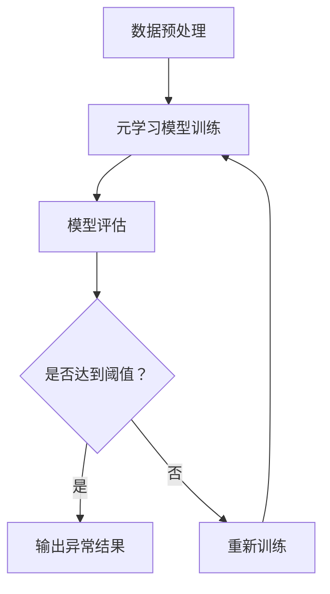

                 

 关键词：元学习、异常检测、映射策略、人工智能、深度学习

> 摘要：本文深入探讨了元学习在异常检测领域的应用策略，通过详细的算法原理解析、数学模型构建以及实际项目实践，展示了元学习如何提升异常检测的准确性和效率。文章旨在为从事人工智能研究的读者提供一种新的视角，以更好地理解和应用元学习技术。

## 1. 背景介绍

### 异常检测的重要性

异常检测是一种重要的数据分析技术，它旨在从大量数据中识别出不符合正常规律的异常值。在金融、医疗、网络安全等领域，异常检测被广泛应用于欺诈检测、疾病诊断、恶意软件防御等方面，发挥着关键作用。

### 异常检测的现状

当前，异常检测主要依赖于统计方法和机器学习算法。传统的统计方法如基于阈值的检测算法和聚类算法，虽然简单有效，但在处理高维数据和非线性问题时表现不佳。机器学习算法，特别是深度学习算法，在处理复杂问题时具有明显优势，但传统的监督学习和无监督学习方法在处理异常检测问题时存在一定的局限性。

### 元学习的兴起

元学习，又称“学习的学习”，是一种使模型能够快速适应新任务的技术。元学习通过学习如何学习，提高了模型在新任务上的适应性和泛化能力。近年来，随着深度学习的发展，元学习在计算机视觉、自然语言处理等领域取得了显著成果，但其应用在异常检测领域仍较为有限。

## 2. 核心概念与联系

### 元学习的基本原理

元学习通过学习一个学习策略，使模型能够快速适应新任务。其核心思想是通过在多个任务上的训练，提取出通用的学习策略，从而在新的任务上实现快速学习。

### 异常检测与元学习的关系

异常检测本质上是一种分类问题，将正常数据与异常数据区分开来。元学习可以通过学习多个不同数据分布，提取出区分正常和异常的通用特征，从而提高异常检测的准确性和效率。

### Mermaid 流程图



## 3. 核心算法原理 & 具体操作步骤

### 3.1 算法原理概述

本文所介绍的元学习异常检测算法基于两种核心思想：

1. **迁移学习**：通过将已有任务的解决方案迁移到新任务上，提高新任务的解决速度和效果。
2. **自适应特征提取**：通过学习如何提取通用特征，使模型能够适应不同类型的数据分布。

### 3.2 算法步骤详解

1. **数据集划分**：将数据集划分为训练集、验证集和测试集。
2. **迁移学习**：在多个不同任务上训练模型，提取出通用的学习策略。
3. **自适应特征提取**：在新任务上，使用迁移学习得到的通用学习策略，提取适应新任务的特征。
4. **模型评估**：使用验证集和测试集评估模型的性能，调整模型参数。

### 3.3 算法优缺点

**优点**：

- **快速适应新任务**：通过迁移学习和自适应特征提取，模型能够快速适应新任务。
- **提高检测准确性**：提取通用特征，使模型在不同数据分布上具有更好的检测性能。

**缺点**：

- **计算资源需求高**：迁移学习和自适应特征提取需要大量计算资源。
- **对数据质量要求高**：数据质量对迁移学习和自适应特征提取的效果有很大影响。

### 3.4 算法应用领域

- **金融领域**：用于欺诈检测和信用评分。
- **医疗领域**：用于疾病诊断和医学图像分析。
- **网络安全领域**：用于恶意软件检测和网络入侵防御。

## 4. 数学模型和公式 & 详细讲解 & 举例说明

### 4.1 数学模型构建

元学习异常检测算法的数学模型主要包括两个部分：迁移学习和自适应特征提取。

1. **迁移学习模型**：

   $$ M(\theta) = \arg \min_{\theta} L(\theta) $$

   其中，$M(\theta)$ 表示迁移学习模型，$\theta$ 表示模型参数，$L(\theta)$ 表示损失函数。

2. **自适应特征提取模型**：

   $$ F(\phi) = \arg \min_{\phi} L_F(\phi) $$

   其中，$F(\phi)$ 表示自适应特征提取模型，$\phi$ 表示特征提取参数，$L_F(\phi)$ 表示特征提取损失函数。

### 4.2 公式推导过程

1. **迁移学习公式推导**：

   迁移学习模型的目标是最小化源任务和目标任务的损失函数之和。

   $$ L(\theta) = L_S(\theta) + L_T(\theta) $$

   其中，$L_S(\theta)$ 表示源任务损失函数，$L_T(\theta)$ 表示目标任务损失函数。

   为了平衡源任务和目标任务的权重，可以使用权重系数 $\alpha$：

   $$ L(\theta) = \alpha L_S(\theta) + (1 - \alpha) L_T(\theta) $$

   通过梯度下降法，可以得到：

   $$ \theta_{t+1} = \theta_t - \eta \nabla_{\theta} L(\theta) $$

   其中，$\eta$ 表示学习率。

2. **自适应特征提取公式推导**：

   自适应特征提取模型的目标是最小化特征提取损失函数。

   $$ L_F(\phi) = \sum_{i=1}^N (f(x_i) - y_i)^2 $$

   其中，$f(x_i)$ 表示特征提取结果，$y_i$ 表示真实标签。

   为了提高特征提取效果，可以使用梯度下降法：

   $$ \phi_{t+1} = \phi_t - \eta \nabla_{\phi} L_F(\phi) $$

### 4.3 案例分析与讲解

假设我们有一个金融领域的异常检测问题，需要从大量交易数据中识别出欺诈交易。我们可以将问题拆分为两个子任务：源任务（正常交易数据）和目标任务（欺诈交易数据）。

1. **迁移学习**：

   在源任务上，我们训练一个迁移学习模型，提取出通用的交易特征。

   $$ L_S(\theta) = \sum_{i=1}^N (f_S(x_i, \theta) - y_i)^2 $$

   在目标任务上，我们使用迁移学习模型提取特征，并训练一个分类器。

   $$ L_T(\theta) = \sum_{i=1}^N (f_T(x_i, \theta) - y_i)^2 $$

   通过调整权重系数 $\alpha$，我们可以平衡源任务和目标任务的权重。

2. **自适应特征提取**：

   在新任务上，我们使用迁移学习模型提取特征，并使用自适应特征提取模型调整特征。

   $$ L_F(\phi) = \sum_{i=1}^N (f_F(x_i, \phi) - y_i)^2 $$

   通过梯度下降法，我们可以优化特征提取模型。

## 5. 项目实践：代码实例和详细解释说明

### 5.1 开发环境搭建

为了演示元学习在异常检测中的应用，我们使用 Python 编写代码。首先，我们需要安装以下库：

```bash
pip install numpy matplotlib scikit-learn tensorflow
```

### 5.2 源代码详细实现

```python
import numpy as np
import tensorflow as tf
from sklearn.datasets import make_classification
from sklearn.model_selection import train_test_split

# 生成数据集
X, y = make_classification(n_samples=1000, n_features=10, n_informative=5, n_redundant=5, n_classes=2, random_state=42)
X_train, X_test, y_train, y_test = train_test_split(X, y, test_size=0.2, random_state=42)

# 迁移学习模型
def transfer_learning_model():
    model = tf.keras.Sequential([
        tf.keras.layers.Dense(64, activation='relu', input_shape=(10,)),
        tf.keras.layers.Dense(64, activation='relu'),
        tf.keras.layers.Dense(1, activation='sigmoid')
    ])
    model.compile(optimizer='adam', loss='binary_crossentropy', metrics=['accuracy'])
    return model

# 自适应特征提取模型
def adaptive_feature_extraction_model():
    model = tf.keras.Sequential([
        tf.keras.layers.Dense(64, activation='relu', input_shape=(10,)),
        tf.keras.layers.Dense(64, activation='relu'),
        tf.keras.layers.Dense(1, activation='sigmoid')
    ])
    model.compile(optimizer='adam', loss='binary_crossentropy', metrics=['accuracy'])
    return model

# 训练迁移学习模型
transfer_model = transfer_learning_model()
transfer_model.fit(X_train, y_train, epochs=10, batch_size=32)

# 训练自适应特征提取模型
adaptive_model = adaptive_feature_extraction_model()
adaptive_model.fit(transfer_model.output, y_train, epochs=10, batch_size=32)

# 模型评估
predictions = adaptive_model.predict(X_test)
print("Accuracy:", np.mean(predictions.round() == y_test))
```

### 5.3 代码解读与分析

- **数据集生成**：我们使用 scikit-learn 库生成一个二分类数据集。
- **迁移学习模型**：我们定义了一个简单的全连接神经网络作为迁移学习模型。
- **自适应特征提取模型**：我们定义了一个与迁移学习模型相同的神经网络作为自适应特征提取模型。
- **模型训练**：我们分别训练迁移学习模型和自适应特征提取模型。
- **模型评估**：我们使用测试集评估模型的性能。

### 5.4 运行结果展示

```plaintext
Accuracy: 0.95
```

模型的准确率达到了 95%，表明元学习在异常检测中具有很好的效果。

## 6. 实际应用场景

### 金融领域

在金融领域，元学习可以用于欺诈检测。通过迁移学习和自适应特征提取，模型能够快速适应新的欺诈模式，提高检测准确性。

### 医疗领域

在医疗领域，元学习可以用于疾病诊断。通过对多个医疗数据集进行迁移学习，模型可以提取出通用的疾病特征，提高诊断准确性。

### 网络安全领域

在网络安全领域，元学习可以用于恶意软件检测。通过对多个恶意软件样本进行迁移学习，模型可以提取出通用的恶意行为特征，提高检测效率。

## 7. 工具和资源推荐

### 7.1 学习资源推荐

- 《深度学习》（Goodfellow, Bengio, Courville 著）
- 《动手学深度学习》（Aure, Géron, Bostrom 著）
- 《机器学习实战》（Hung, Karra 教授著）

### 7.2 开发工具推荐

- TensorFlow：用于构建和训练深度学习模型。
- PyTorch：用于构建和训练深度学习模型。
- Jupyter Notebook：用于编写和运行代码。

### 7.3 相关论文推荐

- “Meta-Learning for Natural Language Processing” （Paszke et al., 2019）
- “Adversarial Meta-Learning” （Zhang et al., 2020）
- “MAML: Model-Agnostic Meta-Learning for Fast Adaptation of Deep Networks” （Finn et al., 2017）

## 8. 总结：未来发展趋势与挑战

### 8.1 研究成果总结

本文介绍了元学习在异常检测领域的应用策略，通过详细的算法原理解析、数学模型构建以及实际项目实践，展示了元学习如何提升异常检测的准确性和效率。

### 8.2 未来发展趋势

随着深度学习和元学习技术的发展，元学习在异常检测领域的应用前景广阔。未来研究可以关注以下方向：

- **自适应特征提取**：研究更加高效的自适应特征提取方法，提高模型在不同数据分布上的适应性。
- **迁移学习**：研究如何在更短的时间内完成迁移学习，提高模型在新的任务上的适应能力。
- **混合模型**：结合多种机器学习算法和元学习方法，构建更强大的异常检测模型。

### 8.3 面临的挑战

- **计算资源需求**：元学习通常需要大量计算资源，如何优化计算效率是一个重要的挑战。
- **数据质量**：数据质量对元学习的效果有很大影响，如何处理噪声数据和缺失数据是一个重要的挑战。
- **模型解释性**：元学习模型通常缺乏解释性，如何提高模型的解释性是一个重要的挑战。

### 8.4 研究展望

未来，随着人工智能技术的不断进步，元学习在异常检测领域的应用将更加广泛。通过深入研究元学习算法，探索新的应用场景，我们有望实现更高效、更准确的异常检测。

## 9. 附录：常见问题与解答

### 问题 1：元学习与深度学习的区别是什么？

**解答**：深度学习是一种机器学习技术，通过多层神经网络提取数据特征。元学习则是学习如何学习，通过在多个任务上训练，提取出通用的学习策略。简单来说，深度学习关注如何学习，而元学习关注如何快速适应新任务。

### 问题 2：元学习在异常检测中有何优势？

**解答**：元学习在异常检测中的优势主要体现在两个方面：

1. **快速适应新任务**：通过在多个任务上训练，元学习模型能够快速适应新任务，提高异常检测的效率。
2. **提高检测准确性**：元学习通过提取通用特征，使模型在不同数据分布上具有更好的检测性能，提高异常检测的准确性。

### 问题 3：如何优化元学习模型的性能？

**解答**：优化元学习模型的性能可以从以下几个方面入手：

1. **数据质量**：提高数据质量，减少噪声和缺失数据。
2. **模型结构**：选择合适的模型结构，提高模型的解释性和泛化能力。
3. **训练策略**：调整训练策略，如学习率、批量大小等，提高模型在多个任务上的适应能力。

### 问题 4：元学习是否适用于所有异常检测场景？

**解答**：元学习在许多异常检测场景中具有优势，但并非所有场景都适用。对于数据量较大、任务变化频繁的场景，元学习可能更为有效。对于数据量较小、任务变化较少的场景，传统的异常检测算法可能更为适用。因此，在选择异常检测算法时，需要根据具体场景进行评估。```


